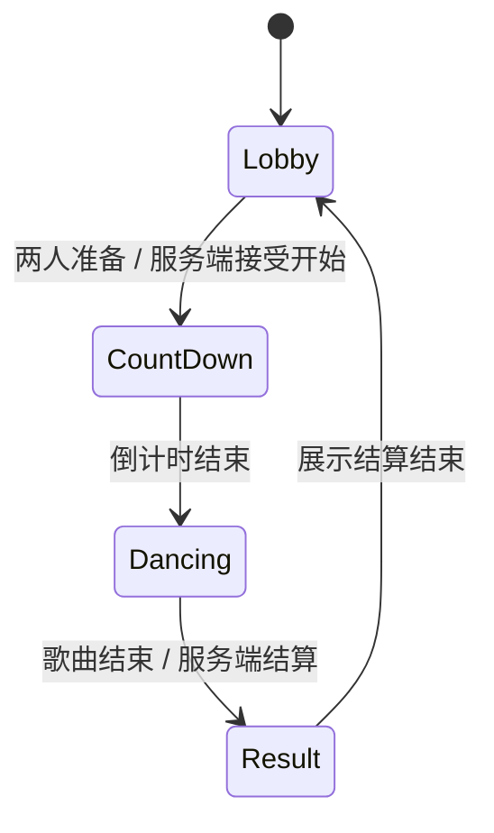

# 热舞多人房间系统开发手册（抖音 SDK + 当前 Lua 框架）

> 目标读者：有策划案、正在使用 Unity + 抖音 SDK + Lua 框架，但还不习惯把玩法拆成代码的开发者。
>
> 本文以当前项目 **Douyin Hot Dance** 为背景。你现在已经有：`GameRoot.lua`、`PlayerModel.lua`、`DataStoreSystem`、`UISystem`、`EvtMsgSystem`，并且决定继续使用 SDK 自动生成的官方 `DouyinActor`，**不再创建自定义网络玩家角色**。

---

## 先记住最重要的一句话

开发不是“把策划案直接翻译成一大段代码”。

每一个玩法都先回答四个问题：

1. **谁触发？** 玩家点按钮、SDK 进房、服务器计时结束，还是其他系统通知？
2. **数据属于谁？** 某个玩家永久拥有、整个房间暂时共享，还是只在当前客户端显示？
3. **谁有权修改？** 玩家客户端、网络对象主权方，还是服务端？
4. **其他人什么时候需要看到结果？** 立刻、下一次进房、还是完全不需要？

只要四个问题回答清楚，代码通常就会自然拆成：UI、数据模型、房间状态、网络同步、表现层五部分。

---

## 1. 你当前项目的基础架构

当前已经形成的正确主流程如下：

```text
抖音 SDK：OnPlayerJoined(本地玩家)
        ↓
GameRoot.lua：DataStoreSystem:LoadData(...)
        ↓
PlayerModel.New(data)
        ↓
IOCContainer:RegisterModel("LocalPlayerModel", playerModel)
        ↓
判断 playerModel:GetXingBie()
 ┌─────────────────────────────┴─────────────────────────────┐
 │ xingBie == 0                                                │ xingBie == 1 或 2
 ▼                                                              ▼
CreateActorUI                                               EnterGame("OldPlayer")
 │                                                              │
 │ SetProfile(xingBie, shiZhuang) 保存成功                      │
 └──────────────────→ _G.HotDanceEnterGame("CreateActor") ────┘
                                  ↓
                              EnterGame()
                                  ↓
                         MainMenuUI / 大厅 / 引导
```

其中职责不要混：

| 文件/系统 | 只负责什么 | 不应该负责什么 |
| --- | --- | --- |
| `GameRoot.lua` | 进房、读档、新老玩家分流、统一进入大厅 | 写按钮细节、逐帧跳舞判定 |
| `PlayerModel.lua` | 本地玩家永久档案与自动保存 | 房间倒计时、其他玩家当前分数 |
| `CreateActorUI.lua` | 选择性别、时装、本地预览、提交创建 | 直接管理大厅所有初始化 |
| `MainMenuUI.lua` | 显示当前模型数据 | 直接请求服务器存档 |
| `DanceRoomController.lua`（之后新增） | 房间内一局跳舞的状态、倒计时、结算 | 玩家永久性别/时装 |
| `EvtMsgSystem` | 同一客户端内模块通知 | 向其他玩家发网络消息 |

### 重要：脚本之间是隔离的

挂在不同 Unity 对象上的 `DouyinScript` 有自己的 Lua 环境。因此：

```lua
-- GameRoot.lua 中定义
function EnterGame()
end

-- CreateActorUI.lua 中不能保证直接看到 EnterGame
EnterGame() -- 可能是 nil
```

跨脚本的两种正确方式：

```lua
-- 方式 A：明确的全局入口。适合“只有一个明确主人”的核心流程。
-- GameRoot Awake
_G.HotDanceEnterGame = EnterGame

-- CreateActorUI
_G.HotDanceEnterGame("CreateActor")
```

```lua
-- 方式 B：EvtMsgSystem。本地多个独立模块都需要知道一件事时使用。
local eventSystem = GetSys("EvtMsgSystem")
eventSystem:On("HotDance_EnterGameCompleted", OnEnterGameCompleted)
eventSystem:Emit("HotDance_EnterGameCompleted", "OldPlayer")
```

`EvtMsgSystem` **仅在当前客户端内部工作，不会同步给其他玩家**。

---

## 2. 多人游戏最容易混淆的三类数据

不要先问“我该不该用网络”，而是先给每一份数据归类。

| 数据类型 | 示例 | 适合的技术 | 生命周期 | 谁能改 |
| --- | --- | --- | --- | --- |
| 玩家永久数据 | `xingBie`、`shiZhuang`、等级、魅力、已解锁歌曲 | `PlayerModel` + `DataStoreSystem` | 跨退出、跨下次进房 | 应由可信逻辑决定；普通外观设置可由本地模型保存 |
| 房间共享状态 | 本局阶段、歌曲 ID、倒计时、房间总分、当前舞台占用 | 网络对象 `---@varSync` | 仅当前房间/本局 | 网络对象主权方；正式对局建议服务端 |
| 瞬时请求/通知 | “我准备好了”“我按下第 3 个节拍”“服务器宣布结算” | `DouyinRemoteEvent` | 一次消息 | 客户端请求；服务端验证后广播 |
| 本地表现 | 当前 UI 是否打开、本地选中按钮、本地预览模型、音量 | 普通 Lua 变量 / Unity UI | 当前客户端 | 当前客户端 |

### 一个判断练习

策划写：“玩家完成跳舞获得 100 魅力。”

不要直接写：

```lua
playerModel:SetMeiLi(playerModel:GetMeiLi() + 100)
```

先拆开：

```text
1. 玩家点击/节拍命中：客户端发起“我认为我命中了”的请求。
2. 服务端或房间主权逻辑：验证本局是否正在跳舞、该玩家是否参与、分数是否合法。
3. 房间内：同步本局分数，所有人立即看到排行榜更新。
4. 结算时：可信逻辑计算奖励。
5. 最后：把最终奖励写入 PlayerModel / DataStore。
```

如果客户端可随时直接改魅力，它也能直接把 `100` 改成 `1000000`。因此，**影响奖励、排行榜、胜负的数据不能只相信客户端。**

---

## 3. 抖音 SDK 与当前框架：分别在什么时候用

### 3.1 SDK 生命周期回调：SDK 告诉你“世界里发生了什么”

你已经在用：

```lua
function OnPlayerJoined(player, evt)
end

function OnPlayerRejoined(player)
end

function OnActorSpawned(actor)
end

function OnActorDespawned(actor)
end
```

本地文档确认：

- `OnPlayerJoined(player, evt)` 的 `evt` 可以是 `CS.PlayerJoinEvent.JoinRoom` 或 `CS.PlayerJoinEvent.RejoinRoom`。
- `OnPlayerJoined` 与 `OnActorSpawned` 的相对顺序不能当成绝对保证；多玩家时更不能假设 Player A 一定先于 Actor A。
- `DouyinActorService.GetLocalActor()` 只有在本地 Actor 创建之后才保证可能取得；不要在太早的 `Awake` 里依赖它。
- 重连会重复一些进入逻辑，所以要有去重标记。

推荐写法：

```lua
local hasLoadedLocalProfile = false

function OnPlayerJoined(player, evt)
    if player == nil or not player.isLocal then
        return
    end

    -- 如果你定义了 OnPlayerRejoined，重连会走那个回调。
    -- 仍然应避免重复读档、重复开 UI。
    if hasLoadedLocalProfile then
        return
    end

    hasLoadedLocalProfile = true
    -- 在这里调用 DataStoreSystem:LoadData
end
```

### 3.2 `EvtMsgSystem`：本地模块之间的广播

框架已有：

```lua
local eventSystem = GetSys("EvtMsgSystem")

eventSystem:On("事件名", 回调函数)
eventSystem:Off("事件名", 回调函数)
eventSystem:Emit("事件名", 参数1, 参数2)
eventSystem:Once("事件名", 回调函数)
```

监听回调的第一个参数固定为事件名：

```lua
local function OnDanceRoomStateChanged(eventName, snapshot)
    print(eventName)
end
```

注意两件事：

1. 事件没有“历史记录”。UI 如果在事件发送后才打开，收不到过去的通知，必须再主动读取当前状态。
2. 当前 `EvtMsgSystem:Emit` 在没有监听者时会打印日志。发送前可以判断：

```lua
if eventSystem ~= nil and eventSystem:HasListener("HotDance_DanceRoomStateChanged") then
    eventSystem:Emit("HotDance_DanceRoomStateChanged", snapshot)
end
```

### 3.3 同步变量：所有客户端都应看到的“当前状态”

同步变量由 `---@varSync` 声明，例如：

```lua
---@varSync syncPhase:int
---@varSync syncSongId:string
---@varSync syncRoundId:int
---@end
```

读取和写入必须使用：

```lua
local phase = syncPhase:GetValue()
syncPhase:SetValue(1)
```

而不是：

```lua
syncPhase = 1 -- 错误：这不是网络同步写法
```

关键规则：

- 同步变量在 `OnNetSpawned()` 后读取才可靠。
- 建议在 `OnNetSpawned()` 中注册 `OnValueChange`。
- **只有网络对象的主权方可以 `SetValue`。**
- 要同步复杂结构时，优先拆成几个基础字段；必要时才 JSON 编码到 `string`，但不要每帧同步 JSON。

### 3.4 `DouyinRemoteEvent`：客户端请求服务端，或服务端广播客户端

远程事件与 `EvtMsgSystem` 完全不同：它可以跨网络。

```text
客户端 UI 点击“准备”
       ↓ FireServer(...)
服务端收到 onServerEvent
       ↓ 校验请求 / 修改房间同步变量
所有客户端收到 syncPhase / syncReadyCount 的变化
       ↓ 刷新自己的 UI 与表现
```

SDK 的方向：

```lua
-- 客户端 → 服务端
ClientToServerEvent:FireServer(...)
ClientToServerEvent.onServerEvent:AddListener(OnServerEventHandle) -- 仅服务端监听

-- 服务端 → 某个客户端 / 所有客户端
ServerToClientEvent:FireClient(player, ...)
ServerToClientEvent:FireAllClients(...)
ServerToClientEvent.onClientEvent:AddListener(OnClientEventHandle) -- 客户端监听
```

远程事件是“请求/通知”，不是永久状态。后进房的玩家不会自动收到过去的远程事件，因此当前房间阶段、歌曲、倒计时等仍应保存到同步变量中。

---

## 4. 从策划案到代码：一个可执行的拆解模板

以后拿到任何功能，用下面这张表写在策划旁边。不要先写代码。

| 策划句子 | 触发者 | 永久数据 | 房间数据 | 权威方 | 本地表现 | 验收方式 |
| --- | --- | --- | --- | --- | --- | --- |
| 玩家创建舞者 | 点击确认 | `xingBie`、`shiZhuang` | 无 | 本地档案保存流程 | 创建 UI / 本地预览 | 重进房后不再进创建界面 |
| 房主发起跳舞 | 点击“开始” | 无 | `phase`、`songId`、`roundId` | 服务端/房间主权 | 倒计时 UI | 双开客户端看到同一倒计时 |
| 玩家准备 | 点击准备 | 无 | `readyCount` 或 ready 表 | 服务端 | 按钮变已准备 | 其他客户端能看到人数变化 |
| 玩家按节拍 | 输入/按钮 | 本局结果后才写奖励 | 本局分数 | 服务端验证 | 本地判定特效 | 连点不能无限加分 |
| 一局结算 | 服务端计时结束 | 魅力、经验、任务进度 | `phase=Result`、排名 | 服务端 | 结算界面 | 重进房仍保留奖励 |

你不需要一开始就做完“大型跳舞游戏”。第一版验收目标必须小到可以在一天内验证：

```text
两名玩家进同一房间
→ 都能点“准备”
→ 服务端开始 3 秒倒计时
→ 两边官方 Actor 都播放同一个舞蹈 Animation
→ 5 秒后停止舞蹈并显示“本局结束”
```

这个版本没有复杂判定、没有排行榜、没有奖励。它只是验证你的房间状态机和网络表现是通的。

---

## 5. 最小可玩 Demo：多人同步跳舞房间

下面的 Demo 使用 **官方 `DouyinActor`**，不会创建自定义网络玩家角色。

它实现四个阶段：

| 数值 | 名称 | 含义 |
| ---: | --- | --- |
| `0` | `Lobby` | 房间等待；玩家可以准备 |
| `1` | `CountDown` | 服务端倒计时 |
| `2` | `Dancing` | 全房间播放舞蹈 |
| `3` | `Result` | 本局结束，等待回到大厅 |

### 5.1 Unity 场景准备

1. 在场景建立一个 GameObject，命名为 `DanceRoomController`。
2. 把它配置为**网络对象/可同步场景对象**，并确保服务端或指定主权方拥有它。
3. 挂载下面的 `DanceRoomController.lua`。
4. 在 Inspector 把一个可用于官方 Actor 的 `Animation` 资源拖给 `danceAnimation`。
5. 场景中放一个“准备”按钮，挂一个 UI 脚本；点击后调用 `RequestReady()`。第一版也可临时用键盘测试。
6. 用至少两个客户端进入同一房间测试。单开只能验证本地表现，不能验证网络同步。

> 这个 Controller 是“房间规则对象”，不是“自定义网络玩家角色”。它与当前“只使用官方 DouyinActor”架构不冲突。

### 5.2 `DanceRoomController.lua`

将此脚本作为 Demo 放入项目，例如：

```text
Assets/GamePlay/HotDance/RoomDance/DanceRoomController.lua
```

```lua
---@var danceAnimation:UnityEngine.Animation
---@varSync syncPhase:int
---@varSync syncSongId:string
---@varSync syncRoundId:int
---@varSync syncReadyCount:int
---@end

-- 客户端向服务端发送“准备”等请求。这个事件不保存房间状态；
-- 房间的真实状态仍由下面的同步变量保存。
local HotDanceRoomRequest = DouyinRemoteEvent("HotDance_Room_Request")

-- 房间阶段。先用数字即可；以后如果拆到共享模块，再统一管理常量。
local PHASE_LOBBY = 0
local PHASE_COUNTDOWN = 1
local PHASE_DANCING = 2
local PHASE_RESULT = 3

local COUNTDOWN_SECONDS = 3
local DANCE_SECONDS = 5

-- 服务端内存数据：仅用于当前这一局，退出房间后可以消失。
local readyPlayers = {}
local phaseEndTime = 0

-- 每个脚本有独立环境。需要给 UI 读取时，显式发布这个 Controller。
function Awake()
    _G.HotDanceRoomController = self.script
end

function OnNetSpawned()
    -- 同步变量完成初始化后再订阅。
    syncPhase:OnValueChange(OnSyncPhaseChanged)
    syncSongId:OnValueChange(OnSyncSongIdChanged)
    syncReadyCount:OnValueChange(OnSyncReadyCountChanged)

    -- 刚进房/后进房也要主动应用当前值，因为它未必能收到“过去的变化事件”。
    ApplyRoomState(syncPhase:GetValue())
    NotifyLocalRoomUI()

    -- 第一版把房间规则放在 Dedicated Server 执行。
    -- 如果你暂时没有 Dedicated Server，必须保证只有 Controller 主权方执行 SetValue；
    -- 不要让每个客户端都同时推进状态机。
    if DouyinApplication.isServer then
        syncPhase:SetValue(PHASE_LOBBY)
        syncSongId:SetValue("")
        syncRoundId:SetValue(0)
        syncReadyCount:SetValue(0)
    end
end

function Start()
    -- 远程事件名应全项目唯一。客户端只发“请求”，服务端决定是否接受。
    if DouyinApplication.isServer then
        HotDanceRoomRequest.onServerEvent:AddListener(OnRoomRequestFromClient)
    end
end

function Update()
    -- 仅服务端推进倒计时和结算，避免每个客户端各算各的。
    if not DouyinApplication.isServer then
        return
    end

    local phase = syncPhase:GetValue()
    if phase == PHASE_COUNTDOWN and UnityEngine.Time.realtimeSinceStartup >= phaseEndTime then
        ServerStartDancing()
    elseif phase == PHASE_DANCING and UnityEngine.Time.realtimeSinceStartup >= phaseEndTime then
        ServerFinishRound()
    elseif phase == PHASE_RESULT and UnityEngine.Time.realtimeSinceStartup >= phaseEndTime then
        ServerReturnToLobby()
    end
end

-- ==================== 客户端请求 → 服务端裁定 ====================

-- UI 点击“准备”时调用。客户端不能直接 SetValue(syncReadyCount)。
function RequestReady()
    if DouyinApplication.isServer then
        -- 本地服务器测试时也走同一份服务器逻辑。
        local player = DouyinPlayerService.GetLocalPlayer()
        if player ~= nil then
            ServerSetPlayerReady(player)
        end
        return
    end

    HotDanceRoomRequest:FireServer("Ready")
end

function OnRoomRequestFromClient(player, args)
    if player == nil or args == nil then
        return
    end

    -- object[] 在 Lua 中通常按 0 开始索引。第一次接 SDK 时请先 print(args)
    -- 确认你当前 SDK 绑定的实际索引形式；本项目文档的 RemoteEvent 回调参数就是 args。
    local command = args[0]
    if command == "Ready" then
        ServerSetPlayerReady(player)
    end
end

function ServerSetPlayerReady(player)
    if not DouyinApplication.isServer or player == nil then
        return
    end

    if syncPhase:GetValue() ~= PHASE_LOBBY then
        return
    end

    local openID = player.playerOpenID
    if openID == nil or readyPlayers[openID] then
        return
    end

    readyPlayers[openID] = true
    local count = 0
    for _ in pairs(readyPlayers) do
        count = count + 1
    end
    syncReadyCount:SetValue(count)

    -- Demo 规则：至少两人准备才开始。
    if count >= 2 then
        ServerStartCountDown("demo_song_001")
    end
end

-- ==================== 服务端房间状态机 ====================

function ServerStartCountDown(songId)
    if not DouyinApplication.isServer or syncPhase:GetValue() ~= PHASE_LOBBY then
        return
    end

    syncSongId:SetValue(songId)
    syncPhase:SetValue(PHASE_COUNTDOWN)
    phaseEndTime = UnityEngine.Time.realtimeSinceStartup + COUNTDOWN_SECONDS
end

function ServerStartDancing()
    if not DouyinApplication.isServer then
        return
    end

    syncPhase:SetValue(PHASE_DANCING)
    phaseEndTime = UnityEngine.Time.realtimeSinceStartup + DANCE_SECONDS
end

function ServerFinishRound()
    if not DouyinApplication.isServer then
        return
    end

    syncPhase:SetValue(PHASE_RESULT)
    phaseEndTime = UnityEngine.Time.realtimeSinceStartup + 3
end

function ServerReturnToLobby()
    if not DouyinApplication.isServer then
        return
    end

    readyPlayers = {}
    syncReadyCount:SetValue(0)
    syncSongId:SetValue("")
    syncRoundId:SetValue(syncRoundId:GetValue() + 1)
    syncPhase:SetValue(PHASE_LOBBY)
end

-- ==================== 同步变量变化 → 每个客户端各自表现 ====================

function OnSyncPhaseChanged(currentPhase, previousPhase)
    ApplyRoomState(currentPhase)
    NotifyLocalRoomUI()
end

function OnSyncSongIdChanged(currentSongId, previousSongId)
    NotifyLocalRoomUI()
end

function OnSyncReadyCountChanged(currentCount, previousCount)
    NotifyLocalRoomUI()
end

function ApplyRoomState(phase)
    local actors = DouyinActorService.GetActors()
    if actors == nil then
        return
    end

    for _, actor in pairs(actors) do
        if actor ~= nil then
            if phase == PHASE_DANCING then
                -- SDK 的官方 Actor 直接播放 Animation，不需要自定义网络角色。
                if danceAnimation ~= nil then
                    actor:PlayAnimation(danceAnimation)
                end
            else
                actor:StopAnimation()
            end
        end
    end
end

function GetRoomSnapshot()
    return {
        phase = syncPhase:GetValue(),
        songId = syncSongId:GetValue(),
        roundId = syncRoundId:GetValue(),
        readyCount = syncReadyCount:GetValue(),
    }
end

function NotifyLocalRoomUI()
    local eventSystem = GetSys("EvtMsgSystem")
    if eventSystem == nil then
        return
    end

    local eventName = "HotDance_DanceRoomStateChanged"
    if eventSystem:HasListener(eventName) then
        eventSystem:Emit(eventName, GetRoomSnapshot())
    end
end

function OnDestroy()
    if DouyinApplication.isServer and HotDanceRoomRequest ~= nil then
        HotDanceRoomRequest.onServerEvent:RemoveListener(OnRoomRequestFromClient)
    end

    if _G.HotDanceRoomController == self.script then
        _G.HotDanceRoomController = nil
    end
end
```

> 如果当前 SDK 的 `object[] args` 下标不是 `0`，不要猜。先在 `OnRoomRequestFromClient` 中打印 `args`，或按本地 `DouyinRemoteEvent` API 示例验证。本文故意把这个兼容点标出，因为不同 Lua/XLua 绑定的数组访问形式可能不同。

### 5.3 `DanceRoomUI.lua`：本地 UI 如何读房间状态

此 UI 不直接保存 DataStore，也不直接改同步变量。它只做两件事：显示状态、发送“准备请求”。

```lua
---@var txtRoomState:UnityEngine.UI.Text
---@var txtReadyCount:UnityEngine.UI.Text
---@var btnReady:UnityEngine.UI.Button
---@end

local EVENT_NAME = "HotDance_DanceRoomStateChanged"
local eventSystem

function OnEnable()
    eventSystem = GetSys("EvtMsgSystem")
    if eventSystem ~= nil then
        eventSystem:On(EVENT_NAME, OnDanceRoomStateChanged)
    end

    btnReady.onClick:AddListener(OnReadyClick)
    RefreshFromController()
end

function OnDisable()
    if eventSystem ~= nil then
        eventSystem:Off(EVENT_NAME, OnDanceRoomStateChanged)
    end
    btnReady.onClick:RemoveListener(OnReadyClick)
    eventSystem = nil
end

function OnReadyClick()
    if _G.HotDanceRoomController == nil then
        print("[DanceRoomUI] DanceRoomController 尚未就绪")
        return
    end

    _G.HotDanceRoomController.RequestReady()
end

function OnDanceRoomStateChanged(eventName, snapshot)
    Refresh(snapshot)
end

function RefreshFromController()
    if _G.HotDanceRoomController == nil then
        return
    end
    Refresh(_G.HotDanceRoomController.GetRoomSnapshot())
end

function Refresh(snapshot)
    if snapshot == nil then
        return
    end

    if txtReadyCount ~= nil then
        txtReadyCount.text = "已准备：" .. tostring(snapshot.readyCount)
    end

    if txtRoomState ~= nil then
        local text = "等待中"
        if snapshot.phase == 1 then
            text = "倒计时"
        elseif snapshot.phase == 2 then
            text = "跳舞中"
        elseif snapshot.phase == 3 then
            text = "结算中"
        end
        txtRoomState.text = text
    end
end
```

### 5.4 这个 Demo 验证什么，不验证什么

| 已验证 | 暂未实现 |
| --- | --- |
| 两个客户端共同准备 | 精确音游节拍判定 |
| 服务器唯一推进倒计时、跳舞、结算 | 防作弊分数验证 |
| 同步变量让所有客户端看到相同阶段 | 多歌曲配置表 |
| 官方 `DouyinActor` 播放/停止 Animation | 个人排行榜、奖励、赛季 |
| UI 从快照读取、通过请求改变状态 | 断线后本局恢复 |

当这版跑通，才增加下一项。一次只增加一个变量、一种状态或一个按钮。

---

## 6. 跳舞系统应该如何逐步实现

不要一开始就做“节拍、判定线、连击、排行榜、特效、奖励”全部内容。建议按五个可验收版本开发。

### V1：同步播放舞蹈

目标：两名玩家准备后，所有官方 Actor 同时播放一个 Animation，数秒后停止。

你只需要：

- 房间状态机；
- `syncPhase`；
- 一个 `Animation`；
- `DouyinActor:PlayAnimation(danceAnimation)`；
- `DouyinActor:StopAnimation()`。

官方 API 的 `PlayAnimation` 接收的是 `Animation`，不是让你给自定义模型挂 `Pet` 组件。当前项目使用官方 `DouyinActor`，舞蹈表现先以 SDK Actor 支持的 Animation 为准。

### V2：本地节拍 UI

目标：只做本地可见的节拍条和按键判定，不写奖励、不联网提交分数。

数据：

```text
歌曲配置（本地只读）：BPM、节拍时间数组、按键序列
本地运行时：当前节拍、连击、Perfect/Good/Miss
```

这一层是纯表现和输入练习，先确保 UI、时间轴、按钮都正确。

### V3：房间内成绩同步

目标：其他人能看见你的分数，但还不发永久奖励。

方案：

- 客户端用 `DouyinRemoteEvent:FireServer("Hit", ...)` 提交输入；
- 服务端检查当前是否为 `Dancing`、该玩家是否在本局、事件是否过频；
- 服务端累加房间内分数；
- 用同步变量/同步 Dictionary/低频 JSON 快照同步排行榜。

不要用“每帧把所有玩家成绩 JSON 到同步变量”。应只在分数变化或固定低频（例如 5～10 次/秒）更新。

### V4：结算与永久奖励

目标：一局结束后把可信的最终奖励写入玩家档案。

正确顺序：

```text
服务端结束本局
  ↓
计算每人最终分数、名次、奖励
  ↓
通知对应客户端显示结算
  ↓
将最终奖励写入永久存档
  ↓
MainMenuUI 刷新 PlayerModel 的经验/魅力显示
```

要注意：当前 `PlayerModel` 是本地玩家档案模型。若服务端负责奖励结算，需要设计服务端数据写入或可靠的服务端授权流程；不要把“客户端自己报的分数”直接变成永久魅力。

### V5：复杂玩法

确认前四版稳定后，再做：

- 队伍、舞台位置；
- 多首歌和投票；
- 连击特效、表情、互动；
- 每日任务；
- 排行榜（使用 `OrderedDataStore`）；
- 断线重连恢复本局 UI；
- 赛季、活动、商业化。

---

## 7. DataStore：永久数据的正确思考方式

你当前的档案结构可继续类似这样：

```lua
{
    xingBie = 1,        -- 0 未创建、1 男、2 女
    shiZhuang = 10001,
    customId = "",
    laoWanJia = true,
    xinShouJinDu = 0,
    meiLi = 0,
    jingYan = 0,
}
```

### 7.1 哪些应该放进 `PlayerModel`

适合：

- 角色创建结果；
- 永久经验、魅力、货币；
- 已解锁时装、歌曲、称号；
- 新手流程完成进度；
- 每日奖励领取日期。

不适合：

- 当前房间倒计时；
- 当前这局还有几秒；
- 其他玩家临时是否准备；
- 每一帧的舞蹈位置；
- 未结算的临时分数。

### 7.2 你当前的 `DataStoreSystem` 存储方式

当前项目是：

```lua
dataStoreSystem:LoadData(
    "Hot_Dance",
    "player_" .. player.playerOpenID,
    "profile",
    callback
)
```

保存时必须使用相同的：

```text
GameName = "Hot_Dance"
storeKey = "player_" .. playerOpenID
dataKey = "profile"
```

不要读取 `Hot_Dance` 却保存到另一个 `my_game`，否则下次进房会像没有存过档。

本地 API 文档还说明，一个 `DataStore` 的独立 key 数量上限是 1000。实践上应保持：

```text
一个玩家一个 scope/storeKey
  └─ 少量固定 dataKey，例如 profile、inventory、settings
```

不要为每个玩家在同一个全局 store 下新建一个独立 key，人数多后会到上限。

### 7.3 “改动就存”不等于“每帧都存”

适合立即保存：

- 选定性别、时装；
- 领取一次奖励；
- 完成一局结算；
- 解锁一个物品。

不适合立即保存：

- 每一帧角色位置；
- 每个节拍按键；
- 每秒倒计时；
- 每次 UI 拖动滑条。

经验/魅力若在一局里会多次变动，先只在内存累积，**结算时提交一次最终值**。这既省请求，也能降低异步写入顺序造成覆盖的风险。

---

## 8. 状态机：不要把所有 `if` 堆在一起

“状态机”不是高级名词，它只是把“现在能做什么”写清楚。

### 8.1 房间状态机



每个状态都要列出三件事：

| 状态 | 允许什么 | 禁止什么 | 离开条件 |
| --- | --- | --- | --- |
| Lobby | 准备、选歌、进出舞台 | 计分 | 准备人数满足 |
| CountDown | 取消准备（可选） | 开始计分、重新选歌 | 服务端时间到 |
| Dancing | 提交节拍输入 | 换歌、重复开始 | 歌曲结束 |
| Result | 看结算、领奖 | 再次计分 | 展示结束 |

把这些规则写在 `ServerStartCountDown`、`ServerStartDancing`、`ServerFinishRound` 中，而不是散落在多个 UI 的按钮事件里。

### 8.2 玩家状态与房间状态不同

玩家状态举例：`未创建角色`、`大厅`、`正在跳舞`、`观看结算`。

房间状态举例：`等待玩家`、`倒计时`、`跳舞中`、`结算中`。

两者不要混成一个 `state`：

```text
房间已经 Dancing，某位玩家仍可能 Loading / Disconnect / Spectating。
```

第一版可以只有房间状态；确实需要“每个玩家的准备/分数/掉线状态”时，再增加服务端字典或单独的玩家房间数据。

---

## 9. 常见错误清单（你已经遇到过其中一些）

| 现象 | 常见原因 | 解决方式 |
| --- | --- | --- |
| `global 'EnterGame' is nil` | 不同 `DouyinScript` 的 Lua 环境隔离 | 通过 `_G.HotDanceEnterGame` 暴露唯一入口，或用 `EvtMsgSystem` |
| `global 'CreateActorUI' is nil` | GameRoot 直接访问另一个 UI 脚本表 | 在 GameRoot 直接调用 SDK API；不要跨脚本直接用 UI 表 |
| `eventSystem is nil` | `Awake` 早于 `EvtMsgSystem` 注册 | 在 `Start`/重试注册时判空；销毁时 `Off` |
| 新玩家每次仍进创建页面 | 保存 GameName 与读取 GameName 不一致，或 `xingBie` 没存成功 | 统一 `Hot_Dance`，成功后读档复测 |
| `attempt to concatenate a function value` | 把 Model/脚本对象而不是纯 `_data` 表交给 JSON | 保存纯数据快照，不能保存 `self` |
| 同步变量不生效 | 在非主权方 SetValue，或过早读写 | 放在 `OnNetSpawned` 后，只让权威方写 |
| 两个客户端倒计时不同 | 每个客户端自己 `Update` 推进阶段 | 只让服务端推进，客户端只响应同步状态 |
| 后进玩家看不到跳舞 | 只发过一次 RemoteEvent，没有持久状态 | `syncPhase` 保存当前阶段，进房时主动 `ApplyRoomState` |
| `OnPlayerJoined` 重连时重复初始化 | 没处理重连/没做去重 | `OnPlayerRejoined` 或本地标记防重 |

---

## 10. 建议你的实际开发顺序（四周示例）

不要求你每天都能写大量代码；每一步只追求一个清晰的可验证结果。

### 第 1 周：把当前大厅稳定下来

- [ ] 新玩家创建角色，退出重进后进入大厅；
- [ ] 老玩家直接进入大厅；
- [ ] `MainMenuUI` 能显示 `playerName`、经验、魅力；
- [ ] 不再有跨脚本直接访问 `CreateActorUI` / `EnterGame` 的 nil 报错；
- [ ] 了解 `OnPlayerJoined`、`OnActorSpawned`、`OnPlayerRejoined` 的区别。

### 第 2 周：做 V1 跳舞房间

- [ ] 建 `DanceRoomController` 网络对象；
- [ ] 配置 `syncPhase` 与 `syncReadyCount`；
- [ ] 双开客户端验证准备人数同步；
- [ ] 服务端倒计时后，双方官方 Actor 播放同一个动作；
- [ ] 自动停止并回到 Lobby。

### 第 3 周：做本地节拍与房间分数

- [ ] 单机本地节拍条、Perfect/Good/Miss；
- [ ] RemoteEvent 发请求；
- [ ] 服务端验证状态、节流、累加分数；
- [ ] 低频同步排行榜。

### 第 4 周：结算与玩家成长

- [ ] 服务端产生最终结算；
- [ ] UI 展示名次和奖励；
- [ ] 可靠地更新经验/魅力；
- [ ] 重进房验证永久数据仍在；
- [ ] 最后才接每日任务、排行榜等扩展内容。

---

## 11. 每次写代码前的五分钟检查表

```text
[ ] 这个功能的“开始”和“结束”是什么？
[ ] 这份数据是永久、房间共享，还是纯本地？
[ ] 谁拥有最终决定权？客户端、主权对象还是服务器？
[ ] 后进房玩家要看到当前结果吗？如果要，用同步变量，不要只发事件。
[ ] 断线重连后这段逻辑会不会再跑一次？是否会重复创建/重复奖励？
[ ] UI 是显示数据，还是偷偷修改了房间规则？规则应放在 Controller/服务端。
[ ] 是否已经为这一小步写了明确的测试方法？
```

如果你只能记住一个开发顺序，就记住：

```text
先写状态和数据归属
  ↓
再写谁可以修改
  ↓
再写网络同步
  ↓
最后做 UI、特效、音效
```

UI 做得再漂亮，如果数据归属和权威方没想清楚，网络游戏一定会出现重复奖励、不同步、重连错乱或作弊问题。反过来，先把最小状态机和数据链路跑通，后面的表现内容就能稳步叠加。

---

## 12. 本文查阅的本地资料

- [同步变量.md](</D:/Work Env/Docs/虚拟世界创作文档/同步变量.md>)：同步变量声明、主权、`OnNetSpawned`、`OnValueChange`。
- [世界生命周期和调用时序.md](</D:/Work Env/Docs/虚拟世界创作文档/世界生命周期和调用时序.md>)：Player、Actor、重连与网络对象时序。
- [DouyinScript.OnPlayerJoined.md](</D:/Work Env/Docs/虚拟世界API参考/DouyinScript.OnPlayerJoined.md>)：`JoinRoom` / `RejoinRoom`。
- [DouyinRemoteEvent.md](</D:/Work Env/Docs/虚拟世界API参考/DouyinRemoteEvent.md>)、[FireServer.md](</D:/Work Env/Docs/虚拟世界API参考/DouyinRemoteEvent.FireServer.md>)、[FireAllClients.md](</D:/Work Env/Docs/虚拟世界API参考/DouyinRemoteEvent.FireAllClients.md>)：跨网络事件。
- [DouyinActor.PlayAnimation.md](</D:/Work Env/Docs/虚拟世界API参考/DouyinActor.PlayAnimation.md>)、[DouyinActor.StopAnimation.md](</D:/Work Env/Docs/虚拟世界API参考/DouyinActor.StopAnimation.md>)：官方 Actor 动画控制。
- [DouyinDataStore.SetData.md](</D:/Work Env/Docs/虚拟世界API参考/DouyinDataStore.SetData.md>)：DataStore key 数量限制与存储注意事项。
