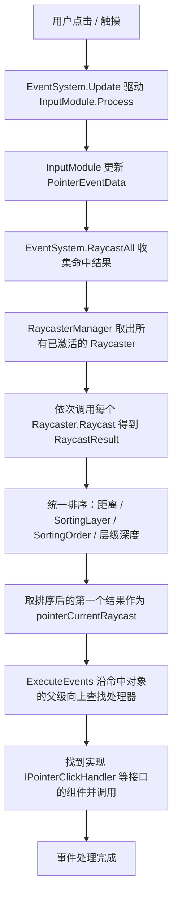

# Unity UI RayCaster 是如何传递的？

一句话总结：**UI 事件并不是“UI 自己收到的”，而是 EventSystem 每一帧驱动 InputModule，让场景中所有已激活的 Raycaster 做射线检测，把命中结果统一排序，再通过 ExecuteEvents 把事件交给命中的 GameObject——并沿着它的父级逐层向上“冒泡”，直到找到能处理该事件的组件。**

## 参与的角色

| 组件 / 类                                 | 职责                                                                     |
| -------------------------------------- | ---------------------------------------------------------------------- |
| **EventSystem**                        | 事件中枢。每帧调用 InputModule 的 `Process()`，并提供 `RaycastAll()` 统一收集、排序所有射线命中结果 |
| **InputModule**（StandaloneInputModule） | 轮询鼠标 / 键盘 / 触摸输入，把原始输入转换成指针事件（PointerDown、PointerClick、Drag 等）         |
| **RaycasterManager**                   | 静态管理器，维护场景中所有“已启用”的 Raycaster 列表（组件 `OnEnable` 时注册、`OnDisable` 时注销）    |
| **BaseRaycaster**（抽象基类）                | 所有 Raycaster 的基类，定义 `Raycast()`、`eventCamera` 等                        |
| **GraphicRaycaster**                   | 命中 Canvas 上勾选了 **Raycast Target** 的 Graphic（UI 图形）                     |
| **Physics Raycaster**                  | 命中带 3D **Collider** 的对象（挂在相机上）                                         |
| **Physics 2D Raycaster**               | 命中带 **Collider2D** 的对象（挂在相机上）                                          |
| **RaycastResult**                      | 一次射线检测的结果：gameObject、distance、depth、sortingLayer/Order、module 等        |
| **ExecuteEvents**                      | 事件执行工具，沿 Transform 层级向上查找并调用实现了对应事件接口的组件                               |

## 事件传递流程

## 分步说明

1. **谁发起**：场景里要有 EventSystem（通常还会自带 StandaloneInputModule）。EventSystem 每帧调用 InputModule 的 `Process()`，由它轮询鼠标、触摸、键盘输入。
2. **收集命中**：发生按下 / 抬起等操作时，InputModule 调用 `EventSystem.RaycastAll()`。EventSystem 从 RaycasterManager 拿到所有已激活的 Raycaster（场景里的 GraphicRaycaster、Physics Raycaster 等全部参与），逐个调用它们的 `Raycast()`，把所有命中结果追加到同一个列表。
3. **统一排序**：所有 Raycaster 的结果放在一起排序，规则大致是：
   - 屏幕空间叠加（Screen Space Overlay）优先于相机 / 世界空间（Screen Space Camera / World Space）；
   - **Sorting Layer / Sorting Order** 更大的 Canvas 优先（画得越靠前，越先命中）；
   - 同一 Canvas 内，**depth**（层级渲染深度，即谁画在前面）更大的 Graphic 优先；
   - 距离相机更近的结果优先（2D/3D 物理物体与 UI 混在一起时靠它排序）。
4. **取最前**：InputModule 把排序后的第一个结果赋给 `pointerData.pointerCurrentRaycast`，这就是“当前指针落在谁身上”。
5. **派发事件**：事件不会只发给这一个对象。`ExecuteEvents.ExecuteHierarchy` 从命中的 GameObject 开始，沿着 transform 的父级逐层向上查找“谁实现了对应接口”（例如 `IPointerClickHandler`），找到就调用；一路找不到就冒泡到根，仍然没有则丢弃。
6. **不同事件各走一遍**：指针进入 / 退出、按下 / 抬起、点击、拖拽、放置、滚动等，都遵循同一套“命中 → 排序 → 派发”的逻辑。其中按下、抬起、点击、滚动、放置、结束拖拽等会沿父级冒泡；指针进入 / 退出和拖拽过程（BeginDrag / Drag）则直接在目标对象上执行。

## 几个容易混淆的点

- **Raycast Target 才是“能不能被射线命中”的开关**。Graphic（Image / Text 等）只有勾选 **Raycast Target** 才会被 GraphicRaycaster 命中。Button 的 **Interactable** 只决定“能不能交互”，并不会让射线打不到它。
- **CanvasGroup.blocksRaycasts**：设为 false 的 CanvasGroup 下所有 Graphic 都不会被 GraphicRaycaster 命中。这是临时禁用整块 UI 交互的常用手段，不用逐个改 Raycast Target。
- **想让 2D / 3D 物体收到 UI 事件**：需要在相机上挂 Physics Raycaster / Physics 2D Raycaster。GraphicRaycaster 的 Blocking Objects 只是“挡射线”，不会把事件发给物理物体（详见 [[02-01-GraphicRaycaster-中文文档]]）。
- **命中优先 ≠ 注册顺序**：谁先命中由排序规则决定（画在前面、距离近者优先），和组件在场景里的添加顺序无关。

## 相关文档

- [[02-00-Raycasters-中文文档]] —— 三种 Raycaster 的作用与 Event System 的使用方式
- [[02-01-GraphicRaycaster-中文文档]] —— 图形射线投射器（含 Blocking Objects 详解）
- [[02-02-UnityEngine-UI-GraphicRaycaster-中文文档]] —— GraphicRaycaster 脚本 API
