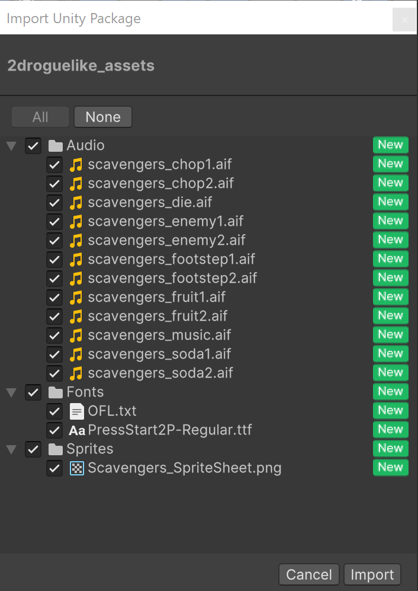

# Set up your project（设置你的项目）

| 项目 | 信息 |
| --- | --- |
| 类型 | 教程（Tutorial） |
| 难度 | 初学者（Beginner） |
| 经验值 | +10 XP |
| 时长 | 10 分钟 |
| 评论 | 340（2661） |

## 概要（Summary）

你已经完成了《2D 入门：冒险游戏》（2D Beginner: Adventure Game），对 Unity 的运作方式也已不再陌生——但接下来该做什么？如何把一个想法变成可运行的应用？

本《2D 肉鸽游戏》（2D Roguelike）教程将会：

- 帮助你学会如何从想法中整理任务、排定优先级
- 深入讲解更复杂的编程概念
- 探索如何在 Unity 中运用像素画风

在本课程中，你将创建一个项目，其中会使用到我们提供的图形和音频资源。

这可能使本教程的完成时间稍长一些，但到课程结束时，你将亲手创造并编写出一款游戏完整的「垂直切片」（vertical slice）！垂直切片是大型游戏中的一个可运行部分，用来测试最终游戏的外观和玩法。

你还会经历从想法出发、为游戏制作原型的完整流程：编写代码，并在遇到问题或瓶颈时对代码进行重构，让它变得更优雅、更有用。

### 资源

- 2D 肉鸽游戏教程资源包（2D Roguelike Tutorial Assets）

## 1. 概述（Overview）

肉鸽游戏（roguelike）是一种传统游戏类型，多年来演变出许多形态，但通常具有一些共同要素，例如：

- **程序化生成**：游戏关卡并非由人工设计、始终如一，而是由代码随机组装而成，因此每次游玩时，关卡都会有所不同。
- **网格制**：游戏在网格上进行，所有实体（玩家和敌人）都在网格上逐格移动。
- **回合制**：在玩家采取行动（移动、攻击等）之前，游戏中不会发生任何事情，这让玩家有机会在每次行动之间进行策略思考。

在本教程中，你首先要为这款游戏创建 Unity 项目；随后导入整个教程中都会用到的资源，配置好全部渲染设置，并设置 Unity Version Control（Unity 版本控制）。最后，在动手创建之前，你还会梳理关于游戏的想法，制定实现计划。

想试玩你将要制作的示例游戏，可以看看我们在 Unity Play 上发布的 2D Roguelike 版本。

## 2. 创建并准备你的项目（Create and prepare your project）

请按照以下说明创建项目，并做好开工准备：

1. 打开 Unity Hub 并安装 Unity 6。
2. 使用编辑器版本 6.000 LTS 新建项目，将其命名为 "Roguelike"，并选择 Universal 2D 模板。
3. 点击 Create project（创建项目）。

新的 Roguelike 项目在 Unity 中打开后，你还需要修改该项目的部分默认设置。

4. 在 Project（项目）窗口中，选择 Assets > Settings，然后选择 Renderer2D 文件。

    这就是渲染管线在游戏中显示资源时所用的全部设置。

5. 在 Inspector（检查器）窗口的 General（常规）部分下，将 Default Material Type（默认材质类型）从 Lit 改为 Unlit。

Lit（受光）材质会受到动态光照的影响——灯光可以移动、打开或关闭，从而获得更逼真的效果。但 Lit 材质在渲染时需要额外的计算。由于本项目采用传统像素画风格，光照直接绘制在精灵上，并不需要动态光照，因此应该使用 Unlit（不受光）材质，因为它更简单，渲染也更快。

现在，每当你创建新的精灵时，它都会自动获得 Unlit 材质，而不再是 Lit 材质。

至此，你的项目已经准备就绪，可以开始创作了。

### Unity 版本控制（Unity Version Control）

本教程不会详细介绍 Unity Version Control，你可以参阅《Get started with Unity Version Control》项目来了解更多信息。

Unity Version Control 允许你为项目状态拍摄快照，并将其保存到服务器上。这可以确保以下几点：

- **保护项目免于丢失**：即使电脑出现问题，项目也已安全地保存在线上。
- **在多台机器上工作**：因为所有内容都保存在线上，你可以在多台设备间继续工作。
- **多人远程协作**：多人可以在同一项目上远程共享各自的修改。
- **回滚文件**：你可以将任何文件还原到之前保存的状态。当你尝试了新想法却行不通、需要回退到最后一个可用状态时，或者突然出现 bug、需要排查自它出现以来做了哪些改动时，这一点尤其有用。

## 3. 导入资源（Import assets）

我们为你准备了完成本项目所需的全部资源。请按照以下说明下载并导入这些资源：

1. 下载资源包，解压文件，然后将其拖放到 Project 窗口的 Assets 文件夹中。

    Import Unity Package（导入 Unity 包）窗口会打开，列出该包将导入到你项目中的所有资源。

    

    这个资源包中包含你完成本项目所需的全部资源。

2. 点击 Import（导入）。

精灵共有三种不同的主题，因此当教程指示你使用某个特定资源时，你可以任选一种喜欢的主题。

所有资源都已预先配置好（精灵表已切分为多个精灵，其 PPU 已设置为正确的值，使角色大小为 1 个单位，等等）。如果你想使用自己的资源，又需要回顾这些设置及其原理，请参阅[手册]，或查阅《2D 入门：冒险游戏》课程中的相关教程。

## 4. 设置固定宽高比（Set a Fixed Aspect Ratio）

为了确保游戏始终按你的预期适配屏幕，你可以将 Game 视图设置为固定的宽高比。

默认情况下，Unity 的 Game 视图使用 Free Aspect（自由宽高比），它会自动适应窗口大小，有时可能会拉伸或裁剪游戏画面。

在本步骤中，你将设置分辨率为 1080 × 1080 的固定 1:1 宽高比，使你的布局保持一致。

之后，你可能需要调整屏幕边框，确保它们与新的显示形状正确对齐。

要设置固定宽高比：

- 在 Game（游戏）窗口中，打开 Aspect Ratio（宽高比）下拉菜单（很可能显示为 Free Aspect）。
- 选择 Add New Item（+）（添加新项）。
- 在 Type（类型）中，选择 Fixed Resolution（固定分辨率）。
- 将 Width（宽度）和 Height（高度）设置为 1800 × 1800，然后点击 OK。

通过锁定宽高比，无论玩家的屏幕尺寸或形状如何，你的游戏布局都会始终按预期显示。

## 5. 架构设计（Architecturing）

当你对新项目有了想法时，你常常会这样问自己：「我从哪里开始？」交互式应用是复杂的系统，其中的事物往往相互依赖才能运转，因此一个好的起点是花些时间，把你的想法拆解成一个个可执行的任务块。

例如，假设你想制作一个简单的赛车游戏。首先，你可以从写下游戏内容的描述开始：

「我需要玩家驾驶一辆汽车绕赛道行驶，其他汽车与它并排竞速。」

根据这段简短描述，你可以列出游戏所需的一些要素：

- 赛道——游戏环境的主要部分。
- 玩家和对手的汽车。
- 对手的计算机控制行为。

逐项审视这些要素，你就能开始发现它们之间的依赖关系：一条赛道，只有当有东西能在其上行驶并离开时才有意义；而对手需要汽车来操控、需要赛道来追随。因此，自然的顺序似乎是这样的：

- 首先，在空地上编写汽车控制代码，只专注于汽车的物理和移动。
- 然后编写赛道，让控制汽车成为一项真正的任务（例如驶出赛道会受到惩罚等）。
- 最后，编写其他汽车尝试自动跟随赛道的行为。

通过这样做，你就创建了一份任务清单，也消除了不知道先做什么的茫然感。你创建的清单永远不会一劳永逸，顺序也难免需要调整，这都很正常。没有哪个计划能在与现实接触后毫发无损，但至少现在你有了一盏指路明灯！

让我们用同样的流程来对待你在本教程中要制作的游戏。

### 2D 肉鸽游戏架构（Roguelike 2D Game Architecture）

首先，让我们定义这款游戏将具有的一些特征：

- 游戏的场景由一张由方形单元格组成的棋盘构成。
- 棋盘的组成会在游戏开始时以及每个关卡中随机生成。这被称为程序化生成，因此不会有两个完全相同的场景。
- 玩家可以移动到任何直接相邻的单元格：左、右、上、下。
- 游戏采用回合制，即用户做出行动之前不会发生任何事情，而每次行动都会让游戏推进（tick）一个单位。这个「tick」就是游戏的基础时间单位。
- 游戏的目标是让玩家角色到达出口单元格，从而进入下一关。
- 玩家开始时拥有一定数量的食物，游戏每 tick 一次，就会消耗一个单位的食物。
- 关卡中会随机放置墙壁，阻止玩家随意移动。不过，墙壁可以通过反复攻击而被摧毁。
- 如果玩家的食物耗尽，游戏就会结束——这就是「游戏结束」（game over）！
- 棋盘上存在敌人，敌人会在每个 tick 时移动（也就是说，只有玩家角色移动时，敌人才会移动）。
- 如果敌人移动到玩家角色所在的位置，就会消耗玩家一定数量的食物来伤害他们。
- 如果玩家角色移动到敌人所在的位置，就会伤害敌人，使其减少 1 点生命值。
- 一旦敌人的生命值归零，它就会被移出棋盘。
- 有些单元格含有食物。当玩家角色进入这些单元格时，就会收集到食物。

现在，根据这段游戏描述，你可以列出所有需要完成的任务，并尝试根据它们之间的依赖关系来排序。你可以把它当作一次练习自行尝试，但本教程将遵循的顺序如下：

1. 一切都发生在游戏棋盘内部，而单元格是空间的基本单位，所以这很可能是你最先需要的东西。你应该从编写代码开始，在每个关卡中随机生成一张由方形单元格组成的棋盘。
2. 然后，你需要创建一个玩家角色，使其能够被放置在棋盘上并在其中移动。完成后，你就可以开始添加特殊规则，例如不允许玩家移动到某些特殊单元格上。
3. 游戏是回合制的，每次角色移动时都会 tick。既然你现在有了一个会移动的角色，就可以添加回合系统了。
4. 既然游戏会「tick」，我们终于可以添加食物资源了。
5. 我们现在也可以添加墙壁了，因为刚刚才加入了单元格内的可收集物（食物资源）。
6. 下一步是添加出口单元格，以结束关卡。检测玩家何时进入某个单元格，不仅对这一部分必不可少，对收集你之前创建的食物可收集物也同样必要。
7. 有了出口单元格，是时候开始处理「游戏循环」（gameplay loop）了。你希望在玩家每次到达出口时增加关卡编号、生成新关卡，并处理食物归零时的游戏结束情况。这时你可以创建一个 GameManager（游戏管理器），负责初始化游戏（生成棋盘、放置玩家等），并检查、处理「游戏结束」的条件。
8. 最后，你可以添加敌人来增加游戏的复杂度。

## 6. 后续步骤（Next steps）

你已经创建了项目，并思考了游戏的运作方式；在下一个教程中，你将开始认真制作游戏——首先要创建一张游戏棋盘，让游戏在上面展开！

---

*原文：Unity Learn · Set up your project（Unity Technologies）*
