# Add a game board（添加游戏棋盘）

| 项目 | 信息 |
| --- | --- |
| 类型 | 教程（Tutorial） |
| 难度 | 初学者（Beginner） |
| 经验值 | +0 XP |
| 时长 | 30 分钟 |
| 评论 | 23（1194） |

## 概要（Summary）

在上一教程中，你梳理了 2D 肉鸽游戏的关键要素；现在，是时候动手了！

到本教程结束时，你将完成以下内容：

- 一个基础的游戏棋盘，启动时会随机生成瓦片。
- 一圈棋盘边框，把玩家角色「困」在棋盘范围之内。
- 使用 Unity Version Control 将更改提交（check in）到项目的仓库中，这样你既不会丢失任何进度，也可以把游戏状态回滚到之前的某个版本。

## 1. 概述（Overview）

在本教程中，你将开始着手制作游戏本身。你需要做的第一件事，就是通过代码生成一个游戏棋盘。

## 2. 游戏棋盘（Game board）

根据上一教程整理出的任务清单，你需要完成的第一个任务是创建游戏棋盘。为此，你将使用 Unity 的瓦片地图（Tilemap）功能。

首先，你需要确认所需的包都已安装。由于你使用 2D URP 模板创建了项目，所有必要的包应该都已经安装好了。为确保无误，打开 Package Manager（Window > Package Manager），选择 In Project 选项卡，检查 2D 相关的包是否都已安装。如果没有，请选择 Unity Registry 选项卡，在 Search Unity Registry 搜索框中输入 "2D"，选中 2D 包，然后点击右上角的 Install（安装）。

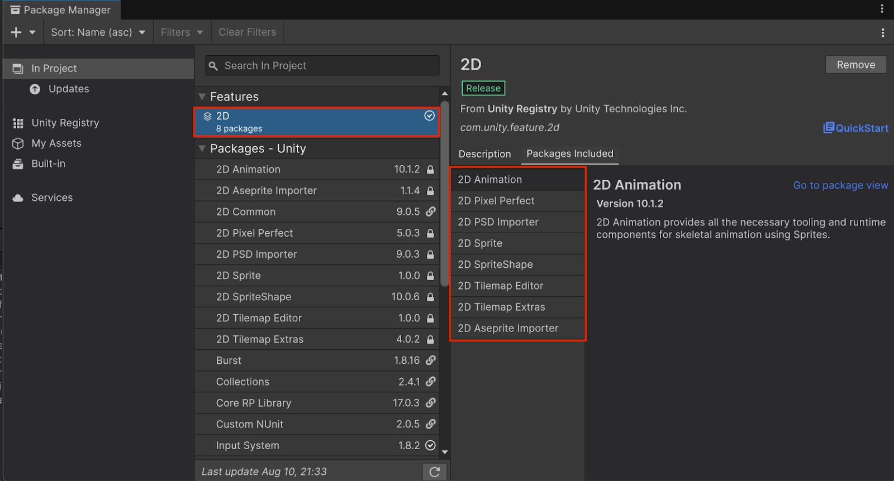

现在，你可以开始创建自己的第一个场景了：

1. 提供的项目应该已经包含一个 Scenes 文件夹；如果没有，请在 Project 窗口中右键点击 Assets 文件夹，选择 Create > Folder，将其命名为 "Scenes"。

2. 右键点击 Scenes 文件夹，选择 Create > Scene > Scene，创建一个新的空场景，命名为 "Main"。

3. 双击 Main 场景将其打开。在 Hierarchy 窗口中，选择 Main Camera 游戏对象，然后在 Inspector 窗口的 Camera 部分下，确保 Projection 属性设置为 Orthographic，Size 属性设置为 5。

    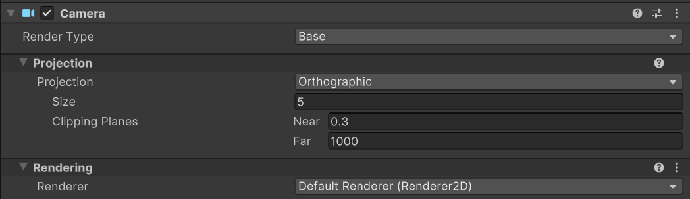

4. 在摄像机设置的 Environment（环境）部分下，确保 Background Type 属性设置为 Solid Color，并将 Background Color 属性设置为黑色（000000）。

    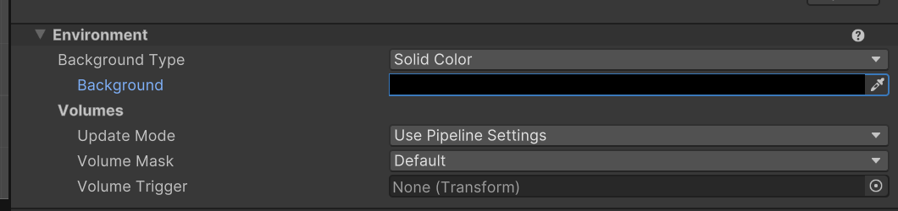

摄像机设置妥当后，就可以开始创建棋盘了。

5. 在 Hierarchy 窗口中右键点击，选择 2D Object > Tilemap > Rectangular。

    如果想回顾瓦片地图的工作原理，可以查看《Create a basic 2D gameplay environment》教程，或手册中的 Tilemaps 页面。

    在《2D 入门：冒险游戏》中，瓦片地图是在编辑器中手动绘制的，因为那张地图是事先设计好且固定不变的。但在本游戏中，一切都由程序化生成，因此瓦片地图需要由代码来创建，因为每次游玩时它都必须有所不同。

    顺便提醒一下：瓦片地图由瓦片（tile）构成，瓦片是一种特殊资源。虽然你不会手动绘制瓦片地图，但你还是需要创建一个瓦片调色板（Tile Palette），以便轻松地创建瓦片并妥善保存它们。

6. 在 Project 窗口中，右键点击 Assets 文件夹，选择 Create > Folder，创建一个新文件夹，命名为 "Tiles"。右键点击 Tiles 文件夹，选择 Create > 2D > Tile Palette > Rectangular，并将新资源命名为 "GamePalette"。

7. 从主菜单中选择 Window > 2D > Tile Palette。

    这会打开 Tile Palette（瓦片调色板）窗口。

    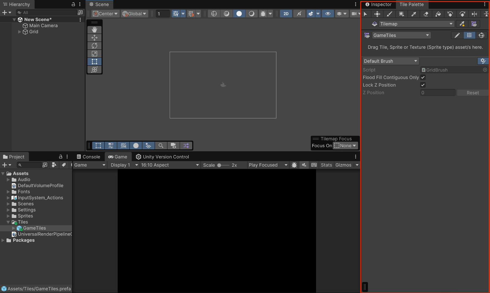

8. 在 Project 窗口中，选择 Assets > Roguelike2D > TutorialAssets > Sprites。选择任意一个你想要的精灵表，使用展开箭头（三角形）将其展开，然后选中所有地面瓦片，拖放到 Tile Palette 窗口中央。

    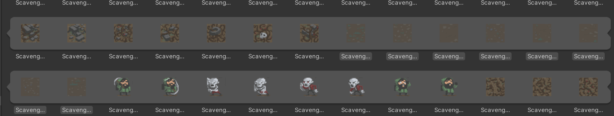

    编辑器会询问你想把新瓦片保存到哪个文件夹；选择你刚才创建的 Tiles 文件夹。

    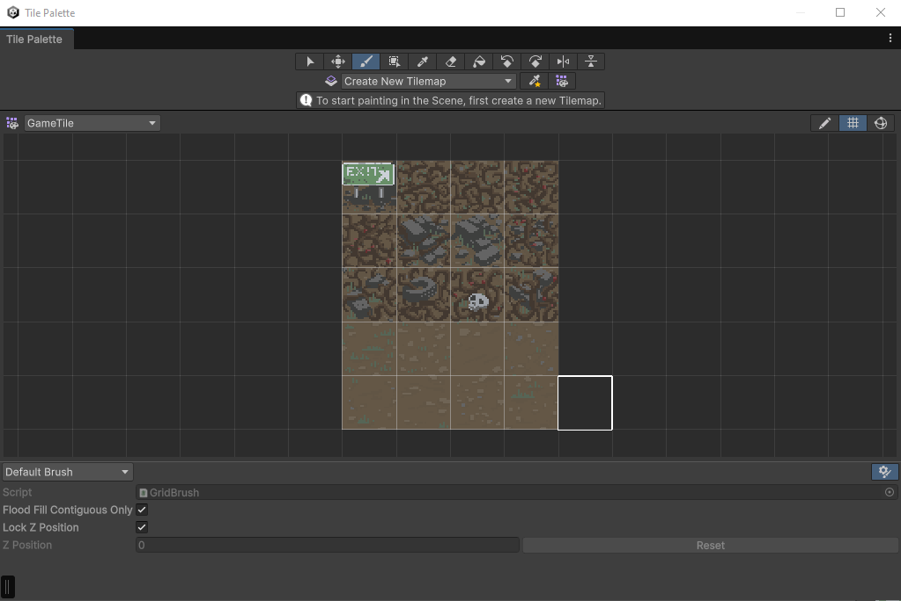

## 3. 将更改提交到仓库（Check in changes to the repository）

如果你看一下 Project 窗口，Tiles 文件夹及其中的新瓦片旁边现在应该会显示一个绿色加号（+）。

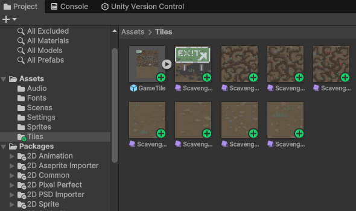

这是 Unity Version Control 系统在告诉你：这些文件是你已添加到本地项目、但尚未添加到仓库的文件。仓库（repository）就是保存项目状态的远程存储。

一个良好的实践是：定期把你对项目所做的更改提交到仓库，以防项目丢失或损坏。

要将更改提交到仓库，请按照以下说明操作：

1. 确保项目中的所有内容都已保存！使用 File > Save 或 Ctrl+S（macOS：Cmd+S）保存场景，确保你刚刚做的所有更改都已写入磁盘。

2. 打开 Unity Version Control 窗口（从主菜单中选择 Window > Unity Version Control，或者选择 Unity Version Control 选项卡）。

    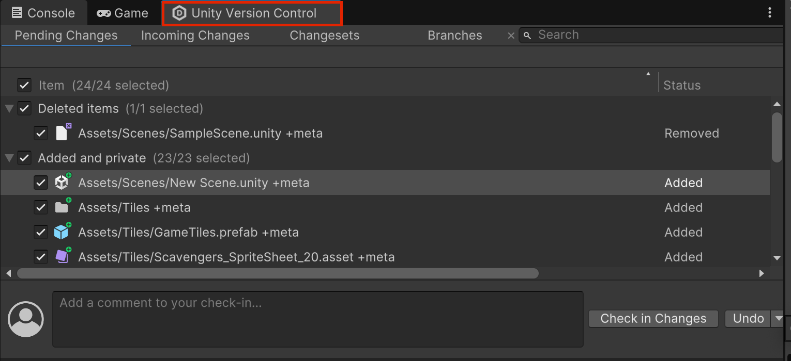

3. 确保所有文件都已选中，输入一条提交消息（例如 "Added the tile palette and ground tiles"），然后选择 Check in changes（提交更改）。

    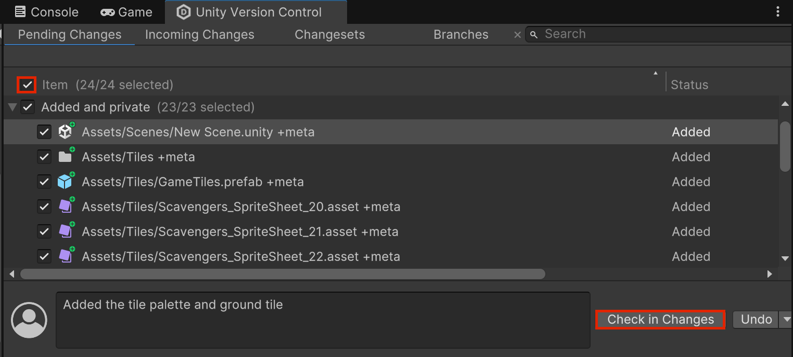

如果你选择 Version Control 窗口顶部的 Changesets（变更集）选项卡，就会看到一份已提交更改的列表，包含你输入的消息以及被提交的文件列表（已添加/已修改/已删除）。

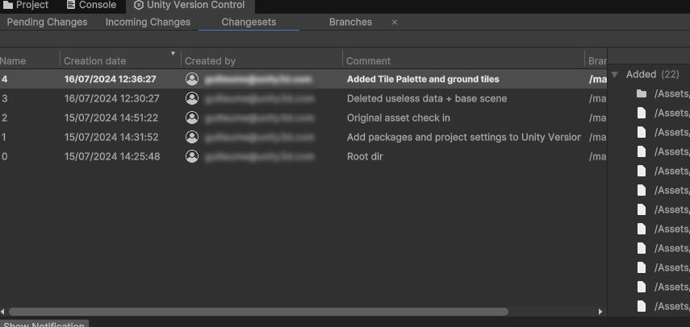

注意：其中一些早期的提交是 Unity Version Control 系统自动完成的。

在这里，你可以右键点击任意一个变更集，选择 Switch workspace to this changeset（将工作区切换到该变更集），即可把项目恢复到该次提交时的状态。如果你想更深入地了解 UVCS 解决方案，可以查看这个教程。

## 4. 用代码创建瓦片地图（Scripting a tilemap）

既然你有了地面瓦片，那就来编写代码，创建游戏在每个关卡中运行的棋盘吧：

1. 在 Hierarchy 窗口中，将 Grid 游戏对象重命名为 "BoardManager"。

2. 在 Project 窗口中，右键点击 Assets 文件夹，选择 Create > Folder，命名为 "Scripts"。

3. 右键点击 Scripts 文件夹，选择 Create > Scripting > MonoBehaviour Script，命名为 "BoardManager"，并将其添加为 BoardManager 游戏对象的组件。

4. 双击新的 BoardManager 脚本，在代码编辑器中打开它。

你需要创建以下三个可以在编辑器中设置的变量：

- 关卡的宽度（以瓦片数量为单位）。
- 关卡的高度（以瓦片数量为单位）。
- 用于构建棋盘的一组瓦片数组。

首先，在 Start 方法中，你需要从脚本所在游戏对象的子游戏对象中获取 Tilemap 组件（Tilemap 游戏对象是 BoardManager 游戏对象的子对象），并把它存储到一个私有成员变量中，方便之后访问。然后，代码需要遍历 Tilemap 组件中的所有瓦片位置，随机选择一块地面瓦片。

你可以先试着自己编写这段代码。从瓦片地图中设置瓦片的方法是 SetTile，它的第一个参数是一个 Vector3Int，表示瓦片的坐标（因此 (0,0,0) 是第一个单元格，(1,0,0) 是它右侧的那个，(0,-1,0) 是它下方的那个，等等；由于你是在 2D 中工作，z 在这种情况下始终为 0）；第二个参数是设置在该位置的实际瓦片。

注意：别忘了在文件开头添加 `using UnityEngine.Tilemaps;` 命名空间，这样你才能访问 Tilemap 和 Tile 类。

以下是参考答案：

```csharp
using UnityEngine;
using UnityEngine.Tilemaps;

public class BoardManager : MonoBehaviour
{
   private Tilemap m_Tilemap;

   public int Width;
   public int Height;
   public Tile[] GroundTiles;

   // Start is called before the first frame update
   void Start()
   {
       m_Tilemap = GetComponentInChildren<Tilemap>();

       for (int y = 0; y < Height; ++y)
       {
           for(int x = 0; x < Width; ++x)
           {
               int tileNumber = Random.Range(0, GroundTiles.Length);
               m_Tilemap.SetTile(new Vector3Int(x, y, 0), GroundTiles[tileNumber]);
           }
       }
   }

}
```

5. 完成脚本后，记得保存以编译更改，这样更改才能在编辑器中生效。

6. 选择 BoardManager 游戏对象。在 Inspector 窗口中，将 Board Manager 脚本组件的 Width 和 Height 变量设置为 8。

7. 使用展开箭头（三角形）展开 Ground Tiles 部分，然后点击 Add（+）按钮。使用选择器（⊙）选择一块地面瓦片。尽量添加几块不同的瓦片。

8. 在 Game 视图工具栏中，点击 Play 按钮进入 Play 模式。

现在，你可以在 Scene 视图和 Game 视图中看到游戏棋盘了！

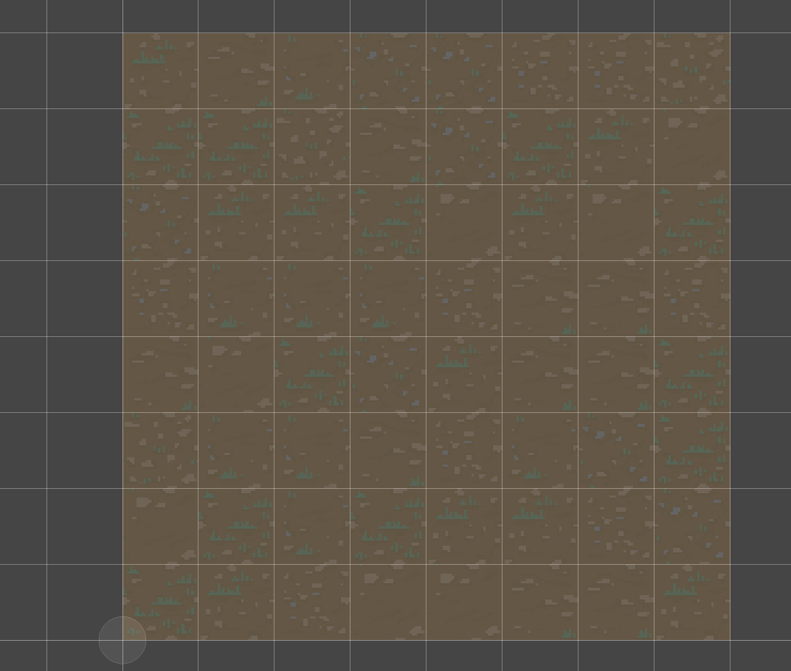

注意：Game 视图目前只会显示棋盘的一部分，不过稍后你会调整摄像机！

## 5. 为棋盘添加边框（Add a border to the board）

你可以尝试在游戏棋盘的边框单元格上添加不同的精灵，把棋盘围起来。为此，你需要为 BoardManager 脚本添加新的变量：

- 一个新的公共数组，用于存储所有可作为阻挡单元格的「墙」瓦片（你需要像创建地面瓦片一样，用精灵来创建这些瓦片）。
- 将这些瓦片设置到棋盘边框位置（两个方向上的 0 或最大值）的单元格上。

以下是更新后的脚本：

```csharp
using UnityEngine;
using UnityEngine.Tilemaps;


public class BoardManager : MonoBehaviour
{
   private Tilemap m_Tilemap;


   public int Width;
   public int Height;
   public Tile[] GroundTiles;
   public Tile[] WallTiles;


   // Start is called before the first frame update
   void Start()
   {
       m_Tilemap = GetComponentInChildren<Tilemap>();


       for (int y = 0; y < Height; ++y)
       {
           for(int x = 0; x < Width; ++x)
           {
               Tile tile;
              
               if(x == 0 || y == 0 || x == Width - 1 || y == Height - 1)
               {
                   tile = WallTiles[Random.Range(0, WallTiles.Length)];
               }
               else
               {
                   tile = GroundTiles[Random.Range(0, GroundTiles.Length)];
               }
              
               m_Tilemap.SetTile(new Vector3Int(x, y, 0), tile);
           }
       }
   }
}
```

注意：与之前的答案相比，我们重写了设置瓦片的代码：现在直接在数组索引处取随机数。

下图是使用城市（urban）主题时棋盘完成后的效果示例，但边框部分你可以选择任何你喜欢的瓦片！

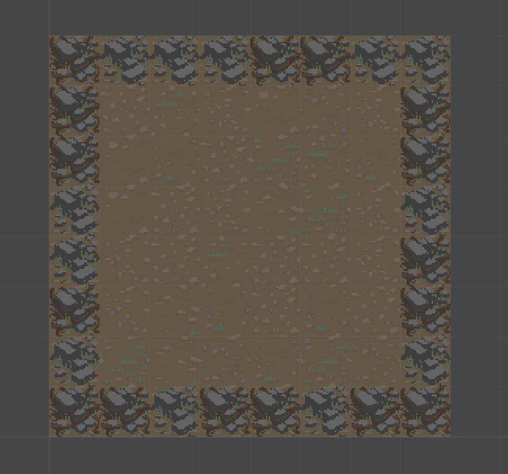

注意：既然你已为 BoardManager 游戏对象添加了脚本，记得保存场景。

现在你有了棋盘，就让我们把它展示到实际游戏中吧。先来正确设置场景中的 Main Camera。

记住版本控制：你刚刚完成了一个新功能（生成棋盘），它添加了新文件，也修改了场景。既然功能已经可以运行，现在正是使用 Unity Version Control 提交更改的好时机！

## 6. 摄像机（Camera）

由于你的瓦片地图位于 0,0,0，且大小为 8×8，它的中心在 (4,4,0)，因此请将 Main Camera 的 Position 设置为 (4,4,-10)，让它对准棋盘中心。

现在，当你尝试进入 Play 模式时，棋盘看起来会是这样的：

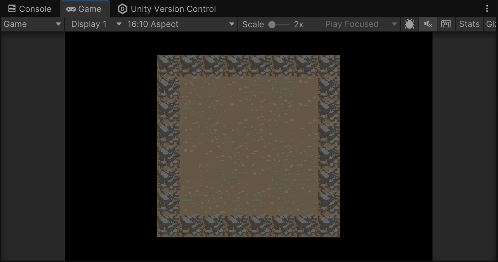

摄像机后续还会有更多工作要做。就目前而言，这些基本功能已经足够你测试游戏了。

## 7. 棋盘数据（Board data）

目前，你的棋盘只是一组瓦片的集合，仅仅停留在视觉效果上。要让游戏真正运转起来，你需要为每个单元格保存比精灵更多的数据；例如：它是否可以通行？它里面有什么？等等。

为此，你将使用一个二维数组（2D array）——即具有两个索引的数组（本例中就是单元格的 x 和 y）。这个数组的元素类型将是一个自定义的 C# 类，这样你就可以为每个单元格存储任何类型的数据。

在 BoardManager 类的顶部，添加一个名为 "CellData" 的新类，让它的第一个成员变量是一个布尔值，用来定义该单元格是否可以通行。然后，声明一个私有变量，也就是我们的二维数组棋盘数据，命名为 m_BoardData。

```csharp
public class BoardManager : MonoBehaviour
{
   public class CellData
   {
      public bool Passable;
   }

   private CellData[,] m_BoardData;

}
```

如果你不熟悉这个概念，先说明一下：在一个类的内部声明另一个类是可行的。这样做有助于组织代码，因为这个类只被 BoardManager 使用。类外部的代码可以通过完整类名 BoardManager.CellData 来访问它。

`CellData[,]` 是声明一个包含 CellData 类型对象的二维数组的写法。其中的逗号表示访问它需要两个索引。因此 `m_BoardData[0,0]` 是第一行的第一个元素，`m_BoardData[1,3]` 是第二行的第四个元素（索引从 0 开始！），以此类推。

在 C# 中，你可以创建任意维度的数组，所以 `CellData[,,]` 就是一个三维数组（三个索引）。

最后，你可以更新 Start 方法。为此，你需要做以下两件事：

- 用棋盘的宽度/高度初始化 m_BoardData 数组，使其大小足以存储所有单元格的数据。
- 在循环中创建每个 CellData，如果该单元格不是边框，就把它的 Passable 值设为 true；如果是边框，则设为 false。

```csharp
void Start()
{
    m_Tilemap = GetComponentInChildren<Tilemap>();

    m_BoardData = new CellData[Width, Height];

    for (int y = 0; y < Height; ++y)
    {
        for(int x = 0; x < Width; ++x)
        {
            Tile tile;
            m_BoardData[x, y] = new CellData();

            if (x == 0 || y == 0 || x == Width - 1 || y == Height - 1)
            {
                tile = WallTiles[Random.Range(0, WallTiles.Length)];
                m_BoardData[x, y].Passable = false;
            }
            else
            {
                tile = GroundTiles[Random.Range(0, GroundTiles.Length)];
                m_BoardData[x, y].Passable = true;
            }

            m_Tilemap.SetTile(new Vector3Int(x, y, 0), tile);
        }
    }
}
```

注意：记得保存脚本并提交到版本控制，以保护好它们！

## 8. 后续步骤（Next steps）

你现在有了一个基础的程序化游戏棋盘。接下来，你需要一种能与所创建棋盘交互的方式。在下一个教程中，你将添加一个玩家角色，它会响应你的输入，并在棋盘上移动。
