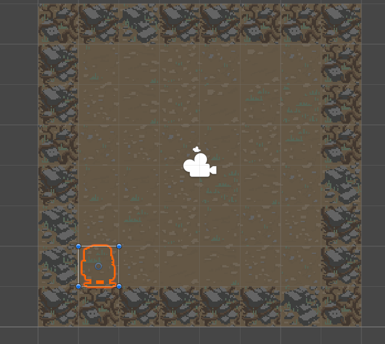
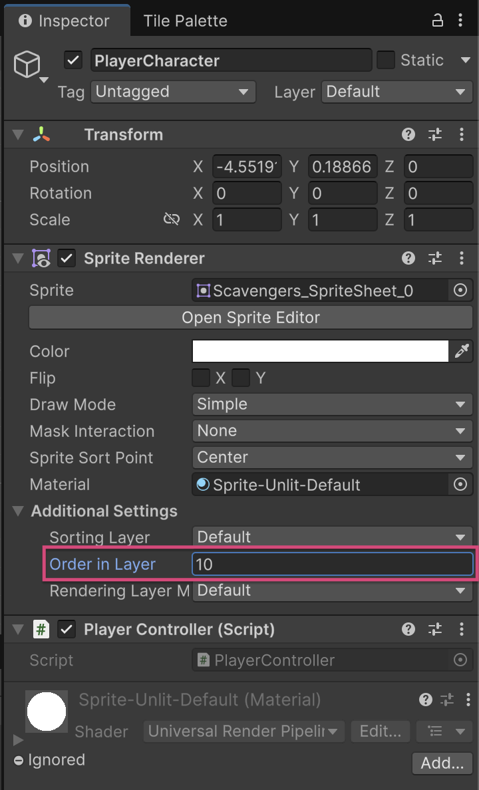
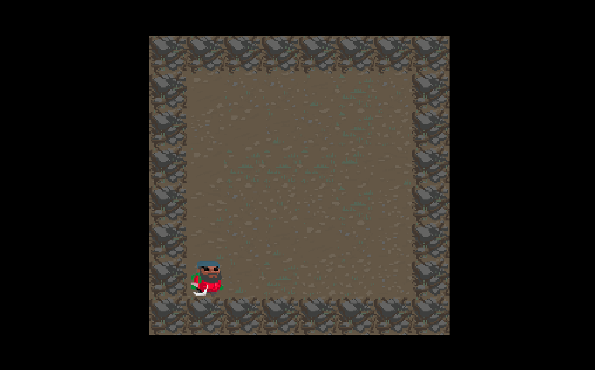

# Add a player character（添加玩家角色）

| 项目 | 信息 |
| --- | --- |
| 类型 | 教程（Tutorial） |
| 难度 | 初学者（Beginner） |
| 经验值 | +0 XP |
| 时长 | 15 分钟 |
| 评论 | 16（723） |

## 概要（Summary）

在上一教程中，你为游戏创建了游戏棋盘；接下来要添加的功能，是一个能在棋盘上穿梭的玩家角色。

到本教程结束时，你将完成以下内容：

- 使用提供的其中一个资源，创建一个 PlayerCharacter 游戏对象。
- 确保 PlayerCharacter 游戏对象渲染在正确的层级上，使其在棋盘上清晰可见。
- 创建 PlayerController 脚本，让 PlayerCharacter 游戏对象能够响应用户输入。

## 1. 概述（Overview）

为了让用户能够玩你的游戏，就必须有一个他们可以操控的元素。这正是玩家角色登场的时机！本教程将引导你完成创建 2D 玩家角色的全过程——它会响应用户输入，并在你的游戏棋盘上移动。

## 2. 玩家角色（Player character）

现在你有了一个 CellData 数组，能用上它们就太好了。如果回顾一下你在上一教程中制作的任务清单，你会看到生成棋盘之后的下一步，就是添加一个能在棋盘上移动的玩家角色。

要添加玩家角色，请按照以下说明操作：

1. 在 Assets > Roguelike2D > TutorialAssets > Sprites 文件夹的精灵表中选择一个玩家角色精灵，将其拖入场景。Unity 会自动创建一个新游戏对象，该对象使用这个精灵并带有 Sprite Renderer 组件。将这个游戏对象重命名为 "PlayerCharacter"。

2. 在 Scripts 文件夹内，创建一个名为 "PlayerController" 的新 MonoBehaviour 脚本，并将其添加到刚刚创建的 PlayerCharacter 游戏对象上。

下面是玩家角色被放到棋盘上并移动时，应该发生的事情的分解：

- 开始时，棋盘在生成完关卡之后，会把玩家放到一个特定的单元格上。
- 当用户按下方向键（上、下、左、右箭头键）时，脚本会检查该方向的单元格是否可以通行。
- 如果单元格可以通行，脚本就会把角色移动到那个新单元格。

这个大纲应该能帮助你认识到，要实现这些功能，你的代码需要做以下几件事：

- 当棋盘放置玩家角色时，玩家角色需要一个 Spawn 方法，把角色移动到正确的位置。
- 脚本需要知道玩家角色当前所在的位置，才能查找玩家角色接下来可以移动到的单元格，因此它需要存储当前的单元格索引。
- 由于脚本需要知道玩家角色试图移动到的单元格是否可通行，而该信息存储在 BoardManager 中，因此脚本需要存储一个对 BoardManager 的引用，以便查询某个单元格的状态。

3. 在你的新 PlayerController 脚本中，添加以下方法和变量：

- 一个 BoardManager 类型的私有变量。
- 一个 Vector2Int 类型的私有变量，用于保存玩家当前所在的单元格。
- 一个名为 "Spawn" 的公共方法，用于保存玩家所在的 BoardManager 以及它当前所在的索引。

```csharp
using UnityEngine;

public class PlayerController : MonoBehaviour
{
   private BoardManager m_Board;
   private Vector2Int m_CellPosition;

   public void Spawn(BoardManager boardManager, Vector2Int cell)
   {
       m_Board = boardManager;
       m_CellPosition = cell;

       //let's move to the right position...
   }
}
```

如果你试着自己编写代码，你可能会停在上面的示例停下的地方：你需要把某个单元格的世界坐标换算出来，才能把玩家放到那里。网格（Grid）有一个用于此目的的方法（GetCellCenterWorld），但网格的信息保存在 BoardManager 游戏对象上，目前既无法访问，也没有存储在任何地方。

这将是你开发应用过程中反复遇到的问题：你需要访问存储在别处的某些东西。解决这个问题最快的方法，是在 BoardManager 脚本上创建一个公共的 Grid 变量并使用它。但当这类问题出现时，不妨花点时间想一想：你为什么会需要这种访问？什么才是最好、最灵活的解决方案？

在本例中，你需要访问网格，是为了把单元格索引 (x,y) 转换为 Vector3 世界坐标。如果你看看计划在游戏中实现的其他所有功能，你会发现这是你需要经常做的事情。在这种情况下，为这个功能创建一个接口通常是个好主意。

BoardManager 应该是负责处理与棋盘相关的一切事物的类。因此，当你需要一个与棋盘相关的操作时（例如在这里把单元格转换为世界坐标），你就能立刻知道该去哪里找。

所以，让我们给 BoardManager 脚本添加一个简单的方法，名为 "CellToWorld"，它接收一个 Vector2Int 单元格索引，并返回其世界坐标。

你需要对 BoardManager 脚本做以下几件事：

- 添加一个用于存储网格的私有变量。

```csharp
private Grid m_Grid;
```

- 在 Start 方法中使用 GetComponentInChildren 获取 BoardManager 游戏对象的 Grid 组件。
- 添加一个新的公共方法，接收一个 Vector2Int 单元格索引，并返回该单元格中心的世界坐标。

```csharp
public Vector3 CellToWorld(Vector2Int cellIndex)
    {
        return m_Grid.GetCellCenterWorld((Vector3Int)cellIndex);
    }
```

注意：这段代码示例也说明了命名规范的重要性。到目前为止，你的所有私有成员变量都以 m_ 开头。即使只看这个小代码示例，你也能在不需要查看完整代码的情况下推断出，m_Grid 是 BoardManager 类中的一个私有变量。

4. 更新玩家的 Spawn 方法，让它使用这个新的 BoardManager 方法。只需在 PlayerController 脚本中添加以下代码行：

```csharp
public void Spawn(BoardManager boardManager, Vector2Int cell)
{
   m_Board = boardManager;
   m_CellPosition = cell;

   //let's move to the right position...
   transform.position = m_Board.CellToWorld(cell);
}
```

现在，你的 PlayerController 脚本中有了一个方法，可以把玩家角色生成到某个位置，接下来只需要从 BoardManager 调用 Spawn 方法即可。

5. 将以下代码添加到你的 BoardManager 脚本中：

```csharp
public PlayerController Player;

// Start is called before the first frame update
void Start()
{
   m_Tilemap = GetComponentInChildren<Tilemap>();
   m_Grid = GetComponentInChildren<Grid>();
  
   m_BoardData = new CellData[Width, Height];

   for (int y = 0; y < Height; ++y)
   {
       for(int x = 0; x < Width; ++x)
       {
           Tile tile;
           m_BoardData[x, y] = new CellData();

           if(x == 0 || y == 0 || x == Width - 1 || y == Height - 1)
           {
               tile = WallTiles[Random.Range(0, WallTiles.Length)];
               m_BoardData[x, y].Passable = false;
           }
           else
           {
               tile = GroundTiles[Random.Range(0, GroundTiles.Length)];
               m_BoardData[x, y].Passable = true;
           }

           m_Tilemap.SetTile(new Vector3Int(x, y, 0), tile);
       }
   }

   Player.Spawn(this, new Vector2Int(1, 1));
}
```

上述代码做了以下几件事：

- 为 BoardManager 添加了一个公共成员变量（PlayerController），这样你就可以在 Inspector 窗口中把 PlayerCharacter 游戏对象赋值给它。
- 在 Start 方法的末尾、棋盘生成完毕之后，它以一个给定的单元格（例如 (1,1)，即左下角第一个非墙壁单元格）调用该 PlayerController 脚本上的 Spawn 方法。

6. 在编辑器中，将场景中的 PlayerCharacter 游戏对象拖到 BoardManager 脚本的 Player 槽位上，然后进入 Play 模式。

    

7. 在 Hierarchy 窗口中选择 PlayerCharacter 游戏对象，并查看 Scene 视图。

    你会看到玩家角色位于正确的位置，但棋盘渲染在了它的上面！

    

让我们修复这个问题。

8. 在 Inspector 窗口中，使用展开箭头（三角形）展开 Sprite Renderer 组件，并将 Order in Layer 属性设置为 10。

    将玩家角色设置为层级 10，可以为你将来留出空间，以便放置那些应该位于棋盘之上、但在玩家角色之下的对象。

重要提示：记得在做出这些更改之前退出 Play 模式，否则退出 Play 模式时，这些更改会被还原。

现在，当你再次进入 Play 模式时，玩家角色就会正确显示了！



提示：别忘了使用 Unity Version Control 保存并提交你的更改！

## 3. 移动玩家角色（Moving the player character）

既然你能在游戏棋盘上看到玩家了，是时候添加控制其移动的能力了！

像之前一样，先思考玩家移动所需的事件序列；这将帮助你确定需要做哪些事情。

PlayerController 脚本需要做以下事情：

- 在 PlayerController 脚本的 Update 方法中，检查是否按下了方向键。
- 检查该方向的单元格是否可以通行。
- 如果单元格可以通行，就把玩家移动到新单元格。

下面的代码展示了实现这一功能的一种可行方式。注意，你需要在文件顶部添加 UnityEngine.InputSystem 库：

```csharp
private void Update()
{
   Vector2Int newCellTarget = m_CellPosition;
   bool hasMoved = false;

   if(Keyboard.current.upArrowKey.wasPressedThisFrame)
   {
       newCellTarget.y += 1;
       hasMoved = true;
   }
   else if(Keyboard.current.downArrowKey.wasPressedThisFrame)
   {
       newCellTarget.y -= 1;
       hasMoved = true;
   }
   else if (Keyboard.current.rightArrowKey.wasPressedThisFrame)
   {
       newCellTarget.x += 1;
       hasMoved = true;
   }
   else if (Keyboard.current.leftArrowKey.wasPressedThisFrame)
   {
       newCellTarget.x -= 1;
       hasMoved = true;
   }

   if(hasMoved)
   {
       //check if the new position is passable, then move there if it is.
   }
}
```

注意：响应输入的最佳方式是通过 InputActions（输入操作），这样游戏就能支持多种输入方式，并且可以轻松重新映射。你用来创建项目的 URP 模板已经定义了一些默认操作，位于项目根目录名为 InputSystem_Actions 的 InputActionAsset 中。在本教程中，我们将使用直接查询键盘的方式——这种写法在快速原型开发和简化代码示例时很有用；但如果你想尝试，也可以查看手册中的输入系统页面和《2D 入门：冒险游戏》，了解如何用 Input Action 替换这段代码！

就像 BoardManager 游戏对象一样，你也无法直接获取某个单元格是否可通行的信息。和之前一样，获取特定单元格的单元格数据是你需要经常做的事情，所以请为你的 BoardManager 脚本添加以下方法：

```csharp
public CellData GetCellData(Vector2Int cellIndex)
{
   if (cellIndex.x < 0 || cellIndex.x >= Width
       || cellIndex.y < 0 || cellIndex.y >= Height)
   {
       return null;
   }

   return m_BoardData[cellIndex.x, cellIndex.y];
}
```

这个方法会返回存储在该单元格的 m_BoardData 数组中的信息。把对数组的搜索限制在关卡中实际存在的单元格上，这样你就不会因为索引不存在的单元格而产生异常。在这种情况下，方法会返回 null。

现在，你可以更新 PlayerController 脚本中的 Update 方法，让它使用下面的代码：

```csharp
private void Update()
{
    Vector2Int newCellTarget = m_CellPosition;
    bool hasMoved = false;

    if (Keyboard.current.upArrowKey.wasPressedThisFrame)
    {
        newCellTarget.y += 1;
        hasMoved = true;
    }
    else if (Keyboard.current.downArrowKey.wasPressedThisFrame)
    {
        newCellTarget.y -= 1;
        hasMoved = true;
    }
    else if (Keyboard.current.rightArrowKey.wasPressedThisFrame)
    {
        newCellTarget.x += 1;
        hasMoved = true;
    }
    else if (Keyboard.current.leftArrowKey.wasPressedThisFrame)
    {
        newCellTarget.x -= 1;
        hasMoved = true;
    }

    if (hasMoved)
    {
        //check if the new position is passable, then move there if it is.
        BoardManager.CellData cellData = m_Board.GetCellData(newCellTarget);

        if (cellData != null && cellData.Passable)
        {
            m_CellPosition = newCellTarget;
            transform.position = m_Board.CellToWorld(m_CellPosition);
        }
    }

}
```

现在，你可以进入 Play 模式，按下方向键让玩家在棋盘上移动了！而且，由于你在生成棋盘时把边框单元格的 CellData 的 Passable 值设为了 false，玩家角色将被限制在棋盘范围之内。

提示：记得使用 Unity Version Control 提交所有这些更改！

## 4. 重构（Refactoring）

在像这样的原型开发环境中，你会随着进展不断为出现的问题寻找解决方案，此时花点时间审视自己的代码，看看有没有可以清理的地方，是很有益的。

在本例中，你可能已经注意到了一些代码重复：你在 Spawn 方法中移动玩家，之后又在 Update 方法中移动玩家。

代码重复并不总是坏事，但在本例中，它可能会产生错误：角色移动时，CellPosition 和 Transform 的位置都需要更新。如果以后需要在代码的其他地方移动角色，很容易忘记其中一处。此外，你可能还想在以后向代码中添加一些功能；例如，每次角色移动时播放一个声音。要做到这一点，你就得追踪每一处移动角色的地方，以便添加声音。

更安全、更高效的做法是：把所有这些功能封装到一个 MoveTo 方法中——该方法接收玩家将要移动到的目标单元格作为参数，并负责处理与移动 PlayerCharacter 游戏对象相关的一切事情。

将下面的 MoveTo 方法代码复制粘贴到你的 PlayerController 脚本中，添加该方法，并用它替换 Spawn 与 Update 方法中的两处移动代码（译注：原文此处写的是 Start，但从代码来看应为 Spawn）：

```csharp
using UnityEngine;
using UnityEngine.InputSystem;

public class PlayerController : MonoBehaviour
{
   private BoardManager m_Board;
   private Vector2Int m_CellPosition;

   public void Spawn(BoardManager boardManager, Vector2Int cell)
   {
       m_Board = boardManager;
       MoveTo(cell);
   }
  
   public void MoveTo(Vector2Int cell)
   {
       m_CellPosition = cell;
       transform.position = m_Board.CellToWorld(m_CellPosition);
   }

  
   private void Update()
   {
       Vector2Int newCellTarget = m_CellPosition;
       bool hasMoved = false;

       if(Keyboard.current.upArrowKey.wasPressedThisFrame)
       {
           newCellTarget.y += 1;
           hasMoved = true;
       }
       else if(Keyboard.current.downArrowKey.wasPressedThisFrame)
       {
           newCellTarget.y -= 1;
           hasMoved = true;
       }
       else if (Keyboard.current.rightArrowKey.wasPressedThisFrame)
       {
           newCellTarget.x += 1;
           hasMoved = true;
       }
       else if (Keyboard.current.leftArrowKey.wasPressedThisFrame)
       {
           newCellTarget.x -= 1;
           hasMoved = true;
       }

       if(hasMoved)
       {
           //check if the new position is passable, then move there if it is.
           BoardManager.CellData cellData = m_Board.GetCellData(newCellTarget);

           if(cellData != null && cellData.Passable)
           {
               MoveTo(newCellTarget);
           }
       }
   }

}
```

现在进入 Play 模式，检查游戏是否仍能像之前一样运行，以及你能否继续移动玩家角色。

## 5. 后续步骤（Next steps）

你现在有了一个能响应输入的基础玩家角色！接下来，是时候添加一些元素来充实你的游戏了。在下一个教程中，你将向游戏添加一个回合系统。
