# Add a food resource（添加食物资源）

| 项目 | 信息 |
| --- | --- |
| 类型 | 教程（Tutorial） |
| 难度 | 初学者（Beginner） |
| 经验值 | +0 XP |
| 时长 | 15 分钟 |
| 评论 | 13（460） |

## 概要（Summary）

现在游戏可以计算回合了，你也就能够开始引入资源管理之类的游戏性要素了。

到本教程结束时，你将完成以下内容：

- 添加一种食物资源：游戏开始时，它会随机出现在游戏棋盘上，玩家角色可以收集它。
- 使用 UI Builder 窗口创建一个游戏内标签，显示玩家当前拥有的食物数量。
- 编写代码，让食物资源在游戏每回合递减，并在玩家角色每次收集到食物资源时递增。

## 1. 概述（Overview）

现在你有了回合系统，就可以围绕回合创建游戏机制了！在本教程中，你将实现一个食物系统：每过一个回合，食物单位都会减少。

## 2. 添加食物资源（Add a food resource）

首先，你需要决定把玩家角色当前持有的食物数量存储在哪里。你可能会觉得 TurnManager 是个不错的候选，因为回合是在那里计数的。然而，这并非最好的选择，因为 TurnManager 的唯一职责就是处理回合，而食物与游戏本身及其玩法更相关。好在，你已经有一个处理与玩法相关一切事物的地方：GameManager！

问题在于，目前 GameManager 内部没有任何办法知道一个回合何时发生。在回合发生时得到通知，将是你今后在游戏中反复需要的重要功能。

为了解决这个问题，你可以实现一个回调系统（callback system）。回调系统允许代码的任何部分提供一个方法，当某个事件发生时，这个方法会被调用。在本例中，每当一个回合发生时，所有已注册的组件都会收到通知，并且它们提供的方法会被调用。

由于这个回调不需要任何参数（它只需要知道某件事是否发生），你可以使用 System.Action 作为回调的类型（它是 C# 标准库中用于回调的内置类型）。

在 TurnManager 脚本第一个 "{" 之后添加以下内容：

```csharp
public event System.Action OnTick;
```

注意：`event` 是 C# 中用于回调的特殊关键字。这意味着只有声明 OnTick 的那个类（在这里是 TurnManager）才能触发该事件，其他任何东西都不行。

在 Tick 方法内部添加以下内容：

```csharp
OnTick?.Invoke();
```

Invoke 是 System.Action 中的方法，它会调用（"invoke"）所有注册到 OnTick 事件上的回调方法。

`?` 是一种特殊的 C# 语法，用于测试 OnTick 是否为 null。如果它是 null，`?` 就什么都不做；如果它不是 null，`?` 就会调用 `?` 右边的方法。它是下面这段代码的简写形式：

```csharp
if(OnTick != null)
{
   OnTick.Invoke();
}
```

你需要测试 OnTick 是否为 null，因为如果代码中没有其他部分向 OnTick 注册回调函数，那么它就会是 null，而对一个 null 对象调用 Invoke 会产生错误，导致游戏崩溃！

现在，其他脚本就可以注册到这个回调上，在滴答发生时收到通知。在你的 GameManager 中，做以下事情：

- 添加一个私有整型成员，存储你当前拥有的食物数量（初始化为 100）。
- 添加一个名为 "OnTurnHappen" 的方法，它会在一个回合发生时被调用。
- 将 OnTurnHappen 方法注册到你的 TurnManager.OnTick 回调上。

```csharp
private int m_FoodAmount = 100;
.
.
.
void Start()
{
   TurnManager = new TurnManager();
   TurnManager.OnTick += OnTurnHappen;
  
   BoardManager.Init();
   PlayerController.Spawn(BoardManager, new Vector2Int(1,1));
}

void OnTurnHappen()
{
   m_FoodAmount -= 1;
   Debug.Log("Current amount of food : " + m_FoodAmount);
}
```

`TurnManager.OnTick += OnTurnHappen` 就是把一个方法回调注册到 OnTick 事件上的方式。当 OnTick 的 Invoke 方法被调用时，它会调用 OnTurnHappen 方法。之所以使用 `+=`，是因为我们要把这个方法添加到已经注册的其他方法之上（目前只有一个，但以后当 OnTick 发生时，会有更多方法被调用）。

类似地，如果你希望 OnTurnHappen 在 OnTick 被触发时不再被调用，可以使用 `TurnManager.OnTick -= OnTurnHappen`。

现在你可以点击播放，在控制台中查看食物数量逐渐减少。

提示：记得在 Unity Version Control 中提交你的更改！

## 3. 添加一些界面（Some UI）

现在游戏中有了一些需要展示给用户的重要数据（剩余的食物数量），是时候为游戏添加一些 UI 元素了。

为此，你将使用 UIToolkit 系统。这里只介绍 UI Toolkit 系统的基本用法，更深入的信息请参阅完整的 UI Toolkit 介绍和 UI Toolkit 手册页面。

要为游戏添加 UI 元素，请按照以下说明操作：

1. 在 Hierarchy 窗口中右键点击，选择 UI Toolkit > UI Document。

    这会创建一个带有 UI Document 组件的新游戏对象，也会在你的项目中创建 UI Toolkit 的默认设置。

    UI Toolkit 通过以下方式将 UI 的结构、外观和行为解耦：

    - **结构**由 UXML 文件（类似于 HTML 文件）提供，它定义你的 UI 由哪些元素组成，以及它们之间的层级关系。
    - **外观**由 USS 文件（类似于 CSS 文件）定义，它定义 UI 元素的视觉属性（颜色、边框、间距、对齐等）。
    - **行为**用 C# 编写，通过按名称或 id 获取元素，并在其上应用监听器或其他行为。

    目前，UI Document 组件期望一个可视化树资源（Visual Tree Asset）作为其来源。可视化树资源就是一个 UXML 文件，它定义你的 UI 结构。

2. 在 Project 窗口中，右键点击 Assets 文件夹，选择 Create > Folder，命名为 "UI"。

3. 右键点击 UI 文件夹，选择 Create > UI Toolkit > UI Document，命名为 "GameUI"。

4. 在 Hierarchy 窗口中选择 UIDocument 游戏对象，然后在 Inspector 窗口中选择 Source Asset 选择器（⊙），选择 GameUI 文档。

现在，你将编辑 GameUI 文档，添加一个显示剩余食物数量的标签（Label）。

5. 双击 GameUI 文档。

    这会打开 UI Builder 窗口。双击窗口名称可展开窗口。

    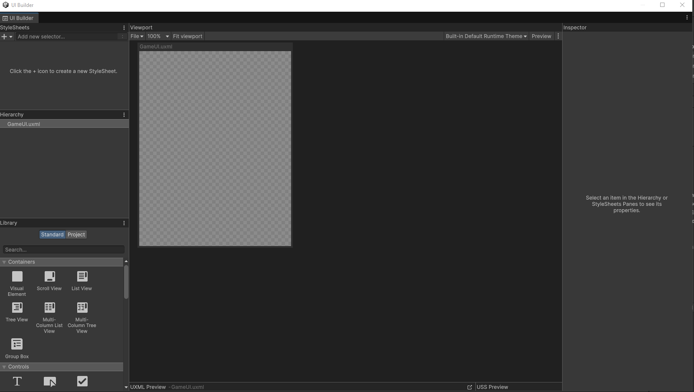

    UI Builder 窗口是一个可视化工具，它让你能够以可视化方式（而不是通过文本）编辑 UXML 文件（比如你的 GameUI 文档）。

    左上角的面板包含你的 UI 的 Hierarchy 窗口，目前里面只有 GameUI.uxml 文件。Hierarchy 窗口下方是 Library（库）窗口，其中包含你可以添加到 UI 中的各种 UI 控件。

    中央的 Viewport（视口）窗口是 UI 的视图，目前是空的。

    最右侧的窗口是 Inspector（检查器）窗口，它显示所选 UI 元素的所有属性。

6. 在 Library 窗口的 Controls 部分下，将 Label 元素拖放到 Viewport 窗口中。

    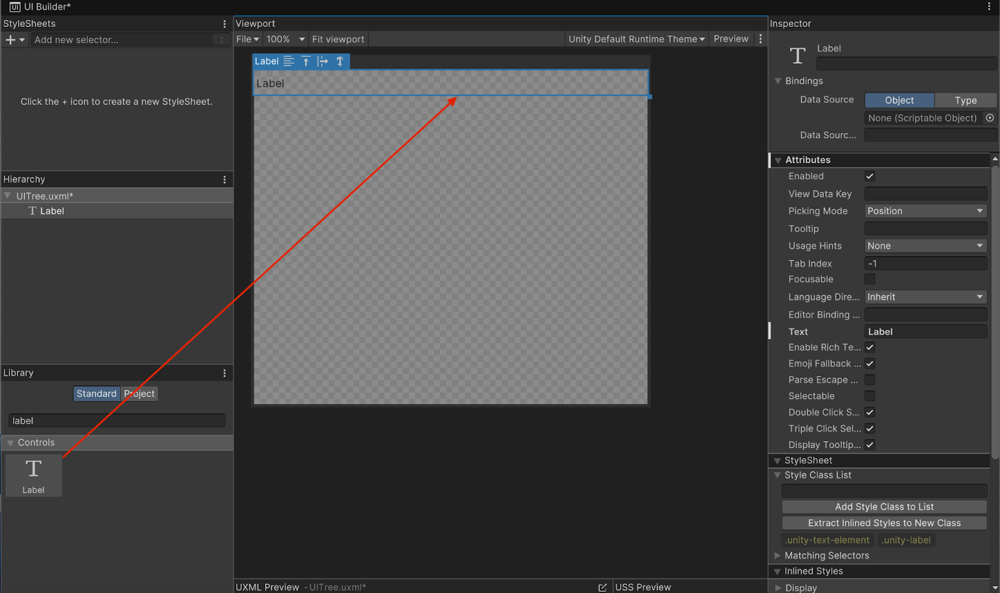

7. 在 Hierarchy 窗口中选择 Label，然后在 Inspector 窗口中选择 Label 名称框，将其重命名为 "FoodLabel"。

    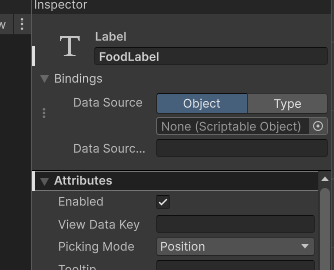

现在，你可以更改所使用的字体，使其更符合游戏风格。提供的资源中有一个字体文件，但如果你有自己喜欢的字体，也可以随意使用自己的。

8. 在 Hierarchy 窗口中选择 Label，在 Inspector 窗口中使用展开箭头（三角形）展开 Text 部分。

9. 选择 Font 属性选择器（⊙），指定提供的 PressStart2P-Regular 字体，或者你自己的字体。

10. 选择 Color 属性框，将颜色设置为白色（FFFFFF），这样标签就能在黑色背景上凸显出来。

    Viewport 窗口中的标签字体应该已经发生了变化。

    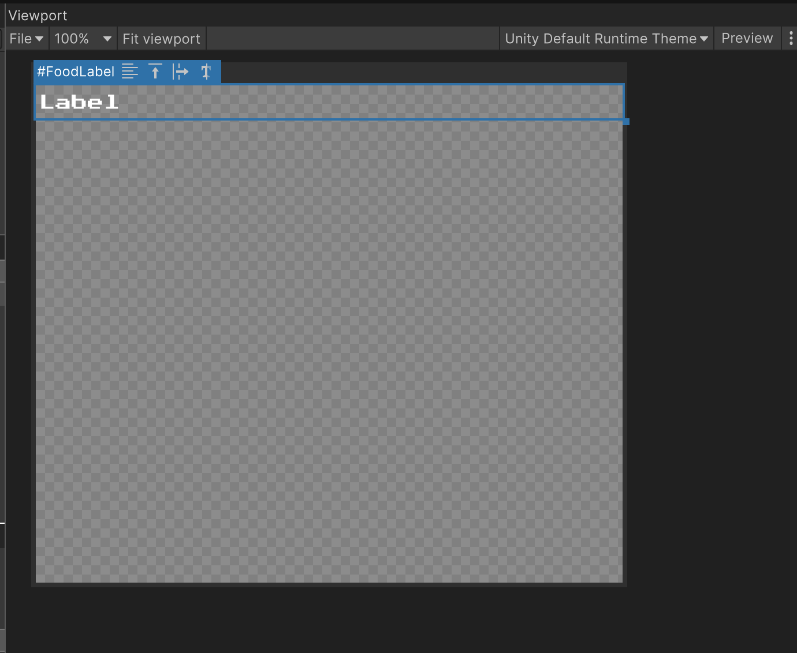

11. 更改 Size 属性，根据你自己的偏好将其调大或调小（可以多试几个尺寸，直到找到满意的为止），最后使用 Align 属性将文本居中。

    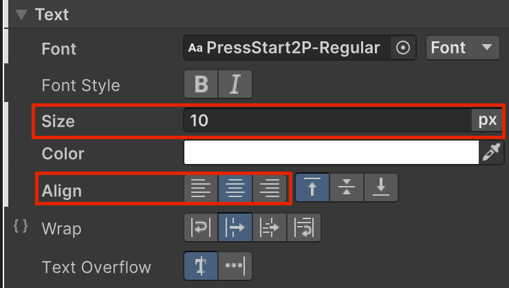

最后，让我们把标签放到屏幕底部。目前 UI Toolkit 使用自动布局。默认布局会把 Hierarchy 窗口中连续的元素从上到下排列，并横跨 UI 文档的宽度伸展。

我们可以改用手动定位，把 Label 精确地放到你想要的位置。

12. 使用展开箭头（三角形）展开 Inspector 窗口中的 Position 部分。

13. 打开 Position Mode 属性下拉菜单，将 Position Mode 从 Relative（相对）改为 Absolute（绝对）。

    在 Absolute 模式下，四个偏移量（Top/Right/Bottom/Left，即上/右/下/左）表示到屏幕各边框的距离。

14. 将 Bottom 偏移设置为 0。

    这意味着标签底部到屏幕底边的距离为 0 像素。

    你可能已经注意到，标签不再居中了。居中文案只是让它在其蓝色包围框内居中。如果你在选中 Label 的情况下查看预览，会看到包围框只有文本本身的大小。

    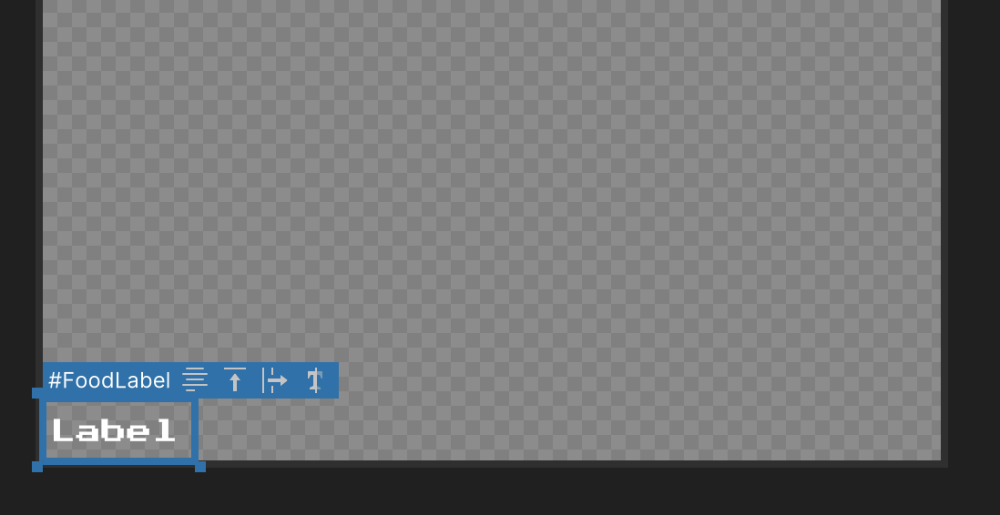

    之前默认布局帮你把它横跨整个宽度伸展了，但现在你使用了 Absolute 定位，布局的大小将基于标签内文本的大小。要修正这一点，你需要强制包围框伸展。

15. 将 Left 和 Right 偏移都设置为 0。

    这将使左边界到屏幕左侧的距离，以及右边界到屏幕右侧的距离都拉伸为 0。

    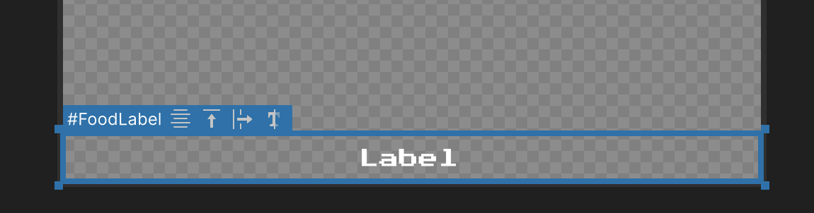

注意：记得保存对 UI 文档的更改——使用 Ctrl+S（macOS：Cmd+S），或者在关闭 UI Builder 窗口之前，选择 UI Builder Viewport 窗口顶部的 File > Save。

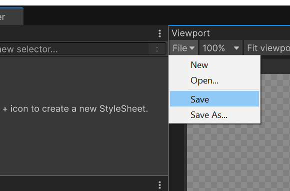

16. 在编辑器中进入 Play 模式，检查你的更改在游戏中的效果。

提示：如果你把 UI Builder 窗口最大化后看不到其他窗口，可以双击或右键点击 UI Builder 的窗口名称，然后取消勾选最大化按钮，即可回到之前的编辑器布局。

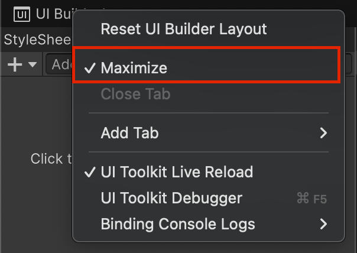

## 4. 用代码更新标签（Update the Label using code）

现在标签已经放到了正确的位置，让我们编写代码，让每个回合都显示玩家拥有的食物数量。

为此，你将使用 GameManager：

1. 在 GameManager 脚本中添加一个 UIDocument 类型的公共变量。你还需要在文件顶部添加 `using UnityEngine.UIElements;`，这样才能使用 UIDocument 等与 UI Toolkit 相关的类。

2. 创建一个 Label 类型的私有变量，用来存储对 Label 的引用，以便访问和修改它。

现在，你可以在 Inspector 窗口中将你的 UI Document（即 UIDocument 游戏对象上的组件，而不是 GameUI 文件）赋值给 GameManager。

然后，你可以添加代码，在 GameManager 的 Start 方法中查找 GameUI 内部的 Label，并将其文本更新为食物数量：

```csharp
using UnityEngine.UIElements;

public class GameManager : MonoBehaviour
{
	public UIDocument UIDoc;
	private Label m_FoodLabel;
	
	void Start()
	{
	    m_FoodLabel = UIDoc.rootVisualElement.Q<Label>("FoodLabel");
	    m_FoodLabel.text = "Food : " + m_FoodAmount;
	    ...
	}
	
}
```

让我们仔细看看上面的代码行：

- UIDocument 有一个 `.rootVisualElement` 属性，它是你之前在 UI Builder 窗口中看到的 Hierarchy 窗口的根（第一个元素）。Hierarchy 窗口中的所有元素（比如标签）都是该根元素的子元素。
- 这个根（以及 UIToolkit 的任意元素）有一个特殊方法 `Q`，它是 Query（查询）的缩写。这个 Q 方法会在你所调用 Q 的元素的后代元素中，查找给定类型（例如 Label）且具有给定名称（例如 FoodLabel）的元素。
- `m_FoodLabel` 是添加到 GameManager 中的一个 Label 类型私有变量，用来存储该 Label，这样你就不必每次都使用 Q 方法查找它。
- `.text` 属性用于设置标签的文本，以显示当前的食物数量（例如 Food:100）。

3. 保存对脚本的更改，将你的 UIDocument 拖入 GameManager 的 UIDoc 槽位，然后进入 Play 模式。

现在，你的食物计数应该显示在屏幕底部了。

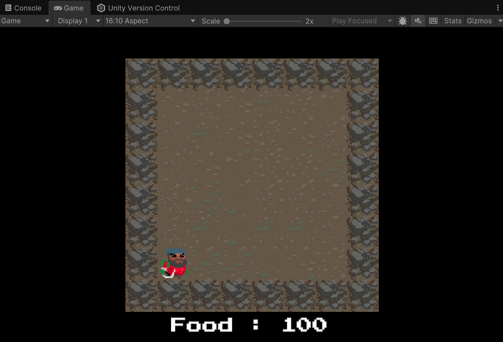

然而，你会注意到，当玩家角色移动时，计数器并没有更新。为此，你需要把之前写在 OnTurnHappen 方法中的 Debug.Log 替换为以下代码：

```csharp
void OnTurnHappen()
{
   m_FoodAmount -= 1;
   m_FoodLabel.text = "Food : " + m_FoodAmount;
}
```

现在，如果你进入 Play 模式并四处移动，食物计数器就会递减了！

提示：记得在 Unity Version Control 系统中提交更改。

## 5. 单元格中的对象与食物补充（Objects in cell and food refill）

既然食物供应会随着玩家角色的每一次移动而减少，游戏就需要一种补充食物消耗的方式。让我们添加一个可收集对象，它补充 10 个单位的食物。

为此，你需要检测玩家何时进入一个其中有对象的单元格。在《2D 入门：冒险游戏》中，使用碰撞器（collider）和刚体（Rigidbody）组件来检测物体之间的碰撞与重叠。但在本例中，由于游戏是回合制、并且发生在网格上，你不需要使用物理系统。

你已经为游戏中的每个单元格准备好了 CellData，并用它来存储单元格是否可以通行。现在，你将给 CellData 添加一个新值，用来存储单元格中是否含有对象：

1. 打开 BoardManager 脚本，在 CellData 类内部添加以下新变量：

```csharp
public class CellData
{
   public bool Passable;
   public GameObject ContainedObject;
}
```

现在，每当玩家角色移动到一个新单元格时，PlayerController 脚本就可以检查该单元格内是否有什么东西；如果有，你就可以移除该对象并增加食物计数。

然后，你需要创建一个食物游戏对象。本项目提供的精灵中有几个食物精灵。

2. 将你喜欢的食物精灵拖入场景，创建一个带有该精灵的新游戏对象，命名为 "SmallFood"，并将其 Order in Layer 设置为 1 到 9 之间的某个值。

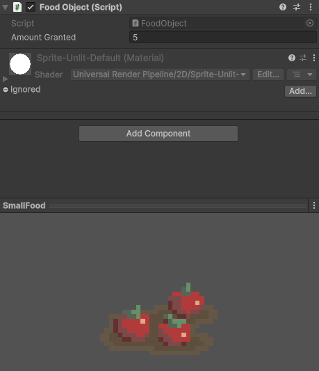

这样做意味着它会渲染在瓦片地图之上、玩家角色之下。

3. 在 Project 窗口中，右键点击 Assets 文件夹，选择 Create > Folder，命名为 "Prefabs"，然后将 Hierarchy 窗口中的 SmallFood 游戏对象拖放到新的 Prefabs 文件夹中。

    这会根据该游戏对象创建一个预制体（prefab），你可以在多个地方、多个场景之间重复使用它。

4. 从场景中删除 SmallFood 游戏对象。

    它不再需要了，因为你将基于预制体工作。

5. 在 BoardManager 中，添加一个 GameObject 类型的公共变量 FoodPrefab，用来存储你刚创建的食物预制体。

```csharp
public GameObject FoodPrefab;
```

6. 编写一个名为 "GenerateFood" 的新 void 方法，然后将以下代码复制粘贴到该方法中：

```csharp
void GenerateFood()
{
   int foodCount = 5;
   for (int i = 0; i < foodCount; ++i)
   {
       int randomX = Random.Range(1, Width-1);
       int randomY = Random.Range(1, Height-1);
       CellData data = m_BoardData[randomX, randomY];
       if (data.Passable && data.ContainedObject == null)
       {
           GameObject newFood = Instantiate(FoodPrefab);
           newFood.transform.position = CellToWorld(new Vector2Int(randomX, randomY));
           data.ContainedObject = newFood;
       }
   }
}
```

上述代码的内容做了以下几件事：

- 创建一个 int 变量，存储将要生成的食物预制体数量（用一个变量，可以方便地更改它来测试不同的数值）。
- 循环这么多次：
  - 每次循环，都会随机选取一个 x 和 y 位置。Random.Range 返回一个介于第一个参数（包含）和第二个参数（不包含）之间的数字。注意范围是 1 到 size - 2（因为 size - 1 被排除），因为代码不应选取外侧墙壁所在的单元格！
  - 然后获取该单元格位置的 CellData。
  - 如果这个单元格可以通行、且那里没有对象，就在该位置实例化一个新的食物预制体，并将该食物作为 ContainedObject 存储在该单元格的 CellData 中。

7. 在 BoardManager 的 Init 方法末尾、关卡创建完成之后，调用这个新方法。

```csharp
 public void Init()
    {
        m_Tilemap = GetComponentInChildren<Tilemap>();
        m_Grid = GetComponentInChildren<Grid>();

        m_BoardData = new CellData[Width, Height];

        for (int y = 0; y < Height; ++y)
        {
            for (int x = 0; x < Width; ++x)
            {
                Tile tile;
                m_BoardData[x, y] = new CellData();

                if (x == 0 || y == 0 || x == Width - 1 || y == Height - 1)
                {
                    tile = WallTiles[Random.Range(0, WallTiles.Length)];
                    m_BoardData[x, y].Passable = false;
                }
                else
                {
                    tile = GroundTiles[Random.Range(0, GroundTiles.Length)];
                    m_BoardData[x, y].Passable = true;
                }

                m_Tilemap.SetTile(new Vector3Int(x, y, 0), tile);
            }
        }

        GenerateFood();
    }
```

8. 保存你对脚本的更改，在 Inspector 窗口中将 SmallFood 预制体赋值给 BoardManager 上的 FoodPrefab 槽位，然后进入 Play 模式，检查地图上是否出现了食物。

试着多运行几次游戏，看看食物每次都会出现在不同的位置。

你可能已经发现了以下问题：

- 有时棋盘上只有四个或更少的食物预制体。
- 有时食物会出现在玩家的初始位置下方。

这是因为食物放置的位置是随机选取的，所以有可能（在我们的例子中，7×7=49 个空单元格，所以概率是 1/49）同一个单元格被选中两次，而由于该单元格已经有 ContainedObject，新的食物预制体就不会被添加。也有可能是玩家起始单元格被选中，甚至两种情况同时发生！

你可以手动修复：检查起始单元格不被选中，并持续随机选位，直到生成五个食物游戏对象为止。但这可能导致很长的加载时间，尤其是当你增加食物数量时——系统可能会在很长时间里不断尝试选中已占用的单元格，最后才碰巧落到一个空单元格上。

更好的解决方案是把问题反过来想：与其随机挑选单元格直到找到空单元格，不如维护一个所有空单元格的列表，然后从中随机挑选一个。

9. 在 BoardManager 脚本中，添加一个名为 "m_EmptyCellsList" 的新变量，类型为包含 Vector2Int 的 List。你需要先在文件顶部添加 `using System.Collections.Generic;`，才能使用 List。

然后，每次在棋盘创建过程中创建一个空单元格时，都把这个单元格的坐标添加到该列表中。

Init 函数将变成这样（别忘了初始化列表；这可以在下面的代码示例中 m_Grid 初始化之后看到）：

```csharp
public void Init()
{
   m_Tilemap = GetComponentInChildren<Tilemap>();
   m_Grid = GetComponentInChildren<Grid>();
   //Initialize the list
   m_EmptyCellsList = new List<Vector2Int>();
  
   m_BoardData = new CellData[Width, Height];


   for (int y = 0; y < Height; ++y)
   {
       for(int x = 0; x < Width; ++x)
       {
           Tile tile;
           m_BoardData[x, y] = new CellData();
          
           if(x == 0 || y == 0 || x == Width - 1 || y == Height - 1)
           {
               tile = WallTiles[Random.Range(0, WallTiles.Length)];
               m_BoardData[x, y].Passable = false;
           }
           else
           {
               tile = GroundTiles[Random.Range(0, GroundTiles.Length)];
               m_BoardData[x, y].Passable = true;
              
               //this is a passable empty cell, add it to the list!
               m_EmptyCellsList.Add(new Vector2Int(x, y));
           }
          
           m_Tilemap.SetTile(new Vector3Int(x, y, 0), tile);
       }
   }
  
   //remove the starting point of the player! It's not empty, the player is there
   m_EmptyCellsList.Remove(new Vector2Int(1, 1));
   GenerateFood();
}
```

现在，当棋盘生成时，m_EmptyCellsList 将包含所有空单元格的列表。（译注：原文正文中多次将该变量误写为 m_EmtpyCellsList，代码中的拼写是正确的。）

注意，我们立即从列表中移除了单元格 1,1，因为那是玩家角色所在的位置，所以它不是空单元格。

最后，你可以把 GenerateFood 方法中随机选取坐标的逻辑，替换为从 m_EmptyCellsList 列表中取出一个条目，然后从列表中移除该条目（因为该单元格不再为空）。

这是使用空单元格列表的 GenerateFood 最终版本：

```csharp
void GenerateFood()
{
   int foodCount = 5;
   for (int i = 0; i < foodCount; ++i)
   {
       int randomIndex = Random.Range(0, m_EmptyCellsList.Count);
       Vector2Int coord = m_EmptyCellsList[randomIndex];
      
       m_EmptyCellsList.RemoveAt(randomIndex);
       CellData data = m_BoardData[coord.x, coord.y];
       GameObject newFood = Instantiate(FoodPrefab);
       newFood.transform.position = CellToWorld(coord);
       data.ContainedObject = newFood;
   }
}
```

你不再需要测试单元格是否为空，因为你确定它一定是空的。

提示：记得使用 UVCS 提交所有这些更改！

## 6. 挑战（Challenges）

下面有两个挑战，如果完成，会改进你游戏的当前状态。运用你目前学到的所有知识，试着独立完成它们吧！

**简单：让食物数量在两个值之间随机**

与其总是生成五个食物预制体，不如让你的游戏基于一个可以在 Inspector 中自定义的范围，生成随机的食物数量。

**中等：随机食物精灵**

你可以实现一个食物预制体数组，而不仅仅是一个，然后像处理地面瓦片那样随机选取其中一个，这样食物对象的外观也会是随机的。

## 7. 收集食物（Collect food）

既然地图上已经生成了食物，是时候编写让玩家实际收集食物的功能了。

一个非常基础的做法是遵循这样的结构：

- 进入新单元格时，检查该单元格 CellData 中是否有 ContainedObject。
- 如果有，就按一定数量增加玩家角色的食物计数。

这种做法可行，如果你愿意接受挑战，甚至可以先按这种方式测试。然而，这种方法的局限很大。例如，如果不同的食物对象提供不同的食物点数，或者你想制作会让人损失食物点数的毒食物，该怎么办？

要做到这一点，你需要一种让单元格内对象的处理更加通用的方式，比如一个通用的 CellObject 类型，让 CellData 可以包含它；当玩家角色与单元格交互时，再对该对象采取行动。这样一来，你可以轻松编写一个新的 CellObject，而玩家代码无需为了处理每一种不同类型的对象而修改，甚至包括你在设计这个系统时可能没想到的对象。

这将通过 C# 的继承来解决：一个基类 CellObject，让不同的对象（例如 FoodObject）继承它。

这个基类型会有一个名为 PlayerEntered 的虚方法（virtual method），当玩家角色进入其所在单元格时，玩家代码会调用它。这样，每个子类都可以处理玩家角色进入单元格时发生的事情（例如，食物对象会销毁自己，并增加一定数量的食物计数）。

要添加这个功能，请按照以下说明操作：

1. 在 Project 窗口中 Assets 文件夹下，右键点击 Scripts 文件夹，选择 Create > Scripting > MonoBehaviour Script。命名为 "CellObject"，并添加一个名为 "PlayerEntered" 的虚方法。

    PlayerEntered 方法在基类中是空的，因为默认情况下，当玩家角色进入单元格对象所在的单元格时，对象什么也不做。

```csharp
using UnityEngine;

public class CellObject : MonoBehaviour
{
   //Called when the player enter the cell in which that object is
   public virtual void PlayerEntered()
   {
      
   }
}
```

2. 在 Project 窗口中 Assets 文件夹下，右键点击 Scripts 文件夹，选择 Create > Scripting > MonoBehaviour Script，命名为 "FoodObject"。

3. 将 FoodObject 脚本继承的类从 MonoBehaviour 改为 CellObject。然后，你需要重新定义 PlayerEntered 方法，让它做的事情与基类不同。这称为重写（override）方法，需要使用 override 关键字。

```csharp
using UnityEngine;

public class FoodObject : CellObject
{
   public override void PlayerEntered()
   {
       Destroy(gameObject);
      
       //increase food
       Debug.Log("Food increased");
   }
}
```

就目前而言，它只会销毁 FoodObject 游戏对象，并在控制台写一条信息来表明这件事发生了。这足以测试代码是否正常工作。

4. 在 BoardManager 脚本中，将 CellData 中的 GameObject 替换为 CellObject。

```csharp
public class CellData
{
   public bool Passable;
   public CellObject ContainedObject;
}
```

这会在你的控制台中产生几个错误，你应该能修复它们。修复方法如下，但先看看你能不能在看答案之前自己解决！

这里是错误修复：

- 在 BoardManager 脚本中，将 FoodPrefab 的类型从 GameObject 改为 FoodObject。
- 在 GenerateFood 方法中，由于现在实例化的是 FoodObject，请把 newFood 的类型从 GameObject 改为 FoodObject。

5. 在你的 PlayerController 脚本中，当玩家进入一个新单元格时，如果该单元格包含对象，就对其调用 PlayerEntered：

```csharp
if(hasMoved)
{
   //check if the new position is passable, then move there if it is.
   BoardManager.CellData cellData = m_Board.GetCellData(newCellTarget);

   if(cellData != null && cellData.Passable)
   {
       GameManager.Instance.TurnManager.Tick();
       MoveTo(newCellTarget);

       if (cellData.ContainedObject != null)
       {
           cellData.ContainedObject.PlayerEntered();
       }
   }
}
```

虚方法允许你在子类中改变一个方法的行为。在本例中，CellData 保存了一个对 CellObject 的引用，但这个引用可以指向 CellObject 的任意子类的对象（这里就是 FoodObject）。当你调用 PlayerEntered 时，会根据所存储对象的实际类型，自动调用正确的重写方法。在本例中，因为 ContainedObject 实际上指向一个 FoodObject，所以被调用的是它的 PlayerEntered 方法，而不是那个空的 CellObject 方法。

在测试这个功能之前的最后一步，是修改 FoodPrefab。

6. 在 Prefabs 文件夹中，双击 FoodPrefab 以预制体编辑模式打开它。

7. 添加一个 FoodObject 组件，然后保存并退出预制体编辑模式。

检查它是否仍然赋值在你的 BoardManager 脚本的 Food Prefab 条目上（因为你把它从 GameObject 改成了 FoodObject（译注：原文此处误写为 FoodPrefab），引用可能会丢失）。

进入 Play 模式，检查当玩家角色移动到 Food 游戏对象上时，它是否会消失，以及控制台中是否会出现食物增加的日志。

提示：记得使用 UVCS 提交这些新更改！

## 8. 增加食物数量（Increasing the food count）

到目前为止，控制台只是在玩家角色收集 Food 游戏对象时输出信息。然而，你还需要真正修改标签上显示的食物数量。这个数量存储在 GameManager 中，你可以通过单例实例访问它。

你应该已经掌握了做下面这些事情所需的一切知识：

- 在 GameManager 脚本中创建一个方法，按给定参数修改食物数量，并命名为类似 "ChangeFood" 的名字。别忘了同时更新标签！
- 在 FoodObject 上添加一个公共属性，让你可以定义 FoodObject 在被收集时给予多少食物点数。
- 在 FoodObject 的 PlayerEntered 方法中调用新的 GameManager 方法。

下面每个问题的解决方案都在这里，但先看看你能不能自己解决！

这里是解决方案：

GameManager 中

```csharp
void OnTurnHappen()
{
   ChangeFood(-1);
}

public void ChangeFood(int amount)
{
   m_FoodAmount += amount;
   m_FoodLabel.text = "Food : " + m_FoodAmount;
}
```

注意：OnTurnHappen 中减少食物的代码现在使用了新的 ChangeFood 方法！正如前面讨论过的，把做同一件事的代码集中到一个地方是良好的实践；这样，如果你想改变某个行为（例如测试食物是否归零，或修改标签中的消息），只需要修改一个地方。

FoodObject

```csharp
public class FoodObject : CellObject
{
   public int AmountGranted = 10;
  
   public override void PlayerEntered()
   {
       Destroy(gameObject);
    
       //increase food
       GameManager.Instance.ChangeFood(AmountGranted);
   }
}
```

现在，当玩家角色收集食物物品时，你的食物计数应该会变化了！你可以在 FoodObject 预制体的 Inspector 窗口中修改 AmountGranted 属性，来调整给予的食物数量！

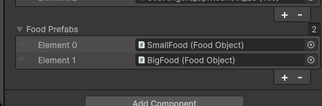

## 9. 挑战（Challenge）

本项目为你提供了多个食物精灵，其中一些看起来代表更多的食物。尝试创建多个预制体，并根据每个食物看起来的大小，为每个预制体设置不同的 AmountGranted（给予数量）。

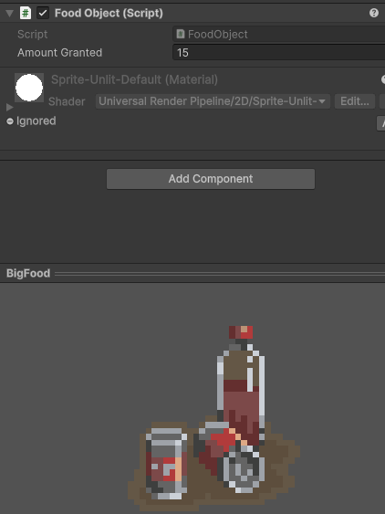

你需要把 FoodPrefab 变成一个数组，并在关卡创建时从该数组中随机选取一个预制体。

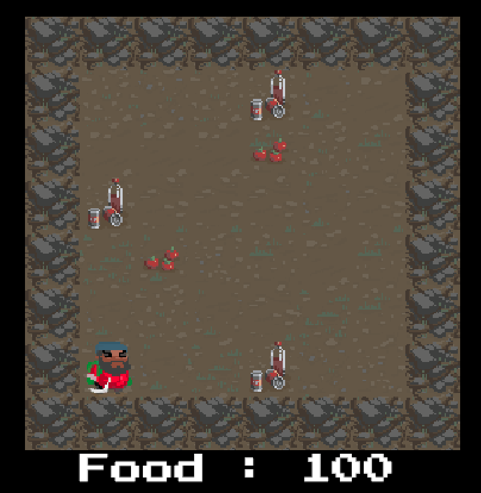

## 10. 后续步骤（Next steps）

你的游戏开始成型了！你有了游戏棋盘、可控的玩家角色、回合系统，以及需要追踪的可收集资源！在下一个教程中，你将通过添加障碍物来增加游戏难度！
