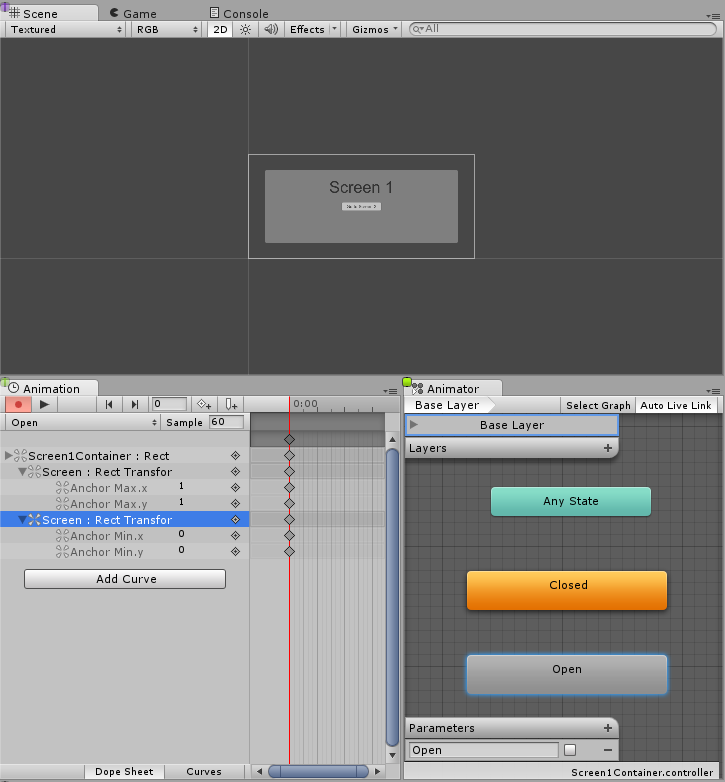
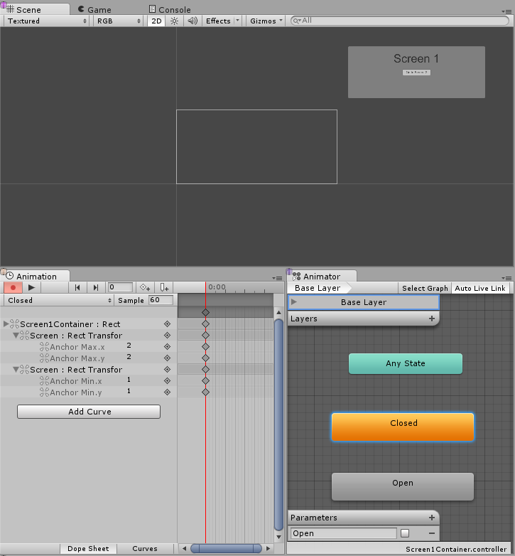
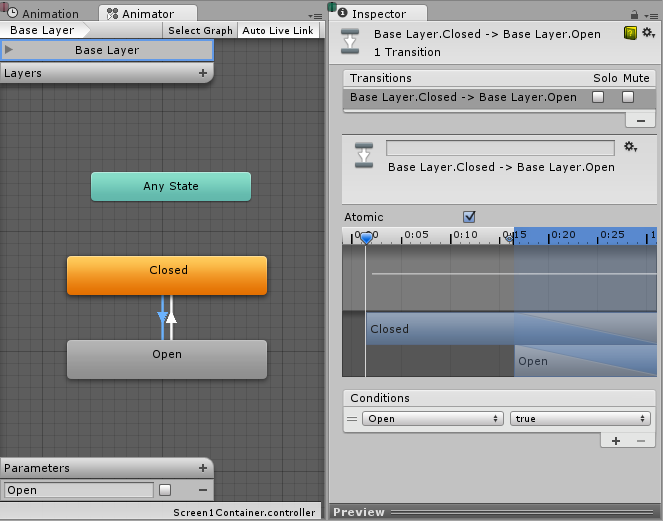
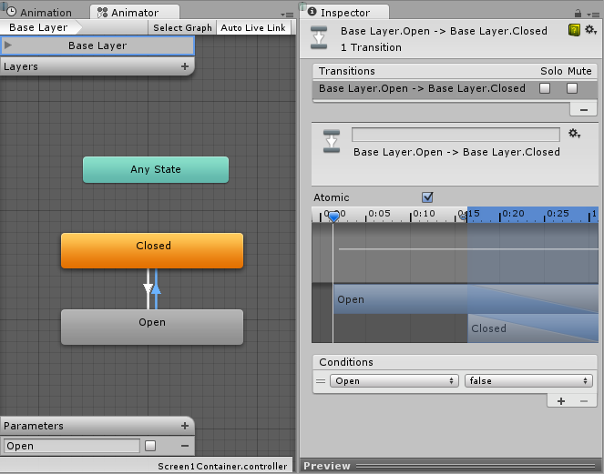
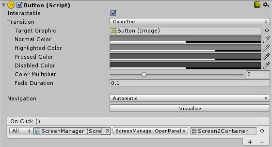

# 创建屏幕过渡（Creating Screen Transitions）

> 来源：[Unity UGUI 2.6 — Creating Screen Transitions](https://docs.unity3d.com/Packages/com.unity.ugui@2.6/manual/HOWTO-UIScreenTransition.html)  
> 官方源文件：[uGUI/Documentation~/HOWTO-UIScreenTransition.md](https://github.com/Unity-Technologies/uGUI/blob/main/com.unity.ugui/Documentation~/HOWTO-UIScreenTransition.md)  
> 整理日期：2026-09-05

在多个 UI 屏幕之间切换的需求相当常见。本页将探讨一种简单的方法：使用动画（animation）和状态机（State Machine）来驱动和控制每个屏幕，从而创建和管理这些过渡。

## 概述（Overview）

总体思路是：每个屏幕都有一个 Animator Controller，其中包含两个状态（Open 和 Closed）和一个布尔参数（Open）。要在屏幕之间切换，你只需要关闭当前打开的屏幕，并打开想要的屏幕。为了让这个过程更简单，我们将创建一个小类 **ScreenManager**，由它负责记录并关闭任何已打开的屏幕。触发过渡的按钮只需要请求 ScreenManager 打开目标屏幕即可。

## 关于导航的思考（Thinking about Navigation）

如果你打算支持手柄/键盘导航 UI 元素，那么有几件事需要牢记。务必避免屏幕之外存在 Selectable 元素，因为那会让玩家选中屏幕外的元素——我们可以通过停用所有屏幕外的层级来做到这一点。我们还需要确保在显示新屏幕时，从该屏幕中选中一个元素，否则玩家将无法导航到新屏幕。所有这些都将在下面的 ScreenManager 类中处理。

## 设置 Animator Controller（Setting up the Animator Controller）

我们来看看实现屏幕过渡最常用、最精简的 Animation Controller 设置。控制器需要一个布尔参数（Open）和两个状态（Open 和 Closed），每个状态都应有一个只包含一个关键帧（keyframe）的动画，这样我们就可以让状态机替我们完成过渡混合（transition blending）。

### Open 状态与动画



### Closed 状态与动画



现在需要创建两个状态之间的过渡。先创建 Open 到 Closed 的过渡并正确设置条件：当参数 Open 设为 false 时，从 Open 转到 Closed。然后创建 Closed 到 Open 的过渡，并设置条件为：当参数 Open 为 true 时，从 Closed 转到 Open。

### Closed 到 Open 的过渡



### Open 到 Closed 的过渡



## 管理屏幕（Managing the Screens）

完成上述设置后，唯一缺少的就是：在要过渡到的屏幕的 Animator 上将参数 Open 设为 true，在当前打开的屏幕的 Animator 上将 Open 设为 false。为此，我们将创建一个小脚本：

```csharp
using UnityEngine;
using UnityEngine.UI;
using UnityEngine.EventSystems;
using System.Collections;
using System.Collections.Generic;

public class ScreenManager : MonoBehaviour {

    // 场景开始时自动打开的屏幕
    public Animator initiallyOpen;

    // 当前打开的屏幕
    private Animator m_Open;

    // 用于控制过渡的参数的哈希值。
    private int m_OpenParameterId;

    // 打开当前屏幕之前选中的 GameObject。
    // 用于关闭屏幕时，回到打开它的按钮。
    private GameObject m_PreviouslySelected;

    // 需要检查的 Animator 状态和过渡名称。
    const string k_OpenTransitionName = "Open";
    const string k_ClosedStateName = "Closed";

    public void OnEnable()
    {
        // 缓存 "Open" 参数的哈希值，以便传递给 Animator.SetBool。
        m_OpenParameterId = Animator.StringToHash (k_OpenTransitionName);

        // 如果设置了初始屏幕，现在打开它。
        if (initiallyOpen == null)
            return;
        OpenPanel(initiallyOpen);
    }

    // 关闭当前打开的 panel，并打开指定的 panel。
    // 同时负责处理导航，设置新的选中元素。
    public void OpenPanel (Animator anim)
    {
        if (m_Open == anim)
            return;

        // 激活新屏幕的层级，以便对其进行动画。
        anim.gameObject.SetActive(true);
        // 保存当前用于打开此屏幕的选中按钮。（CloseCurrent 会修改它）
        var newPreviouslySelected = EventSystem.current.currentSelectedGameObject;
        // 把屏幕移到最前面。
        anim.transform.SetAsLastSibling();

        CloseCurrent();

        m_PreviouslySelected = newPreviouslySelected;

        // 将新屏幕设为当前打开的屏幕。
        m_Open = anim;
        // 开始打开动画
        m_Open.SetBool(m_OpenParameterId, true);

        // 将新屏幕中的一个元素设为新的选中元素。
        GameObject go = FindFirstEnabledSelectable(anim.gameObject);
        SetSelected(go);
    }

    // 在给定层级中查找第一个可用的 Selectable 元素。
    static GameObject FindFirstEnabledSelectable (GameObject gameObject)
    {
        GameObject go = null;
        var selectables = gameObject.GetComponentsInChildren<Selectable> (true);
        foreach (var selectable in selectables) {
            if (selectable.IsActive () && selectable.IsInteractable ()) {
                go = selectable.gameObject;
                break;
            }
        }
        return go;
    }

    // 关闭当前打开的屏幕
    // 同时处理导航。
    // 将选中状态恢复到打开当前屏幕之前使用的 Selectable。
    public void CloseCurrent()
    {
        if (m_Open == null)
            return;

        // 开始关闭动画。
        m_Open.SetBool(m_OpenParameterId, false);

        // 将选中状态恢复到打开当前屏幕之前使用的 Selectable。
        SetSelected(m_PreviouslySelected);
        // 启动协程，在关闭动画结束后停用层级。
        StartCoroutine(DisablePanelDeleyed(m_Open));
        // 当前没有打开的屏幕。
        m_Open = null;
    }

    // 检测关闭动画何时结束，然后停用层级的协程。
    IEnumerator DisablePanelDeleyed(Animator anim)
    {
        bool closedStateReached = false;
        bool wantToClose = true;
        while (!closedStateReached && wantToClose)
        {
            if (!anim.IsInTransition(0))
                closedStateReached = anim.GetCurrentAnimatorStateInfo(0).IsName(k_ClosedStateName);

            wantToClose = !anim.GetBool(m_OpenParameterId);

            yield return new WaitForEndOfFrame();
        }

        if (wantToClose)
            anim.gameObject.SetActive(false);
    }

    // 让指定 GameObject 处于选中状态。
    // 使用鼠标/触摸时，我们实际上希望把它设为先前选中的对象，
    // 而当前不选中任何对象。
    private void SetSelected(GameObject go)
    {
        // 选中该 GameObject。
        EventSystem.current.SetSelectedGameObject(go);

        // 如果当前正在使用键盘，到这里就够了。
        var standaloneInputModule = EventSystem.current.currentInputModule as StandaloneInputModule;
        if (standaloneInputModule != null)
            return;

        // 由于我们使用的是指针设备，不希望有任何对象被选中。
        // 但如果用户切换到键盘，我们希望从指定游戏对象开始导航。
        // 所以这里把当前选中设为 null，使指定 gameObject 成为 EventSystem 中的 Last Selected。
        EventSystem.current.SetSelectedGameObject(null);
    }
}
```

然后挂上这个脚本：创建一个新的 GameObject（例如命名为 “ScreenManager”），把上面的组件添加给它。你可以给它指定一个初始屏幕，这个屏幕会在场景开始时打开。

最后一步，让 UI 按钮生效。选择应该触发屏幕过渡的按钮，在 Inspector 的 On Click () 列表下添加一个新动作。把我们刚创建的 ScreenManager GameObject 拖到 ObjectField 中，在下拉菜单中选择 ScreenManager->OpenPanel (Animator)，然后把用户点击按钮时要打开的 panel 拖到最后一个 ObjectField 中。



## 备注（Notes）

这种技术只要求每个屏幕有一个带 Open 参数和 Closed 状态的 AnimatorController 即可工作——屏幕或状态机的具体构建方式并不重要。这种技术同样适用于嵌套屏幕，也就是说每个嵌套层级只需要一个 ScreenManager。

我们上面设置的状态机默认状态是 Closed，因此所有使用该控制器的屏幕初始都是关闭的。ScreenManager 提供了 initiallyOpen 属性，可以指定首先显示哪个屏幕。
