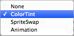
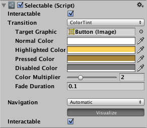
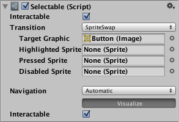
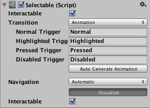

# Transition Options（过渡选项）

在 Selectable 组件中，根据组件当前所处的状态，提供了若干过渡选项。不同的状态包括：正常（normal）、高亮（highlighted）、按下（pressed）和禁用（disabled）。

| 过渡选项 | 功能 |
| --- | --- |
| **None**（无） | 按钮没有任何状态效果。 |
| **Color Tint**（颜色着色） | 根据按钮所处的状态改变按钮的颜色。可以为每个状态单独选择颜色，也可以设置不同状态之间的 Fade Duration（淡入淡出时长）。数值越大，颜色之间的过渡就越慢。 |
| **Sprite Swap**（精灵切换） | 允许根据按钮当前所处的状态显示不同的精灵（Sprite），精灵可以自定义。 |
| **Animation**（动画） | 允许根据按钮的状态播放动画。要使用动画过渡，组件上必须存在 Animator（动画器）组件，并且务必确保禁用 Root Motion（根运动）。要创建动画控制器，请点击 Generate Animation（生成动画）（或自行创建），并确保已为按钮的 Animator 组件添加了动画控制器。 |

除 **None** 之外的每个过渡选项都会提供额外的参数来控制过渡行为，我们将在下面的各小节中详细介绍。

## Color Tint（颜色着色）

| 属性                          | 功能                                                                                |
| --------------------------- | --------------------------------------------------------------------------------- |
| **Target Graphic**（目标图形）    | 用于交互组件的图形。                                                                        |
| **Normal Color**（正常颜色）      | 控件的正常颜色。                                                                          |
| **Highlighted Color**（高亮颜色） | 控件处于高亮状态时的颜色。                                                                     |
| **Pressed Color**（按下颜色）     | 控件处于按下状态时的颜色。                                                                     |
| **Disabled Color**（禁用颜色）    | 控件处于禁用状态时的颜色。                                                                     |
| **Color Multiplier**（颜色倍乘器） | 将每种过渡的着色颜色乘以其数值。借助它，可以创建大于 1 的颜色值，使基础颜色低于白色（或 Alpha 值低于不透明）的图形元素颜色（或 Alpha 通道）更亮。 |
| **Fade Duration**（淡入淡出时长）   | 从一种状态过渡到另一种状态所需的时间（单位：秒）。                                                         |

## Sprite Swap（精灵切换）

| 属性 | 功能 |
| --- | --- |
| **Target Graphic**（目标图形） | 要使用的正常精灵。 |
| **Highlighted Sprite**（高亮精灵） | 控件处于高亮状态时使用的精灵。 |
| **Pressed Sprite**（按下精灵） | 控件处于按下状态时使用的精灵。 |
| **Disabled Sprite**（禁用精灵） | 控件处于禁用状态时使用的精灵。 |

## Animation（动画）

| 属性 | 功能 |
| --- | --- |
| **Normal Trigger**（正常触发器） | 要使用的正常动画触发器。 |
| **Highlighted Trigger**（高亮触发器） | 控件处于高亮状态时使用的触发器。 |
| **Pressed Trigger**（按下触发器） | 控件处于按下状态时使用的触发器。 |
| **Disabled Trigger**（禁用触发器） | 控件处于禁用状态时使用的触发器。 |

相关文档：[Selectable（可选择基类）](Selectable-中文文档.md) · [Navigation Options（导航选项）](NavigationOptions-中文文档.md)
