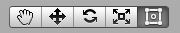
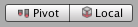
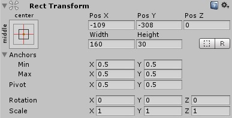
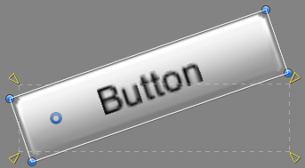
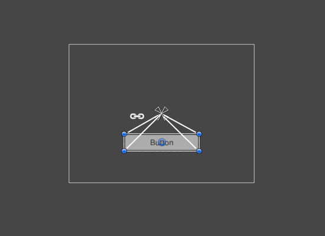
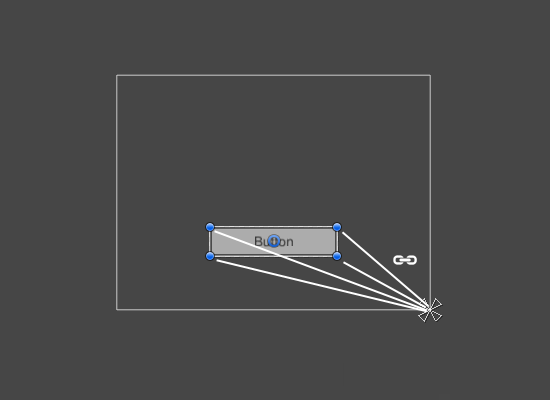
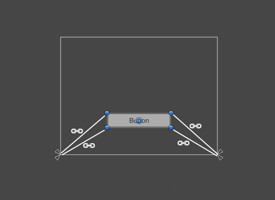
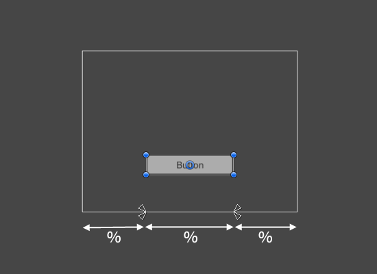
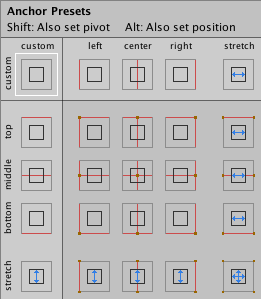

# 基础布局（Basic Layout）

> 来源：[Unity UGUI 2.6 — Basic Layout](https://docs.unity3d.com/Packages/com.unity.ugui@2.6/manual/UIBasicLayout.html)  
> 官方源文件：[uGUI/Documentation~/UIBasicLayout.md](https://github.com/Unity-Technologies/uGUI/blob/main/com.unity.ugui/Documentation~/UIBasicLayout.md)  
> 整理日期：2026-09-05

本节介绍如何让 UI 元素相对于 Canvas 或彼此进行定位。想边读边实践时，可以通过菜单 **GameObject > UI > Image** 创建一个 Image。

## Rect Tool（矩形工具）

出于布局目的，每个 UI 元素都由一个矩形表示。可以在 Scene View 中使用工具栏上的 **Rect Tool** 操作这个矩形。Rect Tool 同时用于 Unity 的 2D 功能和 UI，也可以用于 3D 对象。

Rect Tool 可以移动、缩放和旋转 UI 元素：

- 选中 UI 元素后，在矩形内部任意位置单击并拖动，可以移动元素。
- 单击边缘或角点并拖动，可以改变大小。
- 将鼠标悬停在角点稍外侧，直到鼠标指针变为旋转图标，然后单击并拖动，可以旋转元素。

与其他工具一样，Rect Tool 使用工具栏中设置的当前轴心模式和坐标空间。处理 UI 时，通常建议将它们设置为 **Pivot** 和 **Local**。

## Rect Transform

Rect Transform 是用于所有 UI 元素的新型 Transform 组件，替代普通的 Transform 组件。

Rect Transform 与普通 Transform 一样具有位置、旋转和缩放属性，但额外具有用于指定矩形尺寸的宽度和高度。

## 改变尺寸与缩放的区别

使用 Rect Tool 改变对象尺寸时，对于 2D 系统中的 Sprite 和 3D 对象，通常会改变对象的本地 **scale**。但对于带 Rect Transform 的对象，Rect Tool 改变的是宽度和高度，本地缩放保持不变。

这种改变尺寸的方式不会影响字体大小、切片图片的边框等属性。

## Pivot（轴心）

旋转、尺寸和缩放修改都会围绕轴心发生，因此轴心的位置会影响旋转、调整尺寸和缩放的结果。当工具栏的 Pivot 按钮处于 Pivot 模式时，可以直接在 Scene View 中移动 Rect Transform 的轴心。

## Anchors（锚点）

Rect Transform 包含一个称为锚点的布局概念。锚点在 Scene View 中显示为四个小三角形手柄，Inspector 中也会显示锚点信息。

如果 Rect Transform 的父对象也是 Rect Transform，子 Rect Transform 就可以用多种方式锚定到父 Rect Transform，例如锚定到父对象中心或某个角点。

锚点也支持让子元素随父元素的宽度或高度一起拉伸。矩形的每个角相对于对应锚点都有固定偏移：例如矩形左上角相对于左上锚点保持固定偏移。这样，矩形的不同角就可以锚定到父矩形中的不同位置。

锚点位置以父矩形宽度和高度的分数（百分比）表示：

- `0.0`（0%）对应左侧或底部；
- `0.5`（50%）对应中间；
- `1.0`（100%）对应右侧或顶部。

锚点并不局限于边缘和中心，可以锚定到父矩形内部的任意位置。

可以分别拖动每个锚点。如果锚点彼此重合，也可以在它们中间单击并拖动，使它们一起移动。拖动锚点时按住 **Shift**，矩形对应的角也会与锚点一起移动。

锚点手柄还会自动吸附到兄弟矩形的锚点，方便精确定位。

## Anchor Presets（锚点预设）

Rect Transform 组件左上角有 **Anchor Preset** 按钮。单击该按钮会打开 Anchor Presets 下拉面板，可快速选择常见的锚定方式：将 UI 元素锚定到父对象的边缘、中心，或让它随父对象尺寸一起拉伸。水平和垂直锚定彼此独立。

如果当前锚点恰好对应某个预设，Anchor Presets 按钮会显示该预设；如果水平或垂直轴的锚点位置与所有预设都不同，则会显示自定义选项。

## Inspector 中的锚点与位置字段

如果锚点字段尚未显示，可以单击 Anchors 展开箭头。**Anchor Min** 对应 Scene View 中左下锚点手柄，**Anchor Max** 对应右上锚点手柄。

矩形的位置字段取决于锚点是否重合：

- 锚点重合时，字段为 **Pos X、Pos Y、Width、Height**。Pos X 和 Pos Y 表示轴心相对于锚点的位置。
- 锚点分离时，字段可能部分或全部变为 **Left、Right、Top、Bottom**。这些字段定义锚点矩形内部的内边距：水平方向分离时使用 Left 和 Right，垂直方向分离时使用 Top 和 Bottom。

修改锚点或轴心字段时，Unity 通常会反向调整位置字段，让矩形保持原位。如果不希望这样，可以在 Inspector 中单击 **R** 按钮启用 **Raw edit mode**。这样修改锚点和轴心时不会自动调整其他值，但矩形很可能会发生视觉上的移动或缩放，因为它的位置和尺寸依赖锚点与轴心。

