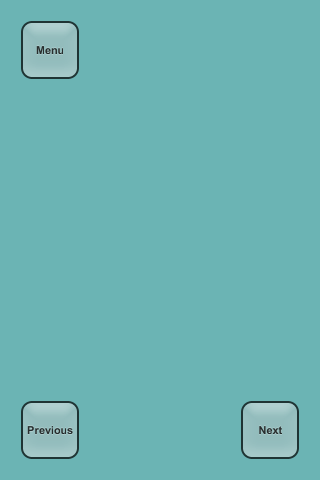
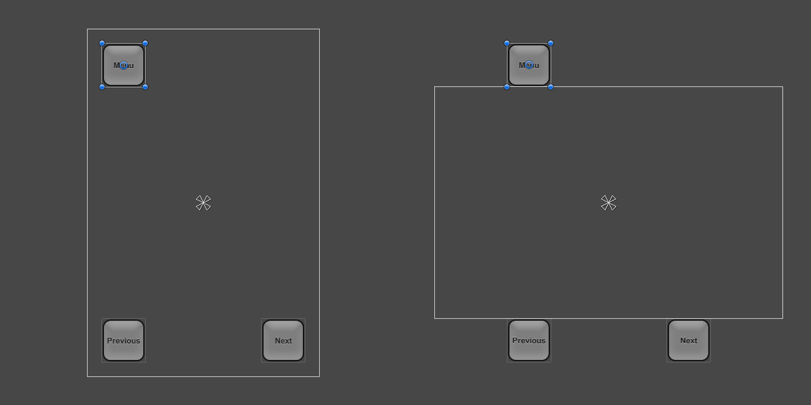
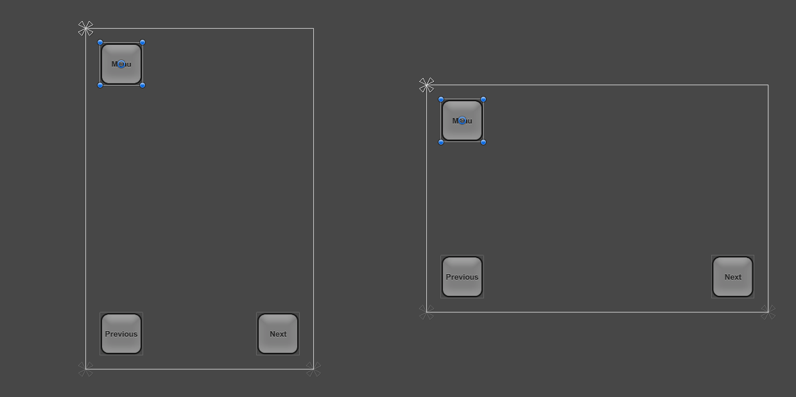
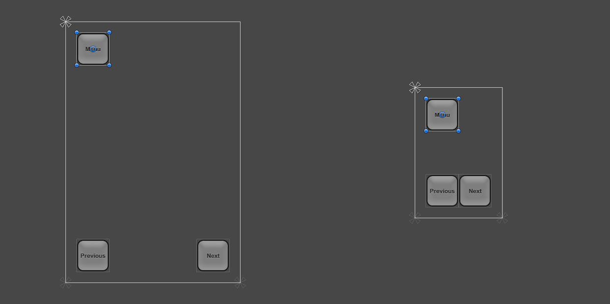
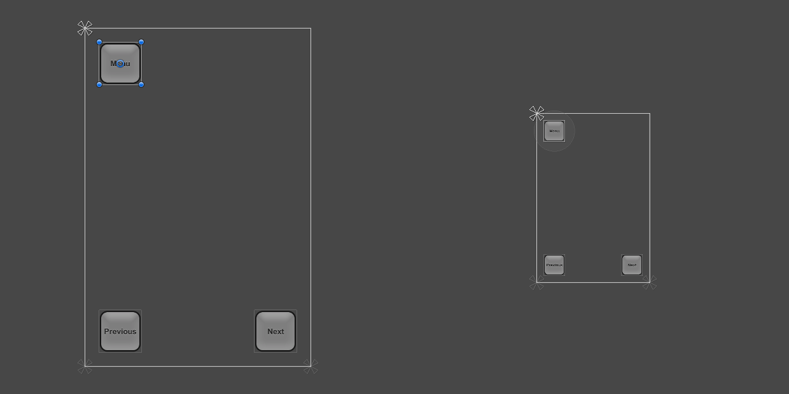
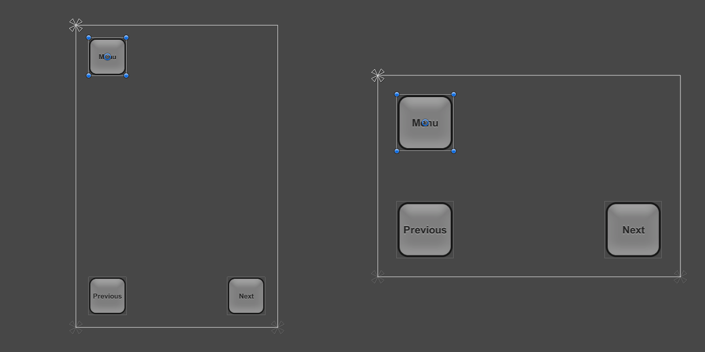
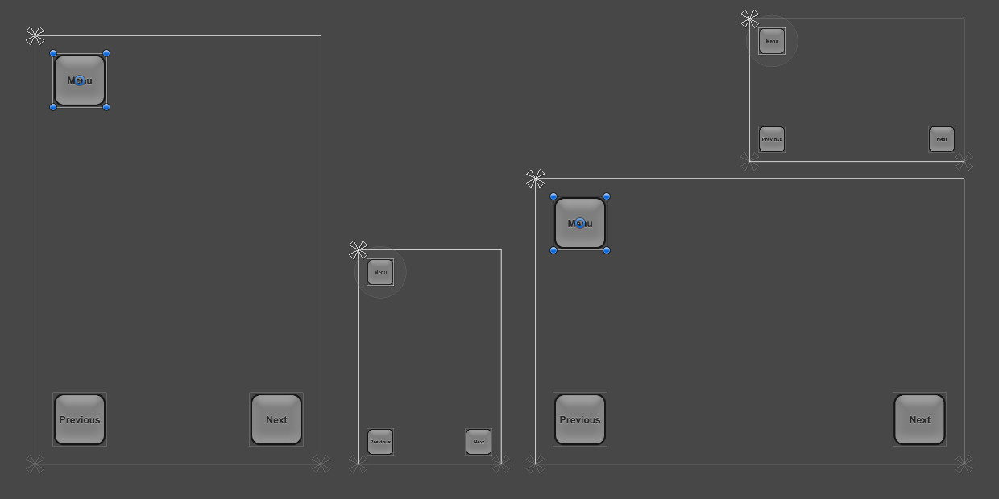

# 设计多分辨率 UI（Designing UI for Multiple Resolutions）

现代游戏和应用通常需要支持多种不同的屏幕分辨率，尤其要求 UI 布局能够随之自适应。Unity 的 UI 系统为此提供了一系列工具，可以按各种方式组合使用。

在本教程中，我们将通过一个简单的案例，结合场景查看并比较不同的工具。案例中有三个按钮，分别位于屏幕的三个角落，如下所示，目标是让这个布局适应各种分辨率。

本教程将考虑四种屏幕分辨率：Phone HD 竖屏（640 × 960）和横屏（960 × 640），以及 Phone SD 竖屏（320 × 480）和横屏（480 × 320）。布局最初在 Phone HD 竖屏分辨率下搭建。

## 使用锚点适应不同宽高比（Using Anchors to Adapt to Different Aspect Ratios）

UI 元素默认锚定在父矩形的中心，这意味着它们与中心保持固定的偏移。

如果在这种设置下把分辨率改为横屏宽高比，按钮甚至可能不再位于屏幕矩形之内。

让按钮保持在屏幕内的一种方法，是改变布局，使按钮的位置与屏幕各自的角落绑定。左上角按钮的锚点可以在 Inspector 中使用 Anchors Preset（锚点预设）下拉菜单设置为左上角，也可以在 Scene 视图中拖动三角形的锚点手柄来设置。最好在 Game 视图当前分辨率与初始设计布局时的分辨率一致（即按钮摆放看起来正确）时进行此操作。（关于锚点的更多信息，请参见 [UI 基础布局（UI Basic Layout）](https://docs.unity3d.com/Packages/com.unity.ugui@2.6/manual/UIBasicLayout.html) 页面。）类似地，左下角按钮和右下角按钮的锚点可以分别设置为左下角和右下角。

一旦按钮锚定到各自的角落，当分辨率改变为不同宽高比时，它们就会固定在角落上。

当屏幕尺寸改为更大或更小的分辨率时，按钮仍然保持锚定在各自的角落。但是，由于它们保持以像素指定的原始大小，因此它们在屏幕中占的比例会变大或变小。这是否符合预期，取决于你希望布局在不同分辨率屏幕上的表现。

在本教程中，我们知道 Phone SD 竖屏和横屏这些较小的分辨率对应的并不是物理上更小的屏幕，而只是像素密度更低的屏幕。在这些低密度屏幕上，按钮不应显得比高密度屏幕上更大——它们应以相同的大小显示。

这意味着按钮应该按照与屏幕缩小相同的百分比变小。换句话说，按钮的缩放比例应跟随屏幕尺寸。这正是 Canvas Scaler 组件可以发挥作用的地方。

## 按屏幕尺寸缩放（Scaling with Screen Size）

Canvas Scaler 组件可以添加到根 Canvas 上——即挂有 Canvas 组件、所有 UI 元素都是其子对象的游戏对象。通过 GameObject 菜单创建新 Canvas 时，默认也会添加该组件。

在 Canvas Scaler 组件中，可以将 UI Scale Mode（UI 缩放模式）设置为 Scale With Screen Size（随屏幕尺寸缩放）。在此缩放模式下，可以指定一个分辨率作为参考（reference）。如果当前屏幕分辨率比参考分辨率小或大，Canvas 的缩放因子会相应设置，从而让所有 UI 元素随屏幕分辨率一起放大或缩小。

在本案例中，我们将 Canvas Scaler 设置为 Phone HD 竖屏分辨率 640 × 960。现在，当把屏幕分辨率设为 Phone SD 竖屏分辨率 320 × 480 时，整个布局都会缩小，使其看起来与满分辨率时比例相同。所有内容都被缩小：按钮大小、按钮到屏幕边缘的距离、按钮图形以及文本元素。这意味着布局在 Phone SD 竖屏分辨率下与 Phone HD 竖屏下看起来相同，只是像素密度更低。

需要注意的一点：添加 Canvas Scaler 组件后，还应检查布局在其他宽高比下的表现。将分辨率改回 Phone HD 横屏后，可以看到按钮现在显得比应有的（也是之前的）更大。

横屏宽高比下按钮变大的原因，在于 Canvas Scaler 设置的工作原理。默认情况下，它比较当前分辨率的宽度与 Canvas Scaler 的宽度，并用结果作为缩放因子来缩放一切。由于当前横屏分辨率 960 × 640 的宽度是竖屏 Canvas Scaler（640 × 960）宽度的 1.5 倍，因此布局被放大了 1.5 倍。

该组件有一个名为 Match（匹配）的属性，取值可以为 0（宽度）、1（高度）或介于两者之间的值。默认设为 0，即按上述方式将当前屏幕宽度与 Canvas Scaler 宽度进行比较。

如果将 Match 属性改为 0.5，它会同时比较当前宽度与参考宽度、当前高度与参考高度，并选择介于两者之间的缩放因子。由于本例中横屏分辨率比参考分辨率宽 1.5 倍，同时矮 1.5 倍（高度为参考值的 2/3），这两个因素相互抵消，最终得到缩放因子 1，意味着按钮保持原始大小。

到这一步，通过合适的锚点与 Canvas 上的 Canvas Scaler 组件相结合，布局已经能够支持全部四种屏幕分辨率。

关于针对不同屏幕尺寸缩放 UI 元素的更多方式，请参阅 [Canvas Scaler](https://docs.unity3d.com/Packages/com.unity.ugui@2.6/manual/script-CanvasScaler.html) 参考页面。
