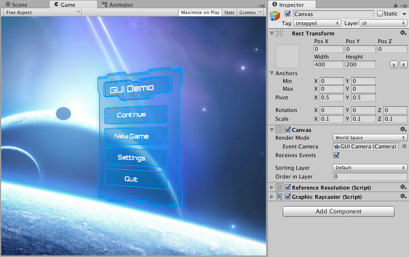

# 3D 场景中的 UI：世界空间怪物血条

> 来源：[Unity UGUI 2.6 — Creating a World Space UI](https://docs.unity3d.com/Packages/com.unity.ugui@2.6/manual/HOWTO-UIWorldSpace.html)  
> 相关文档：[UICanvas-中文文档](UICanvas-中文文档.md)  
> 官方源文件：[uGUI/Documentation~/HOWTO-UIWorldSpace.md](https://github.com/Unity-Technologies/uGUI/blob/main/com.unity.ugui/Documentation~/HOWTO-UIWorldSpace.md)  
> 整理日期：2026-09-05

在 3D 场景中显示怪物血条、名字、伤害数字或任务标记，最常用的方案是创建一个 **World Space Canvas**。它属于场景中的 3D 对象，会随着怪物移动，也可以被场景中的其他物体遮挡。

## 一、先理解三种 UI 空间

| 类型 | 典型用途 | 是否随场景对象移动 | 是否参与场景遮挡 |
| --- | --- | --- | --- |
| **Screen Space - Overlay** | 固定在屏幕上的 HUD、主菜单 | 否 | 否 |
| **Screen Space - Camera** | 由指定相机渲染的 HUD、后处理相关 UI | 否 | 通常不按普通 3D 物体遮挡 |
| **World Space** | 怪物血条、NPC 名字、世界中的交互提示 | 是 | 是，取决于材质、相机和排序设置 |

Canvas 的 **Render Mode** 决定了 UI 的渲染空间。关于 Canvas 绘制顺序和三种渲染模式，可以参阅 [UICanvas-中文文档](UICanvas-中文文档.md)。

## 二、创建 World Space Canvas

### 1. 创建 Canvas

如果场景中还没有 UI 元素，可以执行 **GameObject > UI (Canvas) > Image**。Unity 会同时创建 Canvas 和 Image。也可以在 Hierarchy 中右键选择 **UI > Canvas**。

选中 Canvas，在 Inspector 中设置：

- **Render Mode**：`World Space`
- **Event Camera**：只有当血条需要接收点击、拖拽等 UI 事件时才需要设置；纯显示血条可以不设置
- **Graphic Raycaster**：纯显示血条可以移除或禁用，避免它参与 UI 射线检测
- **Canvas Scaler**：可以保留，但世界空间下最终显示大小主要由 Rect Transform 和 Transform 的 Scale 决定



### 2. 设置 Canvas 分辨率

World Space Canvas 的 Rect Transform 尺寸可以理解为“UI 画布中的像素尺寸”。例如，可以设置：

- **Width**：800
- **Height**：100

这个尺寸只是用于布局和绘制精度，不代表场景中的 800 米。Canvas 还需要通过 Transform 的 Scale 缩放到合适的世界大小。

### 3. 设置世界尺寸

如果 Canvas 宽度为 `canvasWidth`，希望它在世界中的宽度为 `meterSize`，可以使用下面的公式计算缩放值：

```text
scale = meterSize / canvasWidth
```

例如，800 像素宽的血条希望在世界中宽 1.6 米：

```text
1.6 / 800 = 0.002
```

将 Canvas 的 Scale 设置为：

```text
X = 0.002
Y = 0.002
Z = 0.002
```

三个轴使用相同的缩放值，可以避免血条变形。

## 三、制作怪物血条 Prefab

推荐的层级结构如下：

```text
Monster
└── UIAnchor（挂在头顶或身体上方）
    └── WorldSpaceHealthBar（World Space Canvas）
        ├── Background（Image）
        │   └── Fill（Image，Type = Filled）
        └── ValueText（可选，Text）
```

### Background 和 Fill 的设置

1. 在 Canvas 下创建一个 Image，命名为 `Background`。
2. 再创建一个 Image，命名为 `Fill`，使它成为 Background 的子对象。
3. 给 `Background` 设置深色背景 Sprite。
4. 给 `Fill` 设置彩色 Sprite。
5. 将 `Fill` 的 Image **Type** 设置为 `Filled`。
6. 将 **Fill Method** 设置为 `Horizontal`。
7. 将 **Fill Origin** 设置为左侧或右侧。
8. 将 **Fill Amount** 初始设置为 `1`。

之后只需要修改 `Fill.fillAmount`，就可以让血条从满血平滑缩短到空血。

### 为什么不建议直接缩放 Fill

直接修改 Fill 的 `localScale.x` 也能做出缩短效果，但它会同时影响子物体、边缘形状和某些九宫格 Sprite 的表现。使用 `Image Type = Filled` 能让“填充比例”与 UI 图形本身分离，维护起来更直观。

## 四、让血条跟随怪物

最简单的方法是把血条 Canvas 作为怪物或 `UIAnchor` 的子对象，然后设置一个局部坐标偏移：

```text
UIAnchor.localPosition = (0, 2.2, 0)
```

如果怪物有不同身高，建议在模型头顶创建一个专门的 `UIAnchor`，这样血条不会依赖模型根节点的中心位置。

如果血条需要脱离怪物层级统一管理，也可以在每帧或 `LateUpdate` 中将它的位置同步到目标点。同步放在 `LateUpdate` 通常可以减少怪物在本帧移动后血条出现一帧延迟的问题。

## 五、让血条始终朝向相机

这类效果通常称为 Billboard。下面的脚本会让血条位置跟随目标，并让画布朝向相机。

```csharp
using UnityEngine;
using UnityEngine.UI;

public sealed class WorldSpaceHealthBar : MonoBehaviour
{
    [Header("显示")]
    [SerializeField] private Image fill;
    [SerializeField] private Text valueText;

    [Header("跟随")]
    [SerializeField] private Transform followTarget;
    [SerializeField] private Vector3 worldOffset = new Vector3(0f, 2.2f, 0f);
    [SerializeField] private Camera targetCamera;

    private void Awake()
    {
        if (targetCamera == null)
        {
            targetCamera = Camera.main;
        }
    }

    private void LateUpdate()
    {
        if (followTarget != null)
        {
            transform.position = followTarget.position + worldOffset;
        }

        if (targetCamera == null)
        {
            return;
        }

        // 让画布的正面朝向相机。
        // 如果你的 Canvas 正反面相反，将 LookRotation 的方向改为
        // targetCamera.transform.position - transform.position。
        transform.rotation = Quaternion.LookRotation(
            transform.position - targetCamera.transform.position,
            Vector3.up);
    }

    public void SetHealth(float current, float maximum)
    {
        float normalized = maximum <= 0f ? 0f : current / maximum;
        normalized = Mathf.Clamp01(normalized);

        if (fill != null)
        {
            fill.fillAmount = normalized;
        }

        if (valueText != null)
        {
            valueText.text = $"{Mathf.CeilToInt(Mathf.Max(0f, current))} / " +
                             $"{Mathf.CeilToInt(Mathf.Max(0f, maximum))}";
        }
    }
}
```

> 注意：不同项目的 Canvas 正面方向、模型朝向和相机位置可能不同。如果血条背对相机，按脚本注释反转 `LookRotation` 的方向即可。

## 六、把血量数据绑定到血条

血条只负责显示，不建议让它自己负责怪物的受伤逻辑。可以让怪物脚本在血量变化时主动通知血条：

```csharp
using UnityEngine;

public sealed class MonsterHealth : MonoBehaviour
{
    [SerializeField] private float maximumHealth = 100f;
    [SerializeField] private WorldSpaceHealthBar healthBar;

    private float currentHealth;

    private void Awake()
    {
        currentHealth = maximumHealth;

        if (healthBar != null)
        {
            healthBar.SetHealth(currentHealth, maximumHealth);
        }
    }

    public void TakeDamage(float damage)
    {
        if (damage <= 0f || currentHealth <= 0f)
        {
            return;
        }

        currentHealth = Mathf.Max(0f, currentHealth - damage);

        if (healthBar != null)
        {
            healthBar.SetHealth(currentHealth, maximumHealth);
        }

        if (currentHealth <= 0f)
        {
            Die();
        }
    }

    private void Die()
    {
        // 播放死亡动画、禁用 AI、销毁怪物等。
    }
}
```

这种写法只在受伤时更新 `fillAmount`，不需要每帧重复计算血量，适合场景中同时存在大量怪物的情况。

## 七、血条的可见性与遮挡

### 让血条被墙体遮挡

World Space Canvas 默认可以像场景中的其他几何体一样参与深度测试。要让血条正常被墙体、地形或其他模型遮挡，需要注意：

- 使用支持深度测试的 UI 材质；
- 不要随意启用 Canvas 的 **Override Sorting** 并把它放到始终最前的排序层；
- 检查血条材质的 Render Queue、ZTest 和透明度设置；
- 确认相机的 Culling Mask 同时包含 UI 和场景遮挡物所在的 Layer。

### 让血条始终显示在怪物上方

如果设计要求血条无论是否被墙体遮挡都显示，可以使用 Canvas 的 **Override Sorting**、Sorting Layer 和 Order in Layer，或者使用专门的始终置顶材质。但这样会牺牲自然遮挡效果，应该按玩法需求选择。

### 距离太远时隐藏

当场景中有大量怪物时，不要让所有远处血条一直渲染。可以按照怪物与相机的距离关闭 Canvas，或使用一个统一的血条管理器批量执行距离裁剪。

## 八、常见问题

### 血条太大或太小

检查 Canvas 的 Rect Transform 尺寸和 Transform Scale。世界空间 UI 的显示大小主要由“Rect Transform 尺寸 × 世界缩放”决定。优先使用前面的公式计算初始 Scale，再在 Scene View 中微调。

### 血条上下颠倒或左右反向

检查 Canvas 的旋转和 `LookRotation` 的方向。先确认血条在 Scene View 中哪一面是正面，再决定是否反转相机方向。

### 血条跟随不稳定

检查 `followTarget` 是否绑定到了正确的头顶锚点，并将跟随代码放在 `LateUpdate`。如果怪物使用 Rigidbody，物理移动和渲染插值也需要保持一致。

### 血条阻挡了点击

纯显示血条不需要接收 UI 事件。可以禁用 Canvas 上的 **Graphic Raycaster**，或关闭背景和填充 Image 的 **Raycast Target**。

### 每个怪物都创建 Canvas，性能会不会差

少量单位通常没有问题。单位数量很大时，建议：

- 只给屏幕内或一定距离内的怪物显示血条；
- 复用血条对象，而不是频繁 Instantiate/Destroy；
- 让血量变化采用事件驱动；
- 减少 Text、Mask 和复杂材质的使用；
- 合理合并 Canvas，避免大量 Canvas 不必要地重建。

## 九、推荐的最终结构

```text
MonsterPrefab
├── Model
├── UIAnchor
│   └── WorldSpaceHealthBarPrefab
│       ├── Background
│       ├── Fill
│       └── ValueText（可选）
└── MonsterHealth
```

这个结构把“世界空间显示”“血条表现”和“怪物血量逻辑”分开，后续可以很容易替换成护盾条、施法进度条、名字标签或状态图标。
