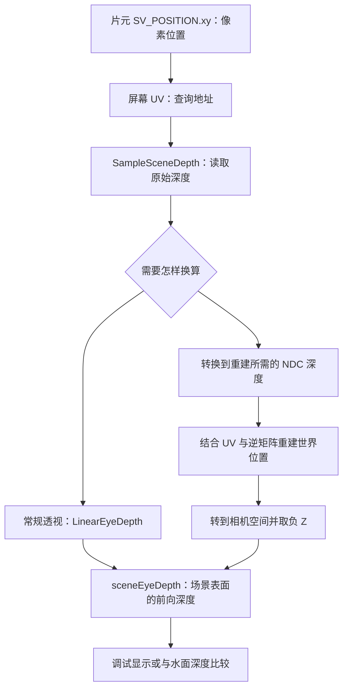

# 为什么水面教程与深度 FAQ 的深度写法不同

本文对照的是你笔记中的三份文档：

- [[Unity6.7-URP水面渲染-零基础教程]]：第 5 节完整 Shader 中的 `ReadSceneEyeDepth` 和 `Frag`。
- [[深度、屏幕UV与SV_Position到底是什么]]：Q2、Q11、Q14、Q15、Q17、Q18。
- [[Unity6.7-URP-ShaderLab与HLSL语法手册]]：第 12.1 节“场景深度”。

> [!abstract] 先给出答案
> **继续做这份水面效果时，保留水面教程的“重建世界位置 → 转到相机空间 → 取负 Z”路线。屏幕 UV 建议统一使用 `GetNormalizedScreenSpaceUV`。**
>
> 深度 FAQ 的 **Q17 本来就使用同一条重建路线**；Q11、Q14 中的 `LinearEyeDepth(rawDepth, _ZBufferParams)` 是常规透视投影下直接求前向深度的另一条路线。
>
> 两条路线在各自适用条件下可以得到相同含义的结果。真正应该统一的是：**读取哪个表面的深度、输入是什么表示、输出是什么单位，以及背景如何处理。**

这几份笔记没有把“同一件事的不同写法”和“不同用途的处理”集中对齐，确实容易让人误以为前后矛盾。这篇 FAQ 把它们逐项对应起来。

> [!info] 阅读与验证范围
> 以下讨论限定为原教程的普通网格 Pass、单相机、全尺寸视口，并要求深度纹理与当前相机矩阵匹配、在读取前已生成。本文核对了你提供的文件和 Unity 官方文档、公开源码；没有在你的 Unity 工程中执行编译或运行验证。
>
> 放到原笔记仓库的 `FAQ` 文件夹后，上面的 Obsidian 双向链接可连接到相关笔记。本文不改写原来的三份文档。

## Q1：两篇到底有哪些不同？

先不要把所有差异都看成“获取深度的方法不同”。它们分布在不同步骤：

| 比较内容 | 水面教程 | 深度 FAQ | 怎么理解 |
| --- | --- | --- | --- |
| 屏幕 UV | `positionCS.xy / _ScaledScreenParams.xy` | `GetNormalizedScreenSpaceUV(positionCS)` | 手写基础归一化与 URP 库函数 |
| 深度采样 | `SampleSceneDepth(uv)` | `SampleSceneDepth(screenUV)` | 同一个接口，参数名字不同 |
| 求前向深度 | 重建世界位置后取相机空间 `-z` | Q14 用 `LinearEyeDepth`；Q17 用重建 | FAQ 展示了两条路线 |
| 中间深度变量名 | `deviceDepth` | `ndcDepth` | 在这两段重建代码里承担相同作用 |
| 无几何背景 | 返回相机 Far 数值 | Q17 直接输出黑色 | 水面效果与调试显示的不同策略 |
| 背景判断阈值 | 接近远端就当背景 | Q17 只比较远端端点 | 近似程度不同，不能说完全等价 |
| 最后返回什么 | 辅助函数返回一个 `float` | Q17 的片元函数返回 `half4` 颜色 | 返回的是不同类型的数据 |
| 是否减去水面深度 | 是，用于水色与白沫 | Q17 不减；Q18 另行讲解 | 调试场景深度与制作水面效果的区别 |

**最重要的一处对照：水面教程的 `ReadSceneEyeDepth`，应该先与深度 FAQ 的 Q17 对比，而不是只与 Q14 的三行代码对比。**

## Q2：获取深度这件事，其实分成哪几步？

用“查表”的方式理解：

1. **算地址：** 当前片元对应画面上的哪个位置？得到 `screenUV`。
2. **查记录：** 在这个位置读取深度纹理。得到 `rawDepth`。
3. **换算含义：** 把记录的编码值换成前向距离，或者重建成世界位置。
4. **使用结果：** 画灰度图、计算水色、判断接触白沫等。



图中先省略了背景处理，后面 Q7 会补上。不要把图读成“先做左边，再做右边”：**直接线性化和位置重建是两条可选路线，不是必须串联的步骤。**

## Q3：LinearEyeDepth 与重建世界位置，为什么都能得到深度？

因为“相机前方多远”既可以从编码直接换算，也可以先恢复位置再测量。

### 路线 A：从原始深度直接换算

深度 FAQ 的 Q14 与语法手册第 12.1 节首先展示的是：

```hlsl
// 片元函数内，针对常规透视投影；暂时省略背景判断。
float2 screenUV = GetNormalizedScreenSpaceUV(IN.positionCS);
float rawDepth = SampleSceneDepth(screenUV);
float sceneEyeDepth = LinearEyeDepth(rawDepth, _ZBufferParams);
```

可以读成：“相机知道自己用了什么深度编码，所以直接把编码还原成前向距离。”

这里得到的是一个数字，例如 `5`，没有求出场景点的世界坐标 X、Y、Z。

### 路线 B：先恢复位置，再取得深度

水面教程与深度 FAQ 的 Q17 使用的是下面的核心逻辑：

```hlsl
// 已有匹配深度纹理的 screenUV；暂时省略背景判断。
float rawDepth = SampleSceneDepth(screenUV);

#if UNITY_REVERSED_Z
    float ndcDepth = rawDepth;
#else
    float ndcDepth = lerp(UNITY_NEAR_CLIP_VALUE, 1.0, rawDepth);
#endif

float3 sceneWS = ComputeWorldSpacePosition(
    screenUV, ndcDepth, UNITY_MATRIX_I_VP);

float sceneEyeDepth = -TransformWorldToView(sceneWS).z;
```

可以读成：“先找出深度纹理记录的那个点在世界中的位置，然后从相机的角度看它，取出前向距离。”

Unity 常规相机空间中，前方沿着负 Z，因此相机前方的点可以用 `-positionVS.z` 得到正的前向深度。这不是世界坐标里的负 Z；相机旋转后，两者通常不同。

两参数 `LinearEyeDepth` 的投影限制与运算见 [Unity Core RP 的 Common.hlsl](https://github.com/Unity-Technologies/Graphics/blob/master/Packages/com.unity.render-pipelines.core/ShaderLibrary/Common.hlsl)；路线 B 的深度范围转换与重建接口见 [Unity 6.7 官方重建示例](https://docs.unity3d.com/6000.7/Documentation/Manual/urp/writing-shaders-urp-reconstruct-world-position.html)。

### 用同一个数字检查它们

沿用深度 FAQ 中便于手算的条件：

- 常规透视投影，Near 为 `1`，Far 为 `11`。
- 普通近 0、远 1 深度，`rawDepth = 0.825`。
- 相机在世界原点，朝世界 `-Z`，宽高比为 1，水平和垂直视场角都是 90°。
- `screenUV = (0.75, 0.5)`。

直接换算得到：

```text
sceneEyeDepth = 1 / ((-10/11) × 0.825 + 1)
              = 4
```

位置重建得到世界位置 `(2, 0, -4)`。在这个特意安排的例子里，相机空间位置也相同，所以：

```text
sceneEyeDepth = -(-4) = 4
```

输出都是前向深度 `4`。到相机的斜向直线距离则是 `√20 ≈ 4.472`，不能把它与 `eyeDepth` 混为一谈。

> [!note] “结果相同”的前提
> 需要比较同一个 UV、同一份深度、匹配的相机参数和矩阵，并排除背景策略差异。浮点计算、深度精度和矩阵运算会带来误差，不要求逐位完全相等。

## Q4：水面教程为什么不用更短的 LinearEyeDepth？

从效果需求看，原水面示例主要需要一个前向深度，**常规透视相机下使用直接换算也可以**。重建路线不是唯一正确答案，也不是天然更精确。

但当前水面教程已经采用重建路线，这有两个实际好处：

- 与 FAQ 的 Q15、Q17 所解释的位置重建流程一致。
- 在 UV、深度与逆矩阵匹配时，这条计算路线也适用于常规正交投影，不需要套用透视专用的深度公式。

这不代表整套水面 Shader 已经完成正交相机或所有平台的验证；它只说明**这部分深度计算的适用范围**。

如果只需要普通透视下的前向深度，直接换算的源代码运算通常更少。实际性能还取决于编译结果和硬件，不应该只为了少几行代码就混用两种输入表示。

| 当前需求 | 建议选择 |
| --- | --- |
| 继续学习现有水面教程 | 保留重建路线，方便与 FAQ Q17 对照 |
| 只需要常规透视相机的前向深度 | 可以使用两参数 `LinearEyeDepth` |
| 需要世界坐标、世界高度等信息 | 重建世界位置，直接使用重建结果 |
| 希望同一段深度代码覆盖常规透视和正交 | 使用匹配矩阵重建，再取相机空间 `-z` |
| 使用斜裁剪或自定义投影 | 按实际投影核对，不能默认套用两参数透视公式 |

注意限定词是 **`LinearEyeDepth(rawDepth, _ZBufferParams)` 这个重载**。同名函数可能还有其他参数形式，不能把一个重载的限制推广到所有同名函数。[Unity 深度函数重载](https://github.com/Unity-Technologies/Graphics/blob/master/Packages/com.unity.render-pipelines.core/ShaderLibrary/Common.hlsl)

## Q5：屏幕 UV 的两种写法，以哪个为准？

水面教程写的是：

```hlsl
float2 screenUV = input.positionCS.xy / _ScaledScreenParams.xy;
```

深度 FAQ 写的是：

```hlsl
float2 screenUV = GetNormalizedScreenSpaceUV(IN.positionCS);
```

它们都在做“从片元像素位置得到屏幕采样坐标”。其中，前一种基础写法也出现在 [Unity 6.7 官方深度重建教程](https://docs.unity3d.com/6000.7/Documentation/Manual/urp/writing-shaders-urp-reconstruct-world-position.html)，不能因为它没有使用库函数就判定它错误。

**在你的这组笔记和普通 URP 网格 Shader 中，建议统一使用库函数：**

```hlsl
float2 screenUV = GetNormalizedScreenSpaceUV(input.positionCS);
```

原因是公开的 URP 实现除了按屏幕尺寸归一化，还包含条件化的屏幕坐标变换、显示方向预变换处理。因此两句不能被承诺为“任何平台和配置下都完全相等”。具体实现应以项目安装包为准，而不是把仓库 `master` 当作你那一版 6.7 的精确快照。[URP 的 ShaderVariablesFunctions.hlsl](https://github.com/Unity-Technologies/Graphics/blob/master/Packages/com.unity.render-pipelines.universal/ShaderLibrary/ShaderVariablesFunctions.hlsl)

三个注意点：

1. 调用发生在**片元阶段**，字段确实带有 `SV_POSITION`，此时 `.xy` 是像素位置。
2. 不要再把这个 `.xy` 除以 `.w`；它不是顶点阶段尚未进行透视除法的裁剪坐标。
3. 使用库函数也不等于自动支持所有 XR、特殊视口或 Blit 布局；采样函数、纹理布局和矩阵仍然必须成套匹配。

`IN` 与 `input` 只是变量名。复制到原水面代码时应使用它已有的 `input`，不用因为另一个例子叫 `IN` 就把结构体或整个函数一起改名。

## Q6：为什么一段代码处理 Reversed-Z，另一段没有？

它们把处理责任放在不同地方。

### 直接换算路线

```hlsl
float sceneEyeDepth = LinearEyeDepth(rawDepth, _ZBufferParams);
```

传入的是原始采样值。匹配当前相机的 `_ZBufferParams` 已经包含相应的编码参数，**不要先自己把 `rawDepth` 改成 `1 - rawDepth` 再传进去**。

### 重建路线

```hlsl
#if UNITY_REVERSED_Z
    float ndcDepth = rawDepth;
#else
    float ndcDepth = lerp(UNITY_NEAR_CLIP_VALUE, 1.0, rawDepth);
#endif
```

这里准备的是重建函数需要的 **NDC 深度**。例如需要从 `0～1` 映射到 `-1～1` 时，要先做范围转换。这一步不等于求出实际距离，也不是一概把深度反转。

下面两种写法都不要用：

```hlsl
// 错误组合：把前向距离当作 NDC 深度。
float eye = LinearEyeDepth(rawDepth, _ZBufferParams);
float3 sceneWS = ComputeWorldSpacePosition(screenUV, eye, UNITY_MATRIX_I_VP);

// 错误组合：把 NDC 范围转换后的值，当成原始纹理深度。
float eyeAgain = LinearEyeDepth(ndcDepth, _ZBufferParams);
```

水面教程把这个重建中间值命名为 `deviceDepth`，FAQ 命名为 `ndcDepth`。**在这里变量名可以不同，含义由赋给它的值和后续接口决定。** 为了让笔记更好读，下面统一版本使用 `ndcDepth`。

## Q7：为什么水面遇到背景返回 Far，FAQ 却返回黑色？

因为它们返回的东西和使用目的都不同。

水面教程的函数声明是：

```hlsl
float ReadSceneEyeDepth(float2 uv)
```

它要返回一个前向深度数值。遇到没有几何深度的远端背景时，原教程用：

```hlsl
return _ProjectionParams.z;
```

`_ProjectionParams.z` 是相机的 Far 裁剪距离。此处等于主动约定：“没有读到背景表面时，先把它当成非常远。”这通常使水面使用较深的颜色，并抑制交界白沫。**这是效果的回退规则，不是测量到了天空的真实距离。** 内置变量定义见 [Unity Shader 变量参考](https://docs.unity3d.com/6000.7/Documentation/Manual/SL-UnityShaderVariables.html)。

FAQ 的 Q17 则是一个深度调试片元函数：

```hlsl
half4 Frag(Varyings IN) : SV_Target
```

它最终要返回屏幕颜色，所以背景直接写：

```hlsl
return half4(0, 0, 0, 1);
```

这句话的含义是“把无几何深度的区域显示成黑色”，不是“把背景的距离设成零”。

> [!warning] 不要把这两句 return 直接互换
> 一个返回 `float` 深度，一个返回 `half4` 颜色。尤其不要把水面辅助函数的背景返回值改成 `0`：后面的深度差会被夹到零，可能触发一大片错误白沫。

为了区分“有表面”和“没有表面”，更完整的接口可以同时返回有效性标记和深度。本文保留原水面的 Far 回退，方便你逐项对照，而不额外改变它的视觉规则。

## Q8：两个背景阈值不一样，会不会影响结果？

会。这里不能只说“差不多，随便用”。

| 深度方向 | 水面教程 | 深度 FAQ Q17 |
| --- | --- | --- |
| Reversed-Z，远端接近 0 | `rawDepth <= 0.0000001` | `rawDepth <= 0.0` |
| 普通深度，远端接近 1 | `rawDepth >= 0.9999999` | `rawDepth >= 1.0` |

水面教程把远端附近的一小段区间也视为背景；FAQ Q17 只把默认远端清除值当作背景。

两者都是基于深度数值的判断，无法保证区分所有情况：

- 正好写到远端值的几何，可能与清除背景无法区分。
- 采用容差时，离远端较近的有效几何也可能被误判。
- 深度纹理未正确生成时，不能靠背景分支“修复”资源问题。

**`0.0000001` 是原始深度编码中的阈值，不是世界里的 `0.0000001` 米。** 由于透视深度的非线性，一个看似很小的编码区间也可能对应不可忽略的远处距离范围。

继续复现原水面时，可以先保留它的阈值。若远处几何被错当背景，应结合 Near/Far、深度格式和目标平台检查，再决定是否改用端点判断或更明确的有效性信息；不必为“和 FAQ 长得一样”而盲目修改。

## Q9：水面的 waterEyeDepth 与 sceneEyeDepth，为什么获取方式不同？

因为它们属于两个不同的表面，而且已知信息不同。

```text
同一个未偏移的屏幕 UV：

相机 ───── 水面 ───────── 池底
           当前在画的表面    深度纹理记录的背景表面
```

当前水面的位置已经从顶点阶段传到了片元：

```hlsl
float waterEyeDepth = -TransformWorldToView(input.positionWS).z;
```

这里 `input.positionWS` 是水面当前位置，直接变换即可，不必先查深度纹理再重建自己。

池底的世界位置却不在水面网格的输入数据中，需要从相机深度纹理中读取：

```hlsl
float sceneEyeDepth = ReadSceneEyeDepth(screenUV);
```

两者最终都变成“相机前向轴上的深度”，单位一致后才能做差：

```hlsl
float depthGap = max(sceneEyeDepth - waterEyeDepth, 0.0);
```

这与深度 FAQ 的 Q18 完全对应。Q17 只为了显示场景深度的灰度，没有必要减去测试 Quad 自己的深度。

> [!important] 仍然不是垂直水深
> `depthGap` 是两个前向深度的差，不能直接称为水面到正下方池底的垂直距离。重建出了世界位置，也不会自动把这个差变成垂直水深。
>
> 就算改成 `waterWS.y - sceneWS.y`，取到的仍是当前观察射线上那个场景点的高度差，它不一定对应水面点正下方的池底。

水面还会调用 `ReadSceneEyeDepth(refractUV)`，那是在**偏移后的地址**检查前景。不要把它与原始 `screenUV` 处的采样混为一谈；这段遮挡检测只是折射近似中的辅助判断。

## Q10：给我一份可以统一两篇笔记的水面写法，可以吗？

可以。下面保留原水面的重建路线、远端阈值和背景 Far 回退，统一 UV 接口与变量命名。

这是原水面 Shader 的**局部替换代码**，不是完整 Shader 文件。已有的 `Core.hlsl`、`DeclareDepthTexture.hlsl`、结构体和顶点函数继续使用，`positionWS` 字段也要保留。

### 第一步：替换原来的辅助函数

用这一段替换原水面教程中的整个 `ReadSceneEyeDepth`，不要重复添加同名函数：

```hlsl
// 输入：与当前相机深度纹理匹配的屏幕 UV。
// 输出：该地址的场景表面前向深度。
// 背景策略：沿用原水面示例，返回 Far 作为回退值。
float ReadSceneEyeDepth(float2 screenUV)
{
    float rawDepth = SampleSceneDepth(screenUV);

    #if UNITY_REVERSED_Z
        if (rawDepth <= 0.0000001)
            return _ProjectionParams.z;

        float ndcDepth = rawDepth;
    #else
        if (rawDepth >= 0.9999999)
            return _ProjectionParams.z;

        float ndcDepth = lerp(UNITY_NEAR_CLIP_VALUE, 1.0, rawDepth);
    #endif

    float3 scenePositionWS = ComputeWorldSpacePosition(
        screenUV, ndcDepth, UNITY_MATRIX_I_VP);

    float3 scenePositionVS = TransformWorldToView(scenePositionWS);
    return -scenePositionVS.z;
}
```

这与原水面辅助函数的主要计算相同。把 `sceneWS` 写全成 `scenePositionWS`，以及拆出 `scenePositionVS`，只是为了逐步阅读，不是更换算法。

### 第二步：替换 Frag 开头的四行

```hlsl
float2 screenUV = GetNormalizedScreenSpaceUV(input.positionCS);
float waterEyeDepth = -TransformWorldToView(input.positionWS).z;
float sceneEyeDepth = ReadSceneEyeDepth(screenUV);
float depthGap = max(sceneEyeDepth - waterEyeDepth, 0.0);
```

后面的波纹、水色、白沫逻辑继续使用 `depthGap`。原来的折射检查也可以继续调用同名辅助函数：

```hlsl
float shiftedDepth = ReadSceneEyeDepth(refractUV);
```

这样可以保持原有调用结构，不用把深度 FAQ 的整段调试 `Frag` 搬进水面 Shader。

### 如果只使用常规透视相机，怎样切换到简便路线？

先保留背景检查，再将检查之后的“范围转换、世界位置重建、相机空间变换”整体替换为：

```hlsl
return LinearEyeDepth(rawDepth, _ZBufferParams);
```

这里传入的是 **`rawDepth`**。替换时保留 `#if / #else / #endif` 的完整结构，并删掉不再使用的 `ndcDepth` 声明。不要在重建结果上再做一次 `LinearEyeDepth`。

如果刚开始学习，先使用上面的完整重建函数即可，没有必要立刻维护两个版本。

## Q11：我怎么验证两条路线没有算出两种“深度”？

先选一个明确处于常规透视投影、存在有效几何深度的位置，并使用同一个 `screenUV` 和同一个采样值。

可以在水面 `Frag` 里，完成 `screenUV` 和 `sceneEyeDepth` 计算后，临时加入下面片段进行灰度调试：

```hlsl
// 仅用于常规透视投影下的临时比较。
float rawDepthForCheck = SampleSceneDepth(screenUV);

// 排除与重建辅助函数相同的背景区间。
#if UNITY_REVERSED_Z
    if (rawDepthForCheck <= 0.0000001)
        return half4(0, 0, 0, 1);
#else
    if (rawDepthForCheck >= 0.9999999)
        return half4(0, 0, 0, 1);
#endif

float directEyeDepth = LinearEyeDepth(rawDepthForCheck, _ZBufferParams);
float difference = abs(directEyeDepth - sceneEyeDepth);

// 放大差值用于观察；这个倍率不参与深度换算。
float gray = saturate(difference * 100.0);
return half4(gray, gray, gray, 1);
```

条件正确时，有效几何区域应接近黑色，表示两种结果接近。远处和精度较差的位置可能出现误差，所以这不是“任何像素都必须精确为零”的测试。

如果差异很大，优先检查：

1. 相机是不是正交，或用了特殊投影。
2. 一个分支是否用了 `screenUV`，另一个却用了 `refractUV`。
3. 是否错误地把线性深度当作 NDC 深度传给重建函数。
4. 深度纹理与逆矩阵是否属于同一个相机、同一次投影。
5. 背景判断是否一致，深度资源是否在当前 Pass 前生成。

检查完移除这段临时返回代码，否则水面仍然只会显示调试灰度。

## Q12：以后遇到不同示例，最终应该以什么为准？

不需要在两篇文档之间选出一个“永远正确的版本”。按下面的顺序判断：

1. **以数据含义为准。** 是屏幕地址、原始编码、NDC 深度、前向距离，还是世界位置？
2. **以适用条件为准。** 是普通透视、正交、特殊投影，还是 XR 等其他绘制流程？
3. **以效果需求为准。** 要返回深度数值，还是把深度显示成颜色？没有几何时希望怎样处理？
4. **以项目实际安装的 URP/Core RP 包和运行验证为准。** 网上最新源码不必然等于本地版本。

对于眼前这两篇，具体结论是：

| 你现在要做的事 | 采用哪一部分 |
| --- | --- |
| 理解基础概念 | 读深度 FAQ 的 Q11、Q14、Q15 |
| 保持现有水面示例连续可读 | 用水面重建路线，并对照深度 FAQ Q17 |
| 统一屏幕 UV 写法 | 用 `GetNormalizedScreenSpaceUV(input.positionCS)` |
| 统一变量名 | 重建中间深度可统一叫 `ndcDepth` |
| 无几何背景下继续画水 | 保留水面的 Far 回退，理解其近似含义 |
| 查看深度灰度图 | 使用 FAQ 的颜色输出策略 |
| 正确计算水面与背景的间隔 | 两边先统一成前向深度，再相减 |

> [!tip] 记住这一句话
> **两篇是在用不同的写法完成相同的深度换算，并根据各自用途使用结果；不要把“调试显示的代码”与“返回深度数值的函数”直接互换。**

## 官方资料与核对说明

1. [Unity 6.7：从深度重建世界位置](https://docs.unity3d.com/6000.7/Documentation/Manual/urp/writing-shaders-urp-reconstruct-world-position.html)：核对深度采样、NDC 范围转换、逆矩阵重建与基础屏幕 UV 写法。
2. [Unity Graphics：Common.hlsl](https://github.com/Unity-Technologies/Graphics/blob/master/Packages/com.unity.render-pipelines.core/ShaderLibrary/Common.hlsl)：核对 `LinearEyeDepth` 重载及其投影限制、位置重建接口。
3. [Unity Graphics：ShaderVariablesFunctions.hlsl](https://github.com/Unity-Technologies/Graphics/blob/master/Packages/com.unity.render-pipelines.universal/ShaderLibrary/ShaderVariablesFunctions.hlsl)：核对屏幕 UV 库函数及条件化坐标变换。
4. [Unity 6.7：内置 Shader 变量](https://docs.unity3d.com/6000.7/Documentation/Manual/SL-UnityShaderVariables.html)：核对 `_ProjectionParams`、`_ZBufferParams` 等相机参数。

核对日期：2026-09-16。公开仓库链接指向 `master`，用于解释机制，不作为某个 6.7 Beta 包的逐行版本证明。本文数值例子为教学计算，代码为局部替换与调试片段，未声称已通过 Unity 编辑器或目标设备验证。
