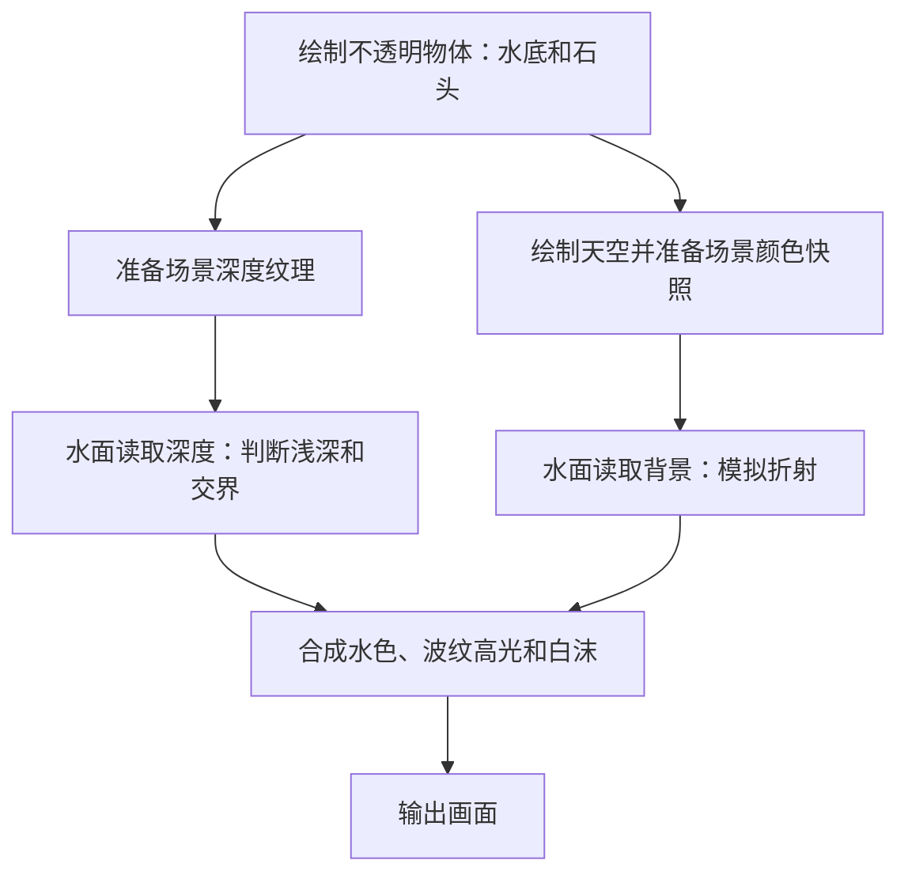

# Unity 6.7 URP 水面渲染：从零做出一片会流动的水

你不需要先学完图形学，也不需要准备水面贴图。本文从一个平面开始，做出能看见水底、带流动波纹、浅深颜色变化、折射和岸边白沫的水面。

建议分两遍阅读：**第一遍照着做出效果，第二遍再理解原理。** 代码可以整段复制，先不用逐行看懂。

> [!info] 版本与验证范围
> 本文面向 Unity 6.7（`6000.7`）的 URP 项目。核对日期为 **2026-09-16**，当日 Unity 官方 6.7 手册标注为 **Beta**。编辑器版本与 URP 包版本不是同一个编号，请在 Package Manager 中确认项目实际安装的包，不要把“Unity 6.7”理解为“URP 6.7”。[Unity 6.7 官方手册](https://docs.unity3d.com/6000.7/Documentation/Manual/urp/writing-shaders-urp-reconstruct-world-position.html)
>
> 示例按官方 URP Shader 接口编写，**未在 Unity 6.7 编辑器中实际编译或运行**。部分设置说明引用 Unity 6.0 的官方参考页；Beta 版本的分组和菜单名称可能变化，请优先按英文属性名寻找。本文不会把示例当作已经验证过的生产级水系统。

> [!tip] 在 Obsidian 中阅读
> 把这个 `.md` 文件放进你的 Obsidian 仓库即可。目录、提示框、公式和 Mermaid 流程图均使用 Obsidian 内置支持的语法，不依赖社区插件。代码很长时，可以通过大纲跳过第 5 节。

## 目录

- [[#1. 最后会得到什么]]
- [[#2. 先认识六个词]]
- [[#3. 配置 URP 项目]]
- [[#4. 搭一个容易看出效果的场景]]
- [[#5. 创建水面 Shader 和材质]]
- [[#6. 第一次运行与调参]]
- [[#7. 这些效果是怎么做出来的]]
- [[#8. 常见问题排查]]
- [[#9. 性能与适用范围]]
- [[#10. 学会以后怎么升级]]
- [[#11. 完成检查表]]
- [[#12. 官方参考资料]]

## 1. 最后会得到什么

这是一片适合练习的小池塘水面：

| 效果 | 你能看到什么 | 本文怎么实现 |
| --- | --- | --- |
| 透出水底 | 水下的方块仍然可见 | 读取场景颜色并重新合成 |
| 浅深渐变 | 浅处较浅，深处颜色较浓 | 用场景深度估算水下厚度 |
| 流动波纹 | 高光和水底扭曲不断变化 | 两组随时间变化的数学波纹 |
| 折射近似 | 水底看起来轻微晃动 | 偏移读取背景图片的位置 |
| 掠射角亮色 | 斜着看水面时更像在反光 | 菲涅耳权重与一层环境色 |
| 交界白沫 | 石头或岸边与水接触处变白 | 深度差加上变化的波纹图案 |

**平面的轮廓保持不动。** 本文改变的是像素的“朝向”和颜色，还没有让网格顶点上下移动。先完成这一层，最容易弄清楚各效果的作用。

范围约定：一个普通 3D 场景、一个从水面上方观察的透视摄像机、一片水平水面。水底和石头使用不透明材质。先使用 Universal Renderer 的 Forward 渲染路径，便于按相同步骤复现。

## 2. 先认识六个词

| 名词 | 通俗理解 | 在本文中的角色 |
| --- | --- | --- |
| 渲染管线 URP | 安排“先画什么、后画什么”的流程 | 先画水底，再画水 |
| Mesh，网格 | 物体的几何形状 | 一个水平 Plane |
| Shader，着色器 | 告诉显卡每个位置应该是什么颜色的程序 | 计算水色、波纹、白沫 |
| Material，材质 | Shader 加上你设置的参数 | 保存水色、波纹速度等 |
| Normal，法线 | 一根指向表面外侧的小箭头 | 告诉光照这个位置朝向哪里 |
| UV | 在一张图片上取颜色的位置 | 读取摄像机看到的背景 |

可以记成：**网格提供形状，Shader 提供画法，材质提供参数，URP 安排绘制流程。**

下面是本文关心的简化流程。实际 URP 还会有阴影、深度预通道等步骤，不必一开始全部掌握。



这里用到两张特殊图片：

- **Depth Texture：深度纹理。** 存储与相机深度有关的数据，用来推算背景物体的位置。
- **Opaque Texture：不透明场景颜色快照。** 可以把它理解为画水之前拍的一张背景照片，水面从里面取颜色。

它们的创建开关在 URP Asset 中，并且可能被单独的摄像机设置覆盖。[URP Asset 官方参考](https://docs.unity3d.com/6000.0/Documentation/Manual/urp/universalrp-asset.html)

## 3. 配置 URP 项目

### 3.1 创建或确认项目

1. 在 Unity Hub 中选择你安装的 Unity 6.7 编辑器。
2. 新建项目时选择 **Universal 3D / 带 URP 的 3D 模板**。模板名称可能随 Hub 版本变化。
3. 如果已经有 URP 项目，直接使用它。
4. 在 Package Manager 中确认有 `Universal RP`，包标识为 `com.unity.render-pipelines.universal`。

普通内置管线 3D 项目不等于 URP 项目。仅仅把本文 Shader 放进去，不能完成渲染管线转换。

### 3.2 找到真正生效的 URP Asset

打开 `Edit → Project Settings`：

1. 在 **Graphics** 中找到默认渲染管线资源，字段常见名称为 `Default Render Pipeline`。
2. 再看 **Quality** 中当前质量等级的 `Render Pipeline Asset`。
3. 如果当前质量等级指定了自己的 URP Asset，优先检查这一份；没有指定时，再检查 Graphics 中的默认资源。
4. 点击资源定位到 Project 面板，再选中它查看 Inspector。

> [!warning] 一个很容易踩的坑
> 项目里可能同时有移动端、高画质等多份 URP Asset。修改了一份不生效的资源，就会出现“明明打开开关，效果还是不对”的情况。

### 3.3 打开水面要用的两个开关

在实际生效的 URP Asset 中找到：

| 设置 | 本文使用值 | 用途 |
| --- | --- | --- |
| `Depth Texture` | 开启 | 浅深颜色与交界白沫 |
| `Opaque Texture` | 开启 | 读取水后的背景 |
| `Opaque Downsampling` | `None` | 初学时先获得清晰的背景快照 |

这些属性通常在 Rendering 或相近的分组里。再选中 `Main Camera`，确认它的 Depth Texture 和 Opaque Texture 没有被强制关闭；可以继承管线设置，或显式打开。[开关与下采样说明](https://docs.unity3d.com/6000.0/Documentation/Manual/urp/universalrp-asset.html)

### 3.4 让深度在画水之前准备好

URP Asset 与 Renderer Data 是两个不同的资源：前者管理管线设置，后者管理具体渲染器。

从 URP Asset 的 `Renderer List` 找到当前使用的 Universal Renderer Data。初次复现时：

- `Rendering Path` 使用 `Forward`。
- 如果有 `Depth Texture Mode`，选择 **`After Opaques`**，确保不透明物体画完后就能读取深度。
- 如果项目已经使用 **`Force Prepass`**，也可以先保留，它会更早准备深度。

本文在透明物体阶段读取深度，因此不要选择“等透明物体画完之后才复制深度”的 `After Transparents` 来复现本例。不同版本也可能根据其他效果自动提前准备深度，初学时不要依赖这个隐含条件。[Universal Renderer 官方参考](https://docs.unity3d.com/6000.0/Documentation/Manual/urp/urp-universal-renderer.html)

不需要为了这份普通材质 Shader 去关闭 Render Graph，也不需要创建 Renderer Feature。我们没有添加自定义渲染通道。

## 4. 搭一个容易看出效果的场景

先搭一个小实验场，比一开始就把水放进复杂游戏场景更容易判断问题。

### 4.1 创建水面与水底

通过 `GameObject → 3D Object` 创建下表物体，在 Inspector 的 Transform 中填写数值。

表格中的三元组顺序都是 `(X, Y, Z)`。Unity 默认 Cube 边长为 1，默认 Plane 在 XZ 平面上约为 `10 × 10` 个单位。

| 名称 | 物体类型 | Position | Rotation | Scale |
| --- | --- | --- | --- | --- |
| `Water` | Plane | `(0, 0, 0)` | `(0, 0, 0)` | `(1, 1, 1)` |
| `Bottom` | Cube | `(0, -1, 0)` | `(0, 0, 0)` | `(12, 1, 12)` |
| `Rock` | Cube | `(1, 0, 0)` | `(0, 25, 0)` | `(1.6, 1.6, 1.6)` |
| `Slope` | Cube | `(-2, -0.4, 0)` | `(0, 0, 20)` | `(4, 0.3, 7)` |

这样安排有明确目的：

- 水面高度是 `Y = 0`。
- 水底 Cube 的顶面位于 `Y = -0.5`，不会和水面重叠。
- Rock 一半露在水上，一半浸在水下，可以检查接触处的白沫。
- Slope 是倾斜的浅滩，它会穿过水面，帮助观察浅深变化。

> [!note] 为什么需要斜坡
> 如果水底是一块与水面平行的平板，就没有明显的“逐渐变浅的岸边”。斜坡让这些变化真正存在于场景几何中。

### 4.2 给水底和石头上色

创建几个普通 Material，Shader 选 `Universal Render Pipeline/Lit`，Surface Type 保持 **Opaque**。

- Bottom：沙土色。
- Rock：灰色或棕色。
- Slope：浅沙色。

把材质分别拖到相应物体上。不要把这些物体改成透明，否则它们通常不会出现在本文所需的背景快照或场景深度中。

### 4.3 调整摄像机和灯光

`Main Camera` 可以先设置：

- Position：`(0, 6, -8)`。
- Rotation：`(35, 0, 0)`。
- Projection：`Perspective`。
- Field of View：`60`。
- Near / Far：例如 `0.3 / 100`。

保留一盏启用的 `Directional Light`，Rotation 可以先设为 `(50, -30, 0)`。高光位置同时取决于灯光和摄像机方向，不一定在画面正中央。

第一次练习先关闭摄像机后处理，避免曝光、Bloom 或颜色调整掩盖材质本身的变化。

## 5. 创建水面 Shader 和材质

### 5.1 创建文件

1. 在 Project 面板创建文件夹 `Assets/WaterTutorial`。
2. 在该文件夹创建一个普通文本文件，命名为 **`BeginnerWater.shader`**。
3. 确认不是 `BeginnerWater.shader.txt`。也可以通过 Unity 的 Create 菜单创建任意普通 Shader 文件，再替换全部内容。
4. 用代码编辑器打开文件，把下面的代码完整复制进去，保存为 UTF-8。

这段代码有两种语言：外层的 ShaderLab 负责材质属性和渲染规则，`HLSLPROGRAM` 内部的 HLSL 负责颜色计算。它使用 URP 的 `Core.hlsl` 和 `Lighting.hlsl` 等头文件。[URP Shader 基础结构](https://docs.unity3d.com/6000.7/Documentation/Manual/urp/writing-shaders-urp-basic-unlit-structure.html)

### 5.2 完整代码

```hlsl
Shader "Tutorial/URP/BeginnerWater"
{
    Properties
    {
        _ShallowColor ("Shallow Color", Color) = (0.18, 0.65, 0.62, 1)
        _DeepColor ("Deep Color", Color) = (0.02, 0.16, 0.24, 1)
        _DepthDistance ("Depth Color Distance", Range(0.1, 10)) = 2
        _TintStrength ("Water Tint Strength", Range(0, 1)) = 0.65

        _WaveScale ("Wave Scale", Range(0.1, 8)) = 1.5
        _WaveSpeed ("Wave Speed", Range(0, 3)) = 0.7
        _NormalStrength ("Normal Strength", Range(0, 1)) = 0.15
        _RefractionStrength ("Refraction Strength", Range(0, 0.05)) = 0.015

        _ReflectionTint ("Reflection Tint", Color) = (0.55, 0.72, 0.85, 1)
        _FresnelStrength ("Fresnel Strength", Range(0, 1)) = 0.5
        _SpecularStrength ("Specular Strength", Range(0, 2)) = 0.6
        _SpecularPower ("Specular Power", Range(8, 256)) = 96

        _FoamColor ("Foam Color", Color) = (0.9, 0.97, 1, 1)
        _FoamWidth ("Foam Width", Range(0.01, 2)) = 0.25
        _FoamStrength ("Foam Strength", Range(0, 1)) = 0.8
    }

    SubShader
    {
        Tags
        {
            "RenderPipeline" = "UniversalPipeline"
            "RenderType" = "Transparent"
            "Queue" = "Transparent"
        }

        Pass
        {
            Name "WaterForward"
            Tags { "LightMode" = "UniversalForward" }

            // 背景已在片元着色器里合成，直接输出最终颜色。
            Blend One Zero
            ZWrite Off
            ZTest LEqual
            Cull Back

            HLSLPROGRAM
            #pragma target 3.0
            #pragma vertex Vert
            #pragma fragment Frag

            #include "Packages/com.unity.render-pipelines.universal/ShaderLibrary/Core.hlsl"
            #include "Packages/com.unity.render-pipelines.universal/ShaderLibrary/Lighting.hlsl"
            #include "Packages/com.unity.render-pipelines.universal/ShaderLibrary/DeclareDepthTexture.hlsl"
            #include "Packages/com.unity.render-pipelines.universal/ShaderLibrary/DeclareOpaqueTexture.hlsl"

            CBUFFER_START(UnityPerMaterial)
                float4 _ShallowColor;
                float4 _DeepColor;
                float _DepthDistance;
                float _TintStrength;
                float _WaveScale;
                float _WaveSpeed;
                float _NormalStrength;
                float _RefractionStrength;
                float4 _ReflectionTint;
                float _FresnelStrength;
                float _SpecularStrength;
                float _SpecularPower;
                float4 _FoamColor;
                float _FoamWidth;
                float _FoamStrength;
            CBUFFER_END

            struct Attributes
            {
                float4 positionOS : POSITION;
            };

            struct Varyings
            {
                float4 positionCS : SV_POSITION;
                float3 positionWS : TEXCOORD0;
            };

            Varyings Vert(Attributes input)
            {
                Varyings output;
                output.positionWS = TransformObjectToWorld(input.positionOS.xyz);
                output.positionCS = TransformWorldToHClip(output.positionWS);
                return output;
            }

            // 把深度纹理中的数值还原成相机空间中的线性深度。
            // 经世界位置重建，避免直接拿非线性原始深度相减。
            float ReadSceneEyeDepth(float2 uv)
            {
                float rawDepth = SampleSceneDepth(uv);

                #if UNITY_REVERSED_Z
                    if (rawDepth <= 0.0000001)
                        return _ProjectionParams.z;
                    float deviceDepth = rawDepth;
                #else
                    if (rawDepth >= 0.9999999)
                        return _ProjectionParams.z;
                    float deviceDepth = lerp(UNITY_NEAR_CLIP_VALUE, 1.0, rawDepth);
                #endif

                float3 sceneWS = ComputeWorldSpacePosition(
                    uv, deviceDepth, UNITY_MATRIX_I_VP);
                return -TransformWorldToView(sceneWS).z;
            }

            half4 Frag(Varyings input) : SV_Target
            {
                // 1. 当前像素在屏幕上的位置，范围大致为 0 到 1。
                float2 screenUV = input.positionCS.xy / _ScaledScreenParams.xy;
                float waterEyeDepth = -TransformWorldToView(input.positionWS).z;
                float sceneEyeDepth = ReadSceneEyeDepth(screenUV);
                float depthGap = max(sceneEyeDepth - waterEyeDepth, 0.0);

                // 2. 两个方向不同的波纹，改变法线但不移动顶点。
                float2 p = input.positionWS.xz * _WaveScale;
                float t = _Time.y * _WaveSpeed;
                float phaseA = dot(p, float2(1.0, 0.35)) + t;
                float phaseB = dot(p, float2(-0.45, 1.2)) - t * 1.3;
                float slopeX = cos(phaseA) - 0.45 * cos(phaseB);
                float slopeZ = 0.35 * cos(phaseA) + 1.2 * cos(phaseB);
                float3 normalWS = normalize(float3(
                    -slopeX * _NormalStrength,
                    1.0,
                    -slopeZ * _NormalStrength));

                // 3. 根据法线偏移背景采样位置，形成折射近似。
                float3 normalVS = TransformWorldToViewDir(normalWS, true);
                float edgeDistance = min(
                    min(screenUV.x, 1.0 - screenUV.x),
                    min(screenUV.y, 1.0 - screenUV.y));
                float edgeFade = saturate(edgeDistance / 0.05);
                float contactFade = saturate(depthGap / 0.3);
                float2 offset = normalVS.xy * _RefractionStrength
                    * edgeFade * contactFade;
                float2 refractUV = saturate(screenUV + offset);

                // 避免把位于水面前方的石头颜色拖进水下。
                // 这只是简易检查，不能解决全部屏幕空间遮挡问题。
                float shiftedDepth = ReadSceneEyeDepth(refractUV);
                if (shiftedDepth <= waterEyeDepth + 0.01)
                    refractUV = screenUV;

                float3 background = SampleSceneColor(refractUV);

                // 4. 随深度增加，水色加深，染色也稍微加强。
                float depth01 = saturate(depthGap / max(_DepthDistance, 0.001));
                float3 waterTint = lerp(_ShallowColor.rgb, _DeepColor.rgb, depth01);
                float tintWeight = _TintStrength * lerp(0.25, 1.0, depth01);
                float3 color = lerp(background, waterTint, tintWeight);

                // 5. 斜着看时增加环境亮色。这不是实际的场景倒影。
                float3 viewDirWS = GetWorldSpaceNormalizeViewDir(input.positionWS);
                float facing = saturate(dot(normalWS, viewDirWS));
                float fresnel = pow(1.0 - facing, 5.0) * _FresnelStrength;
                color = lerp(color, _ReflectionTint.rgb, fresnel);

                // 6. 主方向光产生的简化高光，不读取阴影。
                Light mainLight = GetMainLight();
                float3 halfDir = SafeNormalize(mainLight.direction + viewDirWS);
                float highlight = pow(saturate(dot(normalWS, halfDir)), _SpecularPower);
                highlight *= saturate(dot(normalWS, mainLight.direction));
                color += mainLight.color * highlight * _SpecularStrength;

                // 7. 接触处更白，正弦图案让白沫出现一些变化。
                float foamBand = 1.0 - smoothstep(0.0, _FoamWidth, depthGap);
                float pattern = 0.5 + 0.5 * sin(phaseA * 2.5 + sin(phaseB * 2.0));
                float foam = foamBand * lerp(0.35, 1.0, pattern) * _FoamStrength;
                color = lerp(color, _FoamColor.rgb, foam);

                return half4(color, 1.0);
            }
            ENDHLSL
        }
    }
    FallBack Off
}
```

### 5.3 创建水面材质

1. 回到 Unity，等待 Shader 导入完成。
2. 打开 `Window → General → Console`，检查有没有红色编译错误。
3. 在 `Assets/WaterTutorial` 中创建 Material，命名为 `M_Water`。
4. 选中它，在 Inspector 顶部的 Shader 下拉菜单选择 **`Tutorial → URP → BeginnerWater`**。
5. 把 `M_Water` 拖到 Water 平面上。
6. 点击 Play，在 Game 窗口观察。

> [!important] 不用寻找普通 Lit 材质的透明开关
> 这份 Shader 已经写好了渲染队列和合成方式。它没有 Lit Shader 的 `Surface Type` 下拉框，也不通过颜色的 Alpha 控制透明度。颜色选择器中的 Alpha 在本文代码里不参与计算。

## 6. 第一次运行与调参

先保留默认值。正常情况下，水底应仍然可见，浅滩附近颜色较淡，波纹会让背景和高光缓慢变化。

### 6.1 最常用的参数

材质中会显示代码里括号内的英文名称。

| 材质参数 | 默认值 | 调大后通常发生什么 |
| --- | --- | --- |
| Shallow Color | 浅青绿色 | 直接改变浅水色 |
| Deep Color | 深蓝绿色 | 直接改变深水色 |
| Depth Color Distance | `2` | 需要更大的深度差才变成深水色 |
| Water Tint Strength | `0.65` | 水色更浓，背景更不明显 |
| Wave Scale | `1.5` | 波纹更密集，单个波纹更小 |
| Wave Speed | `0.7` | 波纹变化更快；`0` 表示静止 |
| Normal Strength | `0.15` | 表面朝向变化更大，高光和扭曲更明显 |
| Refraction Strength | `0.015` | 背景偏移更明显 |
| Reflection Tint | 灰蓝色 | 改变斜视时混入的环境色 |
| Fresnel Strength | `0.5` | 斜视时环境色更明显 |
| Specular Strength | `0.6` | 主光源高光更亮 |
| Specular Power | `96` | 高光更集中、更小 |
| Foam Width | `0.25` | 白沫覆盖更大的深度差范围 |
| Foam Strength | `0.8` | 白沫更明显；`0` 可关闭 |

每次只改一个参数，并观察变化。尤其不要同时把法线强度和折射强度拉到最大，那样水底很容易像被撕裂了一样。

### 6.2 按这个顺序观察每一层

1. **只看水色：** 把 Normal Strength、Refraction Strength、Fresnel Strength、Specular Strength、Foam Strength 都设为 `0`。留下背景与浅深渐变。
2. **看高光波纹：** 恢复 Normal Strength 为 `0.15`，Specular Strength 为 `0.6`。观察亮斑变化。
3. **看折射：** 恢复 Refraction Strength 为 `0.015`。注意水底边缘是否轻微晃动。
4. **看掠射角效果：** 恢复 Fresnel Strength 为 `0.5`，把摄像机放低再观察。
5. **看交界白沫：** 恢复 Foam Strength 为 `0.8`，靠近浅滩和石头查看。

> [!tip] 一个快速判断
> 将 Water Tint Strength、Fresnel Strength、Specular Strength、Foam Strength、Refraction Strength 都设为 `0` 后，这块水面应大致显示原来的不透明背景。若此时仍是黑色，优先检查 Opaque Texture，而不是继续调颜色。

### 6.3 两组练习起点

这些数值是便于观察的起点，最终效果还会随场景尺寸和摄像机角度变化。

| 参数 | 平静小池塘 | 更明显的风格化水面 |
| --- | --- | --- |
| Water Tint Strength | `0.4` | `0.8` |
| Wave Scale | `1.2` | `2.5` |
| Wave Speed | `0.35` | `0.9` |
| Normal Strength | `0.07` | `0.22` |
| Refraction Strength | `0.008` | `0.02` |
| Foam Width | `0.12` | `0.35` |
| Foam Strength | `0.35` | `0.9` |

## 7. 这些效果是怎么做出来的

### 7.1 先把背景取出来

```hlsl
float3 background = SampleSceneColor(refractUV);
```

可以想象水面拿着一张“画水之前的场景照片”，从某个位置取出颜色，然后染上一点青绿色。

这里的 `refractUV` 是照片上的位置。位置不变，就像隔着平玻璃看背景；位置不停轻微变化，就像水在扰动背景。

`SampleSceneColor` 来自 URP 的 `DeclareOpaqueTexture.hlsl`，不是在当前画面上随意截图。[Unity 官方 Shader 源码](https://github.com/Unity-Technologies/Graphics/blob/master/Packages/com.unity.render-pipelines.universal/ShaderLibrary/DeclareOpaqueTexture.hlsl)

### 7.2 为什么输出 Alpha 是 1，仍然能看见水底

普通透明物体通常让显卡自动执行类似下面的混合：

$$
C_{输出}=\alpha C_{物体}+(1-\alpha)C_{背景}
$$

本文已经在 Shader 内部取得背景，并完成了“背景加水色”的合成。所以使用：

```hlsl
Blend One Zero
return half4(color, 1.0);
```

它的含义是直接写入已经算好的颜色，不再对这份结果做一次 Alpha 混合。

**能看见水底，是因为输出颜色里面已经包含水底。** 调整 Water Tint Strength，改变的就是背景与水色之间的比例。

`Queue = Transparent` 决定它在何时绘制；`Blend` 决定如何与已有画面合成。两者不是同一件事。

### 7.3 用深度差判断浅深

对于屏幕上的同一个位置，比较两个深度：

1. 背景不透明物体在摄像机前方多深。
2. 当前水面位置在摄像机前方多深。

$$
d=\max(d_{背景}-d_{水面},0)
$$

例如两者分别是 `8` 和 `6`，深度差就是 `2`。

但深度纹理里原始的 `0～1` 数字并不直接等于米，不能把它当作线性距离来相减。本例先用深度和屏幕坐标重建世界位置，再转换到相机空间取得线性深度；同时处理不同图形 API 的深度范围差异。[官方深度重建示例](https://docs.unity3d.com/6000.7/Documentation/Manual/urp/writing-shaders-urp-reconstruct-world-position.html)

> [!warning] 这不是严格的垂直水深
> 本文的 `depthGap` 是**沿摄像机前向轴比较得到的深度差**，不是水面到正下方地面的垂直距离，也不是完整的光线传播距离。它会随观察角度和采样到的背景变化。
>
> 因此 Depth Color Distance 和 Foam Width 是调节这个近似效果的参数，不应直接当作准确的水深或真实岸边宽度。需要固定世界空间水深时，可以另行使用地形高度、水深贴图或专门的水底采样方案。

### 7.4 把深度差变成颜色

```hlsl
float depth01 = saturate(depthGap / _DepthDistance);
float3 waterTint = lerp(_ShallowColor.rgb, _DeepColor.rgb, depth01);
```

这里只需要理解两个函数：

- `saturate(x)`：把数值限制在 `0～1` 之间。
- `lerp(A, B, t)`：按照 `t` 从 A 过渡到 B。`t = 0` 是 A，`t = 1` 是 B，`t = 0.5` 在中间。

如果 Depth Color Distance 为 `2`：

| 深度差 | depth01 | 颜色 |
| --- | --- | --- |
| `0` | `0` | 浅水色 |
| `1` | `0.5` | 两种颜色之间 |
| `2` 或更大 | `1` | 深水色 |

这是一种容易调整的美术近似。真实水体的颜色还涉及光被吸收、散射等现象，本例没有完整模拟这些过程。

### 7.5 波纹为什么不用贴图

`sin` 和 `cos` 的数值会平滑地往复变化，适合做简单波纹。把不同方向的两组波混在一起，再让时间 `_Time.y` 参与计算，图案就会动起来。

法线原本朝正上方：

```hlsl
float3 normalWS = float3(0, 1, 0);
```

代码让它在 X、Z 方向上轻微倾斜。这样，即使网格完全不动，表面的高光和折射也会发生变化。

这个法线是为**世界坐标中水平、正面朝上的水面**设计的。不要直接把 Water 旋转成斜面或瀑布；那样网格方向和计算的法线就对不上了。

### 7.6 折射为什么要检查前景

```hlsl
float2 refractUV = screenUV + offset;
```

水面本来应该读取正后方的背景，偏移后却可能读到旁边一块露在水上的石头。画面上就会出现石头颜色被拉进水里的问题。

本例有三个缓解措施：

- 接触处减小偏移。
- 屏幕边缘减小偏移。
- 如果偏移后的深度落在水面前方，就退回原来的采样位置。

这不是严格按折射定律追踪光线。屏幕外的物体、被其他物体挡住的内容，本来就不在这张背景照片里，因此无法凭空取得。

### 7.7 菲涅耳是什么

你低头看平静水面时，往往能看见水底；沿着水面斜着看时，环境反光通常更明显。这种随观察角度变化的反射比例，就是理解菲涅耳现象的入口。

本例使用简化权重：

$$
F=(1-\operatorname{saturate}(N\cdot V))^5
$$

`N` 是法线，`V` 是从表面指向摄像机的方向。正对表面看时，权重较小；沿表面看时，权重较大。

**菲涅耳只是一个权重，不会自己产生倒影。** 本例用它混入 Reflection Tint，所以你看到的是一层环境色。代码没有采样天空盒、反射探针或平面反射贴图，岸边的树和建筑不会因此倒映在水里。

### 7.8 白沫从哪里来

```hlsl
float foamBand = 1.0 - smoothstep(0.0, _FoamWidth, depthGap);
```

水面与背景物体接近时，深度差变小，白沫权重增大。`smoothstep` 让边界平滑过渡，避免出现完全生硬的一圈白线。

再乘上变化的波纹图案，白沫就不会是一条完全均匀的带子。

它属于**基于深度交界的白沫近似**，没有模拟水流撞击石头，也没有泡沫粒子。物体靠近水面时就可能触发白色区域，不一定真的发生了流体碰撞。

### 7.9 高光和真正的光照系统有何区别

`GetMainLight()` 取得主光源数据，代码据此计算一块简化高光。[URP 主光源接口](https://docs.unity3d.com/6000.7/Documentation/Manual/urp/use-built-in-shader-methods-lighting.html)

这份 Shader 没有使用完整的 PBR 水材质模型，也没有接入主光阴影、额外点光源、烘焙光照或雾。因此：

- 关闭主方向光后，高光会改变，但水色不一定跟着变暗。
- 灯光被石头挡住时，本例仍可能出现高光。
- 普通场景 Fog 不会自动按正确方式作用于整套水面合成。

这些都是示例的功能范围，后续可以逐项扩展。

## 8. 常见问题排查

### 水面变成粉红色

通常表示 Shader 无法用于当前渲染环境，或编译失败。

按顺序检查：

1. 项目是否真的启用了 URP，而不是内置管线或 HDRP。
2. Console 中第一条 Shader 编译错误是什么；先处理第一条，后面的可能只是连带错误。
3. 是否复制了整段代码，包括最后的右大括号。
4. 文件扩展名是否为 `.shader`。
5. `Packages/com.unity.render-pipelines.universal/...` 对应的包是否存在。

### 水底是黑的，或者完全看不见

先关闭所有附加效果，使用第 6 节的背景检查方法。

- 检查 Opaque Texture 是否在生效的 URP Asset 中开启。
- 检查 Main Camera 是否覆盖并关闭了它。
- 检查水底是否使用 Opaque 材质。
- 检查 Water Tint Strength 是否过高，Deep Color 是否过暗。
- 检查 Bottom 是否意外放到了 Water 上方。

### 没有浅深变化，白沫也不正常

- 检查 Depth Texture。
- 检查深度生成时机是否早于水面的透明绘制阶段。
- 检查是否调错质量等级对应的 URP Asset。
- 检查浅滩有没有真实穿过水面。
- 若使用自定义水底 Shader，在深度预通道方案下还要确认它提供正确的深度 Pass；本教程用 URP/Lit 避免这层额外问题。

### 看不到白沫

白沫只出现在深度差足够小的区域。先看 Slope 与水相交的位置，将 Foam Width 临时调到 `0.5`，Foam Strength 调到 `1`。

深水中央没有白沫是正常现象。不要只盯着水面中央判断效果是否工作。

### 波纹不会动

- 点击 Play，在 Game 窗口观察。
- Wave Speed 应大于 `0`。
- Normal Strength 应大于 `0`。
- 确认至少有高光或折射开启；如果两者都为零，法线波纹可能难以看见。

Scene 窗口也可能因为动画刷新设置而暂停显示时间变化，初次验证以 Game 窗口为准。

### 高光看不见

确认 Directional Light 启用，且 Specular Strength 大于零。高光依赖观察方向，可以旋转灯光，或把 Specular Power 暂时降到 `16`，使亮斑更宽、更容易发现。

### 水底扭曲太严重，石头边缘出现拖影

把 Refraction Strength 降到 `0.005～0.01`，Normal Strength 降到 `0.05～0.1`。强烈偏移会放大屏幕空间方法的缺陷，本例的前景检查不能消除所有伪影。

### 透明玻璃、粒子或另一层水显示不对

背景快照不包含后续正常绘制的透明物体。本例还会直接覆盖水面像素的颜色：水面之前画的透明物体可能被覆盖，水面之后画的透明物体又不会被正确折射。

这需要另外设计透明排序、额外颜色拷贝或分层合成。给当前材质随意改一个渲染队列，通常不能同时解决所有情况。

### 摄像机进入水下后，水面消失

本例使用 `Cull Back`，只绘制水面正面。从下方看不到是预期行为。

把它改成 `Cull Off` 只会让背面也被画出来，**不会自动得到正确的水下渲染**。水下还涉及法线方向、吸收、雾化和相机进出水的处理。

### 水面边界像一块方形玻璃

Plane 本来就是矩形。本例没有边缘裁剪或完整岸线遮罩。让陆地在边缘与水面相交，或让水面足够大，使矩形边缘离开摄像机视野。

白沫识别的是物体交界，不会自动把任何网格边缘变成自然岸线。

## 9. 性能与适用范围

### 9.1 哪些部分会消耗性能

这份 Shader 每个可见水面像素会采样两次深度、一次场景颜色，还会执行波纹与高光计算。除此之外，URP 准备场景颜色快照和深度纹理也可能产生额外开销。

水面只有两个三角形或很少的顶点，不代表渲染一定便宜。**如果水占满屏幕，就有大量像素都在执行这些计算。**

### 9.2 优化顺序

1. 先在目标设备上测量 GPU 时间，检查大面积水面是否确实是瓶颈。
2. 控制屏幕上叠加的透明水面数量。
3. 在可以接受背景更模糊时，尝试将 Opaque Downsampling 改为 `2x Bilinear`。
4. 如果项目完全不需要折射，可以另写不采样场景颜色的简化 Shader；确认其他效果也不需要它后，再关闭 Opaque Texture。
5. 如果既不需要深浅变化，也不需要交界白沫，可以进一步去掉深度采样。

> [!note] 参数为零不等于计算被删除
> 把 Refraction Strength 设为 `0`，只是视觉上没有偏移，这份代码仍可能执行相关采样。需要真正降低成本时，应修改代码或使用合适的 Shader 变体，并再次测量。

### 9.3 这份示例的边界

适合用来学习材质效果，也可以作为小范围风格化水面的起点。以下内容没有实现或没有完成专项验证：

| 项目 | 当前情况 |
| --- | --- |
| 真实场景倒影 | 没有；只有环境颜色近似 |
| 网格浪峰和轮廓变化 | 没有；顶点不动 |
| 船只涟漪与角色交互 | 没有 |
| 水下雾、焦散、体积散射 | 没有 |
| 透明物体的正确折射 | 没有 |
| 多层水面正确合成 | 没有 |
| 阴影、额外灯光、完整 PBR | 没有 |
| XR 双眼、相机堆叠、移动端各图形 API | 未验证；不要直接假定支持 |
| Unity 6.7 编辑器编译和运行 | 本文交付时未实际执行 |

## 10. 学会以后怎么升级

### 10.1 先换成两张滚动法线贴图

数学波纹比较规则。更自然的细节通常可以通过两组不同方向、不同速度滚动的法线纹理获得。

需要补学的内容是：法线贴图导入、纹理采样、切线空间与世界空间转换、法线混合。不要直接把两张法线贴图的 RGB 当普通颜色相加。

### 10.2 再让顶点真正上下移动

顶点位移会改变水面轮廓，能产生实际可见的浪峰。但这时还要同时考虑：

- 网格细分是否足够；稀疏平面无法表现密集浪形。
- 法线是否与波形对应。
- 网格包围盒是否覆盖位移范围，避免被错误裁剪。
- CPU 碰撞体不会自动跟随 GPU Shader 位移。

如果需要船浮在浪面上，通常还需要在 CPU 或统一的波浪计算系统中求出对应的水面高度。

### 10.3 加入真正的倒影来源

| 方案 | 通俗理解 | 需要考虑什么 |
| --- | --- | --- |
| 反射探针 / Cubemap | 从一张环境全景图取倒影 | 局部位置与动态更新可能不准确 |
| 平面反射 | 用镜像摄像机再画一次场景 | 额外场景渲染、裁剪与管线接入成本 |
| 屏幕空间反射 | 在已画好的屏幕内容里寻找反射 | 屏幕外和被遮挡内容缺失，容易出现边缘问题 |

添加反射来源后，再让菲涅耳控制“水下颜色”和“反射颜色”的比例。仅在场景里放一个 Reflection Probe，并不会让本文 Shader 自动读取它。

### 10.4 如果更喜欢 Shader Graph

本文选择完整代码，是为了让第一次复现不依赖一大张难以核对的连线图。理解原理后，可以按功能拆成 Shader Graph 模块：

| 本文功能 | Shader Graph 中对应的思路 |
| --- | --- |
| 读取背景 | Scene Color |
| 读取深度 | Scene Depth |
| 屏幕采样坐标 | Screen Position 的归一化坐标 |
| 浅深颜色 | Divide、Saturate、Lerp |
| 动画波纹 | Time、Sine、位置或 UV 运算 |
| 视角权重 | Fresnel Effect 或自建公式 |
| 交界白沫 | 深度差、Smoothstep、图案遮罩 |

这张表是迁移思路，不是一份完整连线教程。尤其要确保背景深度和水面深度处于同一种空间、同一种单位，不能直接把原始深度减去世界坐标 Y。

Shader Graph 版本也要重新决定透明混合方式：如果已经通过 Scene Color 合成背景，就要避免再用小于 1 的 Alpha 把背景重复混合一次。

## 11. 完成检查表

- [ ] 项目实际使用 URP，并确认了生效的质量等级资源。
- [ ] 开启 Depth Texture 和 Opaque Texture。
- [ ] 深度在绘制水面之前准备好。
- [ ] 使用普通透视摄像机，从水平水面上方观察。
- [ ] 水底和石头使用不透明材质。
- [ ] 场景中有一块与水面相交的斜坡。
- [ ] Shader 文件扩展名正确，Console 没有红色编译错误。
- [ ] M_Water 使用 `Tutorial/URP/BeginnerWater`，并赋给 Water。
- [ ] 进入 Play 后能看到波纹随时间变化。
- [ ] 能通过 Water Tint Strength 调节水底的可见程度。
- [ ] 能在浅滩附近看到颜色过渡和交界白沫。
- [ ] 知道环境亮色不等于真实倒影，深度差也不等于垂直水深。

> [!example] 三个巩固练习
> **练习一：** 保持所有材质参数不变，把水底下移，观察水色如何变化。
>
> **练习二：** 关闭折射但保留法线与高光，观察水面为什么仍然有波纹感。
>
> **练习三：** 保持水底不动，降低摄像机高度，观察环境亮色和交界白沫的变化，并解释哪些变化来自视角近似。

## 12. 官方参考资料

以下链接用于核对接口和管线行为。版本固定链接便于以后复查；不要把 `master` 分支源码当作某个具体 Beta 包的精确快照。

1. [Unity 6.7：URP Shader 基础结构](https://docs.unity3d.com/6000.7/Documentation/Manual/urp/writing-shaders-urp-basic-unlit-structure.html)。对应 ShaderLab、HLSL 与 Core.hlsl。
2. [Unity 6.7：从深度重建世界位置](https://docs.unity3d.com/6000.7/Documentation/Manual/urp/writing-shaders-urp-reconstruct-world-position.html)。对应深度采样、屏幕坐标和跨图形 API 的深度范围处理。
3. [Unity 6.7：在自定义 URP Shader 中使用光照](https://docs.unity3d.com/6000.7/Documentation/Manual/urp/use-built-in-shader-methods-lighting.html)。对应 Lighting.hlsl 与 GetMainLight。
4. [Unity 6.0：URP Asset 属性参考](https://docs.unity3d.com/6000.0/Documentation/Manual/urp/universalrp-asset.html)。用于核对深度纹理、不透明纹理及下采样的作用；6.7 中请以实际 Inspector 为准。
5. [Unity 6.0：Universal Renderer 属性参考](https://docs.unity3d.com/6000.0/Documentation/Manual/urp/urp-universal-renderer.html)。用于核对深度复制时机的区别。
6. [Unity 官方 Graphics 仓库：DeclareOpaqueTexture.hlsl](https://github.com/Unity-Technologies/Graphics/blob/master/Packages/com.unity.render-pipelines.universal/ShaderLibrary/DeclareOpaqueTexture.hlsl)。对应 SampleSceneColor；精确实现以项目本地安装包为准。

后续排查具体版本问题时，可以在项目的 Packages 视图或包缓存中查看实际安装的 URP ShaderLibrary。不要直接修改包缓存文件来适配教程；应修改自己项目中的 Shader，并保留可复现的错误信息。
