# Hashing

## 小型 xxHash

- 创建一个用于显示哈希结果的网格。
- 将二维坐标转换为伪随机值。
- 实现一个小型 xxHash。
- 用哈希值给立方体着色并偏移它们的位置。

这是“伪随机噪声”系列的第一篇教程，接在 [Basics 基础系列](https://catlikecoding.com/unity/tutorials/basics/)之后。本文介绍一种通过哈希函数生成表面上随机值的方法，具体实现一个精简版 xxHash。

教程使用 Unity 2020.3.6f1。

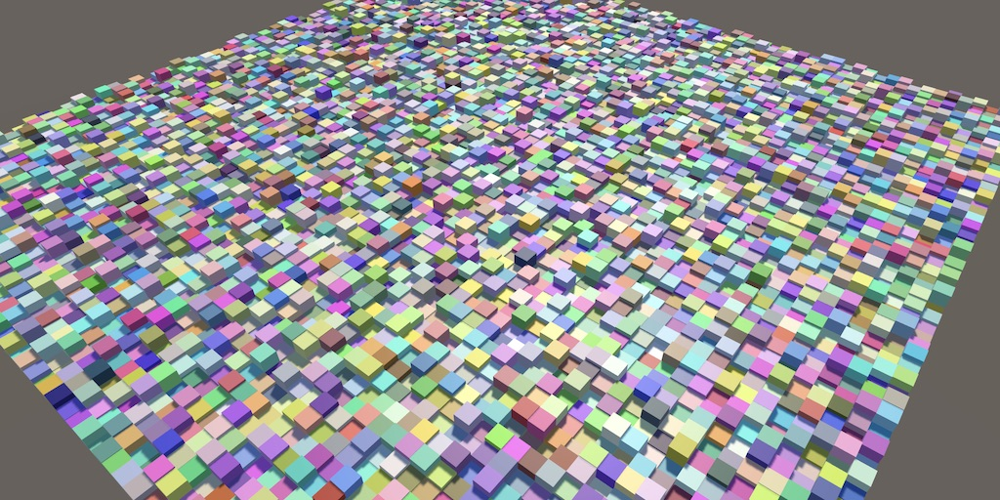

## 可视化

我们需要随机性来制造不可预测、富于变化并且显得自然的效果。观察者并不在意这些现象究竟是真随机，还是只是因为观察者缺少相关信息或理解而显得随机。因此，只要某个过程完全确定、实际上并不随机，而且这一点不明显，就足够了。这很合适，因为软件本质上就是确定性的。

设计糟糕的多线程代码可能产生竞态条件，因而带来不可预测的结果，但它并不是可靠的随机数来源。真正可靠的随机性只能从外部来源取得，例如采集大气噪声的硬件；而这类来源通常不可用。

通常我们也不希望使用真正的随机数。由它生成的内容只会发生一次，无法复现，每次得到的结果都不同。理想的过程应该是：对某个特定输入，总能产生唯一且固定、但看起来随机的输出。这正是哈希函数的用途。

本教程会创建一个由小立方体组成的二维网格，用来显示哈希函数的结果。请按照 Basics 系列中的说明新建项目。这里会用到 Jobs 系统，因此要导入 Burst 包；教程也使用 URP，所以还要导入 Universal RP，创建对应的资源并配置 Unity 使用它。

### 哈希任务（Hash Job）

我们用一个任务为网格中的所有立方体生成哈希值。创建 `HashVisualization` 组件，并按 Basics 系列介绍的方式在其中加入任务。任务会把哈希值写入 `NativeArray`。哈希值本质上是一组没有内在含义的位；这里用 `uint`，它最接近由 32 位（4 字节）组成的通用数据包。首先直接把任务的执行索引当作哈希值。

```csharp
using Unity.Burst;
using Unity.Collections;
using Unity.Jobs;
using Unity.Mathematics;
using UnityEngine;

using static Unity.Mathematics.math;

public class HashVisualization : MonoBehaviour {

    [BurstCompile(FloatPrecision.Standard, FloatMode.Fast, CompileSynchronously = true)]
    struct HashJob : IJobFor {

        [WriteOnly]
        public NativeArray<uint> hashes;

        public void Execute(int i) {
            hashes[i] = (uint)i;
        }
    }
}
```

### 为什么哈希类型不用 `int`？

`int` 是有符号整数，其中有一位专门表示符号。`uint` 是无符号整数，没有专用的符号位，因此它的每一位都能以相同方式处理。

### 初始化与渲染

和 Basics 系列一样，我们要给 `HashVisualization` 添加实例网格和材质的配置项，再加入分辨率滑块，以及所需的 `NativeArray`、`ComputeBuffer` 和 `MaterialPropertyBlock`。我们用 `_Hashes` 作为着色器缓冲区标识符，并增加一个 `_Config` 着色器属性来传递其他配置。

```csharp
static int
    hashesId = Shader.PropertyToID("_Hashes"),
    configId = Shader.PropertyToID("_Config");

[SerializeField]
Mesh instanceMesh;

[SerializeField]
Material material;

[SerializeField, Range(1, 512)]
int resolution = 16;

NativeArray<uint> hashes;
ComputeBuffer hashesBuffer;
MaterialPropertyBlock propertyBlock;
```

在 `OnEnable` 中完成初始化。由于哈希值不会随时间变化，我们可以立刻运行任务，也只需配置一次属性块，不必每帧都做。

着色器既要乘以分辨率，也要除以分辨率，所以把分辨率和它的倒数放进配置向量的前两个分量。

```csharp
void OnEnable () {
    int length = resolution * resolution;
    hashes = new NativeArray<uint>(length, Allocator.Persistent);
    hashesBuffer = new ComputeBuffer(length, 4);

    new HashJob {
        hashes = hashes
    }.ScheduleParallel(hashes.Length, resolution, default).Complete();
    hashesBuffer.SetData(hashes);

    propertyBlock ??= new MaterialPropertyBlock();
    propertyBlock.SetBuffer(hashesId, hashesBuffer);
    propertyBlock.SetVector(configId, new Vector4(resolution, 1f / resolution));
}
```

在 `OnDisable` 中释放哈希数组和缓冲区。`OnValidate` 继续采用重置全部资源的做法，这样在播放模式中更改配置也会刷新网格。

```csharp
void OnDisable () {
    hashes.Dispose();
    hashesBuffer.Release();
    hashesBuffer = null;
}

void OnValidate () {
    if (hashesBuffer != null && enabled) {
        OnDisable();
        OnEnable();
    }
}
```

现在 `Update` 中只需发出绘制命令。网格会放在原点处的单位立方体范围内。

```csharp
void Update () {
    Graphics.DrawMeshInstancedProcedural(
        instanceMesh, 0, material, new Bounds(Vector3.zero, Vector3.one),
        hashes.Length, propertyBlock
    );
}
```

### 着色器

创建一个 HLSL include 文件，并在其中定义程序化配置函数。与 Basics 系列先前版本的区别是：现在直接根据实例编号推导实例位置。

可以把一维直线切成等长的区段，再将这些区段并排摆放、沿第二个维度错开，从而把它转换成二维网格。做法是用整数除法将实例编号除以分辨率。GPU 没有整数除法指令，所以这里用 `floor` 丢弃除法结果的小数部分。得到的是第二维坐标，记作 `v`。

再用实例编号减去 `v` 乘以分辨率，求出 `u` 坐标。最后用 UV 坐标把实例放到 XZ 平面上，并对其缩放和偏移，让网格留在原点处的单位立方体内。

```hlsl
#if defined(UNITY_PROCEDURAL_INSTANCING_ENABLED)
    StructuredBuffer<uint> _Hashes;
#endif

float4 _Config;

void ConfigureProcedural () {
    #if defined(UNITY_PROCEDURAL_INSTANCING_ENABLED)
        float v = floor(_Config.y * unity_InstanceID);
        float u = unity_InstanceID - _Config.x * v;

        unity_ObjectToWorld = 0.0;
        unity_ObjectToWorld._m03_m13_m23_m33 = float4(
            _Config.y * (u + 0.5) - 0.5,
            0.0,
            _Config.y * (v + 0.5) - 0.5,
            1.0
        );
        unity_ObjectToWorld._m00_m11_m22 = _Config.y;
    #endif
}
```

接着加入一个函数来读取哈希值并把它转换为 RGB 颜色。最初先把哈希转换为灰阶：用分辨率平方作除数，让颜色随哈希索引从黑渐变到白。

```hlsl
float3 GetHashColor () {
    #if defined(UNITY_PROCEDURAL_INSTANCING_ENABLED)
        uint hash = _Hashes[unity_InstanceID];
        return _Config.y * _Config.y * hash;
    #else
        return 1.0;
    #endif
}
```

再加入 Shader Graph 函数，让它传递输入位置并输出颜色。原网页代码在 `Color` 标识符末尾显示了一个 `€` 字符；下面按函数用途整理为 `Color`。

```hlsl
void ShaderGraphFunction_float (float3 In, out float3 Out, out float3 Color) {
    Out = In;
    Color = GetHashColor();
}

void ShaderGraphFunction_half (half3 In, out half3 Out, out half3 Color) {
    Out = In;
    Color = GetHashColor();
}
```

接下来像 Basics 系列那样创建 Shader Graph，不过要使用新的 HLSL 文件和函数，并把颜色直接接到着色器的 Base Color。这里保留默认的 0.5 平滑度，不再把它做成可配置项。

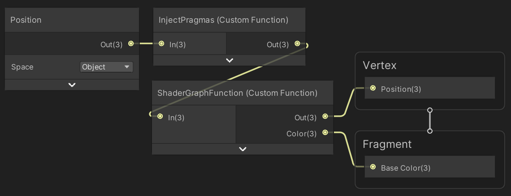

下面是 `InjectPragmas` 自定义函数节点使用的代码文本：

```hlsl
#pragma instancing_options assumeuniformscaling procedural:ConfigureProcedural
#pragma editor_sync_compilation

Out = In;
```

### 如果不想使用 URP 呢？

也可以使用 HDRP，或者像 Basics 系列中说明的那样，为默认渲染管线创建一个包含该 HLSL 文件的表面着色器。

现在可以创建一个使用该着色器的材质，再创建一个挂有 `HashVisualization` 组件的游戏对象，并为其设置该材质和用作实例的立方体。

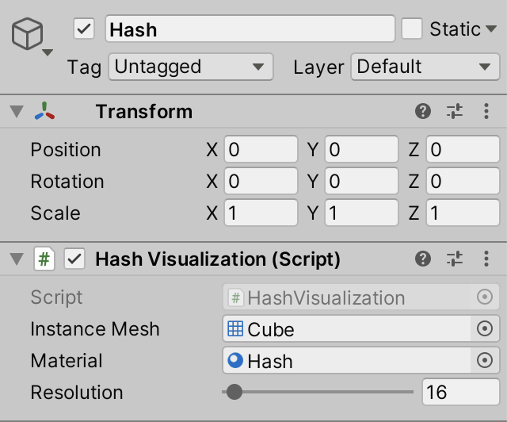

此时进入播放模式，应该就能看到网格。


在播放模式下通过 Inspector 调整分辨率，会让网格重新生成。多数时候看起来正常，但有些分辨率会让网格错位。

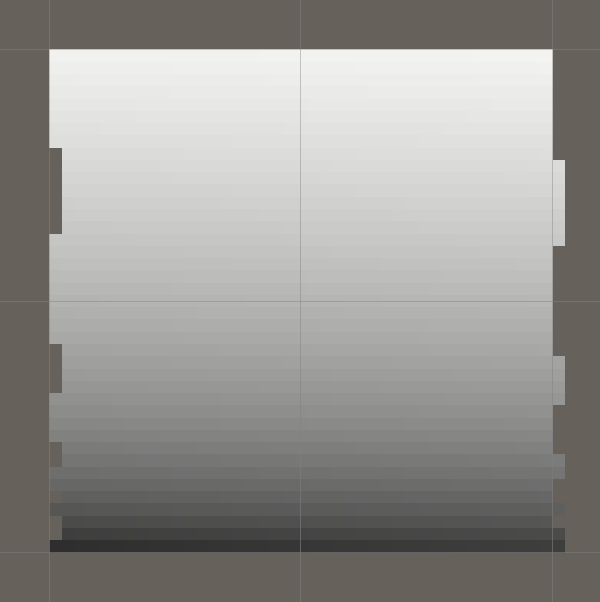

这是由浮点精度限制造成的。有时在执行 `floor` 之前，某个数会略微小于整数，导致实例被放错位置。这里可以在丢弃小数部分之前增加 `0.00001` 的正向偏移来修正：

```hlsl
float v = floor(_Config.y * unity_InstanceID + 0.00001);
```

## 图案

在实现真正的哈希函数之前，先简单看看一些数学函数会生成什么图案。

先让当前的灰阶渐变每隔 256 个点重复一次。做法是在 `GetHashColor` 中只考虑哈希值最低的 8 位。把哈希与二进制 `11111111`（十进制 255）通过按位与运算符 `&` 组合，就能屏蔽掉其他位，只留下 0 到 255 的范围。

然后除以 255，把这个范围缩放到 0–1：

```hlsl
uint hash = _Hashes[unity_InstanceID];
return (1.0 / 255.0) * (hash & 255);
```

结果图案取决于分辨率。分辨率为 32 时，会沿 Z 方向得到重复四次的渐变；分辨率稍有变化，例如改成 41，图案就会错位。


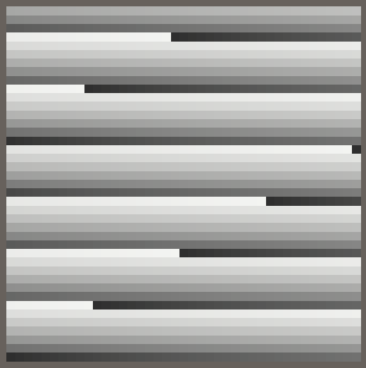

接下来把明显的渐变换成 Weyl 序列。我们在 [Organic Variety（有机变化）教程](https://catlikecoding.com/unity/tutorials/basics/organic-variety/)中也用它为分形着色。根据 `HashJob.Execute` 中的索引计算，并在转换为 `uint` 之前乘以 256，就能得到 0 到 255（含）之间的值：

```csharp
hashes[i] = (uint)(frac(i * 0.381f) * 256f);
```

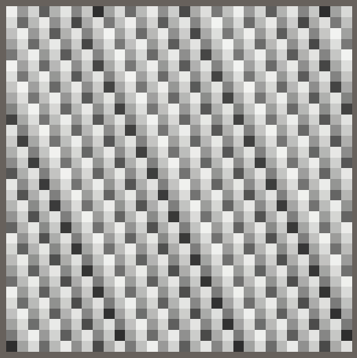

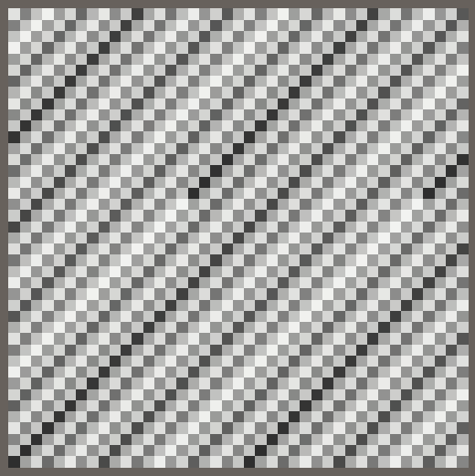

这种方式总会得到明显重复的渐变，渐变方向还会随分辨率改变。要让结果不依赖分辨率，就必须根据点的 UV 坐标而非实例索引来计算。可以像着色器那样在任务中求出坐标，再以 `u` 与 `v` 的乘积作为序列的输入。为此需要给任务增加分辨率及其倒数两个字段：

```csharp
public int resolution;
public float invResolution;

public void Execute(int i) {
    float v = floor(invResolution * i + 0.00001f);
    float u = i - resolution * v;
    hashes[i] = (uint)(frac(u * v * 0.381f) * 255f);
}
```

### 不能在这里使用整数除法代替 `floor` 吗？

可以，但这不是好主意，因为整数除法无法向量化，会让任务效率低得多。可以检查 Burst 生成的代码来确认这一点。

注意，SSE2 指令集没有向量化的 `floor` 操作，因此在仅支持该指令集时，会改成四次未向量化的 `floor` 函数调用，效率不理想。由于这里处理的值都是正数，也可以直接转成整数；这种转换可以用 SSE2 向量化。不过，为了保持写法一致，这里仍使用 `floor`。

在 `OnEnable` 中把所需数据传给任务：

```csharp
new HashJob {
    hashes = hashes,
    resolution = resolution,
    invResolution = 1f / resolution
}.ScheduleParallel(hashes.Length, resolution, default).Complete();
```

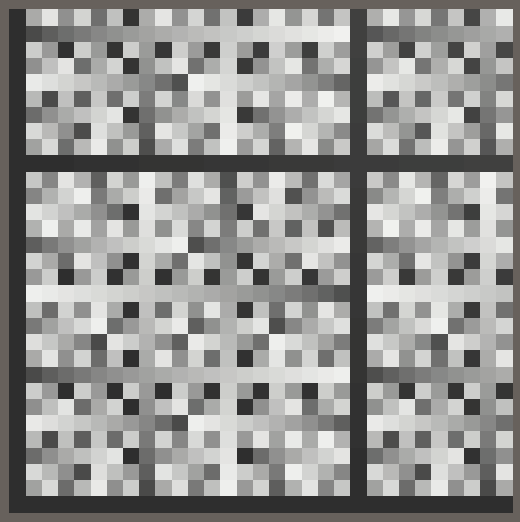

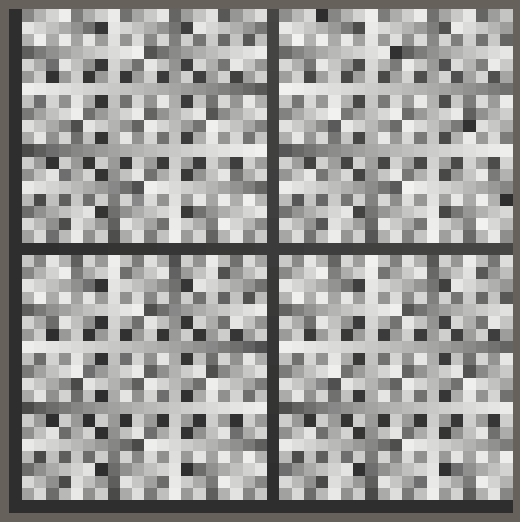

现在得到的图案更有意思，看起来也更随机，但仍有非常明显的重复。要得到更好的结果，就需要一个优秀的哈希函数。

## 小型 xxHash

已知的哈希函数有很多。这里不需要用于保护数据和连接的密码学哈希；我们需要的是既快、视觉效果又好的函数。Yann Collet 设计的 [xxHash 快速摘要算法](https://xxhash.com/)是一个不错的候选方案。

由于输入数据很少——只有两个整数——我们会创建 XXH32 的一个变体，省略它的第 2、3、4 步，并将它命名为 `SmallXXHash`。可在 [GitHub 上查看原算法](https://github.com/Cyan4973/xxHash)。

### 哈希结构体

在单独的 C# 文件中创建 `SmallXXHash` 结构体。定义下面的 5 个 `uint` 常量。它们是二进制素数，命名为 A 到 E，用于扰动位；这些值由 Yann Collet 通过实验选定。

```csharp
public struct SmallXXHash {

    const uint primeA = 0b10011110001101110111100110110001;
    const uint primeB = 0b10000101111010111100101001110111;
    const uint primeC = 0b11000010101100101010111000111101;
    const uint primeD = 0b00100111110101001110101100101111;
    const uint primeE = 0b00010110010101100110011110110001;
}
```

算法用一个累加器保存哈希位，因此需要一个 `uint` 字段。它通过种子数初始化，并加上素数 E。因为这是生成哈希的第一步，所以创建一个带种子参数的公有构造函数。虽然这里把种子视作 `uint`，但代码里通常使用有符号整数，因此 `int` 参数更方便。

```csharp
uint accumulator;

public SmallXXHash (int seed) {
    accumulator = (uint)seed + primeE;
}
```

### 如何定义构造函数？

构造函数用于初始化新的对象实例或结构体值，因此调用时不会显式返回内容。在 C# 中，构造函数使用与类型相同的名称，且不声明返回类型。原文对这一点的表述容易误解；上面的 `SmallXXHash(int seed)` 就是对应示例。

这样就能创建带种子的 `SmallXXHash` 值。为了取得最终的 `uint` 哈希值，可以加入一个公有的 `ToUint` 方法，直接返回累加器：

```csharp
public uint ToUint () => accumulator;
```

也可以把转换写成隐式转换。首先将方法改成静态方法，让它接收一个 `SmallXXHash` 值：

```csharp
public static uint ToUint (SmallXXHash hash) => hash.accumulator;
```

然后把静态方法改为向 `uint` 的类型转换运算符，用 `operator uint` 代替方法名：

```csharp
public static operator uint (SmallXXHash hash) => hash.accumulator;
```

类型转换必须是隐式或显式的。这里选择隐式转换，在 `operator` 前加上 `implicit`。这样就能把 `SmallXXHash` 值直接赋给 `uint`，无需再写 `(uint)`：

```csharp
public static implicit operator uint (SmallXXHash hash) => hash.accumulator;
```

现在可以在任务中创建一个新的 `SmallXXHash` 值，先把种子设为 0，然后直接把它当作最终哈希值使用：

```csharp
public void Execute(int i) {
    float v = floor(invResolution * i + 0.00001f);
    float u = i - resolution * v;

    var hash = new SmallXXHash(0);
    hashes[i] = hash;
}
```

### 单独使用 `SmallXXHash` 类型并转换成 `uint`，会不会很慢？

`int` 和 `uint` 之间并不会发生实际的数据转换。这两种类型只控制如何解释这个值，也就是整数运算是否考虑符号位。一般来说应使用 `int`，只有在确实不想区别对待符号位时才使用 `uint`；`SmallXXHash` 正属于这种情况。

此外，只要可行，Burst 会消除所有方法调用。`SmallXXHash` 实际上只是 `uint` 的一个装饰性别名，不会影响性能。最终结果与把所有代码直接写在 `Execute` 中并使用 `uint` 变量完全相同，因此也能向量化。

普通 C# 代码可能会稍微低效一些，但这里编写的是专门供 Burst 使用的便捷代码。

### 把数据喂入哈希（Eating Data）

XXHash32 会按 32 位一组消费输入数据，必要时可以并行处理。我们的精简版本只处理单个数据段，因此加入 `SmallXXHash.Eat` 方法。它接收一个 `int` 参数，不返回值。先把输入也按 `uint` 处理，乘以素数 C，再加到累加器上。这会导致整数溢出，但我们并不关心数值解释，所以没有问题。

因此所有运算实际上都以 `2^32` 为模。

```csharp
public void Eat (int data) {
    accumulator += (uint)data * primeC;
}
```

调整 `HashJob.Execute`，让 `u` 和 `v` 为整数，然后把它们送入哈希，再使用结果：

```csharp
public void Execute(int i) {
    int v = (int)floor(invResolution * i + 0.00001f);
    int u = i - resolution * v;

    var hash = new SmallXXHash(0);
    hash.Eat(u);
    hash.Eat(v);
    hashes[i] = hash;
}
```

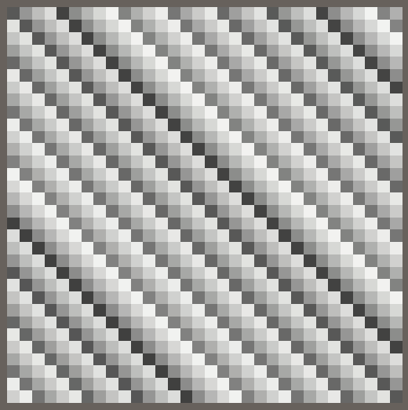

这只是输入数据处理的第一步。`Eat` 加入数据后还要把累加器的位向左旋转。先添加一个私有静态方法来移动数据中的位，并从使用 `<<` 运算符开始：

```csharp
static uint RotateLeft (uint data, int steps) => data << steps;
```

### 位移是怎样工作的？

向左移位会让位变得更显著，移动距离由给定步数决定。左侧移出的位会丢失，右侧则补 0。例如：

```text
0b11111111_00000000_11111111_00000001 << 3
= 0b11111000_00000111_11111000_00001000
```

旋转和普通移位的区别是：移位时会丢失的位，在旋转时会重新放到另一侧。对 32 位数据，可以把数据向左移动，同时向右移动 `32 - steps` 位，再用按位或 `|` 合并两次移位的结果：

```csharp
static uint RotateLeft (uint data, int steps) =>
    (data << steps) | (data >> 32 - steps);
```

### CPU 有循环左移指令吗？

有。Burst 能识别这种写法，并使用相应的 ROL 指令。不过没有可向量化的 ROL 指令；需要向量化时，编译器会用两次移位和一次按位或实现。

现在在 `Eat` 中把累加器向左旋转 17 位。Burst 也会内联这个方法调用，并把右移位数 `32 - 17` 化简为 15，消除常量减法。

```csharp
public void Eat (int data) {
    accumulator = RotateLeft(accumulator + (uint)data * primeC, 17);
}
```

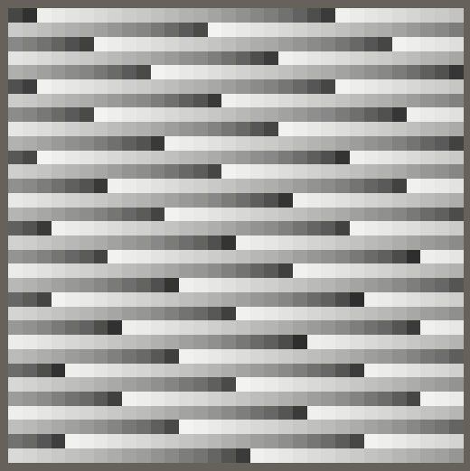

数据处理的最后一步是把累加器乘以素数 D：

```csharp
public void Eat (int data) {
    accumulator = RotateLeft(accumulator + (uint)data * primeC, 17) * primeD;
}
```

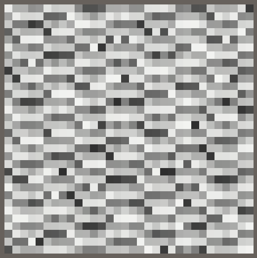

虽然结果看起来还不理想，`Eat` 方法到这里已经完成。虽然本教程不会用到，我们也可以加入一个接收单个 `byte` 的 `Eat` 重载。XXHash32 对这种长度的数据采用略有不同的处理：左旋 11 位，并使用素数 E 与 A，而不是 C 与 D。

```csharp
public void Eat (byte data) {
    accumulator = RotateLeft(accumulator + data * primeE, 11) * primeA;
}
```

### 雪崩效应（Avalanche）

XXHash 算法的最后一步是混合累加器中的位，让每一输入位的影响扩散到更多位上。这称为雪崩效应。它发生在所有数据都喂入、需要取得最终哈希值时，因此把它放到转换为 `uint` 的过程中执行。

雪崩值最初等于累加器。先把它右移 15 位，再与原值通过按位异或运算符 `^` 合并，然后乘以素数 B。接着再右移 13 位、异或并乘以素数 C。最后右移 16 位并异或，不再继续乘法。

```csharp
public static implicit operator uint (SmallXXHash hash) {
    uint avalanche = hash.accumulator;
    avalanche ^= avalanche >> 15;
    avalanche *= primeB;
    avalanche ^= avalanche >> 13;
    avalanche *= primeC;
    avalanche ^= avalanche >> 16;
    return avalanche;
}
```

### 按位异或 `XOR` 是什么？

它是“互斥或”（eXclusive OR）运算符。当两个对应位中恰好一个是 1 时，结果位为 1；两个位都为 1 或都为 0 时，结果位为 0。例如：

```text
0b00111100 ^ 0b00001111 = 0b00110011
```

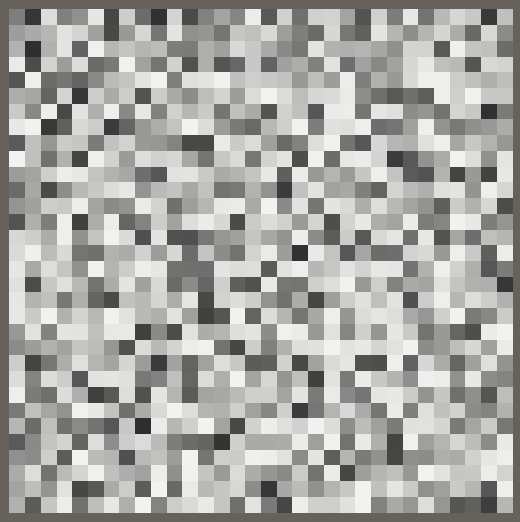

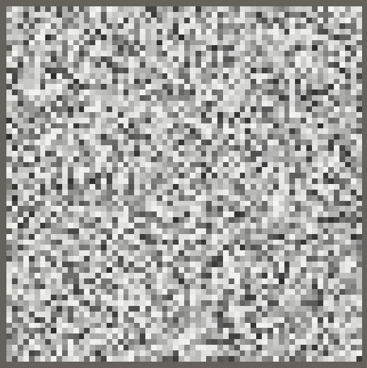

### 负坐标

为了演示哈希函数也能处理负坐标，在 `HashJob.Execute` 中从 `u` 和 `v` 减去半个分辨率：

```csharp
int v = (int)floor(invResolution * i + 0.00001f);
int u = i - resolution * v - resolution / 2;
v -= resolution / 2;
```

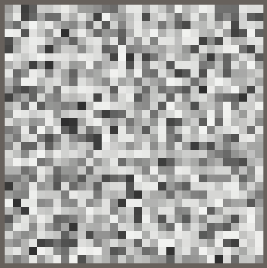

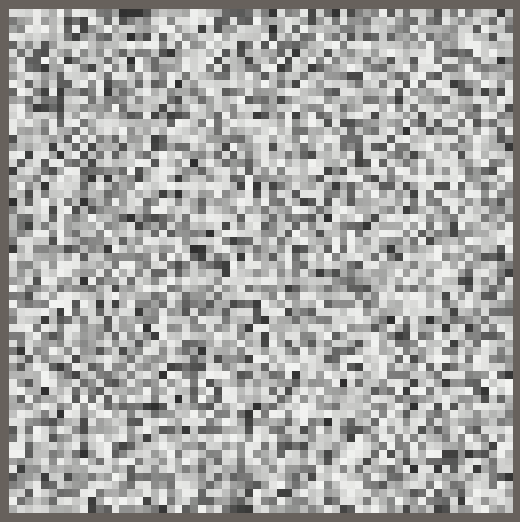

现在调整分辨率时，哈希图案会保持居中，不过分辨率从偶数变成奇数或反过来时，图案会抖动一个格子。

### 方法链式调用

`SmallXXHash` 已经可以正常工作，不过可以让它更方便：为方法链式调用提供支持。把两个 `Eat` 方法都改成返回哈希本身即可，返回值使用 `this`。

```csharp
public SmallXXHash Eat (int data) {
    accumulator = RotateLeft(accumulator + (uint)data * primeC, 17) * primeD;
    return this;
}

public SmallXXHash Eat (byte data) {
    accumulator = RotateLeft(accumulator + data * primeE, 11) * primeA;
    return this;
}
```

现在 `HashJob.Execute` 仍然能工作，只是忽略了 `Eat` 的返回值。不过可以直接在构造函数的结果上调用 `Eat`，再接着调用另一个 `Eat`，把代码缩成一行：

```csharp
hashes[i] = new SmallXXHash(0).Eat(u).Eat(v);
```

### 不可变性

还可以进一步修改，让 `SmallXXHash.Eat` 不再修改被调用对象的累加器。这样就能保留一个中间哈希值，并在之后重复使用；后续教程会用到这一点。我们会把 `SmallXXHash` 变成不可变结构体，让它的行为真正与 `uint` 值一致。

给 `SmallXXHash` 加上 `readonly` 修饰符：

```csharp
public readonly struct SmallXXHash { … }
```

累加器字段也要标记为只读：

```csharp
readonly uint accumulator;
```

从现在开始，只有在构造函数中传入新值，才能改变累加器；因为只有构造函数可以赋值给 `readonly` 字段。调整现有构造函数，让它直接设置累加器，不再接收种子：

```csharp
public SmallXXHash (uint accumulator) {
    this.accumulator = accumulator;
}
```

现在可以把 `uint` 直接转换成 `SmallXXHash`。为此加入一个方便的隐式转换：

```csharp
public static implicit operator SmallXXHash (uint accumulator) =>
    new SmallXXHash(accumulator);
```

这样 `Eat` 方法就能把新的累加器值直接作为 `SmallXXHash` 返回：

```csharp
public SmallXXHash Eat (int data) =>
    RotateLeft(accumulator + (uint)data * primeC, 17) * primeD;

public SmallXXHash Eat (byte data) =>
    RotateLeft(accumulator + data * primeE, 11) * primeA;
```

最后，添加静态的 `Seed` 方法，以便仍然能用种子初始化：

```csharp
public static SmallXXHash Seed (int seed) => (uint)seed + primeE;
```

在 `HashJob.Execute` 中使用新方法初始化哈希。不再显式调用构造函数，而是从一个静态方法开始，连续调用普通方法：

```csharp
hashes[i] = SmallXXHash.Seed(0).Eat(u).Eat(v);
```

注意，这些更改纯粹是代码风格上的调整。Burst 生成的指令保持不变。

## 显示更多哈希内容

`SmallXXHash` 完成后，接下来关注如何显示它的结果。

### 使用不同的位段

到目前为止，我们只查看了生成哈希值最低的字节。在 `GetHashColor` 中右移哈希值，可以快速改为观察其他字节。例如右移 8 位，就会看到显著性高一档的第二个字节：

```hlsl
return (1.0 / 255.0) * ((hash >> 8) & 255);
```


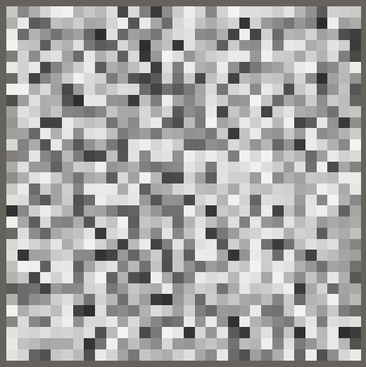

这样可以分别创建四种完全独立的 8 位可视化，也可以使用不同的位数和移位量。

### 着色

可以把三个字节的可视化组合起来，每个字节分别用于最终颜色的一个 RGB 通道。最低字节用于红色，第二低字节用于绿色，第三低字节用于蓝色，因此需要分别右移 0、8 和 16 位：

```hlsl
uint hash = _Hashes[unity_InstanceID];
return (1.0 / 255.0) * float3(
    hash & 255,
    (hash >> 8) & 255,
    (hash >> 16) & 255
);
```

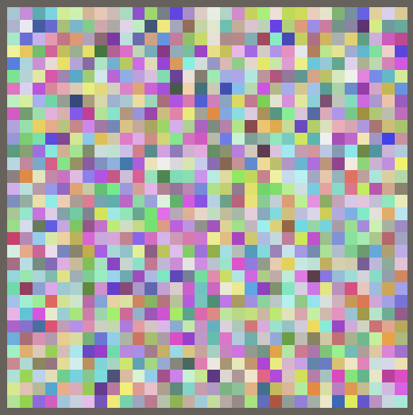

### 可配置的种子

现在的可视化显示了哈希位的 75%，可以把种子做成可配置项。给 `HashJob` 增加一个字段，并用它初始化哈希：

```csharp
public int seed;

public void Execute(int i) {
    …
    hashes[i] = SmallXXHash.Seed(seed).Eat(u).Eat(v);
}
```

也给 `HashVisualization` 增加配置字段，并在 `OnEnable` 中传给任务。种子可以是任意整数：

```csharp
[SerializeField]
int seed;

// …

void OnEnable () {
    // …

    new HashJob {
        hashes = hashes,
        resolution = resolution,
        invResolution = 1f / resolution,
        seed = seed
    }.ScheduleParallel(hashes.Length, resolution, default).Complete();

    // …
}
```

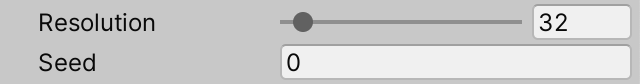

现在可以通过调整种子大幅改变图案。每个种子都会生成完全不同的图案，彼此之间看不出明显关联。

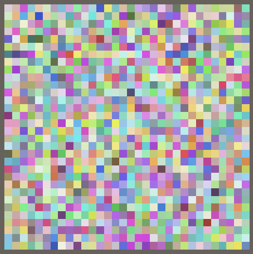

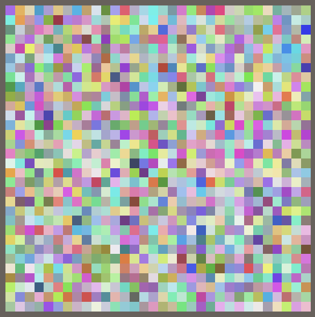

还可以进一步把哈希初始化从任务中提到任务外。除了让任务少执行一次加法这一点小优化，这也说明可以在任务中使用之前按任意方式初始化的哈希值。

把 `HashJob` 中的种子字段替换为 `SmallXXHash` 字段，并在 `Execute` 中直接使用：

```csharp
// public int seed;
public SmallXXHash hash;

public void Execute(int i) {
    …
    hashes[i] = hash.Eat(u).Eat(v);
}
```

然后在 `OnEnable` 中把带种子的哈希传给任务：

```csharp
new HashJob {
    hashes = hashes,
    resolution = resolution,
    invResolution = 1f / resolution,
    hash = SmallXXHash.Seed(seed)
}.ScheduleParallel(hashes.Length, resolution, default).Complete();
```

### 使用最后一个字节

哈希还有一个字节没有显示。可以用它控制透明度，但这会让立方体更难看清，而且需要按深度对实例进行适当排序才能正确渲染。因此我们改用第四个字节来控制立方体的垂直偏移。

让偏移量可配置，范围限制为 −2 到 2，默认值为 1。偏移量相对于立方体实例大小计算，因此实际偏移要除以分辨率。把这个缩放值作为配置向量的第三个分量传给 GPU。

```csharp
[SerializeField, Range(-2f, 2f)]
float verticalOffset = 1f;

// …

void OnEnable () {
    // …
    propertyBlock.SetVector(configId, new Vector4(
        resolution, 1f / resolution, verticalOffset / resolution
    ));
}
```

在 `ConfigureProcedural` 中应用偏移。最高字节通过右移 24 位取得；此时其他位都为 0，因此无需再屏蔽。把它缩放到 0–1，再减去一半，让取值范围变成 −0.5 到 0.5，最后乘以配置中的偏移缩放量。

```hlsl
unity_ObjectToWorld._m03_m13_m23_m33 = float4(
    _Config.y * (u + 0.5) - 0.5,
    _Config.z * ((1.0 / 255.0) * (_Hashes[unity_InstanceID] >> 24) - 0.5),
    _Config.y * (v + 0.5) - 0.5,
    1.0
);
```

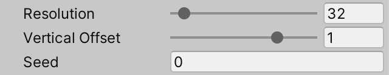

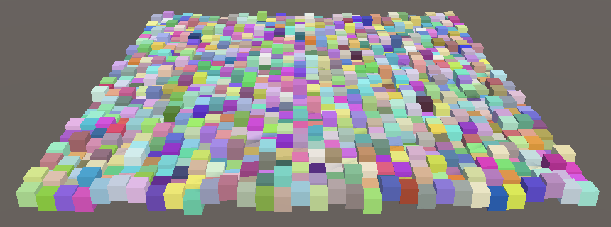

下一篇教程是 [Hashing Space](https://catlikecoding.com/unity/tutorials/pseudorandom-noise/hashing-space/)（哈希空间）。

---

## 原文与授权

- 原文：[Hashing — Catlike Coding](https://catlikecoding.com/unity/tutorials/pseudorandom-noise/hashing/)
- 原文 PDF：[Hashing.pdf](https://catlikecoding.com/unity/tutorials/pseudorandom-noise/hashing/Hashing.pdf)
- 教程项目：[Bitbucket 仓库](https://bitbucket.org/catlikecodingunitytutorials/pseudorandom-noise-01-hashing/)
- 作者：Jasper Flick / Catlike Coding
- 教程内容、截图与图示授权： [CC BY-NC-SA 4.0](https://catlikecoding.com/unity/tutorials/license/)
- 授权要求：署名、非商业使用、以相同方式共享。本译文依据该许可发布；原始图片保存在同目录 `Hashing_assets` 文件夹中。
- 相关代码与项目资源按原站说明采用 MIT-0 授权；具体许可范围以[原站授权页](https://catlikecoding.com/unity/tutorials/license/)为准。

喜欢这些教程、觉得它们有帮助并希望看到更多内容？可以在 [Patreon 支持作者](https://www.patreon.com/catlikecoding)，或通过[直接捐赠](https://catlikecoding.com/unity/tutorials/donating.html)。教程作者是 Jasper Flick。
