# Value Noise

## 格点噪声

本教程将会：

- 创建一个抽象的可视化类。
- 引入一个通用噪声 Job。
- 生成 1D、2D 和 3D 值噪声。

这是伪随机噪声系列教程的第三篇，内容讲解如何从纯哈希过渡到最简单的一类格点噪声。

本教程使用 Unity 2020.3.6f1 编写。

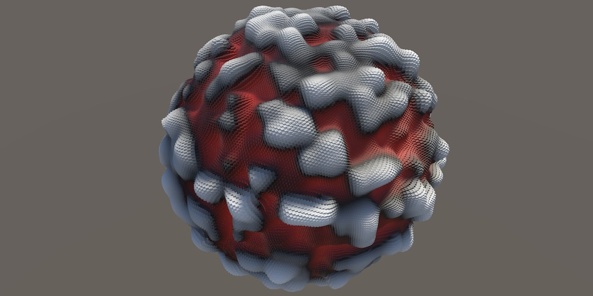

## 可复用的可视化

我们的哈希可视化展示了哈希函数如何根据整数坐标，把空间划分成值各不相同的离散区块。噪声函数的思路是利用这些哈希值，生成不那么块状的图案。本教程具体实现值噪声，它会平滑块状的哈希图案。因此，噪声函数的输出形成连续图案，产生浮点数而非离散的位模式。

这要求我们使用一种与当前可视化相似、但又有所不同的噪声可视化。

我们可以复制 `HashVisualization` 中的代码，再用它实现 `NoiseVisualization`，但那样会产生大量重复代码。这里将使用继承，引入抽象的 `Visualization` 类，作为哈希可视化和噪声可视化的共同基类。

### 抽象可视化类

复制 `HashVisualization` C# 资源并将其重命名为 `Visualization`，然后移除 Job，以及所有直接与哈希、哈希种子和哈希域有关的字段。

在这个新类中，保留与所有可视化共有的内容：

```csharp
using Unity.Collections;
using Unity.Jobs;
using Unity.Mathematics;
using UnityEngine;

using static Unity.Mathematics.math;

public class Visualization : MonoBehaviour {

    static int
        positionsId = Shader.PropertyToID("_Positions"),
        normalsId = Shader.PropertyToID("_Normals"),
        configId = Shader.PropertyToID("_Config");

    NativeArray<float3x4> positions, normals;
    ComputeBuffer positionsBuffer, normalsBuffer;

    // 其余通用可视化字段和方法……
}
```

相应地清理 `OnEnable` 和 `OnDisable`：

```csharp
void OnEnable () {
    isDirty = true;

    int length = resolution * resolution;
    length = length / 4 + (length & 1);
    positions = new NativeArray<float3x4>(length, Allocator.Persistent);
    normals = new NativeArray<float3x4>(length, Allocator.Persistent);
    positionsBuffer = new ComputeBuffer(length * 4, 3 * 4);
    normalsBuffer = new ComputeBuffer(length * 4, 3 * 4);

    propertyBlock ??= new MaterialPropertyBlock();
    // 设置材质属性……
}

void OnDisable () {
    positions.Dispose();
    normals.Dispose();
    positionsBuffer.Release();
    normalsBuffer.Release();
    positionsBuffer = null;
    normalsBuffer = null;
}
```

然后修改 `OnValidate`，让它检查 `positionsBuffer`，而不是原来的哈希缓冲区：

```csharp
void OnValidate () {
    if (positionsBuffer != null && enabled) {
        OnDisable();
        OnEnable();
    }
}
```

接着从 `Update` 中移除哈希 Job 的调度，以及哈希缓冲区的设置代码：

```csharp
void Update () {
    if (isDirty || transform.hasChanged) {
        // 安排形状采样 Job……
        // 更新可视化……
    }
}
```

现在剩下的类包含可视化所需的所有通用工作，但不负责计算和存储要可视化的数据。因此，单独使用它没有意义，也不应该把它直接挂到游戏对象上。为此，将类标记为 `abstract`：

```csharp
public abstract class Visualization : MonoBehaviour { … }
```

这样就无法直接创建 `Visualization` 类型的实例。

### 抽象方法

无论如何使用 `Visualization`，都必须支持启用和停用。它已经有 `OnEnable` 和 `OnDisable` 方法，但这些方法还不会创建或移除原生数组、缓冲区，以及可视化数据所需的其他资源。我们假定这部分工作由专门的 `EnableVisualization` 和 `DisableVisualization` 方法完成，于是在 `Visualization` 中添加它们。

因为目前还不知道这些方法具体要执行什么代码，所以这里只声明抽象方法签名，就像接口所定义的契约一样。由于这个类本身也是抽象类，我们可以省略这些方法的实现：

```csharp
abstract void EnableVisualization ();
abstract void DisableVisualization ();
```

启用可视化时需要数据长度和材质属性块，因此把它们作为参数传给 `EnableVisualization`：

```csharp
abstract void EnableVisualization (
    int dataLength, MaterialPropertyBlock propertyBlock
);
```

在 `OnEnable` 中创建材质属性块之后调用 `EnableVisualization`，并在 `OnDisable` 末尾调用 `DisableVisualization`：

```csharp
void OnEnable () {
    // 分配通用数据……
    propertyBlock ??= new MaterialPropertyBlock();
    EnableVisualization(length, propertyBlock);
    // 设置通用材质属性……
}

void OnDisable () {
    // 释放通用数据……
    DisableVisualization();
}
```

更新可视化时也要执行一些尚未确定的工作。再添加一个抽象的 `UpdateVisualization` 方法，让它接收位置原生数组、分辨率和 Job 句柄：

```csharp
abstract void UpdateVisualization (
    NativeArray<float3x4> positions, int resolution, JobHandle handle
);
```

在 `Update` 中调用这个方法，并传入形状 Job 的句柄：

```csharp
UpdateVisualization(
    positions, resolution,
    shapeJobs[(int)shape](
        positions, normals, resolution,
        transform.localToWorldMatrix, default
    )
);
```

具体的可视化类将继承 `Visualization`，并实现这三个抽象方法。目前它们在 `Visualization` 中是私有的，子类无法访问。我们可以把它们设为 `public`，但没有必要，因为它们只由类自身及其子类使用。这里将访问级别改为 `protected`：

```csharp
protected abstract void EnableVisualization (
    int dataLength, MaterialPropertyBlock propertyBlock
);

protected abstract void DisableVisualization ();

protected abstract void UpdateVisualization (
    NativeArray<float3x4> positions, int resolution, JobHandle handle
);
```

### 继承抽象类

接下来调整 `HashVisualization`，让它继承 `Visualization`，而不是直接继承 `MonoBehaviour`，从而复用通用可视化功能：

```csharp
public class HashVisualization : Visualization { … }
```

移除 `HashVisualization` 中已经从 `Visualization` 继承的形状类型，以及所有重复字段。哈希类仍需保留自己的哈希种子、哈希域、哈希数组和哈希缓冲区：

```csharp
static int hashesId = Shader.PropertyToID("_Hashes");

[SerializeField]
int seed;

[SerializeField]
SpaceTRS domain = new SpaceTRS {
    scale = 8f
};

NativeArray<uint4> hashes;
ComputeBuffer hashesBuffer;
```

把 `OnEnable` 改为 `EnableVisualization`，只保留处理哈希数据的代码：

```csharp
protected override void EnableVisualization (
    int dataLength, MaterialPropertyBlock propertyBlock
) {
    hashes = new NativeArray<uint4>(dataLength, Allocator.Persistent);
    hashesBuffer = new ComputeBuffer(dataLength * 4, 4);
    propertyBlock.SetBuffer(hashesId, hashesBuffer);
}
```

这个方法需要用 `override` 标记为重写，并使用与抽象声明相同的 `protected` 访问级别。用相同的思路把 `OnDisable` 改为 `DisableVisualization`：

```csharp
protected override void DisableVisualization () {
    hashes.Dispose();
    hashesBuffer.Release();
    hashesBuffer = null;
}
```

移除 `OnValidate`，因为基类中已经实现了它。最后把 `Update` 改为 `UpdateVisualization`，其中只安排并完成哈希 Job，然后设置哈希缓冲区：

```csharp
protected override void UpdateVisualization (
    NativeArray<float3x4> positions, int resolution, JobHandle handle
) {
    new HashJob {
        positions = positions,
        hashes = hashes,
        hash = SmallXXHash.Seed(seed),
        domainTRS = domain.Matrix
    }.ScheduleParallel(hashes.Length, resolution, handle).Complete();

    hashesBuffer.SetData(hashes.Reinterpret<uint>(4 * 4));
}
```

此时哈希可视化仍然像之前一样工作，只是所有通用可视化代码都已隔离到单独的 `Visualization` 类中。

### 可视化噪声

现在创建一个新的 `NoiseVisualization` 组件类型，同样继承 `Visualization`。复制 `HashVisualization`，移除它的哈希 Job，并把对哈希的引用改成噪声。噪声是浮点数，因此原生数组的元素类型改为 `float4`。起初，`UpdateVisualization` 只需完成传入的句柄并设置噪声缓冲区；这会产生处处为零的噪声。

```csharp
using Unity.Collections;
using Unity.Jobs;
using Unity.Mathematics;
using UnityEngine;

public class NoiseVisualization : Visualization {

    static int noiseId = Shader.PropertyToID("_Noise");

    [SerializeField]
    int seed;

    [SerializeField]
    SpaceTRS domain = new SpaceTRS {
        scale = 8f
    };

    NativeArray<float4> noise;
    ComputeBuffer noiseBuffer;

    protected override void EnableVisualization (
        int dataLength, MaterialPropertyBlock propertyBlock
    ) {
        noise = new NativeArray<float4>(dataLength, Allocator.Persistent);
        noiseBuffer = new ComputeBuffer(dataLength * 4, 4);
        propertyBlock.SetBuffer(noiseId, noiseBuffer);
    }

    protected override void DisableVisualization () {
        noise.Dispose();
        noiseBuffer.Release();
        noiseBuffer = null;
    }

    protected override void UpdateVisualization (
        NativeArray<float3x4> positions, int resolution, JobHandle handle
    ) {
        handle.Complete();
        noiseBuffer.SetData(noise.Reinterpret<float>(4 * 4));
    }
}
```

噪声可视化需要稍有不同的着色器。复制 `HashGPU` 并重命名为 `NoiseGPU`，把哈希缓冲区替换成噪声缓冲区，并在 `ConfigureProcedural` 中直接用噪声值偏移位置。由于噪声值会落在 `−1` 到 `1` 之间，这样做是可行的：

```hlsl
#if defined(UNITY_PROCEDURAL_INSTANCING_ENABLED)
    StructuredBuffer<float> _Noise;
    StructuredBuffer<float3> _Positions, _Normals;
#endif

float4 _Config;
void ConfigureProcedural () {
    #if defined(UNITY_PROCEDURAL_INSTANCING_ENABLED)
        …
        unity_ObjectToWorld._m03_m13_m23 +=
            _Config.z * _Noise[unity_InstanceID] * _Normals[unity_InstanceID];
        unity_ObjectToWorld._m00_m11_m22 = _Config.y;
    #endif
}
```

然后用 `GetNoiseColor` 替换 `GetHashColor`。正噪声值直接作为灰度颜色；负值则显示为红色，这样更容易分辨正负：

```hlsl
float3 GetNoiseColor () {
    #if defined(UNITY_PROCEDURAL_INSTANCING_ENABLED)
        float noise = _Noise[unity_InstanceID];
        return noise < 0.0 ? float3(-noise, 0.0, 0.0) : noise;
    #else
        return 1.0;
    #endif
}

void ShaderGraphFunction_float (float3 In, out float3 Out, out float3 Color) {
    Out = In;
    Color = GetNoiseColor();
}

void ShaderGraphFunction_half (half3 In, out half3 Out, out half3 Color) {
    Out = In;
    Color = GetNoiseColor();
}
```

复制哈希版本的 Shader Graph 或表面着色器来创建噪声版本，并修改它所使用的 HLSL 文件。如果使用表面着色器，还要改为调用新的颜色函数。随后创建材质，再创建一个使用该材质的游戏对象，并添加 `NoiseVisualization` 组件。

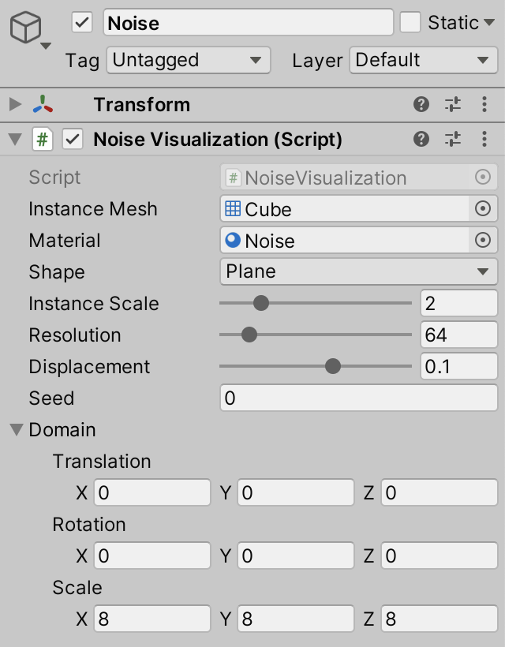

我把哈希可视化和噪声可视化放在不同场景中；你也可以把它们放在同一个场景里，只启用其中一个。

### 扩展方法

创建噪声计算 Job 后，我们会有三个地方需要执行向量化的矩阵—向量变换。与其再增加一个 `TransformPositions` 或 `TransformVectors` 实现，不如把这段代码放到一个可供各处共用的位置。最简单的方式是新建独立的 C# 文件，创建静态 `MathExtensions` 类，并把 `Shapes.Job` 中的 `TransformVectors` 方法公开复制到该类中：

```csharp
using Unity.Mathematics;
using static Unity.Mathematics.math;

public static class MathExtensions {

    public static float4x3 TransformVectors (
        float3x4 trs, float4x3 p, float w = 1f
    ) => float4x3(
        trs.c0.x * p.c0 + trs.c1.x * p.c1 + trs.c2.x * p.c2 + trs.c3.x * w,
        trs.c0.y * p.c0 + trs.c1.y * p.c1 + trs.c2.y * p.c2 + trs.c3.y * w,
        trs.c0.z * p.c0 + trs.c1.z * p.c1 + trs.c2.z * p.c2 + trs.c3.z * w
    );
}
```

现在可以通过 `MathExtensions.TransformVectors(trs, v)` 调用它。借助 `using static MathExtensions`，还可以简写为 `TransformVectors(trs, v)`。另一种做法是把它改成扩展方法。

扩展方法是一个静态方法，但它看起来像某种类型的实例方法。只要在方法的第一个参数前加上 `this` 修饰符，就能把它声明为扩展方法：

```csharp
public static float4x3 TransformVectors (
    this float3x4 trs, float4x3 p, float w = 1f
) => float4x3(…);
```

调用时可以直接在该类型的实例上使用方法，并省略第一个参数。于是就可以写成 `trs.TransformVectors(v)`，相当于让矩阵变换一个向量。修改 `Shapes.Job`，采用这种方式并移除它自身的 `TransformVectors` 方法：

```csharp
public void Execute (int i) {
    Point4 p = default(S).GetPoint4(i, resolution, invResolution);
    positions[i] = transpose(positionTRS.TransformVectors(p.positions));

    float3x4 n = transpose(normalTRS.TransformVectors(p.normals, 0f));
    normals[i] = float3x4(
        normalize(n.c0), normalize(n.c1), normalize(n.c2), normalize(n.c3)
    );
}
```

对 `HashVisualization.HashJob` 做同样的修改：

```csharp
public void Execute (int i) {
    float4x3 p = domainTRS.TransformVectors(transpose(positions[i]));
    // 根据变换后的位置计算哈希……
}
```

再给 `MathExtensions` 添加一个 `Get3x4` 扩展方法，用于从 `float4x4` 矩阵中提取 `float3x4` 部分：

```csharp
public static float3x4 Get3x4 (this float4x4 m) =>
    float3x4(m.c0.xyz, m.c1.xyz, m.c2.xyz, m.c3.xyz);
```

用它简化 `Shapes.Job.ScheduleParallel`：

```csharp
public static JobHandle ScheduleParallel (
    NativeArray<float3x4> positions, NativeArray<float3x4> normals,
    int resolution, float4x4 trs, JobHandle dependency
) => new Job<S> {
    positions = positions,
    normals = normals,
    resolution = resolution,
    invResolution = 1f / resolution,
    positionTRS = trs.Get3x4(),
    normalTRS = transpose(inverse(trs)).Get3x4()
}.ScheduleParallel(positions.Length, resolution, dependency);
```

### 扩展方法是如何工作的？

如果继续追究下去，就会发现对象并非什么不可分割的实体。归根结底只有数据：有些数据表示信息，有些数据表示指令。对象只是对它们的一层抽象。调用对象上的方法时，CPU 实际上会把一些数据——也就是参数——压入数据栈，然后跳转到相应的指令。被调用方法所属的对象，本身也只是另一个参数。扩展方法把这一点表现得更直观。

## 格点噪声

本教程要创建的噪声称为值噪声。它是格点噪声的一种。格点噪声以几何格点为基础，这些格点通常排列成规则网格。

### 通用噪声 Job

噪声有不同类型和变化形式，因此我们创建一个专门的静态 `Noise` 类，就像之前创建 `Shapes` 类那样。与 `Shapes` 一样，它包含一个接口和一个泛型 `Job` 结构体。这里的接口叫作 `INoise`，定义了 `GetNoise4` 方法：给定一组位置和哈希值，它返回一个向量化的 `float4` 噪声值。

```csharp
using Unity.Burst;
using Unity.Collections;
using Unity.Jobs;
using Unity.Mathematics;
using static Unity.Mathematics.math;

public static class Noise {

    public interface INoise {
        float4 GetNoise4 (float4x3 positions, SmallXXHash4 hash);
    }

    [BurstCompile(FloatPrecision.Standard, FloatMode.Fast, CompileSynchronously = true)]
    public struct Job<N> : IJobFor where N : struct, INoise { }
}
```

Job 需要输入位置、输出噪声值、哈希状态和域变换矩阵。它的 `Execute` 方法会把变换后的位置和哈希值传给噪声实现的 `GetNoise4` 方法：

```csharp
public struct Job<N> : IJobFor where N : struct, INoise {

    [ReadOnly]
    public NativeArray<float3x4> positions;

    [WriteOnly]
    public NativeArray<float4> noise;

    public SmallXXHash4 hash;
    public float3x4 domainTRS;

    public void Execute (int i) {
        noise[i] = default(N).GetNoise4(
            domainTRS.TransformVectors(transpose(positions[i])), hash
        );
    }
}
```

最后给 Job 添加合适的 `ScheduleParallel` 方法，并在 `Noise` 中声明对应的委托类型：

```csharp
public struct Job<N> : IJobFor where N : struct, INoise {

    // Job 字段和 Execute 方法……

    public static JobHandle ScheduleParallel (
        NativeArray<float3x4> positions, NativeArray<float4> noise,
        int seed, SpaceTRS domainTRS, int resolution, JobHandle dependency
    ) => new Job<N> {
        positions = positions,
        noise = noise,
        hash = SmallXXHash.Seed(seed),
        domainTRS = domainTRS.Matrix,
    }.ScheduleParallel(positions.Length, resolution, dependency);
}

public delegate JobHandle ScheduleDelegate (
    NativeArray<float3x4> positions, NativeArray<float4> noise,
    int seed, SpaceTRS domainTRS, int resolution, JobHandle dependency
);
```

### 分部类

下一步是在 `Noise` 中加入格点噪声代码。与其把所有代码放在同一个 C# 文件里，不如把格点专用代码放到另一个文件，方便整理。为此，把 `Noise` 改为 `partial` 类。`partial` 告诉编译器，可以在多个文件中共同定义这个类的不同部分：

```csharp
public static partial class Noise { … }
```

现在创建一个新的 C# 资源文件，命名为 `Noise.Lattice`。这种命名方式不是强制的，不过可以让人看出这个文件保存的是 `Noise` 的格点部分。再次定义 `partial Noise` 类，并添加 `Lattice1D` 结构体来实现 `INoise`。为了从简单情况开始，我们先处理一维格点噪声；此时 `Lattice1D` 暂时始终返回零：

```csharp
using Unity.Mathematics;
using static Unity.Mathematics.math;

public static partial class Noise {

    public struct Lattice1D : INoise {

        public float4 GetNoise4 (float4x3 positions, SmallXXHash4 hash) {
            return 0f;
        }
    }
}
```

现在可以在 `NoiseVisualization` 中安排一个 Job 来生成一维格点噪声：

```csharp
using static Noise;

protected override void UpdateVisualization (
    NativeArray<float3x4> positions, int resolution, JobHandle handle
) {
    Job<Lattice1D>.ScheduleParallel(
        positions, noise, seed, domain, resolution, handle
    ).Complete();
    noiseBuffer.SetData(noise.Reinterpret<float>(4 * 4));
}
```

### 一维噪声

在 `Lattice1D.GetNoise4` 中实现一维噪声的第一步，是对整数 X 坐标做哈希，取哈希结果的第一个字节，将其转换为浮点数，再映射到 `−1` 到 `1`。具体来说，先向下取整坐标，再把它们传入哈希函数；随后把结果转换为无符号整数、屏蔽出最低字节、转换为浮点数，最后调整数值范围：

```csharp
public float4 GetNoise4 (float4x3 positions, SmallXXHash4 hash) {
    int4 p = (int4)floor(positions.c0);
    float4 v = (uint4)hash.Eat(p) & 255;
    return v * (2f / 255f) - 1f;
}
```

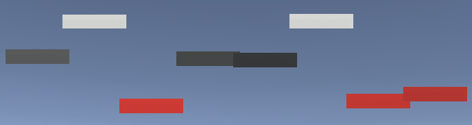

这样得到的是彼此分离的哈希值：它们在整数坐标处保持不变，忽略坐标的小数部分。要让噪声平滑、连续，就必须在整数坐标之间对这些值进行混合。整数坐标定义了格点结构中的各个点，点与点之间的区间则需要用连续信号填充。为此，我们必须同时知道区间两端的值。

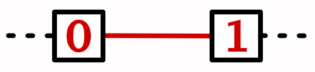

把当前所在的格点称为 `p0`。再往前一个格点称为 `p1`。如果改为显示 `p1` 的哈希值，就会得到和之前相同的图案，只是整体沿格点方向平移了一个单位：

```csharp
int4 p0 = (int4)floor(positions.c0);
int4 p1 = p0 + 1;
float4 v = (uint4)hash.Eat(p1) & 255;
```

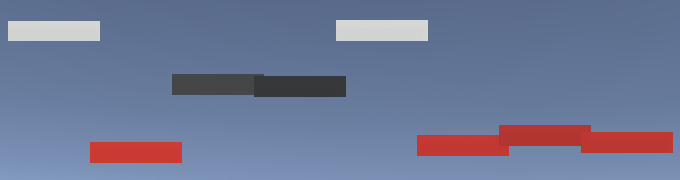

要填满两格点之间的区间，就必须把两端的值组合起来。这意味着需要把哈希值转换为浮点数两次。为了方便取得字节或浮点值，我们给 `SmallXXHash4` 添加两个属性：一个取出向量化的第一个字节（称为字节 A），另一个把同一个字节转换到 `[0, 1]` 范围：

```csharp
public uint4 BytesA => (uint4)this & 255;
public float4 Floats01A => (float4)BytesA * (1f / 255f);
```

现在可以方便地取得 `p0` 和 `p1` 的 `[0, 1]` 值，把它们相加后减去 1。这样就得到两端格点值的平均值，范围为 `−1` 到 `1`：

```csharp
return hash.Eat(p0).Floats01A + hash.Eat(p1).Floats01A - 1f;
```

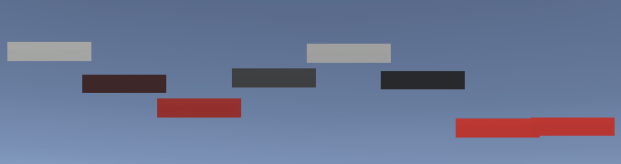

同样的计算也可以用 `lerp` 函数表示：以 `0.5` 作为插值比例，在 `p0` 和 `p1` 之间取中点，然后把结果乘以 2 再减去 1：

```csharp
return lerp(
    hash.Eat(p0).Floats01A, hash.Eat(p1).Floats01A, 0.5f
) * 2f - 1f;
```

最后，要在格点之间形成连续过渡，就根据当前位置的小数部分，在 `p0` 与 `p1` 之间插值。小数部分可以通过坐标减去 `p0` 得到，它就是插值因子 `t`：

```csharp
float4 t = positions.c0 - p0;
return lerp(
    hash.Eat(p0).Floats01A, hash.Eat(p1).Floats01A, t
) * 2f - 1f;
```

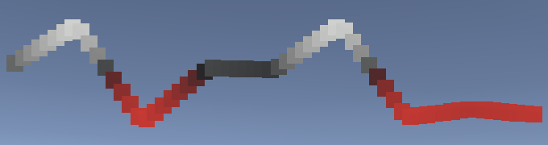

我们还要给 `SmallXXHash4` 添加另外三个字节及其 `[0, 1]` 浮点版本，后续实现会用到它们：

```csharp
public uint4 BytesA => (uint4)this & 255;
public uint4 BytesB => ((uint4)this >> 8) & 255;
public uint4 BytesC => ((uint4)this >> 16) & 255;
public uint4 BytesD => (uint4)this >> 24;

public float4 Floats01A => (float4)BytesA * (1f / 255f);
public float4 Floats01B => (float4)BytesB * (1f / 255f);
public float4 Floats01C => (float4)BytesC * (1f / 255f);
public float4 Floats01D => (float4)BytesD * (1f / 255f);
```

### 二维噪声

此时我们已经得到连续、但尚未平滑的一维噪声。先不处理平滑度，而是在噪声形式最简单时扩展到二维。

只考虑一个维度时，需要记录两个格点和一个插值因子。我们把这些数据定义为 `LatticeSpan4` 结构体。由于它只用于格点噪声内部计算，所以把它作为 `Noise.Lattice` 文件中 `Noise` 的私有类型：

```csharp
struct LatticeSpan4 {
    public int4 p0, p1;
    public float4 t;
}
```

接下来添加静态方法 `GetLatticeSpan4`，根据给定的一维坐标计算这些数据：

```csharp
static LatticeSpan4 GetLatticeSpan4 (float4 coordinates) {
    float4 points = floor(coordinates);
    LatticeSpan4 span;
    span.p0 = (int4)points;
    span.p1 = span.p0 + 1;
    span.t = coordinates - points;
    return span;
}
```

这样就能简化 `Lattice1D.GetNoise4`：

```csharp
public float4 GetNoise4 (float4x3 positions, SmallXXHash4 hash) {
    LatticeSpan4 x = GetLatticeSpan4(positions.c0);
    return lerp(
        hash.Eat(x.p0).Floats01A, hash.Eat(x.p1).Floats01A, x.t
    ) * 2f - 1f;
}
```

先复制 `Lattice1D`，创建 `Lattice2D`：

```csharp
public struct Lattice1D : INoise { … }
public struct Lattice2D : INoise { … }
```

然后调整 `NoiseVisualization.UpdateVisualization`，改用二维版本：

```csharp
Job<Lattice2D>.ScheduleParallel(
    positions, noise, seed, domain, resolution, handle
).Complete();
```

修改 `Lattice2D.GetNoise4`，使其也取得 Z 维度的格点跨度，并改用 Z 坐标计算噪声：

```csharp
public float4 GetNoise4 (float4x3 positions, SmallXXHash4 hash) {
    LatticeSpan4
        x = GetLatticeSpan4(positions.c0),
        z = GetLatticeSpan4(positions.c2);

    return lerp(
        hash.Eat(z.p0).Floats01A, hash.Eat(z.p1).Floats01A, z.t
    ) * 2f - 1f;
}
```

这会产生与之前相同的图案，只是它现在沿 Z 轴变化，而不是沿 X 轴变化。也可以选择 Y 轴，不过对于 XZ 平面来说，这样不会显示出可见图案，除非旋转噪声域。

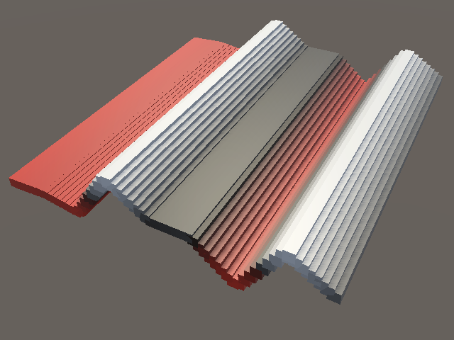

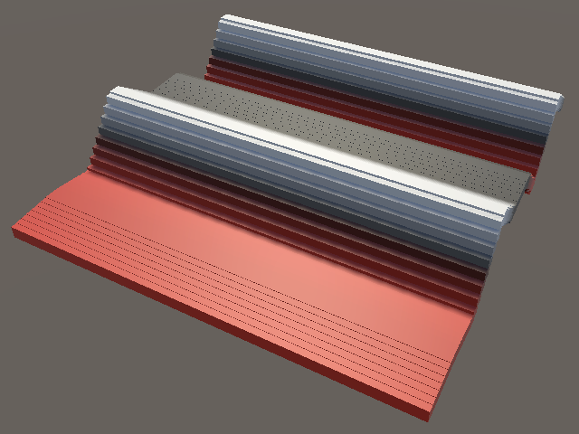

要让图案同时依赖 X 和 Z，就必须同时考虑两个维度，最终使用格点方格四个角上的哈希值。

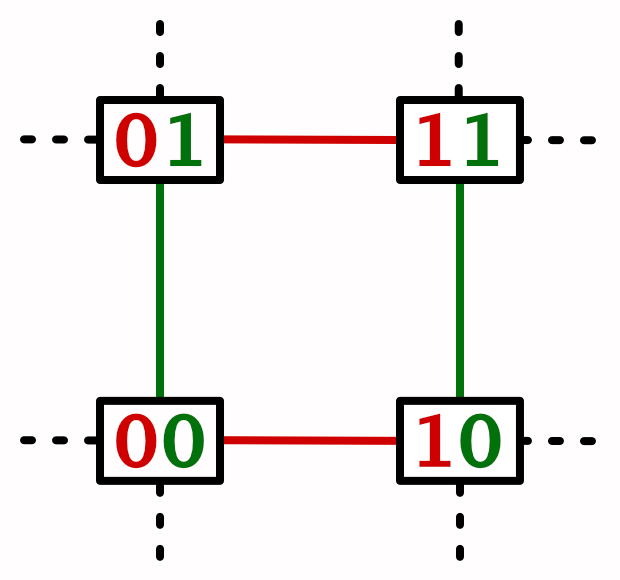

先计算 X 方向格点的哈希值，分别称为 `h0` 和 `h1`：

```csharp
LatticeSpan4
    x = GetLatticeSpan4(positions.c0),
    z = GetLatticeSpan4(positions.c2);

SmallXXHash4 h0 = hash.Eat(x.p0), h1 = hash.Eat(x.p1);
```

然后把 Z 方向的格点坐标传给 `h0`，而不是原始哈希状态：

```csharp
return lerp(
    h0.Eat(z.p0).Floats01A, h0.Eat(z.p1).Floats01A, z.t
) * 2f - 1f;
```

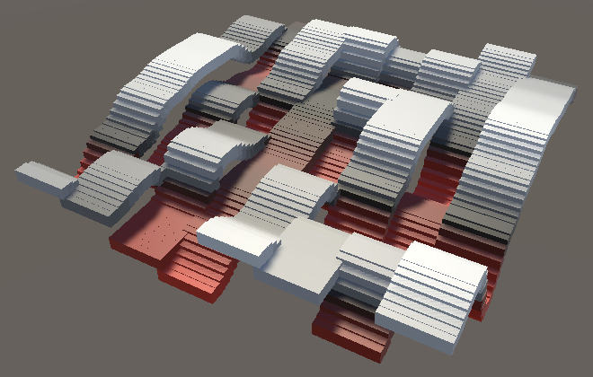

现在噪声由一个 X 格点和两个 Z 格点的插值共同决定，因此沿 Z 方向是连续的，但沿 X 方向仍不连续。要补全图案，还必须沿 X 方向在 `h0` 与 `h1` 两条带之间进行插值。也就是说，要把两个线性插值再做一次线性插值，这称为双线性插值：

```csharp
return lerp(
    lerp(h0.Eat(z.p0).Floats01A, h0.Eat(z.p1).Floats01A, z.t),
    lerp(h1.Eat(z.p0).Floats01A, h1.Eat(z.p1).Floats01A, z.t),
    x.t
) * 2f - 1f;
```

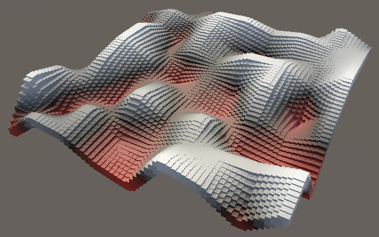

### 平滑噪声

虽然现在已经有连续的二维图案，但它还不平滑。格点之间的过渡由直线段构成，因此经过格点方格的边缘时，方向会突然改变。要让过渡平滑，就需要考虑噪声变化的速率。给定一个函数，它的一阶导数函数描述该函数的变化率。由于线性插值产生直线，其导数是一个常数。

还可以再求一次导数，得到二阶导数，也就是一阶导数的导数。可以把它看作曲率变化的速率，或者加速度。在这里，二阶导数始终为零。

例如，下图中的 1D 噪声以黑色实线表示，一阶导数以橙色虚线表示，二阶导数以紫色点线表示。为了让它们更容易观察，导数都除以 6 缩小了。注意中间格点处的橙色曲线不连续：噪声在这里突然改变方向。

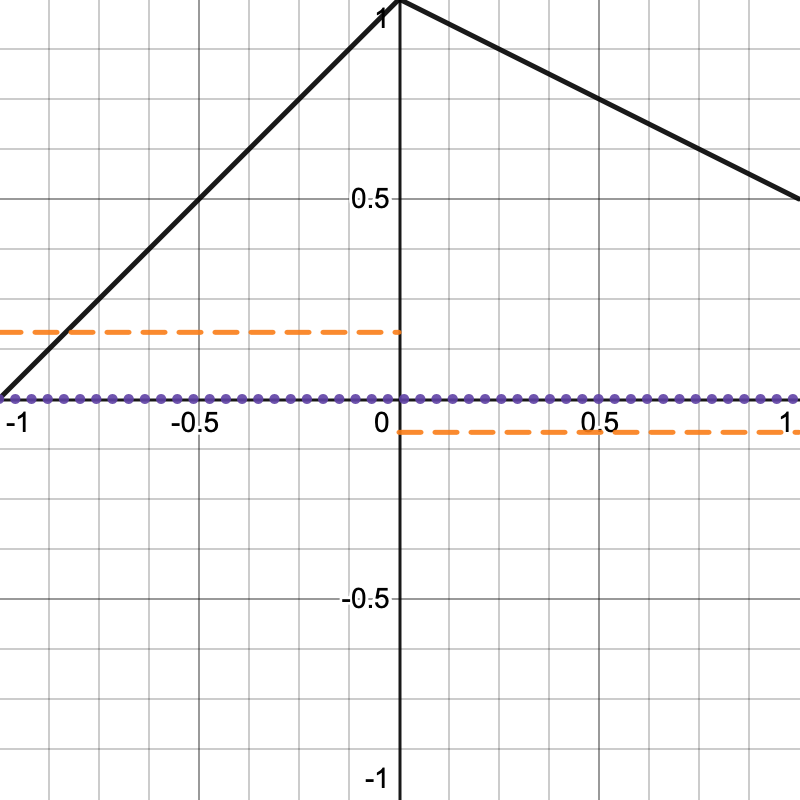

可以对 `GetLatticeSpan4` 中的插值因子应用 `smoothstep` 函数来平滑曲线：

```csharp
span.t = coordinates - points;
span.t = smoothstep(0f, 1f, span.t);
```

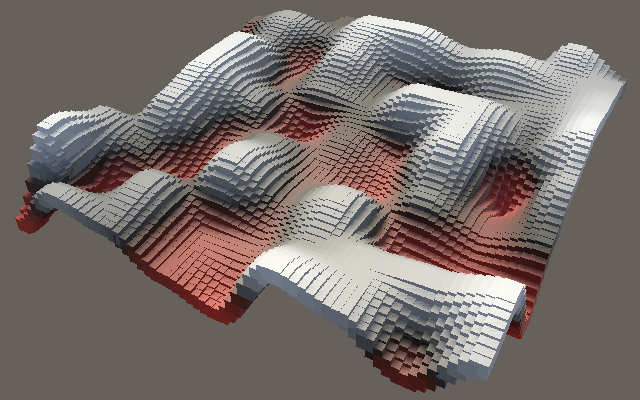

这样做有效，是因为 `smoothstep` 函数 `3t² − 2t³` 在输入为 0 和 1 时是水平的。因此它的一阶导数 `6t − 6t²` 在两端都为零。这个函数称为 C1 连续；原来的线性插值只有 C0 连续。不过，`smoothstep` 的二阶导数 `6 − 12t` 并不连续，因此它不是 C2 连续。

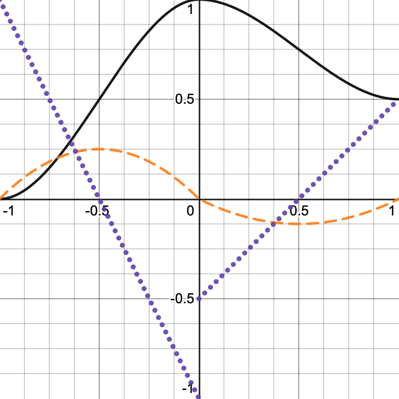

### 如何求函数的导数？

这里需要用到的规则只有这些：`axᵇ` 的导数是 `abx⁽ᵇ⁻¹⁾`，其中 `a` 和 `b` 是常数；常数的导数为零。函数各项可以分别求导。例如，`4x³ + 5x − 2` 的导数是 `12x² + 5`。

### 二阶连续性

虽然 `smoothstep` 达到了 C1 连续，但它的导数并不连续。这意味着格点边缘两侧的变化率可能不同。对于基于点的可视化，这通常不太明显；但如果用噪声定义平滑网格表面或法线贴图，这种不连续就可能显示成折痕，让人看出格点结构。

要避免这个问题，我们需要进一步使用 C2 连续函数：

```text
6t⁵ − 15t⁴ + 10t³
```

它的一阶导数是 `30t⁴ − 60t³ + 30t²`，二阶导数是 `120t³ − 180t² + 60t`。两种导数在输入为 0 和 1 时都等于零。

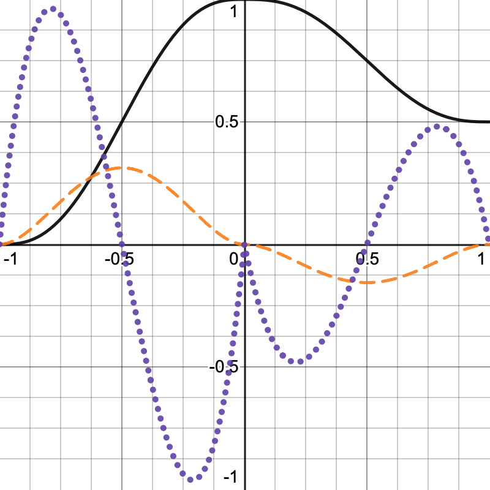

修改 `GetLatticeSpan4`，让它使用这个函数。可以将其写成 `t * t * t * (t * (t * 6 - 15) + 10)`：

```csharp
span.t = coordinates - points;
span.t = span.t * span.t * span.t *
    (span.t * (span.t * 6f - 15f) + 10f);
```

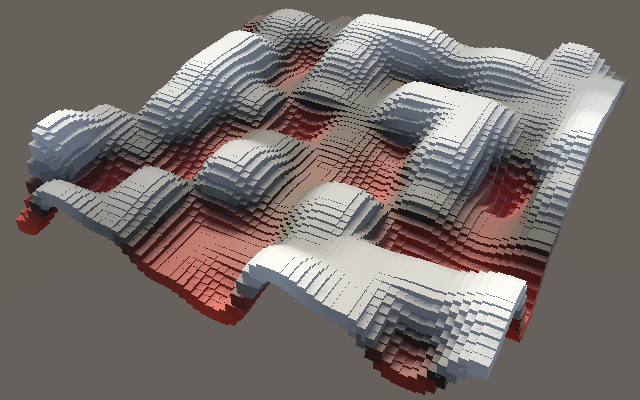

### 三维噪声

最后加入值噪声的三维版本。

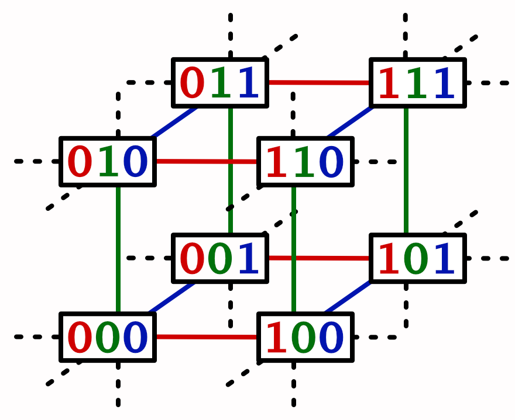

复制 `Lattice2D` 并创建 `Lattice3D`，再让它取得 Y 坐标的格点跨度。同时，保存 XY 格点方形四个顶点的哈希值：

```csharp
public struct Lattice3D : INoise {

    public float4 GetNoise4 (float4x3 positions, SmallXXHash4 hash) {
        LatticeSpan4
            x = GetLatticeSpan4(positions.c0),
            y = GetLatticeSpan4(positions.c1),
            z = GetLatticeSpan4(positions.c2);

        SmallXXHash4
            h0 = hash.Eat(x.p0), h1 = hash.Eat(x.p1),
            h00 = h0.Eat(y.p0), h01 = h0.Eat(y.p1),
            h10 = h1.Eat(y.p0), h11 = h1.Eat(y.p1);

        return lerp(…) * 2f - 1f;
    }
}
```

接着调整结果，让它在 X 方向上对两个 YZ 格点方形进行插值：

```csharp
return lerp(
    lerp(
        lerp(h00.Eat(z.p0).Floats01A, h00.Eat(z.p1).Floats01A, z.t),
        lerp(h01.Eat(z.p0).Floats01A, h01.Eat(z.p1).Floats01A, z.t),
        y.t
    ),
    lerp(
        lerp(h10.Eat(z.p0).Floats01A, h10.Eat(z.p1).Floats01A, z.t),
        lerp(h11.Eat(z.p0).Floats01A, h11.Eat(z.p1).Floats01A, z.t),
        y.t
    ),
    x.t
) * 2f - 1f;
```

最后，在 `NoiseVisualization` 中添加一个用于选择噪声维度的滑块，并用静态数组选择正确版本：

```csharp
static ScheduleDelegate[] noiseJobs = {
    Job<Lattice1D>.ScheduleParallel,
    Job<Lattice2D>.ScheduleParallel,
    Job<Lattice3D>.ScheduleParallel
};

[SerializeField, Range(1, 3)]
int dimensions = 3;

protected override void UpdateVisualization (
    NativeArray<float3x4> positions, int resolution, JobHandle handle
) {
    noiseJobs[dimensions - 1](
        positions, noise, seed, domain, resolution, handle
    ).Complete();
    noiseBuffer.SetData(noise.Reinterpret<float>(4 * 4));
}
```

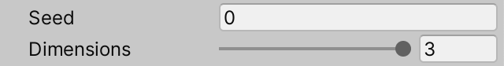

现在可以快速观察不同版本噪声之间的差异。使用球体这类三维形状时，区别最明显。

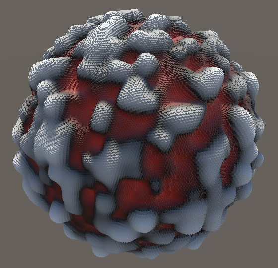

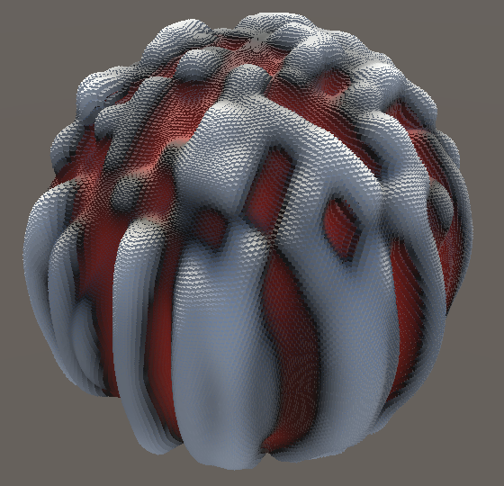

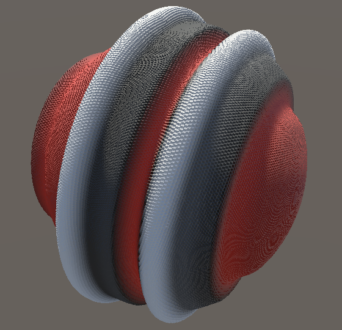

球体对比图从左到右展示 3D、2D、1D 噪声；噪声域缩放为 16。

下一篇教程是[柏林噪声（Perlin Noise）](https://catlikecoding.com/unity/tutorials/pseudorandom-noise/perlin-noise/)。

## 许可与署名

本文件是 Jasper Flick（Catlike Coding）教程《[Value Noise](https://catlikecoding.com/unity/tutorials/pseudorandom-noise/value-noise/)》的中文翻译，文字经翻译与排版调整，图片取自原教程并保存在 `images/value-noise/`。原教程采用 [CC BY-NC-SA 4.0](https://creativecommons.org/licenses/by-nc-sa/4.0/) 许可。本译文按相同许可分享：使用时请注明作者与来源，仅作非商业用途，并以相同许可发布改编内容。
