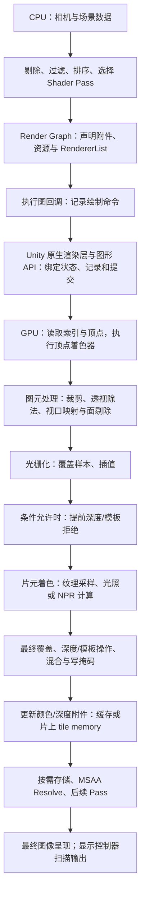

# 独立知识卡片 01：一次 Draw Call 的完整执行链路

> **Draw Call 是一条“使用当前管线状态与资源，处理指定几何范围”的绘制命令。它可以产生大量 GPU 工作，也可能最终不改变任何颜色样本。Unity 准备绘制、CPU 提交命令、GPU 执行、渲染目标更新和屏幕显示，是不同的时刻。**

本卡面向希望从 GPU 原理贯通 Unity 渲染、进而开发 **NPR（Non-Photorealistic Rendering，非真实感渲染）** 效果的读者。默认读者知道 Mesh、Material、Camera 的基本用途；涉及的新概念均在文内解释。

## 1. 范围、版本与证据边界

主线选择：**URP Forward 路径，Render Graph 开启，一台相机、一个普通 MeshRenderer、一个子网格、一个不透明前向 Shader Pass、一个实例，使用传统顶点/片元光栅化。** 主线先关闭 GPU Resident Drawer、GPU Instancing、静态/动态合批、Depth Priming 和 MSAA，后文再解释这些机制会改变什么。SRP Batcher 可以开启。

| 资料 | 本卡核实的版本 | 用途与限制 |
| --- | --- | --- |
| 用户提供的本地官方文档 | Unity **6.7 Beta / 6000.7**；页面构建日期 **2026-06-26**，job ID `70640455` | 说明 API 语义、Render Graph、Pass 标签和调试工具；不把 Beta 文档当作最终发布规范 |
| Unity Graphics | `6000.0/staging` 分支快照，提交 `275a7f9ad9330e3cf7f3ea57a0b242a551fde291`；URP **17.0.4** | 提供可复核的 C# / HLSL 实例；**不声称这就是 Unity 6.7 的逐行源码** |
| Unity Toon Shader | 提交 `1520a78a95292cb045f1edb4d60ea0dba2f213b3`；**0.15.1-preview** | 核对实际前向与描边 Pass 结构；不声称已验证它与本地 6.7 的完整兼容性 |
| GPU/API 资料 | Microsoft Direct3D 文档、Arm GPU 架构资料 | Direct3D 解释 API 语义，Arm 解释分块渲染；不将单一架构细节推广为所有 GPU 的保证 |

本卡区分**公开源码事实、文档/API 保证、架构解释与工程推断**。Graphics 仓库包含 SRP 的公开实现，但不包含足以追踪全部 Unity 原生 C++ 渲染后端、驱动及 GPU 微码的完整源码。进入该边界后，本文只解释可公开核查的语义，不杜撰原生函数调用栈。

版本证据：[URP package.json](https://github.com/Unity-Technologies/Graphics/blob/275a7f9ad9330e3cf7f3ea57a0b242a551fde291/Packages/com.unity.render-pipelines.universal/package.json)、[Toon Shader package.json](https://github.com/Unity-Technologies/com.unity.toonshader/blob/1520a78a95292cb045f1edb4d60ea0dba2f213b3/com.unity.toonshader/package.json)。本地文档索引见文末。

## 2. 先分清“一个”的计数单位

| 概念 | 指什么 | 与 Draw Call 的关系 |
| --- | --- | --- |
| GameObject / Renderer | 场景对象及其渲染组件 | 一个对象可因子网格、阴影、描边、深度预通道和多相机参与多次绘制 |
| 子网格 SubMesh | Mesh 中的一段拓扑/索引范围，通常对应一个材质槽 | 主线中一次 Draw 读取一个子网格的索引范围 |
| ShaderLab Pass | 一组 Shader 程序和渲染状态，例如 `ForwardLit` | 声明了 Pass 不代表本帧必定调用；要由管线选择和调度 |
| ScriptableRenderPass / Render Graph Pass | 引擎层的一段渲染工作及资源使用声明 | 可以包含很多 Draw，也可以只做复制或计算 |
| RendererList | 按剔除结果、过滤条件和绘制设置描述的一组绘制对象 | 一次 `DrawRendererList` 可以展开成多次 Draw |
| Native Render Pass | 图形 API 层围绕附件及其加载/存储的一组操作 | 可容纳多个 Draw；可由若干兼容的 Render Graph Pass 合并得到 |
| Draw Call | API/命令流中的一次绘制操作 | 实例化 Draw 可画多个实例；间接命令还有额外的计数层次 |
| Queue Submission | 向 GPU 队列提交一批命令 | 一次提交通常包含很多 Draw；并非每个 Draw 都提交一次队列 |

**SRP Batcher 主要降低连续 Draw 之间的 CPU 准备成本，并维持材质常量数据的持久性；它并不以把这些 Draw 合成一次为工作定义。** GPU Instancing 则可以在一个绘制命令中处理多个实例。两者不能只因为名称都涉及“批处理”就混为一谈。[本地文档 D1；在线同主题文档](https://docs.unity3d.com/6000.0/Documentation/Manual/SRPBatcher.html)

## 3. 从全局看执行链路

下面是**逻辑数据流**。GPU 会并行、交错和流水化执行；Early-Z 的实际位置也受条件限制。这不是每个三角形都依次独占硬件的时间表。



纯文本速读：**选谁画 → 选什么程序和状态 → 记录并提交 → 顶点变换 → 三角形变成覆盖样本 → 计算候选颜色 → 决定如何更新附件 → 后续合成与显示。**

### 3.1 最开始，数据在哪里？

绘制前，相关资源必须已经存在并可供 GPU 使用，或已经排入正确的上传/生产依赖：

| 资源 | 存放内容 | 本次 Draw 如何使用 |
| --- | --- | --- |
| Vertex Buffer，顶点缓冲 | 位置、法线、切线、UV 等顶点属性 | 根据布局、步长与索引读取属性 |
| Index Buffer，索引缓冲 | 16 位或 32 位顶点索引等 | 指定哪些顶点组成三角形 |
| Constant Buffer，常量缓冲 | 对象矩阵、相机参数、材质数值、光照参数 | 为 Shader 提供绘制参数 |
| Texture 与 Sampler | 图像数据；过滤、寻址等采样规则 | Shader 发出采样操作 |
| 已编译 Shader / 管线状态 | 程序及光栅、深度、混合等设置 | 决定 GPU 如何解释和处理数据 |
| Render Target / Depth Attachment | 颜色目标与深度/模板附件 | 接收结果，并提供已有颜色、深度或模板值 |

**Draw 不意味着把整套 Mesh 和贴图重新从 CPU 上传一遍。** 静态资源通常复用已有 GPU 资源；变化的数据按其更新机制处理。资源“绑定”与内容“上传”是两件事。Shader 编译/管线创建也不是每个 Draw 都必然重做；新变体或未准备好的管线状态可能引入首次使用开销。

“显存”在此泛指 GPU 可访问的资源存储。独立显卡常有独立 VRAM；统一内存设备可能与 CPU 共享物理内存，但依然有缓存、访问权限和同步规则。

## 4. Unity CPU 侧：如何形成绘制工作？

### 4.1 相机剔除只产生候选集，不是最终像素可见性

主线从相机矩阵、裁剪参数、Renderer 包围体等信息出发进行剔除，得到 `CullingResults`。视锥剔除判断对象是否可能与相机视野相交；遮挡剔除是否参与及其路径取决于配置。

之后还要依据 Layer、Render Queue、Shader Pass 支持情况等筛选。一个 Renderer 留在候选集合里，不代表它的所有三角形都会留下，也不代表它有任何片元最终通过深度测试。

三种“看不见”发生在不同层：

- **对象剔除**：可能连绘制工作都不生成。
- **图元裁剪/面剔除**：Draw 已经存在，某些三角形不产生覆盖。
- **深度/模板拒绝**：已经产生覆盖候选，但不更新相应的颜色样本。

### 4.2 过滤、排序与 Shader Pass 选择

URP 的 `DrawObjectsPass.InitRendererLists` 组合绘制设置与过滤设置。该快照中，普通前向对象使用的标签列表包含 `SRPDefaultUnlit`、`UniversalForward` 和 `UniversalForwardOnly`。不透明对象采用相机提供的排序策略，透明对象采用 `CommonTransparent`。[源码：DrawObjectsPass](https://github.com/Unity-Technologies/Graphics/blob/275a7f9ad9330e3cf7f3ea57a0b242a551fde291/Packages/com.unity.render-pipelines.universal/Runtime/Passes/DrawObjectsPass.cs#L202)

排序同时受正确性和状态切换成本影响，不能把不透明绘制概括为“绝对严格地逐三角形从近到远”。常规透明排序通常也不解决单个 Mesh 内任意相交三角形的正确顺序。

`Name "ForwardLit"` 是 Pass 名；`Tags { "LightMode" = "UniversalForward" }` 是管线选取它的重要标记。不能只写一个任意的 `Name "Outline"` 就认为管线会自动执行描边。也不能认为 Shader 文件中所有 Pass 都会按文本顺序全部执行。本地文档 D4 明确将 `SRPDefaultUnlit` 列为可用于额外描边 Pass 的标签。

### 4.3 Render Graph 的记录与执行

**记录阶段**声明：这个 Pass 使用哪个 RendererList、读哪些纹理、写哪些颜色/深度附件，并提供执行回调。此时调用 `AddRasterRenderPass` 不等于 GPU 已开始画。

**执行阶段**调用保留下来的 Pass 的回调，产生渲染命令。Render Graph 可根据已声明的依赖管理资源寿命、剔除允许剔除的无用 Pass，并在条件允许时合并原生 Render Pass、安排所需同步。它不会跨越依赖任意重排所有操作。[本地文档 D2、D3；在线概述](https://docs.unity3d.com/6000.0/Documentation/Manual/urp/render-graph-introduction.html)

下面抽出源码中的关键动作，**是流程伪代码，省略了参数、调试分支及资源声明，不是可直接运行的 Renderer Feature**：

```csharp
// 相机渲染：得到可用于后续绘制的剔除结果。
cullResults = context.Cull(ref cullingParameters);

// 记录 DrawObjectsPass：指定附件与对象列表。
builder = renderGraph.AddRasterRenderPass<PassData>(...);
builder.SetRenderAttachment(colorTarget, 0, AccessFlags.Write);
builder.SetRenderAttachmentDepth(depthTarget, AccessFlags.Write);
InitRendererLists(...);
builder.UseRendererList(passData.rendererListHdl);

// 注册回调；图执行时调用它，再由 ExecutePass 记录列表绘制。
builder.SetRenderFunc((data, graphContext) => ExecutePass(...));
// ExecutePass 内部的关键调用：
cmd.DrawRendererList(rendererList);

// 相机渲染流程稍后将计划的命令提交给 Unity 渲染循环。
context.Submit();
```

两个容易漏掉的实现细节：

1. **声明资源写入，不等于覆盖整个纹理。** 部分像素绘制、混合与附件加载/存储仍有独立语义。不能把这里的 `AccessFlags.Write` 读成“全屏每个像素都必定被重写”。
2. **ShaderLab 状态可能被管线覆盖。** 该版本在启用 Depth Priming 的相关不透明路径中设置 `DepthState(false, CompareFunction.Equal)`：颜色阶段复用预通道深度，关闭深度写并使用相等比较。只读 Shader 文件不足以断定抓帧时的最终状态。[源码：状态覆盖](https://github.com/Unity-Technologies/Graphics/blob/275a7f9ad9330e3cf7f3ea57a0b242a551fde291/Packages/com.unity.render-pipelines.universal/Runtime/Passes/DrawObjectsPass.cs#L218)

### 4.4 Submit 返回，不代表 GPU 已完成

本地 API 文档对 `ScriptableRenderContext.Submit` 的定义是：将所有已调度命令提交到渲染循环执行。它不是“阻塞到屏幕像素已经显示”的保证。

CPU 可以准备后续工作，GPU 同时消费此前提交的命令。Unity 的主线程、渲染线程、Graphics Jobs 与原生后端如何分工，随平台和设置变化。线程时间线上看到等待，也可能是在等待 GPU、帧节流或其他依赖，不能直接归因于 Shader 算术太多。

判断“GPU 确实做完某段工作”时，要看相应 fence、GPU 查询或同步机制；**绘制函数返回、命令提交、GPU 完成、显示扫描输出，不能互相替代。** [本地文档 D5；D3D12 命令记录](https://learn.microsoft.com/en-us/windows/win32/direct3d12/recording-command-lists-and-bundles)

## 5. 从 Unity 原生层到 GPU 命令流

以 D3D12 为语义示例，后端需要使以下状态与资源就绪：

- **PSO（Pipeline State Object）**：Shader 程序、输入布局、光栅状态、深度/模板状态、混合状态，以及相关目标格式与采样配置。
- **动态绑定与状态**：顶点/索引缓冲、常量与纹理资源、颜色/深度目标、视口、裁剪矩形等。
- **资源依赖与同步**：例如一张图像上一阶段作为目标写入、下一阶段作为 Shader 资源读取，必须满足对应的访问和可见性要求。

这些不是每次 Draw 都必须重新创建的对象。后端可复用状态，并只处理必要的变化。资源屏障也不是“每次绘制都让 CPU 等 GPU”的同义词。[D3D12 管线状态](https://learn.microsoft.com/en-us/windows/win32/direct3d12/managing-graphics-pipeline-state-in-direct3d-12)

```cpp
// D3D12 API 示例，不是 Unity 原生后端源码摘录。
commandList->DrawIndexedInstanced(
    indexCount,     // 本实例读取多少个索引
    1,              // 实例数为 1
    startIndex,     // 从索引缓冲的哪一项开始
    baseVertex,     // 给读出的索引增加的顶点偏移
    0               // 起始实例位置
);
```

Triangle List 拓扑下，`indexCount = 3000` 表示提交 1000 个三角形；不代表 3000 个独立顶点，更不代表着色 1000 个像素。此调用只指定绘制范围；Shader、纹理和目标由已绑定状态决定。命令记录完成后，D3D12 用 `ExecuteCommandLists` 将命令列表提交到队列。[绘制 API](https://learn.microsoft.com/en-us/windows/win32/api/d3d12/nf-d3d12-id3d12graphicscommandlist-drawindexedinstanced)、[队列提交 API](https://learn.microsoft.com/en-us/windows/win32/api/d3d12/nf-d3d12-id3d12commandqueue-executecommandlists)

Vulkan、Metal、D3D11 的命令与状态模型不完全相同。上述资料能证明绘制、绑定与提交处于不同层次，不能证明 Unity 在所有平台都会逐项调用这些 D3D12 API。

## 6. GPU 几何阶段：从缓冲到屏幕三角形

### 6.1 顶点读取与执行单元

索引与顶点读取逻辑依据拓扑、索引范围、顶点布局及实例参数取得属性。输入组装是 API 的逻辑阶段名，不保证每代硬件都有完全独立的同名物理单元。

顶点着色器 **VS（Vertex Shader）** 对顶点执行模型变换、顶点动画或描边外扩等程序。索引重复使用可带来顶点结果复用机会，但缓存及其作用范围取决于实现。因此不能由 `indexCount` 精确推断 VS 调用数，也不能保证每个唯一顶点只执行一次。

现代 GPU 通常由统一的可编程执行单元承载顶点、片元和计算工作，按 wave/warp 等线程组调度，并非三种 Shader 永久各自独占一套核心。固定功能逻辑负责覆盖生成、混合等工作，具体分工随架构变化。[Microsoft 渲染流水线](https://learn.microsoft.com/en-us/windows-hardware/drivers/display/rendering-pipeline)

### 6.2 VS 输出齐次裁剪坐标

采用列向量记法：

\[
\mathbf p_{clip}=P\,V\,M\begin{bmatrix}\mathbf p_{object}\\1\end{bmatrix}
\]

`M` 把物体空间变为世界空间，`V` 变为观察空间，`P` 变为裁剪空间。VS 的 `SV_POSITION` 输出是四维 `(x_c,y_c,z_c,w_c)`，还不是像素坐标。`TransformObjectToHClip` 封装相应变换。不要提前除以 `w` 后再把结果当作普通裁剪坐标输出，否则会改变裁剪与插值所需的信息。[源码：位置变换](https://github.com/Unity-Technologies/Graphics/blob/275a7f9ad9330e3cf7f3ea57a0b242a551fde291/Packages/com.unity.render-pipelines.core/ShaderLibrary/SpaceTransforms.hlsl#L108)

非均匀缩放下，法线满足：

\[
\mathbf n_{world}=\operatorname{normalize}\big((M_{3\times3}^{-1})^T\mathbf n_{object}\big)
\]

法线不能一般性地直接乘物体矩阵的三阶部分。`TransformObjectToWorldNormal` 在相应路径中使用逆转置关系；明确假定统一缩放时可采用简化路径。NPR 的明暗分界对法线尤其敏感。[源码：法线变换](https://github.com/Unity-Technologies/Graphics/blob/275a7f9ad9330e3cf7f3ea57a0b242a551fde291/Packages/com.unity.render-pipelines.core/ShaderLibrary/SpaceTransforms.hlsl#L199)

### 6.3 裁剪、透视除法与面剔除

图元跨越裁剪边界时可能被切成新的图元；完全在边界外则可被丢弃。透视除法得到归一化设备坐标 **NDC**：

\[
\mathbf p_{ndc}=\mathbf p_{clip}.xyz/w_c
\]

视口变换再将其映射到目标中的屏幕区域。不同 API 的深度范围、Y 方向、目标翻转及 Unity 的 Reversed-Z 约定需要分别处理。

背面剔除依据图元绕序及正反面配置，**不是点乘顶点法线与视线来判定背面**。`Cull Front` 是反壳描边的重要状态，但实际正反面还受变换与管线约定影响。[Direct3D 光栅阶段](https://learn.microsoft.com/en-us/windows/win32/direct3d11/d3d10-graphics-programming-guide-rasterizer-stage)

## 7. 光栅化与片元着色：从覆盖到候选颜色

### 7.1 四种不同的计数

| 名词 | 含义 |
| --- | --- |
| Pixel，像素 | 图像网格中的一个位置 |
| Sample，样本 | 像素内的覆盖/深度/颜色采样位置；MSAA 下每像素有多个样本 |
| Fragment，片元 | 图元在屏幕局部产生的候选覆盖及插值数据；API 间术语细节有差异 |
| Shader invocation | 一次着色器调用；与最终像素数或样本数不必一一对应 |

同一像素可以被多个三角形、物体和 Pass 覆盖。常规 MSAA 可以用一次像素频率着色结果服务多个已覆盖样本，样本频率着色等配置则会改变调用数。所以“4×MSAA 恒等于四倍片元 Shader”不成立。

### 7.2 插值不是简单平均

对于普通透视校正属性，设屏幕重心坐标为 `λᵢ`，三个顶点属性为 `aᵢ`，裁剪坐标第四分量为 `wᵢ`：

\[
a=\frac{\sum_{i=0}^{2}\lambda_i(a_i/w_i)}{\sum_{i=0}^{2}\lambda_i(1/w_i)}
\]

这解释了倾斜表面的 UV 为何需要透视校正。`nointerpolation`、`noperspective`、`centroid`、`sample` 等修饰会改变规则；也不能将上式直接套为硬件深度插值规则。插值后的法线通常需要重新归一化，否则 `dot(N,L)` 阈值会随法线长度漂移。

### 7.3 NPR 着色发生在哪里？

片元着色器 **FS（Fragment Shader）**，在 Direct3D 中常称 **PS（Pixel Shader）**，用插值数据、常量及资源计算输出。最小的两段明暗可以写成：

\[
x=\operatorname{saturate}(\mathbf N\cdot\mathbf L),\quad
C=\operatorname{lerp}(C_{shade},C_{lit},\operatorname{step}(t,x))
\]

`N` 与 `L` 必须处在同一坐标空间并单位化，`L` 指向光源，`t` 控制分界。Ramp、面部 SDF、MatCap 和高光遮罩是在这里增加输入与决策。

只替换主体光照函数不必增加 Draw；增加一个实际执行的几何 Pass 则需要额外绘制该几何。不过更复杂的函数仍可能增加指令、寄存器和采样成本。这是从执行模型得出的工程结论。

### 7.4 纹理采样与 2×2 quad

采样使用 UV、Sampler 和 LOD，经地址计算、缓存、过滤得到纹理结果。一次 HLSL 采样不等于一次固定大小的外部显存读取；Mip、过滤、压缩和缓存命中都会改变成本。

常见像素着色模型以 **2×2 quad** 支持梯度估计，隐式 LOD 使用屏幕导数。某些不产生可见结果的 **helper lanes** 仍要执行以提供梯度，输出会被丢弃。wave 可以包含多个 quad；不能假定所有 GPU 的 wave 都有 32 个线程。[HLSL wave、quad 与 helper lane](https://learn.microsoft.com/en-us/windows/win32/direct3dhlsl/hlsl-shader-model-6-0-features-for-direct3d-12)

因此细碎三角形、细线不能只按最终覆盖面积估计成本。NPR 硬阈值也可能闪烁；按视觉目标用 `fwidth` 估计阈值的像素内变化，可以帮助抗锯齿，但要权衡线条锐度。

## 8. 深度、模板、混合与“写入像素”

### 8.1 Early-Z：提前拒绝不等于提前写深度

深度测试比较候选深度与已有深度；模板测试比较模板值与参考值。如果能保证程序语义，GPU 可在着色前进行部分深度/模板判断，拒绝不可能贡献颜色的工作。层次化深度还可能按块拒绝。

必须分别考虑：**提前测试、提前拒绝、深度/模板更新时机、片元程序是否必须执行。**

- 普通不透明、不改写深度、没有需要保留的副作用，通常更利于提前拒绝。
- `clip` / `discard` 影响覆盖与更新时机；不等于所有提前深度拒绝能力都必然消失。
- 写 `SV_Depth` 可能让原本插值深度不足以提前定论；保守深度声明及硬件能力可能提供例外。
- UAV 等可见写入副作用限制跳过 Shader 的合法性；强制早期测试属性也有自己的语义，不能当作无条件提速注解。
- 透明混合不会自动关闭深度测试。`ZWrite Off` 只控制深度写，不能代替 `ZTest`。[早期深度测试语义](https://learn.microsoft.com/en-us/windows/win32/direct3dhlsl/sm5-attributes-earlydepthstencil)；本地文档 D6。

Reversed-Z 平台中，“近处深度更小”不是原始数值的通用描述。ShaderLab 比较意图与抓帧显示的原生比较操作，要结合 Unity 平台映射理解。原始深度、线性观察空间深度和世界距离也不能混用。

### 8.2 输出仍可能不改变颜色

覆盖掩码、深度/模板失败、`discard`、`ColorMask 0`、没有颜色附件等因素，都可能阻止颜色更新。模板测试失败还可能按 `Fail` / `ZFail` 等配置更新模板，所以没有颜色输出也不等于没有资源变化。

深度更新由绑定附件、深度测试/写状态及覆盖共同决定。深度预通道可以更新深度而不产生颜色；透明 Pass 可以改变颜色却不写深度。

### 8.3 输出合并决定怎样更新目标

**Output Merger / ROP** 是理解深度、模板、混合与写掩码的常用逻辑模型，物理单元命名和职责随厂商变化。`Blend Off` 时，成功样本的颜色来自 Shader 输出，并遵守目标格式与写掩码。

非预乘透明在 `Blend SrcAlpha OneMinusSrcAlpha` 且 RGB 加法混合时：

\[
C_{out}=\alpha_s C_s+(1-\alpha_s)C_d
\]

`C_s` 是本次输出，`C_d` 是目标已有颜色。Alpha 通道可以使用独立因子。透明混合通常与顺序有关；只返回 `alpha=0.5`、却保持 `Blend Off`，不会自动半透明。

sRGB 渲染目标的相应硬件路径在混合前将目标颜色解码到线性域，混合后再编码存储。浮点 HDR 目标、项目色彩空间及后处理又有各自配置，Shader 数值不等于最终屏幕色值。[Direct3D 输出合并](https://learn.microsoft.com/en-us/windows/win32/direct3d11/d3d10-graphics-programming-guide-output-merger-stage)

### 8.4 更新附件，不保证立即写外部 DRAM

GPU 用缓存、压缩与合并写入减少流量。以 Arm 分块渲染为例，几何被分配到屏幕 tile；处理 tile 时，颜色、深度/模板与混合结果可保存在片上 **tile memory**，需要保留时再存到外部内存。如果深度只用于该原生 Pass，甚至可以不存回外部内存。[Arm：Tile-based rendering](https://developer.arm.com/community/arm-community-blogs/b/mobile-graphics-and-gaming-blog/posts/the-mali-gpu-an-abstract-machine-part-2---tile-based-rendering)

因此，PS 执行一次不等于外部 DRAM 写一次像素；合并原生 Pass 可能减少附件流量，但不等于减少其中的 Draw。**分块延迟渲染 TBDR 也不等于 URP 的 Deferred Shading/GBuffer 路径**：分块 GPU 完全可以执行 URP Forward。

本地 D2 用简化的 CPU/GPU 措辞描述 tile memory 收益。硬件上的准确解释应落在片上附件与外部内存流量，而不应读成常规每个 Pass 都在做 CPU 像素读回。

### 8.5 渲染目标不一定是屏幕

当前 Draw 可能写相机中间纹理、阴影图、深度目标或 GBuffer。MSAA Resolve 将多样本目标转换为单样本结果，和把 tile 数据存回外部内存是两个概念。后面还可能有透明物体、后处理、色调映射、UI 和相机合成，最终图像再进入呈现与显示流程。

本次 Draw 更新的颜色还可能被后来绘制覆盖。**返回 `SV_Target` 只完成了当前 Shader 的候选输出，不是显示链路终点。**

## 9. 最小 NPR Shader：把链路落到一段代码

下面是一个完整 ShaderLab 示例，用一张颜色贴图和主方向光生成可调的两段明暗。保存为 `.shader` 后，在 URP Forward 场景中新建使用它的材质，赋给有 UV 和法线的 Sphere，添加一盏方向光。

**验证状态：本卡已对照所引用的 URP/Core RP 函数与 Pass 结构进行静态核对，未在 Unity 中编译或实机抓帧。** 示例包含必要的 Shader 结构，但不是完整生产材质：它只实现主体前向 Pass，不投射/接收实时阴影，不生成专门的 DepthNormals/MotionVectors Pass，也不支持该示例未声明的实例化路径。实验时关闭 Depth Priming、SSAO、额外 Renderer Feature、后处理与 MSAA，使观察变量最少。

```hlsl
Shader "KnowledgeCards/MinimalToon"
{
    Properties
    {
        _BaseMap("Base Map", 2D) = "white" {}
        _LitColor("Lit Color", Color) = (1, 0.8, 0.65, 1)
        _ShadeColor("Shade Color", Color) = (0.25, 0.16, 0.3, 1)
        _Threshold("Threshold", Range(0, 1)) = 0.5
        _Softness("Softness", Range(0.001, 0.2)) = 0.02
    }

    SubShader
    {
        Tags
        {
            "RenderPipeline" = "UniversalPipeline"
            "RenderType" = "Opaque"
            "Queue" = "Geometry"
        }

        Pass
        {
            Name "ForwardToon"
            Tags { "LightMode" = "UniversalForward" }
            Cull Back
            ZTest LEqual
            ZWrite On
            Blend Off

            HLSLPROGRAM
            #pragma target 3.0
            #pragma vertex Vert
            #pragma fragment Frag

            #include "Packages/com.unity.render-pipelines.universal/ShaderLibrary/Core.hlsl"
            #include "Packages/com.unity.render-pipelines.universal/ShaderLibrary/Lighting.hlsl"

            TEXTURE2D(_BaseMap);
            SAMPLER(sampler_BaseMap);

            CBUFFER_START(UnityPerMaterial)
                float4 _BaseMap_ST;
                half4 _LitColor;
                half4 _ShadeColor;
                float _Threshold;
                float _Softness;
            CBUFFER_END

            struct Attributes
            {
                float3 positionOS : POSITION;
                float3 normalOS : NORMAL;
                float2 uv : TEXCOORD0;
            };

            struct Varyings
            {
                float4 positionCS : SV_POSITION;
                float3 normalWS : TEXCOORD0;
                float2 uv : TEXCOORD1;
            };

            Varyings Vert(Attributes input)
            {
                Varyings output;
                output.positionCS = TransformObjectToHClip(input.positionOS);
                output.normalWS = TransformObjectToWorldNormal(input.normalOS);
                output.uv = TRANSFORM_TEX(input.uv, _BaseMap);
                return output;
            }

            half4 Frag(Varyings input) : SV_Target
            {
                half3 normalWS = normalize(input.normalWS);
                Light mainLight = GetMainLight();
                half ndl = saturate(dot(normalWS, mainLight.direction));
                float width = max(_Softness, 0.0001);
                half band = smoothstep(_Threshold - width,
                                       _Threshold + width, ndl);

                half3 albedo = SAMPLE_TEXTURE2D(
                    _BaseMap, sampler_BaseMap, input.uv).rgb;
                half3 toonColor = lerp(_ShadeColor.rgb, _LitColor.rgb, band);
                return half4(albedo * toonColor * mainLight.color, 1.0h);
            }
            ENDHLSL
        }
    }
}
```

这段代码对应的职责划分：

| 代码位置 | 链路中的职责 |
| --- | --- |
| `Attributes` 的语义 | 声明如何读取 Mesh 顶点属性，不等于在此上传 Mesh |
| `UnityPerMaterial` | 组织材质常量；相机/对象等内置数据由所包含的库与管线提供 |
| `Vert` | 顶点位置变换、法线变换以及输出待插值属性 |
| VS 返回与 `Frag` 之间 | 硬件图元处理、覆盖生成与插值，不是 HLSL 中缺少了一段手写循环 |
| `SAMPLE_TEXTURE2D` | 纹理采样路径；UV 导数参与隐式 LOD |
| `smoothstep` 与 `lerp` | 本示例的艺术化明暗决策 |
| `SV_Target` | 给当前颜色输出槽提供候选颜色 |
| `Cull / ZTest / ZWrite / Blend` | 控制相关固定功能行为；还需检查管线是否覆盖了这些状态 |

这里的暗部颜色也乘以主光颜色，是为明确演示数据流而选择的模型；它不是所有 NPR 都应采用的合成规则。后续可以将环境底色、直接光、投射阴影和作者色板分开设计。

## 10. Unity Toon Shader 怎样改变这条链路？

所检查的 `UnityToon.shader` 的 URP SubShader 中，主体 `ForwardLit` 使用 `UniversalForward`，描边 `Outline` 使用 `SRPDefaultUnlit`。描边包含 `UniversalToonOutline.hlsl`，顶点阶段有外扩分支，配合可配置的 Cull、颜色掩码与模板状态。[源码：主体 Pass](https://github.com/Unity-Technologies/com.unity.toonshader/blob/1520a78a95292cb045f1edb4d60ea0dba2f213b3/com.unity.toonshader/Runtime/Shaders/UnityToon.shader#L1067)、[源码：描边 Pass](https://github.com/Unity-Technologies/com.unity.toonshader/blob/1520a78a95292cb045f1edb4d60ea0dba2f213b3/com.unity.toonshader/Runtime/Shaders/UnityToon.shader#L1158)、[源码：描边顶点处理](https://github.com/Unity-Technologies/com.unity.toonshader/blob/1520a78a95292cb045f1edb4d60ea0dba2f213b3/com.unity.toonshader/Runtime/Shaders/URP/UniversalToonOutline.hlsl#L24)

不要把下面的简化计数当作任意场景的保证。**假设一个子网格、单实例、无合批，两种 Pass 均启用且实际被相机调度，另外只参与一张阴影视图：**

| 用途 | 示例中的绘制数 | 主要新增工作 |
| --- | --- | --- |
| 主体前向 | 1 | 几何、主体着色和相机颜色/深度输出 |
| 反壳描边 | 1 | 再次处理几何、外扩、覆盖与描边输出 |
| 单个阴影视图的 ShadowCaster | 1 | 从光源视角绘制深度，必要时做透明裁剪 |
| 示例合计 | 3 | 还没有计入额外深度、法线、运动矢量、相机或阴影视图 |

多级联阴影、多光源、多材质、多相机和额外预通道会改变次数；剔除、Pass 禁用或批处理也会改变结果。一盏额外光也不必在 URP Forward/Forward+ 中对应一次额外物体 Draw，不能套用 Built-in ForwardAdd 的计数模型。

从链路出发选择 NPR 方法：

- **反壳描边**改变顶点和面剔除，需再次处理几何，并处理法线接缝、宽度与深度关系。
- **屏幕空间描边**读取已有深度、法线或 ID，再执行屏幕操作；成本与分辨率、采样及输入纹理生产有关。
- **面部 SDF / Ramp**主要改变片元输入和着色决策；先检查坐标、采样与色阶，再讨论是否需要新增 Pass。
- **头发透明/裁剪**改变覆盖、混合与排序关系，也会改变早期拒绝机会。
- **多 Pass 顶点变形或溶解**必须检查主体、阴影、深度/法线、运动矢量之间的一致性，否则辅助纹理会与可见表面脱节。

以上是由各机制推导的工程选择，不是“某种描边必然比另一种快”的硬件实测结论。

## 11. 可核查的源码阅读路径

按表中的符号定位即可；行号是当前固定提交的辅助导航。

| 顺序 | 入口与文件 | 要回答的问题 |
| --- | --- | --- |
| 1 | [`UniversalRenderPipeline.RenderSingleCamera`](https://github.com/Unity-Technologies/Graphics/blob/275a7f9ad9330e3cf7f3ea57a0b242a551fde291/Packages/com.unity.render-pipelines.universal/Runtime/UniversalRenderPipeline.cs#L714) | 在哪里剔除？何时选择 Render Graph / 兼容路径？何时 Submit？ |
| 2 | [`UniversalRendererRenderGraph.cs`](https://github.com/Unity-Technologies/Graphics/blob/275a7f9ad9330e3cf7f3ea57a0b242a551fde291/Packages/com.unity.render-pipelines.universal/Runtime/UniversalRendererRenderGraph.cs#L1303) | Forward 与 Deferred 分支分别安排哪类对象绘制？ |
| 3 | [`DrawObjectsPass.Render`](https://github.com/Unity-Technologies/Graphics/blob/275a7f9ad9330e3cf7f3ea57a0b242a551fde291/Packages/com.unity.render-pipelines.universal/Runtime/Passes/DrawObjectsPass.cs#L256) | 怎样声明附件、列表及执行回调？ |
| 4 | [`RenderingUtils.CreateRendererListWithRenderStateBlock`](https://github.com/Unity-Technologies/Graphics/blob/275a7f9ad9330e3cf7f3ea57a0b242a551fde291/Packages/com.unity.render-pipelines.universal/Runtime/RenderingUtils.cs#L390) | 剔除结果、绘制设置、过滤与状态怎样进入列表参数？ |
| 5 | [`DrawObjectsPass.ExecutePass`](https://github.com/Unity-Technologies/Graphics/blob/275a7f9ad9330e3cf7f3ea57a0b242a551fde291/Packages/com.unity.render-pipelines.universal/Runtime/Passes/DrawObjectsPass.cs#L126) | 最终在哪里调用 `DrawRendererList`？ |
| 6 | [`Lit.shader / ForwardLit`](https://github.com/Unity-Technologies/Graphics/blob/275a7f9ad9330e3cf7f3ea57a0b242a551fde291/Packages/com.unity.render-pipelines.universal/Shaders/Lit.shader#L97) | LightMode、渲染状态、关键字与 VS/PS 入口如何声明？ |
| 7 | [`LitForwardPass.hlsl`](https://github.com/Unity-Technologies/Graphics/blob/275a7f9ad9330e3cf7f3ea57a0b242a551fde291/Packages/com.unity.render-pipelines.universal/Shaders/LitForwardPass.hlsl#L155) | 追踪 `LitPassVertex`、`LitPassFragment` 及 `UniversalFragmentPBR` 的调用位置 |

不必第一遍展开所有 include。先沿位置、法线、UV、材质参数与最终输出各追一次，再追具体光照函数。Render Graph 声明与 Shader 运算之间的原生后端边界，使用抓帧和 API 语义补足。

## 12. 验证实验：让每一层都能被观察

这些是供读者执行的实验步骤和预期，**不是本卡已完成的实机测试记录**。

### 12.1 建立最小基线

准备一台相机、一盏方向光、一个单材质 Sphere。用第 9 节 Shader，关闭会自动增加相关 Pass 的功能以及相机叠加，先保持主线配置。无须为了使用示例修改 URP 源码。

在 `Window > Analysis > Frame Debugger` 中启用观察，找出该 Sphere 的主体事件。**统计该对象本次主体绘制，不把整帧清屏、天空、最终复制和编辑器事件都算成它的一次 Draw。** 检查 Pass、关键字、目标、材质与前后图像。[本地文档 D7；Frame Debugger](https://docs.unity3d.com/6000.0/Documentation/Manual/FrameDebugger.html)

### 12.2 一次只改变一个因素

| 操作 | 应观察的结果 | 不能据此宣称什么 |
| --- | --- | --- |
| 改 `_Threshold` | 色阶边界移动，主线主体仍是同一类单 Pass 绘制 | 画面变化不代表提交数量变化 |
| 改为显示 `normalWS * 0.5 + 0.5` | 看见法线方向分布；缩放后检查变换正确性 | 颜色看起来平滑不代表法线处于正确空间 |
| 在前方添加遮挡物 | 检查后方 Draw 是否仍存在，目标像素是否被深度拒绝 | 颜色没变化不能单独证明 PS 完全没执行 |
| 只把 `ZWrite On` 改为 `Off` | 此 Draw 不再按原方式更新深度；保留原来的深度测试设置 | 不保证单物体场景立刻出现可见变化 |
| 只把输出 Alpha 改为 0.5 | `Blend Off` 下 RGB 仍按覆盖方式写入 | Alpha 值本身不是混合开关 |
| 复制很多对象，单独切换 SRP Batcher | 对照 CPU 准备成本及真实 Draw 事件 | SRP batch 数不是合并后的 GPU Draw 数 |
| 扩大对象屏幕面积 | 主体 Draw 数可保持不变，片元与输出工作可能增加 | Draw 数相同不代表 GPU 成本相同 |

如果需要精确追踪颜色或状态，在支持的平台/API 上用 RenderDoc 抓帧：先定位 Draw，再检查 Pipeline State、Mesh Viewer、Shader 资源及输出纹理；Pixel History / Shader Debugging 是否可用取决于 API、Shader 和工具能力。查看 VS 输出时分清原始裁剪坐标与工具用于预览的显示变换。[本地文档 D8；RenderDoc 集成](https://docs.unity3d.com/6000.0/Documentation/Manual/RenderDocIntegration.html)

Frame Debugger 和 RenderDoc 可以解释事件、资源及逻辑结果，但不能仅凭它们证明某次绘制在芯片内部实际使用了哪种 Early-Z 或 tile 优化。需要进一步结合 GPU Profiler 或厂商工具提供的有效计数。性能测试应与调试抓帧分开，使用相同场景、分辨率和目标设备，处理好预热与帧率限制。

### 12.3 如何分析成本？

将成本拆为 **CPU 场景/提交、几何处理、片元运算/采样、附件带宽与同步**。它们可重叠执行，不能把所有阶段时间机械相加为真实 GPU 时间。

作为分析尺度：索引数与实例数影响几何输入；屏幕覆盖、重复覆盖、早期拒绝与 Shader 复杂度影响片元工作；格式、采样数、附件数及 load/store 影响存储成本。具体哪个成为瓶颈要实测。稳态帧吞吐常被较慢的一侧限制，近似 `max(CPU关键路径, GPU关键路径)` 只能作为忽略额外同步与呈现约束的粗略模型。

## 13. 误区速查与自测

| 误区 | 更准确的表述 |
| --- | --- |
| 一个物体就是一个 Draw | 要看子网格、Pass、视图、合批/实例化与实际调度 |
| 调一次 DrawRendererList 就是一次 Draw | 列表可能展开成很多绘制 |
| SRP Batcher 把物体合成一次 Draw | 它主要优化连续绘制的准备与状态处理 |
| VS 返回屏幕像素坐标 | 常规 VS 返回齐次裁剪坐标 |
| 一个像素只执行一次 PS | 覆盖层数、Pass、采样频率及 helper lanes 都会影响调用 |
| ZWrite Off 关闭深度测试 | 写与测是不同状态 |
| 透明物体不能 Early-Z | 要看遮挡、深度及程序语义，不能按“透明”一词断言 |
| PS 返回颜色就写入显存并显示 | 还要经过覆盖、测试、混合、存储与后续呈现 |
| Render Graph Pass 合并会减少所有 Draw | 原生 Pass 合并与几何 Draw 合并是不同优化 |
| Draw 少就一定快 | 还受几何、覆盖、运算、带宽与同步影响 |

读完后应能回答：

1. 一个没有改变任何颜色的 Draw，可能已经消耗了哪些工作？
2. 为什么启用 Depth Priming 后，要检查管线覆盖状态，而不只读 `ZTest LEqual`？
3. 为什么增加一次反壳描边与增加一次 Ramp 采样，在执行链路上的成本不同？
4. 为什么分块 GPU 的附件更新不能直接计为等量外部 DRAM 写入？
5. 从一处错误的 NPR 明暗边界出发，如何依次检查法线空间、采样、阈值、阴影与最终色彩处理？

**本卡最应保留的五点：层次要分开；数据空间要明确；Shader 输出只是候选；Draw 数不是成本总量；结论要能回到源码、状态或实验。**

## 14. 本地官方文档索引与复核记录

本卡复核日期：2026-09-06。下面页面均从用户提供的本地目录实际读取；文内在线 Unity 6.0 链接作为可移植的同主题入口，不替代本地版本标识。

本地根目录：`E:\Claude Skills\学习仓库\09_Unity官方文档\Documentation\en`

| 编号 | 相对上述根目录的页面 | 支持的主题 |
| --- | --- | --- |
| D0 | `Manual/index.html` | 6.7 Beta 版本与构建信息 |
| D1 | `Manual/SRPBatcher.html` | SRP Batcher 的目标与持久材质数据 |
| D2 | `Manual/urp/render-graph-introduction.html` | 记录/执行、资源管理与图优化 |
| D3 | `Manual/urp/render-graph-draw-objects-in-a-pass.html` | RendererList、附件、UseRendererList 与回调 |
| D4 | `Manual/urp/urp-shaders/urp-shaderlab-pass-tags.html` | LightMode 与额外 Pass 标签 |
| D5 | `ScriptReference/Rendering.ScriptableRenderContext.Submit.html` | Submit 的 API 语义 |
| D6 | `Manual/SL-ZTest.html`、`Manual/SL-ZWrite.html` | 深度测试与深度写入 |
| D7 | `Manual/FrameDebugger.html`、`Manual/FrameDebugger-debug.html` | 事件观察与 Render Graph 帧调试 |
| D8 | `Manual/RenderDocIntegration.html` | 集成与平台/API 适用限制 |

GPU 与源码引用已放在对应论述附近。离开本地机器仍可阅读本卡全部解释、公式、代码、实验和公开源码链接；本地索引用于版本追溯，不是理解正文的必要条件。
