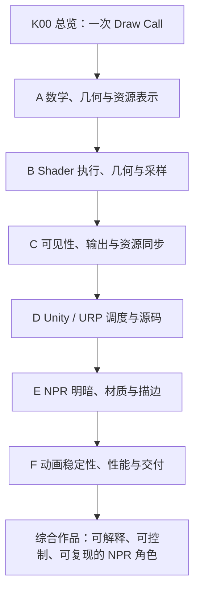

# Unity NPR：自底向上的知识卡片学习计划

> **目标：沿“数据如何表示 → GPU 如何执行 → Unity 如何调度 → NPR 如何控制画面 → 效果如何稳定交付”的顺序，建立可以解释、实现和验证的渲染能力。**

本计划包含 **1 张总览卡、48 张主线卡和 8 张按需选修卡**。这是卡片目录与执行计划，不表示全部卡片已经生成。它服务于长期学习，不要求先读完所有理论才开始做效果。

## 1. 学习边界与默认实验环境

以 **Unity、URP、HLSL 和角色赛璐璐 NPR** 为主线，同时为其他非真实感风格保留扩展入口。人物赛璐璐是默认实践载体，不意味着 NPR 只包含卡通人物。

底层学习同时覆盖 GPU 逻辑管线与常见硬件差异，但不把 Unity 未公开的原生 C++ 后端假装成可以逐行阅读的公开源码。

版本规则：

- 用户的本地官方文档位于 `E:\Claude Skills\学习仓库\09_Unity官方文档\Documentation\en`。已核实为 **Unity 6.7 Beta / 6000.7**，页面构建于 **2026-06-26**。
- 每张源码卡记录实际采用的 Graphics / Toon Shader 提交、包版本和符号，不能把仓库开发分支默认当成对应 Editor 的发布源码。
- 已有 Draw Call 总览卡的源码实例采用 **URP 17.0.4**，提交 `275a7f9ad9330e3cf7f3ea57a0b242a551fde291`；文档版本和源码实例版本明确分列。
- 真正开始建实验项目时，以项目的 Editor 版本及包锁文件为准重新固定版本。本计划本身不要求升级或修改现有项目。

默认先在 PC 的 URP Forward 路径验证，采用单相机、小场景和可控制的灯光。性能结论必须在最终目标设备复测；若目标为移动端，C05 与 F07 应提前参与所有后续实验。

## 2. 总览卡与正式学习顺序

已经选定的 **《一次 Draw Call 的完整执行链路》** 是导航卡 K00。首次阅读只需认出各阶段及数据流，不必一次掌握所有细节。

正式主线按下面的依赖关系推进：

**实践从 A 阶段就开始。** 为了能看见实验结果，可以提前使用一个给定的最小 URP Shader 骨架和 Frame Debugger 操作步骤；其完整机制分别在 D02、D08 回补。这是实验脚手架，不要求先学完整个 Unity 调度体系。

K00 在三个时点重读：A/B 后解释 GPU 数据流，D 后追踪源码与 Draw，F 后解释一次角色绘制的完整成本与画面结果。

## 3. A 阶段：数学、几何与资源表示

**阶段问题：GPU 将要处理的数值，分别表达什么？**

| 编号 | 独立卡片主题 | 必须回答的问题 | 最小实践 |
| --- | --- | --- | --- |
| A01 | 向量、点积、叉积与归一化 | 方向、夹角、长度和正交关系如何进入渲染？ | 将 `dot(N,L)` 显示为灰度，故意取消归一化并解释变化 |
| A02 | 坐标基、矩阵与空间变换 | 物体、世界、观察空间如何对应？为什么乘法顺序重要？ | 可视化同一点或方向在两个空间中的结果 |
| A03 | 齐次坐标、投影与裁剪空间 | `w` 有什么作用？VS 输出为什么不是屏幕坐标？ | 对照透视/正交相机，检查近裁剪面与屏幕位置 |
| A04 | 法线逆转置、切线与 TBN | 为什么法线不能总按普通方向变换？ | 非均匀缩放模型，比较正确与错误法线；检查镜像 UV 的手性 |
| A05 | 线性颜色、sRGB 与 HDR 数值 | 颜色数值、光强与显示编码是什么关系？ | 对比在线性域与编码域插值的渐变 |
| A06 | Mesh、子网格、顶点布局与索引 | 几何顶点、渲染顶点、三角形和材质槽怎样对应？ | 检查立方体硬边/UV 接缝为何需要重复顶点 |
| A07 | GPU 资源、内存、缓存与上传 | Buffer/Texture 如何被 GPU 访问？绑定与上传有何区别？ | 区分静态 Mesh、每帧更新常量和动态顶点数据 |
| A08 | 纹理格式、精度、压缩与数据贴图 | 为什么颜色图和法线/SDF/遮罩图不能共用所有导入设置？ | 用渐变与二值遮罩比较 sRGB 开关和压缩误差 |

**检查点 A：数据可视化材质。** 能在模型上分别显示法线、UV、世界位置和明暗夹角；能解释非均匀缩放、UV 接缝和错误色彩空间导致的变化。A01—A04 后即可完成第一版，A05—A08 后补充颜色与资源检查。

## 4. B 阶段：Shader 执行、几何与采样

**阶段问题：Shader 文本如何变成 GPU 上的几何处理和片元计算？**

| 编号 | 独立卡片主题 | 必须回答的问题 | 最小实践 |
| --- | --- | --- | --- |
| B01 | HLSL 编译、Shader 变体与精度 | Shader、变体、目标模型及 `half/float` 各是什么层次？ | 比较参数分支与关键字变体，并检查目标平台编译信息 |
| B02 | 统一 Shader 核心、wave 与占用率 | GPU 为什么并行？分歧、寄存器和延迟如何影响执行？ | 对比一致分支与空间交错分支，记录编译与 GPU 时间证据 |
| B03 | 管线状态、Draw 命令、队列与 CPU/GPU 并行 | 为什么一次 Draw 不是一次完整的同步往返？ | 在抓帧里区分绑定、绘制、提交和等待 |
| B04 | 顶点读取、图元处理与面剔除 | 索引怎样成为三角形？背面依据什么判定？ | 修改拓扑/绕序及 Cull 状态，并检查 VS 输出 |
| B05 | 光栅化、透视插值与 quad 导数 | 三角形怎样形成覆盖？UV 为什么不能直接线性插值？ | 比较插值方式，并可视化 `ddx/ddy/fwidth` |
| B06 | 纹理采样、Mip、LOD 与过滤 | 远处闪烁、模糊和倾斜表面采样误差从何而来？ | 在棋盘格上切换 Mip、过滤与各向异性设置 |
| B07 | 深度缓冲、ZTest、ZWrite 与 Reversed-Z | 深度是距离吗？可见性与深度写入怎样分离？ | 两个相交物体切换测试/写入，查看原始与线性深度 |
| B08 | Stencil 模板测试与操作 | 模板如何限制局部效果？Fail/ZFail/Pass 分别何时发生？ | 做一个有明确参考值与读写掩码的局部显示效果 |

**检查点 B：可预测的几何与遮挡。** 对每次状态修改，先写出覆盖、深度、模板和颜色的预测，再抓帧验证。能够指出“对象没被提交”“三角形被剔除”和“样本未通过测试”的区别。

## 5. C 阶段：可见性、输出与资源同步

**阶段问题：片元算出了结果，为什么仍可能看不见？结果最终保存在哪里？**

| 编号 | 独立卡片主题 | 必须回答的问题 | 最小实践 |
| --- | --- | --- | --- |
| C01 | Early-Z、Late-Z 与层次化深度 | 测试、拒绝、更新的时机为何不能混为一谈？ | 比较普通、clip 和改写深度的 Shader；区分推断与硬件计数证据 |
| C02 | 混合、预乘 Alpha 与透明排序 | 为什么 Alpha 不等于透明？为什么顺序改变颜色？ | 两张半透明面交换顺序，比较直通与预乘方案 |
| C03 | 颜色/深度附件、MRT 与写掩码 | Shader 输出怎样映射到目标？为何 ColorMask 0 仍可能有工作？ | 把颜色与 ID 写入不同目标，检查附件与掩码 |
| C04 | MSAA、覆盖、Alpha-to-Coverage 与 Resolve | 样本数量和着色调用数量是什么关系？ | 对照轮廓边缘、贴图透明边缘和样本覆盖 |
| C05 | 分块 GPU、tile memory 与 Load/Store | 为什么相同 Draw 数在移动 GPU 上可能有不同带宽成本？ | 比较兼容 Pass 连续执行与额外中间目标的资源流 |
| C06 | 资源状态、读写依赖、屏障与 fence | 哪些同步发生在 GPU 内？哪些真的让 CPU 等待？ | 画出“生成纹理→读取纹理”的依赖，再核对抓帧 |
| C07 | 蒙皮、顶点动画与几何数据来源 | 动画后的顶点在哪里生成？怎样影响后续 Pass？ | 跟踪一个顶点变形在主体、阴影和深度结果中的一致性 |
| C08 | Draw 数、Overdraw、带宽与瓶颈 | 一个全屏 Draw 为什么可能比许多小 Draw 更贵？ | 分别改变分辨率、覆盖层数和对象数，判断瓶颈假设 |

**检查点 C：透明与输出实验场。** 能解释一处最终像素由哪些操作构成；将附件更新、外部内存存储、MSAA Resolve 和屏幕显示分别标出。此时重读 K00，应能说明 GPU 半条链路。

## 6. D 阶段：Unity / URP 调度与源码

**阶段问题：前面理解的硬件工作，由 Unity 在什么位置组织出来？**

| 编号 | 独立卡片主题 | 必须回答的问题 | 最小实践 |
| --- | --- | --- | --- |
| D01 | URP 相机入口、剔除与 RendererList | 从相机到对象列表经过哪些公开代码？ | 固定提交，追到 `Cull`、绘制设置、过滤及列表创建 |
| D02 | ShaderLab Pass、LightMode 与状态覆盖 | Shader 文件中的 Pass 为什么未必执行？谁能覆盖状态？ | 对照 Forward、DepthOnly 和实际抓帧状态 |
| D03 | Render Graph 的记录与执行 | 声明资源、注册回调与实际记录命令为何不同？ | 写一个只完成单一效果的图 Pass，定位其执行回调 |
| D04 | Render Graph 资源寿命、依赖与导入 | 临时资源与导入资源由谁管理？为何会被裁剪或合并？ | 建立生产/消费两个 Pass，观察依赖与资源寿命 |
| D05 | 相机深度、法线与运动矢量的生产路径 | 这些纹理是什么时刻、由哪些对象产生的？ | 列出消费者需求与生产 Pass，检查透明对象等缺失情况 |
| D06 | 排序、SRP Batcher、Instancing 与 GPU 驱动入口 | 各方法减少的是什么成本？为什么不能只看“Batch”数？ | 同一测试场景只改变一种提交机制，记录 CPU 与 Draw |
| D07 | URP 光源数据、Forward 与 Forward+ | Shader 怎样取得主光和额外光？光照循环在哪里？ | 固定同一材质，检查两条路径的光源数据与变体 |
| D08 | Frame Debugger、RenderDoc 与源码对应 | 如何从错误像素反查事件、Pass、资源与状态？ | 对一个像素完成一次从图像到 Shader/资源的追踪 |

**检查点 D：可定位的自定义 URP Pass。** 能添加一个局部染色或遮罩效果，写清资源的生产者和消费者，并解释它在 Frame Debugger 中的位置。再重读 K00，将 CPU 与 GPU 两半连接起来。

## 7. E 阶段：NPR 明暗、材质与描边

**阶段问题：哪些底层输入与规则，能够稳定地控制目标风格？**

| 编号 | 独立卡片主题 | 必须回答的问题 | 最小实践 |
| --- | --- | --- | --- |
| E01 | Lambert 基线与艺术化明暗 | 几何朝向、光照强度与手工色阶各承担什么作用？ | 球体和头模上实现可解释的两段明暗 |
| E02 | 阴影图、投影、Bias 与级联 | 阴影为何自遮挡、漂浮、锯齿或跳变？ | 用相同模型分别控制 Bias、分辨率和距离，标注因果 |
| E03 | Ramp、色阶阈值与阴影合成 | 自身明暗与投射阴影按什么顺序组合？ | 对照“先量化后乘阴影”和“先组合后量化”的视觉差异 |
| E04 | 面部 SDF 与光照方向空间 | 如何让脸部明暗符合设计，而不完全跟随普通法线？ | 旋转灯光与角色，检查左右面、阈值及头部空间 |
| E05 | 美术法线、平滑法线与轮廓法线 | 为什么一个模型可能需要不止一套法线用途？ | 对照原始/编辑/描边法线，并检查硬边与接缝 |
| E06 | NPR 高光、头发、金属与 MatCap | 材质辨识依赖哪些方向、遮罩和视角关系？ | 同一模型做三种材质响应，检查相机运动时的变化 |
| E07 | 反壳描边与宽度控制 | 几何外扩在哪个空间进行？为什么粗细或接缝会变化？ | 对照物体/观察/裁剪空间方案，测试远近和非均匀缩放 |
| E08 | 屏幕空间描边与边界判定 | 深度、法线、ID 分别能检测什么边界？ | 分开显示三类边缘，再调节组合规则 |

**检查点 E：可控 NPR 角色静帧。** 主体、脸部、头发和描边有明确的独立控制项；固定参考相机与光照，逐项比较形状、色阶和线条。之后必须改变相机和灯光再检查，不能只以单一截图过关。

E 阶段的基本产物应尽量独立实现，再对照 Unity Toon Shader 中相应参数、Pass 和函数。目标是解释设计取舍，而不是逐行抄完大型 Shader。

## 8. F 阶段：动画稳定性、性能与交付

**阶段问题：效果离开演示截图，是否还能正确、稳定、可维护地运行？**

| 编号 | 独立卡片主题 | 必须回答的问题 | 最小实践 |
| --- | --- | --- | --- |
| F01 | 多 Pass 的几何与裁剪一致性 | 主体、ShadowCaster、DepthNormals、MotionVectors 为什么必须对应？ | 动画和溶解同时运行，逐张检查辅助纹理 |
| F02 | 头发透明、裁剪、模板与排序 | 风格目标需要哪种可见性规则？代价是什么？ | 对照 clip、混合和模板遮挡，记录交叠错误 |
| F03 | NPR 空间抗锯齿与细线稳定性 | MSAA、导数平滑和后处理 AA 各能处理哪些边缘？ | 对高频 Ramp、细描边和遮罩分别做静态/运动测试 |
| F04 | 时间抗锯齿、抖动与运动矢量 | 色阶、描边和动画为什么会拖影或闪烁？ | 对照正确/错误运动矢量和不同历史设置 |
| F05 | 色彩管理、曝光与后处理后的风格一致性 | 作者选定的色板为何在最终帧变化？ | 检查线性 HDR 中间结果和最终输出，建立固定展示预设 |
| F06 | CPU/GPU 性能预算与特性取舍 | 瓶颈来自提交、几何、着色、带宽还是同步？ | 每次只改变一个特性，记录帧时间、画质与资源成本 |
| F07 | 平台、分辨率与精度验证 | 为什么 PC 上正确的 Shader 不能自动视为移动端正确？ | 在目标设备检查格式支持、精度、带宽与动态分辨率 |
| F08 | NPR 角色小作品与工程交付 | 如何证明效果可复现、可调整、可追溯？ | 交付场景、参数说明、版本记录、抓帧与比较图 |

**最终检查点 F：一个可旋转、可换光、可播放动画的角色展示场景。** 同时检查正面/侧面/背面、远近镜头、非均匀缩放、明暗灯光、复杂背景和目标分辨率。每类检查都要能反查到相关卡片。

没有指定目标设备与帧率前，不硬编码“必须多少毫秒”的性能标准。开始 F06 时先确定实际项目预算，再用实测结果分配特性成本。

## 9. 重要依赖与提前实践的边界

不必机械等待全部前置章节完成，但以下依赖不能跳过：

| 想做的效果/工作 | 至少先掌握 |
| --- | --- |
| 两段明暗 | A01、A04、A05；会使用实验 Shader 骨架 |
| 正确的贴图采样 | A08、B05、B06 |
| 反壳描边 | A02—A04、B04、B07、D02 |
| 面部 SDF | A02、A08、B06、E01；需要明确头部空间和贴图约定 |
| 屏幕空间描边 | A03、B07、C03、D03—D05 |
| 排查透明遮挡 | B07、B08、C02、D02、D08 |
| 判断 Early-Z 性能 | B02、B07、C01、C08；需要对应平台的有效性能证据 |
| 动画下稳定的角色 | C07、D05、E 阶段相应效果、F01、F03、F04 |

允许的学习捷径是：先使用一个明确标为脚手架的工具或函数，随后回补机制。不能把“目前看起来正常”记录为“已经理解并验证”。

## 10. 每张独立知识卡片的固定规格

每张主线卡只围绕一个核心问题展开，内部按需要拆分相邻子问题；若必须引入多个独立模型，就拆成补充卡，而不不断扩张正文。

1. **问题与一句话结论**：读者要解决什么，答案在什么条件下成立。
2. **范围与前置概念速读**：版本、管线、API、平台；把必要术语重新解释一遍。编号依赖用于学习安排，不能代替自包含说明。
3. **数据与执行机制**：输入、输出、空间、单位、精度、执行阶段及资源存储位置。
4. **Unity 映射与源码锚点**：相关文件、符号、提交；无法从公开资料确认之处明确写出。
5. **最小实现或可复现实验**：优先提供可直接复制到 Unity 的 Shader/C#、操作步骤、预期画面与排查方法；不再编写 Python 实验。伪代码、静态核对、编译通过与实机验证分别标注。
6. **预测、观察与反例**：先预测，再观察；至少包含一个能推翻错误理解的反例。
7. **NPR 应用与取舍**：具体控制什么视觉结果，产生什么伪影，消耗什么资源。
8. **总结与后续依赖**：3—5 个关键点、少量自测问题及参考资料。

数学卡无需硬凑引擎调用栈；架构卡也不必硬凑一段 Shader。是否使用公式、Mermaid 或对照表，以能否更清楚地解释机制为准。卡片不依赖外部图片才能读懂；必要代码和结论应保留在 Markdown 正文。

## 11. 执行节奏与“学会”的定义

以一张卡或一个强依赖的小组为单位，采用以下循环：

**读机制 → 画出数据流 → 预测一次修改的结果 → 在小场景中验证 → 对照源码或抓帧 → 写回结论。**

记录三种状态即可：

| 状态 | 判断标准 |
| --- | --- |
| 已阅读 | 能复述术语，但还不能独立预测或定位 |
| 已验证 | 能设计最小实验，预测结果并用证据解释反例 |
| 已迁移 | 能将同一机制用于另一种模型、材质、视角或平台，并说明适用边界 |

每完成约四张相关卡就回到当前阶段作品，不要求统一固定周数。数学薄弱时在 A 阶段放慢；已有基础时可以用实验通过检查点后跳读。未经实际 GPU 测量，不把性能假设写成确定倍数；抓帧调试环境也不直接作为最终性能基准。

## 12. 按需选修：不挡住主线作品

| 编号 | 选修方向 | 进入条件与用途 |
| --- | --- | --- |
| X01 | BRDF、PBR 与风格化材质混合 | E01、E06 后；需要更强的材质辨识和环境响应时 |
| X02 | Deferred、GBuffer 与定制光照模型 | D、E 后；需要大量灯光或自定义延迟着色时 |
| X03 | GPU Resident Drawer、间接绘制与 GPU 剔除 | B03、C06、D06 后；实测提交/场景规模成为瓶颈时 |
| X04 | Compute Shader 描边、距离场与 JFA | C06、E08 后；屏幕效果算法需要独立计算路径时 |
| X05 | OIT 等高级透明方案 | C02、F02 后；常规排序确实无法满足目标时 |
| X06 | 排线、水彩、油画与笔触风格 | B05、B06、E/F 后；从角色赛璐璐扩展到其他 NPR 风格时 |
| X07 | 风格化间接光、雾与场景统一 | E、F05 后；从单角色扩展到完整场景时 |
| X08 | 原生 Render Pass 与移动端附件访问优化 | C05、C06、D04、F07 后；已有明确带宽证据时 |

选修方向仍应拆成独立的小问题。初期不把完整引擎开发、光线追踪或所有 GPU 厂商架构作为制作优秀 NPR 的强制前置。

## 13. 当前实施位置与下一组

本计划与卡片统一存放在 `E:\Claude Skills\学习仓库\图形学百科全书`。

已收录完整 [K00 总览卡](K00-Draw-Call完整执行链路.md)，并生成 A01—A08、B01—B08、C01—C08、D01—D08 和 E01—E08，共 40 张主线卡。A—D 阶段贯通数学、资源、GPU 执行、URP 调度与调试；E 阶段已覆盖明暗、阴影、Ramp、面部数据、多套法线、高光/MatCap 与两类描边，并完成固定 UTS 源码对照。各卡均为自包含 Markdown；可复制实验另放在 `实验/`。

根据 2026-09-07 的学习偏好，后续不再新增 Python 实验；实践集中到 Unity 操作、预测、观察和抓帧定位。先前数值脚本保留为历史资料，学习时可直接跳过。Unity 示例尚未在 Editor 编译或实机验证，读者学习状态不由文件生成自动推定。完整状态见 [学习进度](学习进度.md)。

推荐完成 **A01—A08 → [A 阶段检查点](../实验/A阶段检查点.md) → B01—B08 → [B 阶段检查点](../实验/B阶段检查点.md) → C01—C08 → [C 阶段检查点](../实验/C阶段检查点.md) → D01—D08 → [D 阶段检查点](../实验/D阶段检查点.md) → E01—E08 → [E 阶段检查点](../实验/E阶段检查点.md)**。已有实验文件的 Unity 观察尚待读者执行。下一组按 **F01 多 Pass 几何与裁剪一致性 → F02 头发透明/裁剪/模板/排序 → F03 空间抗锯齿与细线 → F04 时间抗锯齿、抖动与运动矢量** 推进。

新卡片使用稳定编号，如 `A01-向量点积叉积与归一化.md`。尚未生成的主题只登记在计划与进度表，不创建只有标题的占位卡片。根目录已有 Draw Call 稿件原样保留，导航使用 `00-学习导航/K00-Draw-Call完整执行链路.md`。

## 14. 资料使用规则

本计划的顺序、检查点和实践安排是面向本学习目标的教学设计，不是 Unity 官方课程顺序。

- GPU/API 层使用 Microsoft、Khronos、Arm 等官方规范或厂商资料；区分 API 可见语义和具体硬件实现。
- Unity 语义优先核对上述本地 6.7 Beta 文档；源码使用实际项目版本对应的固定提交，参考 [Graphics 仓库的版本说明](https://github.com/Unity-Technologies/Graphics#branches-and-package-releases)。
- NPR 对照 [Unity Toon Shader 官方源码](https://github.com/Unity-Technologies/com.unity.toonshader)，每次深入具体实现时固定提交，并记录参数约定和所属渲染管线。
- Unity 层计数与 GPU 事件不能只凭名称互相替代：例如 [SRP Batcher 文档](https://docs.unity3d.com/6000.0/Documentation/Manual/SRPBatcher.html) 说明其优化对象是连续绘制的准备与状态处理；[Render Graph 文档](https://docs.unity3d.com/6000.0/Documentation/Manual/urp/render-graph-introduction.html) 则说明资源、Pass 与依赖管理。计划将二者分开学习。
