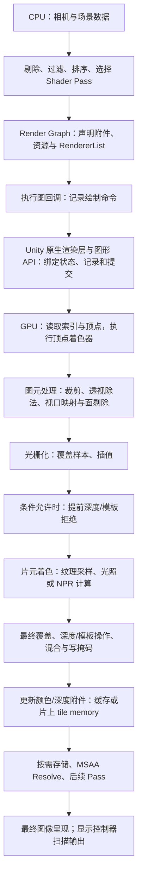

# 独立知识卡片 01：一次 Draw Call 的完整执行链路

> **核心命题：Draw Call 是一条“使用当前管线状态与资源，处理指定几何范围”的绘制命令。它可以产生大量 GPU 工作，也可能最终不改变任何颜色样本。Unity 准备绘制、CPU 提交命令、GPU 执行、渲染目标更新和屏幕显示，是不同的时刻。**

本卡面向希望从 GPU 原理贯通 Unity 渲染、进而开发 **NPR（Non-Photorealistic Rendering，非真实感渲染）** 效果的读者。默认读者知道 Mesh、Material、Camera 的基本用途；涉及的新概念均在文内解释。

## 1. 范围、版本与证据边界

主线选择：**URP Forward 路径，Render Graph 开启，一台相机、一个普通 MeshRenderer、一个子网格、一个不透明前向 Shader Pass、一个实例，使用传统顶点/片元光栅化。** 主线先关闭 GPU Resident Drawer、GPU Instancing、静态/动态合批、Depth Priming 和 MSAA，后文再解释这些机制会改变什么。SRP Batcher 可以开启。

| 资料 | 本卡核实的版本 | 用途与限制 |
| --- | --- | --- |
| 用户提供的本地官方文档 | Unity **6.7 Beta / 6000.7**；页面构建日期 **2026-06-26**，job ID `70640455` | 说明 API 语义、Render Graph、Pass 标签和调试工具；并非把 Beta 文档称为最终发布规范 |
| Unity Graphics | `6000.0/staging` 分支快照，提交 `275a7f9ad9330e3cf7f3ea57a0b242a551fde291`；URP **17.0.4** | 提供可以复核的 C# / HLSL 实现实例；**不声称这就是 Unity 6.7 的逐行源码** |
| Unity Toon Shader | 提交 `1520a78a95292cb045f1edb4d60ea0dba2f213b3`；**0.15.1-preview** | 核对实际的前向与描边 Pass 结构；不声称已验证它与本地 6.7 的完整兼容性 |
| GPU/API 资料 | Microsoft Direct3D 文档、Arm GPU 架构资料 | Direct3D 用于解释 API 语义，Arm 用于解释分块渲染；不将某一架构细节推广成所有 GPU 的保证 |

本卡区分三类论据：**公开源码事实**、**文档/API 保证**、**架构解释与工程推断**。Graphics 仓库包含 SRP 的公开实现，但不包含足以追踪全部 Unity 原生 C++ 渲染后端、驱动及 GPU 微码的完整源码。进入该边界后，本文只解释可公开核查的语义，不杜撰原生函数调用栈。

版本证据：[URP package.json](https://github.com/Unity-Technologies/Graphics/blob/275a7f9ad9330e3cf7f3ea57a0b242a551fde291/Packages/com.unity.render-pipelines.universal/package.json)、[Toon Shader package.json](https://github.com/Unity-Technologies/com.unity.toonshader/blob/1520a78a95292cb045f1edb4d60ea0dba2f213b3/com.unity.toonshader/package.json)。本地文档索引见文末。

## 2. 先分清“一个”的计数单位

| 概念 | 指什么 | 与 Draw Call 的关系 |
| --- | --- | --- |
| GameObject / Renderer | 场景对象及其渲染组件 | 一个对象可以因子网格、阴影、描边、深度预通道和多相机参与多次绘制 |
| 子网格 SubMesh | Mesh 中的一段拓扑/索引范围，通常对应一个材质槽 | 主线中一次 Draw 读取一个子网格的索引范围 |
| ShaderLab Pass | 一组 Shader 程序和渲染状态，例如 `ForwardLit` | 声明了 Pass 不代表本帧必定调用；要由管线选择和调度 |
| ScriptableRenderPass / Render Graph Pass | 引擎层的一段渲染工作及资源使用声明 | 可以包含很多 Draw，也可以只做复制或计算 |
| RendererList | 按剔除结果、过滤条件和绘制设置描述的一组绘制对象 | 一次 `DrawRendererList` 可以展开成多次 Draw |
| Native Render Pass | 图形 API 层围绕附件及其加载/存储的一组操作 | 可容纳多个 Draw；可由若干兼容的 Render Graph Pass 合并得到 |
| Draw Call | API/命令流中的一次绘制操作 | 实例化 Draw 可以画多个实例；间接命令又有额外的计数层次 |
| Queue Submission | 向 GPU 队列提交一批命令 | 一次提交通常包含很多 Draw；并非每个 Draw 都提交一次队列 |

**SRP Batcher 主要降低连续 Draw 之间的 CPU 准备成本，并维持材质常量数据的持久性；它并不以把这些 Draw 合成一次为工作定义。** GPU Instancing 则可以在一个绘制命令中处理多个实例。两者不能只因为名称都涉及“批处理”就混为一谈。[本地文档 D1；在线同主题文档](https://docs.unity3d.com/6000.0/Documentation/Manual/SRPBatcher.html)

## 3. 从全局看执行链路

下面是**逻辑数据流**。GPU 会并行、交错和流水化执行；Early-Z 的实际位置也受条件限制。这不是每个三角形都依次独占硬件的时间表。



纯文本速读：**选谁画 → 选什么程序和状态 → 记录并提交 → 顶点变换 → 三角形变成覆盖样本 → 计算候选颜色 → 决定如何更新附件 → 后续合成与显示。**

### 3.1 最开始，数据在哪里？

绘制前，相关资源必须已经存在并可供 GPU 使用，或已经排入正确的上传/生产依赖：

| 资源 | 存放内容 | 本次 Draw 如何使用 |
| --- | --- | --- |
| Vertex Buffer，顶点缓冲 | 位置、法线、切线、UV 等顶点属性 | 根据布局、步长与索引读取属性 |
| Index Buffer，索引缓冲 | 16 位或 32 位顶点索引等 | 指定哪些顶点组成三角形 |
| Constant Buffer，常量缓冲 | 对象矩阵、相机参数、材质数值、光照参数 | 为 Shader 提供本次绘制所需参数 |
| Texture 与 Sampler | 图像数据；过滤、寻址等采样规则 | Shader 发出采样操作 |
| 已编译 Shader / 管线状态 | 可执行程序及光栅、深度、混合等设置 | 决定 GPU 如何解释和处理数据 |
| Render Target / Depth Attachment | 颜色目标与深度/模板附件 | 接收绘制结果，并提供已有颜色、深度或模板值 |

**Draw 不意味着把整套 Mesh 和贴图重新从 CPU 上传一遍。** 静态资源通常复用已有 GPU 资源；变化的数据才按其更新机制处理。资源“绑定”与内容“上传”是两件事。Shader 编译/管线创建也不是每个 Draw 都必然重做；新变体或未准备好的管线状态可能引入首次使用开销。

“显存”在此泛指 GPU 可访问的资源存储。独立显卡常有独立 VRAM；统一内存设备可能与 CPU 共享物理内存，但依然有缓存、访问权限和同步规则。

## 4. Unity CPU 侧：如何形成绘制工作？

### 4.1 相机剔除只产生候选集，不是最终像素可见性

主线从相机矩阵、裁剪参数、Renderer 包围体等信息出发进行剔除，得到 `CullingResults`。视锥剔除判断对象是否可能与相机视野相交；遮挡剔除是否参与及具体路径取决于配置。

之后还要依据 Layer、Render Queue、Shader Pass 支持情况等筛选。一个 Renderer 留在候选集合里，不代表它的所有三角形都会留下，也不代表它有任何片元最终通过深度测试。

三种“看不见”发生在不同层：

- **对象剔除**：可能连绘制工作都不生成。
- **图元裁剪/面剔除**：Draw 已经存在，某些三角形不产生覆盖。
- **深度/模板拒绝**：已经产生覆盖候选，但不更新相应的颜色样本。

### 4.2 过滤、排序与 Shader Pass 选择

URP 的 `DrawObjectsPass.InitRendererLists` 组合绘制设置与过滤设置。该快照中，普通前向对象使用的标签列表包含 `SRPDefaultUnlit`、`UniversalForward` 和 `UniversalForwardOnly`。不透明对象采用相机提供的排序策略，透明对象采用 `CommonTransparent`。[源码：DrawObjectsPass](https://github.com/Unity-Technologies/Graphics/blob/275a7f9ad9330e3cf7f3ea57a0b242a551fde291/Packages/com.unity.render-pipelines.universal/Runtime/Passes/DrawObjectsPass.cs#L202)

排序同时受正确性和状态切换成本影响，不能把不透明绘制概括为“绝对严格地逐三角形从近到远”。常规透明排序通常也不解决单个 Mesh 内任意相交三角形的正确顺序。

`Name "ForwardLit"` 是 Pass 名；`Tags { "LightMode" = "UniversalForward" }` 是管线选取它的重要标记。不能只写一个任意的 `Name "Outline"` 就认为管线会自动执行描边。也不能认为 Shader 文件中所有 Pass 都会按文本顺序全部执行。本地文档 D4 明确将 `SRPDefaultUnlit` 列为可用于额外描边 Pass 的标签。

### 4.3 Render Graph 的记录与执行

**记录阶段**声明：这个 Pass 要使用哪个 RendererList、读哪些纹理、写哪些颜色/深度附件，并提供执行回调。此时调用 `AddRasterRenderPass` 不等于 GPU 已开始画。

**执行阶段**调用保留下来的 Pass 的渲染回调，产生绘制命令。Render Graph 可根据已声明的依赖管理资源寿命、剔除允许剔除的无用 Pass，并在条件允许时合并原生 Render Pass、安排所需同步。不能据此推断它会跨越依赖任意重排所有操作。[本地文档 D2、D3；在线概述](https://docs.unity3d.com/6000.0/Documentation/Manual/urp/render-graph-introduction.html)

下面只抽出已核验源码中的关键动作，**是流程伪代码，省略了参数、调试分支及资源声明，不是可直接复制运行的 Renderer Feature**：

```csharp
// 相机渲染：得到可用于后续绘制的剔除结果。
cullResults = context.Cull(ref cullingParameters);

// 记录 DrawObjectsPass：指定附件与对象列表。
builder = renderGraph.AddRasterRenderPass<PassData>(...);
builder.SetRenderAttachment(colorTarget, 0, AccessFlags.Write);
builder.SetRenderAttachmentDepth(depthTarget, AccessFlags.Write);
InitRendererLists(...);
builder.UseRendererList(passData.rendererListHdl);

// 注册回调；图执行时调用它，再由 ExecutePass 记录列表绘制。
builder.SetRenderFunc((data, graphContext) => ExecutePass(...));
// ExecutePass 内部的关键调用：
cmd.DrawRendererList(rendererList);

// 相机渲染流程稍后将计划的命令提交给 Unity 渲染循环。
context.Submit();
```

这里有两个非常容易漏掉的实现细节：

1. **声明资源写入，不等于覆盖整个纹理。** 部分像素绘制、混合与附件加载/存储仍有独立语义。该源码使用 `AccessFlags.Write`，不能把它读成“全屏每个像素都必定被重写”。
2. **ShaderLab 状态可能被管线覆盖。** 该版本在启用 Depth Priming 的相关不透明路径中设置 `DepthState(false, CompareFunction.Equal)`：颜色阶段复用预通道深度，关闭深度写并使用相等比较。只读 Shader 文件不足以断定抓帧时的最终状态。[源码：状态覆盖](https://github.com/Unity-Technologies/Graphics/blob/275a7f9ad9330e3cf7f3ea57a0b242a551fde291/Packages/com.unity.render-pipelines.universal/Runtime/Passes/DrawObjectsPass.cs#L218)

### 4.4 Submit 返回，不代表 GPU 已完成

本地 API 文档对 `ScriptableRenderContext.Submit` 的定义是：将所有已调度命令提交到渲染循环执行。它不是“阻塞到屏幕像素已经显示”的保证。

CPU 可以准备后续工作，GPU 同时消费此前提交的命令。Unity 的主线程、渲染线程、Graphics Jobs 与原生后端如何分工，随平台和设置变化。线程时间线上看到等待，也可能是在等待 GPU、帧节流或其他依赖，不能直接归因于 Shader 算术太多。

需要判断“GPU 确实做完某段工作”时，要看相应 fence、GPU 查询或同步机制；**绘制函数返回、命令提交、GPU 完成、显示扫描输出，不能互相替代。** [本地文档 D5；D3D12 命令记录](https://learn.microsoft.com/en-us/windows/win32/direct3d12/recording-command-lists-and-bundles)

