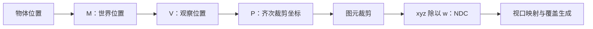

# A03｜齐次坐标、投影与裁剪空间：顶点怎样走向屏幕

> **顶点 Shader 通常输出四维裁剪坐标；GPU 利用它处理裁剪，再进行透视除法和视口映射。w 不是可以随手丢弃的附件，提前除以 w 会破坏后续所需信息。**

## 1. 目标与约定

本卡从空间位置推导屏幕位置，解释透视、正交、裁剪坐标、NDC 和深度数值，并用一个明确的教学投影做计算。它不要求读者读过其他卡片。

必要术语：**位置**是相对于原点的三个数；**矩阵**按规则线性组合分量；**齐次坐标**增加第四分量，用四维表示三维点或方向；**视口**是渲染目标上用于映射图像的矩形。

采用列向量 `p'=M p`。教学相机在原点，向观察空间 **−Z** 看，Y 向上，使用 **0…1 的常规深度、没有 Reversed-Z**。这些约定只服务推导，**不表示所有 Unity 平台和实际相机矩阵都如此**。

文档基线：本地 Unity **6.7 Beta / 6000.7**，2026-06-26 构建。源码实例：Graphics `275a7f9ad9330e3cf7f3ea57a0b242a551fde291`，URP/Core RP 17.0.4。数学推导与版本无关。

## 2. 为什么一个点可以用四个数表示

对于 `w≠0`，齐次坐标 `(x,y,z,w)` 代表三维坐标 `(x/w,y/w,z/w)`。将四个分量同时乘任意非零比例，在射影意义下代表同一点，例如 `(2,4,6,2)` 和 `(1,2,3,1)`。

但是实际图形管线的裁剪约定还有方向与符号要求，**不能把“数学上代表同一点”理解为可以随意把提交给 GPU 的所有裁剪坐标乘负数**。

仿射变换中，输入点常写成 `(p,1)`，方向写成 `(v,0)`，后者不受平移。透视投影的最后一行改变 w，使它能够携带观察深度。w 不是欧氏距离：在本教学矩阵下 `w=-zView`，与 `sqrt(x²+y²+z²)` 不同。

## 3. 透视来自相似三角形

设表面点在相机前方，观察距离沿前向为 `d=-zView>0`。横向位置在投影平面上的尺度与 `x/d` 成正比；同一个 x 距离翻倍时，投影横坐标减半，这就是近大远小。

设垂直视场角为 `φ`，宽高比为 `a=width/height`，并令：

$$
s_y=1/\tan(\varphi/2),\qquad s_x=s_y/a
$$

期望 NDC 坐标为 `xNDC=sx*x/d`、`yNDC=sy*y/d`。将 `xc=sx*x`、`yc=sy*y`、`wc=d` 输出，就能将除法留给后续阶段。

## 4. 一套完整且明确的教学投影

近裁剪距离 n、远裁剪距离 f，要求 `0<n<f`。常规 0…1 深度矩阵可写为：

$$
P=\begin{bmatrix}
s_x&0&0&0\\
0&s_y&0&0\\
0&0&\frac{f}{n-f}&\frac{fn}{n-f}\\
0&0&-1&0
\end{bmatrix}
$$

对 `(x,y,z,1)` 做矩阵乘法，得到 `(xc,yc,zc,wc)`；再算 `NDC=(xc,yc,zc)/wc`。

取 `n=1、f=9、φ=90°、a=1`，有 `sx=sy=1`：

| 观察空间点 | 裁剪坐标 `(x,y,z,w)` | NDC | 说明 |
| --- | --- | --- | --- |
| `(0,0,-1)` | `(0,0,0,1)` | `(0,0,0)` | 近面 |
| `(0,0,-9)` | `(0,0,9,9)` | `(0,0,1)` | 远面 |
| `(1,0,-2)` | `(1,0,1.125,2)` | `(0.5,0,0.5625)` | 一个前方点 |
| `(1,0,-4)` | `(1,0,3.375,4)` | `(0.25,0,0.84375)` | 距离翻倍，横向投影减半 |

教学深度可以写成：

$$
z_{NDC}=\frac{f}{f-n}-\frac{fn}{(f-n)d}
$$

它含有 `1/d`，因此通常不是线性距离。此例中距离 2、4 对应深度 0.5625、0.84375，不是 2:4 的比例。Reversed-Z 会改变映射方向，后续深度卡再讨论精度收益；不要在本卡公式中悄悄混入反向约定。

## 5. 裁剪发生在怎样的坐标里

本教学 API 约定下，常规裁剪体满足：

$$
-w_c\le x_c\le w_c,\quad -w_c\le y_c\le w_c,\quad 0\le z_c\le w_c
$$

一些其他约定的 z 范围为 `−wc…wc`。裁剪针对图元；三角形跨越近面时，可能生成新的边界顶点和三角形，不是简单“删掉那个不合格顶点”。

先处理齐次裁剪关系，也避免把跨越相机平面、w 接近零的图元直接进行不稳定除法。**不要在 VS 内执行 `positionCS /= positionCS.w` 后照常输出**：这会改写硬件用于裁剪和透视正确插值的数据。[Direct3D 光栅阶段](https://learn.microsoft.com/en-us/windows/win32/direct3d11/d3d10-graphics-programming-guide-rasterizer-stage)

逻辑顺序如下，实际硬件可合并或优化阶段，但必须满足相应语义：



## 6. 从 NDC 到像素，以及正交相机的区别

在以左下为原点的教学视口、宽 W、高 H、偏移 `(ox,oy)` 下：

$$
x_{screen}=o_x+(x_{NDC}+1)W/2,\qquad
y_{screen}=o_y+(y_{NDC}+1)H/2
$$

这是连续屏幕坐标，不是立刻四舍五入成一个像素索引；光栅化还要按采样位置判断覆盖。API 的 Y 方向和目标翻转需要另作适配。

在 `W=H=800`、偏移为零时，NDC x=0.5 和 0.25 分别得到屏幕 x=600 和 500。

正交投影则不依赖距离缩小 x/y。若正交视体左右边界为 ±2，则 `xNDC=x/2`，点 `(1,0,-2)` 和 `(1,0,-4)` 都得到 xNDC=0.5。正交投影仍需要深度与裁剪，不能理解为“没有深度”。

## 7. Unity 中怎样使用与验证

URP 的正常顶点代码通常是：

```hlsl
// 放在包含 Core.hlsl 的顶点 Shader 内。
// positionOS 为模型位置；结果交给 SV_POSITION，保留四个分量。
float4 positionCS = TransformObjectToHClip(positionOS);
```

固定源码中的该函数组合物体矩阵与世界到裁剪矩阵，并没有在此执行透视除法。[SpaceTransforms.hlsl](https://github.com/Unity-Technologies/Graphics/blob/275a7f9ad9330e3cf7f3ea57a0b242a551fde291/Packages/com.unity.render-pipelines.core/ShaderLibrary/SpaceTransforms.hlsl)

CPU 端 `Camera.projectionMatrix` 与 GPU 使用的最终投影可能因 API、渲染目标翻转和相机设置而不同。`GL.GetGPUProjectionMatrix` 可做相关平台转换，但参数必须符合真实目标；URP 的中间颜色目标、抖动和 XR 等也需纳入考虑。精确复现某个 Pass 时，以那个 Pass 使用的矩阵为准，不能只看 `camera.targetTexture` 推断所有中间渲染状态。[GL.GetGPUProjectionMatrix](https://docs.unity3d.com/6000.0/Documentation/ScriptReference/GL.GetGPUProjectionMatrix.html)

下面的脚本**只验证第 4 节教学矩阵**，不声称读出了实际 URP 投影。保存为 `A03ProjectionLab.cs`、挂到空对象，在组件菜单运行“Print Projection Experiment”：

```csharp
using UnityEngine;

public class A03ProjectionLab : MonoBehaviour
{
    [ContextMenu("Print Projection Experiment")]
    private void PrintExperiment()
    {
        float n = 1, f = 9;
        var projection = new Matrix4x4();
        projection.m00 = 1; projection.m11 = 1;
        projection.m22 = f / (n - f);
        projection.m23 = f * n / (n - f);
        projection.m32 = -1;
        Vector3[] points = {
            new Vector3(0,0,-1), new Vector3(0,0,-9),
            new Vector3(1,0,-2), new Vector3(1,0,-4)
        };
        foreach (var p in points)
        {
            Vector4 clip = projection * new Vector4(p.x,p.y,p.z,1);
            if (Mathf.Abs(clip.w) < 1e-6f) continue;
            var ndc = new Vector3(clip.x,clip.y,clip.z) / clip.w;
            Debug.Log($"View={p}, Clip={clip.ToString("F4")}, NDC={ndc.ToString("F4")}");
        }
    }
}
```

w 检查只防止这个教学程序除以接近零的数，不是完整的图元裁剪实现。

## 8. 对 NPR 描边的直接用途

假设已经有一个期望的 **NDC 偏移** `deltaNDC`，要让某顶点最终移动该偏移而保留 w，可用：

```hlsl
// 仅演示偏移关系，不是完整描边算法。
positionCS.xy += deltaNDC * positionCS.w;
```

因为除以 w 后，额外部分正好是 `deltaNDC`。在 800 像素宽视口中，向右 4 像素对应 `deltaNDC.x=2*4/800=0.01`。w 为 2 时裁剪 x 加 0.02，w 为 4 时加 0.04，最终都移动 4 像素。

如果反而对裁剪 x 永远加 0.02，那么 w=4 时只移动 2 像素。这解释了常见的远处描边变细。完整描边仍要处理偏移方向、宽高比、近面、背面剔除和几何接缝，不能将这条等式当作整个解决方案。

## 9. 自测、答案与证据

1. `SV_POSITION` 从 VS 输出时为什么用 float4？**要保留裁剪和透视关系需要的齐次信息。** 同一语义进入片元阶段时有阶段特定含义，不能继续当作原始 VS 裁剪输出。
2. w 是否总是相机到点的距离？**否；在本教学透视矩阵中它是 −zView，正交和其他投影另有形式。**
3. 常规深度 0.5 是否代表近远面之间一半距离？**通常不是。**
4. 800 像素宽画面向右 4 像素的 NDC 偏移是多少？**0.01。**

配套 Python 实验校验矩阵端点、透视缩放、正交对照和像素偏移。Unity C# 代码尚未在 Editor 编译执行；没有实际 GPU 抓帧证据。

本地来源根目录：`E:\Claude Skills\学习仓库\09_Unity官方文档\Documentation\en`。核对 `ScriptReference/Camera-worldToCameraMatrix.html`、`Matrix4x4.MultiplyPoint.html` 与 `Manual/SL-PlatformDifferences.html`。相关在线链接作为可移植参考。

继续学习：[A04｜法线逆转置、切线与 TBN](A04-法线逆转置切线与TBN.md)。
