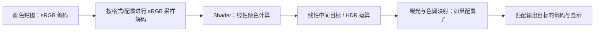

# A05｜线性颜色、sRGB 与 HDR 数值：Shader 中的 0.5 到底是什么

> **颜色数值必须连同编码方式一起解释。sRGB 编码值 0.5 解码后约为线性值 0.214；线性值 0.5 编码后约为 0.735。把它们混用，会改变混合结果、NPR 色板和数据纹理阈值。**

## 1. 范围与必需概念

本卡从基本数值解释 Unity 线性工作流、sRGB 传递函数、HDR 和数据贴图，不要求读过其他卡片。

RGB 是相对于选定基色与白点的三通道颜色表示；**线性 RGB** 的各分量在固定标定下与相应光量成比例；**编码 RGB** 可以通过非线性函数存储这些分量。`lerp(a,b,t)=(1-t)a+tb` 是线性插值，但“公式线性”不等于其输入一定属于线性光空间。

教学基线：Unity URP、项目 Color Space 为 Linear、普通 SDR/sRGB 输出，先关闭后处理和自动曝光。数学使用标准非负 sRGB 分段公式；不扩展到任意广色域、负值和 HDR 显示标准。

文档核对本地 Unity **6.7 Beta / 6000.7，2026-06-26**；源码例子使用 Graphics `275a7f9ad9330e3cf7f3ea57a0b242a551fde291`（Core RP 17.0.4）。文档与源码版本分开标识。

## 2. 为什么颜色不只是一个 float3

| 概念 | 回答的问题 | 不能替代什么 |
| --- | --- | --- |
| 色域/基色与白点 | 三个分量对应哪些颜色方向？ | 不是 Gamma 曲线 |
| 传递函数/编码 | 数值怎样与线性光量对应？ | 不是贴图压缩格式 |
| 动态范围 | 能表示多暗、多亮以及哪些相对强度？ | 不直接规定显示器亮度 |
| 存储格式与位深 | 用多少位、整数还是浮点保存？ | 不自动定义这个通道是颜色还是遮罩 |

sRGB 同时有基色/白点和传递函数的含义。本卡说“sRGB 解码”时，专指将标准 sRGB 编码分量转换为相同基色下的线性分量；这不等于任意色域转换。

## 3. 分段公式与 0.5 反例

设编码值为 e、线性值为 l。在 `[0,1]` 上：

$$
l=\begin{cases}e/12.92,&e\le0.04045\\((e+0.055)/1.055)^{2.4},&e>0.04045\end{cases}
$$

反向编码：

$$
e=\begin{cases}12.92l,&l\le0.0031308\\1.055l^{1/2.4}-0.055,&l>0.0031308\end{cases}
$$

这些分段含一个低值线性段，所以 `pow(x,2.2)` 只能是粗略近似，不是精确 sRGB 定义。标准取整断点附近的极小数值差异，也不应被解释成可见跳变。[W3C：sRGB 转换示例](https://www.w3.org/TR/css-color-4/#color-conversion-code)

| 操作 | 结果约值 |
| --- | --- |
| sRGB 0.5 → 线性 | 0.214041 |
| 线性 0.5 → sRGB | 0.735357 |
| sRGB 0.735357 → 线性 | 0.5 |
| 将 sRGB 0.5 错误地连续解码两次 | 约 0.037649，明显变暗 |

注意 8 位编码的字节 128 实际归一化为 `128/255≈0.501961`，不是恰好 0.5。线性 0.5 对应约 187.52 个编码级，四舍五入为 188。

### 黑白各一半，为什么结果不同

若目标是求等权光量混合：先取线性黑 0、白 1，平均得到 l=0.5，显示编码约 0.735。

若先在编码域平均得到 e=0.5，再解码，光量只有约 0.214。两者都使用 `lerp`，却回答了不同的问题。作者可以有意在其他空间设计色板渐变，但必须把这种设计与线性光量混合区分。

## 4. Unity 的数据路径



在线性项目中，正确标为 sRGB 的颜色纹理通常通过相应 GPU 采样路径交给 Shader 线性值。**不要对已经解码的采样结果再手写一次 sRGBToLinear。** 写目标时是立即编码还是留在线性中间目标，取决于格式和管线配置。[Unity 线性工作流](https://docs.unity3d.com/6000.0/Documentation/Manual/linear-color-space.html)

HLSL 字面量 `float3(0.5,0.5,0.5)` 不携带“这是美术软件的 sRGB 取色值”元数据。在这个教学 Shader 的线性运算里，它就是线性数值。材质 Color 属性、Vector 属性、CPU 传值与纹理导入则有各自语义，不要对所有入口统一多做一次转换。

Alpha 一般代表覆盖或不透明度等独立量，标准 sRGB 转换针对 RGB，不应对 Alpha 套同一曲线。对于采用 sRGB 目标的相应混合路径，目标 RGB 可先解码到线性域参与混合，再编码保存。[Direct3D 输出合并与 sRGB](https://learn.microsoft.com/en-us/windows/win32/direct3d11/d3d10-graphics-programming-guide-output-merger-stage)

## 5. HDR、曝光与色调映射分别做什么

**HDR 渲染**允许中间结果保留较大动态范围，例如线性颜色 4；这并不自动意味着当前屏幕能够直接显示“4 倍白色”。浮点目标常被用于此目的，具体格式仍有有限范围、精度和通道约束。

若将曝光补偿定义为“增加一档使画面变亮”，线性数值可乘 `2^ΔEV`：补偿增加 1，数值加倍。这里的 ΔEV 是这个明确定义的相对补偿量，不是物理相机的绝对 EV100；后者增大通常对应更少曝光，不能直接套用同一符号。色调映射把场景数值映射到目标显示范围，通常是非线性变换。它与曝光补偿都不等于 sRGB 编码。

仅作教学，设 `Tone(x)=x/(1+x)`：线性 4 经该函数变成 0.8，再编码到 sRGB 约为 0.906332。这个函数不是本卡对 URP 实际 Tonemapping 的实现声明。也不要把 `saturate(x)` 当作保留高光层次的通用色调映射。

**NPR 的选择：** 如果希望作者色板稳定，先固定曝光和后处理再比较；若需要发光、高光和场景融合，明确哪些层在线性 HDR 中参与合成、哪些层需要特别的艺术控制。

## 6. 数据纹理的 0.5 不能随意解码

面部 SDF、遮罩和阈值查找表的通道可能表达数值而非颜色。若编码约定把 0.5 作为边界，误开 sRGB 采样会把它变成约 0.214，边界语义被改变。普通非颜色数据应按其作者编码约定关闭 sRGB；专门编码过的数据必须使用匹配的解码方式。[Unity：线性数据纹理](https://docs.unity3d.com/6000.0/Documentation/Manual/linear-textures.html)

**Ramp 要区分用途：** 存美术颜色的 Ramp 可能是 sRGB 颜色图；存光照系数的 Ramp 则通常是线性数据。纹理名称中有“Ramp”不能替代语义判断。过滤方式、Mip 和压缩又是不同维度，关闭 sRGB 不会自动解决所有阈值误差。

## 7. 完整 Unity 数值实验

保存为 `A05ColorLab.cs`，挂到空对象，在组件菜单执行“Print Color Experiment”。脚本使用自身的标准公式，不读取或修改项目色彩设置。

```csharp
using UnityEngine;

public class A05ColorLab : MonoBehaviour
{
    private static double Decode(double e) => e <= 0.04045
        ? e / 12.92 : System.Math.Pow((e + 0.055) / 1.055, 2.4);
    private static double Encode(double l) => l <= 0.0031308
        ? 12.92 * l : 1.055 * System.Math.Pow(l, 1.0 / 2.4) - 0.055;

    [ContextMenu("Print Color Experiment")]
    private void PrintExperiment()
    {
        Debug.Log($"Decode 0.5: {Decode(0.5):F6}");
        Debug.Log($"Encode 0.5: {Encode(0.5):F6}");
        Debug.Log($"Double decode: {Decode(Decode(0.5)):F6}");
        Debug.Log($"Byte 128 decoded: {Decode(128.0 / 255.0):F6}");
        Debug.Log($"Linear 0.5 nearest byte: {System.Math.Round(Encode(0.5)*255)}");
        Debug.Log($"Teaching HDR mapping: {Encode(4.0/(1.0+4.0)):F6}");
    }
}
```

预期前三行约为 `0.214041、0.735357、0.037649`；字节 128 解码约为 `0.215861`；最近编码字节为 188；教学 HDR 结果约为 `0.906332`。

视觉实验可以在同一线性 Shader 中显示两条黑白渐变：一条输出 `t`，另一条输出 `Decode(t)`，然后由同一管线完成显示。比较中点即可观察两种插值域的差异。确保没有重复输出编码，不能将此效果归因于“GPU 自动把所有 float 纠正好了”。

## 8. 源码入口、反例与自测

Core RP 的 [Color.hlsl](https://github.com/Unity-Technologies/Graphics/blob/275a7f9ad9330e3cf7f3ea57a0b242a551fde291/Packages/com.unity.render-pipelines.core/ShaderLibrary/Color.hlsl) 包含 `SRGBToLinear`、`LinearToSRGB` 与快速近似函数。该提交的部分系数/精度选择与本卡标准公式存在实现差异，因此不要拿本实验声称与每个平台函数逐位相同。CPU 数值、Shader 运算精度及硬件格式转换也不能不加区分地比较。

1. 线性颜色是否必须在 `[0,1]`？**不是，HDR 计算可以超出，但格式有范围限制。**
2. 为什么遮罩 0.5 不能自动 sRGB 解码？**它可能是数据边界，不是编码后的光量。**
3. 为什么相同 RGB 数值不能保证相同屏幕颜色？**还要明确色域、编码、曝光、映射及输出路径。**
4. `pow(x,2.2)` 是否精确 sRGB？**不是。**

验证状态：配套 Python 数值测试检查转换、混合和 HDR 教学例子；Unity 示例仅静态核对，未在 Editor 编译或实机运行。

本地根目录：`E:\Claude Skills\学习仓库\09_Unity官方文档\Documentation\en`。已核对 `Manual/linear-color-space.html`、`Manual/linear-textures.html`、`ScriptReference/TextureImporter-sRGBTexture.html`。在线 Unity 6.0 链接是可移植的同主题入口。

下一张：[A06｜Mesh、子网格、顶点布局与索引](A06-Mesh子网格顶点布局与索引.md)。
