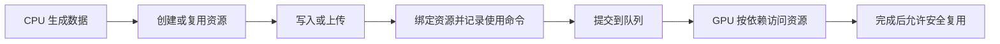

# A07｜GPU 资源、内存、缓存与上传

> 核心问题：C# 中已经有一份数据，为什么 GPU 不能直接把它当作绘制输入？
>
> 一句话结论：CPU 数据、GPU 资源和使用它的命令是不同对象。正确绘制需要明确布局、传输、绑定和访问时序；“上传函数返回”不等于“GPU 已经用完”。

编号 A07；阶段 A：数学、几何与资源表示；目标是为 Unity NPR（非真实感渲染）的角色参数、Mesh、Ramp 和遮罩更新建立资源模型。本文讨论普通 Unity 图形资源，不假设读者学过前面的卡片。

版本依据：本地 Unity 6.7 Beta / 6000.7 文档，构建日期 2026-06-26；公开 C# 源码固定到 `9d487cab41b00c50af020b56d27a3c768d54f770`。D3D12 堆类型仅用于解释一种图形 API 的内存模型，不能据此断言 Unity 的 Metal、Vulkan 或某块 GPU 采用同一实现。

## 1. 先把五个对象分开

| 对象 | 含义 | 例子 |
| --- | --- | --- |
| CPU 数据 | 程序能够写入的一组数值 | C# `Vector4[]` |
| 资源 | 有大小、格式、用途和生命周期的图形对象 | `GraphicsBuffer`、`Texture2D` |
| 视图与绑定 | 说明 Shader 怎样访问资源，以及访问哪个范围 | 结构化缓冲元素、纹理采样视图 |
| 命令 | 要执行的操作及相关状态 | 拷贝、Draw、Dispatch |
| 完成信号 | 说明先前工作到达指定完成点 | GPU fence |

Buffer 是按字节组织的存储；Texture 还具有维度、格式、Mip 等图像语义，内部可以使用适合访问的平铺布局。`stride` 是相邻缓冲元素起点的字节间距。例如一个由四个 32 位浮点数组成的 `float4`，逻辑大小是 16 字节。

Unity 的托管对象通常包装原生资源，托管引用不等于 GPU 地址。纹理源文件也不是纹理资源：PNG 文件经过导入，可能成为 BC、ASTC 或未压缩格式的 GPU 数据。

## 2. 从 CPU 到 GPU 的最小数据流



这是概念依赖图，不要求引擎每次 Draw 都重新创建、上传全部资源。静态 Mesh 和贴图通常能够跨许多次绘制复用。资源已经在 GPU 可访问内存中，也不意味着任何 Shader 都会自动使用它：Shader 的声明、绑定槽和数据布局仍须匹配。

`SetData` 负责写入资源数据，单独调用它不会绘制。绑定一个缓冲也不会自动创建 Draw。相反，Draw 可以复用上一帧已经上传、内容未变的资源。

## 3. “显存”不是所有平台上的同一块地方

以 D3D12 为例，`DEFAULT` 常用于 GPU 高频访问，`UPLOAD` 用于 CPU 写入、GPU 读取，`READBACK` 用于 GPU 拷贝结果后由 CPU 读取。它们表达不同访问属性；纹理上传通常还涉及中间 Buffer 和图像拷贝布局，不能把 Texture 直接等同于上传堆中的普通数组。[D3D12 堆类型](https://learn.microsoft.com/en-us/windows/win32/api/d3d12/ne-d3d12-d3d12_heap_type)

独立显卡和 UMA（统一内存架构）的物理内存组织不同。UMA 允许 CPU/GPU 共享物理内存，但缓存可见性、访问权限和同步依赖依然存在。**共享物理内存不能推出任意同时读写都安全，也不能推出所有上传都零成本。**

Unity 后端可以使用暂存、重命名或拷贝来满足其 API 语义。本卡没有 Unity 原生后端源码或 GPU 抓帧证据，因此不绘制一条虚构的、适用于所有平台的实际内存拷贝链。

## 4. 容量、每帧流量与峰值带宽是三件事

若每个元素占 `s` 字节，共 `n` 个元素，逻辑有效载荷为：

\[
B=n\,s
\]

每帧全部更新一次，帧率为 `f`，应用提交的数据量估算为 `Bf`。例如 1,000 个 `float4`：

\[
B=1000\times16=16000\text{ B},\qquad B\times60=960000\text{ B/s}
\]

后者是十进制 `0.96 MB/s`，不是测出的 PCIe 流量、显存读取流量或 GPU 时间。临时拷贝、对齐、同步和调用开销都可能改变实际成本。

一张无 Mip 的 `1024×1024 RGBA8` 有 `4,194,304 B = 4 MiB` 的像素有效载荷。若每帧全部重传，60 FPS 时相当于 `240 MiB/s` 的有效载荷；如果只是修改一组控制参数，让 GPU 继续采样同一张 Ramp，就没有理由每帧重新上传整张 Ramp。

更少的数据也不保证更低耗时：大量极小调用的管理成本可能比一次合并更新更显著。需要性能结论时，必须在目标平台分别测量 CPU 提交、GPU 执行和等待。

## 5. 资源访问必须有时间边界

CPU 可以准备第 `k+1` 帧，而 GPU 仍在处理第 `k` 帧。若两帧共用同一块可写区域，直接覆盖可能与 GPU 读取发生冲突。通过 Unity API 正常更新时，引擎负责维持其 API 承诺，但这可能带来拷贝、等待或其他管理开销；这与自行获取原生指针后任意覆盖完全不同。

常见的概念方案是分段或环形缓冲：新数据写入尚未使用的区域，旧区域在对应 GPU 工作完成后复用。**“固定准备三份”不是普遍的完成证明**；GPU 落后超过预期时，仍需检查完成状态或等待。

这里还要区分两种同步：GPU 资源屏障处理访问顺序、状态与可见性；CPU 等待完成信号处理 CPU 何时可以访问或复用结果。一次屏障并不自动等于 CPU 已等待整条队列完成。[D3D12 资源屏障](https://learn.microsoft.com/en-us/windows/win32/direct3d12/using-resource-barriers-to-synchronize-resource-states-in-direct3d-12)

读回是反方向的数据交换。同步读回可能使 CPU 等待；异步读回允许延后消费结果，但仍有传输、结果检查和生命周期成本。NPR 实时材质通常应直接在 GPU 消费中间结果，不要为了调试某个值而把逐帧读回悄悄留在最终效果中。

## 6. 缓存改善访问局部性，但不是性能保证

相邻线程读取相邻元素，或邻近像素采样相近纹理区域，通常更有利于复用缓存数据。随机索引、频繁变化的资源访问和较大工作集可能降低局部性。

但不能把“每个像素执行一次 Sample”换算为“每个像素只读取一个 texel 的外存字节数”：过滤可能涉及多个 texel，块压缩有自己的解码粒度，缓存可能命中，Mip 选择还会改变访问尺度。确切事务粒度和缓存组织属于具体架构，不能由 Shader 源码单独推导。

## 7. Unity 接口与公开源码的边界

`GraphicsBuffer.SetData` 提供整体或部分写入。部分写入的源起点、目标起点、数量以**元素**计，不是字节；数据必须满足接口对可直接传输布局的要求。参见 [SetData 文档](https://docs.unity3d.com/6000.0/Documentation/ScriptReference/GraphicsBuffer.SetData.html)。

固定提交的 [GraphicsBuffer.bindings.cs](https://github.com/Unity-Technologies/UnityCsReference/blob/9d487cab41b00c50af020b56d27a3c768d54f770/Runtime/Export/Graphics/GraphicsBuffer.bindings.cs) 显示托管端的参数检查、`InternalSetData` 原生绑定与 `IDisposable` 生命周期。这能证明 C# 调用跨入原生层，不能证明内部一定调用某一种 D3D12 拷贝命令。

Mesh 修改后会按 Unity 的更新机制上传；`UploadMeshData(true)` 还会放弃 CPU 可读副本。它不是“等待 GPU 完成”的命令，也不适合在之后还要读取顶点的实验中随手调用。[Mesh.UploadMeshData](https://docs.unity3d.com/6000.0/Documentation/ScriptReference/Mesh.UploadMeshData.html)

## 8. 最小实验：上传不等于绘制

保存为 `A07BufferLab.cs`，挂到空对象，从组件菜单执行 `Run Buffer Upload Example`。使用支持 Structured Buffer 的 Unity 图形设备。脚本只创建并释放自己的临时资源，不更改场景材质。

```csharp
using UnityEngine;

public class A07BufferLab : MonoBehaviour
{
    [ContextMenu("Run Buffer Upload Example")]
    public void Run()
    {
        const int count = 4;
        const int stride = 4 * sizeof(float);
        var data = new Vector4[]
        {
            new Vector4(1, 0, 0, 1),
            new Vector4(0, 1, 0, 1),
            new Vector4(0, 0, 1, 1),
            new Vector4(1, 1, 1, 1)
        };
        using (var buffer = new GraphicsBuffer(
            GraphicsBuffer.Target.Structured, count, stride))
        {
            buffer.SetData(data);
            var patch = new Vector4[] { new Vector4(0.25f, 0.5f, 1, 1) };
            buffer.SetData(patch, 0, 2, 1);
            Debug.Log($"Resource payload: {count * stride} B; " +
                      $"full update: {count * stride} B; partial update: {stride} B.");
            Debug.Log("SetData returned. No draw or readback was requested.");
        }
    }
}
```

预期日志为资源有效载荷 `64 B`，整体写入 `64 B`，部分写入 `16 B`。第二次调用改的是第 3 个元素，不是第 3 个字节。由于没有 Shader 绑定、Draw 或读回，本例**不会产生可见像素，也没有证明 GPU 已读取到这些数值**。`using` 在作用域结束时释放脚本拥有的资源；真实持续绘制场景应按其完整使用期持有资源，并遵守相应引擎生命周期。

## 9. NPR 中怎样使用这一模型

| 需求 | 首先明确的数据决策 | 需要观察的结果 |
| --- | --- | --- |
| 动态调整角色阴影阈值 | 更新少量参数，复用静态 Ramp | CPU 更新调用是否成为瓶颈 |
| 大量角色各有参数 | 统一布局与索引，检查绑定路径 | 参数是否串到另一角色，访问是否连续 |
| 动态生成遮罩 | 先判断结果由 CPU 还是 GPU 消费 | 是否存在不必要的 GPU→CPU→GPU 往返 |
| 节省 CPU 内存 | 明确是否还需 Mesh/Texture 可读副本 | 后续工具是否依赖 CPU 读取 |

反例：一个“上传很少”的效果仍可能因每帧同步读回而慢。上传字节数不能说明依赖链是否阻塞 CPU。

自测：① `SetData` 返回能证明 GPU 已完成吗？**不能。** ② UMA 能消除所有同步吗？**不能。** ③ 一个 64 B 的缓冲一定只占 64 B 物理内存吗？**不能，64 B 只是有效载荷。** ④ 对已有资源重复绑定是否等于重新上传？**不是同一个操作。**

验证范围：配套 Python 检查容量与更新流量算术；C# 示例只做静态接口核对，未运行 Unity、未测带宽或等待时间。本地另核对 `ScriptReference/GraphicsBuffer.SetData.html`、`ScriptReference/GraphicsBuffer.Release.html`、`ScriptReference/Mesh.UploadMeshData.html`，位于 `E:\Claude Skills\学习仓库\09_Unity官方文档\Documentation\en`。

下一张：[A08｜纹理格式、精度、压缩与数据贴图](A08-纹理格式精度压缩与数据贴图.md)。
