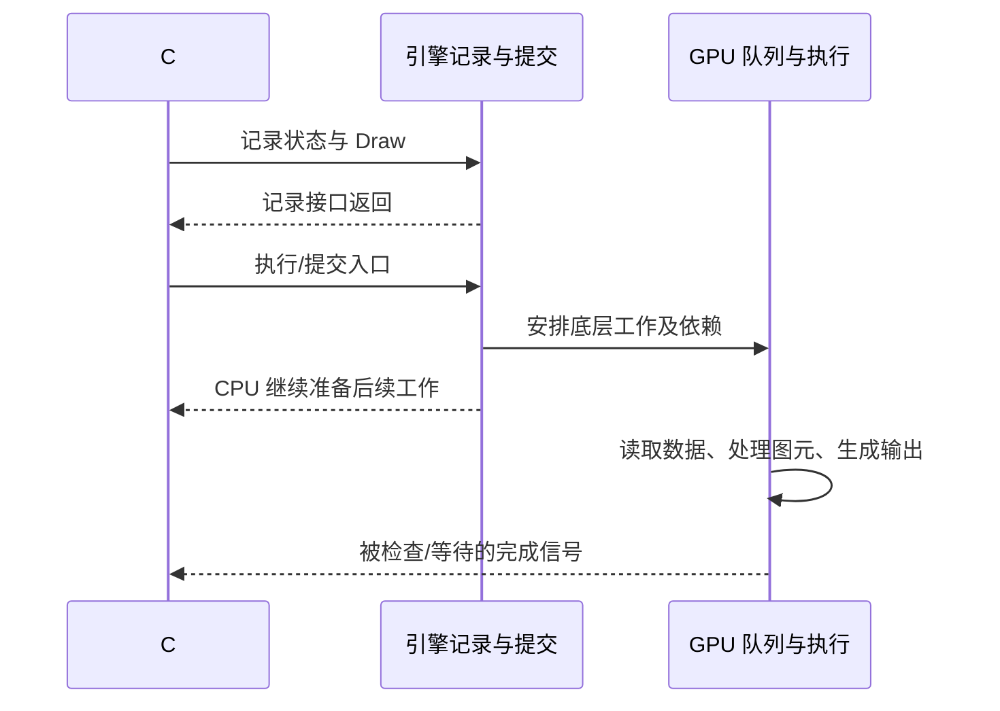

# B03｜管线状态、Draw 命令、队列与 CPU/GPU 并行

> 核心问题：Unity 调用 Draw 以后，CPU、引擎和 GPU 分别做了什么？为什么函数返回时不一定已经产生像素？
>
> 结论：Draw 描述一次使用指定状态与资源的几何工作。记录、提交、GPU 执行和完成是不同事件；CPU 与 GPU 可以重叠工作，只有明确的依赖和完成证据才能确定资源何时安全可用。

本卡面向普通 Unity 图形绘制及 NPR（非真实感渲染）。文档依据本地 Unity 6.7 Beta / 6000.7（2026-06-26），公开 C# 源码固定到 UnityCsReference `9d487cab41b00c50af020b56d27a3c768d54f770`。D3D12 只作为一种底层 API 的具体参照，不声称每个 Unity CommandBuffer 都对应一个原生 Command List。

## 1. 一个 Draw 至少要回答哪些问题

| 类别   | 需要明确的输入                 |
| ---- | ----------------------- |
| 几何   | 顶点/索引缓冲、布局、拓扑、索引范围、实例信息 |
| 程序   | 使用哪个顶点、片元等阶段程序，以及对应变体   |
| 资源   | 常量、纹理、采样器与缓冲绑定          |
| 固定状态 | 面剔除、深度、模板、混合、写掩码等       |
| 输出   | 颜色/深度目标、视口、裁剪矩形等        |

**绑定 binding** 表示选择资源及访问方式；**管线状态 pipeline state** 表示怎样解释输入和处理输出；**命令 command** 表示要执行什么操作；**队列 queue** 承载交给 GPU 的工作。

D3D12 的 PSO（Pipeline State Object）组合了 Shader、部分拓扑类型、混合、深度模板、附件格式等状态；具体资源绑定、视口等还通过其他命令设置。一个 Unity Material 不等于一个完整 PSO，也不等于一份顶点数据。[D3D12 管线状态](https://learn.microsoft.com/en-us/windows/win32/direct3d12/managing-graphics-pipeline-state-in-direct3d-12)

## 2. 四个时间点必须分别画出来



这张图表达依赖，不保证存在一条独立渲染线程，也不保证每次入口调用都立即触发一个操作系统级提交。Unity 的线程模式、后端和批处理会影响映射。

一次 Draw 可能处理许多三角形；一次原生提交可以包含许多 Draw；一个 Unity Renderer 可能因阴影、深度、主体、描边等 Pass 产生多次绘制。不能把 Renderer 数、材质数、Unity API 调用数、抓帧 Draw 数、队列提交数合并成一个指标。

GPU 内部不同工作可以流水化或重叠，但必须满足 API 的可观察顺序与资源依赖。不能把命令列表画成“每条 Draw 整体完成后，下一条才开始任何阶段”，也不能反过来认为并行会忽略依赖。[D3D12 命令执行与同步](https://learn.microsoft.com/en-us/windows/win32/direct3d12/executing-and-synchronizing-command-lists)

## 3. Unity 三个入口的不同语义

| Unity 调用 | 公开语义 | 不能从返回值推断什么 |
| --- | --- | --- |
| `CommandBuffer.DrawMesh` | 向命令缓冲添加绘制命令 | 尚不能推断已经产生 GPU 像素 |
| `ScriptableRenderContext.ExecuteCommandBuffer` | 将命令安排到当前 SRP 上下文 | 不是 CPU 等待 GPU 完成 |
| `ScriptableRenderContext.Submit` | 把上下文安排的工作提交给渲染循环 | 不等于每次 Draw 一个 Submit，也不是同步读回 |

另有 `Graphics.ExecuteCommandBuffer`，文档称立即执行缓冲中的命令。这里应与“等待某个相机/SRP 挂接点”区分，不能解释为函数自带 GPU 完成栅栏。下面离屏实验使用该入口，**没有使用 SRP context，也不代表 URP Render Graph 的实际记录路径**。

`DrawMesh` 的 `shaderPass=-1` 默认表示所有 Pass，本例明确传 `0`，避免把一次 API 调用误认为必然只绘制一个 Pass。该接口不自动为普通 Lit Shader 准备完整灯光、阴影和探针数据，因此实验使用完全自给输入的 Shader。[DrawMesh](https://docs.unity3d.com/6000.0/Documentation/ScriptReference/Rendering.CommandBuffer.DrawMesh.html)、[Graphics.ExecuteCommandBuffer](https://docs.unity3d.com/6000.0/Documentation/ScriptReference/Graphics.ExecuteCommandBuffer.html)、[Submit](https://docs.unity3d.com/6000.0/Documentation/ScriptReference/Rendering.ScriptableRenderContext.Submit.html)

## 4. 公开源码读到哪里就停在哪里

固定提交的 [RenderingCommandBuffer.cs](https://github.com/Unity-Technologies/UnityCsReference/blob/9d487cab41b00c50af020b56d27a3c768d54f770/Runtime/Export/Graphics/RenderingCommandBuffer.cs) 中，`DrawMesh` 检查 Mesh、Material 与子网格参数后调用 `Internal_DrawMesh`。

[ScriptableRenderContext.cs](https://github.com/Unity-Technologies/UnityCsReference/blob/9d487cab41b00c50af020b56d27a3c768d54f770/Runtime/Export/RenderPipeline/ScriptableRenderContext.cs) 中，`ExecuteCommandBuffer` 检查空对象/已释放对象并调用原生绑定；`Submit` 校验上下文并调用 `Submit_Internal`。

这些源码足以确认托管包装与原生入口，不足以证明原生命令编码、驱动批处理、硬件队列和实际同步点。后者应由对应后端源码（若可获得）或抓帧/性能工具补证，不杜撰 `Internal_DrawMesh → 某固定 D3D Draw → 立即像素完成` 的调用栈。

## 5. 吞吐与延迟的简单反例

假设 CPU 每帧准备 4 ms，GPU 每帧执行 7 ms，资源足够且两者能理想重叠，无额外瓶颈。在稳态，帧间隔可以接近 `max(4,7)=7 ms`；串行相加得到的 `11 ms` 则描述该简化单帧从开始准备到执行完成的路径长度。

这不是实际游戏的 FPS 公式。垂直同步、Present、队列积压、锁步等待和其他阶段都会改变结果。增加排队深度有时改善吞吐，也可能增加输入到显示的延迟。用更多 CPU/GPU 重叠解释性能时，必须同时考虑延迟。

CPU 计时器包住 `ExecuteCommandBuffer` 只能测该调用在 CPU 上花费的时间，不能直接给出对应 GPU Draw 耗时。GPU 时间戳或工具标记应包围实际 GPU 工作，并正确处理异步获取结果。

## 6. 完整离屏实验：记录不执行，图像就不更新

在空测试场景中创建空对象，挂下面的 `B03CommandLab.cs`，把紧随其后的 Shader 资产拖到 `Lab Shader`。进入 Play Mode，在 Game 窗口观察左上角预览。脚本只持有自己创建的 Mesh、Material、RenderTexture，不需要场景光和相机矩阵。

```csharp
using UnityEngine;
using UnityEngine.Rendering;

public class B03CommandLab : MonoBehaviour
{
    public Shader labShader;
    public bool execute = true;
    public bool drawTriangle = true;
    RenderTexture target;
    Mesh mesh;
    Material material;
    CommandBuffer commands;

    void Start()
    {
        if (labShader == null || !labShader.isSupported)
        {
            Debug.LogError("Assign the supported B03ClipTriangle shader.");
            enabled = false;
            return;
        }
        material = new Material(labShader);
        mesh = new Mesh { name = "B03 Owned Triangle" };
        mesh.vertices = new Vector3[] {
            new Vector3(-0.8f,-0.7f,0.5f),
            new Vector3(0,0.8f,0.5f),
            new Vector3(0.8f,-0.7f,0.5f) };
        mesh.triangles = new int[] { 0, 1, 2 };
        target = new RenderTexture(128,128,0,RenderTextureFormat.ARGB32);
        target.name = "B03 Owned Target";
        target.Create();
        commands = new CommandBuffer { name = "B03 Record Versus Execute" };
    }
    void Update()
    {
        if (commands == null) return;
        commands.Clear();
        commands.SetRenderTarget(target);
        commands.SetViewport(new Rect(0,0,128,128));
        commands.ClearRenderTarget(false,true,Color.black);
        if (drawTriangle)
            commands.DrawMesh(mesh,Matrix4x4.identity,material,0,0);
        if (execute)
            Graphics.ExecuteCommandBuffer(commands);
    }
    void OnGUI()
    {
        if (target != null)
            GUI.DrawTexture(new Rect(10,10,256,256),target,ScaleMode.ScaleToFit,false);
    }
    void OnDestroy()
    {
        if (commands != null) commands.Release();
        if (target != null) { target.Release(); Destroy(target); }
        if (material != null) Destroy(material);
        if (mesh != null) Destroy(mesh);
    }
}
```

保存为 `B03ClipTriangle.shader`。VS 直接把 Mesh 数值解释为齐次裁剪位置，`w=1`；本例故意绕开相机和物体矩阵，只隔离命令执行。

```shaderlab
Shader "Encyclopedia/B03ClipTriangle"
{
    SubShader
    {
        Tags { "RenderPipeline"="UniversalPipeline" }
        Pass
        {
            Cull Off
            ZWrite Off
            ZTest Always
            Blend Off
            HLSLPROGRAM
            #pragma target 3.0
            #pragma vertex Vert
            #pragma fragment Frag
            float4 Vert(float3 position:POSITION):SV_POSITION
            {
                return float4(position,1);
            }
            float4 Frag():SV_Target
            {
                return float4(0.1,0.7,0.3,1);
            }
            ENDHLSL
        }
    }
}
```

先保持 Execute 和 Draw Triangle 都开，确认有三角形；再按顺序实验：

| 操作 | 预期 |
| --- | --- |
| 关闭 Execute，再关闭 Draw Triangle | 只改变了后续记录，目标应暂留上一张图像；以资源未丢失为前提 |
| 重新开启 Execute，Draw Triangle 保持关闭 | 清屏开始生效，目标变黑 |
| 重新开启 Draw Triangle | 清屏之后执行 Draw，三角形恢复 |

必须先执行一次有效绘制，才能讨论“保留上一张图像”；新建 RenderTexture 的未初始化内容没有这个保证。GUI 预览自身也产生绘制，不能把整个帧的 Draw 总数当作实验命令数量。

抓帧时定位 `B03 Record Versus Execute` 标记与命名目标，检查 Clear、Draw、顶点/索引、附件和最终颜色。不同工具不一定呈现同名事件；名称只用于定位。UI 预览不是 CPU 读回，也没有给出 GPU 完成时间。本例没有完整恢复任意外部渲染状态，限定独立测试场景；正式管线集成应使用受控 Pass 和资源声明。

## 7. NPR 应用与自测

主体、阴影和反壳描边可能是多个 Draw，彼此有不同状态。SRP Batcher 主要优化 CPU 状态准备，不能根据其名字认定多个物体被合成一条 GPU Draw；Instancing 又有不同的数据与程序约束。分析角色成本时应逐个检查实际事件与资源依赖。

自测：① 清空 CommandBuffer 是否清空 RenderTexture？**不会，前者清记录；要执行清屏命令才改变目标。** ② Submit 是否必须每个 Draw 调一次？**不是。** ③ CPU 返回说明 GPU 完成吗？**不能据此推断。** ④ 一次 `DrawMesh` 默认只用第一个 Pass 吗？**不是，默认 -1；实验明确选择 0。**

验证状态：Python 检查理想流水线的算术，不能验证真实并行；C#/Shader 只做接口和结构核对，未运行 Unity、抓帧或测时。本地来源位于 `E:\Claude Skills\学习仓库\09_Unity官方文档\Documentation\en` 的 `ScriptReference/Graphics.ExecuteCommandBuffer.html`、`Rendering.CommandBuffer.DrawMesh.html`、`Rendering.ScriptableRenderContext.ExecuteCommandBuffer.html`、`Rendering.ScriptableRenderContext.Submit.html`。

下一张：[B04｜顶点读取、图元处理与面剔除](B04-顶点读取图元处理与面剔除.md)。
