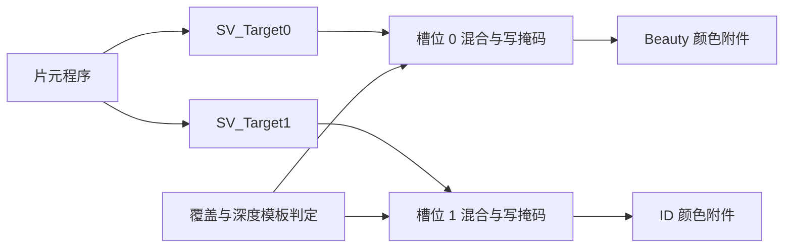

# C03｜颜色与深度附件、MRT 与写掩码

> **核心问题：片元输出 `float4` 之后，它究竟进入哪张图？关闭颜色写入后，这次 Draw 是否就没有工作？**
> 
> Shader 输出语义选择的是绑定槽位；颜色附件、深度/模板附件和写掩码共同决定哪些数据更新。**产生输出值、更新附件、写回外部显存、最终显示是不同事件。**

## 1. 范围与必要概念

示例为 Unity 6 / URP 项目中的独立离屏 Draw，直接使用 CommandBuffer，不接入相机 Render Graph。依据本地 Unity 6.7 Beta / 6000.7、2026-06-26 构建文档。使用两个同尺寸、单样本 RGBA8 颜色附件和一个深度/模板附件；不讨论数组层、XR、动态分辨率或完整 GBuffer。

- **附件（attachment）**：在一次渲染操作中作为颜色或深度/模板输入输出使用的图像资源/子资源。
- **RenderTexture**：Unity 的可渲染纹理对象，可配置颜色和深度/模板格式；其对象身份不等于 GPU 的输出槽位。
- **MRT（Multiple Render Targets）**：一次 Draw 同时输出到多个颜色附件。
- **`SV_Target0/1`**：HLSL 颜色输出槽位 0/1，与 ShaderLab Pass 编号不同。
- **ColorMask**：允许写入的颜色通道。它不是纹理采样遮罩，也不是 Stencil 的位掩码。

## 2. 从输出寄存器到绑定附件

设 CommandBuffer 绑定颜色数组 `[Beauty, ID]`，深度绑定 `Depth`：



改成 `[ID, Beauty]` 后，`SV_Target0` 就进入 ID 资源。Shader 不知道 C# 变量叫 Beauty 还是 ID。输出槽位 1 也不表示“执行第二个 Pass”。

同一次普通 MRT Draw 的输出受同一套片元覆盖和深度/模板判定约束，颜色槽位可以有各自的混合/写掩码状态，具体能力受图形后端限制。颜色和深度附件的尺寸、样本数等必须形成后端支持的组合；创建了两张纹理不代表它们能任意绑定在一起。

Unity 提供 `SetRenderTarget(RenderTargetIdentifier[] colors, RenderTargetIdentifier depth)`。同时可用的颜色附件数量查询 `SystemInfo.supportedRenderTargetCount`；即使语法允许索引 0—7，也不能推断目标设备一定支持八个附件。[Unity SetRenderTarget](https://docs.unity3d.com/6000.0/Documentation/ScriptReference/Rendering.CommandBuffer.SetRenderTarget.html)、[MRT 数量能力](https://docs.unity3d.com/6000.0/Documentation/ScriptReference/SystemInfo-supportedRenderTargetCount.html)（API 内容已对照本地 6000.7）。

## 3. 格式决定数值如何保存

| 资源用途 | 本卡格式/规则 | 理由 |
| --- | --- | --- |
| 演示颜色 | `R8G8B8A8_UNorm` | 每通道 8 位归一化数值，实验不自动加 sRGB 编码 |
| 0—255 ID | 同格式，仅写 R，`id/255` | 易观察的教学编码；必须保持不混合、不做 sRGB 转换、不做插值过滤 |
| 深度/模板 | 请求 `D24_UNorm_S8_UInt` | 与颜色分离；设备可能采用兼容格式，需检查实际资源 |

对本卡单样本、未过滤的 UNorm ID，读取后用 `round(r×255)` 恢复编号。若把两个对象 ID 做双线性插值或颜色式 MSAA Resolve，边界可能产生根本不存在的 ID。生产系统可根据用途选择整数附件或其他编码，但必须核对对应格式的渲染、采样和平台能力。

写入 sRGB 颜色目标可能涉及颜色编码；ID、法线和遮罩等数据不应未经设计就走同一套颜色转换。相同的 `float4` 位于不同格式的附件中，存储含义和精度可能不同。

## 4. ColorMask 只限制指定颜色通道

`ColorMask RGB 0`：只允许槽位 0 更新 RGB；Alpha 保留原值。`ColorMask R 1`：槽位 1 只更新红通道。`ColorMask 0 0`：槽位 0 的 RGBA 都不更新。省略目标索引时的普通写法使用默认目标，做 MRT 实验时显式写索引更清楚。[Unity ColorMask 参考](https://docs.unity3d.com/6000.0/Documentation/Manual/SL-ColorMask.html)

掩掉的通道不会自动清零，而是保留原有内容；若附件内容未初始化，则不能假定它是黑色。Clear 是独立命令，不能把 Draw 的 ColorMask 当作清除命令的控制器。

ColorMask 0 并不自动关闭深度写入、Stencil 操作、顶点工作或其他附件输出。驱动可能优化不再需要的颜色计算，但这不是“所有阶段都不执行”的保证。

128×128 的 RGBA8 颜色有效载荷为 `128×128×4=65,536 B=64 KiB`；两个为 128 KiB，不含深度、元数据、对齐和压缩。MRT 可以共享一次几何和着色过程，增加颜色输出却仍会产生资源容量、导出和后续读取成本。容量的二倍不证明 GPU 时间或外部显存流量恰好二倍。

## 5. Unity 实验：一个 Draw 写颜色和 ID

保存下面 Shader 为 `C03MRTLab.shader`，C# 为 `C03MRTLab.cs`。创建实验材质赋给空物体上的脚本，在 Play 模式观察 Game 视图。独立副本：[Shader](../实验/C03MRTLab.shader)、[C#](../实验/C03MRTLab.cs)。

脚本拥有离屏资源与 Mesh，材质由 Inspector 提供；停止/销毁时只释放脚本创建的资源。实验自己设定裁剪空间坐标、视口和目标，不依赖相机矩阵。

```shaderlab
Shader "Encyclopedia/C03MRTLab"
{
    Properties
    {
        [IntRange] _Id("ID",Range(0,255))=128
        [Enum(All,15,None,0)] _ColorMask("Slot 0 Color Mask",Float)=15
    }
    SubShader
    {
        Tags { "RenderPipeline"="UniversalPipeline" }
        Pass
        {
            Cull Off ZTest Always ZWrite On Blend Off
            ColorMask [_ColorMask] 0
            ColorMask R 1
            HLSLPROGRAM
            #pragma target 3.5
            #pragma vertex Vert
            #pragma fragment Frag
            #include "Packages/com.unity.render-pipelines.universal/ShaderLibrary/Core.hlsl"
            CBUFFER_START(UnityPerMaterial)
                float _Id, _ColorMask;
            CBUFFER_END
            struct Attributes { float3 position:POSITION; float2 uv:TEXCOORD0; };
            struct Varyings { float4 positionCS:SV_POSITION; float2 uv:TEXCOORD0; };
            struct Output { float4 color:SV_Target0; float4 id:SV_Target1; };
            Varyings Vert(Attributes input)
            {
                Varyings o;
                o.positionCS=float4(input.position.xy,0.5,1);
                o.uv=input.uv;
                return o;
            }
            Output Frag(Varyings input)
            {
                Output o;
                o.color=float4(input.uv,0.2,1);
                o.id=float4(round(_Id)/255.0,0,0,1);
                return o;
            }
            ENDHLSL
        }
    }
}
```

```csharp
using UnityEngine;
using UnityEngine.Rendering;
using UnityEngine.Experimental.Rendering;

public class C03MRTLab : MonoBehaviour
{
    public Material labMaterial;
    public bool swapBindings;
    RenderTexture beauty, id;
    Mesh quad;
    CommandBuffer commands;
    bool ready;

    void Start()
    {
        if(labMaterial==null || !labMaterial.shader.isSupported ||
           SystemInfo.supportedRenderTargetCount<2)
        {
            Debug.LogError("Assign the C03 material; device must support two MRTs.");
            return;
        }
        var d=new RenderTextureDescriptor(128,128);
        d.graphicsFormat=GraphicsFormat.R8G8B8A8_UNorm;
        d.depthStencilFormat=GraphicsFormat.D24_UNorm_S8_UInt;
        d.msaaSamples=1;
        beauty=new RenderTexture(d) { name="C03 Beauty", filterMode=FilterMode.Point };
        d.depthStencilFormat=GraphicsFormat.None;
        id=new RenderTexture(d) { name="C03 ID", filterMode=FilterMode.Point };
        if(!beauty.Create() || !id.Create() ||
           beauty.graphicsFormat!=GraphicsFormat.R8G8B8A8_UNorm ||
           id.graphicsFormat!=beauty.graphicsFormat ||
           beauty.depthStencilFormat==GraphicsFormat.None)
        {
            Debug.LogError("C03 attachment creation/format requirements failed.");
            return;
        }
        quad=new Mesh { name="C03 Owned Quad" };
        quad.vertices=new Vector3[] {
            new Vector3(-0.8f,-0.8f,0),new Vector3(0.8f,-0.8f,0),
            new Vector3(0.8f,0.8f,0),new Vector3(-0.8f,0.8f,0) };
        quad.uv=new Vector2[] { Vector2.zero,Vector2.right,Vector2.one,Vector2.up };
        quad.triangles=new int[] {0,1,2,0,2,3};
        commands=new CommandBuffer { name="C03 One Draw Two Attachments" };
        ready=true;
        Debug.Log("C03 actual depth format: "+beauty.depthStencilFormat);
    }

    void Update()
    {
        if(!ready || labMaterial==null) return;
        var colors=new RenderTargetIdentifier[] {
            swapBindings ? id : beauty, swapBindings ? beauty : id };
        commands.Clear();
        commands.SetRenderTarget(colors,new RenderTargetIdentifier(beauty));
        commands.SetViewport(new Rect(0,0,128,128));
        commands.ClearRenderTarget(true,true,Color.clear);
        commands.DrawMesh(quad,Matrix4x4.identity,labMaterial,0,0);
        Graphics.ExecuteCommandBuffer(commands);
    }

    void OnGUI()
    {
        if(!ready) return;
        GUI.Label(new Rect(10,10,256,25),"Beauty resource");
        GUI.Label(new Rect(280,10,256,25),"ID resource");
        GUI.DrawTexture(new Rect(10,40,256,256),beauty,ScaleMode.ScaleToFit,false);
        GUI.DrawTexture(new Rect(280,40,256,256),id,ScaleMode.ScaleToFit,false);
    }

    void OnDestroy()
    {
        if(commands!=null) commands.Release();
        if(beauty!=null) { beauty.Release(); Destroy(beauty); }
        if(id!=null) { id.Release(); Destroy(id); }
        if(quad!=null) Destroy(quad);
    }
}
```

### 预测与操作

1. 默认绑定、Slot 0 Color Mask=All、ID=128：左图显示 UV 渐变方块，右图显示红色方块。右图只有 R 被写入，G/B/A 仍为清除值 0；虽然 Shader 输出的 ID Alpha 是 1，写掩码仍阻止它落入附件。
2. GUI 预览故意关闭 Alpha 混合，否则右图 Alpha 为 0 会让数据看起来消失。预览用于观察模式，准确通道值应在 GPU 抓帧中检查。
3. 把 Slot 0 Color Mask 改为 None：Beauty 维持清除后的黑色，ID 仍有红色方块。一次 Draw 仍然能更新槽位 1，且深度写入没有被 ColorMask 禁用。
4. 恢复 All，启用 Swap Bindings：左侧 Beauty 资源接收槽位 1 的红色 ID；右侧 ID 资源接收槽位 0 的 UV 渐变。注意画面交换源自绑定变化，不是换了 Shader Pass。
5. 在 Frame Debugger 或 RenderDoc 中定位命令名称，查看同一次 Draw 的两个输出绑定、格式和写掩码。GUI 为显示结果还会产生其他 Draw，不能拿整帧 Draw 总数当成本实验的离屏 Draw 数。

排查：先看 Console 的能力和格式错误，再查 Shader 是否支持 MRT、是否使用了指定材质；全黑时先看 ID 是否为 0，再检查清除与 Draw 顺序；数值错时先查槽位、ColorMask、Blend、格式，再查读取过滤。

## 6. 从附件写入到最终像素

输出通过覆盖、深度/模板及写掩码后，逻辑上更新目标。物理数据可能暂存在缓存或 tile memory；什么时候存到外部内存、是否需要 Resolve，取决于资源与渲染过程。随后后处理可能采样、转换并写入另一张目标，最终显示的像素未必就是本 Draw 写的那份数值。

**NPR 应用：** 一次绘制同时保存角色颜色和对象/材质区域 ID，后续根据 ID 做描边或局部调色。把 ID 混合成小数或通过 sRGB 改写，会产生假区域；把 ColorMask 0 当作“不写深度”，会让隐藏控制 Pass 意外挡住角色。

## 7. 自测与答案

1. **SV_Target1 是否要求第二次 Draw？** 不需要，它是同一次片元程序的另一个颜色输出槽。
2. **输出 ID Alpha=1，附件 Alpha 为什么为 0？** 本实验槽位 1 仅允许 R 写入，Alpha 保留清除值。
3. **ColorMask 0 后 GPU 是否无需运行？** 不能保证；其他附件、深度/模板、几何和副作用仍可能需要执行。
4. **两张 RGBA8 128² 附件是否总共只占 128 KiB 显存？** 128 KiB 是颜色有效载荷估算，还可能有深度、对齐与内部元数据。

记住：槽位由绑定决定；格式定义数据；写掩码保留旧通道；附件更新不等于立刻写回显存或显示。

## 8. 来源与验证边界

本地文档根目录：`E:\Claude Skills\学习仓库\09_Unity官方文档\Documentation\en`。核对页面：`Manual/SL-ColorMask.html`、`ScriptReference/Rendering.CommandBuffer.SetRenderTarget.html`、`ScriptReference/SystemInfo-supportedRenderTargetCount.html`、`ScriptReference/RenderTextureDescriptor-depthStencilFormat.html`。

HLSL 输出槽位参考：[Microsoft HLSL 语义](https://learn.microsoft.com/en-us/windows/win32/direct3dhlsl/dx-graphics-hlsl-semantics)。公开资料证明 API 和输出约定，不暴露 Unity 原生渲染后端完整实现。实验完成文本与接口核对，尚未在 Unity 编译、抓帧或实机验证。

前一张：[C02 透明合成](C02-混合预乘Alpha与透明排序.md)。下一张：[C04 MSAA、覆盖与 Resolve](C04-MSAA覆盖AlphaToCoverage与Resolve.md)。
