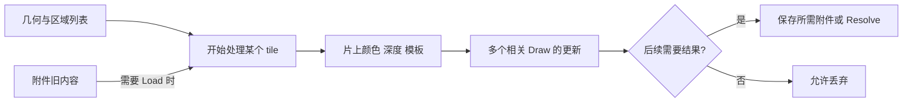

# C05｜分块 GPU、tile memory 与附件 Load/Store

> **核心问题：两种实现的 Draw 数相同，为什么在手机上可能有不同的带宽成本？**
> 
> Draw 数不描述附件是否被反复保存和重新载入。分块 GPU 可以在片上处理一小块屏幕的颜色、深度和模板；合理的附件生命周期让这些中间结果尽量留在片上。Load/Store 首先是数据有效性的约定，性能收益取决于真实硬件和后端执行。

## 1. 范围与术语

本卡依据本地 Unity 6.7 Beta / 6000.7 文档（2026-06-26 构建），实验为 Unity 6 / URP 中独立 CommandBuffer，不接入相机 Render Graph。不把某代移动 GPU 的内部流程当作所有设备的标准。

- **tile**：屏幕的一块区域，尺寸和处理策略由硬件决定，不必等于 Compute Shader 的线程组。
- **tile memory / tile buffer**：处理该区域附件时使用的片上存储；不同架构的实现和容量不同。
- **attachment（附件）**：在渲染过程中接受颜色或深度/模板结果的图像资源。
- **Load**：开始使用附件时是否需要原内容；**Store**：结束这段使用后是否需要保留结果。
- **原生 render pass**：图形 API/后端安排的附件处理范围。它不等同于一个 ShaderLab Pass，也不等同于一个 C# 方法或一个 Render Graph 节点。

## 2. 从逻辑图像到片上处理

一个简化分块模型是：处理几何并确定它影响哪些屏幕区域，随后逐块执行相关光栅和片元工作，尽量在片上完成该块的深度测试、混合等操作，最后按需求保存附件。真实 GPU 可重叠或细分这些过程，也可能有额外隐藏面消除机制。



片元混合需要目标颜色，但这次访问可能命中片上数据，并不必然访问外部 DRAM。反过来，额外中间纹理、跨渲染范围读取以及不必要的保存/载入，可能增加外部流量。

Khronos 的附件示例展示了移动设备上 Load/Store 选择对外部读写的影响，也强调未覆盖区域的初始化。它是具体示例的测量，不能把其节省比例搬到本卡实验。[Khronos render pass 附件示例](https://docs.vulkan.org/samples/latest/samples/performance/render_passes/README.html)

## 3. Load/Store 先回答正确性

| 操作 | 对内容的承诺 | 适用判断 |
| --- | --- | --- |
| Load | 保留已有内容 | 局部更新、与已有颜色混合、继续使用已有深度 |
| Clear | 建立已知初始内容 | 未覆盖部分也需要确定背景/深度 |
| DontCare（Load） | 不保证原内容有效 | 后续所有会用到的数据都能先被正确生成 |
| Store | 结果要保留供后续使用 | 后处理采样、复制、显示、下一段渲染需要它 |
| DontCare（Store） | 后续不需要结果，可以丢弃 | 仅当前范围使用的临时附件 |
| Resolve / StoreAndResolve | 生成单样本结果；后者还保留多样本版本 | MSAA 资源分别需要哪些后续用途 |

Unity 文档说明部分平台可能忽略 Load/Store 提示，但调用者不能以此依赖被声明为无须保留的数据。`DontCare` 不是 Clear，也不是“自动写黑色”。[Load 枚举](https://docs.unity3d.com/6000.0/Documentation/ScriptReference/Rendering.RenderBufferLoadAction.html)、[Store 枚举](https://docs.unity3d.com/6000.0/Documentation/ScriptReference/Rendering.RenderBufferStoreAction.html)

**反例：** 先画全屏红，再用 DontCare 开始一次只画右半边的绿色更新。右边是新数据，左边没有有效内容保证。左边可能仍红、变黑或出现其他结果；某设备“看起来没问题”不证明这种用法正确。把深度也如此丢弃，却继续依赖旧深度遮挡，错误可能表现为缺面而非颜色噪点。

只看到“全屏 Draw”也不足以选 DontCare：Alpha Blend 读取目标颜色；clip、深度失败、ColorMask 和不完全样本覆盖都可能使一部分数据没有被覆盖。需要分析所有会被后续读取的通道、样本和区域。

## 4. 为什么 Pass 数不等于显存往返次数

多个兼容操作可能被后端合并，或者使用原生子通道/附件读取保留局部数据；反过来，跨像素任意采样、附件变化、依赖和容量限制可能打断这种机会。Render Graph 在后续 D 阶段讨论具体记录和合并条件，本卡不承诺“连续两个 Pass 必合并”。

在 1920×1080 RGBA8 的未压缩有效载荷模型中，一张颜色图约为 7.91 MiB；一次完整保存再载入约 15.82 MiB，60 帧/秒约 949 MiB/s。计算为 `1920×1080×4×2×60 / 2^20`。它不包括深度/MSAA，也不考虑压缩、缓存、局部覆盖和实际事务，因此不是测得的总线流量。

Memoryless / transient 附件可以表达仅在受限渲染范围内使用的资源意图；它不是“随时能用普通纹理采样却不占外部存储”的开关。若后处理需要深度或颜色，应检查对应数据的保留/复制路径，不得提前丢弃。

## 5. Unity 实验：保留、清除与丢弃旧内容

保存下面两份文件，URP 场景空物体挂 `C05LoadStoreLab`，把 Shader 拖到 Lab Shader。脚本创建一个 256² 单样本、无深度目标，两次提交各画一次：第一步全红，第二步只画右半边绿。每帧重新建立第一步，因此模式切换不会依赖上一帧垃圾内容。

本地文档指出 `RenderBufferLoadAction.Clear` 当前只与 RenderPass API 一起工作，因此本实验的 Clear 模式使用显式 `ClearRenderTarget`。它验证初始化结果，不声称这一写法必然形成某一种原生快速清除。

独立副本：[C#](../实验/C05LoadStoreLab.cs)、[Shader](../实验/C05LoadStoreLab.shader)。

```shaderlab
Shader "Encyclopedia/C05LoadStoreLab"
{
    Properties { _Color("Color",Color)=(1,0,0,1) }
    SubShader
    {
        Tags { "RenderPipeline"="UniversalPipeline" }
        Pass
        {
            Cull Off ZTest Always ZWrite Off Blend Off
            HLSLPROGRAM
            #pragma vertex Vert
            #pragma fragment Frag
            float4 _Color;
            float4 Vert(float3 p:POSITION):SV_POSITION { return float4(p.xy,0.5,1); }
            float4 Frag():SV_Target { return _Color; }
            ENDHLSL
        }
    }
}
```

```csharp
using UnityEngine;
using UnityEngine.Rendering;
using UnityEngine.Experimental.Rendering;

public class C05LoadStoreLab : MonoBehaviour
{
    public enum OldContent { Preserve, ClearBlack, Discard }
    public Shader labShader;
    public OldContent oldContent;
    RenderTexture target;
    Material material;
    Mesh quad;
    CommandBuffer first, second;
    MaterialPropertyBlock red, green;
    bool ready;
    void Start()
    {
        if(labShader==null || !labShader.isSupported) return;
        var d=new RenderTextureDescriptor(256,256);
        d.graphicsFormat=GraphicsFormat.R8G8B8A8_UNorm;
        d.depthStencilFormat=GraphicsFormat.None;
        d.msaaSamples=1;
        target=new RenderTexture(d) { name="C05 Color", filterMode=FilterMode.Point };
        if(!target.Create()) { Debug.LogError("C05 target creation failed."); return; }
        material=new Material(labShader);
        quad=new Mesh { name="C05 Owned Quad" };
        quad.vertices=new Vector3[] {
            new Vector3(-1,-1,0),new Vector3(1,-1,0),
            new Vector3(1,1,0),new Vector3(-1,1,0) };
        quad.triangles=new int[] {0,1,2,0,2,3};
        red=new MaterialPropertyBlock(); red.SetColor("_Color",Color.red);
        green=new MaterialPropertyBlock(); green.SetColor("_Color",Color.green);
        first=new CommandBuffer { name="C05 Full Red" };
        second=new CommandBuffer { name="C05 Partial Green" };
        ready=true;
    }
    void Update()
    {
        if(!ready) return;
        first.Clear();
        first.SetRenderTarget(target,RenderBufferLoadAction.DontCare,RenderBufferStoreAction.Store);
        first.SetViewport(new Rect(0,0,256,256));
        first.DrawMesh(quad,Matrix4x4.identity,material,0,0,red);
        Graphics.ExecuteCommandBuffer(first);

        second.Clear();
        var load=oldContent==OldContent.Preserve ? RenderBufferLoadAction.Load : RenderBufferLoadAction.DontCare;
        second.SetRenderTarget(target,load,RenderBufferStoreAction.Store);
        second.SetViewport(new Rect(0,0,256,256));
        if(oldContent==OldContent.ClearBlack) second.ClearRenderTarget(false,true,Color.black);
        second.SetViewport(new Rect(128,0,128,256));
        second.DrawMesh(quad,Matrix4x4.identity,material,0,0,green);
        Graphics.ExecuteCommandBuffer(second);
    }
    void OnGUI()
    {
        if(!ready) return;
        GUI.Label(new Rect(10,10,700,25),oldContent+" | Discard does not define the left half");
        GUI.DrawTexture(new Rect(10,40,512,512),target,ScaleMode.ScaleToFit,false);
    }
    void OnDestroy()
    {
        if(first!=null) first.Release();
        if(second!=null) second.Release();
        if(target!=null) { target.Release(); Destroy(target); }
        if(material!=null) Destroy(material);
        if(quad!=null) Destroy(quad);
    }
}
```

## 6. 预测、观察与成本边界

1. Preserve：左红右绿；第一步结果被保留，第二步只替换右边。
2. ClearBlack：左黑右绿；黑色来自明确清除，不能归因于 DontCare。
3. Discard：右绿，左边不做确定颜色预测。即使仍红，也不得在产品里依赖它。
4. 查看两个命令组的绑定与 Load/Store。两次 C# 提交不证明硬件恰好进行了两次完整 tile 保存/载入；后端可做优化，性能结论需要原生抓帧及外部内存计数器。
5. 深入成本实验时，在目标移动设备比较同等输出下的兼容连续操作与显式中间目标方案，记录实际原生 render pass、附件尺寸/样本数及读写量。不要直接用本卡三个输出不同的模式宣称等价优化收益。

全黑先查 Shader/目标创建，再查当前模式与视口；左边保留红色不能用于判定 DontCare 是否“失效”。预览自身还有 GUI Draw，不属于两次离屏 Draw。

## 7. NPR 应用与自测

角色颜色、法线、ID 和描边中间图会延长资源寿命。为每张图写下“最后一次写、第一次读、最后一次读”，再决定能否丢弃或保持局部附件访问。深度仅用于当前可见性时和还要用于屏幕空间描边时，Store 需求不同。

1. **DontCare 后为什么不能保证黑色？** 它放弃有效内容承诺，没有赋初始值。
2. **ShaderLab 两个 Pass 是否一定两次外部保存？** 否，需看原生执行与实际资源依赖。
3. **全屏混合 Draw 能否随意丢弃目标旧色？** 不能，混合公式依赖目标值。
4. **写回显存与 Resolve 是一回事吗？** 不是，保存多样本与生成单样本结果是不同需求。

记住：先保证内容有效，再讨论省流量；不要把附件的逻辑生命周期直接当作硬件执行时间表。

## 8. 核验与后续

已核对本地 `ScriptReference/Rendering.RenderBufferLoadAction.html`、`Rendering.RenderBufferStoreAction.html`、`Rendering.CommandBuffer.SetRenderTarget.html`，根目录为 `E:\Claude Skills\学习仓库\09_Unity官方文档\Documentation\en`。线上 Unity 链接为 6000.0 入口，本地核对版本为 6000.7。未运行 Unity 编译、GPU 抓帧或带宽测量。

前一张：[C04 MSAA 与 Resolve](C04-MSAA覆盖AlphaToCoverage与Resolve.md)。下一张：[C06 资源依赖与同步](C06-资源状态读写依赖与同步.md)。
