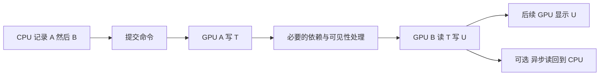

# C06｜资源状态、读写依赖、屏障与 fence

> **核心问题：Compute Shader 生成了一张纹理，后续 Draw 读取它，是否必须让 CPU 等 GPU？**
> 
> 通常不需要。GPU 之间的数据依赖、队列之间的执行顺序和 CPU 读取结果是三个问题。Unity 管理的常规资源访问由引擎处理必要依赖；手动插入 fence 不是每次采样纹理的前置条件。

## 1. 范围与术语

依据本地 Unity 6.7 Beta / 6000.7 文档（2026-06-26 构建），示例使用同一图形队列中的 Compute dispatch，不使用原生插件或 async compute。UnityCsReference 固定提交为 `9d487cab41b00c50af020b56d27a3c768d54f770`，不等同于本地 Editor 原生源码。

- **资源状态/访问用途**：某资源或子资源正在作为可渲染目标、可采样纹理、无序访问写目标、复制源等使用。
- **生产者/消费者**：写出数据的工作/读取该数据的工作。
- **屏障（barrier）**：建立必要的执行、内存可见性或布局/用途转换约束；不同 API 的表达不同。
- **fence**：标记某段 GPU 工作完成点的同步机制；Unity GraphicsFence 的具体语义必须查 Unity，不能直接套用其他 API 同名对象。
- **CPU 读回**：把 GPU 结果变为 CPU 可读取的数据，涉及传输、完成确认和生命周期。

## 2. 有顺序还不够理解同步

假设 A 写纹理 T，B 读 T 并写 U。正确数据流为：



CPU 记录完 B 不等于 A 已在 GPU 完成；硬件不同阶段也可能重叠。数据依赖要求 B 对 T 的访问看到正确的 A 结果，但不要求整个 GPU 停机，更不要求 CPU 同步等待。

常见依赖包括：写后读 RAW（B 读取 A 的结果）、读后写 WAR（B 覆盖前 A 必须完成读取）、写后写 WAW（保持两次写入的必要顺序）。两个互不影响的只读访问通常不需要因为“读了同一资源”就串行化。要分析到实际重叠的子资源/区域及 API 约束。

D3D12 的传统屏障模型区分 transition、UAV、aliasing 等情况；状态变化与 UAV 数据顺序不能简单混为一类。在某些条件下还存在隐式提升/衰减，不能按每个读写都机械增加同样屏障。本文不据此给出 Unity 原生后端的逐条映射。[Microsoft 资源屏障](https://learn.microsoft.com/en-us/windows/win32/direct3d12/using-resource-barriers-to-synchronize-resource-states-in-direct3d-12)

## 3. Unity 帮你做什么，不能帮你猜什么

Unity 的 GraphicsFence 文档明确说明：GPU 任务写资源、另一任务读资源的常规依赖由 Unity 自动处理，不需要仅为此添加 graphics fence。[Unity GraphicsFence](https://docs.unity3d.com/6000.0/Documentation/ScriptReference/Rendering.GraphicsFence.html)

这不意味着可以随意改变算法顺序。若先记录读取旧 T，再记录生成新 T，引擎不能擅自把它变成“先写新 T 再读”：读取旧状态也可能正是算法意图。依赖跟踪确保被请求的顺序和可见性，不替你修正错误的帧次关系。

Render Graph 还需要正确声明资源读写，才能建立可靠的依赖图；原生插件、外部资源和手工异步任务有各自的互操作约定。不能从“Unity 自动处理”推导出无需声明、可以释放仍在使用的资源或可以非法同图读写。

### 四类容易混淆的等待

| 操作 | 主要解决什么 | CPU 是否在这里等 GPU 完成 |
| --- | --- | --- |
| 常规资源依赖 | GPU 生产者到消费者可见性 | 通常无需同步阻塞 CPU |
| `CommandBuffer.WaitOnAsyncGraphicsFence` | GPU 队列等待指定完成点 | 该调用在 CPU 立即返回；等待作用在 GPU |
| `ComputeBuffer.GetData` | 把最新 GPU 缓冲结果取回 CPU | 可能等待已提交写入完成 |
| `AsyncGPUReadback` | 延迟取得 GPU 数据 | 请求不要求立即等结果；之后主动 Wait 会改变这一性质 |

资料：[GPU fence 等待](https://docs.unity3d.com/6000.0/Documentation/ScriptReference/Rendering.CommandBuffer.WaitOnAsyncGraphicsFence.html)、[GetData](https://docs.unity3d.com/6000.0/Documentation/ScriptReference/ComputeBuffer.GetData.html)、[异步读回](https://docs.unity3d.com/6000.0/Documentation/ScriptReference/Rendering.AsyncGPUReadback.html)。异步读回仍有传输、延迟、资源和回调管理成本，不等于免费。

## 4. 多队列的收益与反例

队列之间若安排了生产者 A、消费者 B，需要确保消费者不会在数据可用前访问。适当的 GPU 等待可维持正确性，但如果两边每一步都互相等待，便没有多少可重叠工作。

循环依赖反例：图形队列先等待 Compute 的 F_c，之后才发出 F_g；Compute 又先等待 F_g，之后才发出 F_c。两个完成点都无法到达。Unity 文档说明 Editor 可检测部分循环依赖并报错，但不能以此替代正确设计。

**队列数量不等于硬件核心数量。** Async compute 不保证有独立的整套 ALU；并行任务可能争用执行、缓存或带宽。提高重叠程度是否缩短关键路径，要实测。

固定托管源码中，`CreateGraphicsFence` 调用原生创建入口并验证；`WaitOnAsyncGraphicsFence` 检查类型、有效性和 pending 状态，再调用 `WaitOnGPUFence_Internal`。这说明等待命令的边界，不能读成 C# 在 CPU 循环阻塞。[固定 RenderingCommandBuffer.cs](https://github.com/Unity-Technologies/UnityCsReference/blob/9d487cab41b00c50af020b56d27a3c768d54f770/Runtime/Export/Graphics/RenderingCommandBuffer.cs)

## 5. Unity 实验：生成、读取与顺序反例

实验用两个 Compute kernel：Generate 交替把 Source 写成红/绿，Consume 读取 Source 并把 `1-RGB` 写入 Result。两张纹理始终不同，不进行同一张图的不受控读写。先初始化 Source 为黑色，反转命令顺序时才能确定读的是旧状态。

保存 `C06DependencyLab.compute`、`C06DependencyLab.cs`，空对象挂脚本，把 Compute 资源赋给 Program。无需其他 Shader，也无需读回 CPU。副本：[Compute](../实验/C06DependencyLab.compute)、[C#](../实验/C06DependencyLab.cs)。

```hlsl
#pragma kernel Generate
#pragma kernel Consume
RWTexture2D<float4> _Write;
Texture2D<float4> _Read;
int _Step;

[numthreads(8,8,1)]
void Generate(uint3 id:SV_DispatchThreadID)
{
    if(id.x>=128 || id.y>=128) return;
    float3 c=(_Step & 1)==0 ? float3(1,0,0) : float3(0,1,0);
    _Write[id.xy]=float4(c,1);
}

[numthreads(8,8,1)]
void Consume(uint3 id:SV_DispatchThreadID)
{
    if(id.x>=128 || id.y>=128) return;
    float3 c=_Read.Load(int3(id.xy,0)).rgb;
    _Write[id.xy]=float4(1-c,1);
}
```

```csharp
using UnityEngine;
using UnityEngine.Rendering;

public class C06DependencyLab : MonoBehaviour
{
    public ComputeShader program;
    public bool consumeBeforeGenerate;
    RenderTexture source, result;
    CommandBuffer commands;
    int generate, consume, step;
    bool ready;

    void Start()
    {
        if(program==null || !SystemInfo.supportsComputeShaders ||
           !SystemInfo.SupportsRandomWriteOnRenderTextureFormat(RenderTextureFormat.ARGBFloat))
        {
            Debug.LogError("C06 requires compute and ARGBFloat random writes.");
            return;
        }
        source=MakeTarget("C06 Source");
        result=MakeTarget("C06 Result");
        if(!source.IsCreated() || !result.IsCreated()) return;
        generate=program.FindKernel("Generate");
        consume=program.FindKernel("Consume");
        commands=new CommandBuffer { name="C06 Produce Consume" };
        commands.SetRenderTarget(source);
        commands.ClearRenderTarget(false,true,Color.black);
        commands.SetRenderTarget(result);
        commands.ClearRenderTarget(false,true,Color.black);
        Graphics.ExecuteCommandBuffer(commands);
        ready=true;
        RunNextStep();
    }
    RenderTexture MakeTarget(string label)
    {
        var t=new RenderTexture(128,128,0,RenderTextureFormat.ARGBFloat,RenderTextureReadWrite.Linear);
        t.name=label;
        t.enableRandomWrite=true;
        t.filterMode=FilterMode.Point;
        if(!t.Create()) Debug.LogError("C06 failed to create "+label);
        return t;
    }
    void RecordGenerate()
    {
        commands.SetComputeIntParam(program,"_Step",step);
        commands.SetComputeTextureParam(program,generate,"_Write",source);
        commands.DispatchCompute(program,generate,16,16,1);
    }
    void RecordConsume()
    {
        commands.SetComputeTextureParam(program,consume,"_Read",source);
        commands.SetComputeTextureParam(program,consume,"_Write",result);
        commands.DispatchCompute(program,consume,16,16,1);
    }
    [ContextMenu("Run Next Step")]
    public void RunNextStep()
    {
        if(!ready) return;
        step++;
        commands.Clear();
        if(consumeBeforeGenerate) { RecordConsume(); RecordGenerate(); }
        else { RecordGenerate(); RecordConsume(); }
        Graphics.ExecuteCommandBuffer(commands);
    }
    void OnGUI()
    {
        if(!ready) return;
        if(GUI.Button(new Rect(10,10,180,30),"Run Next Step")) RunNextStep();
        GUI.Label(new Rect(10,45,650,25),"Step "+step+" | Source (left), Result (right)");
        GUI.DrawTexture(new Rect(10,80,256,256),source,ScaleMode.ScaleToFit,false);
        GUI.DrawTexture(new Rect(280,80,256,256),result,ScaleMode.ScaleToFit,false);
    }
    void OnDestroy()
    {
        if(commands!=null) commands.Release();
        if(source!=null) { source.Release(); Destroy(source); }
        if(result!=null) { result.Release(); Destroy(result); }
    }
}
```

## 6. 预测与排查

1. 默认顺序，第一次 Source 绿，Result 洋红；第二次 Source 红，Result 青。GPU 的写后读依赖没有要求脚本先把 Source 读回 CPU。
2. 在 Inspector 勾选 Consume Before Generate，再点击按钮：Result 是上一步 Source 的反色，Source 则已经更新。由于每步交替红绿，Result 与当前 Source 不再是对应反色。
3. 若一开始就勾选反转，第一次 Consume 读已清除的黑色，因此 Result 白色。这个确定初值很重要，否则第一步将不能做可靠预测。
4. Frame Debugger/原生抓帧确认两个 Dispatch 顺序及绑定；原生工具支持时查看状态/屏障。Unity 层看不到某条屏障，不证明引擎没有处理依赖。
5. 不添加“等待修复”反转模式：在 Consume 后面等待 Generate 完成，不能让已经执行的 Consume 回到过去重算。

没有更新先检查是否点击按钮、能力日志和 kernel 名；颜色关系错先看顺序及 Step，再查每个 kernel 的独立纹理绑定。程序不提交异步队列，所以这个实验验证常规依赖和算法顺序，不证明 async compute 的收益。

## 7. NPR 应用、自测与边界

Compute 生成的描边距离场、角色 ID 分类和头发遮罩，通常先留在 GPU 给后续着色读取。只有确实需要 CPU 决策或导出数据时，才设计读回路径；不要为“确认完成”每帧同步 GetData。

1. **GPU 等 fence 是否等于 CPU 卡住？** Unity 的 WaitOnAsyncGraphicsFence 调用不是 CPU 等待，它安排 GPU 队列等待。
2. **同一资源先读后写，引擎会自动改成先写后读吗？** 不会，旧数据可能是合法输入，命令顺序必须符合算法。
3. **一个 fence 能修复错误的数据格式或越界吗？** 不能，它处理的是完成点关系。
4. **AsyncGPUReadback 是否立刻返回结果？** 不保证；异步请求要等完成后读数据，并处理错误和生命周期。

已核对上述源码入口和本地 `GraphicsFence`、`WaitOnAsyncGraphicsFence`、`DispatchCompute`、`SetComputeTextureParam`、`AsyncGPUReadback`、`ComputeBuffer.GetData` 文档。根目录为 `E:\Claude Skills\学习仓库\09_Unity官方文档\Documentation\en`；线上 Unity 引用为 6000.0 入口，本地为 6000.7。未进行 Unity 编译、GPU 抓帧或队列性能测量。

前一张：[C05 Load/Store](C05-分块GPU与附件LoadStore.md)。下一张：[C07 蒙皮与几何数据来源](C07-蒙皮顶点动画与几何数据来源.md)。
