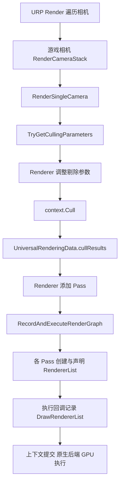

# D01｜URP 相机入口、剔除与 RendererList

>**核心问题：场景中的一个 Renderer，怎样从相机入口进入一次绘制？**
>
>相机先产生剔除参数和结果，再由具体绘制任务选择队列、层、Shader Pass 和排序方式。RendererList 是这套选择及绘制设置的图中入口，不是“所有可见对象各对应一个 Draw”的数组。

## 1. 范围、版本与概念

阅读基线为 Graphics 提交 `275a7f9ad9330e3cf7f3ea57a0b242a551fde291`，其 URP package.json 为 **17.0.4 / Unity 6000.0**。API 同时对照本地 Unity **6.7 Beta / 6000.7** 文档（2026-06-26 构建）。两者不是同一个 Editor 快照，文中的源码链路明确限定于固定提交。

本文追踪普通 URP Forward、单 Base Game Camera、Render Graph 开启的路径，不展开 XR、相机栈、GPU Resident Drawer 或所有调试分支。

- **Renderer**：参与渲染的对象组件，如 MeshRenderer；一个 Renderer 可含多个子网格/材质。
- **Cull / CullingResults**：依据相机、层和相关设置获得后续渲染所需的剔除结果，也含可见光等信息。不是最终像素可见性的证明。
- **DrawingSettings**：选择 Shader Pass、排序、每对象数据等绘制配置。
- **FilteringSettings**：筛选 Render Queue、GameObject Layer、Rendering Layer 等。
- **RendererList / RendererListHandle**：可由渲染上下文或图系统使用的绘制列表及其句柄；创建句柄不等于立即提交 GPU Draw。

## 2. 固定源码中的主干



这是所选路径的主干，省略了灯光、阴影、历史数据和调试准备，并非一份所有配置都严格相同的完整调用栈。

| 源码锚点 | 应读出的关系 |
| --- | --- |
| `UniversalRenderPipeline.RenderCameraStack` / `RenderSingleCamera` | 相机栈和单相机渲染不是同一个概念；本文只保留一个 Base Camera |
| `TryGetCullingParameters` | 取得相机剔除参数；失败可提前返回 |
| `renderer.SetupCullingParameters` | Renderer 有机会按管线需要调整参数 |
| `data.cullResults = context.Cull(...)` | 结果写入该相机的 UniversalRenderingData |
| `renderer.AddRenderPasses(...)` | 收集 Renderer Feature 等提供的任务 |
| `RecordAndExecuteRenderGraph(...)` | 进入图记录/执行；兼容模式走另一条 Setup/Execute 分支 |
| `context.Submit()` | 把上下文工作交给后端执行，不代表 CPU 等到 GPU 完成 |

来源：[固定 UniversalRenderPipeline.cs](https://github.com/Unity-Technologies/Graphics/blob/275a7f9ad9330e3cf7f3ea57a0b242a551fde291/Packages/com.unity.render-pipelines.universal/Runtime/UniversalRenderPipeline.cs)。不要因源码注释写了 “execute” 就把它当成 GPU 已完成的 fence。

UnityCsReference 提交 `9d487cab41b00c50af020b56d27a3c768d54f770` 的 `ScriptableRenderContext.Cull` 调用 `Internal_Cull`。从这个托管入口无法继续声称看到了 Unity 原生剔除算法的全部实现。[固定 ScriptableRenderContext.cs](https://github.com/Unity-Technologies/UnityCsReference/blob/9d487cab41b00c50af020b56d27a3c768d54f770/Runtime/Export/RenderPipeline/ScriptableRenderContext.cs)

## 3. 剔除、列表过滤和深度拒绝是三道不同的问题

1. **相机/场景筛选**：相机 Culling Mask、视锥、bounds 及已启用的剔除机制，决定哪些对象进入候选结果。
2. **某次绘制任务的选择**：在已有结果中选出目标队列、层与可用 Pass，并设置排序与渲染状态。
3. **GPU 可见性**：几何裁剪、面剔除、光栅覆盖、深度/模板、clip 等决定样本是否贡献结果。

RendererList 无法把已被相机 Culling Mask 排除的对象“重新选回来”。反过来，进入列表的 Renderer 也可能完全被深度遮挡，或者所有三角形都被面剔除。

一个 Renderer 的多个子网格、重复的阴影/深度绘制，以及批处理/实例化策略，都会改变最终 Draw 的构成。因此不能用 Renderer 数量直接替代 Draw Calls，也不能把 RendererListHandle 的创建次数当成 Draw 数。

## 4. 默认 DrawObjectsPass 如何使用这些信息

固定 `DrawObjectsPass.InitRendererLists` 选择不透明/透明排序，创建 DrawingSettings，并结合 FilteringSettings 和 RenderStateBlock 构建列表。默认候选 ShaderTagId 包括 `SRPDefaultUnlit`、`UniversalForward`、`UniversalForwardOnly`；这些是该类默认绘制路径的标签集合，不能推广成所有 URP Pass 都使用它们。

图路径注册 `UseRendererList`，执行时调用 `DrawRendererList`。后者可展开为多份实际绘制工作；图记录时只拿到句柄，不能由句柄值推断 GPU 地址。[固定 DrawObjectsPass.cs](https://github.com/Unity-Technologies/Graphics/blob/275a7f9ad9330e3cf7f3ea57a0b242a551fde291/Packages/com.unity.render-pipelines.universal/Runtime/Passes/DrawObjectsPass.cs)

本卡实验使用 `RendererListDesc` 这个便捷描述符。固定托管实现会把它转换成 DrawingSettings/FilteringSettings 等参数，再进入列表创建；它与 `RendererListParams` 是不同层次的入口。[固定 RendererList.bindings.cs](https://github.com/Unity-Technologies/UnityCsReference/blob/9d487cab41b00c50af020b56d27a3c768d54f770/Runtime/Export/RenderPipeline/RendererList.bindings.cs)

## 5. Unity 实验：只重画指定层和指定 LightMode

保存 `D01RendererListFeature.cs` 和 `D01ListLab.shader`。在 URP Forward Renderer Data 的 **Renderer Features** 中添加该 Feature；这是 Renderer Data，不是把脚本挂到 GameObject。确保 Render Graph 开启、Compatibility Mode 关闭。

建两个 Cube，赋使用本 Shader 的材质，设置不同颜色；给其中一个建立并指定实验 Layer，让 Feature 的 Layers 只包含该层。相机 Culling Mask 先包含两者。关闭 Depth Priming、MSAA、GPU Resident Drawer、后处理和其他 Feature，先用单个 Base Game Camera。副本：[Feature](../实验/D01RendererListFeature.cs)、[Shader](../实验/D01ListLab.shader)。

```csharp
using UnityEngine;
using UnityEngine.Rendering;
using UnityEngine.Rendering.RendererUtils;
using UnityEngine.Rendering.RenderGraphModule;
using UnityEngine.Rendering.Universal;

public class D01RendererListFeature : ScriptableRendererFeature
{
    public LayerMask layers=~0;
    ListPass pass;
    public override void Create()
    {
        pass=new ListPass { renderPassEvent=RenderPassEvent.AfterRenderingOpaques };
    }
    public override void AddRenderPasses(ScriptableRenderer renderer,ref RenderingData data)
    {
        if(data.cameraData.cameraType!=CameraType.Game || data.cameraData.renderType!=CameraRenderType.Base) return;
        pass.layers=layers.value;
        renderer.EnqueuePass(pass);
    }
    class ListPass : ScriptableRenderPass
    {
        public int layers;
        class PassData { public RendererListHandle list; }
        public override void RecordRenderGraph(RenderGraph graph,ContextContainer frameData)
        {
            var rendering=frameData.Get<UniversalRenderingData>();
            var camera=frameData.Get<UniversalCameraData>();
            var resources=frameData.Get<UniversalResourceData>();
            var desc=new RendererListDesc(new ShaderTagId("D01Mask"),rendering.cullResults,camera.camera)
            {
                renderQueueRange=RenderQueueRange.opaque,
                sortingCriteria=camera.defaultOpaqueSortFlags,
                layerMask=layers
            };
            using(var builder=graph.AddRasterRenderPass<PassData>("D01 Filtered Objects",out var data))
            {
                data.list=graph.CreateRendererList(desc);
                builder.UseRendererList(data.list);
                builder.SetRenderAttachment(resources.activeColorTexture,0,AccessFlags.ReadWrite);
                builder.SetRenderAttachmentDepth(resources.activeDepthTexture,AccessFlags.Read);
                builder.SetRenderFunc(static (PassData p,RasterGraphContext ctx)=>ctx.cmd.DrawRendererList(p.list));
            }
        }
    }
}
```

```shaderlab
Shader "Encyclopedia/D01ListLab"
{
    Properties { _Color("Base Color",Color)=(0.2,0.6,1,1) }
    SubShader
    {
        Tags { "RenderPipeline"="UniversalPipeline" "Queue"="Geometry" }
        HLSLINCLUDE
        #include "Packages/com.unity.render-pipelines.universal/ShaderLibrary/Core.hlsl"
        CBUFFER_START(UnityPerMaterial)
            float4 _Color;
        CBUFFER_END
        float4 Vert(float3 p:POSITION):SV_POSITION { return TransformObjectToHClip(p); }
        float4 BaseFrag():SV_Target { return _Color; }
        float4 MaskFrag():SV_Target { return float4(1,0,1,1); }
        ENDHLSL
        Pass
        {
            Name "BaseColor"
            Tags { "LightMode"="SRPDefaultUnlit" }
            ZWrite On ZTest LEqual
            HLSLPROGRAM
            #pragma vertex Vert
            #pragma fragment BaseFrag
            ENDHLSL
        }
        Pass
        {
            Name "MaskPass"
            Tags { "LightMode"="D01Mask" }
            ZWrite Off ZTest LEqual
            HLSLPROGRAM
            #pragma vertex Vert
            #pragma fragment MaskFrag
            ENDHLSL
        }
    }
}
```

## 6. 预测与定位

1. Feature 关闭：两个 Cube 都显示基础颜色。开启后，指定层的可见表面变成洋红，另一对象保留基础颜色。
2. 从相机 Culling Mask 排除实验层：该 Cube 消失，即使 Feature 仍选中此层，也不能恢复。
3. 相机恢复后，把实验材质自定义 Render Queue 改为 3000：它不再匹配本 Feature 的 opaque 范围，可能仍由相机透明阶段用基础 Pass 绘制。这里改变的是分类，不会自动让材质具有 Alpha 混合。
4. 恢复队列，将 Shader 的 `LightMode="D01Mask"` 改成其他值：基础绘制仍可存在，但此列表找不到对应 Pass，不再覆盖洋红。
5. 在 Frame Debugger 定位 `D01 Filtered Objects`。没有事件时依次检查 Feature 是否在当前相机使用的 Renderer、相机筛选、RG 模式、层/队列、标签和列表是否为空。空列表任务可能被图优化移除。

这是重画演示，没有清除相机颜色。颜色附件使用保守 ReadWrite 以保留已有画面；深度仅测试不写入，故声明 Read。它不包含阴影、DepthOnly、XR 或 Instancing 完整支持。

## 7. NPR 迁移、自测与核验

角色 ID、特殊描边或头发遮罩可以通过专门的列表和 LightMode 选择目标；先弄清层、队列、Pass 和相机候选范围，再设计输出。不要为了让对象进入自定义 Pass，随意破坏相机剔除和正常透明分类。

1. **列表包含对象，是否证明会写像素？** 否，GPU 可见性和输出状态仍起作用。
2. **一个 RendererList 是否等于一个 Draw？** 否，可包含多个 Renderer、子网格和实际绘制。
3. **Feature 的 LayerMask 能否扩大相机已有 Cull 结果？** 本实验不可以，它只在已有结果中选择。
4. **看到了 Internal_Cull，是否已经读完引擎剔除实现？** 没有，它是公开托管代码到原生实现的边界。

本地文档根目录为 `E:\Claude Skills\学习仓库\09_Unity官方文档\Documentation\en`，已核对 `Manual/urp/render-graph-draw-objects-in-a-pass.html`；线上入口：[Unity 绘制 RendererList](https://docs.unity3d.com/6000.0/Documentation/Manual/urp/render-graph-draw-objects-in-a-pass.html)。示例仅做接口和文本核对，未在 Unity 编译、运行或抓帧。

前一张：[C08 成本与瓶颈](../03-可见性与输出/C08-Draw数Overdraw带宽与瓶颈.md)。下一张：[D02 Pass、LightMode 与状态覆盖](D02-PassLightMode与状态覆盖.md)。
