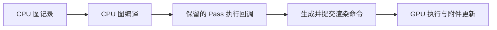

# D03｜Render Graph 的记录、编译与执行

**核心问题：RecordRenderGraph 已运行，为什么还不能说 GPU 已经画了？SetRenderFunc 中的代码又在哪一侧运行？**

RecordRenderGraph 在 CPU 声明图任务和依赖；图编译决定保留哪些任务及资源安排；执行回调仍在 CPU 生成渲染命令；GPU 稍后处理这些命令。四个阶段不能合并成“调用函数就写像素”。

## 1. 范围与版本

本卡阅读 Graphics `275a7f9ad9330e3cf7f3ea57a0b242a551fde291`（URP/Core 17.0.4，package 基线 6000.0），API 同时对照本地 Unity 6000.7 Beta 文档（2026-06-26 构建）。不假定这份公开提交就是用户安装的 Unity 6.7 原生后端。

实验采用 Forward、单 Base Game Camera、Render Graph 开启，关闭 MSAA、XR、动态分辨率、后处理及其他 Renderer Feature。它用一次全屏色阶处理说明图中的数据流，不是完整 NPR 光照方案。

- **图 Pass**：一个声明了输入、输出和执行回调的任务，不等于 ShaderLab Pass 或原生 render pass。
- **PassData**：执行回调所需的数据容器，如纹理句柄、材质和一次性诊断信息。
- **TextureHandle**：图管理的资源标识，不是 CPU 像素数组或稳定 GPU 地址。
- **builder**：配置本 Pass 的资源访问、附件、列表和回调的入口。
- **图编译**：处理依赖、裁剪、资源安排及可能的合并；与 HLSL 编译成 GPU 程序不同。

## 2. 四个时间点

| 时间点 | CPU 做什么 | 尚不能推断什么 |
| --- | --- | --- |
| 图记录 | AddRasterRenderPass、UseTexture、SetRenderAttachment、SetRenderFunc | 物理纹理已分配、任务一定保留、GPU 已执行 |
| 图编译 | 分析依赖、活跃工作、资源与原生 Pass 安排 | Shader 已运行或最终像素已可读回 |
| 回调执行 | 通过 RasterGraphContext.cmd 等记录具体绘制命令 | CPU 已等到 GPU 完成 |
| GPU 执行 | 后端命令驱动程序、光栅和附件更新 | 一次回调对应一个不可拆分硬件阶段 |



一个调用 RenderGraph.AddRasterRenderPass 的 CPU 日志只能证明记录发生。一个 SetRenderFunc 内日志只能证明回调运行，仍不是 GPU 完成证据。日志本身也不是图可自动识别的资源输出。

## 3. 固定源码链路

URP `UniversalRenderPipelineRenderGraph.cs` 用 `RenderGraphParameters` 设置命令缓冲、渲染上下文、相机名和帧索引，然后依次调用 BeginRecording、Renderer 的图记录、EndRecordingAndExecute。[固定 URP 图入口](https://github.com/Unity-Technologies/Graphics/blob/275a7f9ad9330e3cf7f3ea57a0b242a551fde291/Packages/com.unity.render-pipelines.universal/Runtime/UniversalRenderPipelineRenderGraph.cs)

Core `RenderGraph.EndRecordingAndExecute` 进入 Execute。固定源码在非 immediate 调试路径下，根据 nativeRenderPassesEnabled 选择 `CompileNativeRenderGraph/ExecuteNativeRenderGraph` 或 `CompileRenderGraph/ExecuteRenderGraph`，期间还涉及资源执行阶段和调试数据。不能只追其中一支后声称所有配置都调用同一编译器。[固定 RenderGraph.cs](https://github.com/Unity-Technologies/Graphics/blob/275a7f9ad9330e3cf7f3ea57a0b242a551fde291/Packages/com.unity.render-pipelines.core/Runtime/RenderGraph/RenderGraph.cs)

图编译可能复用缓存结果；“每帧记录图”不等于“每帧从头做完所有分析”。这些 CPU 调度策略与 Shader 变体编译缓存也不是一件事。

## 4. 声明访问不是执行采样

`UseTexture(source, Read)` 告诉图本 Pass 读取 source，用来建立依赖等信息；它不会自己绑定到任意 Shader 属性并执行采样。`SetRenderAttachment(destination, 0, WriteAll)` 则指定图准备的颜色输出槽位和覆盖承诺；回调执行时图会安排对应附件绑定。

回调中的 Blitter.BlitTexture 才记录全屏绘制并指定源纹理与程序。普通 Raster Pass 不应一边把某纹理作为 UseTexture 的采样输入，一边又把同一纹理设为输出附件；源码对这种组合有验证。全屏采样当前画面并修改它时，本例使用不同源/目标。

来源：[固定 RenderGraphBuilders.cs](https://github.com/Unity-Technologies/Graphics/blob/275a7f9ad9330e3cf7f3ea57a0b242a551fde291/Packages/com.unity.render-pipelines.core/Runtime/RenderGraph/RenderGraphBuilders.cs)、[Unity 图纹理读写说明](https://docs.unity3d.com/6000.0/Documentation/Manual/urp/render-graph-read-write-texture.html)。特定附件读取/subpass 机制另有约定，不能拿它们为任意同图采样写入辩护。

## 5. Unity 实验：一个有实际输出的色阶 Pass

创建下面 Shader 和材质，把材质赋给 `D03PosterizeFeature`；在当前相机使用的 URP Renderer Data 添加 Feature。Compatibility Mode 关闭，Renderer 的 **Intermediate Texture 设为 Always**，以明确提供可采样的相机颜色。若源仍是 backbuffer，示例会跳过，不能直接把 backbuffer 当普通纹理读取。

示例在 BeforeRenderingPostProcessing 读取当前颜色，写到新颜色目标，并将 `resources.cameraColor` 指向结果，供后续管线消费。这是本记录上下文中的输出接续，不是把 TextureHandle 保存到下一帧。

副本：[Feature](../实验/D03PosterizeFeature.cs)、[Shader](../实验/D03Posterize.shader)。

```csharp
using UnityEngine;
using UnityEngine.Rendering;
using UnityEngine.Rendering.RenderGraphModule;
using UnityEngine.Rendering.Universal;

public class D03PosterizeFeature : ScriptableRendererFeature
{
    public Material effectMaterial;
    public bool traceNextFrame;
    PosterizePass pass;
    public override void Create()
    {
        pass=new PosterizePass { renderPassEvent=RenderPassEvent.BeforeRenderingPostProcessing };
    }
    public override void AddRenderPasses(ScriptableRenderer renderer,ref RenderingData data)
    {
        if(effectMaterial==null || !effectMaterial.shader.isSupported) return;
        if(data.cameraData.cameraType!=CameraType.Game || data.cameraData.renderType!=CameraRenderType.Base) return;
        pass.material=effectMaterial;
        pass.trace=traceNextFrame;
        traceNextFrame=false;
        renderer.EnqueuePass(pass);
    }
    class PosterizePass : ScriptableRenderPass
    {
        public Material material;
        public bool trace;
        class PassData
        {
            public TextureHandle source;
            public Material material;
            public bool trace;
        }
        public override void RecordRenderGraph(RenderGraph graph,ContextContainer frameData)
        {
            var resources=frameData.Get<UniversalResourceData>();
            if(resources.isActiveTargetBackBuffer)
            {
                if(trace) Debug.LogWarning("D03 skipped: use an intermediate camera color texture.");
                return;
            }
            TextureHandle source=resources.activeColorTexture;
            var desc=graph.GetTextureDesc(source);
            desc.name="D03 Posterized Color";
            desc.depthBufferBits=DepthBits.None;
            desc.msaaSamples=MSAASamples.None;
            desc.bindTextureMS=false;
            desc.clearBuffer=false;
            TextureHandle destination=graph.CreateTexture(desc);
            if(trace) Debug.Log("D03: CPU is recording the graph.");
            using(var builder=graph.AddRasterRenderPass<PassData>("D03 Posterize",out var data))
            {
                data.source=source;
                data.material=material;
                data.trace=trace;
                builder.UseTexture(source,AccessFlags.Read);
                builder.SetRenderAttachment(destination,0,AccessFlags.WriteAll);
                builder.SetRenderFunc(static (PassData p,RasterGraphContext ctx)=>
                {
                    if(p.trace) Debug.Log("D03: CPU callback is recording a blit, not waiting for GPU completion.");
                    Blitter.BlitTexture(ctx.cmd,p.source,new Vector4(1,1,0,0),p.material,0);
                });
            }
            resources.cameraColor=destination;
        }
    }
}
```

```shaderlab
Shader "Encyclopedia/D03Posterize"
{
    Properties { _Levels("Levels Per RGB Channel",Range(2,8))=4 }
    SubShader
    {
        Tags { "RenderPipeline"="UniversalPipeline" }
        Pass
        {
            ZWrite Off ZTest Always Cull Off Blend Off
            HLSLPROGRAM
            #pragma target 3.5
            #pragma vertex Vert
            #pragma fragment Frag
            #include "Packages/com.unity.render-pipelines.universal/ShaderLibrary/Core.hlsl"
            #include "Packages/com.unity.render-pipelines.core/Runtime/Utilities/Blit.hlsl"
            CBUFFER_START(UnityPerMaterial)
                float _Levels;
            CBUFFER_END
            float4 Frag(Varyings input):SV_Target
            {
                float4 c=SAMPLE_TEXTURE2D_X(_BlitTexture,sampler_LinearClamp,input.texcoord);
                float steps=max(2,floor(_Levels+0.5))-1;
                c.rgb=floor(saturate(c.rgb)*steps+0.5)/steps;
                return c;
            }
            ENDHLSL
        }
    }
}
```

## 6. 预测、调试与反例

1. 在有颜色渐变或光照渐变的场景开启 Feature，Levels=4 时每个 RGB 通道量化到 `0、1/3、2/3、1`。例如线性通道值 0.4 变为约 0.333；显示编码后的字节不要求是 85。
2. 开启 Trace Next Frame，观察记录阶段与回调阶段各一条 CPU 日志。它们没有测量 GPU 完成时间，也不构成性能基准。
3. 在 Render Graph Viewer 定位 D03 Posterize，查看输入/输出及后续消费；Frame Debugger 核对实际全屏绘制和不同源/目标。
4. 本例无需 `AllowPassCulling(false)`，因为输出已经接入后续相机颜色。若删去 `resources.cameraColor=destination` 且没有其他消费，结果可能成为无用内部输出而被裁剪，画面恢复原样。不要靠禁止裁剪掩盖漏接输出。
5. 若把 destination 换成 source，同时保留 UseTexture 和输出声明，普通 Raster Pass 会违反同资源读写限制。应保留独立目标或使用合适的专用机制，而非删除依赖声明骗过系统。

没有效果先查 Feature 所在 Renderer、相机筛选、材质和 RG 模式；再看 backbuffer 跳过、输出是否接续、源是否单样本。全粉色查包和 Shader；异常亮度先看 HDR 被 saturate 截断及后处理是否关闭。

色阶公式是可预测的数据变换。它对每个 RGB 通道独立量化并截断 HDR，可能改变色相，不等于基于 NdotL 的卡通明暗，也不是建议把所有 NPR 效果放到后处理。

## 7. 数据捕获与资源边界

static 回调通过 PassData 获取源句柄、材质和诊断标记，避免依赖后来变化的 Pass 字段。Material 仍然是对象引用而非深拷贝；更复杂的多相机或多 Pass 参数应使用合适的逐次数据传递，不能随意在记录完后修改同一个共享对象并假设早期值被保存。

Feature 不拥有 Inspector 传入的材质，因此不销毁它；CreateTexture 产生的图内部资源由图管理，不在回调里手动 Release。回调不能被当作 GPU 上的 C# 函数，也不应把整份 frameData 留到下一帧复用。

## 8. 自测与来源

1. **SetRenderFunc 是在 GPU 上执行 C# 吗？** 不是，CPU 回调记录 GPU 命令。
2. **AddRasterRenderPass 是否编译 HLSL？** 它注册图任务；图编译与 Shader 编译不同。
3. **UseTexture 是否自动完成一次采样？** 否，它声明访问，具体绘制/采样由回调和 Shader 实现。
4. **输出纹理没消费者，禁止裁剪就算效果接通了吗？** 不算，执行了无用工作仍不会改变目标画面。

已核对本地 `Manual/urp/render-graph-write-render-pass.html`、`render-graph-read-write-texture.html`、`render-graph-viewer-reference.html`，根目录 `E:\Claude Skills\学习仓库\09_Unity官方文档\Documentation\en`；线上入口：[Unity 编写图 Pass](https://docs.unity3d.com/6000.0/Documentation/Manual/urp/render-graph-write-render-pass.html)。示例接口和文本已核对，未运行 Unity 编译、抓帧或 GPU 计时。

前一张：[D02 Pass 与状态](D02-PassLightMode与状态覆盖.md)。下一张：[D04 资源寿命、依赖与导入](D04-RenderGraph资源寿命依赖与导入.md)。
