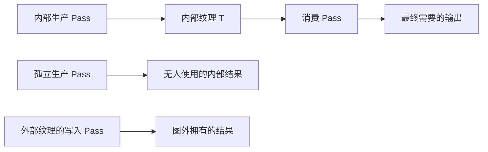

# D04｜Render Graph 资源寿命、依赖与导入

**核心问题：创建了一张图纹理，为什么它的生产 Pass 被删掉？把纹理 Import 之后，究竟是谁负责释放？**

图内部资源由图按依赖管理；外部资源的生命周期仍由外部所有者负责。图能裁剪不影响有效输出的内部工作，而写入导入资源具有图外可见影响，不能简单当作无人读取的临时结果删除。

## 1. 范围与术语

源码基线为 Graphics `275a7f9ad9330e3cf7f3ea57a0b242a551fde291`（URP/Core 17.0.4 / 6000.0），文档核对本地 Unity 6000.7 Beta（2026-06-26 构建）。实验使用单 Base Game Camera、Forward、Render Graph 开启，关闭 MSAA、XR、动态分辨率及其他 Feature。

- **内部纹理**：通过图的 CreateTexture 等入口描述，由图管理物理创建、池化和释放时机。
- **导入纹理**：已经由外部拥有的资源，通过 ImportTexture 获得本次图可跟踪的句柄。
- **RTHandle**：Unity 对渲染纹理等目标的包装/管理入口，与 TextureHandle 的用途和生命周期不同。
- **逻辑寿命**：资源版本从生产到最后有效消费的范围；不等于底层内存一定在这一瞬间申请或归还给系统。
- **Pass 裁剪**：删除无有效影响的工作；**Pass 合并**：把符合条件的任务安排进同一原生 render pass。两者不是同一种优化。

## 2. 三个寿命不要混用

| 对象 | 可依赖的范围 | 错误用法 |
| --- | --- | --- |
| 某次记录获得的 TextureHandle | 当前图执行上下文中的资源引用 | 存成静态字段，下帧当作仍有效的纹理使用 |
| 图内部纹理的逻辑结果 | 声明的生产/消费关系 | 无消费者却假设一定分配并执行 |
| 外部拥有的 RTHandle/纹理 | 所有者建立的资源寿命 | Import 后认为图会替所有者最终释放，或在执行回调里提前释放 |

资源池可以复用物理分配；两个寿命不重叠的逻辑纹理也可能被安排复用存储，但兼容性、后端和图编译器条件必须满足。不能把两个同尺寸 TextureHandle 必定等价为同一显存地址。

跨帧历史还需要初始化、尺寸变化、相机区分、上一帧/当前帧轮换与重置规则。Import 只是接入外部资源，不会自动形成正确历史算法。

## 3. 从输出反推哪些工作必须保留



P 的必要性来自 C，C 的必要性来自有效输出。若移除 C 且没有其他用途，T 和 P 可以成为无用链。对外部纹理 E 的写入，图无法知道图外后续如何使用，因此要保留这种影响。

固定 `RenderGraph.ImportTexture` 的注释明确限定为 **writing to an imported texture**。传统编译分支和 `Compiler/NativePassCompiler.cs` 都把写入导入资源作为副作用处理。只读取导入纹理、却把结果写到无用内部目标的 Pass，不会仅凭这次读取自动变得不可裁剪。[ImportTexture 与图实现](https://github.com/Unity-Technologies/Graphics/blob/275a7f9ad9330e3cf7f3ea57a0b242a551fde291/Packages/com.unity.render-pipelines.core/Runtime/RenderGraph/RenderGraph.cs)、[固定 NativePassCompiler.cs](https://github.com/Unity-Technologies/Graphics/blob/275a7f9ad9330e3cf7f3ea57a0b242a551fde291/Packages/com.unity.render-pipelines.core/Runtime/RenderGraph/Compiler/NativePassCompiler.cs)

本地导入教程有把“使用导入纹理的 Pass”笼统描述为不能裁剪的表述。本卡依据上述固定源码区分读与写；版本变化时应再次查当前包实现，而非把概括句当作所有情况的精确定义。[Unity 导入纹理教程](https://docs.unity3d.com/6000.0/Documentation/Manual/urp/render-graph-import-a-texture.html)

## 4. 访问声明怎样影响保存与依赖

| 声明 | 表达的需要 | 不能误解成什么 |
| --- | --- | --- |
| UseTexture(Read) | Shader 等途径读取该资源 | 自动完成纹理采样 |
| SetRenderAttachment(Write) | 颜色附件写入；默认按可能局部写处理 | 自动保证覆盖整张目标并可丢旧内容 |
| ReadWrite | 既读又写，例如相关混合用途 | 允许任意同图采样和输出同一纹理 |
| WriteAll | 承诺整个相关输出被覆盖、无须旧内容 | 一个只覆盖模型区域的 Draw 也可以这样标 |

固定 IRenderGraphBuilder 文档指出，默认附件写会考虑只写了局部区域并保存其余内容；知道确实全覆盖时才应使用 WriteAll。本例的 Producer 完整清除颜色，Consumer 是无深度限制、无混合的全屏复制，符合这一限定。[固定 IRenderGraphBuilder.cs](https://github.com/Unity-Technologies/Graphics/blob/275a7f9ad9330e3cf7f3ea57a0b242a551fde291/Packages/com.unity.render-pipelines.core/Runtime/RenderGraph/IRenderGraphBuilder.cs)

只写对象轮廓、带 clip、ColorMask、不完全样本覆盖或依赖旧颜色的混合，不应未经分析就声明 WriteAll。声明必须匹配实际程序，否则图可能基于错误承诺丢弃需要的数据。

## 5. Unity 实验：内部无用、内部消费、外部写与外部只读

下面一份 Feature 即可运行，不需要自定义 Shader。Producer 清除目标为洋红；可选 Consumer 使用 Core Blitter 复制。Feature 自己分配一张固定 256² RTHandle，跨帧保留；每次图记录重新 Import，Feature Dispose 时释放。它没有接管用户的资源资产。

保存 `D04LifetimeFeature.cs`，在当前 URP Renderer Data 添加 Feature；保持单相机、单样本。副本：[完整 Feature](../实验/D04LifetimeFeature.cs)。

```csharp
using UnityEngine;
using UnityEngine.Experimental.Rendering;
using UnityEngine.Rendering;
using UnityEngine.Rendering.RenderGraphModule;
using UnityEngine.Rendering.Universal;

public class D04LifetimeFeature : ScriptableRendererFeature
{
    public enum Mode { InternalConsumed, InternalUnused, ImportedUnused, ImportedReadUnused }
    public Mode mode;
    public bool forceKeepProducer;
    LifetimePass pass;
    public override void Create()
    {
        pass?.Dispose();
        pass=new LifetimePass { renderPassEvent=RenderPassEvent.BeforeRenderingPostProcessing };
    }
    public override void AddRenderPasses(ScriptableRenderer renderer,ref RenderingData data)
    {
        if(data.cameraData.cameraType!=CameraType.Game || data.cameraData.renderType!=CameraRenderType.Base) return;
        pass.mode=mode;
        pass.forceKeep=forceKeepProducer;
        renderer.EnqueuePass(pass);
    }
    protected override void Dispose(bool disposing) { pass?.Dispose(); pass=null; }
    class LifetimePass : ScriptableRenderPass
    {
        public Mode mode;
        public bool forceKeep;
        RTHandle owned;
        class ClearData { public Color color; }
        class CopyData { public TextureHandle source; }
        public LifetimePass()
        {
            owned=RTHandles.Alloc(256,256,depthBufferBits:DepthBits.None,
                colorFormat:GraphicsFormat.R8G8B8A8_UNorm,
                filterMode:FilterMode.Point,wrapMode:TextureWrapMode.Clamp,
                name:"D04 Owned Persistent Texture");
        }
        public void Dispose() { owned?.Release(); owned=null; }
        static TextureHandle MakeInternal(RenderGraph graph,string name)
        {
            var desc=new TextureDesc(256,256)
            {
                name=name,
                format=GraphicsFormat.R8G8B8A8_UNorm,
                msaaSamples=MSAASamples.None,
                clearBuffer=false,
                filterMode=FilterMode.Point
            };
            return graph.CreateTexture(desc);
        }
        public override void RecordRenderGraph(RenderGraph graph,ContextContainer frameData)
        {
            var resources=frameData.Get<UniversalResourceData>();
            bool imported=mode==Mode.ImportedUnused || mode==Mode.ImportedReadUnused;
            TextureHandle produced=imported ? graph.ImportTexture(owned) : MakeInternal(graph,"D04 Internal Product");
            using(var builder=graph.AddRasterRenderPass<ClearData>("D04 Producer",out var data))
            {
                data.color=Color.magenta;
                builder.SetRenderAttachment(produced,0,AccessFlags.WriteAll);
                if(forceKeep) builder.AllowPassCulling(false);
                builder.SetRenderFunc(static (ClearData p,RasterGraphContext ctx)=>
                    ctx.cmd.ClearRenderTarget(false,true,p.color));
            }
            bool consume=mode==Mode.InternalConsumed || mode==Mode.ImportedReadUnused;
            if(!consume) return;
            TextureHandle destination=mode==Mode.InternalConsumed
                ? resources.activeColorTexture : MakeInternal(graph,"D04 Unused Copy");
            using(var builder=graph.AddRasterRenderPass<CopyData>("D04 Consumer",out var data))
            {
                data.source=produced;
                builder.UseTexture(produced,AccessFlags.Read);
                builder.SetRenderAttachment(destination,0,AccessFlags.WriteAll);
                builder.SetRenderFunc(static (CopyData p,RasterGraphContext ctx)=>
                    Blitter.BlitTexture(ctx.cmd,p.source,new Vector4(1,1,0,0),0,false));
            }
        }
    }
}
```

## 6. 四种模式的预测

先保持 Force Keep Producer 关闭，图裁剪处于正常开启状态。

| 模式 | Producer | Consumer | 画面预测 |
| --- | --- | --- | --- |
| InternalConsumed | 因后续消费而保留 | 把内部结果写入相机颜色 | 相机画面变洋红 |
| InternalUnused | 无有效消费时可被裁剪 | 未注册 | 场景保持原样 |
| ImportedUnused | 写入外部拥有的资源，保留 | 未注册 | 场景保持原样，但外部结果已被更新 |
| ImportedReadUnused | 写入导入资源，保留 | 只读导入资源并输出到无用内部目标，可被裁剪 | 场景保持原样 |

InternalUnused 模式再开启 Force Keep Producer：生产任务被要求保留，但仍不会改变相机画面，因为结果没有接到相机输出。它说明“执行”与“输出被使用”是两个条件，不能把禁止裁剪当作修复输出链的方法。

查看 Render Graph Viewer 的 Culled Passes 显示选项，比较 Producer/Consumer 是否保留及资源读写；Frame Debugger 看实际执行的命令。被裁剪节点仍可能在调试图中显示，不等于执行过。ImportedReadUnused 中保留的是外部写入生产者，不是无用只读消费者。

实验用 Core Blitter，并只采样单样本二维资源；向相机 backbuffer 写入与把它作为普通采样源不同。本例没有采样 activeColorTexture。内部纹理固定 256²，消费时放大整张洋红图，不声称保留场景内容或完整分辨率细节。

## 7. 合并、保存与同步的边界

同一资源的生产/消费关系为图提供顺序与可见性信息，图和引擎后端据此安排资源访问；这不要求为每次 GPU 读取增加 CPU 等待。跨队列或外部原生互操作仍有专门约定。

固定 NativePassCompiler 先处理无用任务，再尝试原生 Pass 合并。能否合并受附件兼容、读取方式、负载/保存要求等条件限制。本例 Consumer 把生产结果作为纹理采样，不能仅凭“两个 Pass 相邻”就预测它们必定融合或没有外部流量。

图资源有效期、物理池化/复用、原生 render pass 合并和 Shader 内运算是不同层。Render Graph Viewer 中的图结构不是 GPU 逐周期时序图；实际 tile 保存、缓存和带宽要到设备工具核对。

## 8. NPR 迁移、自测与核验

角色 ID、法线和描边中间图应声明真实消费者；只有确实跨帧使用的历史数据才需要相应外部寿命管理。头发时间稳定性还涉及历史有效性、运动、相机切换和分辨率重置，不能仅把 TextureHandle 改为 Import 就认为历史正确。

1. **CreateTexture 返回句柄是否保证本帧分配物理纹理？** 不保证，无用工作可能被裁剪，分配也可能来自池。
2. **Import 是否转移资源所有权？** 本例没有，Feature 仍管理自己分配的 RTHandle。
3. **只读导入资源是否自动使 Pass 不可裁剪？** 固定源码不支持这种泛化；还要看结果是否有效、是否有其他副作用。
4. **AllowPassCulling(false) 能否修复错误依赖或同图读写？** 不能，它只影响任务保留。
5. **两个图 Pass 是否必定对应两个原生 render pass？** 不是，合并受具体条件控制。

已核对 RenderGraph、NativePassCompiler、资源注册与 builder 源码，以及本地 `Manual/urp/render-graph-import-a-texture.html`、`render-graph-create-a-texture.html`、`render-graph-read-write-texture.html` 和 Viewer 参考。文档根目录 `E:\Claude Skills\学习仓库\09_Unity官方文档\Documentation\en`。示例未在 Unity 编译、运行或抓帧，表格是待验证预测。

前一张：[D03 记录与执行](D03-RenderGraph记录编译与执行.md)。本组操作汇总：[D01—D04 实验说明](../实验/D01-D04实验说明.md)。下一张：[D05 相机深度、法线与运动矢量的生产路径](D05-相机深度法线与运动矢量生产路径.md)。完整阶段实践：[D 阶段检查点](../实验/D阶段检查点.md)。
