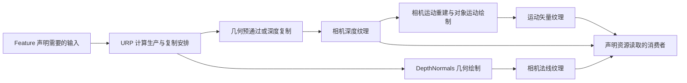

# D05｜相机深度、法线与运动矢量的生产路径

> 核心问题：后处理读到的“场景数据”由谁生成、包含谁，又对应哪个时刻？目标是能从一张缺失角色轮廓的法线图，反查生产 Pass，而不是先修改描边阈值。

## 1. 概念与版本边界

深度附件是光栅化阶段进行遮挡测试和深度写入的资源；**可采样的相机深度纹理**是 Shader 消费的数据。两者可能经过复制、预通过或其他处理才建立联系，不能仅凭名称认定是同一资源。法线纹理记录表面方向；运动矢量纹理记录跨帧投影位置的二维变化。它们均不等于最终 RGB 画面。

本文使用本地 Unity **6.7 Beta / 6000.7** 文档，构建日期 2026-06-26。源码固定到 Graphics 提交 `275a7f9ad9330e3cf7f3ea57a0b242a551fde291`，该快照包 manifest 标为 **URP/Core 17.0.4、Unity 6000.0**。文档与源码版本分别记录；具体工程以 Package Manager 和实际包文件为准。

实验限制为 URP **Forward、Render Graph 开启、一个 Base Game Camera、透视投影**；关闭 MSAA、XR、动态分辨率、后处理、Depth Priming、GPU Resident Drawer 和其他 Renderer Feature。Renderer 的 Intermediate Texture 设置为 Always。基础物体使用 URP/Lit，先排除教学 Shader 缺 Pass 的干扰。

## 2. 从 GPU 数据到相机纹理

| 数据 | 典型生产方法 | 主要内容与缺失来源 | 消费前必须检查 |
| --- | --- | --- | --- |
| 相机深度 | DepthOnly/DepthNormals 预通过，或复制已有深度附件 | 被该生产路径接纳的表面；普通透明物通常不在其中 | 生产时刻、采样格式、MSAA 处理、线性化规则 |
| 相机法线 | DepthNormals 类 Pass；Deferred 路径也可能利用 GBuffer | 生产 Shader 输出的法线，不一定等于美术期望的描边法线 | 空间、编码、物体是否有匹配 Pass |
| 运动矢量 | 根据深度重建的相机运动，再绘制支持 MotionVectors 的对象 | 当前可见表面的屏幕运动；变形还需要上一帧几何信息 | 对象模式、上一帧变换、生产顺序、相机历史是否有效 |

“透明物体完全没有深度或运动”是过度概括。透明队列、ZWrite、额外 Pass 和自定义生产流程可以改变结果；正确的问题是：**本次资源的具体生产路径是否画了这个物体？** 标准路径主要面向不透明对象，不会自动把所有最终可见透明层编码成一张单层深度图。



图示表达数据依赖，不代表每种配置都同时存在全部节点，也不代表所有平台具有相同物理附件布局。

## 3. 引擎如何决定生产

Renderer Feature 在 `AddRenderPasses` 中调用 `ConfigureInput`，告诉 URP 本 Pass 需要 Depth、Normal 或 Motion。URP 据此决定预通过、复制及可用时机。到了 `RecordRenderGraph`，消费者还应通过 `UseTexture` 声明真实读取：**输入请求解决“安排谁来生产”，图访问声明解决“这个节点依赖什么”**，两者各有作用。

固定源码的 `UniversalRendererRenderGraph.cs` 包含 `RequireDepthPrepass`、`RequireDepthTexture`、`CalculateTextureCopySchedules`、`CopyDepthToDepthTexture` 和 `RenderMotionVectors`。`requiresNormalsTexture` 参与选择 DepthNormals 预通过；Depth Priming、Deferred、读取时刻及复制能力都会影响路径。不要把“启用 Depth Texture”机械画成固定一个 CopyDepth。参见 [URP 图调度源码](https://github.com/Unity-Technologies/Graphics/blob/275a7f9ad9330e3cf7f3ea57a0b242a551fde291/Packages/com.unity.render-pipelines.universal/Runtime/UniversalRendererRenderGraph.cs)。

本地运动矢量文档给出的常规时机是 `BeforeRenderingPostProcessing`。固定图源码还会结合深度读取安排运动矢量；实际时序应看当前包的图节点。消费者若插得太早，不能靠同名全局纹理推定内容属于当前帧。实验放在 `AfterRenderingPostProcessing`，并关闭后处理，留出明确的生产窗口。参见 [MotionVectors Pass 文档](https://docs.unity3d.com/6000.0/Documentation/Manual/urp/features/motion-vectors-render-pass.html)；本地同路径为 6000.7 版本。

`MotionVectorRenderPass` 先执行相机运动绘制，再用 `MotionVectors` 标签选择对象 Pass，并请求 `PerObjectData.MotionVectors`。深度重建能描述相机相对静态几何的运动，但无法凭当前深度推导一片上一帧弯向另一边的头发。[固定运动矢量生产源码](https://github.com/Unity-Technologies/Graphics/blob/275a7f9ad9330e3cf7f3ea57a0b242a551fde291/Packages/com.unity.render-pipelines.universal/Runtime/Passes/MotionVectorRenderPass.cs)。

## 4. 读懂数值，避免看图猜含义

**深度**：透视投影的原始设备深度通常是视空间距离的非线性函数；Reversed-Z 还会改变近远方向。实验使用 URP 的 `LinearEyeDepth(raw, _ZBufferParams)`，得到沿相机观察轴的正距离，不是相机到表面的欧氏距离。把 5 米映射为 `5 / 20 = 0.25` 灰度是人为显示规则；最终屏幕的显示编码可能改变视觉亮度。

**法线**：世界空间单位法线可以用 `color = normal * 0.5 + 0.5` 显示。`(0,1,0)` 对应数值 `(0.5,1,0.5)`。部分路径使用八面体编码，必须先解码。背景清除值不是一个有效表面法线；不能把背景颜色当作朝向。本文解码分支对照 [DeclareNormalsTexture.hlsl](https://github.com/Unity-Technologies/Graphics/blob/275a7f9ad9330e3cf7f3ea57a0b242a551fde291/Packages/com.unity.render-pipelines.universal/ShaderLibrary/DeclareNormalsTexture.hlsl)。

**运动**：若某约定下的 UV 位移为 `(0.01,0)`，在宽 1920 的图上相当于 19.2 个像素的水平位移。它不是每秒世界速度；还取决于帧间隔、投影和输出分辨率。实际正负方向需核对生产公式、屏幕 Y 约定和消费者用法。本实验只观察非零、方向变化和量级，不把 R 通道变亮直接解释为世界 +X。

## 5. 完整 Unity 实验：三个生产结果视图

保存下面代码为 `D05CameraDataFeature.cs`。通过枚举分别请求一种输入，并将选中的资源直接传入 Blitter。资源句柄只用于当前图；输出使用相机颜色描述创建，不能照抄深度输入的格式作为彩色附件。

```csharp
using UnityEngine;
using UnityEngine.Rendering;
using UnityEngine.Rendering.RenderGraphModule;
using UnityEngine.Rendering.Universal;

public class D05CameraDataFeature : ScriptableRendererFeature
{
    public enum View { Depth, Normals, Motion }
    public View view;
    public Material displayMaterial;
    DataPass pass;
    public override void Create()
    {
        pass = new DataPass { renderPassEvent = RenderPassEvent.AfterRenderingPostProcessing };
    }
    public override void AddRenderPasses(ScriptableRenderer renderer, ref RenderingData data)
    {
        if (displayMaterial == null || !displayMaterial.shader.isSupported) return;
        if (data.cameraData.cameraType != CameraType.Game ||
            data.cameraData.renderType != CameraRenderType.Base) return;
        pass.material = displayMaterial;
        pass.view = view;
        pass.ConfigureInput(view == View.Depth ? ScriptableRenderPassInput.Depth :
            view == View.Normals ? ScriptableRenderPassInput.Normal : ScriptableRenderPassInput.Motion);
        renderer.EnqueuePass(pass);
    }
    class DataPass : ScriptableRenderPass
    {
        public Material material;
        public View view;
        class PassData
        {
            public TextureHandle source;
            public Material material;
            public int shaderPass;
        }
        public override void RecordRenderGraph(RenderGraph graph, ContextContainer frameData)
        {
            var resources = frameData.Get<UniversalResourceData>();
            if (resources.isActiveTargetBackBuffer) return;
            TextureHandle source = view == View.Depth ? resources.cameraDepthTexture :
                view == View.Normals ? resources.cameraNormalsTexture : resources.motionVectorColor;
            if (!source.IsValid()) return;
            var desc = graph.GetTextureDesc(resources.activeColorTexture);
            desc.name = "D05 Camera Data Display";
            desc.depthBufferBits = DepthBits.None;
            desc.msaaSamples = MSAASamples.None;
            desc.bindTextureMS = false;
            desc.clearBuffer = false;
            var output = graph.CreateTexture(desc);
            using (var builder = graph.AddRasterRenderPass<PassData>("D05 " + view, out var p))
            {
                p.source = source;
                p.material = material;
                p.shaderPass = (int)view;
                builder.UseTexture(source, AccessFlags.Read);
                builder.SetRenderAttachment(output, 0, AccessFlags.WriteAll);
                builder.SetRenderFunc(static (PassData d, RasterGraphContext ctx) =>
                    Blitter.BlitTexture(ctx.cmd, d.source, new Vector4(1, 1, 0, 0), d.material, d.shaderPass));
            }
            resources.cameraColor = output;
        }
    }
}
```

保存为 `D05CameraData.shader`，创建材质选择 `Encyclopedia/D05CameraData`，赋给 Feature。先包含 URP Core，再包含 Core Blit，使用后者的全屏顶点函数与 `_BlitTexture`。

```shaderlab
Shader "Encyclopedia/D05CameraData"
{
    Properties
    {
        _DepthRange("Depth Display Range (meters)", Float) = 20
        _MotionScale("Motion Display Gain", Float) = 20
    }
    SubShader
    {
        Tags { "RenderPipeline"="UniversalPipeline" }
        Cull Off ZWrite Off ZTest Always
        HLSLINCLUDE
        #include "Packages/com.unity.render-pipelines.universal/ShaderLibrary/Core.hlsl"
        #include "Packages/com.unity.render-pipelines.core/ShaderLibrary/Packing.hlsl"
        #define USE_FULL_PRECISION_BLIT_TEXTURE
        #include "Packages/com.unity.render-pipelines.core/Runtime/Utilities/Blit.hlsl"
        CBUFFER_START(UnityPerMaterial)
            float _DepthRange;
            float _MotionScale;
        CBUFFER_END
        float4 ReadData(Varyings i)
        {
            return SAMPLE_TEXTURE2D_X(_BlitTexture, sampler_PointClamp, i.texcoord);
        }
        float4 ShowDepth(Varyings i) : SV_Target
        {
            float eye = LinearEyeDepth(ReadData(i).r, _ZBufferParams);
            float v = saturate(eye / max(_DepthRange, 0.001));
            return float4(v, v, v, 1);
        }
        float4 ShowNormal(Varyings i) : SV_Target
        {
            float3 n = ReadData(i).xyz;
            #if defined(_GBUFFER_NORMALS_OCT)
                float2 oct = Unpack888ToFloat2(n) * 2.0 - 1.0;
                n = UnpackNormalOctQuadEncode(oct);
            #endif
            return float4(n * 0.5 + 0.5, 1);
        }
        float4 ShowMotion(Varyings i) : SV_Target
        {
            float2 v = 0.5 + ReadData(i).rg * _MotionScale;
            return float4(saturate(v), 0.5, 1);
        }
        ENDHLSL
        Pass
        {
            Name "DepthDisplay"
            HLSLPROGRAM
            #pragma target 3.5
            #pragma vertex Vert
            #pragma fragment ShowDepth
            ENDHLSL
        }
        Pass
        {
            Name "NormalDisplay"
            HLSLPROGRAM
            #pragma target 3.5
            #pragma vertex Vert
            #pragma fragment ShowNormal
            #pragma multi_compile_fragment _ _GBUFFER_NORMALS_OCT
            ENDHLSL
        }
        Pass
        {
            Name "MotionDisplay"
            HLSLPROGRAM
            #pragma target 3.5
            #pragma vertex Vert
            #pragma fragment ShowMotion
            ENDHLSL
        }
    }
}
```

### 操作与预测

1. 按第 1 节基线创建场景：地面、URP/Lit 球体与立方体，透视相机，Near 0.3、Far 100。添加 Feature。进入 Play，其他数据视图 Feature 全部关闭。
2. Depth 模式：沿视线把球从约 5 米移到 10 米；显示数值应变大。查看图中生产深度的节点，不预设它必须叫 CopyDepth。
3. Normals 模式：旋转立方体，面颜色改变；平移不改变平面的世界法线。球的几何法线随位置变化，与立方体平面不同。查看是否新增 DepthNormals 预通过。
4. Motion 模式：移动球的 Renderer 使用 Per Object 运动矢量模式，避免 Force No Motion。相机和物体静止数帧后，正常静止区域接近数值 `(0.5,0.5,0.5)`。在 Play 中持续平移相机，再固定相机持续移动球；前者影响多个静态表面，后者主要影响运动物体投影。不要在暂停后指望矢量一直保留。
5. 把球换成仅有主体前向 Pass 的自定义 Shader。先确认主体可见，再观察法线/运动资源中的差异。缺失时查生产标签和变形输入；此步骤的实际结果由 Shader、Renderer 设置与回退行为决定，不能预言所有版本一定为黑色。
6. 把 URP/Lit 球改为普通透明模式，比较主体与数据资源的轮廓。记录 Draw 是否存在、生产资源是否有球，而不只记录最终显示是否好看。

无变化时按顺序查：Feature 是否属于当前 Renderer、是否有中间颜色、句柄是否有效、相机是否满足筛选、图中生产节点、材质 Shader 是否编译、输入是否属于当前帧。正交相机需要独立的深度线性化分支，本例不覆盖。

## 6. NPR 应用与代价

屏幕空间描边比较邻域深度/法线差异。如果面部使用艺术法线、主体改变顶点位置，而 DepthNormals 仍输出原始几何结果，描边会与画面脱离。先统一生产几何，再讨论阈值。若法线预通过让场景多画一遍几何，读取一张“免费法线图”的假设就不成立。

时间稳定的发丝、抖动阴影和 TAA 需要运动与历史一致。只有当前帧变形的 Shader 无法完整表达上一帧位置；相机运动重建也不能补回对象形变。运动正确仍不保证历史可用：遮挡揭露、相机切换与分辨率变化还需要历史拒绝或重置规则。

生产资源增加的成本包括几何处理、附件写入、复制或 resolve，以及消费采样。其大小受实际图与设备架构影响；看见一个新 Pass 不能直接换算为固定毫秒数。

## 7. 自测与核验边界

1. **请求 Normal 与在 Shader 声明 `_CameraNormalsTexture` 有何差别？** 前者进入管线生产安排；后者只声明 Shader 绑定接口，不自动生成正确内容。
2. **深度灰度 0.25 是否代表离相机 25 米？** 不能。实验中它表示沿观察轴约 `_DepthRange × 0.25`；原始深度则还需线性化。
3. **移动相机时静止墙面为何有运动？** 墙面跨帧投影坐标变化了，屏幕运动不等于世界物体速度。
4. **主体显示正常能否证明法线和运动 Pass 正确？** 不能，各 Pass 的筛选、几何和输出必须分别核对。
5. **三个模式切换后 Pass 数改变是异常吗？** 未必，输入请求本来就可能改变生产路径。

另外核对了本地 `Manual/urp/features/motion-vectors-sample.html` 和 [UniversalResourceData 源码](https://github.com/Unity-Technologies/Graphics/blob/275a7f9ad9330e3cf7f3ea57a0b242a551fde291/Packages/com.unity.render-pipelines.universal/Runtime/FrameData/UniversalResourceData.cs)。本地文档根目录是 `E:\Claude Skills\学习仓库\09_Unity官方文档\Documentation\en`。示例仅做源码/API 与文本结构核对，**尚未在 Unity 编译、运行或抓帧**；操作中的画面是预测。

前一张：[D04 资源依赖](D04-RenderGraph资源寿命依赖与导入.md)。下一张：[D06 排序与批处理](D06-排序SRPBatcher实例化与GPU驱动.md)。实践汇总：[D 阶段检查点](../实验/D阶段检查点.md)。
