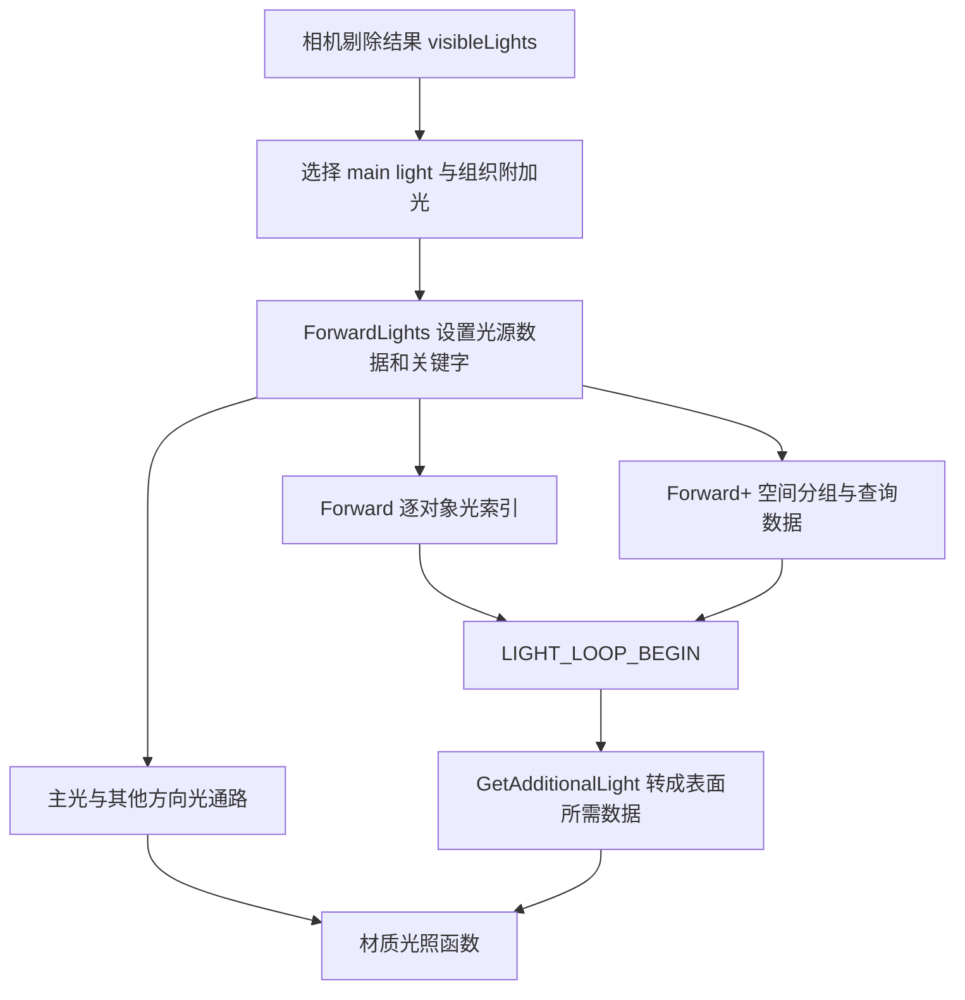

# D07｜URP 光源数据、Forward 与 Forward+

> 核心问题：HLSL 中一次 `GetAdditionalLight` 从哪里取数据，循环索引又是谁定义的？目标是让 NPR 明暗函数接上正确的光源集合，并能解释切换渲染路径后的变化。

## 1. 先分清光源、索引与着色

场景 Light 是引擎对象；相机可见光源列表是剔除后的数据；Shader 的 `Light` 结构是某个表面位置所需的方向、颜色和衰减。三者不是同一个数组，也不保证使用同一个索引。

一个表面的基本直接光照教学模型为：

`C = baseColor × Σ [lightColor_i × attenuation_i × max(0, dot(N,L_i))]`。

其中 `N` 是单位世界法线，`L_i` 是表面指向光的单位方向，衰减可包含距离、聚光锥与阴影可见性。这是 Lambert 角度项的工程基线；完整物理 BRDF、辐射量单位和 `1/π` 归一化需要另行明确，不能把这个简式叫作完整 PBR。

Forward 与 Forward+ 的关键区别之一是**每个着色位置如何取得附加光集合**。它们都可以在同一个材质片元程序里累加多盏灯；不能套用“多一盏灯必定多一个物体颜色 Draw”的旧经验。

## 2. 必须分开的版本接口

本地官方文档为 **Unity 6.7 Beta / 6000.7，2026-06-26 构建**。本卡完整 Shader 按该文档的光源循环接口编写。作为机制证据的 Graphics 固定提交是 `275a7f9ad9330e3cf7f3ea57a0b242a551fde291`，其 manifest 标为 **URP/Core 17.0.4、Unity 6000.0**。

| 位置 | 本地 6000.7 文档示例 | 固定 17.0.4 源码/6.0 示例 |
| --- | --- | --- |
| Shader 变体关键字 | `_CLUSTER_LIGHT_LOOP` | `_FORWARD_PLUS` |
| HLSL 路径条件 | `USE_CLUSTER_LIGHT_LOOP` | `USE_FORWARD_PLUS` |
| 附加光循环入口 | `LIGHT_LOOP_BEGIN` / `LIGHT_LOOP_END` | 同名宏，但展开实现按该版本解释 |

本地核对页面：`Manual/urp/use-built-in-shader-methods-additional-lights-fplus.html`。可在线对照 [Unity 6.0 官方示例](https://docs.unity3d.com/6000.0/Documentation/Manual/urp/use-built-in-shader-methods-additional-lights-fplus.html)。本地文档根目录：`E:\Claude Skills\学习仓库\09_Unity官方文档\Documentation\en`。

若在固定 17.0.4 接口项目使用本文 Shader，应将完整代码中的 `_CLUSTER_LIGHT_LOOP` 改为 `_FORWARD_PLUS`，`USE_CLUSTER_LIGHT_LOOP` 改为 `USE_FORWARD_PLUS`，再核对实际包。不要同时加入两个关键字就声称支持全部版本；关键字存在不等于引擎会启用预期变体。

## 3. 从相机光源到 Shader



固定 `UniversalRenderPipeline.GetMainLightIndex` 在主光 Per Pixel 开启且可见列表有效时，优先寻找 `RenderSettings.sun` 对应的方向光，否则挑选强度最大的可见方向光；没有合适方向光可返回 -1。点光再亮也不会因此变成此函数选择的主方向光。参见 [固定主光选择源码](https://github.com/Unity-Technologies/Graphics/blob/275a7f9ad9330e3cf7f3ea57a0b242a551fde291/Packages/com.unity.render-pipelines.universal/Runtime/UniversalRenderPipeline.cs)。

`ForwardLights` 负责组织灯光缓冲/数组、索引和关键字。固定快照的分组准备包含 CPU Job 调度，不能仅凭 Forward+ 名称断言“灯光列表必定由 GPU compute 生成”。Shader 如何查询集合与引擎在哪里构建集合，是两个不同问题。[ForwardLights 源码](https://github.com/Unity-Technologies/Graphics/blob/275a7f9ad9330e3cf7f3ea57a0b242a551fde291/Packages/com.unity.render-pipelines.universal/Runtime/ForwardLights.cs)。

Forward 通过逐对象光列表取得附加光，数量受该路径和配置约束。Forward+ 根据着色位置查询空间分组，取消普通 Forward 的同一种逐对象实时光数量限制，但仍有平台/管线光源容量、候选集合与性能预算，并非无限光源免费。

## 4. 为什么不能手写一个相同的 for 循环

固定 `RealtimeLights.hlsl` 在 Forward 下把 `LIGHT_LOOP_BEGIN(count)` 展开为普通索引循环；Forward+ 下改为 `ClusterInit` / `ClusterNext`，使用局部变量 **`inputData.positionWS` 和 `inputData.normalizedScreenSpaceUV`**。这说明宏接口还隐含了上下文变量约定。

同一源码中，Forward+ 的 `GetAdditionalLightsCount()` 返回 **0**：它不预先遍历列表来计数。于是手写 `for (i=0; i<GetAdditionalLightsCount(); ++i)` 会漏掉附加光，而官方循环宏仍能遍历分组。因此“返回 0”不能在所有路径解释为“场景没有附加光”。本地 6000.7 示例也要求使用循环宏；实际展开以该包为准。[固定 RealtimeLights.hlsl](https://github.com/Unity-Technologies/Graphics/blob/275a7f9ad9330e3cf7f3ea57a0b242a551fde291/Packages/com.unity.render-pipelines.universal/ShaderLibrary/RealtimeLights.hlsl)。

Forward+ 的**非主方向光**还有显式循环，之后再进入分组附加光循环。方向光不具有点光那样的局部有限范围，不能仅遍历局部集合就认定全部附加光均已处理。

## 5. 完整 Unity 实验：同一材质走两条路径

保存为 `D07LightLoop.shader`，新建材质选择 `Encyclopedia/D07LightLoop`。这是独立的主体前向 Shader，不含阴影、GI、反射探针、Cookie、Rendering Layer 筛选、深度法线、运动矢量或实例化 Pass。先用最小接口验证光源循环，后续再逐项扩充 NPR 模型。

```shaderlab
Shader "Encyclopedia/D07LightLoop"
{
    Properties
    {
        _BaseColor("Base Color", Color) = (0.18,0.18,0.18,1)
        [Toggle] _ShowVisits("Show Additional Loop Visits / 16", Float) = 0
    }
    SubShader
    {
        Tags { "RenderPipeline"="UniversalPipeline" "RenderType"="Opaque" "Queue"="Geometry" }
        Pass
        {
            Name "D07Forward"
            Tags { "LightMode"="UniversalForward" }
            Cull Back ZWrite On ZTest LEqual
            HLSLPROGRAM
            #pragma target 4.5
            #pragma vertex Vert
            #pragma fragment Frag
            #pragma multi_compile _ _ADDITIONAL_LIGHTS
            #pragma multi_compile _ _CLUSTER_LIGHT_LOOP
            #include "Packages/com.unity.render-pipelines.universal/ShaderLibrary/Core.hlsl"
            #include "Packages/com.unity.render-pipelines.core/ShaderLibrary/CommonMaterial.hlsl"
            #include "Packages/com.unity.render-pipelines.universal/ShaderLibrary/RealtimeLights.hlsl"
            CBUFFER_START(UnityPerMaterial)
                float4 _BaseColor;
                float _ShowVisits;
            CBUFFER_END
            struct Attributes
            {
                float4 positionOS : POSITION;
                float3 normalOS : NORMAL;
            };
            struct Varyings
            {
                float4 positionCS : SV_POSITION;
                float3 positionWS : TEXCOORD0;
                float3 normalWS : TEXCOORD1;
            };
            Varyings Vert(Attributes i)
            {
                Varyings o;
                o.positionWS = TransformObjectToWorld(i.positionOS.xyz);
                o.positionCS = TransformWorldToHClip(o.positionWS);
                o.normalWS = TransformObjectToWorldNormal(i.normalOS);
                return o;
            }
            float3 EvaluateLight(float3 n, Light light)
            {
                return light.color * light.distanceAttenuation * light.shadowAttenuation *
                       saturate(dot(n, light.direction));
            }
            float4 Frag(Varyings i) : SV_Target
            {
                InputData inputData = (InputData)0;
                inputData.positionWS = i.positionWS;
                inputData.normalWS = normalize(i.normalWS);
                inputData.viewDirectionWS = GetWorldSpaceNormalizeViewDir(i.positionWS);
                inputData.normalizedScreenSpaceUV = GetNormalizedScreenSpaceUV(i.positionCS);
                float3 lighting = EvaluateLight(inputData.normalWS, GetMainLight());
                uint visits = 0;
                #if defined(_ADDITIONAL_LIGHTS)
                    #if USE_CLUSTER_LIGHT_LOOP
                        UNITY_LOOP for (uint lightIndex = 0;
                            lightIndex < min(URP_FP_DIRECTIONAL_LIGHTS_COUNT, MAX_VISIBLE_LIGHTS);
                            ++lightIndex)
                        {
                            Light light = GetAdditionalLight(lightIndex, inputData.positionWS, half4(1,1,1,1));
                            lighting += EvaluateLight(inputData.normalWS, light);
                            ++visits;
                        }
                    #endif
                    uint pixelLightCount = GetAdditionalLightsCount();
                    LIGHT_LOOP_BEGIN(pixelLightCount)
                        Light light = GetAdditionalLight(lightIndex, inputData.positionWS, half4(1,1,1,1));
                        lighting += EvaluateLight(inputData.normalWS, light);
                        ++visits;
                    LIGHT_LOOP_END
                #endif
                if (_ShowVisits > 0.5)
                {
                    float value = saturate(visits / 16.0);
                    return float4(value, value, value, 1);
                }
                return float4(_BaseColor.rgb * lighting, 1);
            }
            ENDHLSL
        }
    }
}
```

这里没有编译接收阴影的变体，也没有向主光查询传入阴影坐标，故不能因为结构体含 `shadowAttenuation` 就认定材质具备完整阴影功能。白色 shadow mask 参数用于这个无烘焙阴影基线，并不替代真实 lightmap/探针遮蔽输入。

`Show Additional Loop Visits / 16` 显示的是片元执行过的附加光循环次数，不包含主光。候选灯可能距离衰减为零、背对表面或贡献极小；因此这个视图不叫“实际照亮本像素的灯数”。显示还会在 16 次以上饱和。

### 实验步骤与预期

1. 使用 Linear 色彩空间、一个 Base Game Camera，关闭 MSAA、Depth Priming、GPU Resident Drawer、后处理、SSAO、阴影与其他 Renderer Feature。准备 Sphere 和较大的 Cube，使用本文材质。保持相机、物体、灯的位置固定。
2. URP Asset 的主光及 Additional Lights 设置为 Per Pixel。创建一盏方向光并设为 Lighting 的 Sun Source；旋转它，球面连续明暗边界移动。主光不应随场景新加的强点光而变成点光。
3. 加一盏颜色不同的方向光，再加多盏范围覆盖物体的弱点光。降低各灯强度或材质 Base Color，避免输出饱和掩盖差异。所有光使用默认匹配的层设置。
4. 在 Renderer 的 Forward 和 Forward+ 之间切换，核对实际 Shader 关键字。先只保留少量灯，检查两条路径均有附加光响应；再增加灯数使 Forward 的逐对象限制有机会成为约束。差异是否出现还取决于灯的筛选、范围和项目配置。
5. 开启计数视图。Forward 通常按对象候选列表访问；Forward+ 可以随空间查询变化。使用数字资源读数或抓帧看值，不凭屏幕亮度反算灯数。
6. 做两个故障对照：临时移除非主方向光循环，看第二盏方向光；在固定旧接口项目中把宏循环替换为普通 count 循环，看点光。每次只改一项并保存实际关键字与画面，然后恢复完整代码。

本例使用 Shader target 4.5，在支持它的桌面图形 API 上先验证；没有提供低规格平台回退。若附加光全无，先查编译错误、实际包关键字、Additional Lights 设置、宏与 `inputData` 上下文，再查物体法线、灯的范围和颜色饱和。不要先把点积阈值改到极端来掩盖灯没有进入循环。

## 6. 进入 NPR 前应做的决定

正确获取光源后，才决定将哪个量用于色阶。以两个光的角度项 `0.4、0.4`、阈值 `0.5` 为例：先相加再 `step(0.5,0.8)` 得 1；逐光 `step(0.5,0.4)` 再相加得 0。**光源累加与非线性色阶操作不可随意交换**。

主光负责大形体、附加光只作补色，是可以选择的艺术规则；需要显式写进模型，不能依赖某条路径恰好漏灯来保持暗部。点光的距离衰减也可能推动阈值边界，与阴影贴图造成的遮蔽是不同来源。

Forward+ 为大量局部光提供另一种集合查询方式，但它有分组与数据准备成本；少量灯的场景不保证更快。比较时记录 CPU 准备、GPU 着色时间、访问数量和画面，不能只看路径名称。

## 7. 自测与验证边界

1. **主光是不是最亮的任意类型光？** 本文固定选择逻辑针对方向光，并优先指定 Sun。
2. **为什么 GetAdditionalLightsCount 返回 0 仍可能有点光？** 固定 Forward+ 实现用宏进行分组遍历，不依赖该函数预先计数。
3. **InputData 变量改名后为何可能报错？** 宏展开依赖 `inputData` 这一局部上下文约定。
4. **计数 5 是否意味着五盏灯都有非零贡献？** 不是，它表示访问次数，贡献还取决于方向和衰减等。
5. **同一 Ramp 放在逐灯循环内外是否等价？** 一般不等价，色阶是非线性操作。

已核对本地完整光源循环示例与固定 URP 光源选择、CPU 准备和 HLSL 宏。**6000.7 示例没有在 Unity 实际编译或运行**；固定旧源码用于解释机制，不作为新包二进制验证。性能与画面均待实验记录。

前一张：[D06 提交机制](D06-排序SRPBatcher实例化与GPU驱动.md)。下一张：[D08 像素追踪](D08-从像素到抓帧事件与源码.md)。实践汇总：[D 阶段检查点](../实验/D阶段检查点.md)。
