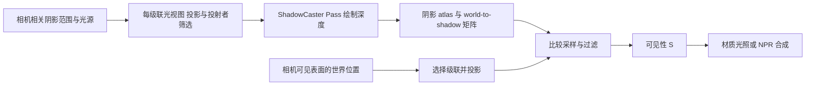

# E02｜阴影图、投影、Bias 与级联

> 核心问题：物体为什么能把影子投到另一个物体上，又为什么会出现自遮挡斑纹、漂浮和远处锯齿？本卡从光源视角的深度比较建立机制，再追踪 URP 的生产与采样。

## 1. 阴影是另一视角下的可见性

相机深度回答“相机首先看到谁”；阴影图回答“从光源出发首先遇到谁”。二者使用不同投影和筛选，不能用相机深度替代普通阴影图。

把表面世界位置 P 变换到光空间，得到阴影纹理坐标 uv 和待比较深度 z。常规深度方向的教学判定是：`z_receiver <= z_nearest + ε` 时可见，否则被更近表面遮挡。ε 表示容差概念；实际 URP 可能在投射者位置、光栅深度等位置施加偏移，并处理 Reversed-Z，不能把这个式子的正号直接抄到所有后端。

方向光通常使用正交投影；聚光灯使用透视投影；点光需要覆盖多个方向。这一张的完整实验只处理**主方向光实时阴影**，不实现点光六面阴影或烘焙 Shadowmask。

本地资料为 **Unity 6.7 Beta / 6000.7、2026-06-26**。Graphics 固定提交 `275a7f9ad9330e3cf7f3ea57a0b242a551fde291`，包 manifest 为 **URP/Core 17.0.4、Unity 6000.0**。公开代码能解释管线组织与 Shader 计算，不能揭示所有设备缓存、压缩或驱动实现。

## 2. 从 ShadowCaster 到相机颜色的完整链路



固定 `MainLightShadowCasterPass` 逐级联准备投影与阴影 RendererList，并设置偏移；`ShadowUtils` 提取矩阵、安排 atlas slice 和绘制状态。生产者采用光源相关的剔除结果，不等于把相机可见对象原封不动再画一遍。画面之外的对象仍可能向画面内投影。

接收端 `TransformWorldToShadowCoord(P)` 选择级联并转换坐标，`GetMainLight(shadowCoord,P,shadowMask)` 取得包含阴影可见性的主光数据。本文在片元中用插值世界位置选择级联，避免仅在三角形顶点选定不同级联矩阵后混合出错误坐标。

参见 [MainLightShadowCasterPass](https://github.com/Unity-Technologies/Graphics/blob/275a7f9ad9330e3cf7f3ea57a0b242a551fde291/Packages/com.unity.render-pipelines.universal/Runtime/Passes/MainLightShadowCasterPass.cs)、[ShadowUtils](https://github.com/Unity-Technologies/Graphics/blob/275a7f9ad9330e3cf7f3ea57a0b242a551fde291/Packages/com.unity.render-pipelines.universal/Runtime/ShadowUtils.cs) 和 [Shadows.hlsl](https://github.com/Unity-Technologies/Graphics/blob/275a7f9ad9330e3cf7f3ea57a0b242a551fde291/Packages/com.unity.render-pipelines.universal/ShaderLibrary/Shadows.hlsl)。

## 3. Bias 到底改变了什么

阴影图是有限分辨率和精度的采样。接收位置与投射深度的采样点不完全一致；斜面和过滤邻域会放大差异，使同一表面误判自己被挡住，出现 shadow acne。

| 调节 | 意图 | 过量时的典型代价 |
| --- | --- | --- |
| 深度相关偏移 | 让投射与接收深度比较留出容差 | 影子与接触点分离、漏光 |
| Normal Bias | 根据几何法线移动投射位置，缓解掠射自遮挡 | 投影轮廓缩小或变形，薄片漏光 |
| 更高分辨率/更紧覆盖范围 | 改善每个阴影 texel 表达的空间尺度 | 更多存储/绘制成本，或减少有效覆盖 |
| PCF 过滤 | 平均邻域比较结果，缓和边缘离散 | 增加采样、软化细节，并改变偏移需求 |

固定 `ShadowUtils.GetShadowBias` 根据投影覆盖与分辨率估算 texel 世界尺度，再将 UI 偏移转换为 Shader 参数。`ApplyShadowBias` 结合光方向和法线项改变投射顶点；法线项带有 `1-saturate(N·L)` 因子。引擎绘制阴影时还设置光栅深度偏移。因此 **Light Inspector 的 Depth 值不能直接等同于 D3D 的整数 DepthBias，也不等于世界米数**。

例如某级联正交宽度约 40 米、有效宽度 1024 texel，则每 texel 约 `40/1024=0.0391 米`；覆盖扩为 80 米而分辨率不变，尺度变为约 0.0781 米。这个估算解释了为何阴影范围改变后，同一 UI Bias 的世界效果可能不同，不能作为精确的所有级联投影尺寸。

URP 可以使用 Asset 默认 Bias，也可以在 Light 上选择 Custom。必须先确认实际生效位置。参见 [URP 阴影排查文档](https://docs.unity3d.com/6000.0/Documentation/Manual/urp/shadows-troubleshooting-urp.html)；本地同路径已按 6000.7 核对。

## 4. PCF 与级联解决不同问题

PCF 是对多次深度比较结果进行过滤，不是把普通深度纹理先平均再比较。教学例子中四个等权样本的可见性为 `1,1,0,0`，得到 S=0.5；实际硬件比较过滤还受亚 texel 权重和采样核影响。S 因此不一定只有 0 与 1，也不直接代表物理面光源的真实半影。

级联将相机关注范围分成多个区域，各自分配方向光投影，使近处获得更合适的采样密度。它没有增加光源数量；同一投射者可能进入多个级联的绘制。分辨率差异、投影变化及级联切换可能产生接缝或抖动。通用机制参见 [Microsoft：Cascaded Shadow Maps](https://learn.microsoft.com/en-us/windows/win32/dxtecharts/cascaded-shadow-maps)。

固定 URP 的 `ComputeCascadeIndex` 使用级联分割球体测试；不能仅凭“级联按距离划分”的概念，就给 Shader 手写一个与引擎不同的线性距离分段。超出有效级联时有专门的索引/矩阵处理，接收端还可能按 Shadow Distance 淡出到完全可见。

## 5. 完整 Unity 实验：同时投射与接收

保存为 `E02ShadowLab.shader`，创建材质选择 `Encyclopedia/E02ShadowLab`，赋给地面、Sphere 和 Cube。本例包含自己的 ShadowCaster；没有借用另一个材质的 UsePass，因此主体与阴影都使用当前网格的静态位置。

```shaderlab
Shader "Encyclopedia/E02ShadowLab"
{
    Properties
    {
        _BaseColor("Base Color", Color) = (0.7,0.7,0.7,1)
        [Enum(Visibility,0,Lambert,1,Cascades,2)] _View("View", Float) = 0
    }
    SubShader
    {
        Tags { "RenderPipeline"="UniversalPipeline" "RenderType"="Opaque" "Queue"="Geometry" }
        HLSLINCLUDE
        #include "Packages/com.unity.render-pipelines.universal/ShaderLibrary/Core.hlsl"
        CBUFFER_START(UnityPerMaterial)
            float4 _BaseColor;
            float _View;
        CBUFFER_END
        ENDHLSL
        Pass
        {
            Name "E02Forward"
            Tags { "LightMode"="UniversalForward" }
            Cull Back ZWrite On ZTest LEqual
            HLSLPROGRAM
            #pragma target 3.5
            #pragma vertex Vert
            #pragma fragment Frag
            #pragma multi_compile _ _MAIN_LIGHT_SHADOWS _MAIN_LIGHT_SHADOWS_CASCADE
            #pragma multi_compile_fragment _ _SHADOWS_SOFT _SHADOWS_SOFT_LOW _SHADOWS_SOFT_MEDIUM _SHADOWS_SOFT_HIGH
            #include "Packages/com.unity.render-pipelines.universal/ShaderLibrary/Lighting.hlsl"
            struct Attributes { float4 positionOS : POSITION; float3 normalOS : NORMAL; };
            struct Varyings
            {
                float4 positionCS : SV_POSITION;
                float3 positionWS : TEXCOORD0;
                float3 normalWS : TEXCOORD1;
            };
            Varyings Vert(Attributes i)
            {
                Varyings o;
                o.positionWS = TransformObjectToWorld(i.positionOS.xyz);
                o.positionCS = TransformWorldToHClip(o.positionWS);
                o.normalWS = TransformObjectToWorldNormal(i.normalOS);
                return o;
            }
            float4 Frag(Varyings i) : SV_Target
            {
                float4 sc = TransformWorldToShadowCoord(i.positionWS);
                Light light = GetMainLight(sc, i.positionWS, half4(1,1,1,1));
                if (_View < 0.5) return float4(light.shadowAttenuation.xxx, 1);
                if (_View > 1.5)
                {
                    uint cascade = 0;
                    #if defined(_MAIN_LIGHT_SHADOWS_CASCADE)
                        cascade = (uint)ComputeCascadeIndex(i.positionWS);
                    #endif
                    float3 c = cascade == 0 ? float3(1,0.2,0.2) :
                               cascade == 1 ? float3(0.2,1,0.2) :
                               cascade == 2 ? float3(0.2,0.3,1) :
                               cascade == 3 ? float3(1,1,0.2) : float3(0,0,0);
                    return float4(c,1);
                }
                float q = saturate(dot(normalize(i.normalWS), light.direction));
                return float4(_BaseColor.rgb * light.color * light.distanceAttenuation *
                              q * light.shadowAttenuation, 1);
            }
            ENDHLSL
        }
        Pass
        {
            Name "ShadowCaster"
            Tags { "LightMode"="ShadowCaster" }
            Cull Back ZWrite On ZTest LEqual ColorMask 0
            HLSLPROGRAM
            #pragma target 3.5
            #pragma vertex ShadowVert
            #pragma fragment ShadowFrag
            #include "Packages/com.unity.render-pipelines.universal/ShaderLibrary/Shadows.hlsl"
            float3 _LightDirection;
            struct Attributes { float4 positionOS : POSITION; float3 normalOS : NORMAL; };
            struct Varyings { float4 positionCS : SV_POSITION; };
            Varyings ShadowVert(Attributes i)
            {
                Varyings o;
                float3 p = TransformObjectToWorld(i.positionOS.xyz);
                float3 n = TransformObjectToWorldNormal(i.normalOS);
                o.positionCS = TransformWorldToHClip(ApplyShadowBias(p, n, _LightDirection));
                #if UNITY_REVERSED_Z
                    o.positionCS.z = min(o.positionCS.z, o.positionCS.w * UNITY_NEAR_CLIP_VALUE);
                #else
                    o.positionCS.z = max(o.positionCS.z, o.positionCS.w * UNITY_NEAR_CLIP_VALUE);
                #endif
                return o;
            }
            float4 ShadowFrag(Varyings i) : SV_Target { return 0; }
            ENDHLSL
        }
    }
}
```

ShadowCaster 中光栅化使用引擎为阴影绘制设置的视图/投影；`TransformWorldToHClip` 此时不是普通相机视角。返回 0 不会把阴影涂黑：ColorMask 0 禁止颜色写入，关键结果是深度附件。

### 场景与单变量操作

1. URP Forward、Linear、单相机，关闭屏幕空间阴影 Renderer Feature、其他 Feature、后处理、Depth Priming、MSAA、GPU Resident Drawer、烘焙与附加光。开启主光实时阴影，Sun Source 指定一盏 Directional Light，Shadow Strength=1。
2. 地面位于 y=0，Cube 中心 y=0.5，Sphere 中心 y=1，均开启 Renderer Cast Shadows。相机能看清接触处；主光斜向照射。Visibility 视图白表示可见、黑表示遮挡，中间值来自过滤/强度/淡出。
3. 先 Hard Shadows、单级联，固定阴影范围和分辨率。Light 的 Bias 选择 Custom，只降低 Depth 与 Normal 中的一项，观察 acne 是否增加；若没有出现，记录“该场景未复现”，不要伪造结果。
4. 保持其他项不动，逐渐增大 Depth，关注接触阴影是否分离；再单独增大 Normal，关注球、薄 Cube 或薄片的投影轮廓缩小/漏光。目标是识别趋势，不是找一个对所有角色通用的神奇数值。
5. 固定覆盖范围，将主光阴影分辨率从较低值提高，比较边缘阶梯。再固定分辨率扩大 Shadow Distance，观察近处有效采样密度可能如何变化；不要同时调整 Bias。
6. 开启 2 或 4 级联，切 Cascades 视图，在更长地面上前后移动相机，观察分区。该视图显示所选索引，不表示阴影本身存在，也不能单独证明 atlas 分辨率。
7. 切回 Visibility，把主光改为 Soft Shadows，核对相应 Shader 关键字，观察过渡。再切 Lambert，区分几何暗面与投射阴影。

Frame Debugger 应分别检查 ShadowCaster 绘制和相机 E02Forward。若没有阴影，按顺序查主光/Asset 开关、Shadow Distance、Cast Shadows、ShadowCaster Pass、变体和接收采样；仅有接收函数而没有投射 Pass 不会自动生成该物体的影子。

实验只支持静态、不透明网格与主方向光。没有 alpha clip、蒙皮 Shader 变形、点/聚光投影适配、DepthNormals、MotionVectors 或 XR。扩展到裁剪发丝时，ShadowCaster 必须复现同一 UV、遮罩和变形，不能直接沿用这个实心轮廓。

## 6. NPR 中的取舍

脸部需要干净大色块，但投射阴影能表达刘海、鼻子、帽檐和手部遮挡。过大的 Normal Bias 会抹掉这些接触关系；强行对 S 做硬阈值则可能把 PCF 的微小波动变成明显闪烁。模型、采样密度、Bias 和合成顺序需要分别诊断。

级联通常增加阴影绘制工作，软阴影增加比较采样；实际代价受投射者数量、atlas 尺寸、覆盖和硬件影响。多个级联并不等于物体所有 Pass 一律乘相同倍数，GPU 时间需要实际测量。

## 7. 自测与验证边界

1. **相机看不到的物体能投影到画面吗？** 可以，只要进入相关光源阴影投射范围和筛选。
2. **为什么平均深度再比较不等于 PCF？** 比较是非线性操作，PCF 过滤的是比较结果。
3. **提高 Bias 是否总改善质量？** 不是，会牺牲接触与轮廓，甚至漏光。
4. **级联是否增加了方向光数量？** 没有，是同一光的多个覆盖区域。
5. **阴影采样值 1 是否表示漫反射最亮？** 不表示；它表示可见性，朝向和灯光颜色还要独立计算。

已核对固定源码和本地 `Manual/urp/use-built-in-shader-methods-shadows.html`、`shadows-troubleshooting-urp.html`、`shadow-resolution-urp.html`。本地根目录 `E:\Claude Skills\学习仓库\09_Unity官方文档\Documentation\en`。完整示例**未在 Unity 编译、抓帧或设备测时**，上述画面是待验证预测。

前一张：[E01 明暗基线](E01-Lambert基线与艺术化明暗.md)。下一张：[E03 Ramp 与阴影合成](E03-Ramp色阶阈值与阴影合成.md)。实验导航：[E01—E04](../实验/E01-E04实验说明.md)。
