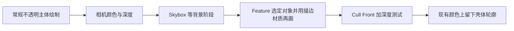

# E07｜反壳描边与宽度控制

> 核心问题：放大模型背面为什么能留下轮廓，线宽又为什么随距离、缩放和接缝变化？本卡显式提交描边绘制，分别比较物体、世界和投影像素宽度。

## 1. 反壳不是给颜色图加一圈滤镜

反壳方法再次绘制模型，使顶点沿指定方向外扩，并剔除正面、留下外扩壳的背面。主体深度挡住内部重叠部分，超出原轮廓的壳仍有机会通过深度测试，形成线条。

它增加了几何处理与 Draw 工作；效果依赖网格闭合程度、法线/外扩方向、遮挡、投影和最终绘制顺序。开口、薄片、自交或不合理法线可能出现内部黑块、断裂和接缝，不能把它当作通用轮廓求解器。

本地文档为 Unity **6.7 Beta / 6000.7、2026-06-26**。Graphics 固定 `275a7f9ad9330e3cf7f3ea57a0b242a551fde291`（URP/Core **17.0.4、6000.0**）；UTS 固定 `1520a78a95292cb045f1edb4d60ea0dba2f213b3`（**0.15.1-preview、6000.0**）。完整例子使用 URP Forward + Render Graph、一个 Base Game Camera。

## 2. 谁来执行描边 Pass

Shader 中写了两个 Pass，不代表 URP 常规物体绘制会自动把两者依次执行。管线会按 LightMode 等条件选择具体 Pass；额外描边应有明确的绘制入口。

本例让物体继续使用普通 URP/Lit 材质，由一个 Renderer Feature 再次选择指定 Layer 的不透明对象，使用描边材质覆盖绘制。这个 Draw 读取现有深度、写入现有颜色；它发生在 Skybox 之后，避免背景随后覆盖 ZWrite Off 的外圈。



实验关闭透明物体和后处理，Feature 放在 `BeforeRenderingPostProcessing`。实际角色若含透明头发或后续合成，需要重新决定绘制时机与遮挡规则。

## 3. 三种宽度的单位不同

| 模式 | 操作 | 主要现象 |
| --- | --- | --- |
| 物体空间 | `P_os += D_os × widthOS` | 宽度随对象缩放改变，非均匀缩放尤其明显 |
| 世界空间 | `P_ws += D_ws × widthWS`，D_ws 为单位方向 | 位移世界长度可控；透视下远处屏幕宽度变小 |
| 投影像素 | 修改 clip.xy，位移按当前目标像素换算 | 更接近固定投影位移，但仍非严格恒定轮廓厚度 |

设 clip 位置为 c，NDC 为 `c.xy/c.w`。在 W×H 的目标上，沿单位像素方向 d 移动 k 像素，需要：

`deltaNDC = (2k×d.x/W, 2k×d.y/H)`，`c.xy += deltaNDC×c.w`。

乘回 w 才能在透视除法后保留预定 NDC 偏移。若直接向 clip.xy 加固定值，实际偏移会被 w 除掉。X/Y 分别用 W/H 换算，不能忽略宽高比。这里的像素属于当前渲染目标；降低 Render Scale 后再上采样，最终显示像素宽度会改变。

1920×1080 目标上，水平 3 像素对应 NDC 0.003125；垂直 3 像素对应约 0.005556。c.w=10 时必须加回 10 倍的 clip 偏移，透视除法后才回到上述数值。

本例先投影 P 与沿外扩方向相距 0.01 世界单位的探测点，得到屏幕方向，再归一化到 k 像素。方向几乎沿视线时投影差可能为零，例子选择不偏移。相机附近、裁剪边缘、大挤出和稀疏网格仍有误差，**固定顶点投影偏移不等于所有轮廓位置都严格 k 像素厚**。

## 4. 完整 Unity 实验：明确的第二次绘制

保存为 `E07HullOutline.shader`，创建描边材质。Direction 的 Normal 使用法线；Radial 使用从物体原点出发的径向向量，便于演示原点和外扩用途的区别。Radial 不是通用平滑法线替代方案。

```shaderlab
Shader "Encyclopedia/E07HullOutline"
{
    Properties
    {
        _OutlineColor("Outline Color", Color) = (0.02,0.01,0.04,1)
        [Enum(Object,0,World,1,Pixels,2)] _WidthMode("Width Space", Float) = 2
        [Enum(Normal,0,Radial,1)] _Direction("Extrusion Direction", Float) = 0
        _WidthOS("Object Width", Range(0,0.2)) = 0.03
        _WidthWS("World Width", Range(0,0.2)) = 0.03
        _WidthPixels("Target Pixel Offset", Range(0,12)) = 3
    }
    SubShader
    {
        Tags { "RenderPipeline"="UniversalPipeline" }
        Pass
        {
            Name "E07Hull"
            Cull Front ZWrite Off ZTest LEqual Blend Off
            HLSLPROGRAM
            #pragma target 3.5
            #pragma vertex Vert
            #pragma fragment Frag
            #include "Packages/com.unity.render-pipelines.universal/ShaderLibrary/Core.hlsl"
            CBUFFER_START(UnityPerMaterial)
                float4 _OutlineColor;
                float _WidthMode, _Direction, _WidthOS, _WidthWS, _WidthPixels;
            CBUFFER_END
            struct Attributes { float4 positionOS : POSITION; float3 normalOS : NORMAL; };
            struct Varyings { float4 positionCS : SV_POSITION; };
            Varyings Vert(Attributes i)
            {
                Varyings o;
                float3 dirOS = i.normalOS;
                if (_Direction > 0.5 && dot(i.positionOS.xyz,i.positionOS.xyz) > 1e-8)
                    dirOS = normalize(i.positionOS.xyz);
                float3 p = TransformObjectToWorld(i.positionOS.xyz);
                float3 dirWS = _Direction < 0.5 ? TransformObjectToWorldNormal(dirOS) :
                                                TransformObjectToWorldDir(dirOS,true);
                if (_WidthMode < 0.5)
                    o.positionCS = TransformObjectToHClip(i.positionOS.xyz + normalize(dirOS)*_WidthOS);
                else if (_WidthMode < 1.5)
                    o.positionCS = TransformWorldToHClip(p + dirWS*_WidthWS);
                else
                {
                    float4 c = TransformWorldToHClip(p);
                    float4 probe = TransformWorldToHClip(p + dirWS*0.01);
                    if (c.w > 1e-5 && probe.w > 1e-5)
                    {
                        float2 pixelDir = (probe.xy/probe.w - c.xy/c.w) * 0.5 * _ScaledScreenParams.xy;
                        float len2 = dot(pixelDir,pixelDir);
                        if (len2 > 1e-8)
                        {
                            pixelDir *= rsqrt(len2);
                            c.xy += pixelDir * (2*_WidthPixels/_ScaledScreenParams.xy) * c.w;
                        }
                    }
                    o.positionCS = c;
                }
                return o;
            }
            float4 Frag(Varyings i) : SV_Target { return _OutlineColor; }
            ENDHLSL
        }
    }
}
```

保存为 `E07HullOutlineFeature.cs`，添加到当前 Universal Renderer。Layers 只选择实验对象所在层；Outline Material 赋上述材质。无需把主体材质替换为黑色描边材质。

```csharp
using UnityEngine;
using UnityEngine.Rendering;
using UnityEngine.Rendering.RendererUtils;
using UnityEngine.Rendering.RenderGraphModule;
using UnityEngine.Rendering.Universal;

public class E07HullOutlineFeature : ScriptableRendererFeature
{
    public LayerMask layers;
    public Material outlineMaterial;
    HullPass pass;
    public override void Create()
    {
        pass = new HullPass { renderPassEvent = RenderPassEvent.BeforeRenderingPostProcessing };
    }
    public override void AddRenderPasses(ScriptableRenderer renderer, ref RenderingData data)
    {
        if (outlineMaterial == null || !outlineMaterial.shader.isSupported || layers.value == 0) return;
        if (data.cameraData.cameraType != CameraType.Game || data.cameraData.renderType != CameraRenderType.Base) return;
        pass.material = outlineMaterial;
        pass.layers = layers.value;
        renderer.EnqueuePass(pass);
    }
    class HullPass : ScriptableRenderPass
    {
        public Material material;
        public int layers;
        class PassData { public RendererListHandle list; }
        public override void RecordRenderGraph(RenderGraph graph, ContextContainer frameData)
        {
            var rendering = frameData.Get<UniversalRenderingData>();
            var camera = frameData.Get<UniversalCameraData>();
            var resources = frameData.Get<UniversalResourceData>();
            if (!resources.activeDepthTexture.IsValid()) return;
            var tags = new[] { new ShaderTagId("UniversalForward"), new ShaderTagId("UniversalForwardOnly"),
                               new ShaderTagId("SRPDefaultUnlit") };
            var desc = new RendererListDesc(tags, rendering.cullResults, camera.camera)
            {
                renderQueueRange = RenderQueueRange.opaque,
                sortingCriteria = SortingCriteria.CommonOpaque,
                layerMask = layers,
                overrideMaterial = material,
                overrideMaterialPassIndex = 0
            };
            using (var builder = graph.AddRasterRenderPass<PassData>("E07 Inverted Hull",out var data))
            {
                data.list = graph.CreateRendererList(desc);
                builder.UseRendererList(data.list);
                builder.SetRenderAttachment(resources.activeColorTexture,0,AccessFlags.ReadWrite);
                builder.SetRenderAttachmentDepth(resources.activeDepthTexture,AccessFlags.Read);
                builder.SetRenderFunc(static (PassData p,RasterGraphContext ctx) => ctx.cmd.DrawRendererList(p.list));
            }
        }
    }
}
```

颜色附件需要保留主体，因此声明 ReadWrite；深度只读，与 Shader 的 ZWrite Off 一致。没有同时采样正在写入的颜色纹理。API 对照固定 [RendererList 创建](https://github.com/Unity-Technologies/Graphics/blob/275a7f9ad9330e3cf7f3ea57a0b242a551fde291/Packages/com.unity.render-pipelines.universal/Runtime/Passes/DrawObjectsPass.cs) 和本地 Render Graph 附件说明。

### 场景与对照

1. URP Forward、Render Graph 开启、Intermediate Texture=Always、单相机。关闭 MSAA、XR、动态分辨率、Depth Priming、阴影、SSAO、GPU Resident Drawer、后处理、透明物体和其他 Feature。
2. 新建 Layer `E07Outline`，给一个 URP/Lit Sphere 和 Cube 使用；相机包含此层，Feature 只选择此层。另放一个普通 Layer 的不透明遮挡物。
3. Normal / Object 模式观察壳体；改变整体缩放，物体空间宽度的世界效果随之改变。切 World，同数值表示固定世界位移，但远处屏幕线仍细。
4. 切 Pixels=3，固定渲染目标分辨率并移动相机。比较轮廓位移趋向稳定的范围，同时记录极近、稀疏顶点和尖角处的偏差。
5. 在 Cube 上比较 Normal / Radial。硬边顶点沿各自法线挤出可能分离，径向向量可在这个以原点为中心的凸形上改变接缝；把原点不在中心的模型拿来测试会揭示它的限制。
6. 用前方不透明物遮挡角色，壳体应遵循场景深度。若把 ZTest 改成 Always，会看到穿透式轮廓，这是另一种效果，不能称为修复深度问题。
7. Frame Debugger 找到主体和 `E07 Inverted Hull` 下的额外 Draw，核对 Cull Front、ZWrite Off、深度与颜色附件。没有额外 Draw 时先查 Feature、Layer、Shader 和相机，别先增加 Width。

## 5. 常见失败与生产约束

| 现象 | 优先检查 |
| --- | --- |
| 硬边接缝断裂 | 外扩方向是否跨拆点一致，是否需要独立描边数据 |
| 嘴内、眼窝和衣领出现黑块 | 开口/凹陷背面被壳绘制，需区域遮罩、拓扑或模板控制 |
| 非均匀缩放后粗细不同 | 宽度单位、方向变换与屏幕投影定义 |
| 靠近画面边缘整圈突然消失 | CPU/GPU 剔除使用的原 bounds 未包含外扩几何 |
| 动画时轮廓脱离主体 | 两次绘制的变形、蒙皮或外扩方向不一致 |
| 背景覆盖描边 | 绘制时机早于背景且外圈未写深度 |

Shader 改顶点不会自动扩展引擎剔除 bounds。生产代码应对原 bounds 做保守扩展；像素宽度对应的世界范围随距离和视角变化，不可永远使用固定的小 margin。本实验让对象留在视锥内部，并未实现通用动态 bounds 管理。

固定 UTS 同时存在法线/位置外扩、距离相关宽度、贴图控制和深度偏移；这些组合不能简化成“始终固定像素宽度”。[UTS Outline](https://github.com/Unity-Technologies/com.unity.toonshader/blob/1520a78a95292cb045f1edb4d60ea0dba2f213b3/com.unity.toonshader/Runtime/Shaders/URP/UniversalToonOutline.hlsl)。

## 6. 自测与验证边界

1. **只在 Shader 增加 Pass 就一定执行两次吗？** 不保证，必须有管线选择/提交入口。
2. **为什么像素偏移要乘 clip.w？** 为抵消透视除法，使 NDC 偏移符合目标。
3. **世界位移固定等于屏幕线宽固定吗？** 透视下不等价。
4. **径向外扩能修好任意角色吗？** 不能，它依赖原点与形状，凹陷和独立零件尤其危险。
5. **只改 Shader 就能避免壳体被错误剔除吗？** 不一定，还要处理引擎使用的 bounds。

已核对固定 SpaceTransforms、RendererList、Render Graph 接口和 UTS Outline；本地文档根目录 `E:\Claude Skills\学习仓库\09_Unity官方文档\Documentation\en`。**Unity 编译、线宽实测、动画和设备性能未验证**。本例不提供透明、裁剪、顶点动画、XR 或实例化完整支持。

前一张：[E06 高光与 MatCap](E06-NPR高光头发金属与MatCap.md)。下一张：[E08 屏幕边界](E08-屏幕空间描边与边界判定.md)。实践汇总：[E 阶段检查点](../实验/E阶段检查点.md)。
