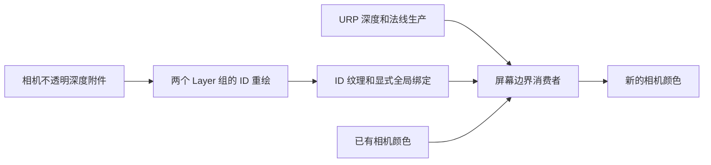

# E08｜屏幕空间描边与深度、法线、ID 边界

> 核心问题：一条屏幕线究竟来自遮挡、方向突变还是对象分类？本卡先分开显示三种边界，再组合输出；其中 ID 图由实际几何重绘生成，并使用相机深度避免穿透。

## 1. 三张图看见的是不同信息

屏幕空间描边在像素邻域中比较数据，不会直接访问完整网格拓扑。通常只能处理当前资源记录的最前方表面；被挡住的背面、未写入的透明层和离屏部分不会凭空出现。

| 输入 | 能检测的典型边界 | 可能漏掉或误判的内容 |
| --- | --- | --- |
| 线性深度 | 遮挡轮廓、深度不连续 | 同深度相邻对象；掠射平面梯度可能被误认为边缘 |
| 世界法线 | 硬折角、方向突变 | 同法线对象分界；艺术法线/法线贴图也可能产生假边 |
| ID / 分类图 | 分类不同的可见区域 | 相同 ID 的对象无法区分；图中缺失对象无法检测 |

ID 是标签，不是颜色亮度。本例 ID 0 表示未标记区域，1/2 表示两个 Layer 组，**不是每个 Renderer 的唯一身份**。同组对象接触处的 ID 边缘可以消失，这恰好用来验证数据语义。

本地文档为 Unity **6.7 Beta / 6000.7、2026-06-26**。Graphics 固定提交 `275a7f9ad9330e3cf7f3ea57a0b242a551fde291`，manifest 为 **URP/Core 17.0.4、Unity 6000.0**。完整实验限定 PC、URP Forward、Render Graph、单 Base Game Camera、透视投影、静态不透明 URP/Lit 对象。

## 2. 邻域判定公式

中心和邻居的正观察轴距离分别为 z0、z1，本例深度信号为：

`eD = |z0-z1| / max(min(z0,z1),0.001)`。

这把阈值解释为近似相对深度差。例如 5 米与 5.1 米的差约 0.02，50 米与 50.1 米约 0.002。它不保证消除掠射面的梯度，也不是唯一的合理定义；还可结合绝对距离、视角或几何预测。

单位法线的方向差使用 `eN = 1-dot(N0,N1)`。相同方向为 0，垂直为 1；阈值 0.15 对应夹角约 31.8°。直接比较 RGB 三通道亮度不是同一种角度度量。

ID 判定使用 `eI = (ID0 != ID1)`，与材质颜色无关。若 ID 存入 UNorm，必须选择稳定的编码和采样：本例存 `ID/255`，点采样后 `round(value×255)` 恢复，纹理使用线性 RGBA8、无 MSAA、无 Mip。禁止把 ID 做 sRGB 解码或普通双线性混合。

四邻域取最大响应，分别与阈值比较，组合为 `max(edgeD,edgeN,edgeI)`。这是教学检测器：它会在边界两侧产生响应，采样半径也不等于严格最终线宽。需要单侧内描边、外描边或恒定宽度时，应另设计深度前后选择、膨胀或距离变换。

## 3. 生产数据比阈值更先决定结果

Feature 的 `ConfigureInput(Depth|Normal)` 告诉 URP 安排所需生产；Render Graph 的资源声明再建立本次消费依赖。相机深度可能来自复制或预通过，法线通常需要匹配 DepthNormals Pass。主体可见不保证这些资源都有该对象。[固定 UniversalRendererRenderGraph](https://github.com/Unity-Technologies/Graphics/blob/275a7f9ad9330e3cf7f3ea57a0b242a551fde291/Packages/com.unity.render-pipelines.universal/Runtime/UniversalRendererRenderGraph.cs)。



ID 重绘读取已有深度并使用 ZTest LEqual、ZWrite Off。若直接 ZTest Always，隐藏对象也会写 ID，随后出现穿透线。若主体有顶点动画或 alpha clip，而 ID Pass 没复现，ID 轮廓同样会错。

## 4. 完整 Feature：ID 生产与描边消费

保存为 `E08ScreenEdgesFeature.cs`。需要三个材质：两个使用下文 ID Shader，分别 Id=1、2；一个使用屏幕 Shader。Group A/B 是两个不相交的 LayerMask。

```csharp
using UnityEngine;
using UnityEngine.Experimental.Rendering;
using UnityEngine.Rendering;
using UnityEngine.Rendering.RendererUtils;
using UnityEngine.Rendering.RenderGraphModule;
using UnityEngine.Rendering.Universal;

public class E08ScreenEdgesFeature : ScriptableRendererFeature
{
    public LayerMask groupA, groupB;
    public Material idMaterialA, idMaterialB, edgeMaterial;
    EdgePass pass;
    public override void Create()
    {
        pass = new EdgePass { renderPassEvent = RenderPassEvent.BeforeRenderingPostProcessing };
    }
    public override void AddRenderPasses(ScriptableRenderer renderer,ref RenderingData data)
    {
        if(idMaterialA==null || idMaterialB==null || edgeMaterial==null) return;
        if(!idMaterialA.shader.isSupported || !idMaterialB.shader.isSupported || !edgeMaterial.shader.isSupported) return;
        if(data.cameraData.cameraType!=CameraType.Game || data.cameraData.renderType!=CameraRenderType.Base) return;
        pass.a=groupA.value; pass.b=groupB.value;
        pass.matA=idMaterialA; pass.matB=idMaterialB; pass.effect=edgeMaterial;
        pass.ConfigureInput(ScriptableRenderPassInput.Depth | ScriptableRenderPassInput.Normal);
        renderer.EnqueuePass(pass);
    }
    class EdgePass : ScriptableRenderPass
    {
        public int a,b;
        public Material matA,matB,effect;
        static readonly int IdTexture = Shader.PropertyToID("_E08IdTexture");
        class IdData { public RendererListHandle a,b; }
        class EdgeData { public TextureHandle color; public Material material; }
        static RendererListHandle CreateList(RenderGraph graph,UniversalRenderingData rendering,
            UniversalCameraData camera,int layers,Material material)
        {
            var tags=new[] {new ShaderTagId("UniversalForward"),new ShaderTagId("UniversalForwardOnly"),
                            new ShaderTagId("SRPDefaultUnlit")};
            var desc=new RendererListDesc(tags,rendering.cullResults,camera.camera)
            {
                renderQueueRange=RenderQueueRange.opaque,
                sortingCriteria=SortingCriteria.CommonOpaque,
                layerMask=layers,
                overrideMaterial=material,
                overrideMaterialPassIndex=0
            };
            return graph.CreateRendererList(desc);
        }
        public override void RecordRenderGraph(RenderGraph graph,ContextContainer frameData)
        {
            var resources=frameData.Get<UniversalResourceData>();
            var rendering=frameData.Get<UniversalRenderingData>();
            var camera=frameData.Get<UniversalCameraData>();
            if(resources.isActiveTargetBackBuffer || !resources.activeDepthTexture.IsValid() ||
               !resources.cameraDepthTexture.IsValid() || !resources.cameraNormalsTexture.IsValid()) return;
            var source=resources.activeColorTexture;
            var desc=graph.GetTextureDesc(source);
            desc.depthBufferBits=DepthBits.None;
            desc.msaaSamples=MSAASamples.None;
            desc.bindTextureMS=false;
            desc.clearBuffer=false;
            desc.name="E08 Edge Color";
            var output=graph.CreateTexture(desc);
            desc.format=GraphicsFormat.R8G8B8A8_UNorm;
            desc.name="E08 Group IDs";
            var ids=graph.CreateTexture(desc);
            using(var builder=graph.AddRasterRenderPass<IdData>("E08 Visible Group IDs",out var data))
            {
                data.a=CreateList(graph,rendering,camera,a,matA);
                data.b=CreateList(graph,rendering,camera,b,matB);
                builder.UseRendererList(data.a);
                builder.UseRendererList(data.b);
                builder.SetRenderAttachment(ids,0,AccessFlags.WriteAll);
                builder.SetRenderAttachmentDepth(resources.activeDepthTexture,AccessFlags.Read);
                builder.SetGlobalTextureAfterPass(ids,IdTexture);
                builder.AllowPassCulling(false);
                builder.SetRenderFunc(static (IdData p,RasterGraphContext ctx)=>
                {
                    ctx.cmd.ClearRenderTarget(false,true,Color.clear);
                    ctx.cmd.DrawRendererList(p.a);
                    ctx.cmd.DrawRendererList(p.b);
                });
            }
            using(var builder=graph.AddRasterRenderPass<EdgeData>("E08 Screen Edges",out var data))
            {
                data.color=source; data.material=effect;
                builder.UseTexture(source,AccessFlags.Read);
                builder.UseTexture(resources.cameraDepthTexture,AccessFlags.Read);
                builder.UseTexture(resources.cameraNormalsTexture,AccessFlags.Read);
                builder.UseGlobalTexture(IdTexture,AccessFlags.Read);
                builder.SetRenderAttachment(output,0,AccessFlags.WriteAll);
                builder.SetRenderFunc(static (EdgeData p,RasterGraphContext ctx)=>
                    Blitter.BlitTexture(ctx.cmd,p.color,new Vector4(1,1,0,0),p.material,0));
            }
            resources.cameraColor=output;
        }
    }
}
```

ID Pass 的 Clear 是完整生产的一部分；即使列表为空，也需要确定的全零 ID 图，示例为此禁止该 Pass 被裁剪。消费者仍显式声明真实依赖，不能用禁用裁剪代替资源声明。`SetGlobalTextureAfterPass` 与 `UseGlobalTexture` 将绑定和依赖关联起来，不在回调中偷偷修改未声明的全局资源。[固定 Builder 接口](https://github.com/Unity-Technologies/Graphics/blob/275a7f9ad9330e3cf7f3ea57a0b242a551fde291/Packages/com.unity.render-pipelines.core/Runtime/RenderGraph/IRenderGraphBuilder.cs)。

## 5. 两个完整 Shader

第一份保存为 `E08GroupId.shader`。两个材质分别设置 Id=1、2，物体主体仍使用 URP/Lit。

```shaderlab
Shader "Encyclopedia/E08GroupId"
{
    Properties { _Id("Group Id (1 or 2)", Range(1,2)) = 1 }
    SubShader
    {
        Tags { "RenderPipeline"="UniversalPipeline" }
        Pass
        {
            Cull Back ZWrite Off ZTest LEqual Blend Off
            HLSLPROGRAM
            #pragma vertex Vert
            #pragma fragment Frag
            #include "Packages/com.unity.render-pipelines.universal/ShaderLibrary/Core.hlsl"
            CBUFFER_START(UnityPerMaterial)
                float _Id;
            CBUFFER_END
            struct Attributes { float4 positionOS : POSITION; };
            struct Varyings { float4 positionCS : SV_POSITION; };
            Varyings Vert(Attributes i)
            {
                Varyings o;
                o.positionCS=TransformObjectToHClip(i.positionOS.xyz);
                return o;
            }
            float4 Frag(Varyings i) : SV_Target { return float4(round(_Id)/255.0,0,0,1); }
            ENDHLSL
        }
    }
}
```

第二份保存为 `E08ScreenEdges.shader`。法线通过 URP 的采样/解码函数取得，不把打包颜色直接当世界法线。深度线性化只针对本例透视相机。

```shaderlab
Shader "Encyclopedia/E08ScreenEdges"
{
    Properties
    {
        [Enum(Composite,0,Depth,1,Normal,2,IdEdges,3,IdData,4)] _View("View", Float) = 0
        _DepthThreshold("Relative Depth Threshold", Range(0.001,0.2)) = 0.02
        _NormalThreshold("One Minus Normal Dot", Range(0.01,1)) = 0.15
        _Radius("Neighbor Radius In Pixels", Range(1,4)) = 1
        _EdgeColor("Edge Color", Color) = (0.02,0.01,0.03,1)
    }
    SubShader
    {
        Tags { "RenderPipeline"="UniversalPipeline" }
        Pass
        {
            Cull Off ZWrite Off ZTest Always
            HLSLPROGRAM
            #pragma target 3.5
            #pragma vertex Vert
            #pragma fragment Frag
            #pragma multi_compile_fragment _ _GBUFFER_NORMALS_OCT
            #include "Packages/com.unity.render-pipelines.universal/ShaderLibrary/Core.hlsl"
            #include "Packages/com.unity.render-pipelines.core/ShaderLibrary/Packing.hlsl"
            #include "Packages/com.unity.render-pipelines.core/Runtime/Utilities/Blit.hlsl"
            #include "Packages/com.unity.render-pipelines.universal/ShaderLibrary/DeclareDepthTexture.hlsl"
            #include "Packages/com.unity.render-pipelines.universal/ShaderLibrary/DeclareNormalsTexture.hlsl"
            TEXTURE2D_X_FLOAT(_E08IdTexture);
            CBUFFER_START(UnityPerMaterial)
                float4 _EdgeColor;
                float _View,_DepthThreshold,_NormalThreshold,_Radius;
            CBUFFER_END
            struct SurfaceDataE08
            {
                float z, id, surface, normalValid;
                float3 normal;
            };
            SurfaceDataE08 ReadSurface(float2 uv)
            {
                SurfaceDataE08 o;
                float2 halfTexel=0.5/_ScaledScreenParams.xy;
                uv=clamp(uv,halfTexel,1-halfTexel);
                float raw=SampleSceneDepth(uv);
                #if UNITY_REVERSED_Z
                    o.surface=raw>1e-6 ? 1 : 0;
                #else
                    o.surface=raw<1-1e-6 ? 1 : 0;
                #endif
                o.z=LinearEyeDepth(raw,_ZBufferParams);
                o.normal=SampleSceneNormals(uv);
                float len2=dot(o.normal,o.normal);
                o.normalValid=len2>0.1 ? 1 : 0;
                o.normal*=rsqrt(max(len2,1e-8));
                o.id=round(SAMPLE_TEXTURE2D_X(_E08IdTexture,sampler_PointClamp,uv).r*255.0);
                return o;
            }
            float4 Frag(Varyings i) : SV_Target
            {
                SurfaceDataE08 a=ReadSurface(i.texcoord);
                float ed=0,en=0,ei=0;
                const float2 offsets[4]={float2(1,0),float2(-1,0),float2(0,1),float2(0,-1)};
                [unroll] for(int k=0;k<4;++k)
                {
                    SurfaceDataE08 b=ReadSurface(i.texcoord+offsets[k]*_Radius/_ScaledScreenParams.xy);
                    if(a.surface!=b.surface) ed=1;
                    else if(a.surface>0.5 && b.surface>0.5)
                    {
                        float diff=abs(a.z-b.z)/max(min(a.z,b.z),0.001);
                        ed=max(ed,step(_DepthThreshold,diff));
                        if(a.normalValid>0.5 && b.normalValid>0.5)
                            en=max(en,step(_NormalThreshold,1-clamp(dot(a.normal,b.normal),-1,1)));
                    }
                    ei=max(ei,step(0.5,abs(a.id-b.id)));
                }
                if(_View>3.5)
                {
                    float3 c=a.id<0.5 ? float3(0,0,0) :
                             a.id<1.5 ? float3(1,0.2,0.2) : float3(0.2,1,0.2);
                    return float4(c,1);
                }
                if(_View>0.5)
                {
                    float edge=_View<1.5 ? ed : _View<2.5 ? en : ei;
                    return float4(edge.xxx,1);
                }
                float4 scene=SAMPLE_TEXTURE2D_X(_BlitTexture,sampler_LinearClamp,i.texcoord);
                float combined=max(ed,max(en,ei));
                return float4(lerp(scene.rgb,_EdgeColor.rgb,combined*saturate(_EdgeColor.a)),scene.a);
            }
            ENDHLSL
        }
    }
}
```

颜色输出创建新的资源，再更新 `cameraColor`，避免把同一纹理同时当作采样源和颜色目标。ID 的伪彩显示只是诊断视图，真实存储仍是 0/1/2 的编码。

## 6. 从三类边界开始实验

1. URP Forward，Render Graph 开启，Renderer 的 Intermediate Texture=Always。单透视相机、全尺寸 viewport，关闭 MSAA、XR、动态分辨率、Depth Priming、GPU Resident Drawer、SSAO、后处理、透明物体及其他 Feature，尤其关闭 E07 反壳。
2. 创建互不重叠的 Layer `E08_A`、`E08_B`，相机包含两层。创建三个材质并按第 4 节赋给 Feature。Group A/B 分别选择对应层，ID 材质使用整数 1/2。
3. 使用两个并排、正面共面的 Cube，主体材质可相同，一个在 A 层、一个在 B 层。IdData 应分别为红/绿；IdEdges 能显示分类接触线，即使深度/法线几乎没有差异。别让两者的正面几何互相重叠。
4. 把两个 Cube 改到同一组，ID 接触线应消失。这不是算法坏了，而是输入分类不再表达这条边界。
5. 单独放一个 Cube，在 Normal 视图观察面折角；放一个平滑 Sphere，观察相邻像素法线差通常更小。放大采样半径或降低阈值可能在曲面内部产生更多线条。
6. Depth 视图观察前后错开的物体与背景；再用掠射大平面检查相对深度差造成的假边。调整阈值要记录漏边与误报的取舍。
7. 在 A 组对象前方放一个不属于 A/B 的不透明 URP/Lit Cube。IdData 中遮挡区域应为 0，不应透出后方组 ID。若透出，核对 ID Draw 的深度附件和最终 ZTest。
8. Composite 合并三种边界；再用 Frame Debugger/Render Graph Viewer 检查深度法线生产、`E08 Visible Group IDs`、`E08 Screen Edges` 和后续相机颜色消费。

纯黑或无效果时依次检查 Shader 编译、当前 Renderer、Feature 材质、相机筛选、中间颜色、Depth/Normal 输入是否有效、Layer、ID 材质值。ID 图上的两组颜色相同则先查分组和材质，而非调整边缘阈值。

## 7. 能力边界、成本与 NPR 迁移

本例对屏幕边缘坐标做 Clamp，避免越界采样。背景与真实表面用设备深度近远约定区分，靠近远裁剪端的极端精度情况不在基线内。法线长度检查只是避免零向量，不能证明数据来自正确的生产 Pass；打包法线、缺失 Pass 与艺术法线仍需生产端诊断。

4 邻域共读取 5 组深度/法线/ID，另读场景颜色；再加 ID 重绘和可能新增的法线预通过。1920×1080 约 207 万像素，全屏工作随分辨率增长，但真实带宽受格式、缓存、压缩和硬件影响，不能用采样次数直接换算毫秒。

主色相同而角色/衣服边界不同，可以用标签补充；不想在同一角色内部处处描边，可以共享标签并控制法线阈值。只把整个角色设同一 ID，无法区分嘴、眼、头发等内部区域，需要更细分的材质/顶点分类或额外图。

样本缺失不能靠滤波补回来。薄发丝可能不进入深度/法线图，普通 ID resolve 也会产生无意义中间值；本例关闭 MSAA，未提供逐样本标签策略。Temporal AA、抖动、分辨率变化、透明分层与运动矢量将在 F 阶段处理。

## 8. 自测与验证边界

1. **同深度、同法线的两个对象能否被深度/法线必然分开？** 不能，ID 可提供另一类信息。
2. **同一组 ID 能否区分组内对象？** 不能，本例标签不是唯一对象编号。
3. **为何 ID 不做双线性过滤？** 标签插值会构造不存在的分类。
4. **为 ID 重绘绑定相机深度有什么用？** 排除被现有不透明表面挡住的对象区域。
5. **采样半径 2 是否严格两像素外描边？** 不是，响应位置与边界方向、两侧检测及组合规则有关。
6. **漂亮的法线描边是否证明主体/法线/ID 动画一致？** 不能，各生产路径需要独立验证。

已核对固定 [DeclareDepthTexture](https://github.com/Unity-Technologies/Graphics/blob/275a7f9ad9330e3cf7f3ea57a0b242a551fde291/Packages/com.unity.render-pipelines.universal/ShaderLibrary/DeclareDepthTexture.hlsl)、[DeclareNormalsTexture](https://github.com/Unity-Technologies/Graphics/blob/275a7f9ad9330e3cf7f3ea57a0b242a551fde291/Packages/com.unity.render-pipelines.universal/ShaderLibrary/DeclareNormalsTexture.hlsl)、RendererList 与图 Builder 接口，以及本地 `Manual/urp/render-graph-pass-textures-between-passes.html`。本地根目录 `E:\Claude Skills\学习仓库\09_Unity官方文档\Documentation\en`。**Unity 编译、实际边界与 GPU 性能未实测**；代码仅为上述受限场景的完整实验。

前一张：[E07 反壳描边](E07-反壳描边与宽度控制.md)。实践汇总：[E 阶段检查点](../实验/E阶段检查点.md)。下一阶段从 **F01：多 Pass 的几何与裁剪一致性** 开始，尚未生成。
