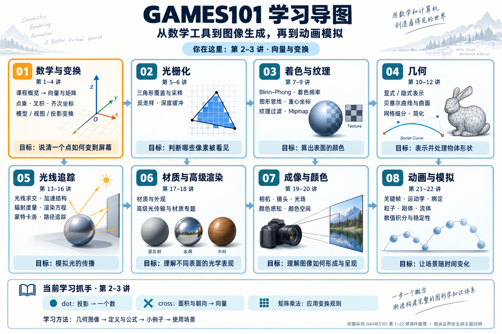

# GAMES101 学习导图

依据本地第 1–22 讲课件的标题、课程议程与主题页整理。模块按主讲主题归纳，相邻讲之间存在内容延续；连接线表示建议阅读顺序，不表示严格的先修关系。第 04 讲补充 PDF 文字提取不可靠，未用于新增主题。

## 怎么使用

你目前在第 2–3 讲。先抓住“向量怎么表示、怎样测量方向关系、怎样把变换写成矩阵”。可以边做小例子边继续课程，不必等所有公式的证明都掌握才往下走。

每个概念记录四件事：**几何图像 → 定义与公式 → 小例子 → 使用场景**。具体疑问放进 [[FAQ索引]]。

## 课程导航

| 模块 | 本地课件 | 核心内容 |
| --- | --- | --- |
| 数学与变换 | [01](../课件/GAMES101_Lecture_01.pdf)、[02](../课件/GAMES101_Lecture_02.pdf)、[03](../课件/GAMES101_Lecture_03.pdf)、[04](../课件/GAMES101_Lecture_04.pdf) | 概览、向量、矩阵、齐次坐标、模型与视图变换、正交与透视投影 |
| 光栅化 | [05](../课件/GAMES101_Lecture_05.pdf)、[06](../课件/GAMES101_Lecture_06.pdf) | 三角形覆盖、采样、反走样、深度缓冲；深度内容在后续讲继续 |
| 着色与纹理 | [07](../课件/GAMES101_Lecture_07.pdf)、[08](../课件/GAMES101_Lecture_08.pdf)、[09](../课件/GAMES101_Lecture_09.pdf) | Blinn–Phong、着色频率、图形管线、重心坐标、纹理过滤、Mipmap |
| 几何 | [10](../课件/GAMES101_Lecture_10.pdf)、[11](../课件/GAMES101_Lecture_11.pdf)、[12](../课件/GAMES101_Lecture_12.pdf) | 显式与隐式表示、贝塞尔曲线与曲面、网格细分与简化；第 10 讲也延续纹理应用 |
| 光线追踪 | [13](../课件/GAMES101_Lecture_13.pdf)、[14](../课件/GAMES101_Lecture_14.pdf)、[15](../课件/GAMES101_Lecture_15.pdf)、[16](../课件/GAMES101_Lecture_16.pdf) | Whitted 光追、求交与加速、辐射度量、渲染方程、蒙特卡洛路径追踪 |
| 材质与高级渲染 | [17](../课件/GAMES101_Lecture_17.pdf)、[18](../课件/GAMES101_Lecture_18.pdf) | 材质与外观、高级光传输与材质专题 |
| 成像与颜色 | [19](../课件/GAMES101_Lecture_19.pdf)、[20](../课件/GAMES101_Lecture_20.pdf) | 相机、镜头、光场、颜色感知与颜色空间 |
| 动画与模拟 | [21](../课件/GAMES101_Lecture_21.pdf)、[22](../课件/GAMES101_Lecture_22.pdf) | 关键帧、运动学、绑定、粒子、刚体、流体、数值积分与稳定性 |

## 当前知识怎样连接后续内容

- **点乘**：沿指定方向测分量；后面连接光照中的方向关系。
- **叉积**：面积与朝向；后面连接三角形法线等几何计算。
- **矩阵乘法**：应用变换规则；后面连接模型、相机与投影。
- **齐次坐标**：把平移也纳入矩阵运算。
- **变换顺序**：列向量写法中，最靠近向量的矩阵先作用。

## 大学物理光学补充

如果你对“光为什么会反射、折射、干涉、衍射，以及颜色如何进入渲染”感到陌生，可以沿着 [[00-大学物理光学补充-总览]] 阅读。它会先从手电筒、影子、镜子、灯和彩虹讲起，再逐步引出电磁波、几何光学、Fresnel、辐射度量、Fourier 光学、偏振和颜色：

$$
\text{波动光学}\longrightarrow\text{几何光学}\longrightarrow\text{辐射度量}\longrightarrow\text{渲染方程}\longrightarrow\text{像素颜色}
$$

建议按 00→01→02→03→04→05 的顺序阅读，不必一次看完。第 5–9 讲的采样、纹理过滤和反走样，可以重点回看 [[04-先理解彩色条纹：干涉、衍射与Fourier光学]]；第 13–20 讲则重点阅读 02 和 03。

以上学习建议及图中的学习目标为整理说明，不是课件原文。

相关笔记：[[FAQ索引]] · [[向量加法与点乘：定义、几何意义和记忆方法]] · [[叉积：为什么是向量、为什么用sin、如何记忆]] · [[变换顺序：为什么TRS是先缩放再旋转最后平移]] · [[mul、dot、cross：矩阵乘法与点乘叉积的区别]]

图片使用内置 image_gen 生成，完整提示词见 [[生成提示词]]。
