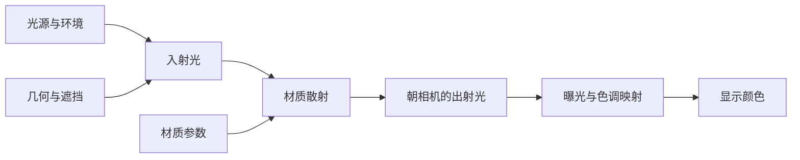
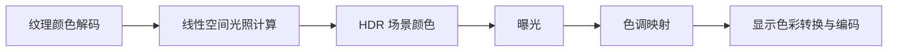

# PBR：从基础直觉到实时渲染

> [!abstract] 本文目标
> 从“为什么塑料和金属看起来不同”出发，逐步理解辐射度量学、渲染方程、BRDF、微表面模型与实时环境光照，最后能够读懂并实现一个基础 PBR 着色器。
>
> 本文以不透明、各向同性材质为主线，采用线性 RGB 近似。玻璃、皮肤、薄膜与体积散射放在进阶部分。内容按学习顺序重新组织，不是课程逐字稿，也不绑定某个引擎。

## 阅读方法与目录

第一次阅读建议先抓住“这个量回答什么问题”，再看推导；微表面采样与 Split Sum 推导可以留到第二遍。

| 阶段 | 章节 | 学完后能回答的问题 |
| --- | --- | --- |
| 建立直觉 | 1—3 | PBR 在计算什么？光照、材质、成像如何分工？ |
| 理论基础 | 4—7 | 光怎么度量？渲染方程为什么这样写？ |
| 材质核心 | 8—11 | 金属、高光、粗糙度分别从哪里来？ |
| 求解与实践 | 12—15 | 如何计算积分，并把结果正确显示出来？ |
| 巩固与拓展 | 16—19 | 如何排错、验证，以及继续学习？ |

- [[#1. 从生活中的材质开始]]
- [[#2. PBR 是一套约束下的建模方法]]
- [[#3. 统一符号与方向约定]]
- [[#4. 辐射度量学：给光一个可计算的定义]]
- [[#5. BRDF：材质如何分配反射光]]
- [[#6. 渲染方程：把各个方向的贡献加起来]]
- [[#7. Lambert 漫反射：为什么要除以 π]]
- [[#8. Fresnel：为什么物体边缘更容易反光]]
- [[#9. 微表面理论：把无数小镜面统计起来]]
- [[#10. D、G、F：逐项理解 Cook–Torrance BRDF]]
- [[#11. 金属度与粗糙度工作流]]
- [[#12. 如何求解光照积分]]
- [[#13. IBL：用环境贴图照亮物体]]
- [[#14. 线性工作流、HDR 与色调映射]]
- [[#15. 一个与公式一致的基础着色器]]
- [[#16. 如何验证 PBR 实现是否正确]]
- [[#17. 进阶：基础模型省略了什么]]
- [[#18. 自测题与参考答案]]
- [[#19. 学习路线与参考资料]]
- [[#附录：核心公式速查]]

---

## 1. 从生活中的材质开始

把一个红色塑料球和一个铜球放在同一盏白灯下。

你通常会发现：

- 塑料球大部分区域呈红色，但灯的高光接近白色。
- 铜球的反射带有铜的颜色，周围环境的明暗和形状对外观影响很大。
- 把表面磨粗后，清晰的倒影变得模糊，高光通常更宽。
- 从接近表面切线的方向观察，反射往往更加明显。

这些现象分别指向 PBR 的几个核心问题。

### 1.1 光从哪里来：光照

一个点接收到的光可能来自灯、天空，也可能来自其他物体的反射。

一张金属材质贴图本身不能告诉你它最终有多亮。金属球在明亮房间里可能有清晰反射，在几乎没有入射光的环境里则可能很暗。

### 1.2 光如何改变方向：材质

材质决定光到达表面后，多少被反射、多少进入内部、多少被吸收，以及反射光向哪些方向分布。

对常见不透明物体，可以先区分两类外观贡献：

- **镜面反射（specular）**：主要描述界面反射，可以很清晰，也可以因粗糙而模糊。
- **漫反射（diffuse）**：常用来近似光进入非金属内部、经历散射后返回表面的结果。

这里的“镜面”不意味着必须看见清晰镜像。磨砂金属的宽高光仍然属于粗糙镜面反射。

### 1.3 最终如何变成屏幕颜色：成像

相机曝光和显示映射会改变图像。相同场景采用不同曝光，屏幕上的亮度也会不同。

因此，分析外观时应沿着这条因果链思考：



> [!tip] 一句话直觉
> 光照提供能量，几何决定方向与可见性，材质分配能量，相机与显示流程把它转换成图像。

---

## 2. PBR 是一套约束下的建模方法

PBR 是 Physically Based Rendering，即基于物理的渲染。

“基于物理”意味着模型尽量遵循可解释的物理规律，例如能量守恒、Fresnel 反射和合理的光传播。它并不意味着必须完整模拟光的所有波动与量子性质。

本文采用常见的几何光学、稳态、无偏振近似，并暂不考虑荧光等波长转换现象。此类假设也是传统辐射传输框架的重要适用边界。参见 [PBRT：Radiometry](https://pbr-book.org/4ed/Radiometry,_Spectra,_and_Color/Radiometry)。

### 2.1 PBR 不对应唯一的公式

下列概念处于不同层次：

| 概念 | 主要职责 |
| --- | --- |
| PBR | 以物理规律约束渲染模型和工作流 |
| 渲染方程 | 描述表面光能传输关系 |
| BRDF | 描述一个表面点如何反射光 |
| Cook–Torrance | 一类微表面镜面反射模型 |
| GGX | 可用于微表面模型的法线分布 |
| 路径追踪 | 用随机采样求解光传输的方法 |
| 光栅化 | 确定图元在屏幕上覆盖哪些采样位置的方法 |

光栅化渲染器可以使用 PBR 材质；路径追踪器也可以使用相同的材质模型。区别主要在于如何寻找可见表面、获取入射光和求解光照。

### 2.2 为什么不直接沿用 Blinn–Phong

经典教学中的 Blinn–Phong 高光常写成与 $(\mathbf{n}\cdot\mathbf{h})^s$ 成正比，指数 $s$ 控制高光集中程度。它直观、便宜，适合建立局部着色概念。

但在常见的朴素用法中，漫反射强度、高光强度、高光指数可以独立乱调，缺少统一的能量约束和材料参数解释。改变高光宽度时，总反射能量也可能意外改变。

PBR 更倾向于让参数具有明确含义：

- 粗糙度描述微观表面的统计变化。
- 折射率或法线入射反射率控制界面反射。
- 基色描述某一类反射的颜色。
- 光源强度与距离遵循一致约定。

需要注意：Phong 类模型也能经过归一化等改造而满足一些物理约束；不能只凭模型名称判断一个实现是否合理。

---

## 3. 统一符号与方向约定

本文中，参与点积的方向向量都假设已经归一化。

| 符号 | 含义 |
| --- | --- |
| $\mathbf{x}$ | 当前着色点 |
| $\mathbf{n}$ | 表面单位法线；理论推导暂令着色法线等于几何法线 |
| $\mathbf{l}=\omega_i$ | 从着色点指向入射光来源的方向 |
| $\mathbf{v}=\omega_o$ | 从着色点指向观察者的方向 |
| $\mathbf{h}$ | 光照方向与观察方向的半程向量 |
| $\Omega^+$ | 法线上方的半球 |
| $L_i$、$L_o$、$L_e$ | 入射、出射、自发光辐射亮度 |
| $f_r$、$f_d$、$f_s$ | 总 BRDF、漫反射分量、镜面反射分量 |
| $c$ | 线性 RGB 基色 |
| $\rho$ | 漫反射反照率 |
| $r$、$\alpha$ | 感知粗糙度、微表面分布参数 |
| $m$ | 金属度 |
| $F_0$ | 法线入射时的 Fresnel 反射率 |
| $V_{\mathrm{scene}}$ | 场景几何造成的可见性 |
| $p(\omega)$ | 按立体角定义的方向采样概率密度 |

半程向量为：

$$
\mathbf{h}=\frac{\mathbf{l}+\mathbf{v}}{\lVert\mathbf{l}+\mathbf{v}\rVert}
$$

定义常用点积简写：

$$
N_L=\max(\mathbf{n}\cdot\mathbf{l},0),\qquad
N_V=\max(\mathbf{n}\cdot\mathbf{v},0)
$$

$$
N_H=\max(\mathbf{n}\cdot\mathbf{h},0),\qquad
V_H=\max(\mathbf{v}\cdot\mathbf{h},0)
$$

> [!warning] 方向最容易写反
> $\mathbf{l}$ 指向光源，而实际入射光沿 $-\mathbf{l}$ 传播。因此着色器通常用 `dot(n, l)`，并用 `reflect(-v, n)` 得到环境反射查询方向。
>
> 若 $N_L\leq 0$ 或 $N_V\leq 0$，本文的一侧不透明反射模型直接返回零。当 $\mathbf{l}+\mathbf{v}$ 长度接近零时，不要直接归一化。

---

## 4. 辐射度量学：给光一个可计算的定义

日常语言中的“亮”可能指光源功率、表面接收的光，或者朝眼睛传播的光。把它们混用，渲染公式就容易出错。

### 4.1 从能量到功率

辐射能 $Q$ 的单位是焦耳。辐射通量 $\Phi$ 是单位时间通过的辐射能，也就是辐射功率：

$$
\Phi=\frac{\mathrm{d}Q}{\mathrm{d}t}
$$

单位为 $\mathrm{W}$。注意，灯泡标称的电功率不等于它发出的可见光辐射功率。

### 4.2 立体角：一个方向区域有多大

二维中的角度描述圆弧占圆周多少；三维中的立体角描述一片方向区域占球面多少。

在半径为 $R$ 的球面上，一小块面积 $\mathrm{d}A_s$ 对应：

$$
\mathrm{d}\omega=\frac{\mathrm{d}A_s}{R^2}
$$

立体角的单位是球面度 $\mathrm{sr}$。整个球面为 $4\pi$，半球为 $2\pi$。

使用球坐标时：

$$
\mathrm{d}\omega=\sin\theta\,\mathrm{d}\theta\,\mathrm{d}\phi
$$

这里的 $\sin\theta$ 很关键：在经纬度图上，靠近极点和靠近赤道的同样大小矩形，并不代表同样大的球面区域。

### 4.3 辐射强度：光源朝一个方向发出多少功率

辐射强度 $I$ 定义为：

$$
I(\omega)=\frac{\mathrm{d}\Phi}{\mathrm{d}\omega}
$$

单位为 $\mathrm{W}/\mathrm{sr}$。对于各向同性理想点光源：

$$
I=\frac{\Phi}{4\pi}
$$

它适合描述点光源的方向发射分布，但不是渲染方程中的 $L$。

### 4.4 辐照度：单位面积接收到多少功率

辐照度 $E$ 为：

$$
E=\frac{\mathrm{d}\Phi}{\mathrm{d}A}
$$

单位为 $\mathrm{W}/\mathrm{m}^2$。它把所有入射方向的贡献汇总到接收面积上。

若从理想点光源到表面的距离是 $d$，没有遮挡和介质衰减，则：

$$
E=\frac{I}{d^2}\max(\mathbf{n}\cdot\mathbf{l},0)
$$

这个式子包含两件事：

1. **距离平方反比**：相同功率扩散到越来越大的面积上。
2. **余弦因子**：同一束光斜着照射时覆盖更大的表面积，单位面积分到的能量变少。

### 4.5 辐射亮度：某个位置、某个方向上的光

辐射亮度 radiance，记为 $L$，定义为：

$$
L=\frac{\mathrm{d}^2\Phi}{\mathrm{d}A\cos\theta\,\mathrm{d}\omega}
$$

单位为 $\mathrm{W}/(\mathrm{m}^2\,\mathrm{sr})$，其中 $\mathrm{d}A\cos\theta$ 是垂直于该传播方向的投影面积。

它同时保留了位置和方向信息。渲染时我们关心的是表面朝相机方向的 $L_o$；一个真实相机像素还会对像素范围、镜头孔径、曝光时间和波长作积分。

把来自各个方向的 radiance 累积起来，得到 irradiance：

$$
E(\mathbf{x})=\int_{\Omega^+}L_i(\mathbf{x},\omega_i)
(\mathbf{n}\cdot\omega_i)\,\mathrm{d}\omega_i
$$

**$E$ 不再区分入射方向，$L_i$ 则保留了方向。** 镜面材质特别依赖后者，所以不能只给它一个“环境平均亮度”。

### 4.6 为什么 radiance 不直接乘距离平方反比

在均匀折射率、无吸收、无散射的介质中，radiance 沿一条无遮挡射线保持不变。

远处灯牌看起来变小，是它覆盖的视角减少；理想条件下，一个仍被充分分辨的灯牌区域的 radiance 不因为距离直接除以 $d^2$。点光源的辐照度平方反比则来自能量的几何扩散，两者描述的量不同。

| 量 | 直觉 | 单位 |
| --- | --- | --- |
| $\Phi$ | 总共发出或通过多少功率 | $\mathrm{W}$ |
| $I$ | 每个方向区域分到多少发射功率 | $\mathrm{W}/\mathrm{sr}$ |
| $E$ | 每单位面积接收到多少功率 | $\mathrm{W}/\mathrm{m}^2$ |
| $L$ | 每投影面积、每方向区域有多少功率 | $\mathrm{W}/(\mathrm{m}^2\,\mathrm{sr})$ |

以上定义可对照 [PBRT：Radiometry](https://pbr-book.org/4ed/Radiometry,_Spectra,_and_Color/Radiometry) 阅读。本文后续公式默认省略波长维度，以线性 RGB 近似逐通道计算。

---

## 5. BRDF：材质如何分配反射光

### 5.1 定义

BRDF 是 Bidirectional Reflectance Distribution Function，双向反射分布函数。

它回答：**来自某个方向的一点入射辐照度，会在某个出射方向产生多少反射辐射亮度？**

$$
f_r(\mathbf{x},\omega_i,\omega_o)
=\frac{\mathrm{d}L_o(\mathbf{x},\omega_o)}{\mathrm{d}E_i(\mathbf{x},\omega_i)}
$$

代入 $\mathrm{d}E_i=L_i\cos\theta_i\,\mathrm{d}\omega_i$：

$$
\mathrm{d}L_o
=f_r(\mathbf{x},\omega_i,\omega_o)
L_i(\mathbf{x},\omega_i)\cos\theta_i\,\mathrm{d}\omega_i
$$

这里的 $\mathrm{d}L_o$ 指这一小片入射方向单独造成的反射贡献，不包括自发光。

### 5.2 BRDF 为什么可以大于 1

BRDF 的单位是 $\mathrm{sr}^{-1}$，不是无量纲百分比。

一盏灯的反射能量如果集中在极窄的出射角范围，峰值可以很大，但对所有出射方向积分后的总能量仍不超过入射能量。

类似地，一个概率密度可以大于 1，只要积分后的概率不超过 1。BRDF 不是概率密度，但“密度峰值与积分总量不同”这个类比有助于理解。

### 5.3 三个关键约束

**非负性**：

$$
f_r(\omega_i,\omega_o)\geq 0
$$

**互易性**，对于本文考虑的常规互易反射介质：

$$
f_r(\omega_i,\omega_o)=f_r(\omega_o,\omega_i)
$$

交换入射与出射方向，反射响应相同。它不意味着不同角度的 BRDF 都相等，也不意味着阴影和场景光照会随之相同。

**能量守恒**，对固定入射方向：

$$
\int_{\Omega^+}f_r(\omega_i,\omega_o)
(\mathbf{n}\cdot\omega_o)\,\mathrm{d}\omega_o\leq 1
$$

这里积分的是出射方向，所以余弦是出射余弦。吸收或透射会使反射积分小于 1；若同时建模透射，还必须约束反射与透射的总能量。

> [!important] “总能量”不等于“某个方向上的值”
> 不应通过把 BRDF 强行截断到 1 来实现能量守恒。那会错误地削平窄高光。

定义与反射约束可对照 [PBRT：Surface Reflection](https://pbr-book.org/4ed/Radiometry,_Spectra,_and_Color/Surface_Reflection)。

---

## 6. 渲染方程：把各个方向的贡献加起来

### 6.1 表面反射形式

将所有入射方向的反射贡献相加，再加上自发光：

$$
L_o(\mathbf{x},\omega_o)=L_e(\mathbf{x},\omega_o)
+\int_{\Omega^+}f_r(\mathbf{x},\omega_i,\omega_o)
L_i(\mathbf{x},\omega_i)
(\mathbf{n}\cdot\omega_i)\,\mathrm{d}\omega_i
$$

逐项理解：

- $L_e$：表面自己发出的光。
- $L_i$：从一个方向实际到达表面的光。
- $f_r$：材质对这对入射、出射方向的响应。
- $\mathbf{n}\cdot\omega_i$：入射光的投影面积修正。
- 积分：把上半球所有方向贡献加起来。

**渲染方程中的余弦不是 Lambert 材质专属项。** 它来自辐照度的几何定义，因此镜面 BRDF 同样要乘它。

### 6.2 阴影在哪里

若 $L_i$ 表示“真实到达的入射光”，遮挡已经包含在里面。

若从一张未考虑局部遮挡的环境贴图查询 $L_{\mathrm{env}}$，则可写成：

$$
L_o=L_e+\int_{\Omega^+}f_r
L_{\mathrm{env}}(\omega_i)
V_{\mathrm{scene}}(\mathbf{x},\omega_i)
(\mathbf{n}\cdot\omega_i)\,\mathrm{d}\omega_i
$$

对于不透明遮挡，$V_{\mathrm{scene}}$ 可以是 0 或 1。这里描述的是环境光的可见贡献；被遮住的方向也可能接收到遮挡物本身的反射光，完整全局光照还需要计算它。

不要把已经包含遮挡的 $L_i$ 再重复乘同一份可见性。

### 6.3 为什么会产生全局光照问题

在真空或本文的无损均匀介质条件下，若沿 $\omega_i$ 首先碰到点 $\mathbf{y}$，则：

$$
L_i(\mathbf{x},\omega_i)=L_o(\mathbf{y},-\omega_i)
$$

而 $\mathbf{y}$ 的出射光又依赖它接收到的光。于是各个表面的未知量互相依赖。

从光线路径看：

- 直接光照：光源 → 当前表面 → 相机。
- 一次额外反弹：光源 → 其他表面 → 当前表面 → 相机。
- 更高次反弹：光源 → 多个表面 → 当前表面 → 相机。

这也解释了一个常见现象：红墙附近的白球可能出现红色泛光，因为红墙反射的光成为了白球的入射光。

> [!note] 方程与算法
> 渲染方程规定要计算的目标。路径追踪、光照烘焙、环境预过滤等方法，解决的是如何在有限时间内求得或近似这个目标。

进一步阅读：[PBRT：The Light Transport Equation](https://pbr-book.org/4ed/Light_Transport_I_Surface_Reflection/The_Light_Transport_Equation)。

---

## 7. Lambert 漫反射：为什么要除以 π

### 7.1 从假设出发

理想 Lambert 材质的 BRDF 与入射、出射方向无关，设它为常数 $k$。

固定入射方向时，其反射能量比例为：

$$
\rho=\int_{\Omega^+}k\cos\theta_o\,\mathrm{d}\omega_o
$$

换成球坐标：

$$
\begin{aligned}
\rho
&=k\int_0^{2\pi}\int_0^{\pi/2}
\cos\theta_o\sin\theta_o\,\mathrm{d}\theta_o\,\mathrm{d}\phi_o\\
&=k\cdot 2\pi\cdot\frac{1}{2}\\
&=k\pi
\end{aligned}
$$

因此：

$$
\boxed{f_d=\frac{\rho}{\pi}}
$$

**除以 $\pi$ 是余弦加权半球积分产生的归一化，不是经验调暗系数。** Lambert 模型参见 [PBRT：Diffuse Reflection](https://pbr-book.org/4ed/Reflection_Models/Diffuse_Reflection)。

### 7.2 代回渲染方程

$$
L_o=\frac{\rho}{\pi}
\int_{\Omega^+}L_i\cos\theta_i\,\mathrm{d}\omega_i
=\frac{\rho E}{\pi}
$$

在给定入射光照下，$L_o$ 不随观察方向改变。这是“理想漫反射从不同方向看具有相同 radiance”的准确含义。

它不意味着球面上所有位置都一样亮，因为各处法线不同，接收到的 $E$ 也不同；也不意味着每单位出射立体角的总功率相同，因为功率还包含出射投影面积因子。

### 7.3 一个可手算的例子

假设一个纯 Lambert 表面的反照率为 $\rho=0.6$，接收到的辐照度为 $E=10\ \mathrm{W}/\mathrm{m}^2$。

$$
L_o=\frac{0.6\times 10}{\pi}
\approx 1.91\ \mathrm{W}/(\mathrm{m}^2\,\mathrm{sr})
$$

这是纯漫反射例子，尚未额外叠加界面镜面反射。

### 7.4 均匀环境下的快速自检

若整个上半球的 $L_i=L_c$ 恒定：

$$
E=\pi L_c,\qquad L_o=\rho L_c
$$

取 $L_c=1$、$\rho=1$，理想白色 Lambert 表面应返回 1。如果得到 $\pi$ 或 $1/\pi$，优先检查是否漏除或重复除以了 $\pi$。

---

## 8. Fresnel：为什么物体边缘更容易反光

### 8.1 一个熟悉的现象

站在水池边低头看，可能看见水底；贴近水面方向看，更容易看见天空反射。

这说明界面反射比例随角度变化。Fresnel 方程描述的就是这种变化。

对普通空气—电介质界面，从空气一侧入射时，法线入射的反射通常较弱；接近掠射时，反射率趋近于 1。这个结论不代表任意材质的角度变化都能被同一条近似曲线精确描述。

### 8.2 电介质的法线入射反射率

对于折射率为 $\eta_i$ 和 $\eta_t$ 的两种无吸收介质：

$$
F_0=\left(\frac{\eta_i-\eta_t}{\eta_i+\eta_t}\right)^2
$$

取空气 $\eta_i\approx 1$，另一侧 $\eta_t=1.5$：

$$
F_0=\left(\frac{1-1.5}{1+1.5}\right)^2=0.04
$$

这就是实时材质中常见的非金属 $F_0=0.04$ 的来源。它是某类折射率的合理默认值，并非所有非金属的固定物理常数。

在这个例子中，“反射约 4%”只指法线入射的界面反射，其余能量进入介质后，还可能被吸收、散射或透射出去。

### 8.3 Schlick 近似

一种便于实时计算的近似为：

$$
F(\theta)=F_0+(1-F_0)(1-\cos\theta)^5
$$

在微表面镜面 BRDF 中，实际反射发生在法线为 $\mathbf{h}$ 的小面上，因此使用：

$$
\boxed{F=F_0+(1-F_0)(1-\mathbf{v}\cdot\mathbf{h})^5}
$$

由于镜面反射几何关系，也有 $\mathbf{v}\cdot\mathbf{h}=\mathbf{l}\cdot\mathbf{h}$。

> [!warning] 不要把角度随意替换
> 在给定光照方向的微表面 BRDF 中，Fresnel 使用 $V_H$，不能直接改成 $N_V$。某些 IBL 启发式近似会使用 $N_V$，那是经过额外简化后的不同用途。

取 $F_0=0.04$，用 Schlick 近似计算：

| 相对微表面法线的入射角 | 近似反射率 |
| --- | --- |
| $0^\circ$ | $0.040$ |
| $60^\circ$ | $0.070$ |
| $80^\circ$ | $0.410$ |
| 趋近 $90^\circ$ | 趋近 $1$ |

这些是近似公式的数值，不是所有真实介质的测量值。

### 8.4 为什么金属反射有颜色

金属需要复折射率，可写为 $\eta+i\kappa$，其中 $\kappa$ 表征吸收。若外部为空气，并将光学常数按外部介质归一化，法线入射反射率为：

$$
F_0(\lambda)=
\frac{(\eta(\lambda)-1)^2+\kappa(\lambda)^2}
{(\eta(\lambda)+1)^2+\kappa(\lambda)^2}
$$

它随波长 $\lambda$ 变化，所以不同颜色的光被反射的比例不同。铜、金等金属的颜色主要体现在这种选择性的镜面反射中。

实时渲染常用 RGB $F_0$ 和 Schlick 近似代替完整光谱 Fresnel。详细界面反射与折射模型见 [PBRT：Specular Reflection and Transmission](https://pbr-book.org/4ed/Reflection_Models/Specular_Reflection_and_Transmission)。

---

## 9. 微表面理论：把无数小镜面统计起来

### 9.1 为什么不直接建模所有凹凸

一块看起来平滑的桌面，在更小尺度上可能有大量起伏。当这些起伏远小于像素时，逐个建模既昂贵，也容易产生闪烁。

微表面理论选择统计它们：

1. 宏观上，把着色点看成法线为 $\mathbf{n}$ 的表面。
2. 微观上，假设它由许多不同朝向的小面组成。
3. 在本文的镜面微表面模型中，每个小面都像一面理想小镜子。
4. 用统计分布代替显式小面几何。

粗糙度改变的是这组小面法线的分散程度。法线越集中，反射越集中；法线越分散，反射越铺开。

**粗糙镜面与 Lambert 漫反射仍是不同机制。** 把镜面粗糙度调到最大，不会自动得到一个理想 Lambert 材质。

### 9.2 为什么出现半程向量

若一个微表面法线为 $\mathbf{m}$，它要把来自 $\mathbf{l}$ 的光反射到 $\mathbf{v}$，就必须满足镜面反射定律。

在本文方向约定下，满足条件的法线正是：

$$
\mathbf{m}=\mathbf{h}=\frac{\mathbf{l}+\mathbf{v}}{\lVert\mathbf{l}+\mathbf{v}\rVert}
$$

因此，对给定的一对 $\mathbf{l}$ 和 $\mathbf{v}$，我们只需询问“有多少小面朝向 $\mathbf{h}$”，而不是把所有微表面朝向都在运行时遍历一遍。

### 9.3 最终的镜面 BRDF

常见 Cook–Torrance 微表面镜面项写为：

$$
\boxed{
f_s(\mathbf{l},\mathbf{v})=
\frac{D(\mathbf{h})\,G(\mathbf{l},\mathbf{v})\,F(\mathbf{v},\mathbf{h})}
{4N_LN_V}
}
$$

该式在 $N_L>0$、$N_V>0$ 的反射半球内使用。

| 因子 | 回答的问题 |
| --- | --- |
| $D$ | 有多少微表面法线朝向所需的半程方向？ |
| $F$ | 光在这些小面上有多少比例被反射？ |
| $G$ | 这些反射能否通过微观几何的遮挡到达观察者？ |
| $4N_LN_V$ | 微观与宏观之间的面积、方向测度转换如何归一化？ |

### 9.4 分母里的 4 从哪里来：推导骨架

这一步可以在第二遍阅读。

设宏观面积为 $\mathrm{d}A$。法线落在 $\mathbf{h}$ 附近立体角 $\mathrm{d}\omega_h$ 内的微表面面积为：

$$
\mathrm{d}A_m=D(\mathbf{h})\,\mathrm{d}\omega_h\,\mathrm{d}A
$$

对一小片入射方向 $\mathrm{d}\omega_i$，这些小面接收到的功率与下面的量成正比：

$$
L_i\,\mathrm{d}\omega_i\,
(\mathbf{l}\cdot\mathbf{h})
D(\mathbf{h})\,\mathrm{d}\omega_h\,\mathrm{d}A
$$

乘上 $F$ 和有效遮挡因子 $G$，得到一次微表面反射的可见功率贡献。

固定入射方向，镜面反射把微表面法线的方向区域映射到出射方向区域，其雅可比关系为：

$$
\mathrm{d}\omega_o=4\lvert\mathbf{l}\cdot\mathbf{h}\rvert\,\mathrm{d}\omega_h
$$

再按 radiance 定义，除以宏观出射投影面积 $N_V\mathrm{d}A$ 和出射立体角，得到：

$$
\mathrm{d}L_o=L_i\,\mathrm{d}\omega_i\,
\frac{DGF}{4N_V}
$$

最后除以入射辐照度 $\mathrm{d}E_i=L_iN_L\mathrm{d}\omega_i$：

$$
f_s=\frac{\mathrm{d}L_o}{\mathrm{d}E_i}
=\frac{DGF}{4N_LN_V}
$$

所以分母不是为了“防止太亮”临时添加的系数，而是测度转换的结果。完整模型对法线分布和遮挡函数还存在一致性要求，不能任意拼接。参见 [PBRT：Roughness Using Microfacet Theory](https://pbr-book.org/4ed/Reflection_Models/Roughness_Using_Microfacet_Theory)。

---

## 10. D、G、F：逐项理解 Cook–Torrance BRDF

### 10.1 D：法线分布函数

NDF 是 Normal Distribution Function。其归一化条件为：

$$
\int_{\Omega^+}D(\mathbf{m})(\mathbf{n}\cdot\mathbf{m})\,\mathrm{d}\omega_m=1
$$

它表示微表面面积投影到宏观法线方向后，与宏观面积保持一致。

因此，$D$ 本身并不是满足 $\int D\,\mathrm{d}\omega=1$ 的普通方向概率密度；常见的 NDF 法线采样使用的是 $D(\mathbf{m})(\mathbf{n}\cdot\mathbf{m})$。

对于各向同性 GGX，也称 Trowbridge–Reitz 分布：

$$
\boxed{
D_{\mathrm{GGX}}(\mathbf{h})=
\frac{\alpha^2}
{\pi\left[N_H^2(\alpha^2-1)+1\right]^2}
}
$$

其中 $\alpha>0$ 控制法线分布宽度。GGX 具有较长的尾部，因此反射高光中心之外仍保留一定的散布。

### 10.2 感知粗糙度与分布参数

本文采用常见但非唯一的映射：

$$
\alpha=r^2,\qquad r\in[0,1]
$$

其中 $r$ 是材质界面或贴图提供的感知粗糙度。$\alpha$ 是 GGX 公式实际使用的分布参数。

所以公式中的 $\alpha^2$ 等于 $r^4$。代码中的“平方两次”可能是正确的，也可能是重复映射错误，必须先看每个变量的定义。

举例：$r=0.5$ 时，$\alpha=0.25$，代入分布的 $\alpha^2=0.0625$。

当 $r$ 趋近 0，反射趋向理想镜面的狄拉克分布，有限精度的普通 BRDF 公式不能直接处理严格为零的情况。实时着色通常限制最小粗糙度，离线渲染也可切换到专门的理想镜面模型。

### 10.3 粗糙度对高光峰值的影响

当 $N_H=1$ 时：

$$
D_{\mathrm{GGX}}(1)=\frac{1}{\pi\alpha^2}
$$

| 感知粗糙度 $r$ | $\alpha=r^2$ | $D(1)$ 约值 |
| --- | --- | --- |
| $0.25$ | $0.0625$ | $81.49$ |
| $0.50$ | $0.25$ | $5.09$ |
| $1.00$ | $1.00$ | $0.318$ |

这些是 NDF 峰值，不是最终像素亮度。它们说明反射越集中，密度峰值可以越高。光源尺寸、采样、Fresnel 和遮挡都会影响实际高光。

### 10.4 G：微观遮蔽与阴影

即使某个小面的朝向正确，也可能出现：

- **Shadowing**：入射光被其他微表面挡住。
- **Masking**：反射后的光朝观察者传播时被挡住。

本文实现采用可分离的 Smith–GGX 形式：

$$
G(\mathbf{l},\mathbf{v})=G_1(N_L)G_1(N_V)
$$

$$
G_1(x)=\frac{2x}{x+\sqrt{\alpha^2+(1-\alpha^2)x^2}},\qquad x>0
$$

这个 $G$ 处理的是无法显式建模的微观几何遮挡。墙壁、桌腿等宏观物体造成的阴影，仍需 $V_{\mathrm{scene}}$ 或相应光照算法处理。

### 10.5 高度相关 Smith：另一种一致的选择

若考虑两个方向上的遮挡共享同一微表面高度，可使用高度相关形式：

$$
G_{\mathrm{corr}}=
\frac{1}{1+\Lambda(\mathbf{l})+\Lambda(\mathbf{v})}
$$

$$
\Lambda(\omega)=
\frac{\sqrt{1+\alpha^2\tan^2\theta_\omega}-1}{2}
$$

这里同样假设方向位于有效反射半球。它与可分离形式属于不同的联合遮挡假设。

另一个常见工程近似是 Schlick–GGX：

$$
G_1(x)\approx\frac{x}{x(1-k)+k}
$$

其中 $k$ 如何由粗糙度得到依赖所采用的拟合和用途。不要把某份直接光照代码的 $k$ 映射，未经核对地套进另一套 IBL 预计算中。本文代码统一使用前面的可分离 Smith–GGX，减少约定混淆。

不同几何项的实现比较可参见 [Filament：Specular BRDF](https://google.github.io/filament/main/filament.html#materialsystem/specularbrdf)。

### 10.6 F：只计算一次界面反射

镜面项中的 $F$ 已经决定界面反射比例。因此，如果已经得到 $f_s=DGF/(4N_LN_V)$，不要再整体乘一次 $F$。

有些着色器写成：

$$
f_s=D\,F\,V_{\mathrm{micro}}
$$

其中：

$$
V_{\mathrm{micro}}=\frac{G}{4N_LN_V}
$$

这里的 $V_{\mathrm{micro}}$ 是合并分母后的可见性项，不能当成单独的 $G$ 再除以一次 $4N_LN_V$，也不要和场景阴影 $V_{\mathrm{scene}}$ 混淆。

### 10.7 单次散射为什么会损失能量

上述模型只计入：光打到一个小面，反射一次，然后离开宏观表面。

真实光线可能先被邻近小面挡住，再反射几次，最后重新离开表面。单次模型将这些路径省略了。

因此，粗糙表面即便设定 $F=1$、没有物理吸收，也可能在计算中变暗。恢复这部分能量需要微表面多次散射模型或能量补偿，不能简单宣称“粗糙度增大必然吸收更多光”。GAMES202 的相关主题包括 Microfacet、GGX 和 Multiple Bounce Approximation，见[课程目录](https://sites.cs.ucsb.edu/~lingqi/teaching/games202.html)。

> [!important] 守恒与完整性不同
> 少算反射能量仍可能满足“反射不超过入射”的守恒不等式，但这不等于已经完整模拟了真实的能量去向。

---

## 11. 金属度与粗糙度工作流

### 11.1 三个核心参数

Metallic–Roughness 工作流常用：

- 基色 $c$：线性 RGB。
- 金属度 $m$：通常从 0 到 1。
- 感知粗糙度 $r$：通常从 0 到 1。

其他输入还可能包括法线、AO、自发光、折射率或清漆层等。

### 11.2 基色的含义随金属度改变

| 材质类型 | 基色主要控制什么 | 普通漫反射项 |
| --- | --- | --- |
| 非金属 $m=0$ | 体内散射返回光的颜色近似 | 通常存在 |
| 理想化裸金属 $m=1$ | 镜面反射的 RGB $F_0$ | 通常设为零 |

“金属没有普通漫反射”是针对裸露、块状导体的常见表面模型。金属上的油漆、灰尘、氧化物等需要按其实际层或混合物处理。

透明干净玻璃虽然是非金属，也不能直接用一个很强的 Lambert 漫反射项描述；它需要透射模型。

### 11.3 常见的 F0 插值

$$
F_0=(1-m)F_{0,\mathrm{dielectric}}+mc
$$

采用普通非金属默认值时：

$$
F_{0,\mathrm{dielectric}}=(0.04,0.04,0.04)
$$

因此，红塑料通常是红色漫反射加近乎无色的界面反射；红铜的颜色则进入镜面反射参数。

### 11.4 一个常见的入门组合模型

为了给镜面反射留下能量份额，可近似设置：

$$
k_d=(1-m)(1-F)
$$

$$
\boxed{
f_r\approx
k_d\frac{c}{\pi}
+\frac{DGF}{4N_LN_V}
}
$$

这里的加减乘对 RGB 分量分别进行，$F$ 是当前方向对的 Schlick Fresnel。

这个模型直观、适合入门，但**不能将它当作任意条件下严格能量守恒的分层材质推导**。真实漫反射光还要穿过界面进入内部，再穿出界面；方向耦合和内部多次散射都更复杂。生产模型可能使用不同漫反射模型、界面传输修正与能量补偿。

本节参数化是常见工程简化。关于材质参数、分层与能量修正，可进一步对照 [Filament 材质系统](https://google.github.io/filament/main/filament.html#materialsystem)。

### 11.5 金属度不是“反光程度”

镜面般光滑的塑料仍是非金属；非常粗糙的钢仍然是金属。

对于单一、均匀、可分辨的材质区域，金属度通常接近 0 或 1。中间值常用于纹理过滤、像素内覆盖混合和艺术近似，不应直接解释为“这个元素有一半金属性”。真实涂层或复合材料的行为通常更复杂。

### 11.6 法线贴图与粗糙度贴图的分工

- 法线贴图改变当前着色使用的法线方向，常表示可由纹理描述的表面起伏。
- 粗糙度描述当前着色点内部更细尺度的法线统计分布。

同一块表面可以同时有大的波浪起伏和很细的磨砂结构，因此两者可以同时存在。

当远处纹理细节缩小到像素以内时，法线变化也应影响有效粗糙度。若只平均法线、仍保留极低粗糙度，容易出现高光闪烁。相关处理常被称为镜面抗锯齿。

---

## 12. 如何求解光照积分

知道 BRDF 后，真正耗时的问题是：从无穷多个入射方向取光并积分。

### 12.1 理想点光源：一个方向的特殊贡献

理想点光源在着色点只对应一个方向，属于方向上的奇异分布，不能当成“一个普通有限 radiance 值乘零立体角”。工程实现通常直接使用它的辐射强度。

若点光源的强度为 $I_j$、距离为 $d_j$，则它的反射贡献为：

$$
L_{o,j}=f_r(\mathbf{l}_j,\mathbf{v})
\frac{I_j}{d_j^2}
N_{L_j}V_j
$$

多盏点光源相加：

$$
L_{o,\mathrm{direct}}=\sum_j L_{o,j}
$$

把 $I_j/d_j^2$ 记作垂直于光束表面的辐照度 $E_{\perp,j}$，公式就变成 $f_rE_{\perp,j}N_{L_j}V_j$。如果输入的 $E$ 已包含 $N_L$，就不要再乘一次。

### 12.2 面光源：需要考虑光源覆盖的范围

对于面积为 $A_L$ 的光源，可把方向积分改为光源面积积分：

$$
L_o(\mathbf{x},\mathbf{v})=
\int_{A_L}f_r(\mathbf{l},\mathbf{v})
L_e(\mathbf{y},-\mathbf{l})V(\mathbf{x},\mathbf{y})
\frac{
\max(\mathbf{n}_x\cdot\mathbf{l},0)
\max(\mathbf{n}_y\cdot(-\mathbf{l}),0)
}{\lVert\mathbf{y}-\mathbf{x}\rVert^2}
\,\mathrm{d}A_y
$$

其中 $\mathbf{l}$ 从 $\mathbf{x}$ 指向光源点 $\mathbf{y}$，这里假设单面发光。

第二个余弦与距离项来自：

$$
\mathrm{d}\omega_i=
\frac{\max(\mathbf{n}_y\cdot(-\mathbf{l}),0)}
{\lVert\mathbf{y}-\mathbf{x}\rVert^2}\,\mathrm{d}A_y
$$

这也解释了为什么面光源大小会改变高光形状和软阴影，而一个理想点光源不能独立表达这些效果。

### 12.3 蒙特卡洛积分

设积分目标为：

$$
J=\int_{\Omega^+}g(\omega)\,\mathrm{d}\omega
$$

按概率密度 $p(\omega)$ 采样 $N$ 个方向，则估计量为：

$$
\widehat{J}=\frac{1}{N}\sum_{k=1}^{N}
\frac{g(\omega_k)}{p(\omega_k)}
$$

之所以要除以概率密度，是因为常被采到的区域已经出现得更多，单个样本应降低权重；否则会人为偏向某些方向。

只要在被积函数非零的区域有适当采样支持，并使用一致的密度，独立同分布采样下就有：

$$
\mathbb{E}[\widehat{J}]
=\int_{\Omega^+}\frac{g(\omega)}{p(\omega)}p(\omega)\,\mathrm{d}\omega
=J
$$

代入渲染方程：

$$
\widehat{L_o}=L_e+
\frac{1}{N}\sum_{k=1}^{N}
\frac{f_r(\omega_k,\omega_o)L_i(\omega_k)
(\mathbf{n}\cdot\omega_k)}{p(\omega_k)}
$$

这不是换了一个光照模型，而是用有限随机样本估计同一个积分。

### 12.4 为什么要重要性采样

对一个光滑金属，BRDF 可能集中在很窄的反射方向附近。均匀采整个半球时，多数样本贡献很小，少数样本贡献很大，噪声就高。

重要性采样让样本更多地落在预计贡献大的方向，并继续用 $1/p$ 保持正确权重。

例如，Lambert 项适合余弦加权采样：

$$
p(\omega_i)=\frac{\cos\theta_i}{\pi}
$$

此时：

$$
\frac{(\rho/\pi)L_i\cos\theta_i}{\cos\theta_i/\pi}
=\rho L_i
$$

当环境完全均匀时，每个有效样本的结果都相同，理想情况下这一积分估计没有方差。

实际光照中，“BRDF 大的方向”和“光源亮的方向”可能不同。多重重要性采样 MIS 组合光源采样与 BRDF 采样，降低只依赖一种策略时的方差。进一步阅读 [PBRT：Improving Efficiency](https://pbr-book.org/4ed/Monte_Carlo_Integration/Improving_Efficiency)。

### 12.5 GGX 法线采样与反射方向密度

若按普通 NDF 分布采样半程向量：

$$
p_h(\mathbf{h})=D(\mathbf{h})N_H
$$

已知观察方向后，由镜面关系得到入射方向：

$$
\mathbf{l}=2(\mathbf{v}\cdot\mathbf{h})\mathbf{h}-\mathbf{v}
$$

方向变换的雅可比给出：

$$
p_l(\mathbf{l})=
\frac{p_h(\mathbf{h})}{4\lvert\mathbf{v}\cdot\mathbf{h}\rvert}
=\frac{D(\mathbf{h})N_H}{4\lvert V_H\rvert}
$$

如果采样得到 $N_L\leq 0$ 的方向，可以把该次试验贡献计为零；不能随意丢掉后重新抽取，仍使用原来的无条件密度和样本数归一化，那会改变分布。

更高效的方法会采样**可见法线分布 VNDF**，减少无效微表面样本。VNDF 的法线 PDF 与上面的 $DN_H$ 不同，代码中的采样器与 PDF 必须配套。

### 12.6 路径追踪如何利用这些结果

路径追踪从相机追到表面，再按 BSDF 等策略采样下一段方向。每经过一次散射，路径权重通常乘上：

$$
\frac{f_r(\omega_i,\omega_o)\lvert\mathbf{n}\cdot\omega_i\rvert}
{p(\omega_i)}
$$

沿路径累积光源贡献，就在估计多次反射的光传输。

实践中还会结合直接光源采样、MIS 和俄罗斯轮盘赌。轮盘赌若以生存概率 $q$ 保留路径，则保留下来的权重应除以 $q$；直接无补偿地随机删路径会使结果偏暗。

---

## 13. IBL：用环境贴图照亮物体

IBL 是 Image-Based Lighting，即基于图像的光照。环境贴图记录各方向的环境 radiance，通常使用 HDR 数据。

基础的远场环境假设是：环境足够远，其方向光照可视为与场景内部位置无关。一个 Cubemap 于是能够服务许多着色点，但不能自动描述近处墙壁的视差和遮挡。

### 13.1 为什么需要预计算

忽略局部可见性时：

$$
L_o(\mathbf{v})=
\int_{\Omega^+}L_{\mathrm{env}}(\mathbf{l})
f_r(\mathbf{l},\mathbf{v})N_L\,\mathrm{d}\omega_l
$$

如果每个像素每一帧都用大量样本求解，代价很高。实时 IBL 通过预过滤，把常用积分结果提前存到纹理里。

### 13.2 漫反射 IBL：预计算辐照度

对纯 Lambert 材质：

$$
L_{o,d}(\mathbf{n})=
\frac{\rho}{\pi}\underbrace{
\int_{\Omega^+}L_{\mathrm{env}}(\mathbf{l})N_L\,\mathrm{d}\omega_l
}_{E(\mathbf{n})}
$$

因此可以预计算以法线为索引的 $E(\mathbf{n})$。运行时查一次纹理，再乘 $\rho/\pi$。

漫反射对方向的响应较平滑，也可以用低阶球谐函数近似存储环境卷积结果。

> [!warning] Irradiance Map 的命名不足以确定公式
> 某些实现存的是 $E$，另一些存的是 $E/\pi$。前者运行时乘 $\rho/\pi$，后者运行时乘 $\rho$。需要阅读预计算代码来确定，不能只看纹理名称。

如果使用第 11 章随方向变化的 $k_d=(1-m)(1-F)$，就不能严格把它当常数移出积分。实时实现常再作近似：

$$
L_{o,d}\approx k_{d,\mathrm{IBL}}\frac{c}{\pi}E(\mathbf{n})
$$

这里 $k_{d,\mathrm{IBL}}$ 是另外定义的平均或拟合权重，需要与材质模型相匹配。

### 13.3 镜面 IBL 的依赖更多

镜面反射不仅依赖法线，还依赖视线方向、粗糙度和 $F_0$。

粗糙度很小时，主要看理想反射方向附近；粗糙度增大后，需要汇总更大方向范围的环境光。

理想反射查询方向为：

$$
\mathbf{r}_{\mathrm{env}}=2(\mathbf{n}\cdot\mathbf{v})\mathbf{n}-\mathbf{v}
$$

注意这里的向量 $\mathbf{r}_{\mathrm{env}}$ 与标量粗糙度 $r$ 不同。

### 13.4 Split Sum 的最终使用形式

一种常见近似写成：

$$
\boxed{
L_{o,s}\approx
L_{\mathrm{prefilter}}(\mathbf{r}_{\mathrm{env}},r)
\left[F_0A(N_V,r)+B(N_V,r)\right]
}
$$

需要两类预计算资源：

1. **预过滤环境图**：不同粗糙度对应不同过滤宽度，常放在 Cubemap 的不同 mip 层。
2. **二维 BRDF LUT**：输入 $N_V$ 和粗糙度，输出两个系数 $A$、$B$。

环境变化时，环境图需要重新预过滤。只要 BRDF、粗糙度映射等约定不变，BRDF LUT 可以复用。

Split Sum 与预过滤方法的原始工程说明见 [Brian Karis：Real Shading in Unreal Engine 4](https://cdn2.unrealengine.com/Resources/files/2013SiggraphPresentationsNotes-26915738.pdf)。它也是 [GAMES202 实时环境光照主题](https://sites.cs.ucsb.edu/~lingqi/teaching/games202.html)中的重要内容。

### 13.5 为什么 LUT 恰好是 A 和 B 两个通道

先考虑单位环境 $L_{\mathrm{env}}=1$ 下的镜面 BRDF 积分：

$$
K(N_V,r,F_0)=\int_{\Omega^+}f_s(\mathbf{l},\mathbf{v})N_L\,\mathrm{d}\omega_l
$$

定义：

$$
F_c=(1-V_H)^5
$$

Schlick Fresnel 可改写为：

$$
F=F_0(1-F_c)+F_c
$$

再设：

$$
W(\mathbf{l},\mathbf{v},r)=\frac{DG}{4N_LN_V}N_L
$$

于是：

$$
\begin{aligned}
K
&=\int_{\Omega^+}W\left[F_0(1-F_c)+F_c\right]\,\mathrm{d}\omega_l\\
&=F_0\underbrace{\int_{\Omega^+}W(1-F_c)\,\mathrm{d}\omega_l}_{A(N_V,r)}
+\underbrace{\int_{\Omega^+}WF_c\,\mathrm{d}\omega_l}_{B(N_V,r)}
\end{aligned}
$$

所以：

$$
K=F_0A+B
$$

在选定的各向同性 BRDF、Schlick Fresnel 与粗糙度映射下，这个关于 $F_0$ 的拆分来自代数线性关系。它解释了为什么不需要为每一种金属颜色分别生成 LUT。

### 13.6 用 GGX 样本计算 LUT

采用第 12.5 节的普通 NDF 采样，结合 $p_l=DN_H/(4V_H)$，积分样本权重中的公共部分为：

$$
\frac{W}{p_l}=\frac{GV_H}{N_HN_V}
$$

记此权重为 $w_k$，则：

$$
A\approx\frac{1}{N}\sum_k (1-F_{c,k})w_k,
\qquad
B\approx\frac{1}{N}\sum_k F_{c,k}w_k
$$

无效下半球方向贡献为零。若换用 VNDF 采样，PDF 已改变，需要从 $W/p_l$ 重新推导权重。

### 13.7 近似究竟发生在哪里

对于有复杂明暗结构的环境，不能把乘积的积分随意变成两个积分的乘积。

Split Sum 用经过设计的环境预过滤结果乘以单位环境下的 BRDF 响应，近似原本耦合的光照积分；常见预过滤还假设 $\mathbf{n}=\mathbf{v}=\mathbf{r}_{\mathrm{env}}$，将方向相关的反射形状简化为绕反射方向的分布。

这些近似可能导致掠射方向上的拉长反射不准确，尤其在环境包含极亮小光源时更明显。

普通图片 mipmap 只做通用缩小过滤，不等于按 GGX 与粗糙度约定生成的预过滤环境图。两者不能直接替换。

> [!tip] 需要成套使用的约定
> 直接光照 BRDF、环境预过滤、BRDF LUT 的粗糙度映射、几何项和 Fresnel 近似应彼此兼容。混用不同教程中的三份资源，往往会出现“单独公式都对，整体仍不对”。

### 13.8 AO 应放在哪里

AO 是环境遮蔽，常用于近似局部几何对间接漫反射的遮挡。

它不自动等于某盏直接光源的阴影，也不完整描述镜面环境反射的可见性。把同一个 AO 值粗暴乘到直接光、间接光、自发光的总和上，容易让接缝过黑，也会错误削弱自发光。

更合理的职责划分是：直接光照使用对应阴影，间接漫反射采用 AO 等近似，镜面间接光需要适配的反射遮挡方法。

---

## 14. 线性工作流、HDR 与色调映射

### 14.1 光照相加必须在线性空间

如果两盏灯各提供同样的能量，合起来应是两倍。满足这种关系的数值空间称为线性空间。

常见颜色图片使用 sRGB 编码，其数值与能量不是线性关系。把 sRGB 图片数值直接参与 BRDF 计算，会使亮度、颜色混合和材质响应失真。

对范围在 0 到 1 的单通道 sRGB 编码值 $c_s$，解码为线性值 $c_l$：

$$
c_l=
\begin{cases}
c_s/12.92, & c_s\leq 0.04045\\
\left(\dfrac{c_s+0.055}{1.055}\right)^{2.4}, & c_s>0.04045
\end{cases}
$$

例如，sRGB 的 0.5 约等于线性值 0.214，而非 0.5 的能量。

### 14.2 哪些纹理需要 sRGB 解码

| 纹理内容 | 常见处理 | 原因 |
| --- | --- | --- |
| Base Color | 常以 sRGB 存储，采样时解码 | 存的是颜色 |
| 彩色 Emissive 图片 | 若以 sRGB 编码存储，则解码后乘强度 | 颜色编码和发光强度分开 |
| Roughness | 按线性数值读取 | 存的是参数 |
| Metallic | 按线性数值读取 | 存的是参数或混合权重 |
| AO | 按线性数值读取 | 存的是遮蔽系数 |
| Normal | 按线性数值读取，再解码向量 | 存的是方向数据 |
| HDR 环境图 | 按其实际格式与色彩空间读取，通常为场景线性数据 | 存的是光照 |

真正的判断依据是数据的编码与含义，而不是扩展名。GPU 如果已经通过 sRGB 纹理格式自动解码，就不要在 shader 中再解码一次。

### 14.3 法线贴图的基本转换

对于常见三通道切线空间法线贴图，纹理值 $c_n$ 可先转换为：

$$
\mathbf{n}_t=\operatorname{normalize}(2c_n-1)
$$

再通过由切线 $\mathbf{T}$、副切线 $\mathbf{B}$、基准法线 $\mathbf{N}$ 组成的 TBN 矩阵变换：

$$
\mathbf{n}=\operatorname{normalize}
\left(\mathbf{T}n_{t,x}+\mathbf{B}n_{t,y}+\mathbf{N}n_{t,z}\right)
$$

实际资源可能采用双通道压缩后重建第三分量，还需要核对绿色通道方向、切线空间约定与镜像 UV 的手性。

### 14.4 HDR：光照结果可以大于 1

渲染中的 1 不是物理亮度的天花板。高光、强灯和自发光都可能产生远大于 1 的场景线性值。

过早截断到 1 会丢失亮部层次。应使用合适的浮点 HDR 缓冲保存光照结果，最后再处理显示。

### 14.5 曝光、色调映射和显示编码

可以把常见 SDR 显示流程理解为：



用相对曝光档数 $e$ 表示曝光乘数：

$$
C_{\mathrm{exposed}}=2^eC_{\mathrm{HDR}}
$$

这里 $e$ 增大 1 表示图像能量数值加倍，它是本文定义的相对曝光调节量，不要直接与摄影 EV 的符号约定混用。

一个适合解释压缩过程的简单 Reinhard 映射是：

$$
C_{\mathrm{mapped}}=\frac{C_{\mathrm{exposed}}}{1+C_{\mathrm{exposed}}}
$$

这只是入门示意，逐通道使用还可能改变色相和饱和度；实际系统通常采用更完整的显示变换。

色调映射解决“高动态范围如何显示”，sRGB 编码解决“显示信号如何表达”。两者不是同一个步骤。显示编码若由输出附件自动完成，也不要手动重复执行。成像流程可参照 [Filament：Imaging Pipeline](https://google.github.io/filament/main/filament.html#imagingpipeline)。

---

## 15. 一个与公式一致的基础着色器

下面是 GLSL 风格的核心计算片段，用来把第 8—11 章连接到第 12.1 节的点光源公式。它不是包含窗口、纹理加载和渲染管线的完整可运行工程。

### 15.1 输入约定

- `n`、`v`、`l` 是同一坐标空间中的单位向量。
- `baseColor` 已在线性 RGB 空间，并处于合理的反射参数范围。
- `roughness` 是感知粗糙度 $r$，函数内部只执行一次 $\alpha=r^2$。
- `metallic` 范围为 0 到 1。
- 函数返回 BRDF；外部负责乘光照、入射余弦与阴影。
- 模型为 GGX、Schlick Fresnel、可分离 Smith–GGX 和第 11.4 节的近似漫反射组合。

### 15.2 核心 BRDF

```glsl
const float PI = 3.141592653589793;

vec3 fresnelSchlick(float cosTheta, vec3 F0)
{
    float x = 1.0 - clamp(cosTheta, 0.0, 1.0);
    float x2 = x * x;
    float x5 = x2 * x2 * x;
    return F0 + (vec3(1.0) - F0) * x5;
}

vec3 evaluateBRDF(
    vec3 n, vec3 v, vec3 l,
    vec3 baseColor, float metallic, float roughness)
{
    float NoL = clamp(dot(n, l), 0.0, 1.0);
    float NoV = clamp(dot(n, v), 0.0, 1.0);
    if (NoL <= 0.0 || NoV <= 0.0)
        return vec3(0.0);

    vec3 hv = l + v;
    float h2 = dot(hv, hv);
    if (h2 < 1e-12)
        return vec3(0.0);
    vec3 h = hv * inversesqrt(h2);

    float NoH = clamp(dot(n, h), 0.0, 1.0);
    float VoH = clamp(dot(v, h), 0.0, 1.0);

    // Numerical policy for this example; not a physical constant.
    float r = clamp(roughness, 0.045, 1.0);
    float alpha = r * r;
    float alpha2 = alpha * alpha;
    float m = clamp(metallic, 0.0, 1.0);

    vec3 F0 = mix(vec3(0.04), baseColor, m);
    vec3 F = fresnelSchlick(VoH, F0);

    // Equivalent to NoH^2 * (alpha^2 - 1) + 1,
    // written to retain alpha^2 at NoH == 1.
    float NoH2 = NoH * NoH;
    float q = (1.0 - NoH2) + alpha2 * NoH2;
    float D = alpha2 / (PI * q * q);

    // Separable Smith-GGX:
    // G / (4 * NoL * NoV) = 1 / (denomL * denomV).
    float denomL = NoL + sqrt(alpha2 + (1.0 - alpha2) * NoL * NoL);
    float denomV = NoV + sqrt(alpha2 + (1.0 - alpha2) * NoV * NoV);
    float visibilityMicro = 1.0 / (denomL * denomV);

    vec3 specular = D * visibilityMicro * F;
    vec3 kD = (1.0 - m) * (vec3(1.0) - F);
    vec3 diffuse = kD * baseColor / PI;

    return diffuse + specular;
}
```

这里将 $G/(4N_LN_V)$ 的公共因子代数消去，避免先生成很小的分子，再除以很小的分母。

最小粗糙度 0.045 是本例的数值策略，不是统一标准；它会限制极窄高光。精确镜面、半精度移动端、纹理抗锯齿等场景需要另作设计。

### 15.3 点光源累积

```glsl
// lightIntensity: radiant intensity represented in linear RGB.
// distanceToLight: positive distance in units consistent with intensity.
// shadowVisibility: visibility for this light, from 0 to 1.
vec3 Eperp = lightIntensity / (distanceToLight * distanceToLight);
float NoL = max(dot(n, l), 0.0);

vec3 directContribution =
    evaluateBRDF(n, v, l, baseColor, metallic, roughness)
    * Eperp
    * NoL
    * shadowVisibility;
```

不要在 `evaluateBRDF` 内外各乘一次 `NoL`。点光源与表面距离趋近零时，理想点光源模型本身存在奇点，实际灯具应具有有限尺寸，或采用有明确约定的近场处理。

### 15.4 一个可以手算的像素

设所有方向均沿法线，即 $N_L=N_V=N_H=V_H=1$。再设：

$$
c=(0.5,0.5,0.5),\quad m=0,\quad r=0.5,\quad E_\perp=10,\quad V=1
$$

这些颜色与光照均是线性值。

逐步计算：

$$
\alpha=0.25,\qquad D=\frac{1}{\pi(0.25)^2}\approx 5.09296
$$

$$
F=0.04,\qquad G=1
$$

$$
f_s=\frac{5.09296\times 0.04}{4}\approx 0.05093
$$

$$
f_d=\frac{(1-0.04)\times 0.5}{\pi}\approx 0.15279
$$

$$
L_o=(f_d+f_s)E_\perp N_L\approx 2.03718
$$

这是每个通道的场景线性结果。它大于 1 是正常的，应经过曝光和显示映射，而不是立刻截断。

### 15.5 接入 IBL 时的接口

镜面 IBL 的运行时核心为：

```glsl
vec3 R = reflect(-v, n);
float NoV = clamp(dot(n, v), 0.0, 1.0);

// Use the same effective roughness as the BRDF.
float r = clamp(roughness, 0.045, 1.0);
vec3 F0 = mix(vec3(0.04), baseColor, clamp(metallic, 0.0, 1.0));

// These lookups require matching precomputed assets.
vec3 prefiltered = lookupPrefilteredEnvironment(R, r);
vec2 AB = lookupBRDFLUT(NoV, r);
vec3 specularIBL = prefiltered * (F0 * AB.x + AB.y);
```

两个 `lookup` 是接口示意，不是 GLSL 内建函数。具体实现需负责 Cubemap 坐标、mip 映射、LUT 坐标和对应的预计算约定。

不要把 `specularIBL` 再乘一次运行时 Fresnel：$F_0A+B$ 已包含所选 Fresnel 模型的积分响应。

最后，先在线性 HDR 空间相加：

$$
C_{\mathrm{HDR}}=
L_{\mathrm{direct}}+L_{\mathrm{indirect,d}}+L_{\mathrm{indirect,s}}+L_e
$$

再进行曝光和显示处理。自发光表面若要真正照亮其他物体，还需要光照传播算法支持；仅把发光颜色加到自身像素上，并不会自动产生全局光照。

---

## 16. 如何验证 PBR 实现是否正确

### 16.1 先搭一个可解释的测试场景

建议固定曝光，关闭不必要的后期效果，建立如下场景：

1. 一个可移动点光源，用于核对方向、距离和高光。
2. 一张均匀环境图，用于检查能量与归一化。
3. 一张有亮窗或亮条的 HDR 环境，用于观察反射形状。
4. 一排粗糙度递增的非金属球，以及一排对应的金属球。

一次只改一个变量。若同时改材质、灯光、曝光和色调映射，很难定位变化原因。

### 16.2 数学与数值检查

**BRDF 互易性**：随机选择有效的 $\mathbf{l}$ 和 $\mathbf{v}$，检查：

$$
f_r(\mathbf{l},\mathbf{v})\approx f_r(\mathbf{v},\mathbf{l})
$$

**NDF 归一化**：用充分采样验证：

$$
\int_{\Omega^+}D(\mathbf{m})(\mathbf{n}\cdot\mathbf{m})\,\mathrm{d}\omega_m\approx 1
$$

**反射能量**：固定入射方向，估计：

$$
R(\omega_i)=\int_{\Omega^+}f_r(\omega_i,\omega_o)
(\mathbf{n}\cdot\omega_o)\,\mathrm{d}\omega_o
$$

它应满足所选模型的预期。若希望验证严格守恒，必须检查整个组合 BRDF；镜面项和漫反射项单独合理，不保证直接相加后也满足要求。

非常窄的高光需要合适的重要性采样或高精度积分。稀疏均匀采样可能漏掉高光峰，也可能偶然击中峰值而高估，不能据此轻易判定公式错误。

### 16.3 白炉测试

把物体置于各方向 radiance 恒为 1 的环境，在线性空间检查输出。

- 纯 Lambert、$\rho=1$：应输出 1。
- 完整的无损、纯反射、互易材质：在一致的均匀环境下应保持 1。
- 单次散射粗糙微表面、$F=1$：可能小于 1，因为漏掉了微表面多次反射。
- 普通有吸收材质：小于 1 可以是正确结果。

白炉测试要明确使用哪种材质模型，不应要求所有材质、所有近似都必须等于 1。

### 16.4 常见症状与定位方向

| 症状 | 优先检查 |
| --- | --- |
| 所有非金属都太亮 | Base Color 是否正确解码；是否漏了 $1/\pi$；曝光是否过高 |
| 金属整体很黑 | 是否存在可反射的环境或光源；$F_0$ 是否正确；是否过度乘 AO |
| 塑料高光被基色染得很重 | 是否错误地把非金属基色直接作为 $F_0$ |
| 高光位置错误 | 光照方向符号、反射方向、法线与观察向量的坐标空间 |
| 粗糙度变化极不自然 | $r$ 与 $\alpha$ 是否混淆；贴图是否错误使用 sRGB；LUT 映射是否一致 |
| 掠射角爆亮、NaN 或黑点 | $G$ 或分母是否遗漏；退化半程向量；精度与零粗糙度处理 |
| IBL 比直接光明显偏亮或偏暗 | 预过滤与 LUT 模型是否一致；环境辐照度是否重复除以 $\pi$ |
| 高光在远处闪烁 | 低粗糙度欠采样；法线纹理过滤；是否需要镜面抗锯齿 |
| 阴影或接缝过黑 | AO 是否错误影响直接光、自发光或被重复使用 |
| 光源距离翻倍但亮度关系不对 | 是否使用平方反比；单位是否一致；是否误用面光源直觉 |

### 16.5 推荐的调试输出

按顺序单独显示：

- 解码后的基色。
- 世界空间或观察空间法线。
- 粗糙度、金属度。
- $N_L$、$N_V$、$N_H$、$V_H$。
- $D$、$G$、$F$。
- 直接漫反射、直接镜面反射。
- 间接漫反射、间接镜面反射。
- 未经色调映射的 HDR 数值。

对于范围很大的 $D$ 或 HDR 数据，可以采用对数可视化或读取浮点值。普通 0—1 灰度预览可能只显示一大片白，掩盖了问题。

---

## 17. 进阶：基础模型省略了什么

理解基础模型后，进阶学习可以围绕“哪条假设不再成立”展开。

### 17.1 各向异性

基础 GGX 只关心法线夹角，绕法线旋转材质不会改变响应。

拉丝金属、某些织物的微观结构在不同切线方向上不同，需要沿切线与副切线设置不同分布尺度，例如 $\alpha_x$、$\alpha_y$。

这时法线之外还需要稳定的切线方向，简单二维 IBL LUT 与各向同性环境预过滤也可能不再足够。

### 17.2 清漆与分层材质

汽车漆可以有上层清漆和下层着色材料。上层既产生反射，也会改变到达下层和从下层离开的光。

因此，物理分层不等于把两个完整 BRDF 直接相加。需要考虑层间透射、折射和多次反射，否则可能重复使用同一份入射能量。

### 17.3 透射与玻璃

BRDF 描述反射，BTDF 描述透射，二者可纳入 BSDF 框架。

折射方向由 Snell 定律约束：

$$
\eta_i\sin\theta_i=\eta_t\sin\theta_t
$$

从较高折射率介质射向较低折射率介质时，还可能发生全反射。粗糙透射的半程向量和方向变换包含折射率，不能直接复制反射公式。

### 17.4 次表面散射

BRDF 默认光在同一个宏观表面点进入和离开。皮肤、蜡、玉石等材料中，光可能进入一点，再从邻近另一个点出来。

这需要 BSSRDF 或相应的近似方法。基础 Lambert 可以近似局部、短距离的返回散射，但无法完整描述耳朵逆光发红等跨位置传输现象。

### 17.5 微表面多次散射

当粗糙度较大，多个小面之间的多次反射会变得重要。可通过显式多次散射模型，或按粗糙度、角度和 Fresnel 行为构造能量补偿。

补偿后不仅能量更完整，颜色与角度响应也可能改变。因此应该让直接光照、IBL 和参考渲染尽量使用一致模型。

### 17.6 光谱、薄膜与波动现象

RGB 用三个通道近似波长分布，在很多常规场景下有效，但无法完整表示所有光谱效应。

色散、薄膜干涉、衍射、偏振等现象需要扩展基础模型。肥皂泡的彩虹不能只靠一个固定 RGB 基色和标准 GGX 精确表达。

### 17.7 更好的材质模型与光传输

Disney Principled 模型提供更丰富且便于创作的参数；LTC 等方法提高特定面光源积分的效率；路径追踪能处理更广泛的多次光传播。

它们分别扩展材质表达、积分方法或光传输求解。学习时先明确要解决的问题属于哪一层，避免把所有技术都混成一个“更高级的 PBR 公式”。

这些方向与 GAMES202 的表面模型、Disney BRDF、LTC 等主题衔接，见 [GAMES202 课程主页](https://sites.cs.ucsb.edu/~lingqi/teaching/games202.html)。

---

## 18. 自测题与参考答案

建议先独立回答，再展开答案。

### 题 1：为什么渲染方程需要入射余弦

> [!question]- 参考答案
> 入射 radiance 要转换为表面接收到的辐照度，需要乘投影面积因子。余弦来自几何关系，镜面和漫反射都需要它。

### 题 2：Lambert BRDF 为什么是反照率除以 π

> [!question]- 参考答案
> 因为半球上的余弦加权积分等于 $\pi$。把常数 BRDF 的总反射比例约束为 $\rho$，得到 $f_d=\rho/\pi$。

### 题 3：一个 BRDF 值等于 20，一定不守恒吗

> [!question]- 参考答案
> 不一定。BRDF 是单位立体角上的响应密度，单位为 $\mathrm{sr}^{-1}$。应检查乘出射余弦后在半球上的积分，不能只看峰值。

### 题 4：为什么普通红塑料常有白色高光

> [!question]- 参考答案
> 红色主要来自内部散射和吸收后的返回光。常见无色电介质界面的镜面反射在 RGB 上近乎无色，因此在白光下高光接近白色。彩色照明下，高光会反映入射光颜色。

### 题 5：把金属度设为 1，为什么不能保留同样强的漫反射

> [!question]- 参考答案
> 基础裸金属模型的可见反射主要来自导体界面，普通体内散射返回光被忽略。金属颜色应进入镜面 $F_0$；继续叠加强漫反射会改变模型并可能重复分配能量。

### 题 6：感知粗糙度为 0.4，GGX 中的 α² 是多少

> [!question]- 参考答案
> 按本文约定，$\alpha=r^2=0.16$，所以 $\alpha^2=0.0256$。如果输入本来就是 $\alpha$，则不能再执行感知粗糙度映射。

### 题 7：空气进入折射率为 1.5 的介质，F0 是多少

> [!question]- 参考答案
> $F_0=((1-1.5)/(1+1.5))^2=0.04$，即法线入射时约 4% 的界面反射率。

### 题 8：只把点光源距离翻倍，理想情况下直接贡献如何变化

> [!question]- 参考答案
> 若光源方向、强度、可见性和材质响应均保持不变，则直接贡献变为原来的四分之一。这里使用理想点光源平方反比关系。

### 题 9：为什么不能直接用普通 mipmap 当 GGX 预过滤环境图

> [!question]- 参考答案
> 普通 mipmap 的缩小过滤并没有实现所需的 GGX 方向卷积和粗糙度映射。镜面 IBL 的过滤核必须与所选材质近似相匹配。

### 题 10：Split Sum 中为什么有 F0A+B，而不是只乘 F0

> [!question]- 参考答案
> Schlick Fresnel 可写为 $F_0(1-F_c)+F_c$。积分后，与 $F_0$ 相乘的部分得到 $A$，独立于 $F_0$ 的部分得到 $B$。

### 题 11：F=1 的粗糙金属在白炉里偏暗，一定是代码错误吗

> [!question]- 参考答案
> 不一定。单次微表面散射模型可能省略被邻近小面再次反射后逃逸的光。需要先核对模型是否包含多次散射或能量补偿。

### 题 12：为什么 sRGB 的 0.5 不能直接当作 50% 能量

> [!question]- 参考答案
> sRGB 使用非线性编码。其 0.5 解码后约为线性 0.214；反射参数与光照计算应使用适当的线性值。

---

## 19. 学习路线与参考资料

### 19.1 与 GAMES101 和 GAMES202 的对应

下面按课程官网目录对应主题。本文的符号和章节顺序为便于自学作了统一，不要求与课件记号完全相同。

| 本文内容 | 对应课程主题 |
| --- | --- |
| 第 1—3 章 | GAMES101 着色与基本着色模型；作为理解现代材质前的直觉准备 |
| 第 4—7 章 | GAMES101 辐射度量学、渲染方程与全局光照 |
| 第 8—11 章 | GAMES101 材质与外观；GAMES202 微表面、GGX、多次反射近似 |
| 第 12 章 | GAMES101 蒙特卡洛积分与路径追踪 |
| 第 13 章 | GAMES202 实时环境光照、预过滤与 Split Sum |
| 第 17 章 | GAMES202 高质量着色、Disney BRDF 与 LTC 等 |

课程官网提供讲义与视频入口：[GAMES101](https://sites.cs.ucsb.edu/~lingqi/teaching/games101.html)、[GAMES202](https://sites.cs.ucsb.edu/~lingqi/teaching/games202.html)。

### 19.2 推荐的四步练习

**第一步：只有漫反射。** 实现点光源加 Lambert；改变法线和距离，手算几个像素值，再测试均匀环境。

**第二步：加入镜面项。** 分别显示 $D$、$G$、$F$，制作粗糙度球阵列，核对金属与非金属的基色含义。

**第三步：加入环境光照。** 先做漫反射辐照度，再做镜面环境预过滤与 BRDF LUT，核对所有归一化和参数映射。

**第四步：建立参考结果。** 用高样本积分或路径追踪计算同一 BRDF，对比实时近似，区分模型误差、采样噪声和程序错误。

### 19.3 一手参考资料

1. [GAMES101：现代计算机图形学入门](https://sites.cs.ucsb.edu/~lingqi/teaching/games101.html)：基础着色、辐射度量学、渲染方程、路径追踪与材质外观。
2. [GAMES202：高质量实时渲染](https://sites.cs.ucsb.edu/~lingqi/teaching/games202.html)：实时环境光照、GGX、微表面多次反射与高质量着色。
3. [PBRT 第四版：Radiometry](https://pbr-book.org/4ed/Radiometry,_Spectra,_and_Color/Radiometry)：辐射量与几何光学假设。
4. [PBRT 第四版：Surface Reflection](https://pbr-book.org/4ed/Radiometry,_Spectra,_and_Color/Surface_Reflection)：BRDF 定义与基本约束。
5. [PBRT 第四版：The Light Transport Equation](https://pbr-book.org/4ed/Light_Transport_I_Surface_Reflection/The_Light_Transport_Equation)：光传输方程及相关形式。
6. [PBRT 第四版：Diffuse Reflection](https://pbr-book.org/4ed/Reflection_Models/Diffuse_Reflection)：理想漫反射。
7. [PBRT 第四版：Specular Reflection and Transmission](https://pbr-book.org/4ed/Reflection_Models/Specular_Reflection_and_Transmission)：界面反射、Fresnel 与折射。
8. [PBRT 第四版：Roughness Using Microfacet Theory](https://pbr-book.org/4ed/Reflection_Models/Roughness_Using_Microfacet_Theory)：NDF、Smith 遮挡和可见法线采样。
9. [PBRT 第四版：Improving Efficiency](https://pbr-book.org/4ed/Monte_Carlo_Integration/Improving_Efficiency)：重要性采样与 MIS。
10. [Brian Karis：Real Shading in Unreal Engine 4](https://cdn2.unrealengine.com/Resources/files/2013SiggraphPresentationsNotes-26915738.pdf)：实时材质选择与 Split Sum 环境光照。
11. [Google Filament：Physically Based Rendering in Filament](https://google.github.io/filament/main/filament.html)：将材质、光照和成像组织为完整实现的参考文档。

> [!success] 最终应该建立的思维框架
> 遇到一个新公式，先问它属于哪一层：是在定义光、描述材质、处理可见性、近似积分，还是转换显示颜色？再检查它使用的方向、单位、粗糙度映射和适用假设。这样就能把不同教程和引擎中的公式连接起来，而不是只记住一串符号。

---

## 附录：核心公式速查

### A. 反射渲染方程

$$
L_o=L_e+\int_{\Omega^+}f_rL_iN_L\,\mathrm{d}\omega_i
$$

### B. Lambert 漫反射

$$
f_d=\frac{\rho}{\pi},\qquad L_{o,d}=\frac{\rho E}{\pi}
$$

### C. 半程向量与粗糙度

$$
\mathbf{h}=\frac{\mathbf{l}+\mathbf{v}}{\lVert\mathbf{l}+\mathbf{v}\rVert},
\qquad \alpha=r^2
$$

### D. GGX 分布

$$
D=\frac{\alpha^2}{\pi\left[N_H^2(\alpha^2-1)+1\right]^2}
$$

### E. 可分离 Smith–GGX

$$
G=G_1(N_L)G_1(N_V),\qquad
G_1(x)=\frac{2x}{x+\sqrt{\alpha^2+(1-\alpha^2)x^2}}
$$

### F. Schlick Fresnel

$$
F=F_0+(1-F_0)(1-V_H)^5
$$

### G. 入门金属度工作流

$$
F_0=(1-m)(0.04,0.04,0.04)+mc
$$

$$
k_d=(1-m)(1-F),\qquad
f_r\approx k_d\frac{c}{\pi}+\frac{DGF}{4N_LN_V}
$$

此组合是入门近似；前文关于分层、能量守恒与多次散射的限制仍然适用。

### H. 点光源直接贡献

$$
L_{o,j}=f_r(\mathbf{l}_j,\mathbf{v})\frac{I_j}{d_j^2}N_{L_j}V_j
$$

### I. 蒙特卡洛估计

$$
\widehat{L_o}=L_e+\frac{1}{N}\sum_{k=1}^N
\frac{f_r(\omega_k,\omega_o)L_i(\omega_k)N_{L_k}}{p(\omega_k)}
$$

### J. Split Sum 镜面 IBL

$$
L_{o,s}\approx L_{\mathrm{prefilter}}(\mathbf{r}_{\mathrm{env}},r)
\left[F_0A(N_V,r)+B(N_V,r)\right]
$$

> [!note] Obsidian 使用说明
> 本文行内公式使用单个美元符号包裹，独立公式使用两行双美元符号包裹；目录使用 Obsidian 内部标题链接。Callout、自测折叠块与 Mermaid 示意图均写在同一个 Markdown 文件内，不依赖外部图片或第三方插件。
