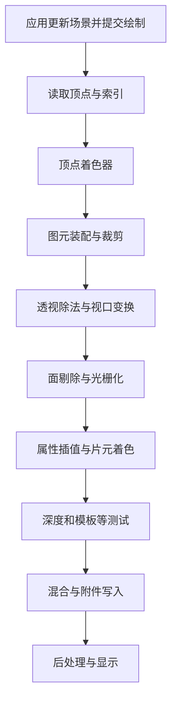
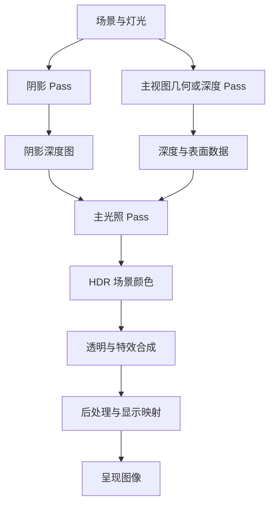
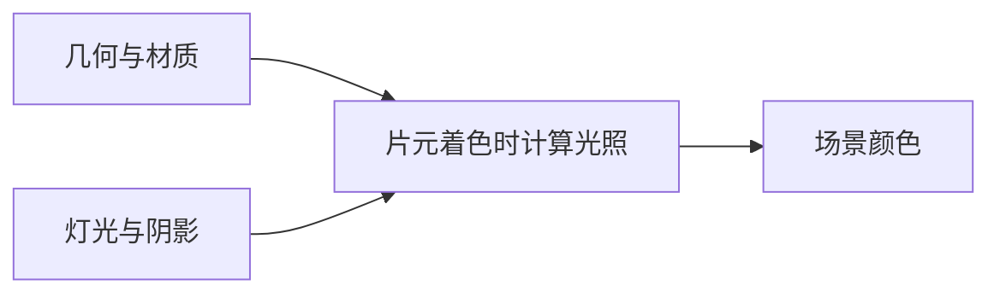
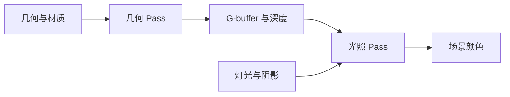

# 渲染管线：从三维场景到屏幕像素

> [!abstract] 学习目标
> 理解一组顶点怎样变成屏幕上的颜色：从场景提交、坐标变换、投影与裁剪，到光栅化、插值、着色、深度测试、混合和显示。
>
> 主线是实时图形学中的光栅化管线，随后扩展到多 Pass、前向与延迟渲染、GPU 并行和现代管线。本文按学习顺序重新组织，不是课程逐字稿，也不依赖某个游戏引擎。

## 阅读方法与目录

先理解每个阶段“输入什么、输出什么、解决什么问题”，再看公式。第 18 章提供一个可以逐步复算的完整三角形例子。

| 阶段 | 章节 | 学习重点 |
| --- | --- | --- |
| 建立全貌 | 1—4 | 场景、Draw Call、GPU 管线与几何数据 |
| 几何变成采样 | 5—9 | 坐标变换、投影、裁剪、光栅化和插值 |
| 采样变成颜色 | 10—14 | 纹理、着色、深度、透明和抗锯齿 |
| 组织完整一帧 | 15—17 | 多 Pass、渲染架构与 GPU 执行 |
| 实践与巩固 | 18—21 | 数值例子、实现骨架、排错与自测 |

- [[#1. 渲染管线究竟在解决什么问题]]
- [[#2. 先看一条完整的概念管线]]
- [[#3. 应用阶段：CPU 如何把工作交给 GPU]]
- [[#4. 顶点、索引与图元]]
- [[#5. 坐标空间与模型视图变换]]
- [[#6. 投影与齐次坐标]]
- [[#7. 裁剪、透视除法、视口与剔除]]
- [[#8. 光栅化：三角形覆盖哪些采样点]]
- [[#9. 插值：从顶点属性得到片元属性]]
- [[#10. 纹理采样与过滤]]
- [[#11. 片元着色：计算当前表面的颜色]]
- [[#12. 深度、模板与提前测试]]
- [[#13. 混合与透明物体]]
- [[#14. 抗锯齿：为什么一个像素不只是一个点]]
- [[#15. 多 Pass：组织完整的一帧]]
- [[#16. 前向、延迟与分块光照]]
- [[#17. GPU 实际怎样执行这些工作]]
- [[#18. 从三角形到像素的完整数值例子]]
- [[#19. 最小实现骨架]]
- [[#20. 调试方法与常见误区]]
- [[#21. 自测、学习路线与参考资料]]
- [[#附录：管线与公式速查]]

---

## 1. 渲染管线究竟在解决什么问题

给定一个三维场景，你通常有模型、材质、灯光和相机；显示器需要的却是一张二维颜色数组。

从前者到后者，至少要回答三个问题：

1. **它投影到哪里？** 一个三维物体在屏幕上是什么位置和大小？
2. **谁挡住了谁？** 多个物体投影到同一位置，哪个表面可见？
3. **它是什么颜色？** 可见表面在当前光照与观察方向下，向相机发出多少光？

渲染管线把这一大问题拆成可组合的处理阶段。

### 1.1 管线不是一条颜色公式

前一篇 PBR 教程主要讨论第三个问题：材质怎样响应入射光。

本篇讨论更完整的数据流：如何找到要着色的表面位置，如何获得它的属性，如何处理可见性，再把着色结果写成一帧图像。

| 概念 | 主要职责 |
| --- | --- |
| 投影 | 把三维位置映射到二维观察平面 |
| 光栅化 | 求图元对离散采样点的覆盖 |
| 深度测试 | 在投影重叠处比较前后关系 |
| 着色 | 根据材质、光照等计算输出 |
| PBR | 约束材质与光照计算，使其具有物理依据 |
| 显示映射 | 将场景颜色转换为显示设备可用的信号 |

### 1.2 光栅化与光线追踪的思路

可以把两者的典型可见性思路理解为：

- 光栅化：从图元出发，寻找它影响的屏幕采样点。
- 光线追踪：从射线出发，寻找它首先或随后相交的表面。

它们可以使用相同的材质模型，也可以出现在同一帧中。例如，主视图用光栅化确定表面，再用射线查询计算阴影或反射。

> [!tip] 全篇最重要的划分
> 覆盖、可见性、着色和显示是相互联系但职责不同的问题。画面出错时，先判断错误属于哪一类。

---

## 2. 先看一条完整的概念管线

先考虑最常见的三角形绘制，不启用曲面细分、几何着色器等可选阶段。



这是一张**便于理解数据依赖的概念图**。它不表示 GPU 必须先完整执行完某一层，再执行下一层；深度测试也可能提前，相关条件见第 12 章。

### 2.1 各阶段的输入与输出

| 阶段 | 主要输入 | 主要输出 |
| --- | --- | --- |
| 应用与提交 | 场景、相机、动画、资源 | 绘制命令、资源绑定与状态 |
| 顶点处理 | 顶点属性、变换矩阵 | 裁剪空间位置、待插值属性 |
| 图元处理 | 处理后的顶点与拓扑 | 有效点、线、三角形等 |
| 光栅化 | 屏幕上的图元 | 覆盖信息、插值所需数据 |
| 片元着色 | 属性、纹理、光照数据 | 颜色或其他输出，可选深度等 |
| 逐片元与逐样本操作 | 片元输出、深度模板状态、旧附件值 | 保留下来的附件更新 |
| 后处理与显示 | 当前帧和历史帧资源 | 待呈现图像 |

### 2.2 可编程与固定功能

顶点、片元等着色器由开发者编写；光栅化覆盖规则、常规深度比较、混合等通常由专用硬件按照配置执行。

“固定功能”不等于不能控制：例如你可以选择背面剔除模式、深度比较函数和混合因子，但通常不逐行编写硬件内部的三角形覆盖算法。

不同 API 对阶段和状态的组织方式不同。可对照 [Microsoft：Graphics Pipeline](https://learn.microsoft.com/en-us/windows/win32/direct3d11/overviews-direct3d-11-graphics-pipeline) 理解其数据流。

### 2.3 三种常被混称的管线

| 层次 | 例子 |
| --- | --- |
| 一次绘制的图形管线 | 顶点 → 光栅化 → 片元 → 输出 |
| 一帧的渲染流程 | 阴影 → 主场景 → 透明 → 后处理 |
| 引擎的渲染架构 | Forward、Deferred、Clustered、混合渲染 |

讨论“某个操作在管线哪里”时，应先明确说的是哪个层次。

---

## 3. 应用阶段：CPU 如何把工作交给 GPU

### 3.1 一帧开始前要准备什么

应用通常会：

- 更新动画、物体变换和相机。
- 选择当前需要绘制的对象及细节等级。
- 准备顶点缓冲、索引缓冲、纹理和常量数据。
- 选择着色器、渲染目标、深度状态与混合状态。
- 记录并提交绘制或计算命令。

这些工作并不必然全部在 CPU 上完成。GPU 驱动渲染可以把可见性判断、LOD 选择和间接绘制参数生成等移到 GPU。

### 3.2 Draw Call 是什么

一次 Draw Call 可以理解为一条指令：

> 使用当前指定的管线和资源，按照给定的拓扑与数量处理一批图元。

它通常引用已经存在的缓冲和纹理，不意味着每次都把整个模型重新上传。

一次绘制可能包含很多三角形；一个复杂模型也可能由于不同材质、状态或 Pass 被拆成多次绘制。Draw Call、物体和三角形不是一一对应关系。

### 3.3 为什么绘制次数会影响性能

每次绘制都可能带来命令记录、状态处理、资源管理和调度成本。因此大量非常小的绘制可能让应用受 CPU 或提交开销限制。

常见优化包括：

- 合并可共享状态的批次。
- 用实例化绘制同一网格的多个副本。
- 采用间接绘制减少 CPU 逐对象提交。

但盲目合并所有对象也可能使剔除变粗、绘制更多不可见内容，或者增加状态和数据处理复杂度。优化应针对实际瓶颈。

### 3.4 CPU 与 GPU 往往是异步协作

CPU 可能正在准备后续工作，而 GPU 正在执行之前提交的命令。

因此，“CPU 调用了绘制函数”不等于“GPU 此刻已经画完”。读取 GPU 结果、复用正在使用的资源、跨队列传递数据，都需要正确同步。

后文会介绍，同步至少要区分执行先后与内存可见性。现代显式 API 的相关概念可参见 [Vulkan Guide：Synchronization](https://docs.vulkan.org/guide/latest/synchronization.html)。

---

## 4. 顶点、索引与图元

### 4.1 顶点不是只有位置

一个顶点通常携带：

| 属性 | 用途 |
| --- | --- |
| 位置 | 定义几何形状 |
| 法线 | 描述着色所需的表面朝向 |
| 纹理坐标 UV | 指定材质纹理的位置 |
| 切线及手性 | 构造法线贴图使用的切线空间 |
| 顶点颜色 | 提供颜色或其他自定义权重 |
| 骨骼索引与权重 | 蒙皮变形 |

两个顶点可以有相同位置，但不同法线或 UV。例如立方体的硬边、纹理接缝处，经常需要多个属性记录。

### 4.2 为什么使用索引

顶点缓冲保存属性，索引缓冲说明如何引用这些顶点组成图元。

例如索引序列 `(0, 1, 2, 2, 1, 3)` 在三角形列表拓扑下表示两个三角形。

索引有助于共享属性记录，也可能让实现复用已经完成的顶点处理结果。但不能把它理解为“每个不同位置永远只运行一次顶点着色器”；缓存、实例、绘制边界和管线行为都会影响实际执行。

### 4.3 图元装配

图元 topology 告诉 GPU 如何解释输入序列，例如点列表、线列表、三角形列表或三角形带。

顶点着色器只输出了一批顶点，装配阶段还需要知道哪些顶点共同定义一个图元。

### 4.4 为什么常用三角形

非退化的三个点确定一个平面；三角形内部可以用重心坐标表达，边界也便于用线性函数判断。

复杂曲面可以近似成三角形网格。但三角形划分仍会影响轮廓、插值和阴影质量，不能认为足够漂亮的材质就能补回所有缺失几何。

---

## 5. 坐标空间与模型视图变换

### 5.1 本文统一约定

为了让推导自洽，本文主体采用：

- 右手观察坐标系，相机看向负 $z$ 轴。
- 列向量，矩阵在左侧相乘。
- 默认 OpenGL 风格的裁剪深度范围，NDC 深度为 $[-1,1]$。
- 视口示例采用左下角原点、$y$ 轴向上。
- 常规深度映射：近处为 0，远处为 1，较小值更近。

其他 API 的默认深度范围、视口方向、矩阵构造可能不同；这些约定必须成套调整。右手或左手坐标系本身也不是由 API 名称唯一决定的。

### 5.2 六个重要空间

$$
\text{Object}\rightarrow\text{World}\rightarrow\text{View}
\rightarrow\text{Clip}\rightarrow\text{NDC}\rightarrow\text{Window}
$$

| 空间 | 直觉 |
| --- | --- |
| 模型空间 Object | 模型自己的局部坐标 |
| 世界空间 World | 多个物体共同所在的场景坐标 |
| 观察空间 View | 用相机的位置和朝向重新描述场景 |
| 裁剪空间 Clip | 投影矩阵输出的齐次坐标，用于裁剪 |
| 标准化设备坐标 NDC | 裁剪后除以 $w$ 得到的规范化坐标 |
| 窗口空间 Window | 映射到视口尺寸和深度范围后的坐标 |

### 5.3 MVP 变换

设模型、观察、投影矩阵分别为 $M$、$V$、$P$：

$$
\mathbf{p}_w=M\mathbf{p}_o,\qquad
\mathbf{p}_v=V\mathbf{p}_w,\qquad
\mathbf{p}_c=P\mathbf{p}_v
$$

于是：

$$
\boxed{\mathbf{p}_c=PVM\mathbf{p}_o}
$$

在本文的列向量约定下，最右侧的矩阵先作用。矩阵在内存中采用行主序或列主序，是另一个存储问题，不应只凭存储名判断数学乘法顺序。

### 5.4 点、方向与齐次坐标

三维点写成 $(x,y,z,1)^T$，方向写成 $(x,y,z,0)^T$。四维仿射矩阵可以把平移和线性变换统一表示：

$$
M=\begin{bmatrix}
A&\mathbf{t}\\
\mathbf{0}^T&1
\end{bmatrix}
$$

因此：

$$
M\begin{bmatrix}\mathbf{p}\\1\end{bmatrix}
=\begin{bmatrix}A\mathbf{p}+\mathbf{t}\\1\end{bmatrix},\qquad
M\begin{bmatrix}\mathbf{d}\\0\end{bmatrix}
=\begin{bmatrix}A\mathbf{d}\\0\end{bmatrix}
$$

点会受平移影响，方向不会。这里的 $w=0$ 结论用于仿射方向变换，不要据此在完整透视投影后把所有四维结果都当普通三维方向处理。

### 5.5 观察矩阵为什么是相机变换的逆

假设 $C$ 把相机局部坐标转换到世界坐标。那么要把世界中的点改用相机坐标表示，就需要：

$$
V=C^{-1}
$$

如果相机刚体变换为：

$$
C=\begin{bmatrix}R&\mathbf{t}\\\mathbf{0}^T&1\end{bmatrix}
$$

其中 $R$ 是正交旋转矩阵，则：

$$
V=\begin{bmatrix}R^T&-R^T\mathbf{t}\\\mathbf{0}^T&1\end{bmatrix}
$$

直觉上，相机向右移动，物体在相机看来向左移动。

### 5.6 法线为什么需要逆转置

法线与表面切向量正交。设原法线为 $\mathbf{n}$，切向量为 $\mathbf{t}$：

$$
\mathbf{n}^T\mathbf{t}=0
$$

位置的线性部分为 $A$，变换后切向量为 $A\mathbf{t}$。为了保留正交关系，需要：

$$
\boxed{\mathbf{n}'\propto(A^{-1})^T\mathbf{n}}
$$

因为：

$$
\left((A^{-1})^T\mathbf{n}\right)^T(A\mathbf{t})
=\mathbf{n}^TA^{-1}A\mathbf{t}=0
$$

最后再归一化。$A$ 必须可逆；若模型沿某方向压缩为零，就不能直接求逆。

若在世界空间着色，使用模型变换的线性部分；若在观察空间着色，使用模型—观察变换的线性部分。不要给照明法线套上透视投影矩阵。

> [!warning] 空间混用会制造难以定位的光照错误
> 参与同一次点积的法线、视线与光照方向必须处于同一坐标空间。非均匀缩放时，直接用位置矩阵变换法线通常会出错。

---

## 6. 投影与齐次坐标

### 6.1 正交投影与透视投影

正交投影中，同样大的物体不会仅因距离变远而缩小。透视投影中，物体的屏幕尺寸通常与距离成反比。

透视投影的核心几何来自相似三角形。设相机前方的正距离为 $d=-z_v>0$：

$$
x_{\mathrm{image}}\propto\frac{x_v}{d},\qquad
y_{\mathrm{image}}\propto\frac{y_v}{d}
$$

关键是除以距离。普通三维线性变换无法直接完成变量相除，因此使用齐次坐标保存分母，再做透视除法。

### 6.2 用视场角决定缩放

设垂直视场角为 $\theta_y$，视口宽高比为 $a=W/H$，令：

$$
s=\cot\frac{\theta_y}{2}
$$

则希望投影后的横纵 NDC 为：

$$
x_{\mathrm{ndc}}=\frac{s}{a}\frac{x_v}{d},\qquad
y_{\mathrm{ndc}}=s\frac{y_v}{d}
$$

视场角越大，$s$ 越小，同样的物体在屏幕中通常越小。

### 6.3 一套完整的透视投影矩阵

设近、远裁剪距离为 $n$、$f$，满足 $0<n<f$。在本文约定下：

$$
P=\begin{bmatrix}
s/a&0&0&0\\
0&s&0&0\\
0&0&-\dfrac{f+n}{f-n}&-\dfrac{2fn}{f-n}\\
0&0&-1&0
\end{bmatrix}
$$

对 $\mathbf{p}_v=(x_v,y_v,z_v,1)^T$，输出满足：

$$
x_c=\frac{s}{a}x_v,\qquad y_c=sy_v,\qquad w_c=-z_v=d
$$

$$
z_c=-\frac{f+n}{f-n}z_v-\frac{2fn}{f-n}
$$

注意：**矩阵乘法输出的是裁剪空间坐标，还没有变成屏幕坐标。**

### 6.4 为什么深度要这样设计

完成透视除法后：

$$
z_{\mathrm{ndc}}=
\frac{f+n}{f-n}-\frac{2fn}{(f-n)d}
$$

代入近远平面：

$$
d=n\Rightarrow z_{\mathrm{ndc}}=-1,\qquad
d=f\Rightarrow z_{\mathrm{ndc}}=1
$$

它保留了比较前后所需的单调关系，但不是线性距离。

### 6.5 正交投影矩阵

设视体左右边界为 $l,r$，上下边界为 $b,t$，近远距离仍为 $n,f$：

$$
P_{\mathrm{ortho}}=\begin{bmatrix}
\dfrac{2}{r-l}&0&0&-\dfrac{r+l}{r-l}\\
0&\dfrac{2}{t-b}&0&-\dfrac{t+b}{t-b}\\
0&0&-\dfrac{2}{f-n}&-\dfrac{f+n}{f-n}\\
0&0&0&1
\end{bmatrix}
$$

此时输入点的输出 $w_c=1$，透视除法不再造成近大远小，深度映射也是线性的。

### 6.6 齐次坐标不是多余的第四个分量

齐次位置 $(x,y,z,w)$ 与非零公共倍数 $(kx,ky,kz,kw)$ 在除以 $w$ 后代表同一欧氏位置。

但在实际图形管线中，$w$ 还参与裁剪和透视正确插值。不要为了“提前得到坐标”，在顶点着色器中随意除以 $w$ 后把它改成 1，这会破坏后续阶段需要的信息。

上述坐标变换对应 GAMES101 的模型、视图和投影主题，课程入口见 [GAMES101 官方目录](https://sites.cs.ucsb.edu/~lingqi/teaching/games101.html)。

---

## 7. 裁剪、透视除法、视口与剔除

### 7.1 裁剪：保留视体内部的部分

在本文默认的裁剪空间约定下，可见视体满足：

$$
-w_c\leq x_c\leq w_c,\qquad
-w_c\leq y_c\leq w_c,\qquad
-w_c\leq z_c\leq w_c
$$

如果一个三角形跨越视体边界，需要保留内部区域，并可能生成新的顶点和三角形。

**只要一个顶点在视体外就丢弃整个三角形，是错误的。** 甚至三个顶点都在视体外，三角形仍可能穿过可见区域。

常见的快速拒绝条件是：所有顶点都在同一个裁剪平面的外侧；其他情况可能需要真正裁剪。

### 7.2 为什么先裁剪，再除以 w

三角形可能跨越相机平面，$w$ 可能变为零或改变符号。若先除以 $w$，可能产生无穷大、符号翻转和错误的屏幕形状。

齐次裁剪使用线性平面不等式，能够在投影奇点被引入之前处理边界。

### 7.3 裁剪交点怎么求

用线性函数 $g(\mathbf{p})$ 表示一个裁剪半空间，内部满足 $g\geq 0$。例如左侧平面可以写为 $g=x_c+w_c$。

边的两个端点为 $\mathbf{A}$、$\mathbf{B}$，边上位置为：

$$
\mathbf{p}(t)=(1-t)\mathbf{A}+t\mathbf{B}
$$

令 $g(\mathbf{p}(t))=0$，得到：

$$
t=\frac{g(\mathbf{A})}{g(\mathbf{A})-g(\mathbf{B})}
$$

对于本文普通平滑插值属性，新顶点属性也按这个边参数生成：

$$
q(t)=(1-t)q_A+tq_B
$$

例如近裁剪平面 $g=z_c+w_c$，若两端的 $g$ 分别为 $-1$ 和 $1$，交点在 $t=1/2$。

裁剪阶段的线性插值与后续屏幕空间透视正确插值是不同操作；`flat` 等特殊插值属性还有其对应规则。

### 7.4 透视除法

有效裁剪完成后：

$$
\boxed{
\mathbf{p}_{\mathrm{ndc}}=
\left(\frac{x_c}{w_c},\frac{y_c}{w_c},\frac{z_c}{w_c}\right)
}
$$

本文的横纵和深度 NDC 均位于 $[-1,1]$。Direct3D 和 Vulkan 通常采用不同的默认裁剪深度条件 $0\leq z_c\leq w_c$，对应 NDC 深度 $[0,1]$；OpenGL 也可通过相关配置采用零到一的深度约定。

这意味着移植投影矩阵时，不能只翻转一个轴就认为所有约定已经匹配。具体裁剪与视口规则可核对 [Vulkan：Fixed-Function Vertex Post-Processing](https://docs.vulkan.org/spec/latest/chapters/vertexpostproc.html)。

### 7.5 视口变换

设视口左下角为 $(x_0,y_0)$，宽高为 $W,H$：

$$
x_s=x_0+\frac{x_{\mathrm{ndc}}+1}{2}W
$$

$$
y_s=y_0+\frac{y_{\mathrm{ndc}}+1}{2}H
$$

默认深度范围为 $[0,1]$ 时：

$$
z_{\mathrm{buf}}=\frac{z_{\mathrm{ndc}}+1}{2}
$$

NDC 右边界映射到 $x_0+W$，这是视口边界，不是最后一个像素中心。本文第 $i,j$ 个像素的单采样位置取 $(i+1/2,j+1/2)$，并假设视口原点为零。

如果使用左上角原点、$y$ 向下的窗口坐标，需要相应调整 $y$ 变换以及相关绕序判断。

### 7.6 背面剔除与裁剪的区别

背面剔除判断三角形是否朝向背面；裁剪判断图元是否位于视体内部。

对屏幕顶点 $A,B,C$，可以计算带符号的两倍面积：

$$
S=(B_x-A_x)(C_y-A_y)-(B_y-A_y)(C_x-A_x)
$$

在本文 $y$ 向上的坐标中，$S>0$ 表示逆时针绕序。但“顺时针还是逆时针算正面”由管线状态决定。

背面剔除使用图元绕序，通常不看你存储的顶点法线。负缩放、视口翻转或顶点索引顺序变化，都可能影响绕序。

### 7.7 另外两类剔除

- **视锥剔除**：按物体或包围体提前排除完全不在视野内的对象。
- **遮挡剔除**：尝试排除被其他几何完全遮挡的对象或图元。

前者可节省后续顶点等工作；后者通常需要深度、层次结构或历史可见性信息。它们不能与逐采样深度测试混为一谈。

---

## 8. 光栅化：三角形覆盖哪些采样点

### 8.1 从连续几何到离散位置

屏幕上的三角形是连续区域，像素数组是离散的。光栅化要判断每个采样位置是否被图元覆盖，并准备后续插值所需的信息。

它本身并不完整计算材质光照，也不保证某个覆盖到的片元最终可见。

### 8.2 像素、采样点、片元与着色器调用

| 概念 | 含义 |
| --- | --- |
| 像素 Pixel | 最终图像的一个存储或显示单元 |
| 采样点 Sample | 像素区域内用于覆盖、深度等操作的位置 |
| 片元 Fragment | 图元在某处产生的候选贡献及相关数据 |
| 着色器调用 Invocation | GPU 实际执行一次着色程序的工作实例 |

一个像素可能被多个三角形先后覆盖，因此会出现多个候选片元。MSAA 下，一个像素还具有多个覆盖与深度样本。

着色器也可能因为导数计算而存在辅助调用。因此“每个像素只执行一次片元着色器”不成立。

### 8.3 边函数判断覆盖

对一条有向边 $A\rightarrow B$，定义：

$$
E_{AB}(P)=
(B_x-A_x)(P_y-A_y)-(B_y-A_y)(P_x-A_x)
$$

它是二维叉积：

- 大于零：$P$ 位于有向边左侧。
- 小于零：$P$ 位于右侧。
- 等于零：$P$ 落在边的直线上。

若三角形 $A,B,C$ 逆时针，内部点满足三个边函数都为非负；边界如何纳入，还需要一致的填充规则。

### 8.4 为什么需要共享边规则

两个相邻三角形共享一条边。如果两边都把边界样本算进去，可能重复绘制；如果两边都排除，又会出现裂缝。

常见 top-left 规则为边界样本规定唯一归属。不同坐标方向下，“上”“左”对应的代数符号需要相应调整。

本质要求是：对于一致的共享边，一个边界样本恰好属于其中一个三角形。具体规则可对照 [Microsoft：Rasterization Rules](https://learn.microsoft.com/en-us/windows/win32/direct3d11/d3d10-graphics-programming-guide-rasterizer-stage-rules)。

### 8.5 为什么硬件可以很快

边函数对于 $P_x,P_y$ 是线性的。在扫描相邻采样位置时，可以增量更新：

$$
E_{AB}(x+1,y)=E_{AB}(x,y)-(B_y-A_y)
$$

$$
E_{AB}(x,y+1)=E_{AB}(x,y)+(B_x-A_x)
$$

教学实现可以遍历三角形包围盒；硬件则可以结合分块、层次覆盖判断、并行处理与固定精度规则来提升吞吐。

### 8.6 光栅化不等于抗锯齿

只在每个像素中心做一次内外测试，本质上是对连续覆盖函数采样。当边缘移动时，采样结果会跳变，产生锯齿和闪烁。

要缓解这些问题，需要对像素覆盖或图像信号进行更合适的采样与过滤，第 14 章再展开。

---

## 9. 插值：从顶点属性得到片元属性

### 9.1 重心坐标

对非退化三角形 $A,B,C$，任一点 $P$ 可写为：

$$
P=\lambda_AA+\lambda_BB+\lambda_CC,\qquad
\lambda_A+\lambda_B+\lambda_C=1
$$

若三个权重都非负，则 $P$ 位于三角形内部或边界。

用前面的边函数：

$$
\lambda_A=\frac{E_{BC}(P)}{E_{BC}(A)},\qquad
\lambda_B=\frac{E_{CA}(P)}{E_{CA}(B)},\qquad
\lambda_C=\frac{E_{AB}(P)}{E_{AB}(C)}
$$

下文的 $\lambda_i$ 特指投影后屏幕三角形的重心坐标。

### 9.2 普通线性插值为什么会出错

若直接计算纹理坐标：

$$
q_{\mathrm{affine}}=\sum_i\lambda_iq_i
$$

得到的是屏幕空间线性插值。正交投影或顶点 $w$ 相同的情形下，它通常合适；透视投影下，远处空间被压缩得更多，屏幕权重不再等于投影前的权重。

常见症状是倾斜平面上的纹理变形，或者一个四边形拆成两个三角形后出现不自然的对角线变化。

### 9.3 透视正确插值公式

设顶点裁剪坐标的第四分量为 $w_i$，属性为 $q_i$：

$$
\boxed{
q(P)=\frac{\sum_i\lambda_iq_i/w_i}{\sum_i\lambda_i/w_i}
}
$$

可以按三个动作理解：

1. 顶点先保存 $q_i/w_i$ 与 $1/w_i$。
2. 在屏幕上分别线性插值这两种量。
3. 用插值结果相除，恢复属性。

GPU 会按插值模式完成这类工作，通常不需要手写每个片元的重心坐标。

### 9.4 权重为何需要除以 w

设投影前对应点的权重为 $\beta_i$。齐次坐标线性组合满足：

$$
\mathbf{p}_c=\sum_i\beta_i\mathbf{p}_{c,i},\qquad
w=\sum_i\beta_iw_i
$$

透视除法后，屏幕权重满足：

$$
\lambda_i=\frac{\beta_iw_i}{\sum_j\beta_jw_j}
$$

反解得：

$$
\beta_i=\frac{\lambda_i/w_i}{\sum_j\lambda_j/w_j}
$$

属性 $q=\sum_i\beta_iq_i$，因此得到透视正确插值公式。

### 9.5 一个两端点例子

屏幕上一条边的中点，两个屏幕权重都是 $1/2$。设：

$$
w_A=1,\quad w_B=2,\quad u_A=0,\quad u_B=1
$$

屏幕线性插值得到 $u=1/2$；透视正确插值得到：

$$
u=\frac{(1/2)\times 0/1+(1/2)\times 1/2}
{(1/2)/1+(1/2)/2}=\frac{1}{3}
$$

靠近相机的端点获得更大的投影前权重。

### 9.6 深度是一个重要特例

在标准投影与常规光栅化中，NDC 深度在屏幕三角形上是线性的：

$$
\boxed{z_{\mathrm{ndc}}(P)=\sum_i\lambda_i\frac{z_{c,i}}{w_i}}
$$

随后线性映射到深度缓冲范围。因此，已经除以 $w$ 的顶点 NDC 深度，不应再当普通属性套一次透视校正。

从推导也能看到：若分别按透视规则重建 $z_c(P)$ 和 $w_c(P)$，再取两者之比，它们共同的插值分母会抵消。

需要插值或重建的是观察空间距离时，则是另一回事。在本文 $w_i=d_i$ 的透视矩阵下：

$$
d(P)=\frac{1}{\sum_i\lambda_i/d_i}
$$

**屏幕线性深度值不等于线性观察距离。** 深度的这种性质也有利于层次测试，参见 [NVIDIA：Visualizing Depth Precision](https://developer.nvidia.com/blog/visualizing-depth-precision/)。

### 9.7 不同属性可以选择不同插值规则

| 意图 | 常见模式名称 | 例子 |
| --- | --- | --- |
| 透视正确插值 | GLSL `smooth`；HLSL 默认 `linear` | UV、位置、一般表面属性 |
| 屏幕线性插值 | `noperspective` | 某些屏幕空间距离与特效 |
| 不插值 | GLSL `flat`；HLSL `nointerpolation` | 材质 ID、图元编号 |
| 在覆盖区域内取值 | `centroid` | 部分 MSAA 边界属性 |
| 在样本位置取值 | `sample` | 需要逐样本着色的情况 |

不要被 HLSL 的 `linear` 名字误导：默认插值可包含透视校正。整数 ID 也不应像 UV 那样混合。具体限制见 [Microsoft：HLSL Interpolation Modifiers](https://learn.microsoft.com/en-us/windows/win32/direct3dhlsl/dx-graphics-hlsl-struct)。

法线插值后通常不再是单位向量，需要在着色前重新归一化。归一化并不改变其所在的坐标空间。

---

## 10. 纹理采样与过滤

### 10.1 UV 与纹素

UV 是用于查询纹理的坐标；纹素 texel 是纹理图像中的一个存储单元。

采样器需要决定：

- 超出边界时重复、镜像还是截取边缘。
- 在相邻纹素之间如何过滤。
- 缩小时查询哪个分辨率层级。

纹理不一定保存颜色，也可能保存法线、粗糙度、深度、查找表或任意数据。

### 10.2 放大：最近点与双线性过滤

最近点采样选择一个邻近纹素，容易出现方块感。

双线性过滤在两个纹理轴上进行线性混合。设四个纹素为 $c_{00},c_{10},c_{01},c_{11}$，局部权重为 $s,t$：

$$
c=(1-s)(1-t)c_{00}+s(1-t)c_{10}+(1-s)tc_{01}+stc_{11}
$$

它能平滑放大后的纹素边界，但不能凭空恢复原纹理里不存在的细节。

### 10.3 缩小：为什么双线性还不够

远处一个像素可能覆盖几百个纹素。只取邻近四个纹素，仍然是在严重欠采样，可能出现摩尔纹、跳动或闪烁。

正确直觉是：一个像素应该根据自己在纹理上覆盖的足迹，汇总相应范围的信号。

### 10.4 Mipmap

Mipmap 保存纹理逐级缩小后的结果。每一级宽高约为前一级的一半。

对于理想二维完整链，其总纹素数约为：

$$
WH\left(1+\frac14+\frac1{16}+\cdots\right)=\frac43WH
$$

因此，相比原图，纹素存储量约增加三分之一；实际字节数还取决于格式、尺寸和压缩对齐。

三线性过滤通常表示：在两个相邻 mip 层内分别双线性采样，再在层级之间线性混合。它不是三维纹理的专属术语。

### 10.5 怎样估计纹理足迹

设纹理尺寸为 $T_w,T_h$，屏幕相邻位置的 UV 变化为导数，则可估计：

$$
\mathbf{d}_x=\left(T_w\frac{\partial u}{\partial x},T_h\frac{\partial v}{\partial x}\right),\qquad
\mathbf{d}_y=\left(T_w\frac{\partial u}{\partial y},T_h\frac{\partial v}{\partial y}\right)
$$

一种教学用的各向同性近似为：

$$
\rho=\max(\lVert\mathbf{d}_x\rVert,\lVert\mathbf{d}_y\rVert),\qquad
\mathrm{LOD}\approx\max(0,\log_2\rho)
$$

例如一像素约跨越 8 个纹素，$\log_2 8=3$，适合参考第 3 级附近的 mip。

GPU 的隐式导数通常利用邻近片元调用计算。它解释了为什么片元着色器经常以小组方式执行，也解释了为什么在不一致的控制流中使用隐式导数需要小心。

### 10.6 各向异性过滤

斜视地面时，像素在纹理上的足迹可能是细长形状。只用一个标量选择正方形 mip，容易过度模糊某个方向。

各向异性过滤沿不同方向处理这种不均匀足迹，在斜视纹理上通常更清晰，但会增加采样与带宽成本。

### 10.7 数据含义决定过滤方式

- 颜色纹理需要在适当的线性颜色空间中混合，不能把非线性编码值当光能相加。
- 法线纹理过滤后通常要重建并归一化，还可能需要调整有效粗糙度。
- 材质 ID、索引等离散数据通常不应采用普通颜色插值。
- 深度纹理的比较采样与普通深度值平均是不同操作。

纹理映射、插值与 Mipmap 可对应 [GAMES101 的着色与高级纹理映射主题](https://sites.cs.ucsb.edu/~lingqi/teaching/games101.html)。

---

## 11. 片元着色：计算当前表面的颜色

### 11.1 片元着色器拿到了什么

典型输入包括：

- 插值后的世界或观察空间位置。
- 插值后的法线、UV、切线等属性。
- 纹理、材质参数、灯光数据。
- 某些屏幕位置和采样相关的内建信息。

输出可以是最终场景颜色，也可以是法线、粗糙度等中间数据。片元着色器不一定执行光照，这取决于当前 Pass 的用途。

### 11.2 以 Lambert 光照为例

若输入是某方向光束的垂直入射辐照度 $E_\perp$，法线与指向光源的方向分别为单位向量 $\mathbf{n},\mathbf{l}$，则：

$$
L_o=\frac{c}{\pi}E_\perp\max(\mathbf{n}\cdot\mathbf{l},0)
$$

这里 $c$ 是线性反照率。该公式把已经找到的表面属性转成颜色；它不负责自动寻找所有光源，也不自动计算场景阴影。

### 11.3 PBR 在这里处于什么位置

更一般的表面着色目标是：

$$
L_o=L_e+\int_{\Omega^+}f_rL_i\cos\theta_i\,\mathrm{d}\omega_i
$$

PBR 的 BRDF、环境光照、光源采样等决定怎样近似这个积分。渲染管线则负责提供表面数据、执行着色，并组织相关资源。

因此，把 Lambert 换成 GGX，并不会自动让场景获得阴影、反射可见性或多次反弹。这些需要额外数据与光传播算法。

### 11.4 着色频率

| 方法 | 主要做法 | 常见限制 |
| --- | --- | --- |
| Flat Shading | 按面采用共同的法线或着色结果 | 外观可能明显分面 |
| Gouraud Shading | 在顶点计算光照，再插值颜色 | 顶点之间的小高光可能漏掉 |
| Phong Shading | 插值法线，在片元处计算光照 | 成本更高，仍受几何与采样限制 |

这里的 Phong Shading 指着色频率与法线插值方法；Phong 反射模型是另一回事。使用逐片元着色时，也可以选择 PBR 等其他反射模型。

### 11.5 Shader 输出不一定写入最终像素

输出还可能被深度、模板、覆盖掩码或写入掩码挡住，也可能与附件原值混合。

着色器中的 `discard` 可以丢弃当前贡献，常用于树叶等 alpha 裁切。但它与真正的半透明混合不同，也会影响提前深度更新的可行性。

---

## 12. 深度、模板与提前测试

### 12.1 深度缓冲回答谁在前面

在常规 0 近、1 远的配置下，每个深度样本保存目前接受的深度值。新片元通过比较，例如：

$$
z_{\mathrm{new}}<z_{\mathrm{stored}}
$$

通过后，允许颜色继续参与输出；若深度写入开启，再用新值更新深度缓冲。

常规 `LESS` 配置通常将深度清除为 1。恰好位于远边界且深度为 1 的片元不会通过严格小于比较，这是比较函数的直接结果。

### 12.2 测试与写入是两个开关

| 配置 | 含义 |
| --- | --- |
| 开启深度测试和写入 | 常见不透明物体处理 |
| 开启测试，关闭写入 | 常见有序透明混合处理 |
| 关闭测试或使用总是通过 | 某些覆盖绘制、调试或特定全屏操作 |

关闭深度写入，不意味着不再被已有的不透明深度遮挡。

### 12.3 为什么不透明物体一般不需要严格排序

当使用一致的深度测试与写入、没有顺序相关副作用时，前后两层不透明物体通常最终保留更近的那一层。

但相等深度、模板操作、混合和着色器副作用可能使顺序影响结果。性能也受顺序影响：先画近处物体，可能让后面的片元更早被拒绝。

### 12.4 常规透视深度不是线性距离

结合第 6、7 章的矩阵与深度映射：

$$
\boxed{
z_{\mathrm{buf}}(d)=\frac{f}{f-n}-\frac{fn}{(f-n)d}
}
$$

取 $n=1,f=9$：

| 观察轴方向距离 $d$ | 深度缓冲值 |
| --- | --- |
| $1$ | $0$ |
| $2$ | $0.5625$ |
| $3$ | $0.75$ |
| $5$ | $0.90$ |
| $9$ | $1$ |

越靠近远处，相同距离变化对应的深度变化越小。

反解观察轴距离：

$$
\boxed{d=\frac{fn}{f-z_{\mathrm{buf}}(f-n)}}
$$

这个公式只适用于本文的标准透视、深度范围和近远平面约定。反向深度、正交投影或自定义投影需要对应的逆变换。

### 12.5 深度精度与 Z-fighting

两个表面足够接近时，它们量化后的深度可能无法稳定区分，形成交错闪烁的 Z-fighting。

对固定间隔的深度量化，求导可见：

$$
\frac{\mathrm{d}z_{\mathrm{buf}}}{\mathrm{d}d}
=\frac{fn}{(f-n)d^2}
$$

因此，对给定的小深度步长 $\Delta z$：

$$
\Delta d\approx\frac{(f-n)d^2}{fn}\Delta z
$$

远处可区分的距离间隔变大。把近裁剪面设得过小，往往会浪费大量精度。

应先合理设置视体和几何关系，再考虑合适的深度格式、反向深度或有明确用途的深度偏移。随意给所有表面添加偏移可能制造新的遮挡错误。

### 12.6 Reversed-Z

反向深度将近处映射为 1，远处为 0，通常配合：

- 深度缓冲清除为 0。
- `GREATER` 或合适的大于等于比较。
- 与零到一裁剪深度范围一致的投影。
- 浮点深度缓冲。

在远平面趋向无穷远的理想构造中，可以得到：

$$
z_{\mathrm{rev}}=\frac{n}{d}
$$

浮点数在接近零的区域提供更细的绝对间隔，能与透视深度分布形成有利配合。只在固定间距的整数深度上反转数值，并不会凭空增加同等量化的精度。

这不是只改比较函数就能完成的优化；投影、清除值、深度重建、阴影与后处理都要核对。可进一步阅读 [NVIDIA：Visualizing Depth Precision](https://developer.nvidia.com/blog/visualizing-depth-precision/)。

### 12.7 Early-Z：为什么深度测试有时在着色之前

概念上，可以先得到片元输出再测试；但如果片元肯定被已有深度挡住，提前拒绝就能省去昂贵的材质和纹理计算。

因此硬件会在允许时进行提前深度测试、层次深度拒绝等优化。

这里必须区分：

- **提前判断不可能可见**。
- **提前把新深度正式写入缓冲**。

若着色器之后可能 `discard`，提前提交深度写入可能错误遮住后续内容；若着色器改写深度或具有外部内存副作用，重排还涉及其他语义限制。

所以不能简单写成“用了 discard 就完全没有 Early-Z”，也不能认为“所有片元都一定先测深度”。具体阶段语义与优化取决于 API、着色器声明和实现。参见 [Vulkan：Fragment Operations](https://docs.vulkan.org/spec/latest/chapters/fragops.html)。

### 12.8 Depth Prepass

深度预通道先用便宜的绘制建立可见深度，再在后续 Pass 进行较昂贵的着色。

它可能减少过度绘制带来的片元开销，但也会重复部分几何处理、光栅化和带宽工作。若场景本来过度绘制较少、几何成本很高，未必划算。

预通道与主通道必须保持位置变换和覆盖一致。尤其是 alpha 裁切、顶点位移、抖动投影和精度差异，可能导致两遍结果不匹配。

### 12.9 模板缓冲 Stencil

模板缓冲保存小整数标签，可以通过比较和更新操作控制哪些采样允许写入。

它适合表达区域掩码、某些轮廓流程或复杂可见性算法中的计数，但不记录物体距离。

模板测试、深度测试和混合共同影响附件更新。具体输出阶段可参考 [Microsoft：Output-Merger Stage](https://learn.microsoft.com/en-us/windows/win32/direct3d11/d3d10-graphics-programming-guide-output-merger-stage)。

---

## 13. 混合与透明物体

### 13.1 混合在做什么

混合将新片元的源颜色 $C_s$ 与目标附件中的旧颜色 $C_d$ 组合。

对非预乘 alpha 的普通 source-over 混合，RGB 常写为：

$$
C_{\mathrm{out}}=\alpha_sC_s+(1-\alpha_s)C_d
$$

对应 alpha 通道若采用 source-over 覆盖关系，则为：

$$
\alpha_{\mathrm{out}}=\alpha_s+(1-\alpha_s)\alpha_d
$$

RGB 与 alpha 的混合因子可以分别配置；不能默认同一组因子总能得到两条正确公式。

### 13.2 为什么顺序重要

假设黑色背景上有两个 50% 透明层：红色在前、蓝色在后。

先画蓝色，再画红色：

$$
C=0.5(1,0,0)+0.5\left[0.5(0,0,1)\right]
=(0.5,0,0.25)
$$

相反顺序会得到 $(0.25,0,0.5)$，显然不同。

这说明常规透明混合不满足交换律。深度缓冲只能方便地保留一个最近层，无法自动把所有透明层按正确顺序合成。

### 13.3 常见绘制策略

1. 先绘制不透明物体，开启深度测试和深度写入。
2. 绘制普通半透明物体，通常保留深度测试、关闭深度写入。
3. 对透明贡献尽可能按从后到前的顺序合成。

按物体中心排序只是近似。相交几何或深度交错的大三角形，可能不存在一个按物体排列的完全正确顺序，需要更细粒度排序、深度剥离或其他 OIT 方法。

### 13.4 预乘 alpha

先令：

$$
C'_s=\alpha_sC_s
$$

则混合可写为：

$$
C'_{\mathrm{out}}=C'_s+(1-\alpha_s)C'_d
$$

预乘形式有利于正确过滤透明边缘，但纹理内容、着色器输出和混合状态必须一致。若颜色已经预乘，又在混合时乘一次源 alpha，边缘会过暗。

### 13.5 Alpha 裁切、透明混合与覆盖率

| 方法 | 处理方式 | 常见用途 |
| --- | --- | --- |
| Alpha Cutout / Clip | 按阈值保留或丢弃 | 树叶、铁丝网等有孔表面 |
| Alpha Blending | 与后方颜色连续混合 | 常规半透明近似 |
| Alpha-to-Coverage | 将 alpha 转为 MSAA 样本覆盖掩码 | 某些植被边缘近似 |

alpha 可以被用作覆盖率或不透明度等参数，具体含义由模型决定。简单 alpha 混合并不能完整模拟玻璃折射、吸收和多层透射。

### 13.6 在线性颜色空间混合

混合颜色时应采用与光能或合成模型一致的线性表示。把 sRGB 编码值直接按光照比例相加，通常会产生不正确的明暗。

API 对 sRGB 附件的解码、混合与编码有各自规定，需要使用正确的资源格式和输出流程，避免重复转换。

---

## 14. 抗锯齿：为什么一个像素不只是一个点

### 14.1 理想像素对应一个区域的测量

把连续图像信号记为 $L(x,y)$，一个像素更合理的模型是对附近区域加权积分：

$$
C_{ij}=\iint L(x,y)\,h_{ij}(x,y)\,\mathrm{d}x\,\mathrm{d}y
$$

其中 $h_{ij}$ 是像素的重建或测量权重，并作合适归一化。

只读取像素中心的一个值，是对这个积分的低成本近似。高频边缘、细线、纹理和高光都可能超过采样能力，产生混叠。

### 14.2 SSAA

超级采样抗锯齿在更多子像素位置完整计算场景，再过滤成输出像素：

$$
C_{ij}\approx\frac{1}{N}\sum_{k=1}^{N}C_{ij,k}
$$

它能同时改善几何和部分着色混叠，但几何、着色、带宽和存储成本都可能显著增长。

### 14.3 MSAA

MSAA 通常为一个像素保存多个覆盖、深度和颜色样本，但不必为每个样本完整运行一次片元着色器。

一个图元覆盖同一像素内多个样本时，常见模式是计算一份着色结果，再写入通过测试的相应样本。多图元覆盖、逐样本着色或辅助调用会改变调用数量。

因此，4× MSAA 不应理解为“每个像素恰好执行四次完整着色”。它主要改善几何覆盖边缘，对纹理和镜面高频着色并不提供与 4× SSAA 相同的效果。

覆盖、插值和着色频率的规则可核对 [Microsoft：Multisample Rasterization](https://learn.microsoft.com/en-us/windows/win32/direct3d11/d3d10-graphics-programming-guide-rasterizer-stage-rules)。

### 14.4 Resolve

多重采样颜色附件需要合并成普通单样本图像。简单颜色 resolve 可以按样本颜色求平均：

$$
C_{\mathrm{resolved}}=\frac{1}{S}\sum_{s=1}^{S}C_s
$$

深度、法线和材质 ID 等数据不能都机械地采用普通颜色平均，具体 resolve 规则由用途和 API 能力决定。

### 14.5 后处理抗锯齿与时间抗锯齿

FXAA、SMAA 等方法从已渲染图像中识别边缘并重建；它们成本较低，但无法完全找回原本没有采到的信息。

TAA 则通过逐帧抖动采样，并利用运动信息将历史结果重投影到当前帧。概念上：

$$
C_t=(1-\alpha)C_{\mathrm{current}}
+\alpha C_{\mathrm{history,reprojected}}
$$

实际实现还需要历史有效性判断、遮挡变化检测、颜色限制和响应速度控制；直接套这个平均式，容易出现拖影。

TAA 的“时间累积”与前一章表示透明覆盖的 alpha 不是同一概念，这里的 $\alpha$ 只是历史权重。

### 14.6 不同混叠需要对应处理

| 现象 | 主要成因 | 可考虑的方法 |
| --- | --- | --- |
| 几何边缘锯齿 | 覆盖采样不足 | MSAA、SSAA、时间采样 |
| 远处纹理摩尔纹 | 纹理缩小欠采样 | Mipmap、各向异性过滤 |
| 高光闪烁 | BRDF 或法线高频变化 | 镜面抗锯齿、合适过滤、时间采样 |
| 运动后拖影 | 错误或过量历史累积 | 改善运动向量、拒绝与历史权重 |

抗锯齿的基本采样理论属于 GAMES101 主线；时间重建和工业界方法可继续对应 [GAMES202](https://sites.cs.ucsb.edu/~lingqi/teaching/games202.html)。

---

## 15. 多 Pass：组织完整的一帧

### 15.1 为什么一次绘制不够

计算阴影需要先知道光源看见的深度；计算屏幕空间反射需要先知道场景深度和颜色；色调映射需要先有 HDR 场景颜色。

因此一帧通常由多个 Pass 组成。广义上的 Pass 是承担某项明确任务、读取和写入一组资源的一批 GPU 工作。

它不一定只有一个 Draw Call，也不一定由光栅化实现；计算着色器也可以承担一个逻辑 Pass。这里的通用概念不要与某个 API 中名为 Render Pass 的特定对象完全等同。

### 15.2 一个典型的依赖图



不同引擎的排列会不同。图中重要的是资源依赖，而不是把这套顺序当所有引擎必须遵守的模板。

### 15.3 阴影贴图：从光源视角再看一次场景

阴影贴图的基础思路：

1. 从光源视角渲染场景深度，得到光源最先看到的表面。
2. 主相机着色时，将当前点变换到光源的裁剪和纹理坐标。
3. 比较当前点到光源的深度与贴图中存储的深度。

若使用常规深度，可作概念比较：

$$
z_{\mathrm{receiver}}>z_{\mathrm{shadow}}+b
\quad\Rightarrow\quad\text{该方向被遮挡}
$$

$b$ 是与约定匹配的偏移，用来缓解有限分辨率和数值误差导致的自阴影。过小可能产生阴影痤疮，过大可能使阴影脱离物体。

点光源需要覆盖多个方向，常见方法使用立方体贴图等表示。软阴影还需要滤波或更复杂采样，不能只靠单次比较得到。

这个例子说明：**主相机的深度测试与从光源判断阴影，是两次不同观察问题。**

### 15.4 Render Target、附件与 Framebuffer

渲染目标是当前工作的输出资源。颜色、深度和模板常以附件形式参与绘制。

Framebuffer 相关概念用于组织这些输出及其兼容关系，但不同 API 的对象模型不同。

离屏渲染就是将结果写入中间纹理或缓冲，而不是立即作为显示图像。下一步可以把这些结果当作输入继续处理。

### 15.5 多重渲染目标 MRT

一次片元着色可以输出多个颜色附件，例如：

- 附件 0：基色。
- 附件 1：法线编码。
- 附件 2：粗糙度与金属度。

MRT 只是同时写多个目标的能力；它可以用于 G-buffer，也可以用于其他用途。

### 15.6 HDR、曝光与显示

光照一般在线性空间计算，场景颜色可以大于 1。先保存在线性 HDR 资源里，再进行曝光和显示映射。

若以 $e$ 表示相对曝光增加的档数：

$$
C_{\mathrm{exposed}}=2^eC_{\mathrm{HDR}}
$$

一个简单示意色调映射是：

$$
C_{\mathrm{mapped}}=\frac{C_{\mathrm{exposed}}}{1+C_{\mathrm{exposed}}}
$$

这只是教学压缩函数，并不替代完整色彩管理。最后还需转换到目标显示色彩空间与编码；SDR sRGB 编码和色调映射的职责不同。

Bloom、景深、TAA、UI 等步骤也有自己的色彩空间和依赖要求，不能认为所有“后处理”可以任意交换。

### 15.7 Present：把图像交给显示系统

图像准备好后，通过交换链等呈现机制交给窗口或显示系统。

呈现调用完成、GPU 完成绘制、显示器实际扫描到该图像，是相关但不同的时刻。缓冲数量、垂直同步和排队深度会影响吞吐、撕裂与输入延迟。

因此，“帧已经算完”与“用户已经看到这一帧”不能直接画等号。

---

## 16. 前向、延迟与分块光照

### 16.1 Forward Rendering

前向渲染通常在绘制表面时直接计算它的材质和光照，输出场景颜色。



它的数据流直接，便于处理多样的材质和常规透明混合。但如果很多片元都遍历大量灯光，或者后方片元进行了无用着色，成本可能很高。

前向渲染并不意味着“只能处理少量灯光”；现代灯光分配和剔除可以大幅改变成本。

### 16.2 Deferred Shading

延迟着色先通过几何 Pass，把可见表面的材质数据写入 G-buffer，再由光照 Pass 读取这些数据计算颜色。



G-buffer 可以包含基色、法线、粗糙度、金属度、运动向量等，具体布局由引擎决定。

这里的“延迟”指推迟光照计算，与网络延迟或故意晚显示一帧不是同一概念。

### 16.3 为什么位置常从深度重建

世界位置每个像素保存三个浮点数，带宽和存储成本较高。若已有深度和相机矩阵，可以重建位置。

在本文坐标约定下，从像素中心获得 $x_{\mathrm{ndc}},y_{\mathrm{ndc}}$，由 $z_{\mathrm{buf}}$ 得到 $z_{\mathrm{ndc}}=2z_{\mathrm{buf}}-1$。令：

$$
\mathbf{q}_v=P^{-1}
\begin{bmatrix}
x_{\mathrm{ndc}}\\y_{\mathrm{ndc}}\\z_{\mathrm{ndc}}\\1
\end{bmatrix}
$$

再执行齐次除法：

$$
\mathbf{p}_v=\frac{(q_{v,x},q_{v,y},q_{v,z})}{q_{v,w}}
$$

需要世界位置时再用 $V^{-1}$ 转换。

如果投影带有时间抖动，或使用反向深度、不同 NDC 范围，应使用生成该深度时匹配的逆矩阵与坐标转换。

### 16.4 延迟着色的收益与代价

收益通常来自将可见表面数据与光照计算分开，从而让多个光源共享表面信息，并按屏幕区域组织光照。

代价包括：

- G-buffer 的写入、读取和存储。
- 编码和量化误差。
- 多种复杂材质需要额外参数或分支。
- 普通单层 G-buffer 不保留所有透明层。
- 多采样下的表面属性解析更加复杂。

因此，“延迟渲染不支持透明或 MSAA”说得过于绝对。准确说法是：基础 G-buffer 方案处理这些问题更困难，实际引擎可能采用额外 Pass 或混合方法。

### 16.5 一个带宽量级例子

假设分辨率为 $1920\times1080$，G-buffer 平均每像素 16 字节：

$$
B=1920\times1080\times16=33{,}177{,}600\ \mathrm{bytes}
$$

若每帧恰好完整写一次、读一次，60 帧每秒的原始数据量约为：

$$
2B\times60\approx3.98\ \mathrm{GB/s}
$$

这里使用十进制 GB。它只是估算，尚未计入其他附件和额外访问；缓存、压缩、片上存储与访问合并也可能降低外部内存流量。

### 16.6 Tiled Shading

将屏幕划分为二维小块，为每块建立可能影响它的灯光列表。

着色某个片元时，只遍历所属块的相关灯光，减少“每个像素都检查全部灯光”的浪费。

它可以与前向或延迟组织结合；Forward+ 常用来指结合屏幕分块灯光剔除的前向方案，但具体术语在实现中可能有差异。

### 16.7 Clustered Shading

二维屏幕块可能同时包含很近和很远的表面。Clustered Shading 进一步按深度等维度划分可见区域，建立更细的灯光关联。

可以把它想成把视锥切成许多小单元，而不只是把屏幕切成格子。

它同样可以与前向或延迟着色结合。相关原始研究见 [Olsson、Billeter、Assarsson：Clustered Deferred and Forward Shading](https://research.chalmers.se/publication/161725)。

### 16.8 一张比较表

| 方案 | 表面与光照怎样组织 | 主要关注点 |
| --- | --- | --- |
| 基础前向 | 绘制表面时完成光照 | 无效着色、逐片元灯光成本 |
| 延迟着色 | 先保存表面数据，再算光照 | G-buffer 带宽、材质编码、多层表面 |
| Tiled / Clustered Forward | 前向着色配合局部灯光列表 | 灯光分配成本与列表质量 |
| Tiled / Clustered Deferred | G-buffer 光照配合局部灯光列表 | 同时管理表面带宽和灯光成本 |

实际系统常将不透明、透明、特殊材质和后处理采用不同组织方式。选择取决于场景、硬件和效果需求。

---

## 17. GPU 实际怎样执行这些工作

### 17.1 逻辑顺序不等于整机串行

一个图元的片元依赖它的顶点输出，但其他图元可以处于不同阶段。GPU 可以同时处理不同批次的顶点、片元和计算任务。

管线的价值之一，就是让不同工作在满足依赖的前提下重叠，提高吞吐。

### 17.2 SIMD、SIMT 与分支

GPU 往往把多个着色器调用编为执行组，以某种 SIMD/SIMT 方式执行。不同厂商的命名和组大小不必相同。

如果同组调用走不同分支，可能需要以不同活动掩码执行多条路径，从而降低效率。

但不能据此得出“shader 里绝对不能用 if”。一致分支、跳过昂贵工作、编译器优化和数据分布都会影响结果，应结合性能分析判断。

### 17.3 为什么常提到 2×2 Quad

片元的屏幕导数需要相邻位置的信息，典型实现使用 $2\times2$ 的片元小组。

即使只有其中部分位置被图元覆盖，实现也可能执行辅助调用来提供导数。这些辅助工作不等于最终会写入颜色。

Quad 与更大的 warp、wave 等执行组不是同一个层次的概念，也不应混用它们的宽度。

### 17.4 过度绘制 Overdraw

多个表面覆盖同一屏幕区域，就产生多个候选贡献。

如果遮挡发生在昂贵着色后，很多纹理和光照计算最终无效。前到后排序、层次深度和合适的深度预通道可能减少浪费。

透明粒子往往覆盖很大区域，还依赖混合顺序，因此容易带来高片元和带宽成本，即便它们只有少量三角形。

### 17.5 Tile-based Rendering

有些 GPU 会先把图元分配到屏幕小块，再尽量在片上处理该块的颜色、深度等数据，以减少外部内存访问。

这是硬件执行与存储组织策略。它不同于第 16 章按小块建立灯光列表的 Tiled Shading，也不同于软件架构中的 Deferred Shading。

它们可能同时出现，但不能看到“tile”或“deferred”就认为是同一技术。

### 17.6 资源依赖、屏障与同步

假设 Pass A 写入纹理，Pass B 要读取它。至少需要确保：

1. B 的读取不在所需的 A 写入完成之前发生。
2. A 的写入对 B 的读取可见。
3. 资源处于相关 API 要求的有效使用状态或布局。

内存屏障、资源状态转换和队列同步承担不同部分的工作；不能简单认为“两个命令挨着写了，所以一切内存访问自动正确”。

反过来，也不应在每一步让 CPU 等待 GPU 空闲。过度同步会破坏并行性。具体机制见 [Vulkan Guide：Synchronization](https://docs.vulkan.org/guide/latest/synchronization.html)。

### 17.7 Render Graph

渲染图将 Pass 和资源读写关系表达为依赖图，有助于计算执行顺序、资源生命周期和所需屏障。

一个结果在最后一次使用后，相关存储可能被其他临时资源复用；互不依赖的工作也可能并行或重新安排。

它并不改变 BRDF 或透视投影，而是在管理整帧任务。工程例子可参见 [AMD GPUOpen：Render Pipeline Shaders SDK](https://gpuopen.com/learn/rps_1_0/)。

### 17.8 可选的几何阶段与 Mesh Shader

传统可选阶段包括：

- 曲面细分：按控制参数生成更密的表面采样。
- 几何着色器：以图元为输入，对图元进行一定生成或修改。
- 变换反馈等：捕获部分几何处理结果供后续使用。

Mesh Shader 管线让工作组更灵活地生成顶点和图元，常配合 meshlet、局部剔除和 GPU 调度。

这主要重组了光栅化前的几何处理，并不自动取消后续裁剪、光栅化和片元阶段。概念可对照 [AMD GPUOpen：From Vertex Shader to Mesh Shader](https://gpuopen.com/learn/mesh_shaders/mesh_shaders-from_vertex_shader_to_mesh_shader/)。

### 17.9 性能应该看瓶颈

| 主要瓶颈 | 典型现象 | 优先考虑 |
| --- | --- | --- |
| CPU 或提交 | 降分辨率效果很小，大量细碎绘制 | 批次、实例化、命令组织 |
| 几何处理 | 顶点或图元很多 | LOD、剔除、几何组织 |
| 片元着色 | 分辨率降低后明显加速 | 光照、材质、过度绘制 |
| 带宽 | 附件或纹理访问多 | 格式、访问次数、片上复用 |
| 同步或依赖 | GPU 出现空闲等待 | Pass 依赖、队列与资源生命周期 |

在 CPU 与 GPU 充分重叠的理想稳态下，帧吞吐常由较慢一侧限制，可以粗略理解为与 $\max(T_{\mathrm{CPU}},T_{\mathrm{GPU}})$ 有关；实际还受同步、呈现和任务切分影响。

所以“减少一半三角形就能提升一倍帧率”没有普遍保证。应先测量再优化。

---

## 18. 从三角形到像素的完整数值例子

本章把前面的阶段串起来。所有位置、深度与 UV 都可以手算或写脚本复核。

### 18.1 场景设置

设模型矩阵和观察矩阵都是单位矩阵，相机位于原点，看向负 $z$。

- 垂直视场角：$90^\circ$。
- 宽高比：1。
- 近远裁剪距离：$n=1,f=9$。
- 视口：$8\times8$，左下角原点。
- 单采样像素中心：$(i+1/2,j+1/2)$。

三个观察空间顶点与 UV 为：

| 顶点 | 观察位置 | UV |
| --- | --- | --- |
| $A$ | $(-1,-1,-2)$ | $(0,0)$ |
| $B$ | $(2,-2,-4)$ | $(1,0)$ |
| $C$ | $(0,1,-2)$ | $(1/2,1)$ |

由 $s=\cot45^\circ=1$，投影矩阵为：

$$
P=\begin{bmatrix}
1&0&0&0\\
0&1&0&0\\
0&0&-5/4&-9/4\\
0&0&-1&0
\end{bmatrix}
$$

### 18.2 顶点处理与裁剪坐标

矩阵相乘得到：

| 顶点 | 裁剪空间 $(x_c,y_c,z_c,w_c)$ |
| --- | --- |
| $A$ | $(-1,-1,1/4,2)$ |
| $B$ | $(2,-2,11/4,4)$ |
| $C$ | $(0,1,1/4,2)$ |

所有顶点都满足本文的六个裁剪平面条件，因此这个三角形无需新增裁剪顶点。

### 18.3 透视除法与视口变换

| 顶点 | NDC | 屏幕位置 | 顶点深度值 |
| --- | --- | --- | --- |
| $A$ | $(-1/2,-1/2,1/8)$ | $(2,2)$ | $9/16$ |
| $B$ | $(1/2,-1/2,11/16)$ | $(6,2)$ | $27/32$ |
| $C$ | $(0,1/2,1/8)$ | $(4,6)$ | $9/16$ |

屏幕有向面积为：

$$
S=(6-2)(6-2)-(2-2)(4-2)=16>0
$$

所以在本文坐标中为逆时针。若配置逆时针为正面、剔除背面，这个三角形会被保留。

### 18.4 选择一个像素中心

考虑像素索引 $(3,3)$，对应中心：

$$
P_s=(3.5,3.5)
$$

利用边函数得到：

$$
\lambda_A=\frac{7}{16},\qquad
\lambda_B=\frac{3}{16},\qquad
\lambda_C=\frac{6}{16}
$$

它们均为正，和为 1，表明采样点位于三角形内部；这里不涉及共享边取舍。

### 18.5 计算透视正确 UV

先计算公共分母：

$$
Q=\sum_i\frac{\lambda_i}{w_i}
=\frac{7}{32}+\frac{3}{64}+\frac{6}{32}
=\frac{29}{64}
$$

投影前的权重为：

$$
\beta_A=\frac{14}{29},\qquad
\beta_B=\frac{3}{29},\qquad
\beta_C=\frac{12}{29}
$$

因此：

$$
u=\frac{14}{29}\times0+\frac{3}{29}\times1
+\frac{12}{29}\times\frac12=\frac9{29}\approx0.310345
$$

$$
v=\frac{12}{29}\approx0.413793
$$

若错误地用屏幕线性 UV，则得到 $(0.375,0.375)$。两者明显不同。

### 18.6 计算深度

NDC 深度直接按屏幕权重插值：

$$
z_{\mathrm{ndc}}=
\frac7{16}\frac18+
\frac3{16}\frac{11}{16}+
\frac6{16}\frac18
=\frac{59}{256}
$$

映射到深度缓冲：

$$
z_{\mathrm{buf}}=\frac{z_{\mathrm{ndc}}+1}{2}
=\frac{315}{512}\approx0.615234375
$$

观察轴距离则为：

$$
d=\frac1Q=\frac{64}{29}\approx2.206897
$$

将它代回 $z_{\mathrm{buf}}=9/8-9/(8d)$，得到相同结果。

### 18.7 深度测试

如果旧深度为 0.65，使用 `LESS`：

$$
0.615234375<0.65
$$

新片元通过。若深度写入开启，样本深度更新为 0.615234375。

如果旧深度为 0.60，则新片元被更近表面遮挡，不应更新颜色和深度。

### 18.8 着色与显示

通过 UV 查询纹理、插值并归一化法线，再计算材质光照。

为单独核对光照公式，可选择一个常量材质的简化测试：令 $c=(0.8,0.2,0.1)$，让单位光照方向与该片元的单位着色法线一致，并取 $E_\perp=\pi$，则 Lambert 输出恰好为：

$$
L_o=\frac{c}{\pi}\pi\times1=c
$$

这些是线性场景值。若最终输出到 sRGB 显示图像，还需要相应显示编码，而不是把线性值当 sRGB 值直接保存。

### 18.9 这个例子验证了什么

它同时检查了矩阵符号、近远平面、透视除法、视口大小、绕序、重心坐标、透视正确 UV 和深度插值。

实际程序若在某一步首次与这里不一致，优先定位该阶段，不要先靠调整光照和曝光掩盖几何错误。

---

## 19. 最小实现骨架

本章代码是教学用核心片段，并非包含窗口、API 初始化和资源上传的完整运行工程。

### 19.1 一个软件光栅器的数据流

下面假设绘制单采样不透明三角形，不改写深度、不丢弃片元、没有外部内存副作用，使用本文的坐标与深度约定。

```text
clear color attachment
clear depth attachment to 1

for each draw:
    prepare matrices, material resources and pipeline states
    transform input vertices to clip space
    prepare attributes in the chosen shading space

    for each input triangle:
        clip triangle against all homogeneous clip planes

        for each triangle produced by clipping:
            divide clip xyz by clip w
            transform xy to viewport coordinates
            reject degenerate triangles and configured back faces

            for each sample in its viewport-clamped bounding box:
                if not covered under the chosen shared-edge rule:
                    continue

                lambda = screen-space barycentric coordinates
                zNdc = sum(lambda[i] * clipZ[i] / clipW[i])
                zBuffer = 0.5 * zNdc + 0.5

                if zBuffer >= storedDepth:
                    continue

                Q = sum(lambda[i] / clipW[i])
                attribute = sum(lambda[i] * attribute[i] / clipW[i]) / Q
                normalize interpolated normals as needed
                color = shade(attribute, material, lighting)

                store zBuffer into depth attachment
                store color into linear color attachment

apply the chosen exposure and display transform
present the output image
```

“裁剪”和“共享边规则”在这里是需要实现的子程序，不能省略。上面的提前深度测试只对应所声明的简单不透明情形。

### 19.2 GPU 顶点着色器示例

以下采用 GLSL 330 风格，矩阵使用本文的列向量约定：

```glsl
#version 330 core

layout(location = 0) in vec3 inPosition;
layout(location = 1) in vec3 inNormal;
layout(location = 2) in vec2 inUV;

uniform mat4 model;
uniform mat4 view;
uniform mat4 projection;

// Inverse-transpose of the invertible upper-left 3x3 model matrix.
uniform mat3 normalMatrix;

out vec3 worldNormal;
out vec2 uv;

void main()
{
    vec4 worldPosition = model * vec4(inPosition, 1.0);
    worldNormal = normalMatrix * inNormal;
    uv = inUV;

    // Keep the homogeneous clip coordinate, including its w.
    gl_Position = projection * view * worldPosition;
}
```

顶点着色器输出裁剪坐标。裁剪、透视除法、视口映射、覆盖判断和默认透视插值由相应管线阶段处理。

### 19.3 简单片元着色器

```glsl
#version 330 core

in vec3 worldNormal;
in vec2 uv;

uniform sampler2D baseColorTexture;
uniform vec3 directionToLightWorld;
uniform vec3 Eperp;

layout(location = 0) out vec4 outColor;

const float PI = 3.141592653589793;

void main()
{
    vec3 n = normalize(worldNormal);
    vec3 l = normalize(directionToLightWorld);

    // The texture must yield linear color, e.g. via an sRGB texture format.
    vec3 baseColor = texture(baseColorTexture, uv).rgb;
    float NoL = max(dot(n, l), 0.0);
    vec3 radiance = (baseColor / PI) * Eperp * NoL;

    // Write scene-linear color to an HDR target for later display processing.
    outColor = vec4(radiance, 1.0);
}
```

这里假设光照方向和法线为有效非零向量。该片段只演示单方向 Lambert 直接光，不包含阴影、IBL、透明或完整 PBR。

### 19.4 Shader 之外仍然需要设置什么

- 合适的顶点布局、索引与图元拓扑。
- 匹配的模型、观察和投影矩阵。
- 当前目标尺寸对应的视口。
- 正确的绕序与剔除状态。
- 深度附件、清除值、测试函数和写入开关。
- 纹理格式、采样器与颜色空间。
- 线性 HDR 输出和后续显示流程。
- 资源生命周期与必要同步。

这解释了为什么“shader 编译成功”不等于“渲染管线配置正确”。

---

## 20. 调试方法与常见误区

### 20.1 沿数据流检查，不要同时乱改多个阶段

可以按如下顺序缩小问题：

1. 先画一个不依赖纹理和光照的固定颜色三角形。
2. 检查裁剪坐标的有限性以及 $w$ 的符号。
3. 检查透视除法与视口位置。
4. 显示线框、顶点颜色或重心权重。
5. 显示 UV、法线与深度。
6. 加入纹理和单光源着色。
7. 再逐步加入阴影、透明、IBL 和后处理。

### 20.2 常见问题对照表

| 症状 | 优先检查 |
| --- | --- |
| 完全看不见模型 | 相机方向、裁剪范围、矩阵顺序、视口、剔除和附件绑定 |
| 图像上下颠倒 | 视口方向、纹理坐标、图像读写约定 |
| 镜像或正反面反了 | 负缩放、绕序、坐标转换、前面定义 |
| 靠近相机时三角形炸开 | 是否先除以 $w$ 才裁剪，是否处理近裁剪面 |
| 屏幕边缘物体突然整块消失 | 是否错误按单顶点判断图元完全不可见 |
| 倾斜纹理出现拉扯或对角线 | 是否使用透视正确插值 |
| 深度遮挡错乱 | 深度范围、比较函数、清除值、写入开关、重复透视校正 |
| 大部分深度图看起来接近白色 | 是否只是标准非线性深度的正常分布 |
| 接近共面的表面闪烁 | Z-fighting、近裁剪距离、精度和偏移 |
| 非均匀缩放后光照不对 | 法线逆转置、归一化、空间一致性 |
| 透明物体挡住后面的透明层 | 深度写入是否开启，混合顺序是否正确 |
| 透明边缘过暗或有黑边 | 预乘约定、过滤内容、重复乘 alpha |
| 远处纹理闪烁 | Mipmap、导数、过滤与纹理足迹 |
| 新增 Pass 后偶发脏图 | 资源同步、布局、别名和生命周期 |
| shader 很简单但仍很慢 | 绘制提交、几何、带宽、过度绘制或同步瓶颈 |

### 20.3 建议保存的中间图

- 线框和可见图元编号。
- 屏幕空间重心权重的 RGB 可视化。
- UV 棋盘格。
- 归一化法线编码图。
- 原始深度和重建线性距离图。
- 光照前的基色。
- 阴影可见性。
- 各个 G-buffer 附件。
- 未经曝光和色调映射的 HDR 值。

注意法线、深度、ID 和颜色的可视化方式不同。把所有数据都当 0—1 颜色直接显示，可能掩盖真实问题。

### 20.4 几条需要改正的说法

> [!warning] “顶点着色器把顶点变成屏幕坐标”
> 常规图形管线中，顶点着色器输出裁剪空间齐次位置；后面还有裁剪、透视除法和视口变换。

> [!warning] “光栅化就是给像素计算颜色”
> 光栅化主要解决覆盖与插值准备。颜色计算和最终写入还涉及着色、测试与混合。

> [!warning] “深度测试总在片元着色后”
> 这是可用于解释结果的逻辑顺序。实际允许时可以提前拒绝，需要区分测试和正式更新。

> [!warning] “所有属性都用同一个插值公式”
> UV 等一般属性常需要透视校正，标准 NDC 深度在屏幕上线性插值，整数 ID 通常不插值。

> [!warning] “延迟渲染就是把物体晚一帧显示”
> 延迟着色是把光照推迟到表面数据生成之后，仍可发生在同一帧内。

> [!warning] “使用 PBR 就会自动产生真实阴影和反射”
> PBR 材质响应还需要正确的入射光和可见性数据。光传播与管线组织必须共同配合。

---

## 21. 自测、学习路线与参考资料

### 21.1 自测题

#### 题 1：MVP 的作用顺序是什么

> [!question]- 参考答案
> 在本文列向量约定下，$PVM\mathbf{p}$ 先应用模型变换，再应用观察变换，最后应用投影。不能只凭内存行主序或列主序判断乘法顺序。

#### 题 2：为什么不能在顶点着色器里把位置除以 w 后随意令 w 为 1

> [!question]- 参考答案
> 后续齐次裁剪与透视正确插值需要原来的 $w$。提前丢掉它，可能破坏近裁剪边界、跨相机平面的图元以及属性插值。

#### 题 3：一个三角形三个顶点都在视体外，是否一定不可见

> [!question]- 参考答案
> 不一定。它仍可能穿过视体。所有顶点位于同一个裁剪平面外侧才是常见的充分拒绝条件；否则还可能需要真正裁剪。

#### 题 4：一个像素是否恰好对应一个片元和一次着色器调用

> [!question]- 参考答案
> 不一定。多图元覆盖、MSAA、逐样本着色和导数辅助调用都可能打破一一对应关系。

#### 题 5：两个屏幕权重都是 0.5，w 分别为 1 和 2，属性分别为 0 和 1，正确插值是多少

> [!question]- 参考答案
> $(0.5\times0/1+0.5\times1/2)/(0.5/1+0.5/2)=1/3$。

#### 题 6：NDC 深度需要再除一次透视校正分母吗

> [!question]- 参考答案
> 标准投影下，顶点的 $z_c/w_c$ 应直接按屏幕重心权重线性插值。对它再套一般属性的透视校正，会重复处理。

#### 题 7：关闭深度写入后，透明物体会穿过不透明物体吗

> [!question]- 参考答案
> 若深度测试仍开启，并使用已有不透明深度，它仍会被前方不透明物体遮挡。测试与写入是不同操作。

#### 题 8：4× MSAA 是否等于每个像素完整运行四次着色

> [!question]- 参考答案
> 不等于。它有多个覆盖与深度样本，但常见模式允许多个样本共享着色结果；实际调用次数还与覆盖图元及着色频率有关。

#### 题 9：为什么 G-buffer 中的位置常可省略

> [!question]- 参考答案
> 可以利用匹配的深度、屏幕位置和逆投影矩阵重建观察空间位置，从而减少位置附件的存储与带宽。

#### 题 10：把深度清除值改成 0，就完成 Reversed-Z 了吗

> [!question]- 参考答案
> 没有。还需要匹配投影、深度范围、比较函数以及深度重建等流程；浮点格式与零到一深度约定也是获取典型精度收益的重要条件。

#### 题 11：为什么 CPU 的绘制调用返回后，不能立即覆盖 GPU 仍在读取的缓冲

> [!question]- 参考答案
> 命令提交通常与执行异步。CPU 函数返回不表示 GPU 已读完资源，需要用正确同步或多帧资源管理保证生命周期。

#### 题 12：为什么减少三角形数量可能几乎不提升帧率

> [!question]- 参考答案
> 当前瓶颈可能是片元着色、带宽、CPU 提交、同步或呈现，而非几何处理。应使用测量结果定位瓶颈。

### 21.2 推荐的实践顺序

**第一步：二维三角形。** 实现边函数、包围盒遍历、重心坐标和共享边规则。

**第二步：三维观察。** 加入 MVP、齐次裁剪、透视除法和视口变换，对照第 18 章核对。

**第三步：可见性。** 实现深度缓冲，测试交叉、遮挡、相等深度与近远平面。

**第四步：表面属性。** 加入透视正确 UV、法线、纹理过滤和简单光照。

**第五步：完整一帧。** 加入阴影、透明、HDR 与显示处理，检查每个中间资源。

**第六步：现代组织。** 比较前向与延迟流程，再尝试分块灯光、渲染图与性能分析。

### 21.3 与课程内容的对应

| 本文主题 | 课程方向 |
| --- | --- |
| 向量、模型视图与投影 | GAMES101 变换与观察 |
| 裁剪、覆盖、深度与采样 | GAMES101 光栅化与抗锯齿 |
| 插值、纹理、着色频率 | GAMES101 着色与纹理映射 |
| 阴影和环境光照 | GAMES101 基础；GAMES202 实时阴影与环境光照 |
| 时间重建、分块与延迟等 | GAMES202 高质量实时渲染与工业界技术 |

课程中的重点是理论，本文另外补充了一些 API 语义和工程实现边界。官网提供讲义与视频入口：[GAMES101](https://sites.cs.ucsb.edu/~lingqi/teaching/games101.html)、[GAMES202](https://sites.cs.ucsb.edu/~lingqi/teaching/games202.html)。

### 21.4 一手参考资料

1. [GAMES101：现代计算机图形学入门](https://sites.cs.ucsb.edu/~lingqi/teaching/games101.html)：变换、光栅化、着色与纹理映射的基础路线。
2. [GAMES202：高质量实时渲染](https://sites.cs.ucsb.edu/~lingqi/teaching/games202.html)：阴影、环境光照、时间方法与工业界渲染技术。
3. [Microsoft：Graphics Pipeline](https://learn.microsoft.com/en-us/windows/win32/direct3d11/overviews-direct3d-11-graphics-pipeline)：图形管线的阶段组织。
4. [Vulkan：Fixed-Function Vertex Post-Processing](https://docs.vulkan.org/spec/latest/chapters/vertexpostproc.html)：裁剪与视口等阶段的具体语义。
5. [Microsoft：Rasterization Rules](https://learn.microsoft.com/en-us/windows/win32/direct3d11/d3d10-graphics-programming-guide-rasterizer-stage-rules)：覆盖、共享边和多重采样规则。
6. [Vulkan：Rasterization](https://docs.vulkan.org/spec/latest/chapters/primsrast.html)：图元光栅化的正式规则。
7. [Microsoft：HLSL Struct and Interpolation Modifiers](https://learn.microsoft.com/en-us/windows/win32/direct3dhlsl/dx-graphics-hlsl-struct)：不同插值方式与样本频率。
8. [NVIDIA：Visualizing Depth Precision](https://developer.nvidia.com/blog/visualizing-depth-precision/)：透视深度分布、精度与反向深度。
9. [Vulkan：Fragment Operations](https://docs.vulkan.org/spec/latest/chapters/fragops.html)：片元操作、测试与写入语义。
10. [Microsoft：Output-Merger Stage](https://learn.microsoft.com/en-us/windows/win32/direct3d11/d3d10-graphics-programming-guide-output-merger-stage)：深度、模板、混合与输出。
11. [Olsson 等：Clustered Deferred and Forward Shading](https://research.chalmers.se/publication/161725)：Clustered Shading 原始研究。
12. [Vulkan Guide：Synchronization](https://docs.vulkan.org/guide/latest/synchronization.html)：执行、内存和队列同步。
13. [AMD GPUOpen：Render Pipeline Shaders SDK](https://gpuopen.com/learn/rps_1_0/)：用图组织 Pass、资源和屏障的工程参考。
14. [AMD GPUOpen：From Vertex Shader to Mesh Shader](https://gpuopen.com/learn/mesh_shaders/mesh_shaders-from_vertex_shader_to_mesh_shader/)：现代几何处理管线。

> [!success] 学完后应建立的思维框架
> 一次绘制把几何转成候选表面采样，再通过着色、可见性与混合更新资源；多个 Pass 按依赖关系构成完整一帧。公式负责描述每一步，API 规定语义，GPU 在保持这些语义的前提下并行和优化。

---

## 附录：管线与公式速查

### A. 主线

$$
\text{Scene}\rightarrow\text{Vertices}\rightarrow\text{Clip}
\rightarrow\text{NDC}\rightarrow\text{Samples}
\rightarrow\text{Shading}\rightarrow\text{Attachments}
\rightarrow\text{Display}
$$

### B. MVP 与法线

$$
\mathbf{p}_c=PVM\mathbf{p}_o,\qquad
\mathbf{n}'=\operatorname{normalize}\left((A^{-1})^T\mathbf{n}\right)
$$

### C. 本文裁剪范围

$$
-w_c\leq x_c,y_c,z_c\leq w_c
$$

此处为三个分别成立的不等式的简写；零到一深度 API 约定不同。

### D. 透视除法与视口

$$
\mathbf{p}_{\mathrm{ndc}}=\frac{(x_c,y_c,z_c)}{w_c}
$$

$$
x_s=x_0+\frac{x_{\mathrm{ndc}}+1}{2}W,\qquad
y_s=y_0+\frac{y_{\mathrm{ndc}}+1}{2}H
$$

### E. 透视正确插值

$$
q(P)=\frac{\sum_i\lambda_iq_i/w_i}{\sum_i\lambda_i/w_i}
$$

### F. 深度插值

$$
z_{\mathrm{ndc}}(P)=\sum_i\lambda_i\frac{z_{c,i}}{w_i},\qquad
z_{\mathrm{buf}}=\frac{z_{\mathrm{ndc}}+1}{2}
$$

### G. 标准透视深度与距离

$$
z_{\mathrm{buf}}=\frac{f}{f-n}-\frac{fn}{(f-n)d},\qquad
d=\frac{fn}{f-z_{\mathrm{buf}}(f-n)}
$$

### H. Source-over 混合

$$
C_{\mathrm{out}}=\alpha_sC_s+(1-\alpha_s)C_d
$$

此式的源 RGB 未预乘；使用预乘数据时要改用对应公式和混合状态。

> [!note] Obsidian 使用说明
> 全文行内数学使用 `$...$`，独立公式使用双美元符号包裹。目录为 Obsidian 内部标题链接，附 Mermaid 流程图、Callout 和折叠自测答案；不依赖外部图片或第三方插件。所有坐标和深度公式都应结合第 5.1 节的约定阅读。
