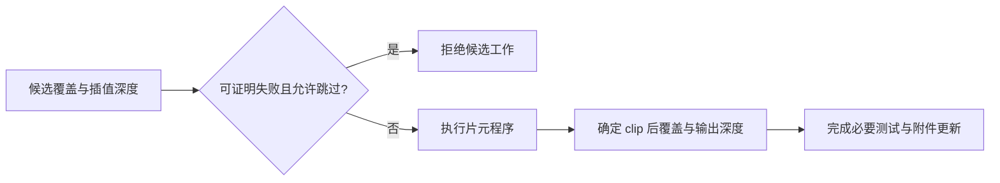

# C01｜Early-Z、Late-Z 与层次化深度

> **核心问题：一个最终被挡住的片元，是否已经执行了昂贵的着色？**
> 
> 深度状态规定可见结果；GPU 在不破坏这些结果及可观察副作用的前提下，可能提前排除工作。**提前比较、提前拒绝、提前写入深度是三件事。** 仅看到 `ZTest LEqual` 或 `clip()`，无法断言整次 Draw 的实际深度调度。

## 1. 范围与必要概念

本卡讨论普通光栅 Draw 的深度优化，不覆盖光线追踪。示例用于 Unity 6 / URP，采用普通 MeshRenderer；本地 API 依据 Unity 6.7 Beta / 6000.7、2026-06-26 构建文档。Graphics 源码固定为提交 `275a7f9ad9330e3cf7f3ea57a0b242a551fde291`，Core/URP 17.0.4；它不等同于本地 Editor 的实际安装包。

- **片元**：光栅化产生的待处理工作；不保证一份工作恰好对应一个最终像素。辅助 lane、MSAA 和执行粒度都可能改变计数。
- **深度附件**：保存已有表面深度的资源。深度测试比较候选深度与其中的值；`ZWrite` 决定通过后的深度更新。
- **Early-Z / Late-Z**：描述深度相关操作位于片元着色之前或之后。资料中的 “Early-Z” 有时指测试，有时指测试与更新，必须确认语境。
- **Hi-Z（层次化深度）**：用一片区域的保守摘要，批量证明候选工作不可见。它不是简单把深度图当颜色做平均 Mip。

Unity 的 `ZTest LEqual` 表达通常的近处遮挡远处意图；不要直接把本文普通深度的数值不等式照抄到 Reversed-Z 的原始深度上。

## 2. 先区分三件事

| 动作 | 问题 | 能节约什么 |
| --- | --- | --- |
| 提前测试 | 用当前可知的深度比较，结果能否确定？ | 为后续决策提供依据 |
| 提前拒绝 | 是否能跳过这份片元着色工作？ | 可能减少 ALU、纹理访问和输出工作 |
| 提前更新 | 是否能把候选深度写入附件？ | 提早建立后续遮挡；但必须保证覆盖语义正确 |

例如普通深度下已有值 `0.2`，候选插值深度 `0.8`，比较为 `LEqual`。若着色器不会改深度，也没有必须执行的副作用，候选必败，提前拒绝有依据。

现在候选深度变为 `0.1`，但 Shader 会执行 `clip(alpha - cutoff)`。即使提前知道深度能通过，也不能按普通逻辑先把 `0.1` 当作有效遮挡写进去，再随意丢弃片元：被剪掉的洞本应露出后面物体。这解释了为什么“允许提前拒绝”不自动推出“允许提前提交所有深度更新”。



这是解释语义的教学图，不是所有 GPU 的固定硬件连线。GPU 可以采用多个测试点、重放、区域级筛选等实现。

## 3. 哪些特性让证明变难

| 特性 | 为什么影响优化 | 不应得出的结论 |
| --- | --- | --- |
| `clip` / discard | 覆盖结果依赖着色器 | “所有硬件上一切提前拒绝都关闭” |
| 任意 `SV_Depth` 输出 | 最终深度可能不同于光栅化深度 | “仍可无条件拿插值深度判死” |
| UAV 写入、原子操作等副作用 | 跳过着色可能改变可观察的数据 | “原子计数能无扰动测出原程序调用数” |
| Alpha 混合 | 输出通常依赖目标颜色，影响覆盖消除等优化 | “透明片元绝不接受已有不透明深度的提前拒绝” |
| `ZWrite Off` | 不建立新的深度遮挡 | “关闭了深度比较” |

`SV_DepthGreaterEqual` / `SV_DepthLessEqual` 是带约束的深度输出语义，可为优化提供额外信息；约束针对数值大小，使用 Reversed-Z 时要重新判断方向。它们的可用性与后端能力有关。[Microsoft HLSL 语义](https://learn.microsoft.com/en-us/windows/win32/direct3dhlsl/dx-graphics-hlsl-semantics)

`[earlydepthstencil]` 是显式要求，不是一个可以无脑加入所有 Shader 的性能开关。强制提前测试/更新可能改变 discard 与副作用之间的可见关系；本卡实验不使用它。[Microsoft earlydepthstencil](https://learn.microsoft.com/en-us/windows/win32/direct3dhlsl/sm5-attributes-earlydepthstencil)

硬件优化也在变化。例如 Arm 对 Immortalis-G925 的说明介绍了硬件 fragment pre-pass，并讨论其与 late-Z、副作用的关系。不能据此宣称所有 Mali 或桌面 GPU 都采用同样实现；这种硬件机制也不等于应用额外提交的 Depth Prepass。[Arm G925 架构说明](https://developer.arm.com/community/arm-community-blogs/b/mobile-graphics-and-gaming-blog/posts/immortalis-g925-the-fragment-prepass)

## 4. Hi-Z 的关键是保守性，不是平均值

以下仅用区域内深度区间说明充分条件，不假定真实硬件摘要格式、区域大小或层数。

普通深度、`LEqual`：某区域所有已有深度位于 `[0.2, 0.4]`，候选在区域内的最小深度为 `0.6`。因为所有候选都大于所有已有深度，可以整块拒绝。若候选最小深度为 `0.3`，摘要不足以证明全败，需要更细检查。

Reversed-Z、原始数值 `GreaterEqual`：已有深度位于 `[0.6, 0.8]`，候选最大深度为 `0.4`，同样能证明全败。等号必须与实际比较函数对应，不能把 `Greater` 和 `GreaterEqual` 混为一谈。

**平均深度反例：** 两个已有样本分别为 `0.2`、`0.9`，平均为 `0.55`。候选深度 `0.6` 对第一个失败，却对第二个通过。如果用 `0.6 > 0.55` 判整块失败，就误删了可见表面。

区域中没有被几何覆盖的位置、清除值及摘要有效性也必须被正确处理。应用生成的 `_CameraDepthTexture`、自行构造的深度金字塔与 GPU 内部 Hi-Z 元数据是不同资源和机制，不能仅凭名字互换。

## 5. Unity 源码告诉我们什么

固定提交的 URP `DepthOnlyPass.hlsl` 中，`DepthOnlyVertex` 生成裁剪位置；启用 `_ALPHATEST_ON` 时传递 UV，`DepthOnlyFragment` 采样 Alpha 并调用裁剪逻辑，然后返回 `input.positionCS.z`。

这里有两个非常容易看错的点：

1. DepthOnly 仍可能执行纹理采样和 Alpha 测试，不能理解成“完全没有片元成本”。
2. 该返回值的语义是 `SV_TARGET`，**返回一个形似深度的数值并不等于声明 `SV_Depth`**。深度附件写入还由光栅化深度和 Pass 状态决定，必须继续看使用它的 ShaderLab Pass。

来源：[固定提交 DepthOnlyPass.hlsl](https://github.com/Unity-Technologies/Graphics/blob/275a7f9ad9330e3cf7f3ea57a0b242a551fde291/Packages/com.unity.render-pipelines.universal/Shaders/DepthOnlyPass.hlsl)。公开 HLSL 能证明程序表达了哪些操作，不能证明驱动最终安排了哪些 Hi-Z 单元或周期。

**应用 Depth Prepass 的取舍：** 先提交深度，再提交昂贵着色，可能减少后者的遮挡浪费，但会增加 Draw、顶点变换、光栅化及资源访问。裁剪阈值、蒙皮、顶点动画、LOD 和投影必须与主 Pass 一致；严格 `Equal` 还要求深度结果匹配。是否划算要看遮挡率、片元成本、几何成本和目标 GPU，不能仅凭“两遍”或“提前深度”下结论。

## 6. Unity 实验：三种程序与一个遮挡物

保存为 `C01EarlyDepthLab.shader`，也可复制 [独立 Shader](../实验/C01EarlyDepthLab.shader)。场景需安装 URP；本实验没有 DepthOnly、阴影或运动矢量 Pass，不应直接作为生产角色材质。

```c
Shader "Encyclopedia/C01EarlyDepthLab"
{
    Properties
    {
        [KeywordEnum(Opaque,Clip,Depth)] _Variant("Variant",Float)=0
        _Cutoff("UV Clip Threshold",Range(0,1))=0.5
        _Seed("Work Seed",Float)=0.37
        _RawDepthOffset("Raw Depth Offset",Range(-0.01,0.01))=0
    }
    SubShader
    {
        Tags { "RenderPipeline"="UniversalPipeline" "Queue"="Geometry" }
        Pass
        {
            Tags { "LightMode"="SRPDefaultUnlit" }
            Cull Off ZWrite On ZTest LEqual Blend Off
            HLSLPROGRAM
            #pragma target 3.5
            #pragma vertex Vert
            #pragma fragment Frag
            #pragma shader_feature_local _VARIANT_OPAQUE _VARIANT_CLIP _VARIANT_DEPTH
            #include "Packages/com.unity.render-pipelines.universal/ShaderLibrary/Core.hlsl"
            CBUFFER_START(UnityPerMaterial)
                float _Variant, _Cutoff, _Seed, _RawDepthOffset;
            CBUFFER_END
            struct Attributes { float3 positionOS:POSITION; float2 uv:TEXCOORD0; };
            struct Varyings { float4 positionCS:SV_POSITION; float2 uv:TEXCOORD0; };
            struct Output
            {
                float4 color:SV_Target;
                #if defined(_VARIANT_DEPTH)
                    float depth:SV_Depth;
                #endif
            };
            Varyings Vert(Attributes input)
            {
                Varyings o;
                o.positionCS=TransformObjectToHClip(input.positionOS);
                o.uv=input.uv;
                return o;
            }
            Output Frag(Varyings input)
            {
                #if defined(_VARIANT_CLIP)
                    clip(input.uv.x-_Cutoff);
                #endif
                float v=input.uv.x+input.uv.y+_Seed;
                [unroll] for(int i=0;i<24;i++)
                    v=frac(v*1.371+0.173);
                Output o;
                o.color=float4(v,0.25+0.5*v,1-v,1);
                #if defined(_VARIANT_DEPTH)
                    o.depth=saturate(input.positionCS.z+_RawDepthOffset);
                #endif
                return o;
            }
            ENDHLSL
        }
    }
}
```

操作和预测：

1. 使用普通 URP Forward 单相机场景，关闭 Depth Priming、SSAO 和额外 Renderer Feature。建两个 Quad，保持不共面，一个在相机近处，一个在远处；近处覆盖远处大约 3/4。创建两个实验材质，先都设 Opaque。用材质 Inspector 的自定义 Render Queue 将近处设为 2000、远处设为 2001，在 Frame Debugger 确认顺序。
2. 暂时关闭后处理和相机 MSAA。先禁用近处 Quad 观察远处完整图案，再启用近处，预测远处被遮挡区域不再贡献最终颜色。**画面相同不能证明是否执行了片元程序。**
3. 只把远处 Variant 改为 Clip。其 UV.x 小于阈值的部分被删除；观察未遮挡区域的洞。比较 Clip 模式自己在“有/无遮挡物”时的情况，别把覆盖不同的模式直接当成公平性能对比。
4. 改为 Depth，先保持 Offset=0，再小幅修改。Offset 是原始深度值增量，非米；在 Reversed-Z 后端方向与普通深度相反。零偏移仍不保证编译结果保留任意深度输出，要检查抓帧中的实际程序。
5. 若要验证性能，固定相机、分辨率、顺序、平台和变体预热；使用对应 GPU 的计数器查看 early/late 测试、拒绝率或着色工作，并与 GPU 时间一起解释。源码循环 24 次不能直接换算成 GPU 指令数或毫秒。

排查：全粉色先查 URP 包与 Shader 编译；没有预期裁剪先查材质 Variant 与 UV；遮挡异常先查物体真实前后位置、队列和实际 Pass；时间无变化先确认场景是否受片元着色限制。不要用新增 UAV 原子计数替代原程序而忽略它对调度的影响。

## 7. NPR 中的直接用途

头发卡片的 Alpha 裁剪、重叠反壳描边、复杂 Ramp/高光片元程序都会受遮挡工作影响。先保证深度和裁剪正确，再衡量是否需要专用深度 Pass。给头发增加预通道却漏掉裁剪，会使透明洞写实心深度；主 Pass 再漂亮也会产生错误遮挡。

## 8. 自测与答案

1. **ZWrite Off 是否禁止 Early-Z？** 不必然。仍可用已存在的深度拒绝候选，但本 Draw 不建立新的深度遮挡。
2. **带 clip 就必须着色全部被遮挡片元吗？** 不能如此推断；提前拒绝、覆盖确定和深度更新可能分离，具体实现依硬件和程序而定。
3. **把深度图缩小取平均能否直接当保守 Hi-Z？** 不能。`0.2/0.9` 与候选 `0.6` 已构成误删反例。
4. **URP DepthOnlyFragment 返回 z，是否证明写 SV_Depth？** 否，必须看输出语义；该源码是 `SV_TARGET`。

记住：状态决定语义，优化需要证明；Hi-Z 必须保守；预通道需要覆盖一致；性能结论必须有目标设备证据。

## 9. 核验范围与继续阅读

已核对本地深度状态文档、固定提交源码及上述厂商资料；例子数值为教学推导。未运行 Unity 编译、GPU 抓帧或计数器测量。文中预期不是实测报告。

本地文档根目录为 `E:\Claude Skills\学习仓库\09_Unity官方文档\Documentation\en`，相关页面为 `Manual/SL-ZTest.html`、`Manual/SL-ZWrite.html`。

前一张：[B08 Stencil](../02-Shader执行与几何/B08-Stencil模板测试与操作.md)。下一张：[C02 混合、预乘 Alpha 与透明排序](C02-混合预乘Alpha与透明排序.md)。
