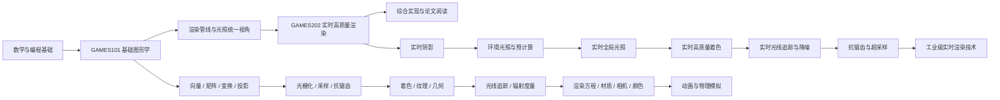

# 图形学学习路线：Games101 → Games202

> [!abstract] 总目标
> 先用 GAMES101 建立计算机图形学的共同语言，再用 GAMES202 理解现代实时渲染如何在有限帧时间内逼近高质量结果。最终应当能够解释一张图像从场景表示到最终像素的生成过程，并能独立实现、比较和分析主要算法。

> [!note] 这张路线图的范围
> 本页只整理 GAMES101 与 GAMES202 的课程理论、数学、算法、作业实践和复习方法，不展开任何具体游戏引擎、引擎 API 或工程工具。课程之外的实现语言可以使用 C++、WebGL、OpenGL 或其他图形 API，但实现的重点始终是验证算法本身。

## 一、总览思维导图



### 一句话理解两门课的关系

```text
GAMES101：图像是怎样从三维场景和光照模型中产生的？
GAMES202：在实时速度限制下，怎样用预计算、近似、采样和时空复用得到高质量图像？
```

### 推荐总顺序

```text
线性代数与微积分
  → 坐标系、变换与投影
  → 光栅化与采样
  → 着色与纹理
  → 几何表示
  → 光线追踪
  → 辐射度量与渲染方程
  → 材质与相机
  → 实时阴影
  → 环境光照与预计算
  → 实时全局光照
  → PBR 与高质量着色
  → 实时光追、时空重建与降噪
  → 抗锯齿、超采样与工业管线
```

> [!tip] 最重要的学习视角
> 遇到任何一个渲染算法，先问五个问题：**它要解决什么问题？输入数据是什么？它在哪个空间或阶段工作？它用什么近似替代了昂贵计算？它的误差、失败模式和计算成本是什么？**

## 二、学习方法：理论、实现、验证三线并行

| 主线 | 解决的问题 | 建议产出 |
| --- | --- | --- |
| 理论线 | 为什么这样计算？公式中的量表示什么？ | 定义、推导、几何直觉、适用边界 |
| 实现线 | 如何把算法变成可运行程序？ | 最小实现、可视化中间结果、作业代码 |
| 验证线 | 怎样知道实现是对的？为什么会失败？ | 预测、对比实验、截图、数值和反例 |

> [!warning] “看过”不等于“学会”
> 建议将每个知识点标记为：**已阅读**、**已实现**、**已验证**、**已迁移**。只有能够先预测修改结果，再用实验解释结果，才算真正掌握。

### 每个知识点的固定笔记模板

1. **问题**：它解决什么视觉或计算问题？
2. **直觉**：用图形、光线或数据流说明。
3. **定义与公式**：注明每个变量、单位和约定。
4. **最小实现**：只保留验证核心机制所需的代码。
5. **预测**：修改一个参数之前，写出预期现象。
6. **观察与反例**：记录实际结果，以及什么情况会失效。
7. **复杂度与质量**：计算量、内存、采样数、误差和稳定性。
8. **相关链接**：链接到前置概念、后续应用和相关作业。

## 三、阶段 0：数学与编程基础

### 0A. 线性代数

- 向量、点、方向、法线。
- 长度、归一化、点积、叉积。
- 矩阵乘法、线性变换、逆矩阵和转置。
- 基、坐标表示、齐次坐标。
- 特征值和特征向量只需先理解几何意义，按后续需要深入。

核心点积关系：

$$
\mathbf a\cdot\mathbf b=\|\mathbf a\|\|\mathbf b\|\cos\theta
$$

### 0B. 微积分与概率

- 导数：变化率、切线和局部近似。
- 偏导：多变量函数沿某个方向的变化。
- 积分：累积量和连续域求和。
- 概率密度、期望、方差、随机变量。
- 蒙特卡洛估计：用随机样本估计积分。

蒙特卡洛积分的简化形式：

$$
\int f(x)\,dx\approx\frac{1}{N}\sum_{i=1}^{N}\frac{f(X_i)}{p(X_i)}
$$

其中 $X_i$ 来自概率密度 $p(x)$。后续学习重要性采样时，要理解为什么选择更合适的 $p(x)$ 能降低方差。

### 0C. 编程基础

- 数组、循环、函数、结构体、指针或引用。
- 图像缓冲区、颜色格式、坐标索引。
- 文件读写、调试断点、断言、单元测试。
- C++ 基础；可补充 WebGL/JavaScript 或其他图形 API。

### 阶段检查点 0

- [ ] 能用自己的话解释点、向量、法线的区别。
- [ ] 能手算简单的矩阵乘法和点积/叉积。
- [ ] 能解释积分、采样、均值和方差的关系。
- [ ] 能创建一个图像缓冲区并输出简单图形。

## 四、阶段 1：GAMES101——基础图形学主线

GAMES101 的主问题是：**三维对象、相机、光源和材质如何经过几何变换、可见性判断与光照计算，生成二维图像？**

### 1A. 第 1–4 讲：变换与投影

**知识节点：**

- 图形学中的向量和矩阵。
- 模型变换、视图变换、投影变换。
- 齐次坐标。
- 正交投影和透视投影。
- 观察空间、裁剪空间、NDC 和屏幕空间。

顶点从模型空间到裁剪空间的常见表达：

$$
p_{clip}=P\,V\,M\,p_{model}
$$

透视除法：

$$
p_{ndc}=\frac{p_{clip}}{w_{clip}}
$$

**必须回答：**

- 为什么平移需要齐次坐标？
- 为什么矩阵乘法顺序会改变结果？
- 为什么透视投影会产生近大远小？
- 为什么不能把不同坐标空间的向量直接点乘？
- 点、方向和法线经过变换时分别有什么不同？

**最小实现：** 写一个矩阵变换可视化程序，用同一个三维点依次显示模型、世界、观察和屏幕坐标；分别测试平移、旋转、缩放和透视投影。

**过关标准：** 看到一个向量变量时，能够说清楚它的空间、方向、是否需要归一化，以及下一步会参与什么计算。

> [!question]- 自测：为什么法线不能总是直接乘模型矩阵？
> 非均匀缩放会改变切向量之间的夹角。若法线直接乘模型矩阵，结果可能不再垂直于变换后的表面。一般需要使用线性变换部分的逆转置，再将结果归一化。

### 1B. 第 5–6 讲：光栅化与抗锯齿

**知识节点：**

- 三角形光栅化。
- 采样点与像素覆盖。
- 深度缓冲。
- 走样、超采样和抗锯齿。

**必须回答：**

- 为什么三角形适合做基本图元？
- 一个像素如何判断是否被三角形覆盖？
- 深度测试解决了什么问题？
- 为什么高频几何边缘会产生锯齿？
- 为什么增加采样数可以改善边缘，却不能自动修复所有纹理闪烁？

**最小实现：** 实现一个带深度缓冲的三角形光栅化器；使用不同采样位置和不同采样数量比较边缘结果。

**过关标准：** 能区分几何覆盖问题、纹理频率问题、深度冲突问题和时间稳定性问题。

### 1C. 第 7–9 讲：着色、纹理与图形管线

**知识节点：**

- Blinn–Phong 光照模型。
- 顶点着色、逐三角形着色、逐像素着色。
- 重心坐标和属性插值。
- 透视正确插值。
- 纹理采样、纹理过滤、Mipmap 和各向异性过滤。
- 顶点处理、光栅化、片元处理和深度测试。

Lambert 漫反射的基本形式：

$$
L_d=k_d\,I\,\max(0,\mathbf n\cdot\mathbf l)
$$

**必须回答：**

- 顶点属性在哪一步变成片元属性？
- 为什么透视投影下不能简单地对属性做普通线性插值？
- Mipmap 为什么能减少远处纹理的闪烁？
- 纹理过滤是在解决重建问题、采样问题，还是几何问题？

**最小实现：** 实现或观察一个带 UV 的三角形，分别切换点采样、双线性过滤和 Mipmap；显示插值前后的 UV 与颜色。

**过关标准：** 能解释一张纹理从内存到最终像素的基本过程，并能指出采样不足时的视觉表现。

### 1D. 第 10–12 讲：几何表示、曲线曲面与网格

**知识节点：**

- 显式、隐式、参数化几何表示。
- Bézier 曲线与曲面。
- de Casteljau 算法。
- 网格、顶点、边、面和拓扑连接。
- 网格细分、简化、法线和切线。

**必须回答：**

- 什么时候适合用参数曲线，什么时候适合用三角网格？
- 控制点怎样影响 Bézier 曲线？
- 为什么一个几何位置可能需要多个渲染顶点？
- 硬边、平滑法线和 UV 接缝为什么影响最终着色？

**最小实现：** 实现 Bézier 曲线采样；再使用低模网格比较面法线、顶点法线和平滑法线。

**过关标准：** 能把形状、拓扑、几何顶点和渲染顶点区分开。

### 1E. 第 13–16 讲：光线追踪

**知识节点：**

- 光线模型。
- 光线与平面、三角形、球体的求交。
- Whitted 光线追踪。
- 递归反射与折射。
- 光线追踪加速结构。
- 包围盒、层次结构和求交效率。

**必须回答：**

- 光栅化和光线追踪分别从什么角度解决可见性问题？
- 一条光线如何找到最近的可见交点？
- 为什么朴素地遍历所有三角形会很慢？
- BVH 的层次结构怎样减少无效求交？

**最小实现：** 先实现球体和三角形求交，再实现 Whitted 光线追踪，最后加入 BVH 并比较求交次数和运行时间。

**过关标准：** 能解释“生成一条光线 → 找交点 → 判断可见性 → 计算局部光照 → 递归反射/折射”的完整链路。

### 1F. 第 16–18 讲：辐射度量、渲染方程与材质

**知识节点：**

- 辐射能量、辐射通量、辐射强度、辐照度、辐射亮度。
- 立体角和余弦项。
- BRDF 与材质反射。
- 渲染方程。
- 蒙特卡洛路径追踪。
- 重要性采样和噪声。

渲染方程：

$$
L_o(x,\omega_o)=L_e(x,\omega_o)+\int_{\Omega}f_r(x,\omega_i,\omega_o)L_i(x,\omega_i)\cos\theta_i\,d\omega_i
$$

**必须回答：**

- 为什么渲染方程是一个半球积分？
- $L_i$、$f_r$、$\cos\theta_i$ 分别代表什么？
- 直接光照和间接光照在公式中如何体现？
- 为什么路径追踪样本少时会有噪声？
- 重要性采样为什么能够降低方差？

**最小实现：** 实现一个简单的蒙特卡洛积分；再实现漫反射路径追踪，比较样本数量、采样分布和图像噪声。

**过关标准：** 能把后续 Games202 的阴影、环境光照、全局光照、PBR 和实时光追放回渲染方程中解释。

### 1G. 第 19–22 讲：相机、颜色、动画与模拟

**优先学习：** 相机模型、镜头、HDR、颜色感知和颜色空间。

**按需深入：** 关键帧、运动学、绑定、粒子、刚体、流体和数值积分。

**必须回答：**

- 相机、视野、景深和透视之间是什么关系？
- 线性颜色和 sRGB 编码有什么区别？
- HDR 数值为什么需要 Tone Mapping 才能显示？
- 运动和数值积分为什么会影响后续的时间重建？

### 阶段检查点 1：能够解释一张图像的基础生成过程

- [ ] 能从模型空间追踪到屏幕空间。
- [ ] 能解释三角形覆盖、属性插值和深度测试。
- [ ] 能实现或解释纹理采样与 Mipmap。
- [ ] 能实现一个基础光栅化器。
- [ ] 能实现一个基础光线追踪器或完成相应课程作业。
- [ ] 能写出渲染方程，并解释各项的物理意义。
- [ ] 能区分直接光照、间接光照、材质响应和可见性。

> [!info] 本地 GAMES101 笔记入口
> 本地已有的课程导图包含第 1–22 讲的课件导航：[[Games101学习笔记/学习导图/GAMES101学习导图]]。坐标、向量、投影和变换顺序的疑问可从 [[Games101学习笔记/FAQ/FAQ索引]] 开始复习。

## 五、阶段 2：桥接——从 GAMES101 到 GAMES202

进入 Games202 之前，需要把“图像生成过程”转换为“实时预算下的数据流和近似”。

### 2.1 三个统一视角

| 视角 | 核心问题 | 后续连接 |
| --- | --- | --- |
| 光照视角 | 哪些光线传输被保留、近似或预计算？ | 阴影、IBL、GI、PBR |
| 采样视角 | 从连续函数到有限样本，误差和方差如何产生？ | 软阴影、路径追踪、抗锯齿 |
| 时空视角 | 如何复用邻域和历史帧的信息？ | TAA、时空降噪、实时光追 |

### 2.2 实时渲染的预算思维

实时渲染不是简单地“减少代码”，而是在有限时间内分配预算：

- 空间预算：分辨率、纹理尺寸、Shadow Map 尺寸、体素或探针数量。
- 时间预算：每帧可用时间、历史帧数量、更新频率。
- 采样预算：每像素样本数、过滤半径、光源采样数量。
- 计算预算：求交、着色、光栅化、后处理和重建的总成本。
- 存储预算：深度、法线、颜色、历史缓冲和中间结果。

> [!question]- 桥接自测
> 一个方法如果更快，究竟是减少了样本、降低了空间分辨率、进行了预计算、复用了历史信息，还是改变了数据结构？它牺牲的是准确性、动态性、稳定性，还是内存？

### 阶段检查点 2

- [ ] 能把一个渲染算法写成“输入 → 处理 → 输出 → 成本 → 失败模式”。
- [ ] 能区分空间近似、时间近似、预计算和统计估计。
- [ ] 能解释实时算法为什么通常需要调试图、误差图或有效性遮罩。
- [ ] 能针对一个性能问题提出多个可证伪的假设。

## 六、阶段 3：GAMES202——实时高质量渲染主线

Games202 的主问题是：**在实时帧预算内，如何用预计算、空间近似、时间复用和更适合的采样策略，获得接近高质量离线渲染的结果？**

下面按知识依赖将课程主题合并为七个模块。不同年份的课件可能调整讲次顺序，学习时以手上的课程资料为准。

### 3A. 实时渲染概述与基础回顾

**主题：** 实时渲染目标、渲染管线、着色语言、渲染方程、微积分与实时/离线质量差异。

**必须理解：**

- 实时渲染中的帧时间和质量目标。
- 光栅化、光线追踪和混合方法的基本取舍。
- 一个算法的质量、速度、内存和稳定性不能只看其中一项。
- 课程后续所有技术都在回答“如何近似渲染方程或可见性”。

### 3B. 实时阴影

**主题：** Shadow Mapping、VSM、Moment Shadow Maps、PCF、PCSS、SDF Shadows。

**核心思想：** 从光源视角记录深度，再从接收点比较光源空间中的深度，以近似判断是否被遮挡。

简化的硬阴影判断：

$$
V(x)=\begin{cases}1,&d_{receiver}(x)\le d_{shadow}(x)+\epsilon\\0,&\text{otherwise}\end{cases}
$$

**必须理解：**

- 阴影贴图分辨率、深度精度、Bias、过滤核和级联划分分别影响什么。
- Shadow Acne、Peter Panning、锯齿、漏光和级联跳变不是同一个问题。
- PCF 是对比较结果做空间平均；PCSS 还尝试估计半影范围。
- VSM/Moment Shadow Maps 将深度比较转化为统计量估计，但会引入漏光等误差。

**实践任务：** 实现硬阴影 → PCF → PCSS 的递进版本，分别记录分辨率、采样数、过滤半径和误差变化。

### 3C. 实时环境光照与预计算

**主题：** Prefiltering、Split Sum、Precomputed Radiance Transfer、Light Baking。

**核心思想：** 将部分方向积分提前计算成预过滤环境图、查找表、低频基函数或烘焙数据，从而减少运行时计算。

镜面环境光的简化拆分：

$$
L_{specular}\approx PrefilteredEnv(R,\alpha)\cdot BRDFLUT(N\cdot V,\alpha)
$$

其中 $R$ 是反射方向，$\alpha$ 表示粗糙度。这个表达是实用近似，不是对渲染方程的逐方向精确求解。

**必须理解：**

- Cube Map、反射方向、粗糙度与 Mipmap/预过滤之间的联系。
- 为什么预过滤可以把昂贵积分转化为纹理查询。
- 预计算方法适合什么样的静态/慢变化场景。
- 预计算节省运行时成本的同时，为什么会限制动态光照和动态几何。

**实践任务：** 制作不同粗糙度和金属度的球体阵列；比较未预过滤环境、预过滤环境和 Split Sum 近似的效果与成本。

### 3D. 实时全局光照与屏幕空间方法

**主题：** RSM、VPL、LPV、VXGI、RTXGI、SSAO、SSDO、SSR。

按信息来源理解：

| 方法类别 | 使用的信息 | 优势 | 主要失败模式 |
| --- | --- | --- | --- |
| 屏幕空间 | 当前帧深度、法线、颜色 | 实现直接、运行较快 | 屏幕外缺失、边缘断裂、遮挡错误 |
| 3D 空间 | 体素、探针、光照体积 | 覆盖更广空间 | 分辨率、更新和存储成本 |
| 预计算 | 烘焙结果、低频表示 | 运行时便宜 | 动态对象和动态光照受限 |

**必须理解：**

- SSAO 是遮蔽近似，不等于完整的间接光照。
- SSR 是屏幕空间反射，无法直接恢复屏幕外信息。
- RSM/VPL、LPV、VXGI 等方法在间接光传播表示上做了不同近似。
- 任何屏幕空间方法都应该明确处理越界、无效命中和信息缺失。

**实践任务：** 实现一个屏幕空间遮蔽或反射算法，并分别可视化深度、法线、射线、命中点、越界区域和最终结果。

### 3E. 实时高质量着色与 PBR

**主题：** Disney Principled BRDF、Microfacet Model、GGX、Multiple Bounce Approximation、LTC、参与介质、皮肤和头发等复杂材质。

Microfacet BRDF 的常见形式：

$$
f_r(\mathbf l,\mathbf v)=\frac{D(\mathbf h)F(\mathbf v,\mathbf h)G(\mathbf l,\mathbf v)}{4(N\cdot L)(N\cdot V)}
$$

其中 $D$ 描述微表面法线分布，$F$ 描述 Fresnel，$G$ 描述几何遮挡和阴影。

**必须理解：**

- 粗糙度改变的是微表面方向分布和高光扩散，不只是简单降低亮度。
- 金属与非金属的反射和漫反射能量分配不同。
- GGX 是一种法线分布模型，必须结合 Fresnel 和几何项理解。
- Multiple Bounce、LTC、查找表和近似积分分别在解决什么问题。
- 复杂材质需要考虑次表面散射、参与介质、头发等额外光传输现象。

**实践任务：** 依次实现 Lambert、Blinn–Phong、Cook–Torrance/GGX，并为每种模型显示中间量与误差对比。

### 3F. 实时光线追踪、时空重建与降噪

**主题：** Backprojection、Motion Vector、Temporal Accumulation、Joint Bilateral Filtering、SVGF、RAE。

**核心问题：** 实时光追的每帧样本很少，如何从当前帧、邻域和历史帧重建稳定结果？

简化的时间累积：

$$
C_t=(1-\alpha)C_{current}+\alpha C_{history}
$$

完整方法还需要历史重投影、有效性判断、深度/法线约束、样本夹取、空间滤波和运动处理。

**必须理解：**

- Motion Vector 提供历史样本回到当前像素的坐标依据。
- 历史累积可以降低噪声，但会传播错误并产生拖影。
- Joint Bilateral Filter 使用深度、法线等边缘信息保护几何边界。
- SVGF 等方法将方差估计、时空滤波和重建结合起来。
- 运动、遮挡变化、反射物体和高频光照是时空重建的难点。

**实践任务：** 对比单帧低采样、空间滤波、时间累积和时空滤波；测试静止、相机运动、物体运动和遮挡变化四种情况。

### 3G. 实时抗锯齿、超采样与工业技术

**主题：** TAA、SMAA、超采样、重建、Cascaded Shading、Tiled/Deferred Shading、Particles 和实时渲染管线。

按误差来源区分：

| 方法 | 主要处理的问题 | 典型代价或失败模式 |
| --- | --- | --- |
| MSAA | 几何覆盖边缘 | 内存和带宽增加，不能解决所有着色高频 |
| Mipmap/纹理过滤 | 纹理采样频率不足 | 细节变软或产生预过滤误差 |
| FXAA/SMAA | 当前帧图像边缘 | 可能模糊，依赖边缘检测 |
| TAA | 时间上的采样不足与闪烁 | 拖影、鬼影、历史污染 |
| 超采样/重建 | 低分辨率输入的高分辨率恢复 | 需要稳定运动信息和高质量重建 |

**必须理解：**

- 没有一种抗锯齿方法可以修复所有类型的高频问题。
- TAA 依赖抖动采样、正确重投影、历史有效性和适当的权重。
- Forward、Deferred、Tiled/Clustered 等方案改变的是光源组织和计算分布。
- 工业级技术的核心是围绕帧预算组织数据和计算，而不是单纯追求理论精确。

**实践任务：** 对几何边缘、纹理细线、阴影边缘和运动物体分别测试不同抗锯齿方案，记录清晰度、稳定性和成本。

### 阶段检查点 3：能够解释实时渲染中的取舍

- [ ] 能实现或完整解释一种实时阴影算法。
- [ ] 能解释环境光照预过滤与 Split Sum。
- [ ] 能区分 SSAO、SSDO、SSR、RSM、LPV、VXGI 和预计算方法的输入与边界。
- [ ] 能实现基础 GGX，并解释 $D$、$F$、$G$ 三项。
- [ ] 能解释时间累积、运动矢量和联合双边滤波。
- [ ] 能针对不同走样来源选择抗锯齿方案。
- [ ] 能用测量结果描述一个方法的质量、成本和失败模式。

## 七、阶段 4：课程作业与综合实现

### 4.1 GAMES101 建议实践顺序

1. 向量、矩阵和变换可视化。
2. 三角形光栅化与深度测试。
3. 透视正确插值与纹理采样。
4. Bézier 曲线/曲面和网格处理。
5. 光线与基本几何求交。
6. BVH 加速结构。
7. Whitted 光线追踪。
8. 路径追踪与蒙特卡洛采样。

### 4.2 GAMES202 建议实践顺序

1. Shadow Mapping 与 PCF。
2. PCSS 或其他软阴影近似。
3. 环境光照预过滤与 BRDF LUT。
4. SSAO/SSDO 或 SSR。
5. PBR、Microfacet 和 GGX。
6. 时空滤波与实时光追重建。
7. TAA/SMAA/超采样对比。
8. 选一种工业级光照组织或渲染管线技术进行分析。

### 4.3 综合项目：小型实时渲染器

以一个可控的小场景为载体，逐步加入：

- 三角形光栅化和深度缓冲。
- 基础材质与纹理。
- Shadow Mapping。
- PBR 和环境光照。
- 一个屏幕空间效果。
- 一个时空累积或抗锯齿方法。
- 统一的调试视图、参数面板和性能记录。

最终报告至少回答：

- 算法输入和输出是什么？
- 哪些计算是精确的，哪些计算是近似的？
- 近似造成了什么误差？
- 场景、相机、光源或分辨率改变时，结果是否稳定？
- 时间、空间、采样和存储成本分别是多少？
- 如果继续优化，最值得改变的瓶颈是什么？

> [!success] 最终验收标准
> 不以“截图看起来漂亮”为唯一标准。应当能够展示最终图像、关键中间缓冲、错误案例、参数对比、性能数据和算法解释，并能把每个现象追溯到公式或渲染阶段。

## 八、公式与符号速查

### 坐标变换

$$
p_{clip}=P\,V\,M\,p_{model},\qquad p_{ndc}=p_{clip}/w_{clip}
$$

### 点积与夹角

$$
\mathbf a\cdot\mathbf b=\|\mathbf a\|\|\mathbf b\|\cos\theta
$$

### Lambert 漫反射

$$
L_d=k_d\,I\,\max(0,N\cdot L)
$$

### 渲染方程

$$
L_o=L_e+\int_{\Omega}f_r\,L_i\,\cos\theta_i\,d\omega_i
$$

### Microfacet BRDF

$$
f_r=\frac{D\,F\,G}{4(N\cdot L)(N\cdot V)}
$$

### 时间累积

$$
C_t=(1-\alpha)C_{current}+\alpha C_{history}
$$

> [!warning] 公式阅读提醒
> 同一个符号在不同课件或论文中可能有不同约定，尤其是粗糙度、$\alpha$、法线分布和颜色空间。抄写公式时，同时记录变量含义、取值范围、概率密度或归一化约定。

## 九、常见误区

- 把点、方向、法线和颜色都当成普通的三维向量处理。
- 把不同坐标空间中的向量直接点乘或相加。
- 忽略透视除法和 $w$，把裁剪空间误认为屏幕空间。
- 把点积的结果直接等同于完整光照模型。
- 把 Shadow Map 分辨率提高当成解决所有阴影错误的方法。
- 把 SSAO 或 SSR 等屏幕空间方法当成完整的全局光照。
- 只增加采样数量，不分析采样分布和方差。
- 认为预计算结果可以自然适应任意动态场景。
- 认为时间累积权重越大，画面就一定越稳定。
- 用 Draw 数或单一帧时间代表全部性能，而不分析瓶颈来源。
- 只看最终图像，不检查中间缓冲、误差图和失败案例。
- 只完成课程视频，不完成最小实现和反例实验。

## 十、当前学习进度

> [!note] 使用方式
> 将状态改为“进行中 / 已阅读 / 已实现 / 已验证 / 已迁移”，并在“下一步”中写下具体讲次、作业或问题。状态只记录个人掌握程度。

| 阶段 | 状态 | 下一步 |
| --- | --- | --- |
| 阶段 0：数学与编程基础 | 未开始 | 复习向量、矩阵、积分和图像缓冲区 |
| 阶段 1：GAMES101 | 未开始 | 从第 1–4 讲的变换与投影开始 |
| 阶段 2：桥接 | 未开始 | 用“输入—阶段—输出—成本”描述一个算法 |
| 阶段 3：GAMES202 | 未开始 | 从实时阴影和 Shadow Mapping 开始 |
| 阶段 4：综合实现 | 未开始 | 按课程作业顺序搭建小型渲染器 |

## 十一、资料入口

- [GAMES202 官方课程主页](https://sites.cs.ucsb.edu/~lingqi/teaching/games202.html)：课程简介、先修要求、课程大纲和课件入口。
- [GAMES202 中文课程页](https://games-cn.org/games202/)：课程定位、课程安排和资源链接。
- [[Games101学习笔记/学习导图/GAMES101学习导图]]：本地第 1–22 讲课件导航。
- [[Games101学习笔记/FAQ/FAQ索引]]：坐标、向量、投影和变换问题索引。

## 相关笔记

[[Games101学习笔记/学习导图/GAMES101学习导图]] · [[Games101学习笔记/FAQ/FAQ索引]]
