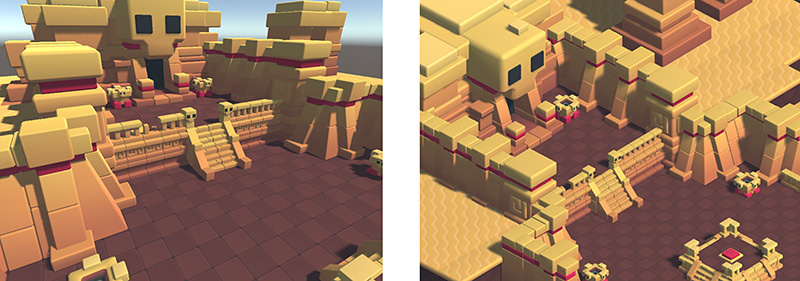

# 相机简介

> 原文：[Introduction to cameras](https://docs.unity3d.com/6000.7/Documentation/Manual/CamerasOverview.html)

电影使用相机把故事呈现给观众，Unity 中的 **Camera** 则负责把游戏世界呈现给玩家。

Unity Scene 表示三维空间中的 `GameObject`。由于观察者的屏幕是二维的，Unity 需要使用 Camera 捕获视图并将其“压平”后显示。

Camera 可以通过自定义、脚本或设置父子关系来实现几乎所有可以想象的效果：

- 解谜游戏可以让相机保持静止，以完整显示谜题。
- 第一人称射击游戏可以把相机设置为 Player 的子对象，并放在角色眼睛的高度。
- 赛车游戏通常让相机跟随 Player 的车辆。

通过自定义和操作 Camera，可以使游戏呈现出独特的视觉效果。一个 Scene 至少需要一台 Camera，但可以拥有任意数量的 Camera，没有数量上限。它们可以按任意顺序、在屏幕的任意位置渲染，也可以只渲染屏幕的某些部分。

在 Unity 中，向 GameObject 添加 [Camera Component](https://docs.unity3d.com/6000.7/Documentation/Manual/class-Camera.html) 即可创建相机。

*同一个 Scene 分别以 Perspective（左）和 Orthographic（右）模式显示。*

## Perspective 与 Orthographic 相机

现实世界中的 Camera，或者人眼，都会以一种让物体距离观察点越远、看起来越小的方式观察世界。这种常见的 **Perspective** 效果广泛用于艺术和计算机图形学，也是创建真实 Scene 的重要因素。Unity 支持 Perspective Camera；但是在某些场景中，你可能希望在没有这种效果的情况下渲染视图。例如，你可能希望创建一个不需要完全像真实世界物体一样显示的地图或信息面板。

不会因距离而缩小物体的 Camera 称为 **Orthographic** Camera，Unity Camera 也提供了对应选项。将 Camera 标记为 Orthographic 会移除 Camera 视图中的全部透视效果。这主要适合制作 Isometric 或 2D 游戏，也适合制作地图或信息显示。

Perspective 和 Orthographic 两种 Scene 观察模式称为 Camera **Projection**。

> 注意：在 Orthographic 模式下，Fog 会均匀渲染，可能不会呈现预期效果。Fog 的深度使用 Perspective space 中的 Z 坐标；这种实现虽然不完全符合 Orthographic 相机的几何意义，但可以带来渲染性能收益。

上方示例 Scene 来自 [BITGEM](https://www.assetstore.unity3d.com/en/#!/publisher/1299)。

## Render path

Unity 支持不同的 rendering path。你应根据游戏内容以及目标平台和硬件选择要使用的 rendering path。不同 rendering path 具有不同的功能和性能特征，主要影响 Light 和 Shadow。Project 使用的 rendering path 在 **Player** settings 中选择，也可以针对每个 Camera 覆盖设置。

更多信息请参阅 [Rendering Paths](https://docs.unity3d.com/6000.7/Documentation/Manual/RenderingPaths.html)。

## 相关资源

- [[10-URP中的相机/01-URP中的相机简介]]
- [[10-URP中的相机/02-相机渲染类型/00-相机渲染类型]]
- [[10-URP中的相机/04-相机渲染顺序]]
- [[10-URP中的相机/08-Camera Inspector窗口参考/00-Camera Inspector窗口参考]]
- [[11-Built-In Render Pipeline中的相机/02-Camera Inspector窗口参考]]

---

## 文档导航

- 上一页：[[00-相机]]
- 目录：[[00-相机]]
- 下一页：[[02-以第一人称控制相机]]
