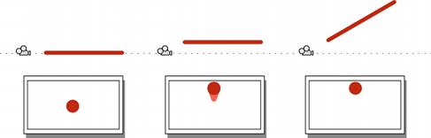
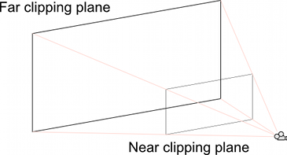

# 相机视图简介

> 原文：[Introduction to the camera view](https://docs.unity3d.com/6000.7/Documentation/Manual/UnderstandingFrustum.html)

Camera 能看到的内容由它的 Transform 和 Camera Component 决定：

- Transform 的 position 定义观察点。
- Transform 的 forward（Z）轴指向 view direction。
- Transform 的 upward（Y）轴指向屏幕顶部。
- Transform 的 rightward（X）轴指向屏幕右侧。

Camera Component 的设置定义 view 区域的大小和形状。设置完成后，Camera 会把当前“看到”的内容显示到屏幕上。GameObject 移动或旋转时，显示的 view 也会随之移动或旋转。

## 可见区域的形状

Perspective Camera 和 Orthographic Camera 都有可见距离上限。这个上限由垂直于 Camera forward（Z）方向的 plane 定义，称为 **far clipping plane**，因为距离 Camera 更远的物体会被“裁剪”（也就是排除在渲染之外）。距离 Camera 更近的位置还有对应的 **near clipping plane**；Camera 可见的距离范围位于这两个 plane 之间。

Orthographic Camera 不会因为距离改变物体大小，因此它的 viewing volume 是两个 clipping plane 之间延伸的 rectangular box。

使用 Perspective 时，物体会随着距离增加而缩小，所以可见 Scene 区域会随着距离扩大。Perspective Camera 的 viewing volume 不是 box，而是顶点位于 Camera position、底面位于 far clipping plane 的 pyramidal shape。不过它并不完全是 pyramid，因为顶部被 near clipping plane 截去；这种截头金字塔形状称为 **frustum**。由于其高度不是固定的，frustum 由 width 与 height 的比例（**aspect ratio**）以及顶点处上下边缘之间的角度（**field of view** 或 **FOV**）定义。

## View Frustum

Frustum 指顶部与底面平行、被截去顶部的实体形状。Perspective Camera 能看到并渲染的区域就是这种形状。

> [!NOTE]
> 默认情况下，Camera 会执行 **frustum culling**，排除所有不在 Camera view frustum 内的 Renderer。

下面的思维实验有助于解释原因。

把一根直杆（例如扫帚柄或铅笔）沿端面朝向 Camera 并拍照。若直杆位于画面中央且垂直于 Camera lens，画面中只能看到圆形端面，其他部分都会被遮挡。如果向上移动直杆，下侧会逐渐显现；同时将直杆向上倾斜，就可以再次隐藏下侧。继续向上移动并倾斜，圆形端面最终会到达画面顶部。此时，world space 中位于直杆轨迹上方的物体不会出现在图像中。

直杆也可以向左、向右或向下移动和旋转，或者进行这些方向的任意组合。隐藏直杆的角度仅取决于它相对于屏幕中心在两个轴上的距离。

这个思维实验说明：Camera 图像中的每个点都对应 world space 中的一条线，而沿这条线只有一个点能在图像中可见。该位置后方的所有内容都会被遮挡。

图像边缘由对应图像角点的发散线定义。将这些线向 Camera 方向反向延伸，最终会在一个点汇聚。在 Unity 中，该点正好位于 Camera 的 Transform position，称为 **center of perspective**。从 center of perspective 观察屏幕顶部中心和底部中心之间的夹角，就是 **field of view**（通常缩写为 **FOV**）。

如上所述，位于图像边缘发散线之外的内容不会被 Camera 看见；此外，Camera 还有两个渲染限制。near clipping plane 和 far clipping plane 平行于 Camera 的 XY plane，并分别沿其中心线设置在某个距离处。距离 Camera 小于 near clipping plane 或大于 far clipping plane 的内容都不会被渲染。

图像的发散角点线与两个 clipping plane 一起定义了截头金字塔，也就是 view frustum。

---

## 文档导航
- 上一页：[[00-相机视图]]
- 目录：[[00-相机视图]]
- 下一页：[[02-使相机透视变为斜视]]
