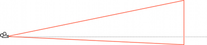

# 使相机透视变为斜视

> 原文：[Make the camera perspective oblique](https://docs.unity3d.com/6000.7/Documentation/Manual/ObliqueFrustum.html)

默认情况下，View Frustum 围绕 Camera 的 center line 对称排列，但它不一定必须对称。可以让 Frustum 变成 **oblique**，也就是让其中一侧与 center line 的夹角小于另一侧。

这样会让图像一侧的 Perspective 看起来更紧凑，产生观察者非常靠近该侧物体的感觉。例如在赛车游戏中压低 frustum 的 bottom edge，可以让观察者感觉更靠近道路，从而强化速度感。



## 设置 Frustum 倾斜度

> [!IMPORTANT]
> Built-In Render Pipeline 已弃用，并将在未来版本中移除。它会在整个 Unity 6.7 LTS 生命周期内继续获得支持，包括 Bug Fix 和维护。有关更多信息，请参阅[从 Built-In Render Pipeline 迁移到 Universal Render Pipeline](https://docs.unity3d.com/6000.7/Documentation/Manual/urp/upgrading-from-birp.html)和[Render Pipeline 功能对比](https://docs.unity3d.com/6000.7/Documentation/Manual/render-pipelines-feature-comparison.html)。

Camera Component 没有专门设置 Frustum Obliqueness 的函数，但可以通过以下任一方式实现：启用 Camera 的 Physical Camera properties 并应用 Lens Shift，或添加脚本修改 Camera 的 projection matrix。

> [!NOTE]
> 在 Built-In Render Pipeline 中，使用 oblique frustum 的 Camera 只能使用 Forward rendering path。如果 Camera 设置为 Deferred Shading rendering path 后将 Frustum 设为 oblique，Unity 会强制该 Camera 使用 Forward rendering path。

### 使用 Lens Shift 设置 Frustum 倾斜度

启用 Camera 的 Physical Camera properties，即可显示 Lens Shift 选项。你可以使用这些选项沿 X 和 Y 轴偏移 Camera 的 focal center，同时尽量减少渲染图像的 distortion。

Lens Shift 会减小偏移方向相反一侧的 frustum angle。例如向上移动 lens 时，Frustum bottom 与 Camera center line 之间的角度会变小。


有关 Physical Camera 选项的更多信息，请参阅[[../08-使用物理相机模拟真实相机/00-使用物理相机模拟真实相机]]。

### 使用脚本设置 Frustum 倾斜度

下面的脚本示例通过修改 Camera 的 projection matrix 快速实现 oblique frustum。注意，只有在游戏运行于 Play Mode 时，才能看到脚本的效果。

虽然不需要理解 projection matrix 的工作原理，也可以使用这段代码。`horizObl` 和 `vertObl` 分别设置水平和垂直方向的 obliqueness：

- `0` 表示没有 obliqueness。
- 正值将 Frustum 向右或向上移动，从而压平左侧或底部。
- 负值将 Frustum 向左或向下移动，从而压平右侧或顶部。

将此脚本添加到 Camera，并在游戏运行时切换到 Scene view，可以直接看到效果。调整 Inspector 中的 `horizObl` 和 `vertObl` 后，Camera Frustum 的线框图也会变化。任一变量取 `1` 或 `-1` 时，Frustum 的一侧会完全贴到 center line；虽然可以使用超出此范围的值，但很少有必要。

```csharp
using UnityEngine;

public class ExampleScript : MonoBehaviour {
    void SetObliqueness(float horizObl, float vertObl) {
        Matrix4x4 mat = Camera.main.projectionMatrix;
        mat[0, 2] = horizObl;
        mat[1, 2] = vertObl;
        Camera.main.projectionMatrix = mat;
    }
}
```

## 其他资源

- [[../10-URP中的相机/08-Camera Inspector窗口参考/00-Camera Inspector窗口参考]]
- [[../11-Built-In Render Pipeline中的相机/02-Camera Inspector窗口参考]]

---

## 文档导航

- 上一篇：[[01-相机视图简介]]
- 所属目录：[[00-相机视图]]
- 下一篇：[[03-计算指定距离处的视锥体大小]]

