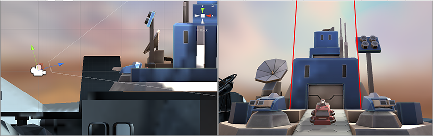
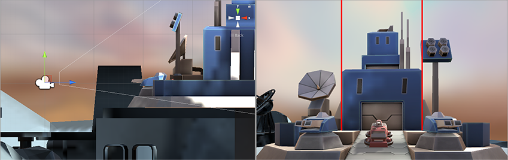
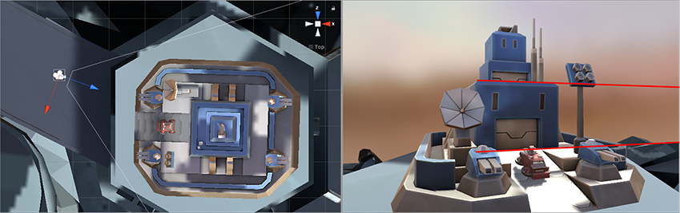
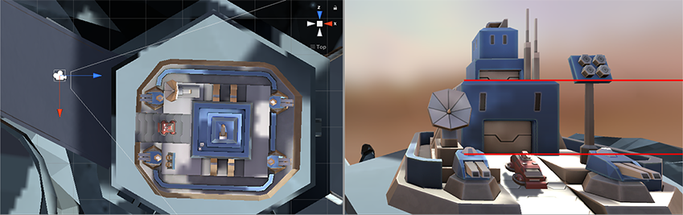
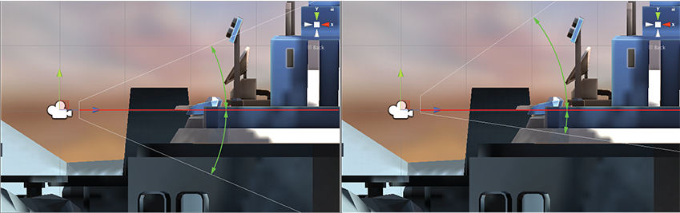

# 使用 Lens Shift 扩大视野

> 原文：[Widen the view with Lens Shift](https://docs.unity3d.com/6000.7/Documentation/Manual/PhysicalCameras-LensShift.html)

**Lens Shift** 会沿水平方向或垂直方向偏移相机镜头相对于 sensor 的位置。这可以改变 focal center，并在很少或没有 distortion 的情况下重新安排 rendered frame 中的 subject。

这项技术常用于建筑摄影。例如，如果想拍摄高楼，可以旋转 Camera，但这会使图像变形，让平行线看起来汇聚。

如果改为向上移动 lens，而不是旋转 Camera，就可以改变图像构图，将楼顶纳入画面，同时保持平行线笔直。

同样，也可以使用 horizontal Lens Shift 拍摄宽物体，避免旋转 Camera 可能造成的 distortion。

### Lens Shift 与 Frustum 的 oblique 特性

Lens Shift 的一个副作用是使 Camera 的 [[../../03-相机视图/01-相机视图简介#视锥体|View Frustum]] 变为 oblique。这意味着 Camera center line 与 View Frustum 两侧之间的夹角一侧较小、另一侧较大。

可以使用 Lens Shift 创建基于 Perspective 的视觉效果。例如在赛车游戏中，可能希望保持接近地面的低视角；Lens Shift 可以在不编写脚本的情况下实现 oblique frustum。

有关更多信息，请参阅[[../../03-相机视图/02-使相机透视变为斜视|使用斜视 Frustum]]。

---

## 文档导航
- 上一页：[[01-物理相机]]
- 目录：[[00-使用物理相机模拟真实相机]]
- 下一页：[[03-使用 Gate Fit 裁剪或拉伸视图/00-使用 Gate Fit 裁剪或拉伸视图]]
