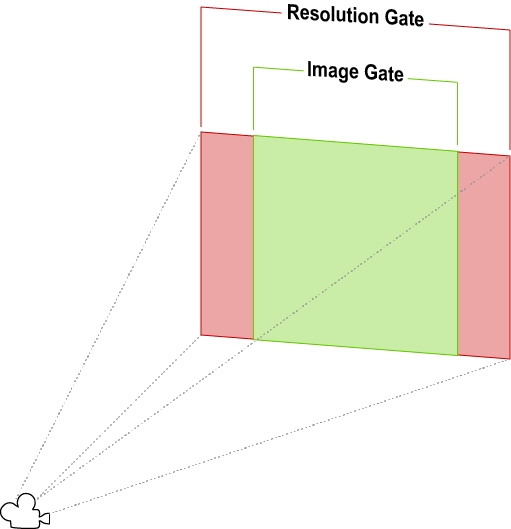
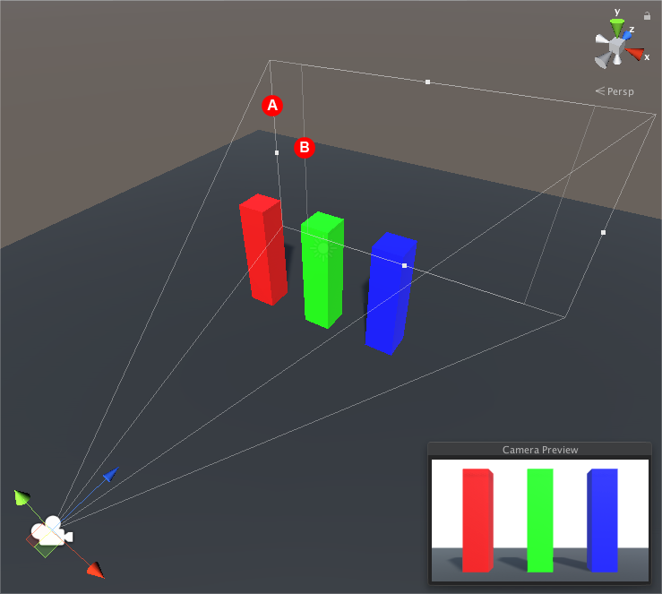

# Gate Fit 简介

> 原文：[Introduction to Gate Fit](https://docs.unity3d.com/6000.7/Documentation/Manual/PhysicalCameras-GateFit.html)

Camera Component 的 **Gate Fit** 属性决定 Game view 和 physical camera sensor 具有不同 aspect ratio 时的处理方式。

在 **Physical Camera** 模式下，Camera 有两个“gate”：

- 根据 **Aspect** 下拉菜单中设置的 resolution 在 Game view 中渲染的区域，称为“resolution gate”。
- 根据 **Sensor Size** 属性定义的 Camera 实际看到的区域，称为“film gate”。

当两个 gate 的 aspect ratio 不同时，Unity 会将 resolution gate 适配到 film gate。不同 fit mode 最终都会产生以下三种结果之一：

- **Cropping**：适配后 film gate 超出 resolution gate，Game view 会在其 aspect ratio 内尽可能渲染 Camera image，并裁掉其余部分。
- **Overscanning**：适配后 film gate 超出 resolution gate，Game view 仍会为落在 Camera field of view 外的 Scene 部分执行渲染计算。
- **Stretching**：Game view 会渲染完整 Camera image，然后沿水平方向或垂直方向拉伸，以适配其 aspect ratio。

要在 Scene view 中查看 gate 并了解它们如何适配，请选择 Camera 并查看其 View Frustum。resolution gate 是 Camera 的远裁剪平面；film gate 是 Frustum 底部的第二个矩形。

---

## 文档导航
- 上一页：[[00-使用 Gate Fit 裁剪或拉伸视图]]
- 目录：[[00-使用 Gate Fit 裁剪或拉伸视图]]
- 下一页：[[02-配置 Gate Fit]]
