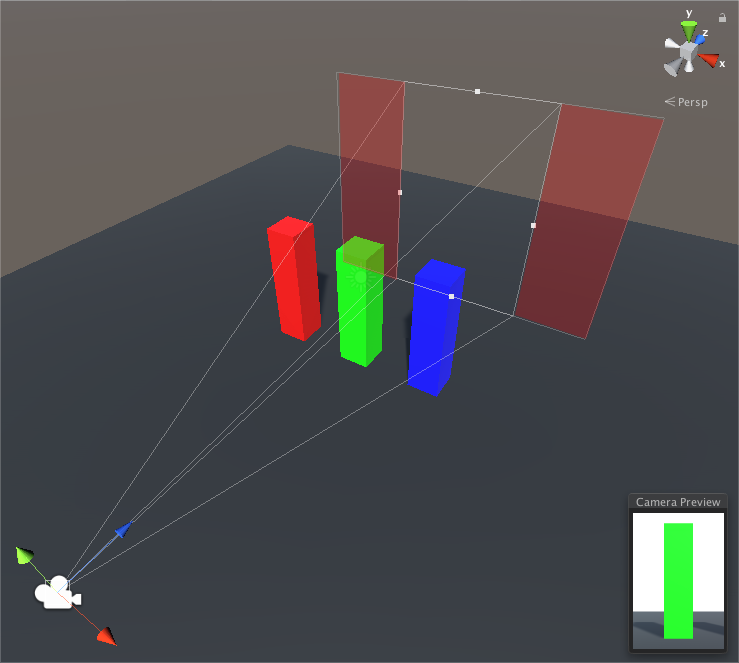
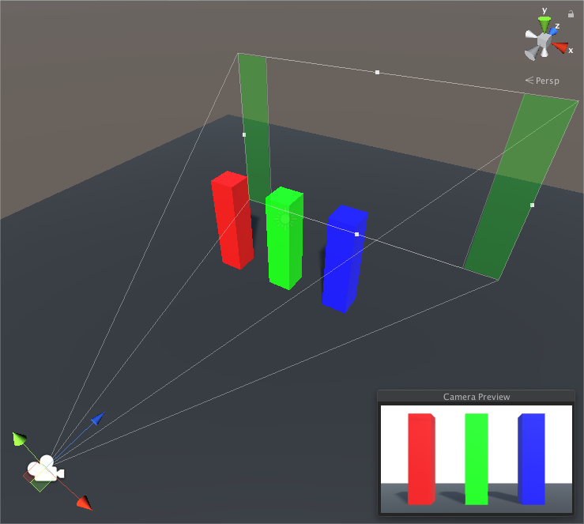
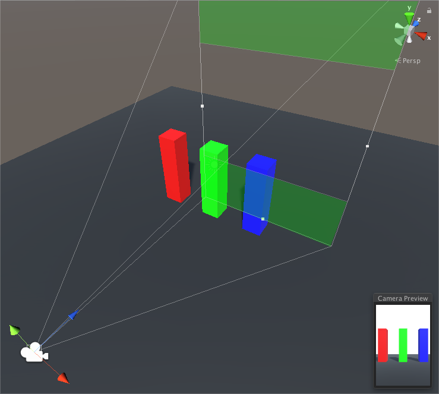
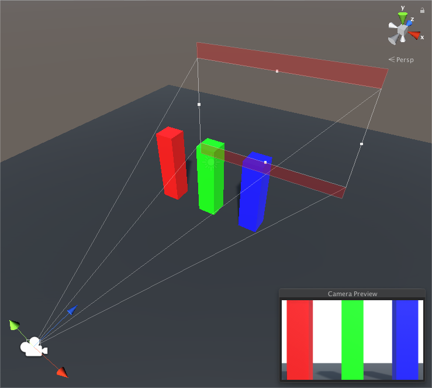
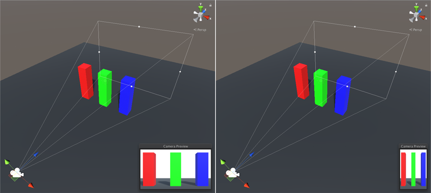

# 配置 Gate Fit

> 原文：[Configure Gate Fit](https://docs.unity3d.com/6000.7/Documentation/Manual/PhysicalCameras-GateFit-Configure.html)

选择的 **Gate Fit** mode 决定 Unity 如何调整 resolution gate（以及 Camera View Frustum 的形状）。film gate 始终保持相同大小。

以下各节详细介绍每种 Gate Fit mode。

## Vertical

当 **Gate Fit** 设置为 **Vertical** 时，Unity 会将 resolution gate 适配到 film gate 的高度（Y 轴）。对 sensor width（**Sensor Size > X**）进行的任何更改都不会影响 rendered image。

当 sensor aspect ratio 大于 Game view aspect ratio 时，Unity 会在两侧裁剪 rendered image：

当 sensor aspect ratio 小于 Game view aspect ratio 时，Unity 会在两侧对 rendered image 执行 overscan：

## Horizontal

当 **Gate Fit** 设置为 **Horizontal** 时，Unity 会将 resolution gate 适配到 film gate 的宽度（X 轴）。对 sensor height（**Sensor Size > Y**）进行的任何更改都不会影响 rendered image。

当 sensor aspect ratio 大于 Game view aspect ratio 时，Unity 会在顶部和底部对 rendered image 执行 overscan：

当 sensor aspect ratio 小于 Game view aspect ratio 时，Unity 会裁剪 rendered image 的顶部和底部。

## None

当 **Gate Fit** 设置为 **None** 时，Unity 会将 resolution gate 适配到 film gate 的宽度和高度（X 轴和 Y 轴）。Unity 会拉伸 rendered image，使其适配 Game view aspect ratio。

## Fill 和 Overscan

当 **Gate Fit** 设置为 **Fill** 或 **Overscan** 时，Unity 会根据 resolution gate 和 film gate 的 aspect ratio，自动执行 Vertical 或 Horizontal fit。

- **Fill** 将 resolution gate 适配到 film gate 的较小轴，并裁剪 Camera image 的其余部分。
- **Overscan** 将 resolution gate 适配到 film gate 的较大轴，并对 Camera image 边界以外的区域执行 overscan。

---

## 文档导航

- 上一页：[[01-Gate Fit 简介]]
- 目录：[[00-使用 Gate Fit 裁剪或拉伸视图]]
- 下一页：[[../../09-相机输出/00-相机输出]]
