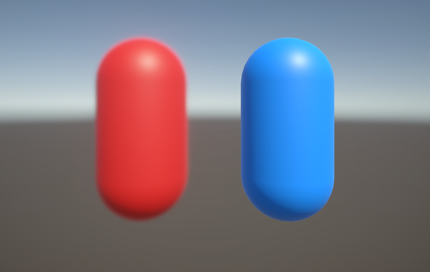

# 设置 Camera Stack

> 原文：[Set up a camera stack in URP](https://docs.unity3d.com/6000.7/Documentation/Manual/urp/camera-stacking.html)

本文介绍如何使用 Camera Stack 将多台 Camera 的输出分层到同一个 render target。有关 Camera Stacking 的更多信息，请参阅[[01-Camera Stack原理|Camera Stacking 原理]]。

## 设置步骤

1. [[#创建 Camera Stack|创建 Camera Stack]]。
2. [[#设置 Layer 和 Culling Mask|设置 Layer 和 Culling Mask]]。

## 创建 Camera Stack

使用一台 Base Camera 和一台或多台 Overlay Camera 创建 Camera Stack。

有关操作方法，请参阅[在 Camera Stack 中添加 Camera](03-在Camera Stack中添加移除和排序相机.md)。

## 设置 Layer 和 Culling Mask

创建 Camera Stack 后，必须将 Overlay Camera 需要渲染的 GameObject 分配到对应的 Layer，然后设置每台 Camera 的 **Culling Mask** 以匹配该 Layer。

操作步骤如下：

1. 根据项目需求添加 Layer。有关操作方法，请参阅[添加新 Layer](https://docs.unity3d.com/6000.7/Documentation/Manual/create-layers.html)。
2. 对于希望由 Overlay Camera 渲染的每个 GameObject，将其分配到适当的 Layer。
3. 选择 Camera Stack 的 Base Camera，在 Inspector 窗口中导航到 **Rendering > Culling Mask**。
4. 移除不希望 Base Camera 渲染的 Layer，例如只包含应由 Overlay Camera 渲染对象的 Layer。
5. 选择 Camera Stack 中的第一台 Overlay Camera，在 Inspector 窗口中导航到 **Rendering > Culling Mask**。
6. 移除除包含该 Camera 要渲染的 GameObject 的 Layer 之外的所有 Layer。
7. 对 Camera Stack 中的每台 Overlay Camera 重复第 5 步和第 6 步。

> [!NOTE]
> 不必配置 Camera 的 **Culling Mask** 属性。但是，URP 默认会渲染所有 Layer，因此移除包含不需要 GameObject 的 Layer 可以提高渲染速度。

---

## 文档导航

- 上一页：[[01-Camera Stack原理]]
- 目录：[[00-多台相机]]
- 下一页：[[03-在Camera Stack中添加移除和排序相机]]
