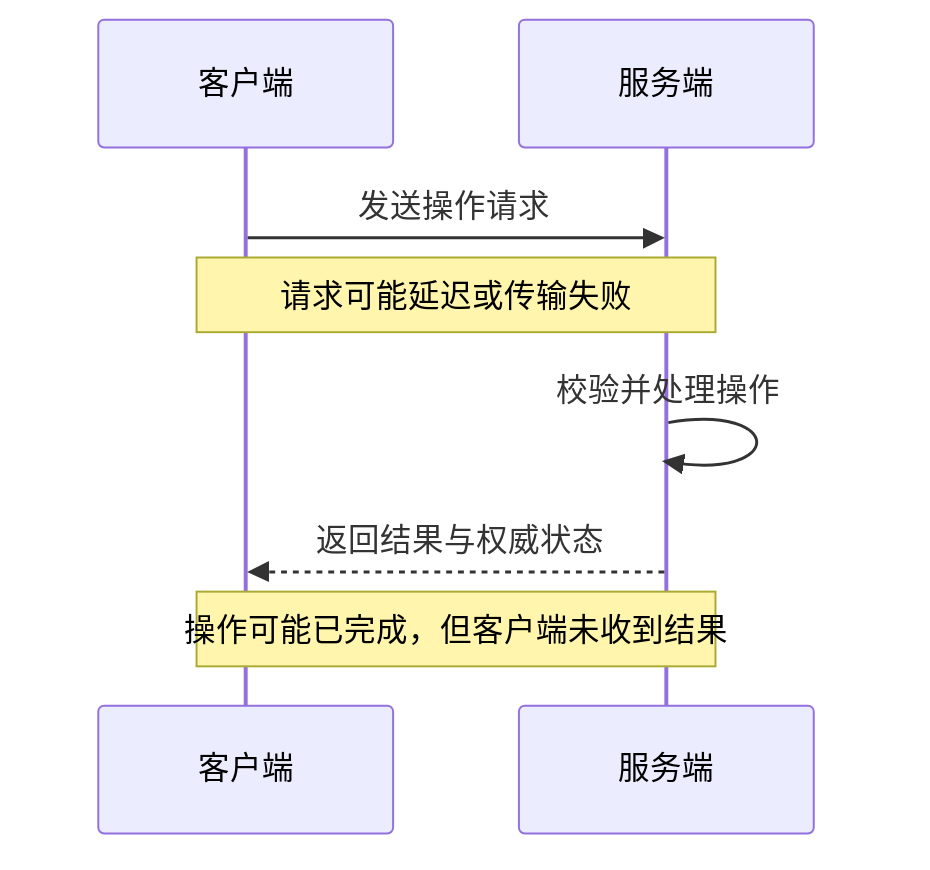
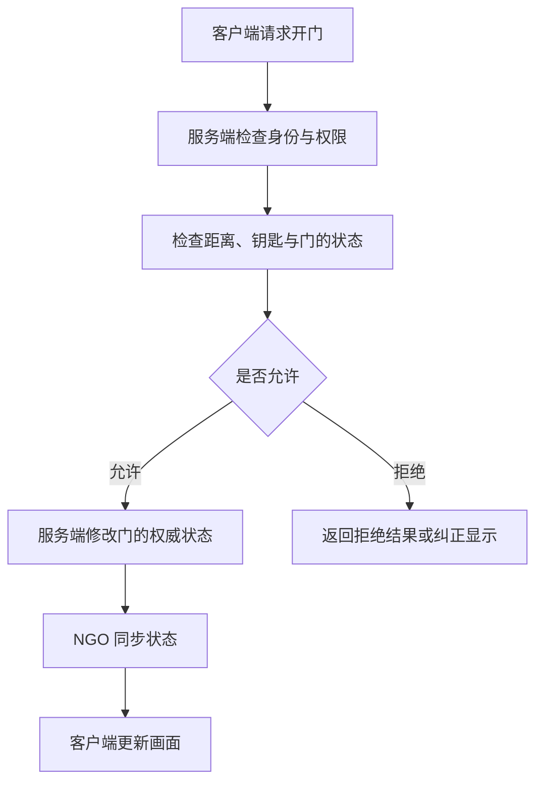

# Unity 弱网、服务端防作弊与 NGO 原理

本文面向 Unity 程序开发者，重点解释设计思路，不涉及具体实现代码。文中的 NGO 指 **Netcode for GameObjects**；NGO 的机制以客户端—服务端拓扑为讨论前提，预测能力说明依据已核对的 **2.7 版本文档**。

> [!abstract] 核心认识
> 客户端展示自己理解的世界，服务端维护最终有效的世界。
>
> 网络负责传递信息，但信息可能迟到、失效，甚至来自被修改的客户端。弱网处理和防作弊都需要明确：谁有决定权、哪些操作合法，以及重复或过期消息应该怎样处理。

## 目录

- [[#1. 弱网为什么容易暴露 Bug]]
- [[#2. 服务端怎样建立防作弊边界]]
- [[#3. 如何处理重复、并发与重连]]
- [[#4. 服务端权威与操作手感如何兼顾]]
- [[#5. NGO 的工作原理与职责边界]]
- [[#6. 如何落地与测试]]
- [[#参考资料]]

## 1. 弱网为什么容易暴露 Bug

### 1.1 本地调用变成了跨机器协作

单机开发中，调用一个方法后通常可以立即知道结果。联网后，一次操作被拆成多个环节：

这些环节不在同一个时间点完成，也可能在任意环节中断。很多弱网 Bug，本质上是程序默认了“网络会及时、按预想顺序返回成功结果”。

| 网络情况 | 容易出现的现象 | 被暴露的设计问题 |
| --- | --- | --- |
| 高延迟 | 人已经走开，却还能拾取旧位置的物品 | 用过期信息判断交互 |
| 延迟抖动 | 角色时快时慢、突然跳动 | 按消息到达节奏直接驱动画面 |
| 丢包 | 开火效果出现，但状态没有更新 | 没有区分临时事件与最终状态 |
| 消息乱序或异步处理顺序变化 | 新状态被旧结果覆盖 | 缺少版本、序号或状态检查 |
| 超时重试 | 重复扣款、重复领奖 | 同一业务操作能重复生效 |
| 断线重连 | 复活后收到上一次生命的伤害 | 缺少会话、对局或对象生命周期标识 |

这里说的乱序，不代表 TCP 会把同一连接里的字节乱序交给应用。即使底层可靠有序，多个连接、并发请求、异步处理和重连重试，仍然会产生业务时序问题。

### 1.2 超时意味着结果未知

> [!important] 超时不等于操作失败
> 客户端没有收到结果，只能说明客户端还不知道结果，不能证明服务端没有执行。

例如，玩家请求购买药水：

1. 服务端收到请求。
2. 服务端扣钱并发货。
3. 返回结果的消息没有到达客户端。
4. 客户端显示失败，并重新发起购买。
5. 服务端如果把它当作另一笔购买，就会再次扣钱。

弱网只是让这个逻辑漏洞更容易发生。攻击者也可能通过主动重试或重复请求利用同类问题。[安全重试与幂等设计](https://aws.amazon.com/builders-library/making-retries-safe-with-idempotent-APIs/)

### 1.3 区分画面问题与规则问题

角色偶尔被拉回，不一定是判定 Bug，也可能是客户端预测错误后，服务端正在纠正。

分析问题时，先区分两件事：

- **表现是否平滑**：有没有跳动、延迟、卡顿或拉回。
- **规则是否正确**：有没有重复结算、非法移动、物品复制或错误归属。

两者都需要处理，但使用的手段不同。平滑插值不能修复重复扣款，业务事务也不能改善移动画面的抖动。

## 2. 服务端怎样建立防作弊边界

### 2.1 客户端提交意图，服务端计算结果

协议设计应给服务端保留独立验证和计算的空间。

| 行为 | 客户端可以提交 | 服务端需要决定 |
| --- | --- | --- |
| 移动 | 移动方向、跳跃输入 | 合法速度、碰撞、最终位置 |
| 攻击 | 开火请求、瞄准方向 | 能否开火、是否命中、伤害 |
| 拾取 | 想拾取哪个物品 | 距离、归属、物品是否还存在 |
| 购买 | 商品与数量 | 价格、余额、库存、发货 |
| 领奖 | 申请领取哪项奖励 | 条件是否完成、是否已领取 |

“我打中了，给对方扣 100 血”把关键决定交给了客户端。“我尝试向这个方向开火”才给服务端留下独立验证的空间。

不过，提交输入也不天然安全。输入方向、频率和时间戳仍然可以伪造，服务端必须按自己的规则消费输入。

Unity 官方明确提醒：即使客户端限制了攻击距离，只要服务端 RPC 没有验证，修改过的客户端仍然可以直接发送请求。[Unity 的延迟与安全设计说明](https://docs-multiplayer.unity3d.com/netcode/2.3.2/learn/dealing-with-latency/)

### 2.2 每个请求都要回答五个问题

1. **谁在请求？** 从已认证的连接确定身份，不能只相信参数中的玩家 ID。
2. **他有权操作吗？** 是自己的角色、背包、交易或当前对局吗？
3. **当前状态允许吗？** 已死亡、眩晕、换弹中的角色能否执行这个动作？
4. **资源和时间满足吗？** 子弹、余额、冷却、距离、速度是否符合规则？
5. **这个操作是否过期或已经处理过？** 是否来自旧会话、旧生命或旧订单？

这样可以把防作弊从零散的“发现异常就拦截”，变成完整的规则系统。

### 2.3 服务端掌握时间与模拟节奏

客户端多发十倍移动消息，不能因此多移动十倍距离；修改本地时间，也不能让服务端认定冷却提前结束。

关键动作应受服务端时间和模拟步数约束。客户端上报的时间可以帮助描述操作发生的背景，但不能直接决定玩家获得多少行动机会。

弱网时积压的输入可能集中到达，因此也不能简单地把“短时间到达很多包”判成加速。需要检查的是服务端时间范围内允许发生的动作量，并明确迟到输入的处理策略。

> [!tip] 区分网络异常和规则违规
> 丢包、抖动和集中到包本身不是作弊证据。应根据权威状态判断操作是否合法，并将持续异常记录用于进一步分析。

### 2.4 服务器部署位置决定信任边界

如果使用玩家电脑上的 Host，该玩家控制的进程同时运行服务端逻辑，房主仍然有篡改裁判的能力。

对竞技公平要求高的游戏，应让关键判定运行在你控制的服务器上。判断是否可信，要看谁控制执行环境，不能只看代码是否运行在 `IsServer` 分支里。

### 2.5 服务端权威也有能力边界

服务端权威能阻止大量非法状态修改，但自动瞄准、脚本操作等可能产生“规则允许、来源作弊”的输入，还需要行为分析等额外措施。

对于不该让客户端知道的信息，也应尽量避免下发，例如隐藏手牌或无需暴露的敌人状态。已经发送到玩家设备上的信息，不能仅靠界面不显示来保密。

## 3. 如何处理重复、并发与重连

### 3.1 请求幂等与业务唯一性是两道保障

以“每日奖励”为例：

- **请求幂等**：同一次领取请求重试，返回已有结果，不再次发奖。
- **业务唯一性**：即使攻击者不断换请求 ID，同一玩家当天的同一奖励也只能领取一次。

仅有请求 ID 去重是不够的，否则攻击者换一个 ID 就能绕过。

同一次业务操作重试时，应沿用它的操作标识。服务端还应把该标识与调用者和请求内容关联，避免同一个标识被拿来表达不同操作。

### 3.2 并发校验与状态变更必须受到统一保护

“检查未领取 → 发奖 → 标记已领取”必须作为受保护的整体。两个并发请求不能都看到“未领取”，然后各发一次奖。

发奖结果与领取记录也要保持一致，避免服务崩溃后留下“奖励发了，记录没写”的状态。

- 单数据库内，可以使用事务和唯一约束。
- 跨服务时，需要明确的持久化流程与失败恢复机制。

这里的目标是让失败后的状态可判断、可恢复，并避免业务效果重复发生。[AWS 的幂等与原子性设计](https://aws.amazon.com/builders-library/making-retries-safe-with-idempotent-APIs/)

> [!important] 不同层次的保证不能互相替代
> 可靠传输不能替代业务幂等，按钮置灰也不能替代服务端约束。

### 3.3 重连需要恢复业务状态

恢复连接后，应从服务端重新获取有效状态，并核对尚未确认的关键操作。

不能把断线期间积压的所有操作不加区分地重新执行：

| 未完成的操作 | 恢复时需要考虑的问题 |
| --- | --- |
| 过期移动输入 | 是否仍有执行价值，是否已超出允许窗口 |
| 已结束对局中的攻击 | 是否应直接拒绝 |
| 状态未知的购买 | 应先确认已有订单结果，或使用原操作标识安全重试 |
| 上一次生命中的操作 | 是否与当前角色生命周期匹配 |

连接恢复只是传输恢复。玩家、对局、订单和对象状态的恢复，需要业务层负责。

## 4. 服务端权威与操作手感如何兼顾

### 4.1 把立即反馈与最终判定分开

如果每次按键都等服务端回复后才显示结果，操作会明显迟钝。常见设计是客户端立即给出反馈，同时接受服务端的最终判定。

| 技术 | 主要作用 | 需要接受的代价 |
| --- | --- | --- |
| 本地预测 | 自己按下移动后立即动起来 | 预测错了需要纠正 |
| 服务端校正 | 用权威结果修正客户端 | 可能出现拉回 |
| 插值 | 平滑显示其他玩家的运动 | 展示的状态略晚于服务器 |
| 延迟补偿 | 按合理的历史时刻判断攻击 | 可能出现躲进掩体后仍被命中 |

### 4.2 完整移动预测与校正的思路

1. 客户端立即执行自己的输入。
2. 客户端保存尚未被服务端确认的输入记录。
3. 服务端处理输入，返回“处理到第几条输入，以及当时的权威状态”。
4. 客户端以该权威状态为基准，重放后续尚未被确认的输入。
5. 表现层按需要平滑修正视觉误差。

这样校正的是同一段时间的状态，避免把“服务器较早时刻的位置”直接当成“客户端现在应在的位置”。

重放输入属于本地重新计算，不能因此再次提交购买、重复发放奖励或重复产生其他不可重复的业务效果。

### 4.3 插值为何适合其他玩家

你知道自己刚按了什么，却无法立即知道另一名玩家刚按了什么。

因此，对其他玩家通常会缓冲少量已收到的状态，在这些状态之间平滑显示运动。它以少量显示延迟换取稳定性，不代表网络延迟消失了。

### 4.4 延迟补偿为何会产生争议

服务端保留短时间的历史状态，在受限制的历史时刻检查命中，从而减小“玩家瞄准时的位置”与“请求到达时的位置”之间的差异。

> [!warning] 历史时间不能任由客户端指定
> 客户端报告的时间只能作为参考，不能让玩家随意指定回到几秒前。需要由服务端约束合理时间范围。

补偿窗口越大，对高延迟攻击者越宽容，也越容易让被攻击者觉得不公平，例如已经进入掩体，却仍收到伤害。这需要结合玩法明确取舍。[Valve 对预测、插值和延迟补偿的说明](https://developer.valvesoftware.com/wiki/Source_Multiplayer_Networking)

## 5. NGO 的工作原理与职责边界

### 5.1 NGO 在网络架构中的位置

NGO 是面向 GameObject／MonoBehaviour 的网络同步框架。它位于传输层之上，帮助你表达对象、消息和同步状态；游戏规则仍然需要你定义。[Unity 官方简介](https://docs.unity.com/multiplayer/netcode/netcode)

| NGO 概念 | 解决的问题 |
| --- | --- |
| `NetworkObject` | 各台机器如何对应同一个网络对象 |
| `NetworkBehaviour` | 对象上的联网行为如何组织 |
| RPC | 如何向另一端发送一次操作或通知 |
| `NetworkVariable` | 如何同步一个持续存在的当前状态 |
| `NetworkTransform` | 如何同步位置、旋转等变换 |
| 底层传输，如 Unity Transport | 如何实际收发网络数据 |

各台机器上的 GameObject 是各自进程里的对象。网络对象标识让框架知道，一条消息对应本地的哪个对象；消息和同步数据则让这些对象表达同一个游戏世界的不同副本。

### 5.2 RPC 与状态同步的区别

假设游戏里有一扇门：

- “我请求打开门”适合用 RPC 表达。
- “门现在是打开的”适合用同步状态表达。
- “播放开门音效”可以是一次临时通知。

晚加入的玩家需要知道门当前开着，不需要重新收到过去所有开门操作。

`NetworkVariable` 能为新加入的客户端同步当前值；过去发出的 RPC 不会自动成为可供重放的历史记录。这里的状态持续存在，也不等于已经保存进数据库。[NGO 的 NetworkVariable 文档](https://docs.unity3d.com/Packages/com.unity.netcode.gameobjects@2.7/manual/basics/networkvariable.html)

### 5.3 用开门流程理解服务端权威

NGO 帮你传递请求和同步结果，距离与钥匙检查属于你的业务逻辑。

### 5.4 同步权限不等于业务合法性

这些概念尤其容易混淆：

- RPC 能被调用，不代表该行为合法。
- 拥有角色对象，不代表可以任意修改角色血量。
- `NetworkTransform` 能同步坐标，不代表该坐标符合速度和碰撞规则。
- 服务端把客户端上报的结果直接广播出去，也没有形成有效的权威判定。

在客户端—服务端拓扑中，`NetworkVariable` 默认由服务端写入、客户端读取。但即使写入发生在服务端，如果写入内容直接采信未经验证的客户端结果，业务仍然可能被利用。[NGO 的变量权限说明](https://docs.unity3d.com/Packages/com.unity.netcode.gameobjects@2.7/manual/basics/networkvariable.html#permissions)

### 5.5 可靠 RPC 的保证有范围

NGO 官方文档说明，可靠 RPC 的执行顺序保证以同一个 `NetworkObject` 为范围。不能把不同对象上的 RPC 当成全局有序的事务。[NGO 的可靠性说明](https://docs.unity3d.com/Packages/com.unity.netcode.gameobjects@2.7/manual/advanced-topics/message-system/reliability.html)

例如，分别发给背包对象和商店对象的消息，不会自动组成一笔“扣钱和发货必须一起成功”的交易。这个保证需要业务层设计。

### 5.6 Client Anticipation 与完整预测不同

> [!note] 版本范围：NGO 2.7
> 已核对的官方文档提供 Client Anticipation，但没有内置完整的“回滚并重放输入”的预测校正闭环。

Anticipation 允许画面先显示预期结果，再根据服务端状态纠正。例如，玩家操作后先看到物体变色，服务端确认后保留该结果；如果服务端结果不同，则修正显示。

它区分预期显示值和服务端权威值，并提供处理过期更新及平滑修正的机制。但输入历史、完整回滚重放以及相关游戏逻辑，不会因为加上一个同步组件就自动实现。[NGO 的 Client Anticipation 文档](https://docs.unity3d.com/Packages/com.unity.netcode.gameobjects@2.7/manual/advanced-topics/client-anticipation.html)

## 6. 如何落地与测试

### 6.1 先写不会被网络破坏的规则

在选择 NGO 组件之前，先为玩法写出必须始终成立的约束：

- 同一奖励不能重复发放。
- 同一物品不能同时归属于两名玩家。
- 未被允许的动作不能因为消息迟到而生效。
- 重连后能恢复服务端认可的状态。
- 客户端帧率、发包频率和本地时钟不能扩大行动能力。

然后明确每条规则由哪个服务端模块维护，需要哪些权威数据，以及失败后如何恢复。

### 6.2 测试网络条件，也测试业务结果

| 测试场景 | 重点观察 |
| --- | --- |
| 高延迟 | 交互是否使用有效状态，反馈是否可理解 |
| 抖动与丢包 | 表现是否稳定，最终状态能否收敛 |
| 请求重复 | 关键业务效果是否重复发生 |
| 并发操作 | 校验与修改之间是否存在竞态 |
| 请求或响应中途断线 | 是否能确认操作结果并安全恢复 |
| 重连、复活、切换对局 | 旧消息是否污染新状态 |
| 积压输入集中到达 | 是否额外增加行动量，或误判正常玩家 |

不要只看“有没有卡顿”，还要检查重复结算、错误归属和非法状态转换。

### 6.3 使用独立客户端验证

Host 本地操作通常缺少远端客户端经历的完整网络等待，容易掩盖时序问题。需要使用独立客户端，在真实的消息往返路径上验证。

定位问题时，日志应能关联玩家、会话、对局、操作标识、服务端时间以及接受或拒绝原因。这样才能判断一次异常来自传输延迟、重试、状态过期，还是规则本身存在漏洞。

## 参考资料

- [Unity：Netcode 框架概述](https://docs.unity.com/multiplayer/netcode/netcode)
- [Unity：延迟处理与安全设计](https://docs-multiplayer.unity3d.com/netcode/2.3.2/learn/dealing-with-latency/)
- [NGO 2.7：NetworkVariable](https://docs.unity3d.com/Packages/com.unity.netcode.gameobjects@2.7/manual/basics/networkvariable.html)
- [NGO 2.7：RPC 可靠性](https://docs.unity3d.com/Packages/com.unity.netcode.gameobjects@2.7/manual/advanced-topics/message-system/reliability.html)
- [NGO 2.7：Client Anticipation](https://docs.unity3d.com/Packages/com.unity.netcode.gameobjects@2.7/manual/advanced-topics/client-anticipation.html)
- [Valve：Source Multiplayer Networking](https://developer.valvesoftware.com/wiki/Source_Multiplayer_Networking)
- [AWS：Making retries safe with idempotent APIs](https://aws.amazon.com/builders-library/making-retries-safe-with-idempotent-APIs/)
