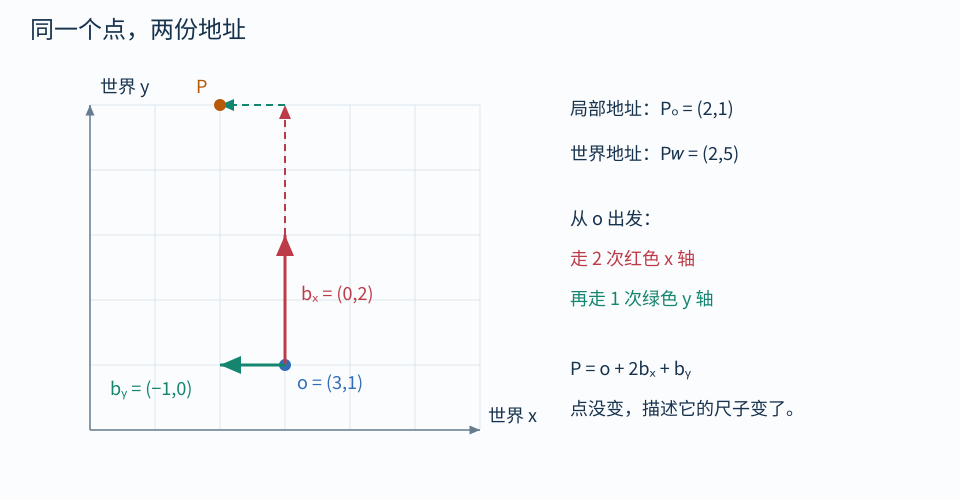

# 01｜点、向量与坐标空间

## 先想象一块带格子的透明板

场景中有一盏灯。你拿一块带有原点、x 轴和 y 轴的透明板来描述它：“从原点向右走 2 格，再向上走 1 格”。这时你写下 $(2,1)$。

如果透明板移动了，灯没有动，数字却变了。所以：

> **点是空间中的位置；坐标是相对于一套原点和基向量给出的描述。**

这里的“空间”在 Shader 讨论中常指某一套坐标表达方式，不是在渲染世界里搬到另一个宇宙。

## 先把三种东西分开

| 名称 | 回答的问题 | 例子 |
| --- | --- | --- |
| 点 position | 在哪里？ | 顶点位置、灯的位置 |
| 位移 displacement | 从这里到那里走多少？ | 两点相减 $q-p$ |
| 单位方向 direction | 朝哪里？ | 归一化的视线方向 |

点减点得到位移，点加位移得到另一个点。两个点直接相加通常没有坐标无关的几何意义；但 $(p+q)/2$ 表示中点，因为它是权重之和为 1 的仿射组合。

长度不为零的位移 $d$ 可转为单位方向：

$$
\hat d=\frac{d}{\|d\|},\qquad
\|d\|=\sqrt{d_x^2+d_y^2+d_z^2}
$$

归一化保留方向、丢掉长度。做“移动 2 米”时不能随意丢掉这 2 米；做“朝向灯”时往往只需要方向。零向量没有可定义的单位方向。

## 原点和基向量构成一套坐标系

令局部原点在世界里是 $o$，局部两个单位步长在世界里分别是 $b_x,b_y$。局部点 $(x,y)$ 对应：

$$
p_W=o+x b_x+y b_y
$$

“单位步长”指局部坐标增加 1；它在世界里不一定长 1 米，也不一定与另一根轴垂直。非均匀缩放会改变步长，错切会改变轴间夹角。

图中 $o=(3,1)$、$b_x=(0,2)$、$b_y=(-1,0)$。对于局部点 $(2,1)$：

$$
p_W=(3,1)+2(0,2)+1(-1,0)=(2,5)
$$

按照图上的路径读：先找到局部原点，再走两次红色局部 x 轴，再走一次绿色局部 y 轴。图中橙色圆点只有一个；$(2,1)_O$ 与 $(2,5)_W$ 是它的两份地址。

## 两种“变换”先不要混在一起

**主动变换：** 固定坐标系，把点从 $p$ 移到 $p'$。例如让一片树叶旋转 30°。几何真的改变了。

**被动换坐标：** 固定几何点，改变描述它的坐标系。比如把同一顶点从世界坐标改写成模型坐标。画面中的点不因此移动。

在图形学代码中，两种操作都可能写成矩阵乘向量。仅凭符号无法判断，必须看输入、输出和用途。

模型矩阵也能从两个角度理解：把模型模板摆到世界中；或者把摆好后的物体局部坐标翻译成世界坐标。这两个解释兼容，前提是说清“什么固定，什么变化”。

## Unity 中最常见的几套描述

- Object / OS：网格相对于模型原点的坐标。适合贴着物体的效果。
- World / WS：场景统一的坐标。适合高度雾、世界扫描线。
- View / VS：相对于相机的坐标。适合分析镜头前的远近关系。
- Tangent / TS：表面上一点附近的切线坐标框架。适合法线贴图。
- Clip / CS：投影后的齐次坐标；它还不是最终屏幕位置。

UV 是二维参数域，不必等同于模型空间的 x、y。展开、接缝、拉伸都会改变 UV 与真实表面的对应关系。

## 先预测再算

原点从 $(3,1)$ 平移到 $(4,1)$，两根基向量不变。

- 若局部坐标仍是 $(2,1)$，世界点会到哪里？
- 若世界点仍是 $(2,5)$，局部坐标会变成什么？

答案：前者是 $(3,5)$；后者是 $(2,2)$。局部 y 轴朝世界左方，所以要用更多局部 y 步数抵消原点向右的移动。

导航：[[00-学习路线|目录]] · 下一篇：[[02-矩阵就是基向量的去向]]
