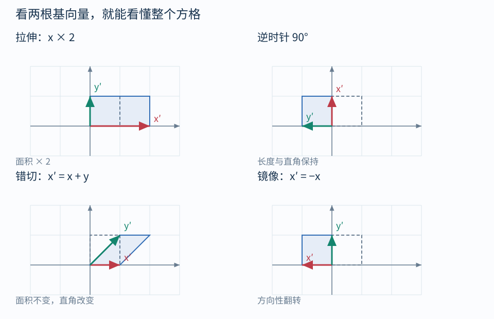

# 02｜矩阵就是基向量的去向

## 暂时把乘法口诀放到一边

二维标准基为 $e_x=(1,0)$、$e_y=(0,1)$。任何向量都能拆为：

$$
v=x e_x+y e_y
$$

线性变换 $A$ 保持向量加法与数乘，所以：

$$
Av=x(Ae_x)+y(Ae_y)
$$

这句话的几何意思是：**只要知道两根基向量被送去了哪里，就知道所有向量被送去了哪里。**

假设 x 基向量变到 $(a,c)$，y 基向量变到 $(b,d)$，把它们写成列：

$$
A=\begin{bmatrix}a&b\\c&d\end{bmatrix},\qquad
A\begin{bmatrix}x\\y\end{bmatrix}
=x\begin{bmatrix}a\\c\end{bmatrix}
+y\begin{bmatrix}b\\d\end{bmatrix}
$$

第一列是输入 x 基向量在输出坐标中的结果；第二列是输入 y 基向量的结果。**不是拿第一行当 x 轴。**

## 看方格，比看单个顶点更容易理解矩阵

| 变换 | 矩阵 | 看见什么 |
| --- | --- | --- |
| x 放大两倍 | $\begin{bmatrix}2&0\\0&1\end{bmatrix}$ | 方格横向拉宽 |
| 图中逆时针转 90° | $\begin{bmatrix}0&-1\\1&0\end{bmatrix}$ | x 轴朝上，y 轴朝左 |
| x 方向错切 | $\begin{bmatrix}1&1\\0&1\end{bmatrix}$ | 每往上 1 格，就额外向右 1 格 |
| 关于 y 轴镜像 | $\begin{bmatrix}-1&0\\0&1\end{bmatrix}$ | 左右翻转，朝向发生反转 |

错切的公式是 $(x,y)\mapsto(x+y,y)$。它不是旋转：两根基向量之间的直角变了。镜像也不是转身：图形的方向性发生了改变，三维里可能影响三角形绕序与背面剔除。

任意二维旋转角 $\theta$ 的矩阵为：

$$
R(\theta)=
\begin{bmatrix}
\cos\theta&-\sin\theta\\
\sin\theta&\cos\theta
\end{bmatrix}
$$

第一列是转过 $\theta$ 的原 x 轴；第二列是转过相同角度的原 y 轴。这样记，比背四个正负号可靠。这里采用二维 +x 向右、+y 向上的图示约定。

## 用一个点核对

错切矩阵乘 $(2,1)$：

$$
\begin{bmatrix}1&1\\0&1\end{bmatrix}
\begin{bmatrix}2\\1\end{bmatrix}
=2(1,0)+1(1,1)=(3,1)
$$

表现上：点的高度没变，但因为它位于 y=1，就额外向右移了 1。

HLSL 对应：

~~~c
float2x2 A = float2x2(1, 1,
                     0, 1);
float2 p2 = mul(A, float2(2, 1)); // (3, 1)
~~~

这里按“逐行给出元素”构造矩阵，再按列向量解释乘法。**构造元素的书写次序、内存存储布局、向量乘法约定，是三个不同问题。** 看到 column-major 不能据此决定把 mul 的参数交换。

## 三维只多了一根基向量

$$
Ap=x b_x+y b_y+z b_z
$$

3×3 矩阵的三列就是这三根向量。先在脑中看一个小立方体：三根边被拉长、转动或挤斜后，整个立方体也跟着改变。

线性变换始终让原点留在原点：$A0=0$。它可以旋转、缩放、错切、镜像、压扁，但无法单靠 3×3 对三维点实现独立平移。

## 行列式只先记住一幅画

二维 $\det A=ad-bc$：

- $|\det A|$ 是面积缩放倍数；三维对应体积倍数。
- 负号表示方向性翻转。
- 等于零表示至少一个维度被压扁，信息丢失，无法唯一恢复。

例如 $\mathrm{diag}(2,1)$ 将面积放大两倍；错切例子的行列式为 1，所以形状倾斜但面积不变。$\mathrm{diag}(0,1)$ 把方格压成一条线，原来不同的 x 坐标全挤到同一处。

## 自测

若两列分别为 $(0,1)$、$(2,0)$，点 $(1,2)$ 去哪里？

答案：$(4,1)$。面积放大两倍，行列式为 $-2$，方向性翻转。先用“两根轴按分量组合”回答，再做矩阵乘法验证。

导航：[[00-学习路线|目录]] · 上一篇：[[01-点向量与坐标空间]] · 下一篇：[[03-平移齐次坐标与变换顺序]]
