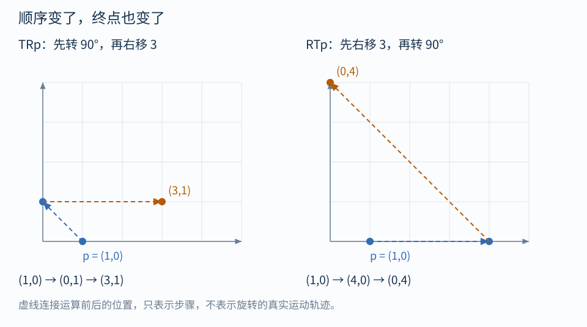

# 03｜平移、齐次坐标与变换顺序

## 为什么平移需要额外一列

三维位置变换通常是：

$$
p'=Ap+t
$$

$A$ 负责转动、缩放或错切，$t$ 负责移动原点。这叫仿射变换。严格地说，有非零平移时，它不是三维线性变换，因为原点被移走了。

给点增加一个分量 1，就能合成一次矩阵乘法：

$$
\begin{bmatrix}p'\\1\end{bmatrix}
=
\underbrace{\begin{bmatrix}
a_{00}&a_{01}&a_{02}&t_x\\
a_{10}&a_{11}&a_{12}&t_y\\
a_{20}&a_{21}&a_{22}&t_z\\
0&0&0&1
\end{bmatrix}}_{M}
\begin{bmatrix}x\\y\\z\\1\end{bmatrix}
$$

前三列的 xyz 是基向量的去向，最后一列的 xyz 是原点的去向。这也是阅读一个仿射 4×4 矩阵最实用的方法。

## w=1 和 w=0 不是死记的暗号

对点使用 $(x,y,z,1)$，最后一列乘 1，所以平移会作用。

对位移使用 $(d_x,d_y,d_z,0)$，最后一列乘 0，所以：

$$
d'=Ad
$$

这符合直觉：整座房子平移 10 米，房间里两点之间的位移不会因此多出 10 米。旋转或缩放仍然可能改变位移。

~~~hlsl
float3 positionWS = mul(GetObjectToWorldMatrix(), float4(positionOS, 1)).xyz;
float3 deltaWS    = mul(GetObjectToWorldMatrix(), float4(deltaOS, 0)).xyz;
~~~

上面针对仿射模型变换。投影后 w 通常不再是 1；不能不加区分地取 xyz 当作最终坐标。法线虽然不受平移影响，也不能简单当普通位移变换，见第 06 篇。

## 矩阵链从右往左读

令 $S$ 表示缩放，$R$ 表示旋转，$T$ 表示平移：

$$
p'=TRSp
$$

实际顺序是先 $S$，再 $R$，最后 $T$。可以先给中间结果命名：

$$
p_1=Sp,\quad p_2=Rp_1,\quad p_3=Tp_2
$$

不要把“写在左边”误读成“先做”。

图中取 $p=(1,0)$，$R$ 为图中逆时针 90°，$T$ 为向右 3：

- $TRp$：$(1,0)\to(0,1)\to(3,1)$。
- $RTp$：$(1,0)\to(4,0)\to(0,4)$。

第二条路径中，平移产生的偏移也一起被旋转，所以看上去像绕世界原点公转。

**表现联想：** 举着旗子原地转身再向右走，和先走到右侧再围绕原点转圈，最终位置不同。

## 绕任意中心旋转

希望绕点 $c$ 旋转：

$$
p'=c+R(p-c),\qquad M=T(c)RT(-c)
$$

先把旋转中心搬到原点，再旋转，再搬回去。UV 绕贴图中心旋转同理：

~~~hlsl
float a = radians(_AngleDegrees);
float s = sin(a), c = cos(a);
float2x2 R = float2x2(c, -s, s, c);
float2 uvRotated = mul(R, uv - 0.5) + 0.5;
~~~

它变换的是**采样坐标**。采样一张固定贴图时，屏幕上纹样的移动方向往往与采样坐标变化相反，第 07 篇会进一步解释。

## 父子层级也是变换链

一个普通 Transform 的局部 TRS 把“自身局部”映射到“父物体局部”。父物体再映射到世界：

$$
M_{W\leftarrow O}
=M_{W\leftarrow Parent}M_{Parent\leftarrow O}
$$

父节点旋转，子节点的局部位移也跟着旋转，所以孩子会围绕父原点转。父节点非均匀缩放再结合子节点旋转，最终世界矩阵可能出现错切；不能总把最终世界矩阵当成一个简单的“世界旋转 × 对角缩放”。

Unity 中可用 localToWorldMatrix 检查实际矩阵。[Unity Matrix4x4 API](https://docs.unity3d.com/6000.0/Documentation/ScriptReference/Matrix4x4.html)

## 自测

$(1,0)$ 先 x 放大 2 倍，再绕原点逆时针转 90°，再右移 3，结果是什么？

答案：$(3,2)$，对应 $TRSp$。如果你得到 $(0,4)$，很可能用了 $SRT$；逐步记录中间值即可定位。

导航：[[00-学习路线|目录]] · 上一篇：[[02-矩阵就是基向量的去向]] · 下一篇：[[04-空间转换与逆矩阵]]
