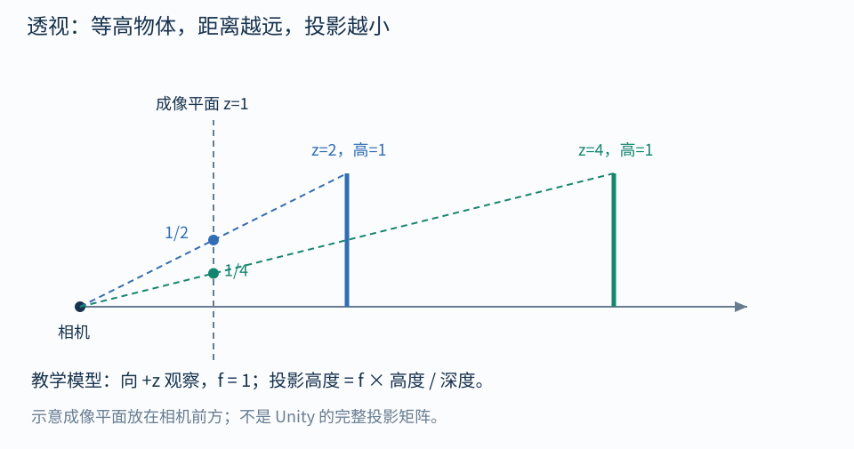

# 05｜相机、投影与屏幕坐标

## 把一条顶点路线拆开

$$
p_O
\xrightarrow{M}p_W
\xrightarrow{V}p_V
\xrightarrow{P}p_C
\xrightarrow{\div w}p_N
\xrightarrow{\text{视口映射}}\text{像素}
$$

| 阶段 | 你可以怎样想象 |
| --- | --- |
| Object → World | 把模型摆进场景 |
| World → View | 用相机的观察坐标描述场景 |
| View → Clip | 用镜头投影规则编码位置和裁剪信息 |
| Clip → NDC | 除以 w，产生透视缩小 |
| NDC → 屏幕 | 把归一化范围映射到视口像素 |

矩阵部分合起来是 $p_C=PVMp_O$。**透视除法不是普通的三维线性变换**，也不包含在单纯的矩阵乘法口诀中。

## 为什么移动相机，世界看起来反向移动

相机向右移动，固定物体在相机画面中趋向左移。因为描述点之前，需要减去相机的位置，并撤销相机朝向。

抽象地，如果 $C$ 把“所选视图坐标”映射到世界，那么 $V=C^{-1}$。但是 Unity 默认 View 约定还涉及轴向转换：相机 Transform 的局部前方为 +Z，而通常的相机观察空间前方为 -Z。

所以不要无条件把 camera.transform.worldToLocalMatrix 当成 camera.worldToCameraMatrix；使用相机 API 或管线提供的 View 矩阵。[Unity Camera.worldToCameraMatrix](https://docs.unity3d.com/6000.0/Documentation/ScriptReference/Camera-worldToCameraMatrix.html)

## 透视的核心：同样大小，越远看起来越小

先用一个**教学简化模型**：相机看向 +z，虚拟成像平面距离为 $f$，由相似三角形：

$$
x_{\text{image}}=f\frac{x}{z},\qquad
y_{\text{image}}=f\frac{y}{z}
$$

图中 $f=1$，高为 1 的物体：

- 放在 z=2，投影高度为 $1/2$；
- 放在 z=4，投影高度为 $1/4$。

这个模型仅解释近大远小，不是让你把这两个式子直接粘成 Unity 的完整投影矩阵。Unity 的视图 z 符号、FOV、宽高比、近远平面和平台深度约定还要纳入计算。

## 齐次坐标为什么能帮忙

投影矩阵先输出：

$$
p_C=(x_c,y_c,z_c,w_c)
$$

随后：

$$
p_N=\left(\frac{x_c}{w_c},\frac{y_c}{w_c},\frac{z_c}{w_c}\right)
$$

透视矩阵让 $w_c$ 与观察深度相关，除以它就让远处的横向和纵向距离变小。正交投影通常让 w 保持 1，故物体不因距离更远而变小。

齐次表达中，$(x_c,y_c,z_c,w_c)$ 与非零倍数的同一组数代表相同的除法结果。w 是参与投影的坐标分量，不是“透明度”。

## Clip 还承担裁剪

在常见约定里，可见范围的横纵条件是：

$$
-w_c\le x_c\le w_c,\quad -w_c\le y_c\le w_c
$$

z 的裁剪范围依图形 API 而异。GPU 在齐次裁剪阶段处理超出视锥的图元，再做透视除法等后续步骤。靠近 w=0 或在相机后方的点不能靠任意除法可靠地变成可见像素。

Unity 的深度范围、反向 Z 和渲染纹理上下方向存在平台差异。做深度重建或屏幕采样，应使用对应管线的宏和函数，而不是假设所有平台相同。[Unity Shader 平台差异](https://docs.unity3d.com/6000.0/Documentation/Manual/SL-PlatformDifferences.html)

## Shader 中最容易混淆的 positionCS

~~~hlsl
// 顶点着色器输出：齐次裁剪坐标
OUT.positionCS = TransformObjectToHClip(IN.positionOS.xyz);
~~~

不要手工除 w 后把结果直接当作正常的 SV_POSITION 输出，GPU 还需要齐次信息完成裁剪和插值。

片元着色器输入的 **SV_POSITION** 已经具有屏幕/光栅化阶段的语义；它的 xy 通常是像素位置，并非顶点阶段那份原始 clip.xy。变量名 positionCS 没有能力阻止这种阶段语义变化。

在第 08 篇中，我们在片元阶段用：

~~~hlsl
float2 screenUV = GetNormalizedScreenSpaceUV(IN.positionCS.xy);
~~~

要专门观察原始 Clip 坐标，需要另设插值通道并理解插值规则；不要只看变量名称判断空间。[URP 坐标转换方法](https://docs.unity3d.com/6000.0/Documentation/Manual/urp/use-built-in-shader-methods-transformations.html)

## 自测

同一个球远离相机后变小，是否说明它的世界空间缩放变小了？

答案：没有。世界几何大小可以保持不变，改变的是投影结果。正交镜头下，同样的后退通常不会让其画面尺寸变小。

导航：[[00-学习路线|目录]] · 上一篇：[[04-空间转换与逆矩阵]] · 下一篇：[[06-点积法线与切线空间]]
